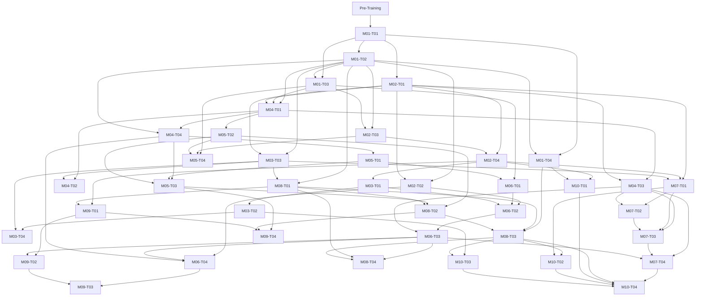

# Canonical Architecture — Advanced C for Embedded and Software Engineering

> **Document status:** Architecture baseline awaiting human review.
> **Scope:** This document defines the target curriculum only. It does not create lessons, examples, exercises, solutions, interview packs, references, source inventories, or topic directories.

## 1. Purpose and audience

`C-Programming` is a standalone C curriculum for learners who already have basic programming knowledge and need Advanced C for embedded systems, firmware architecture, Linux/POSIX user-space software, reliability, secure C, testing, debugging, technical interviews, and industrial projects.

Advanced C means understanding mechanisms, language guarantees, implementation boundaries, trade-offs, and verification evidence—not memorising difficult syntax. A learner must be able to explain a design decision, identify its risks, and validate it using the appropriate compiler, tool, platform, or target documentation.

The core curriculum intentionally excludes C++ semantics, STL, RAII, templates, Linux kernel-driver development, Yocto, AUTOSAR, board bring-up, device-specific driver implementation, and MISRA certification. They may be mentioned only to establish a boundary or application context.

## 2. C/C++ boundary and technical contexts

- `C-Programming` must be understandable independently; C++ material is neither a prerequisite nor an authority for C semantics.
- C-versus-C++ comparisons belong in the future `Language-Comparisons/` area. A C lesson may link to a comparison, but must not teach C++ as part of its canonical explanation.
- `C++-Programing/docs/C++ Notion/` is legacy C++ material. It may be used for C++ or explicit comparison work only, never as a C semantic authority.
- Every significant technical claim in a future lesson must identify one or more applicable contexts: **ISO C**, **compiler extension**, **ABI**, **ELF/object format**, **bare-metal MCU**, **RTOS**, **POSIX**, **Linux user space**, **Linux kernel**, **CPU architecture**, or **peripheral/hardware target**.
- Claims about `volatile`, atomics, barriers, sections and linker layout, interrupts, packed structs, bit-fields, aliasing, POSIX threads, secure string APIs, compiler flags, and register access require explicit context labels and the corresponding authority.

## 3. Proposed C Language Baseline

**Proposed architecture decision — awaiting human approval.**

- The primary teaching baseline is **C17**.
- Relevant **C11** features are included where required, especially atomics and supported concurrency concepts.
- **C99** compatibility notes are included because C99-era and partially compliant toolchains remain common in embedded development.
- **C23** changes are covered only as clearly labelled updates or appendices.
- Compiler extensions must always be explicitly labelled.
- POSIX APIs must never be presented as ISO C.
- Target-specific compiler, ABI, RTOS, MCU, and hardware behaviour must always be labelled.

Approval or revision of this baseline remains an open architecture decision.

## 4. Pre-Training and learner routes

Pre-Training is outside the 40 primary topics. It covers variables and basic scalar types, expressions, `if`/`switch`/loops, basic functions and parameter passing, basic arrays, basic pointer syntax, basic `struct` use, basic GCC commands, basic Make use, and basic Linux command-line use.

| Route | Learning path |
| --- | --- |
| Beginner | Pre-Training → M01 → required dependency path → M10 |
| Experienced engineer | Entry assessment → skip only demonstrated foundations → follow the required dependency DAG |
| Interview | Canonical lesson → summary → interview questions → code reading → debugging scenario → production scenario |

Basic pointer syntax belongs to Pre-Training. `M04-T01` owns advanced pointer, array-decay, pointer-arithmetic, and bounds semantics. Dynamic allocation uses pointer concepts, but advanced pointer semantics do not depend on dynamic allocation.

## 5. Source-authority policy

Technical authority is ordered as follows:

1. The published ISO C standard or the corresponding public draft.
2. Official compiler documentation for compiler-specific behaviour.
3. The POSIX specification and authoritative manual pages for POSIX APIs.
4. Official CPU, MCU, RTOS, and peripheral documentation for target-specific behaviour.
5. CERT C, BARR-C, and MISRA material handled within applicable licensing limits.
6. DevLinux curriculum and sessions as learning and practical inputs.
7. `note.md` and `Full-Embedded-C-Notes.md` as discovery and migration inputs.
8. Existing repository C lessons as legacy migration inputs.
9. C++ Notion material only for C++ or explicit comparison work.

No source may be copied blindly. Existing coverage is not proof of correctness.

### 5.1 Concise source registry

Detailed subsection mapping, confidence, claim-level verification, and migration evidence are deferred to each topic's future `SOURCE_INVENTORY` phase.

| Tag | Source path | Major heading or session | Intended use | Verification category |
| --- | --- | --- | --- | --- |
| L02 | `C++-Programing/knowledge/02-c-fundamentals.md` | `Fundamental Types`; `Scope, Linkage, Storage Duration, And Lifetime`; `Conversions And Arithmetic` | Legacy foundations input | ISO C and pedagogical rewrite |
| L03 | `C++-Programing/knowledge/03-c-memory-model.md` | `Typical Process Memory Layout`; `Dynamic Memory APIs In C`; `Alignment, Padding, And Representation` | Legacy memory input | ISO C, ABI, toolchain |
| L04 | `C++-Programing/knowledge/04-pointer-mastery.md` | `Pointers And Arrays`; `Function Pointers And Callbacks`; `Controlled Advanced Topics` | Legacy pointer/API input | ISO C |
| L05 | `C++-Programing/knowledge/05-compound-types-in-c.md` | `Structures`; `Unions And Tagged Unions`; `Bit-Fields, Packed Structures, And Binary Data` | Legacy data-representation input | ISO C, ABI, target |
| L06 | `C++-Programing/knowledge/06-advanced-c-for-embedded.md` | `Memory-Mapped I/O And volatile`; `Finite State Machines`; `Hardware Abstraction Layer Design` | Legacy embedded/firmware input | Compiler and target |
| L07 | `C++-Programing/knowledge/07-industrial-c-practices.md` | `Coding Standards`; `Static And Dynamic Analysis`; `Unit Testing And Mocking` | Legacy reliability input | Tool and external guidance |
| D0 | `C++-Programing/docs/C Advanced/C advaced outline devlinux.txt` | `Embedded C Developer`; `Chương trình học C Advanced trong Embedded` | Curriculum discovery | Pedagogical rewrite |
| D1 | `C++-Programing/docs/C Advanced/C Advacne DevLinux.txt` | `Week 1` through `Week 10` | Curriculum and lab discovery | Technical verification |
| S01 | `C++-Programing/docs/C Advanced/session-01.md` | `Assignment — Session 01: Coding Standards` | Partial exercise input | Exercise review |
| S02 | `C++-Programing/docs/C Advanced/session-02.md` | `Assignment — Session 02: Memory Layout & Stack Analysis` | Partial exercise input | Exercise and target review |
| S03 | `C++-Programing/docs/C Advanced/session-03.md` | `Assignment — session-03` | Partial exercise input | Exercise, ABI, target review |
| S04 | `C++-Programing/docs/C Advanced/session-04.md` | `Assignment — Session 04: Object-Oriented C, Memory Optimization & Code Portability` | Partial exercise input | Exercise and design review |
| S05 | `C++-Programing/docs/C Advanced/session-05.md` | `Assignment — Session 05: Advanced Pointers & Dispatch Tables` | Partial exercise input | Exercise and compiler/target review |
| S06 | `C++-Programing/docs/C Advanced/session-06.md` | `Assignment — Session 06: Embedded Design Patterns` | Partial exercise input | Exercise and design review |
| EN | `C++-Programing/docs/C Advanced/Full-Embedded-C-Notes.md` | `Embedded C — Notes & Understanding` | Topic discovery, legacy explanations, interview/exercise ideas | Technical verification required |

No `note.md` was found when this architecture was created. `Full-Embedded-C-Notes.md` is a separate non-authoritative input and is not a replacement for `note.md`.

## 6. Topic Granularity Policy

The former oversized-chapter problem must not be recreated inside topic artifacts.

1. Each topic covers one coherent concept family.
2. Each topic states included scope, explicit exclusions, and the canonical owner of excluded concepts.
3. Learning outcomes must be observable and reviewable.
4. A topic must not repeat complete prerequisite lessons.
5. Related concepts link to their canonical owners.
6. Examples demonstrate only the approved topic scope.
7. Exercises must not introduce large bodies of new semantics.
8. Interview material assesses understanding and must not become a duplicate lesson.
9. Application topics must not redefine ISO C semantics.
10. A projected primary lesson longer than approximately 700–800 lines triggers a mandatory split review.
11. This threshold is a warning, not a mechanical limit.
12. Cognitive scope and concept cohesion matter more than line count.

## 7. Status models and mandatory review gates

### 7.1 Topic lifecycle

```text
NOT_STARTED
→ SOURCE_INVENTORY
→ OUTLINE_REVIEW
→ LESSON_DRAFT
→ LESSON_REVIEW
→ EXAMPLES_DRAFT
→ EXAMPLES_REVIEW
→ EXERCISES_DRAFT
→ EXERCISES_REVIEW
→ INTERVIEW_DRAFT
→ INTERVIEW_REVIEW
→ TECHNICAL_REVIEW
→ HUMAN_REVIEW
→ APPROVED
→ LOCKED
```

Blocking or exceptional states are `REVISION_REQUIRED`, `EXERCISE_PENDING`, `INTERVIEW_PENDING`, `SOURCE_MISSING`, and `EXTERNAL_VERIFICATION_REQUIRED`.

Codex must stop at every review checkpoint. Codex stops after `EXERCISES_DRAFT` and waits for explicit human review; it must not create interview material until the exercises are explicitly approved. Codex also stops after `INTERVIEW_DRAFT` and waits for explicit human review. Completing an artifact or a command, silence, lack of feedback, or completion of prior work is not approval. Only explicit human approval authorises progression. A revision request keeps work on the current topic, and no next artifact or topic starts automatically.

`APPROVED` means the topic has passed technical and human review and may be used as an approved prerequisite. `LOCKED` means the reviewed version is frozen for a release; it may change only through an explicitly reviewed change request.

### 7.2 Independent artifact status

Topic lifecycle, artifact status, implementation status, migration labels, and exercise coverage are separate dimensions.

| Artifact | Statuses |
| --- | --- |
| Lesson | `NOT_STARTED`, `DRAFT`, `TECHNICAL_REVIEW`, `HUMAN_REVIEW`, `REVISION_REQUIRED`, `APPROVED`, `LOCKED` |
| Examples | `NOT_STARTED`, `DRAFT`, `BUILD_PENDING`, `BUILD_FAILED`, `VERIFIED`, `REVIEW_REQUIRED`, `APPROVED` |
| Exercises | `NOT_STARTED` → `SOURCE_REVIEW` → `DRAFT` → `REVIEW_REQUIRED` → `APPROVED`; `EXERCISES_REVIEW` is the mandatory topic-lifecycle checkpoint for explicit review. |
| Interview | `NOT_STARTED` → `DRAFT` → `TECHNICAL_REVIEW` → `HUMAN_REVIEW` → `REVISION_REQUIRED`/`APPROVED`; `INTERVIEW_REVIEW` is the mandatory topic-lifecycle checkpoint for explicit review. |
| Technical review | `NOT_STARTED`, `PENDING`, `PASSED`, `REVISION_REQUIRED` |
| Human review | `NOT_REQUESTED`, `PENDING`, `REVISION_REQUIRED`, `APPROVED` |

### 7.3 Exercise coverage

| Exercise source coverage | Meaning |
| --- | --- |
| `NO_EXERCISE_SOURCE` | No current source directly exercises the topic. |
| `PARTIAL_EXERCISE_COVERAGE` | Available material exercises only part of the topic outcomes. |
| `DIRECT_EXERCISE_SOURCE_AVAILABLE` | One or more imported exercises directly practice the core topic outcomes, but correctness and suitability still require review. |

Exercise source coverage is not implementation progress. Exercise artifact progress uses the independent workflow in section 7.2. `EXERCISE_PENDING` remains a blocking topic state: the topic cannot receive final approval because its required exercise artifact is not ready.

Future DevLinux sessions may update exercise coverage only. They must not change topic IDs, topic slugs, module placement, or required prerequisites.
Sessions S01–S06 are incomplete exercise inputs; their existence does not establish complete exercise coverage for any topic.

## 8. Canonical concept ownership

One concept has exactly one canonical semantic owner. Application topics link to that owner. Summary files add no new semantics, interview files create no competing definitions, exercise files do not become hidden lessons, and embedded or Linux examples do not redefine ISO C behaviour.

| Concept | Canonical semantic owner | Application topics |
| --- | --- | --- |
| `volatile` qualifier semantics | M02-T02 | M06-T02, M06-T03 |
| Function-pointer syntax | M04-T03 | M07-T03, M07-T04 |
| Callback design pattern | M07-T03 | Drivers, timers, FSM topics |
| Object representation and alignment | M04-T04 | M05-T01, M05-T03, M06-T04 |
| Effective type and aliasing | M04-T04 | M05-T03, M06-T04 |
| Endianness and explicit encoding | M05-T03 | M09-T04 |
| Bit-field language behaviour | M05-T01 | M06-T01 |
| Atomics and memory ordering | M06-T04 | M09-T03 |
| Basic Make flow | M02-T04 | M10-T01 |
| Error model | M08-T01 | Parsing, POSIX, and driver topics |

## 9. Module overview

| Module | Purpose | Entry prerequisites | Exit capability | Why it appears here |
| --- | --- | --- | --- | --- |
| M01 Industrial C Foundations | Establish language and quality mental models. | Pre-Training | Classify guarantees, risks, and diagnostics. | Required before platform claims. |
| M02 Declarations, Qualifiers and Program Organization | Turn declarations and translation structure into contracts. | M01 foundations | Organise names, qualifiers, headers, and builds. | Required before resources and modules. |
| M03 Memory Model and Resource Management | Separate ISO lifetime from platform/resource policy. | M01/M02 essentials | Analyse allocation, stack, and section risks. | Required before advanced resource decisions. |
| M04 Advanced Pointers and Object Representation | Own pointer and representation semantics. | M01/M02 essentials | Design bounded APIs and reject invalid accesses. | Required before data and firmware interfaces. |
| M05 Data Modeling and Safe Data Handling | Model data and external bytes safely. | M04 semantics | Build portable data and parsing contracts. | Required before protocol applications. |
| M06 Low-Level Embedded C | Apply C at hardware boundaries without conflation. | M02/M04/M05 essentials | Identify target-specific evidence. | Follows semantic owners. |
| M07 Firmware Architecture and C Design Patterns | Build modular, testable firmware. | Modules, resources, callbacks | Design interfaces and event-driven systems. | Follows callback/resource foundations. |
| M08 Reliability, Safety and Security | Turn semantics into failure and evidence policies. | Foundations, memory, data | Review failure paths and security risks. | Supports production work. |
| M09 Linux/POSIX C, Concurrency and Networking | Apply C in POSIX user space. | Build, resource, parsing, ordering | Design systems I/O and concurrency contracts. | Specialisation after core C. |
| M10 Engineering Quality and Industrial Projects | Integrate delivery and verification practices. | Build and reliability foundations | Verify focused C systems. | Consolidates prior knowledge. |

## 10. Forty-topic catalog

The `Required prerequisites` field is a rendering of the canonical table in section 11. It must not be maintained independently.

### M01 — Industrial C Foundations

| ID / slug | Title | Required prerequisites | Scope, outcomes, risks, and context | Concise source mapping and status |
| --- | --- | --- | --- | --- |
| M01-T01 `c-standards-and-environments` | C Standards, Dialects and Environments | `Pre-Training` | C editions, hosted/freestanding, and implementation limits; classify code by edition and environment. Excludes ABI. Risk: treating a compiler dialect as ISO C. Context: ISO C, compiler. | L02 `Program Structure And main`; D1 Week 1; legacy input. `NO_EXERCISE_SOURCE`; ISO C verification; `PARTIAL_LEGACY_COVERAGE`. |
| M01-T02 `abstract-machine-and-behavior` | C Abstract Machine and Behaviour Categories | M01-T01 | Defined, unspecified, implementation-defined, and undefined behaviour; evaluate required evidence. Risk: calling undefined behaviour random. Context: ISO C. | L03 `Behavior Categories`; D1 Week 1; legacy input. `NO_EXERCISE_SOURCE`; ISO C verification; `STRONG_LEGACY_COVERAGE`. |
| M01-T03 `integer-conversions-and-floating-point` | Integer Conversions and Floating Point | M01-T01, M01-T02 | Integer widths, promotions, conversions, shifts, and floating-point limits; review conversion defects. Risk: native-type assumptions. Context: ISO C, compiler. | L02 `Fundamental Types`, `Conversions And Arithmetic`; D1 Week 1/8. `NO_EXERCISE_SOURCE`; ISO C verification; `STRONG_LEGACY_COVERAGE`. |
| M01-T04 `coding-standards-and-diagnostics` | Coding Standards and Compiler Diagnostics | M01-T01, M01-T02 | Coding policy, warnings, deviations, and diagnostic limits; configure and interpret diagnostics. Risk: warning-free equals correct. Context: compiler, CERT/BARR/MISRA policy. | L07 `Coding Standards`; S01 applies selected coding rules only. `PARTIAL_EXERCISE_COVERAGE`; tool/guidance verification; `PARTIAL_LEGACY_COVERAGE`. |

### M02 — Declarations, Qualifiers and Program Organization

| ID / slug | Title | Required prerequisites | Scope, outcomes, risks, and context | Concise source mapping and status |
| --- | --- | --- | --- | --- |
| M02-T01 `scope-linkage-and-storage-duration` | Scope, Linkage and Storage Duration | M01-T01 | Scope, linkage, lifetime, and storage duration; design visibility contracts. Risk: treating every `static` as the same concept. Context: ISO C. | L02 `Scope, Linkage, Storage Duration, And Lifetime`; L06 `const, restrict, static, And extern`. S01 coding references do not directly exercise these outcomes. `NO_EXERCISE_SOURCE`; ISO C verification; `STRONG_LEGACY_COVERAGE`. |
| M02-T02 `qualifiers-and-atomic-overview` | Qualifiers and Atomic Overview | M01-T02, M02-T01 | `const`, `volatile`, `restrict`, and `_Atomic` overview; distinguish guarantees from non-guarantees. Risk: volatile as a lock. Context: ISO C, compiler, hardware application. | L02 `volatile`; L06 `Memory-Mapped I/O And volatile`; EN `The volatile Keyword`; D1 Week 5. `NO_EXERCISE_SOURCE`; compiler/target verification; `PARTIAL_LEGACY_COVERAGE`. |
| M02-T03 `preprocessor-inline-and-generic-selection` | Preprocessor, Inline and Generic Selection | M01-T02, M01-T03 | Macros, include guards, inline linkage, `_Static_assert`, and `_Generic`; choose typed versus textual abstractions. Risk: macro side effects and inline myths. Context: ISO C, compiler. | L06 `Preprocessor And Macro Design`; D1 Week 4; EN `Inline Functions`. `NO_EXERCISE_SOURCE`; ISO C verification; `PARTIAL_LEGACY_COVERAGE`. |
| M02-T04 `translation-units-headers-and-make` | Translation Units, Headers and Make | M02-T01, M02-T03 | Declarations/definitions, headers, compile/link flow, and basic Make. Risk: definitions in headers. Context: ISO C, compiler, build tool. | Legacy 01 `Build And Compilation Model`; L07 `Documentation, Build Systems, And CI`. A Makefile requirement in sessions is not direct coverage of these outcomes. `NO_EXERCISE_SOURCE`; build/tool verification; `PARTIAL_LEGACY_COVERAGE`. |

### M03 — Memory Model and Resource Management

| ID / slug | Title | Required prerequisites | Scope, outcomes, risks, and context | Concise source mapping and status |
| --- | --- | --- | --- | --- |
| M03-T01 `memory-sections-elf-and-startup` | Memory Sections, ELF and Startup | M02-T04 | ELF sections, startup copy/zero initialisation, and map-file evidence; excludes ISO object semantics. Risk: presenting BSS or stack as ISO C concepts. Context: ELF, ABI, target. | L03 `Typical Process Memory Layout`; EN `Linker Scripts`; S02 Exercise 1. `DIRECT_EXERCISE_SOURCE_AVAILABLE`; ABI/target verification; `PARTIAL_LEGACY_COVERAGE`. |
| M03-T02 `stack-frames-and-failure-analysis` | Stack Frames and Failure Analysis | M03-T01 | Calling conventions, stack use, recursion, and overflow diagnosis. Risk: a universal stack-frame layout. Context: ABI, compiler, target. | L03 `Typical Process Memory Layout`, `Common Memory Bugs`; EN `Stack Overflow`; S02 Exercise 2. `DIRECT_EXERCISE_SOURCE_AVAILABLE`; ABI/target verification; `PARTIAL_LEGACY_COVERAGE`. |
| M03-T03 `dynamic-memory-ownership-and-cleanup` | Dynamic Memory, Ownership and Cleanup | M01-T02, M02-T01 | `malloc` family, ownership, and cleanup paths. Risk: lost `realloc` ownership and double free. Context: ISO C, library. | L03 `Dynamic Memory APIs In C`, `Ownership And Cleanup`; EN `Dynamic Memory Allocation`, `Memory Leaks`. S04's static pool exercise is not direct dynamic-ownership coverage. `NO_EXERCISE_SOURCE`; ISO C verification; `STRONG_LEGACY_COVERAGE`. |
| M03-T04 `static-allocation-pools-and-determinism` | Static Allocation, Pools and Determinism | M03-T02, M03-T03 | Static and pool policy, fragmentation, and allocation bounds. Risk: assuming a pool is thread-safe. Context: ISO C, target, RTOS. | L06 `Ring Buffers`; EN `Static Memory Allocation`, `Memory Pools`; S04 Exercise 2. `DIRECT_EXERCISE_SOURCE_AVAILABLE`; target verification; `PARTIAL_LEGACY_COVERAGE`. |

### M04 — Advanced Pointers and Object Representation

| ID / slug | Title | Required prerequisites | Scope, outcomes, risks, and context | Concise source mapping and status |
| --- | --- | --- | --- | --- |
| M04-T01 `pointers-arrays-decay-and-bounds` | Pointers, Arrays, Decay and Bounds | M01-T02, M01-T03, M02-T01 | Advanced pointer states, array decay, one-past pointers, arithmetic, and bounds contracts. Basic syntax is Pre-Training; dynamic allocation is explicitly excluded. Risk: array-is-pointer. Context: ISO C. | L04 `Pointers And Arrays`, `Pointer Arithmetic And One-Past Pointers`; L05 `Arrays`; S05 Exercise 1 exercises an array-of-pointers lookup and bounds check, not the complete topic. `PARTIAL_EXERCISE_COVERAGE`; ISO C verification; `STRONG_LEGACY_COVERAGE`. |
| M04-T02 `double-pointers-void-pointers-and-generic-apis` | Double Pointers, void Pointers and Generic APIs | M04-T01, M03-T03 | `T **`, output parameters, `void *`, and generic API contracts. Risk: incompatible indirection and hidden ownership. Context: ISO C. | L04 `Pointer To Pointer`, `void *, Alignment, And Typed Access`; D1 Week 2/3. `NO_EXERCISE_SOURCE`; ISO C verification; `PARTIAL_LEGACY_COVERAGE`. |
| M04-T03 `function-pointers-callbacks-and-declarations` | Function Pointers, Callbacks and Declarations | M04-T01, M02-T01 | Function-pointer syntax, compatibility, callback context, and lifetime. Risk: invalid callback or stale context. Context: ISO C, ABI. | L04 `Function Pointers And Callbacks`; L06 `Callbacks In C`; S05 Exercise 2. `DIRECT_EXERCISE_SOURCE_AVAILABLE`; ISO C/ABI verification; `STRONG_LEGACY_COVERAGE`. |
| M04-T04 `object-representation-alignment-effective-type-and-aliasing` | Object Representation, Alignment, Effective Type and Aliasing | M04-T01, M01-T02 | Alignment, representation, effective type, and aliasing; excludes explicit byte encoding. Risk: treating packed casts as portable. Context: ISO C, ABI, CPU. | L03 `Alignment, Padding, And Representation`, `Effective type and strict aliasing`; L05 `Structure Layout`; S03 Exercise 2. `PARTIAL_EXERCISE_COVERAGE`; ISO C/ABI/target verification; `STRONG_LEGACY_COVERAGE`. |

### M05 — Data Modeling and Safe Data Handling

| ID / slug | Title | Required prerequisites | Scope, outcomes, risks, and context | Concise source mapping and status |
| --- | --- | --- | --- | --- |
| M05-T01 `structs-unions-enums-bit-fields-and-fam` | Structs, Unions, Enums, Bit-fields and Flexible Array Members | M04-T04 | Data models, union/tag invariants, enum limits, bit-field semantics, and FAM. Risk: enum-size, union-punning, and bit-field-layout assumptions. Context: ISO C, ABI. | L05 `Structures` through `Flexible Array Members`; EN `Struct, Enum, Union, Bitfields, Alignment & Padding`; S03 Exercises 3–4. `PARTIAL_EXERCISE_COVERAGE`; ISO C/ABI/target verification; `STRONG_LEGACY_COVERAGE`. |
| M05-T02 `character-arrays-string-literals-and-lifetime` | Character Arrays, String Literals and Lifetime | M04-T01 | C strings, byte buffers, literals, capacity, and lifetime. Risk: `strncpy`, literal modification, and dangling return values. Context: ISO C, library. | L05 `Character Arrays And C Strings`; L07 `Safe Strings And Secure I/O`; D1 Week 4/7. `NO_EXERCISE_SOURCE`; ISO C/library verification; `STRONG_LEGACY_COVERAGE`. |
| M05-T03 `memory-operations-byte-encoding-and-safe-parsing` | Memory Operations, Byte Encoding and Safe Parsing | M04-T04, M05-T01, M05-T02 | `memcpy`/`memmove`, explicit endian encoding, bounds, and parser contracts. Risk: native-struct serialisation. Context: ISO C, protocol, POSIX application. | L03 `Endianness And External Data`; L05 `Bit-Fields, Packed Structures, And Binary Data`; L06 `Endianness And External Representation`; S03 Exercise 1 observes endianness and S04 Exercise 3 parses a fixed buffer, but neither is complete safe parsing/protocol validation. `PARTIAL_EXERCISE_COVERAGE`; ISO C/protocol verification; `STRONG_LEGACY_COVERAGE`. |
| M05-T04 `variadic-functions-formatted-io-and-logging` | Variadic Functions, Formatted I/O and Logging | M01-T03, M02-T03, M05-T02 | `stdarg`, format contracts, bounded formatting, and logging architecture. Risk: format-string attack and truncation. Context: ISO C, library, target logging. | L06 `Variadic Functions`; L07 `Logging`; D1 Week 4. S06 contains design-pattern exercises, not a logging exercise. `NO_EXERCISE_SOURCE`; ISO C/library verification; `PARTIAL_LEGACY_COVERAGE`. |

### M06 — Low-Level Embedded C

| ID / slug | Title | Required prerequisites | Scope, outcomes, risks, and context | Concise source mapping and status |
| --- | --- | --- | --- | --- |
| M06-T01 `bitwise-programming-and-register-fields` | Bitwise Programming and Register Fields | M01-T03, M05-T01 | Masks, shifts, field updates, and application of M05-T01 bit-field rules. Risk: signed shifts and unsafe read-modify-write. Context: ISO C, hardware target. | L06 `Bitwise Operations And Masks`; EN `Bitwise Operators`; S03 Exercise 3. `PARTIAL_EXERCISE_COVERAGE`; ISO C/target verification; `STRONG_LEGACY_COVERAGE`. |
| M06-T02 `mmio-register-access-and-volatile` | MMIO, Register Access and volatile | M02-T02, M06-T01, M03-T01 | MMIO access declarations and target register rules; links to canonical `volatile` semantics. Risk: volatile as synchronisation. Context: compiler, MCU, peripheral. | L06 `Memory-Mapped I/O And volatile`; EN `Memory-Mapped I/O`; D1 Week 5. `NO_EXERCISE_SOURCE`; compiler/target verification; `PARTIAL_LEGACY_COVERAGE`. |
| M06-T03 `interrupts-reentrancy-atomicity-and-critical-sections` | Interrupts, Reentrancy, Atomicity and Critical Sections | M06-T02, M04-T03 | ISR constraints, reentrancy, and critical regions; memory ordering belongs to M06-T04. Risk: calling an allocator or logger from an ISR. Context: MCU, RTOS, compiler. | L06 `Asynchronous Handlers: Capture And Defer`; EN `Interrupts`, `Reentrant Functions`, `ISR Best Practices`; D1 Week 6. `NO_EXERCISE_SOURCE`; target verification; `PARTIAL_LEGACY_COVERAGE`. |
| M06-T04 `dma-cache-coherency-atomics-and-barriers` | DMA, Cache Coherency, Atomics and Barriers | M02-T02, M06-T03, M04-T04 | Atomic operations, memory order, compiler/CPU barriers, and DMA cache maintenance. Risk: a generic barrier recipe. Context: ISO C atomics, CPU, RTOS, hardware. | L06 `volatile versus atomic`; EN `Memory Barriers`, `Cache Coherency`; D1 Week 6. `NO_EXERCISE_SOURCE`; ISO C/compiler/target verification; `EXTERNAL_RESEARCH_REQUIRED`. |

### M07 — Firmware Architecture and C Design Patterns

| ID / slug | Title | Required prerequisites | Scope, outcomes, risks, and context | Concise source mapping and status |
| --- | --- | --- | --- | --- |
| M07-T01 `c-modules-interfaces-and-opaque-handles` | C Modules, Interfaces and Opaque Handles | M02-T01, M02-T04, M03-T03 | Public/private headers, opaque handles, and lifecycle APIs. Risk: exposing mutable implementation state. Context: ISO C, build. | L04 `Opaque handles in C`; L06 `OOP-Style C`; EN `Module & Header Architecture`; S04 Exercise 1. `DIRECT_EXERCISE_SOURCE_AVAILABLE`; design/build verification; `PARTIAL_LEGACY_COVERAGE`. |
| M07-T02 `interfaces-and-polymorphism-in-c` | Interfaces and Polymorphism in C | M07-T01, M04-T03 | Operation tables, substitutability, lifecycle, and ownership. Risk: a function table without a contract. Context: ISO C, ABI. | L06 `OOP-Style C`, `Hardware Abstraction Layer Design`; S04 Exercise 1. `DIRECT_EXERCISE_SOURCE_AVAILABLE`; design/ABI verification; `STRONG_LEGACY_COVERAGE`. |
| M07-T03 `callback-strategy-command-factory-singleton-and-adapter` | Callback, Strategy, Command, Factory, Singleton and Adapter | M04-T03, M07-T01, M07-T02 | Pattern selection for C interfaces; callback semantics remain owned by M04-T03. Risk: singleton hidden mutable state. Context: ISO C, firmware design. | L06 `Callbacks In C`, `Dispatch Tables`; S06 Exercises 1–3 cover callbacks, singleton, and command dispatch, but not the full pattern set. `PARTIAL_EXERCISE_COVERAGE`; design verification; `PARTIAL_LEGACY_COVERAGE`. |
| M07-T04 `state-machines-events-and-nonblocking-design` | State Machines, Events and Non-blocking Design | M04-T03, M07-T03, M06-T03 | FSMs, event queues, and non-blocking transitions. Risk: callback/FSM reentrancy. Context: ISO C, MCU, RTOS. | L06 `Finite State Machines`; EN `Non-Blocking Driver Design`; S06 Exercises 4–5. `DIRECT_EXERCISE_SOURCE_AVAILABLE`; target/design verification; `STRONG_LEGACY_COVERAGE`. |

### M08 — Reliability, Safety and Security

| ID / slug | Title | Required prerequisites | Scope, outcomes, risks, and context | Concise source mapping and status |
| --- | --- | --- | --- | --- |
| M08-T01 `errors-contracts-and-assertions` | Errors, Contracts and Assertions | M01-T02, M03-T03 | Error model, return contracts, and assertions. Risk: using `assert` for runtime validation. Context: ISO C, project policy. | L07 `Errors, Return Values, And Assertions`; EN `Assertions`; D1 Week 9. `NO_EXERCISE_SOURCE`; ISO C/policy verification; `STRONG_LEGACY_COVERAGE`. |
| M08-T02 `secure-c-input-validation-and-vulnerabilities` | Secure C, Input Validation and Vulnerabilities | M05-T02, M05-T03, M08-T01 | Validation, buffer/format risks, and trust boundaries. Risk: assuming a replacement API is universally safe. Context: ISO C/library, CERT, POSIX application. | L07 `Defensive Programming`, `Safe Strings And Secure I/O`; D1 Week 4; S01 validation exercises. `PARTIAL_EXERCISE_COVERAGE`; CERT/library verification; `STRONG_LEGACY_COVERAGE`. |
| M08-T03 `defensive-programming-analysis-and-compliance` | Defensive Programming, Analysis and Compliance | M01-T04, M08-T01, M08-T02 | Static/dynamic analysis, deviation evidence, and review checklists. Risk: treating a clean tool run as compliance. Context: compiler/tool, CERT/BARR/MISRA policy. | L07 `Static And Dynamic Analysis`, `Practical Industrial Workflow`; D1 Week 9. S01 applies selected rules but does not teach analysis/compliance workflow. `NO_EXERCISE_SOURCE`; tool/guidance verification; `PARTIAL_LEGACY_COVERAGE`. |
| M08-T04 `fault-handling-watchdog-recovery-and-diagnostics` | Fault Handling, Watchdog, Recovery and Field Diagnostics | M06-T03, M08-T01, M08-T03 | Failure policy, watchdogs, recovery, and field observability. Risk: treating a watchdog as a generic fix. Context: MCU, RTOS, hardware target. | EN `Watchdog Timer`, `Watchdog Implementation`, `Debugging Capabilities`; D1 Week 10. `NO_EXERCISE_SOURCE`; target verification; `EXTERNAL_RESEARCH_REQUIRED`. |

### M09 — Linux/POSIX C, Concurrency and Networking

| ID / slug | Title | Required prerequisites | Scope, outcomes, risks, and context | Concise source mapping and status |
| --- | --- | --- | --- | --- |
| M09-T01 `system-calls-file-descriptors-fcntl-and-ioctl` | System Calls, File Descriptors, fcntl and ioctl | M02-T04, M08-T01 | FD lifecycle, partial/error results, `fcntl`, and `ioctl`. Risk: treating POSIX as ISO C. Context: POSIX, Linux user space. | Legacy 16 `POSIX/Linux C API Vs Modern C++`; D1 Week 5. `NO_EXERCISE_SOURCE`; POSIX verification; `EXTERNAL_RESEARCH_REQUIRED`. |
| M09-T02 `processes-threads-and-execution-models` | Processes, Threads and Execution Models | M09-T01, M06-T03 | Process/thread lifecycle and execution contexts. Risk: transferring C11, Windows, POSIX, or RTOS guarantees. Context: POSIX, Linux user space, RTOS. | Legacy 14 `Concurrency`; D1 Week 6; EN `RTOS vs General-Purpose OS`. `NO_EXERCISE_SOURCE`; POSIX/RTOS verification; `PARTIAL_LEGACY_COVERAGE`. |
| M09-T03 `mutexes-semaphores-condition-variables-and-design` | Mutexes, Semaphores, Condition Variables and Concurrent Design | M06-T04, M09-T02 | Synchronisation contracts, invariants, and queues. Risk: assuming atomics replace design. Context: POSIX, Linux user space, RTOS. | Legacy 14 `Concurrency`; D1 Week 6; EN `Semaphores`, `Priority Inversion`. `NO_EXERCISE_SOURCE`; POSIX/RTOS verification; `EXTERNAL_RESEARCH_REQUIRED`. |
| M09-T04 `sockets-timeouts-serialization-and-protocol-safety` | Sockets, Timeouts, Serialization and Protocol Safety | M05-T03, M08-T02, M09-T01 | Socket lifecycle, partial I/O, timeouts, and framing. Risk: assuming TCP preserves messages. Context: POSIX, Linux user space, protocol. | D1 Week 8; L03 `Endianness And External Data`; EN `Endianness`. `NO_EXERCISE_SOURCE`; POSIX/protocol verification; `EXTERNAL_RESEARCH_REQUIRED`. |

### M10 — Engineering Quality and Industrial Projects

| ID / slug | Title | Required prerequisites | Scope, outcomes, risks, and context | Concise source mapping and status |
| --- | --- | --- | --- | --- |
| M10-T01 `make-cmake-cross-compilation-and-ci` | Make, CMake, Cross-compilation and CI | M02-T04, M01-T04 | Build graphs, configurations, cross builds, and CI. Risk: assuming a host build validates a target. Context: build tool, compiler, target. | L07 `Documentation, Build Systems, And CI`; D1 Week 7. `NO_EXERCISE_SOURCE`; build/tool verification; `PARTIAL_LEGACY_COVERAGE`. |
| M10-T02 `testing-mocking-coverage-fuzzing-and-integration` | Testing, Mocking, Coverage, Fuzzing and Integration | M08-T03, M07-T01 | Test seams, fakes/mocks, coverage, fuzzing, and integration evidence. Risk: treating coverage as correctness. Context: tooling, target. | L07 `Unit Testing And Mocking`; EN `Unit Testing in Embedded`, `Fuzzing`; D1 Week 7. `NO_EXERCISE_SOURCE`; tool/target verification; `PARTIAL_LEGACY_COVERAGE`. |
| M10-T03 `gdb-sanitizers-valgrind-tracing-and-profiling` | GDB, Sanitizers, Valgrind, Tracing and Profiling | M03-T02, M08-T03 | Debugger, sanitizer, tracing, and profiling evidence/limits. Risk: assuming tool support on the target. Context: compiler/tool, Linux user space, target. | L03 `Debugging Workflow`; L07 `Debugging And Verification`; D1 Week 9; EN `Common Debugging Techniques`. `NO_EXERCISE_SOURCE`; tool/target verification; `PARTIAL_LEGACY_COVERAGE`. |
| M10-T04 `capstone-code-review-and-standards-audit` | Industrial Capstone, Code Review and Standards Audit | M07-T04, M08-T03, M10-T01, M10-T02, M10-T03 | An incremental project, review evidence, and standards audit. Risk: creating an unreviewed bulk rewrite. Context: project policy, target. | L07 `Practical Industrial Workflow`; D1 Week 10; EN `Exercises`. `NO_EXERCISE_SOURCE`; project/target verification; `EXTERNAL_RESEARCH_REQUIRED`. |

## 11. Canonical required-prerequisite table

This is the sole canonical source of direct required prerequisites. The catalog in section 10 and the Mermaid graph in section 12 are generated representations of this table and must match it exactly. `Pre-Training` is an allowed external pseudo-node, not a primary topic.

| Topic ID | Direct required prerequisites | Entry topic |
| --- | --- | --- |
| M01-T01 | `Pre-Training` | Yes |
| M01-T02 | M01-T01 | No |
| M01-T03 | M01-T01, M01-T02 | No |
| M01-T04 | M01-T01, M01-T02 | No |
| M02-T01 | M01-T01 | No |
| M02-T02 | M01-T02, M02-T01 | No |
| M02-T03 | M01-T02, M01-T03 | No |
| M02-T04 | M02-T01, M02-T03 | No |
| M03-T01 | M02-T04 | No |
| M03-T02 | M03-T01 | No |
| M03-T03 | M01-T02, M02-T01 | No |
| M03-T04 | M03-T02, M03-T03 | No |
| M04-T01 | M01-T02, M01-T03, M02-T01 | No |
| M04-T02 | M04-T01, M03-T03 | No |
| M04-T03 | M04-T01, M02-T01 | No |
| M04-T04 | M04-T01, M01-T02 | No |
| M05-T01 | M04-T04 | No |
| M05-T02 | M04-T01 | No |
| M05-T03 | M04-T04, M05-T01, M05-T02 | No |
| M05-T04 | M01-T03, M02-T03, M05-T02 | No |
| M06-T01 | M01-T03, M05-T01 | No |
| M06-T02 | M02-T02, M06-T01, M03-T01 | No |
| M06-T03 | M06-T02, M04-T03 | No |
| M06-T04 | M02-T02, M06-T03, M04-T04 | No |
| M07-T01 | M02-T01, M02-T04, M03-T03 | No |
| M07-T02 | M07-T01, M04-T03 | No |
| M07-T03 | M04-T03, M07-T01, M07-T02 | No |
| M07-T04 | M04-T03, M07-T03, M06-T03 | No |
| M08-T01 | M01-T02, M03-T03 | No |
| M08-T02 | M05-T02, M05-T03, M08-T01 | No |
| M08-T03 | M01-T04, M08-T01, M08-T02 | No |
| M08-T04 | M06-T03, M08-T01, M08-T03 | No |
| M09-T01 | M02-T04, M08-T01 | No |
| M09-T02 | M09-T01, M06-T03 | No |
| M09-T03 | M06-T04, M09-T02 | No |
| M09-T04 | M05-T03, M08-T02, M09-T01 | No |
| M10-T01 | M02-T04, M01-T04 | No |
| M10-T02 | M08-T03, M07-T01 | No |
| M10-T03 | M03-T02, M08-T03 | No |
| M10-T04 | M07-T04, M08-T03, M10-T01, M10-T02, M10-T03 | No |

## 12. Required dependency graph

Only direct required prerequisites appear below. Recommended and related relationships are non-blocking and are excluded from this DAG.



Any architecture change must extract section 11 into an adjacency list and run a topological sort. Validation must reject topic-count errors, duplicate IDs/slugs/edges, missing or unknown prerequisites, self-dependencies, Mermaid/table mismatch, and cycles.

## 13. Future topic artifact contract

```text
topics/<module>/<topic-slug>/
├── lesson.md
├── summary.md
├── examples/
├── exercises.md
├── solutions/
├── interview.md
└── references.md
```

| Artifact | Contract |
| --- | --- |
| `lesson.md` | Canonical explanation with objectives, prerequisites, mental model, formal concept, why the behaviour exists, standard guarantees, behaviour categories, compiler/platform boundaries, correct and incorrect examples with failure analysis, embedded and Linux/software applications where relevant, debugging/verification, industrial guidance, summary, and links to related artifacts. |
| `summary.md` | Review-only material; it introduces no new semantics. |
| `examples/` | Buildable, verified, context-labelled code. Unsafe or undefined-behaviour examples are isolated and clearly labelled. |
| `exercises.md` | Problem statements without embedded solutions, including objective, prerequisites, constraints, build requirements, acceptance criteria, expected behaviour, references, and context assumptions. |
| `solutions/` | Separate, reviewed solutions. |
| `interview.md` | Assessment-only material: junior, middle, senior, code-reading, debugging, production scenarios, short answers, follow-ups, and an evaluation rubric. It must not reproduce the complete lesson. |
| `references.md` | Authority, source mapping, verification status, and target/toolchain assumptions. |

These artifacts must not be created during the architecture phase.

## 14. Migration policy

Legacy material is migrated section by section, not file by file. Every migrated section records its source. No blind copying or bulk generation is allowed, and no duplicate is deleted before an approved canonical replacement exists.

Migration labels may be combined: `KEEP`, `MOVE_C`, `MOVE_CPP`, `MOVE_COMPARISON`, `SPLIT`, `REWRITE`, `VERIFY`, `DELETE_DUPLICATE`, and `ARCHIVE`.

New-topic implementation status is separate: `NEW`, `PARTIAL_LEGACY_COVERAGE`, `STRONG_LEGACY_COVERAGE`, and `EXTERNAL_RESEARCH_REQUIRED`.

## 15. Sequential pilots and stop rule

The pilots are fixed and sequential:

1. `M04-T01-pointers-arrays-decay-and-bounds`.
2. `M06-T02-mmio-register-access-and-volatile`, only after Pilot 1 is explicitly approved.
3. `M05-T03-memory-operations-byte-encoding-and-safe-parsing`, only after Pilot 2 is explicitly approved.

After architecture approval, the first content task may create only Pilot 1's source inventory and detailed outline. It must not create the Pilot 1 lesson in that same task. This architecture patch does not authorise Pilot 1.

## 16. Open technical questions requiring later verification

- Approve or revise the proposed C17/C11/C99/C23 baseline.
- Confirm `volatile` access and ordering explanations for the selected compiler and target.
- Confirm packed-layout, bit-field ABI, and unaligned-access portability claims.
- Confirm effective-type, aliasing, and pointer-provenance wording.
- Keep ELF/section/startup statements distinct from ISO C semantics.
- Confirm C11 threads versus POSIX/RTOS availability and guarantees.
- Confirm secure-string API availability and portability.
- Confirm MISRA licensing, rule-use, and compliance-evidence boundaries.
