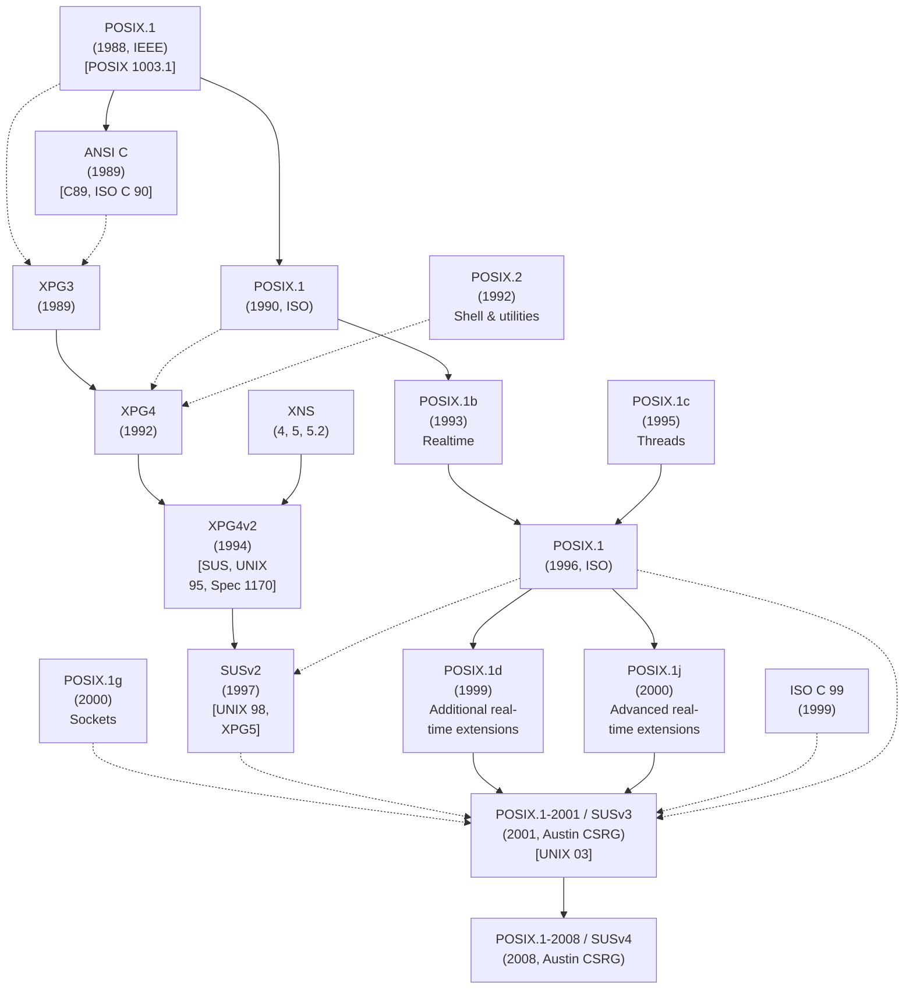

## Chapter 1
# **HISTORY AND STANDARDS**

Linux is a member of the UNIX family of operating systems. In computing terms, UNIX has a long history. The first part of this chapter provides a brief outline of that history. We begin with a description of the origins of the UNIX system and the C programming language, and then consider the two key currents that led to the Linux system as it exists today: the GNU project and the development of the Linux kernel.

One of the notable features of the UNIX system is that its development was not controlled by a single vendor or organization. Rather, many groups, both commercial and noncommercial, contributed to its evolution. This history resulted in many innovative features being added to UNIX, but also had the negative consequence that UNIX implementations diverged over time, so that writing applications that worked on all UNIX implementations became increasingly difficult. This led to a drive for standardization of UNIX implementations, which we discuss in the second part of this chapter.

> Two definitions of the term UNIX are in common use. One of these denotes operating systems that have passed the official conformance tests for the Single UNIX Specification and thus are officially granted the right to be branded as "UNIX" by The Open Group (the holders of the UNIX trademark). At the time of writing, none of the free UNIX implementations (e.g., Linux and FreeBSD) has obtained this branding.

The other common meaning attached to the term UNIX denotes those systems that look and behave like classical UNIX systems (i.e., the original Bell Laboratories UNIX and its later principal offshoots, System V and BSD). By this definition, Linux is generally considered to be a UNIX system (as are the modern BSDs). Although we give close attention to the Single UNIX Specification in this book, we'll follow this second definition of UNIX, so that we'll often say things such as "Linux, like other UNIX implementations. . . ."

# **1.1 A Brief History of UNIX and C**

The first UNIX implementation was developed in 1969 (the same year that Linus Torvalds was born) by Ken Thompson at Bell Laboratories, a division of the telephone corporation, AT&T. It was written in assembler for a Digital PDP-7 minicomputer. The name UNIX was a pun on MULTICS (Multiplexed Information and Computing Service), the name of an earlier operating system project in which AT&T collaborated with Massachusetts Institute of Technology (MIT) and General Electric. (AT&T had by this time withdrawn from the project in frustration at its initial failure to develop an economically useful system.) Thompson drew several ideas for his new operating system from MULTICS, including a tree-structured file system, a separate program for interpreting commands (the shell), and the notion of files as unstructured streams of bytes.

In 1970, UNIX was rewritten in assembly language for a newly acquired Digital PDP-11 minicomputer, then a new and powerful machine. Vestiges of this PDP-11 heritage can be found in various names still used on most UNIX implementations, including Linux.

A short time later, Dennis Ritchie, one of Thompson's colleagues at Bell Laboratories and an early collaborator on UNIX, designed and implemented the C programming language. This was an evolutionary process; C followed an earlier interpreted language, B. B was initially implemented by Thompson and drew many of its ideas from a still earlier programming language named BCPL. By 1973, C had matured to a point where the UNIX kernel could be almost entirely rewritten in the new language. UNIX thus became one of the earliest operating systems to be written in a high-level language, a fact that made subsequent porting to other hardware architectures possible.

The genesis of C explains why it, and its descendant C++, have come to be used so widely as system programming languages today. Previous widely used languages were designed with other purposes in mind: FORTRAN for mathematical tasks performed by engineers and scientists; COBOL for commercial systems processing streams of record-oriented data. C filled a hitherto empty niche, and unlike FOR-TRAN and COBOL (which were designed by large committees), the design of C arose from the ideas and needs of a few individuals working toward a single goal: developing a high-level language for implementing the UNIX kernel and associated software. Like the UNIX operating system itself, C was designed by professional programmers for their own use. The resulting language was small, efficient, powerful, terse, modular, pragmatic, and coherent in its design.

#### **UNIX First through Sixth editions**

Between 1969 and 1979, UNIX went through a number of releases, known as editions. Essentially, these releases were snapshots of the evolving development version at AT&T. [Salus, 1994] notes the following dates for the first six editions of UNIX:

-  First Edition, November 1971: By this time, UNIX was running on the PDP-11 and already had a FORTRAN compiler and versions of many programs still used today, including ar, cat, chmod, chown, cp, dc, ed, find, ln, ls, mail, mkdir, mv, rm, sh, su, and who.
-  Second Edition, June 1972: By this time, UNIX was installed on ten machines within AT&T.
-  Third Edition, February 1973: This edition included a C compiler and the first implementation of pipes.
-  Fourth Edition, November 1973: This was the first version to be almost totally written in C.
-  Fifth Edition, June 1974: By this time, UNIX was installed on more than 50 systems.
-  Sixth Edition, May 1975: This was the first edition to be widely used outside AT&T.

Over the period of these releases, the use and reputation of UNIX began to spread, first within AT&T, and then beyond. An important contribution to this growing awareness was the publication of a paper on UNIX in the widely read journal Communications of the ACM ([Ritchie & Thompson, 1974]).

At this time, AT&T held a government-sanctioned monopoly on the US telephone system. The terms of AT&T's agreement with the US government prevented it from selling software, which meant that it could not sell UNIX as a product. Instead, beginning in 1974 with Fifth Edition, and especially with Sixth Edition, AT&T licensed UNIX for use in universities for a nominal distribution fee. The university distributions included documentation and the kernel source code (about 10,000 lines at the time).

AT&T's release of UNIX into universities greatly contributed to the popularity and use of the operating system, and by 1977, UNIX was running at some 500 sites, including 125 universities in the United States and several other countries. UNIX offered universities an interactive multiuser operating system that was cheap yet powerful, at a time when commercial operating systems were very expensive. It also gave university computer science departments the source code of a real operating system, which they could modify and offer to their students to learn from and experiment with. Some of these students, armed with UNIX knowledge, became UNIX evangelists. Others went on to found or join the multitude of startup companies selling inexpensive computer workstations running the easily ported UNIX operating system.

### **The birth of BSD and System V**

January 1979 saw the release of Seventh Edition UNIX, which improved the reliability of the system and provided an enhanced file system. This release also contained a number of new tools, including awk, make, sed, tar, uucp, the Bourne shell, and a FORTRAN 77 compiler. The release of Seventh Edition is also significant because, from this point, UNIX diverged into two important variants: BSD and System V, whose origins we now briefly describe.

Thompson spent the 1975/1976 academic year as a visiting professor at the University of California at Berkeley, the university from which he had graduated. There, he worked with several graduate students, adding many new features to UNIX. (One of these students, Bill Joy, subsequently went on to cofound Sun Microsystems, an early entry in the UNIX workstation market.) Over time, many new tools and features were developed at Berkeley, including the C shell, the vi editor, an improved file system (the Berkeley Fast File System), sendmail, a Pascal compiler, and virtual memory management on the new Digital VAX architecture.

Under the name Berkeley Software Distribution (BSD), this version of UNIX, including its source code, came to be widely distributed. The first full distribution was 3BSD in December 1979. (Earlier releases from Berkeley—BSD and 2BSD were distributions of new tools produced at Berkeley, rather than complete UNIX distributions.)

In 1983, the Computer Systems Research Group at the University of California at Berkeley released 4.2BSD. This release was significant because it contained a complete TCP/IP implementation, including the sockets application programming interface (API) and a variety of networking tools. 4.2BSD and its predecessor 4.1BSD became widely distributed within universities around the world. They also formed the basis for SunOS (first released in 1983), the UNIX variant sold by Sun. Other significant BSD releases were 4.3BSD, in 1986, and the final release, 4.4BSD, in 1993.

> The very first ports of the UNIX system to hardware other than the PDP-11 occurred during 1977 and 1978, when Dennis Ritchie and Steve Johnson ported it to the Interdata 8/32 and Richard Miller at the University of Wollongong in Australia simultaneously ported it to the Interdata 7/32. The Berkeley Digital VAX port was based on an earlier (1978) port by John Reiser and Tom London. Known as 32V, this port was essentially the same as Seventh Edition for the PDP-11, except for the larger address space and wider data types.

In the meantime, US antitrust legislation forced the breakup of AT&T (legal maneuvers began in the mid-1970s, and the breakup became effective in 1982), with the consequence that, since it no longer held a monopoly on the telephone system, the company was permitted to market UNIX. This resulted in the release of System III (three) in 1981. System III was produced by AT&T's UNIX Support Group (USG), which employed many hundreds of developers to enhance UNIX and develop UNIX applications (notably, document preparation packages and software development tools). The first release of System V (five) followed in 1983, and a series of releases led to the definitive System V Release 4 (SVR4) in 1989, by which time System V had incorporated many features from BSD, including networking facilities. System V was licensed to a variety of commercial vendors, who used it as the basis of their UNIX implementations.

Thus, in addition to the various BSD distributions spreading through academia, by the late 1980s, UNIX was available in a range of commercial implementations on various hardware. These implementations included Sun's SunOS and later Solaris, Digital's Ultrix and OSF/1 (nowadays, after a series of renamings and acquisitions, HP Tru64 UNIX), IBM's AIX, Hewlett-Packard's (HP's) HP-UX, NeXT's NeXTStep, A/UX for the Apple Macintosh, and Microsoft and SCO's XENIX for the Intel x86-32 architecture. (Throughout this book, the Linux implementation for x86-32 is referred to as Linux/x86-32.) This situation was in sharp contrast to the typical proprietary hardware/operating system scenarios of the time, where each vendor produced one, or at most a few, proprietary computer chip architectures, on which they sold their own proprietary operating system(s). The proprietary nature of most vendor systems meant that purchasers were locked into one vendor. Switching to another proprietary operating system and hardware platform could become very expensive because of the need to port existing applications and retrain staff. This factor, coupled with the appearance of cheap singleuser UNIX workstations from a variety of vendors, made the portable UNIX system increasingly attractive from a commercial perspective.

# **1.2 A Brief History of Linux**

The term Linux is commonly used to refer to the entire UNIX-like operating system of which the Linux kernel forms a part. However, this is something of a misnomer, since many of the key components contained within a typical commercial Linux distribution actually originate from a project that predates the inception of Linux by several years.

## **1.2.1 The GNU Project**

In 1984, Richard Stallman, an exceptionally talented programmer who had been working at MIT, set to work on creating a "free" UNIX implementation. Stallman's outlook was a moral one, and free was defined in a legal sense, rather than a financial sense (see http://www.gnu.org/philosophy/free-sw.html). Nevertheless, the legal freedom that Stallman described carried with it the implicit consequence that software such as operating systems would be available at no or very low cost.

Stallman militated against the legal restrictions placed on proprietary operating systems by computer vendors. These restrictions meant that purchasers of computer software in general could not see the source code of the software they were buying, and they certainly could not copy, change, or redistribute it. He pointed out that such a framework encouraged programmers to compete with each other and hoard their work, rather than to cooperate and share it.

In response, Stallman started the GNU project (a recursively defined acronym for "GNU's not UNIX") to develop an entire, freely available, UNIX-like system, consisting of a kernel and all associated software packages, and encouraged others to join him. In 1985, Stallman founded the Free Software Foundation (FSF), a nonprofit organization to support the GNU project as well as the development of free software in general.

> When the GNU project was started, BSD was not free in the sense that Stallman meant. Use of BSD still required a license from AT&T, and users could not freely modify and redistribute the AT&T code that formed part of BSD.

One of the important results of the GNU project was the development of the GNU General Public License (GPL), the legal embodiment of Stallman's notion of free software. Much of the software in a Linux distribution, including the kernel, is licensed under the GPL or one of a number of similar licenses. Software licensed under the GPL must be made available in source code form, and must be freely redistributable under the terms of the GPL. Modifications to GPL-licensed software are freely permitted, but any distribution of such modified software must also be under the terms of the GPL. If the modified software is distributed in executable form, the author must also allow any recipients the option of obtaining the modified source for no more than the cost of distribution. The first version of the GPL was released in 1989. The current version of the license, version 3, was released in 2007. Version 2 of the license, released in 1991, remains in wide use, and is the license used for the Linux kernel. (Discussions of various free software licenses can be found in [St. Laurent, 2004] and [Rosen, 2005].)

The GNU project did not initially produce a working UNIX kernel, but did produce a wide range of other programs. Since these programs were designed to run on a UNIX-like operating system, they could be, and were, used on existing UNIX implementations and, in some cases, even ported to other operating systems. Among the more well-known programs produced by the GNU project are the Emacs text editor, GCC (originally the GNU C compiler, but now renamed the GNU compiler collection, comprising compilers for C, C++, and other languages), the bash shell, and glibc (the GNU C library).

By the early 1990s, the GNU project had produced a system that was virtually complete, except for one important component: a working UNIX kernel. The GNU project had started work on an ambitious kernel design, known as the GNU/HURD, based on the Mach microkernel. However, the HURD was far from being in a form that could be released. (At the time of writing, work continues on the HURD, which currently runs only on the x86-32 architecture.)

> Because a significant part of the program code that constitutes what is commonly known as the Linux system actually derives from the GNU project, Stallman prefers to use the term GNU/Linux to refer to the entire system. The question of naming (Linux versus GNU/Linux) is the source of some debate in the free software community. Since this book is primarily concerned with the API of the Linux kernel, we'll generally use the term Linux.

The stage was set. All that was required was a working kernel to go with the otherwise complete UNIX system already produced by the GNU project.

#### **1.2.2 The Linux Kernel**

In 1991, Linus Torvalds, a Finnish student at the University of Helsinki, was inspired to write an operating system for his Intel 80386 PC. In the course of his studies, Torvalds had come into contact with Minix, a small UNIX-like operating system kernel developed in the mid-1980s by Andrew Tanenbaum, a university professor in Holland. Tanenbaum made Minix, complete with source code, available as a tool for teaching operating system design in university courses. The Minix kernel could be built and run on a 386 system. However, since its primary purpose was as a teaching tool, it was designed to be largely independent of the hardware architecture, and it did not take full advantage of the 386 processor's capabilities.

Torvalds therefore started on a project to create an efficient, full-featured UNIX kernel to run on the 386. Over a few months, Torvalds developed a basic kernel that allowed him to compile and run various GNU programs. Then, on October 5, 1991, Torvalds requested the help of other programmers, making the following now much-quoted announcement of version 0.02 of his kernel in the comp.os.minix Usenet newsgroup:

> Do you pine for the nice days of Minix-1.1, when men were men and wrote their own device drivers? Are you without a nice project and just dying to cut your teeth on a OS you can try to modify for your needs? Are you finding it frustrating when everything works on Minix? No more all-nighters to get a nifty program working? Then this post might be just for you. As I mentioned a month ago, I'm working on a free version of a Minix-look-alike for AT-386 computers. It has finally reached the stage where it's even usable (though may not be depending on what you want), and I am willing to put out the sources for wider distribution. It is just version 0.02 . . . but I've successfully run bash, gcc, gnu-make, gnu-sed, compress, etc. under it.

Following a time-honored tradition of giving UNIX clones names ending with the letter X, the kernel was (eventually) baptized Linux. Initially, Linux was placed under a more restrictive license, but Torvalds soon made it available under the GNU GPL.

The call for support proved effective. Other programmers joined Torvalds in the development of Linux, adding various features, such as an improved file system, networking support, device drivers, and multiprocessor support. By March 1994, the developers were able to release version 1.0. Linux 1.2 appeared in March 1995, Linux 2.0 in June 1996, Linux 2.2 in January 1999, and Linux 2.4 in January 2001. Work on the 2.5 development kernel began in November 2001, and led to the release of Linux 2.6 in December 2003.

#### **An aside: the BSDs**

It is worth noting that another free UNIX was already available for the x86-32 during the early 1990s. Bill and Lynne Jolitz had developed a port of the already mature BSD system for the x86-32, known as 386/BSD. This port was based on the BSD Net/2 release ( June 1991), a version of the 4.3BSD source code in which all remaining proprietary AT&T source code had either been replaced or, in the case of six source code files that could not be trivially rewritten, removed. The Jolitzes ported the Net/2 code to x86-32, rewrote the missing source files, and made the first release (version 0.0) of 386/BSD in February 1992.

After an initial wave of success and popularity, work on 386/BSD lagged for various reasons. In the face of an increasingly large backlog of patches, two alternative development groups soon appeared, creating their own releases based on 386/BSD: NetBSD, which emphasizes portability to a wide range of hardware platforms, and FreeBSD, which emphasizes performance and is the most widespread of the modern BSDs. The first NetBSD release was 0.8, in April 1993. The first FreeBSD CD-ROM (version 1.0) appeared in December 1993. Another BSD, OpenBSD, appeared in 1996 (as an initial version numbered 2.0) after forking from the NetBSD project. OpenBSD emphasizes security. In mid-2003, a new BSD, DragonFly BSD, appeared after a split from FreeBSD 4.x. DragonFly BSD takes a different approach from FreeBSD 5.x with respect to design for symmetric multiprocessing (SMP) architectures.

Probably no discussion of the BSDs in the early 1990s is complete without mention of the lawsuits between UNIX System Laboratories (USL, the AT&T subsidiary spun off to develop and market UNIX) and Berkeley. In early 1992, the company Berkeley Software Design, Incorporated (BSDi, nowadays part of Wind River) began distributing a commercially supported BSD UNIX, BSD/OS, based on the Net/2 release and the Jolitzes' 386/BSD additions. BSDi distributed binaries and source code for \$995 (US dollars), and advised potential customers to use their telephone number 1-800-ITS-UNIX.

In April 1992, USL filed suit against BSDi in an attempt to prevent BSDi from selling a product that USL claimed was still encumbered by proprietary USL source code and trade secrets. USL also demanded that BSDi cease using the deceptive telephone number. The suit was eventually widened to include a claim against the University of California. The court ultimately dismissed all but two of USL's claims, and a countersuit by the University of California against USL ensued, in which the university claimed that USL had not given due credit for the use of BSD code in System V.

While these suits were pending, USL was acquired by Novell, whose CEO, the late Ray Noorda, stated publicly that he would prefer to compete in the marketplace rather than in the court. Settlement was finally reached in January 1994, with the University of California being required to remove 3 of the 18,000 files in the Net/2 release, make some minor changes to a few other files, and add USL copyright notices to around 70 other files, which the university nevertheless could continue to distribute freely. This modified system was released as 4.4BSD-Lite in June 1994. (The last release from the university was 4.4BSD-Lite, Release 2 in June 1995.) At this point, the terms of the legal settlement required BSDi, FreeBSD, and NetBSD to replace their Net/2 base with the modified 4.4BSD-Lite source code. As [McKusick et al., 1996] notes, although this caused some delay in the development of the BSD derivatives, it also had the positive effect that these systems resynchronized with the three years of development work done by the university's Computer Systems Research Group since the release of Net/2.

#### **Linux kernel version numbers**

Like most free software projects, Linux follows a release-early, release-often model, so that new kernel revisions appear frequently (sometimes even daily). As the Linux user base increased, the release model was adapted to decrease disruption to existing users. Specifically, following the release of Linux 1.0, the kernel developers adopted a kernel version numbering scheme with each release numbered x.y.z: x representing a major version, y a minor version within that major version, and z a revision of the minor version (minor improvements and bug fixes).

Under this model, two kernel versions were always under development: a stable branch for use on production systems, which had an even minor version number, and a more volatile development branch, which carried the next higher odd minor version number. The theory—not always followed strictly in practice—was that all new features should be added in the current development kernel series, while new revisions in the stable kernel series should be restricted to minor improvements and bug fixes. When the current development branch was deemed suitable for release, it became the new stable branch and was assigned an even minor version number. For example, the 2.3.z development kernel branch resulted in the 2.4 stable kernel branch.

Following the 2.6 kernel release, the development model was changed. The main motivation for this change arose from problems and frustrations caused by the long intervals between stable kernel releases. (Nearly three years passed between the release of Linux 2.4.0 and 2.6.0.) There have periodically been discussions about fine-tuning this model, but the essential details have remained as follows:

-  There is no longer a separation between stable and development kernels. Each new 2.6.z release can contain new features, and goes through a life cycle that begins with the addition of new features, which are then stabilized over the course of a number of candidate release versions. When a candidate version is deemed sufficiently stable, it is released as kernel 2.6.z. Release cycles are typically about three months long.
-  Sometimes, a stable 2.6.z release may require minor patches to fix bugs or security problems. If these fixes have a sufficiently high priority, and the patches are deemed simple enough to be "obviously" correct, then, rather than waiting for the next 2.6.z release, they are applied to create a release with a number of the form 2.6.z.r, where r is a sequential number for a minor revision of this 2.6.z kernel.
-  Additional responsibility is shifted onto distribution vendors to ensure the stability of the kernel provided with a distribution.

Later chapters will sometimes note the kernel version in which a particular API change (i.e., new or modified system call) occurred. Although, prior to the 2.6.z series, most kernel changes occurred in the odd-numbered development branches, we'll generally refer to the following stable kernel version in which the change appeared, since most application developers would normally be using a stable kernel, rather than one of the development kernels. In many cases, the manual pages note the precise development kernel in which a particular feature appeared or changed.

For changes that appear in the 2.6.z kernel series, we note the precise kernel version. When we say that a feature is new in kernel 2.6, without a z revision number, we mean a feature that was implemented in the 2.5 development kernel series and first appeared in the stable kernel at version 2.6.0.

> At the time of writing, the 2.4 stable Linux kernel is still supported by maintainers who incorporate essential patches and bug fixes, and periodically release new revisions. This allows installed systems to continue to use 2.4 kernels, rather than being forced to upgrade to a new kernel series (which may entail significant work in some cases).

#### **Ports to other hardware architectures**

During the initial development of Linux, efficient implementation on the Intel 80386 was the primary goal, rather than portability to other processor architectures. However, with the increasing popularity of Linux, ports to other processor architectures began to appear, starting with an early port to the Digital Alpha chip. The list of hardware architectures to which Linux has been ported continues to grow and includes x86-64, Motorola/IBM PowerPC and PowerPC64, Sun SPARC and SPARC64 (UltraSPARC), MIPS, ARM (Acorn), IBM zSeries (formerly System/390), Intel IA-64 (Itanium; see [Mosberger & Eranian, 2002]), Hitachi SuperH, HP PA-RISC, and Motorola 68000.

#### **Linux distributions**

Precisely speaking, the term Linux refers just to the kernel developed by Linus Torvalds and others. However, the term Linux is commonly used to mean the kernel, plus a wide range of other software (tools and libraries) that together make a complete operating system. In the very early days of Linux, the user was required to assemble all of this software, create a file system, and correctly place and configure all of the software on that file system. This demanded considerable time and expertise. As a result, a market opened for Linux distributors, who created packages (distributions) to automate most of the installation process, creating a file system and installing the kernel and other required software.

The earliest distributions appeared in 1992, and included MCC Interim Linux (Manchester Computing Centre, UK), TAMU (Texas A&M University), and SLS (SoftLanding Linux System). The oldest surviving commercial distribution, Slackware, appeared in 1993. The noncommercial Debian distribution appeared at around the same time, and SUSE and Red Hat soon followed. The currently very popular Ubuntu distribution first appeared in 2004. Nowadays, many distribution companies also employ programmers who actively contribute to existing free software projects or initiate new projects.

# **1.3 Standardization**

By the late 1980s, the wide variety of available UNIX implementations also had its drawbacks. Some UNIX implementations were based on BSD, others were based on System V, and some drew features from both variants. Furthermore, each commercial vendor had added extra features to its own implementation. The consequence was that moving software and people from one UNIX implementation to another became steadily more difficult. This situation created strong pressure for standardization of the C programming language and the UNIX system, so that applications could more easily be ported from one system to another. We now look at the resulting standards.

# **1.3.1 The C Programming Language**

By the early 1980s, C had been in existence for ten years, and was implemented on a wide variety of UNIX systems and on other operating systems. Minor differences had arisen between the various implementations, in part because certain aspects of how the language should function were not detailed in the existing de facto standard for C, Kernighan and Ritchie's 1978 book, The C Programming Language. (The older C syntax described in that book is sometimes called traditional C or K&R C.) Furthermore, the appearance of C++ in 1985 highlighted certain improvements and additions that could be made to C without breaking existing programs, notably function prototypes, structure assignment, type qualifiers (const and volatile), enumeration types, and the void keyword.

These factors created a drive for C standardization that culminated in 1989 with the approval of the American National Standards Institute (ANSI) C standard (X3.159-1989), which was subsequently adopted in 1990 as an International Standards Organization (ISO) standard (ISO/IEC 9899:1990). As well as defining the syntax and semantics of C, this standard described the operation of the standard C library, which includes the stdio functions, string-handling functions, math functions, various header files, and so on. This version of C is usually known as C89 or (less commonly) ISO C90, and is fully described in the second (1988) edition of Kernighan and Ritchie's The C Programming Language.

A revision of the C standard was adopted by ISO in 1999 (ISO/IEC 9899:1999; see http://www.open-std.org/jtc1/sc22/wg14/www/standards). This standard is usually referred to as C99, and includes a range of changes to the language and its standard library. These changes include the addition of long long and Boolean data types, C++-style (//) comments, restricted pointers, and variable-length arrays. (At the time of writing, work is in progress on a further revision of the C standard, informally named C1X. The new standard is expected to be ratified in 2011.)

The C standards are independent of the details of any operating system; that is, they are not tied to the UNIX system. This means that C programs written using only the standard C library should be portable to any computer and operating system providing a C implementation.

> Historically, C89 was often called ANSI C, and this term is sometimes still used with that meaning. For example, gcc employs that meaning; its –ansi qualifier means "support all ISO C90 programs." However, we avoid this term because it is now somewhat ambiguous. Since the ANSI committee adopted the C99 revision, properly speaking, ANSI C is now C99.

## **1.3.2 The First POSIX Standards**

The term POSIX (an abbreviation of Portable Operating System Interface) refers to a group of standards developed under the auspices of the Institute of Electrical and Electronic Engineers (IEEE), specifically its Portable Application Standards Committee (PASC, http://www.pasc.org/). The goal of the PASC standards is to promote application portability at the source code level.

> The name POSIX was suggested by Richard Stallman. The final X appears because the names of most UNIX variants end in X. The standard notes that the name should be pronounced "pahz-icks," like "positive."

The most interesting of the POSIX standards for our purposes are the first POSIX standard, referred to as POSIX.1 (or, more fully, POSIX 1003.1), and the subsequent POSIX.2 standard.

#### **POSIX.1 and POSIX.2**

POSIX.1 became an IEEE standard in 1988 and, with minor revisions, was adopted as an ISO standard in 1990 (ISO/IEC 9945-1:1990). (The original POSIX standards are not available online, but can be purchased from the IEEE at http://www.ieee.org/.)

POSIX.1 was initially based on an earlier (1984) unofficial standard produced by an association of UNIX vendors called /usr/group.

POSIX.1 documents an API for a set of services that should be made available to a program by a conforming operating system. An operating system that does this can be certified as POSIX.1 conformant.

POSIX.1 is based on the UNIX system call and the C library function API, but it doesn't require any particular implementation to be associated with this interface. This means that the interface can be implemented by any operating system, not specifically a UNIX operating system. In fact, some vendors have added APIs to their proprietary operating systems that make them POSIX.1 conformant, while at the same time leaving the underlying operating system largely unchanged.

A number of extensions to the original POSIX.1 standard were also important. IEEE POSIX 1003.1b (POSIX.1b, formerly called POSIX.4 or POSIX 1003.4), ratified in 1993, contains a range of realtime extensions to the base POSIX standard. IEEE POSIX 1003.1c (POSIX.1c), ratified in 1995, is the definition of POSIX threads. In 1996, a revised version of the POSIX.1 standard (ISO/IEC 9945-1:1996) was produced, leaving the core text unchanged, but incorporating the realtime and threads extensions. IEEE POSIX 1003.1g (POSIX.1g) defined the networking APIs, including sockets. IEEE POSIX 1003.1d (POSIX.1d), ratified in 1999, and POSIX.1j, ratified in 2000, defined additional realtime extensions to the POSIX base standard.

> The POSIX.1b realtime extensions include file synchronization; asynchronous I/O; process scheduling; high-precision clocks and timers; and interprocess communication using semaphores, shared memory, and message queues. The prefix POSIX is often applied to the three interprocess communication methods to distinguish them from the similar, but older, System V semaphores, shared memory, and message queues.

A related standard, POSIX.2 (1992, ISO/IEC 9945-2:1993), standardized the shell and various UNIX utilities, including the command-line interface of the C compiler.

#### **FIPS 151-1 and FIPS 151-2**

FIPS is an abbreviation for Federal Information Processing Standard, the name of a set of standards specified by the US government for the purchase of its computer systems. In 1989, FIPS 151-1 was published. This standard was based on the 1988 IEEE POSIX.1 standard and the draft ANSI C standard. The main difference between FIPS 151-1 and POSIX.1 (1988) was that the FIPS standard required some features that POSIX.1 left as optional. Because the US government is a major purchaser of computer systems, most computer vendors ensured that their UNIX systems conformed to the FIPS 151-1 version of POSIX.1.

FIPS 151-2 aligned with the 1990 ISO edition of POSIX.1, but was otherwise unchanged. The now outdated FIPS 151-2 was withdrawn as a standard in February 2000.

# **1.3.3 X/Open Company and The Open Group**

X/Open Company was a consortium formed by an international group of computer vendors to adopt and adapt existing standards in order to produce a comprehensive, consistent set of open systems standards. It produced the X/Open Portability Guide, a series of portability guides based on the POSIX standards. The first important release of this guide was Issue 3 (XPG3) in 1989, followed by XPG4 in 1992. XPG4 was revised in 1994, which resulted in XPG4 version 2, a standard that also incorporated important parts of AT&T's System V Interface Definition Issue 3, described in [Section 1.3.7](#page-16-0). This revision was also known as Spec 1170, with 1170 referring to the number of interfaces—functions, header files, and commands defined by the standard.

When Novell, which acquired the UNIX systems business from AT&T in early 1993, later divested itself of that business, it transferred the rights to the UNIX trademark to X/Open. (The plan to make this transfer was announced in 1993, but legal requirements delayed the transfer until early 1994.) XPG4 version 2 was subsequently repackaged as the Single UNIX Specification (SUS, or sometimes SUSv1), and is also known as UNIX 95. This repackaging included XPG4 version 2, the X/Open Curses Issue 4 version 2 specification, and the X/Open Networking Services (XNS) Issue 4 specification. Version 2 of the Single UNIX Specification (SUSv2, http://www.unix.org/version2/online.html) appeared in 1997, and UNIX implementations certified against this specification can call themselves UNIX 98. (This standard is occasionally also referred to as XPG5.)

In 1996, X/Open merged with the Open Software Foundation (OSF) to form The Open Group. Nearly every company or organization involved with the UNIX system is now a member of The Open Group, which continues to develop API standards.

> OSF was one of two vendor consortia formed during the UNIX wars of the late 1980s. Among others, OSF included Digital, IBM, HP, Apollo, Bull, Nixdorf, and Siemens. OSF was formed primarily in response to the threat created by a business alliance between AT&T (the originators of UNIX) and Sun (the most powerful player in the UNIX workstation market). Consequently, AT&T, Sun, and other companies formed the rival UNIX International consortium.

## **1.3.4 SUSv3 and POSIX.1-2001**

Beginning in 1999, the IEEE, The Open Group, and the ISO/IEC Joint Technical Committee 1 collaborated in the Austin Common Standards Revision Group (CSRG, http://www.opengroup.org/austin/) with the aim of revising and consolidating the POSIX standards and the Single UNIX Specification. (The Austin Group is so named because its inaugural meeting was in Austin, Texas in September 1998.) This resulted in the ratification of POSIX 1003.1-2001, sometimes just called POSIX.1-2001, in December 2001 (subsequently approved as an ISO standard, ISO/IEC 9945:2002).

POSIX 1003.1-2001 replaces SUSv2, POSIX.1, POSIX.2, and a raft of other earlier POSIX standards. This standard is also known as the Single UNIX Specification Version 3, and we'll generally refer to it in the remainder of this book as SUSv3.

The SUSv3 base specifications consists of around 3700 pages, divided into the following four parts:

-  Base Definitions (XBD): This part contains definitions, terms, concepts, and specifications of the contents of header files. A total of 84 header file specifications are provided.
-  System Interfaces (XSH): This part begins with various useful background information. Its bulk consists of the specification of various functions (which are implemented as either system calls or library functions on specific UNIX implementations). A total of 1123 system interfaces are included in this part.
-  Shell and Utilities (XCU): This specifies the operation of the shell and various UNIX commands. A total of 160 utilities are specified in this part.
-  Rationale (XRAT): This part includes informative text and justifications relating to the earlier parts.

In addition, SUSv3 includes the X/Open CURSES Issue 4 Version 2 (XCURSES) specification, which specifies 372 functions and 3 header files for the curses screenhandling API.

In all, 1742 interfaces are specified in SUSv3. By contrast, POSIX.1-1990 (with FIPS 151-2) specified 199 interfaces, and POSIX.2-1992 specified 130 utilities.

SUSv3 is available online at http://www.unix.org/version3/online.html. UNIX implementations certified against SUSv3 can call themselves UNIX 03.

There have been various minor fixes and improvements for problems discovered since the ratification of the original SUSv3 text. These have resulted in the appearance of Technical Corrigendum Number 1, whose improvements were incorporated in a 2003 revision of SUSv3, and Technical Corrigendum Number 2, whose improvements were incorporated in a 2004 revision.

#### **POSIX conformance, XSI conformance, and the XSI extension**

Historically, the SUS (and XPG) standards deferred to the corresponding POSIX standards and were structured as functional supersets of POSIX. As well as specifying additional interfaces, the SUS standards made mandatory many of the interfaces and behaviors that were deemed optional in POSIX.

This distinction survives somewhat more subtly in POSIX 1003.1-2001, which is both an IEEE standard and an Open Group Technical Standard (i.e., as noted already, it is a consolidation of earlier POSIX and SUS standards). This document defines two levels of conformance:

-  POSIX conformance: This defines a baseline of interfaces that a conforming implementation must provide. It permits the implementation to provide other optional interfaces.
-  X/Open System Interface (XSI) conformance: To be XSI conformant, an implementation must meet all of the requirements of POSIX conformance and also must provide a number of interfaces and behaviors that are only optionally required for POSIX conformance. An implementation must reach this level of conformance in order to obtain the UNIX 03 branding from The Open Group.

The additional interfaces and behaviors required for XSI conformance are collectively known as the XSI extension. They include support for features such as threads, mmap() and munmap(), the dlopen API, resource limits, pseudoterminals, System V IPC, the syslog API, poll(), and login accounting.

In later chapters, when we talk about SUSv3 conformance, we mean XSI conformance.

> Because POSIX and SUSv3 are now part of the same document, the additional interfaces and the selection of mandatory options required for SUSv3 are indicated via the use of shading and margin markings within the document text.

#### **Unspecified and weakly specified**

Occasionally, we refer to an interface as being "unspecified" or "weakly specified" within SUSv3.

By an unspecified interface, we mean one that is not defined at all in the formal standard, although in a few cases there are background notes or rationale text that mention the interface.

Saying that an interface is weakly specified is shorthand for saying that, while the interface is included in the standard, important details are left unspecified (commonly because the committee members could not reach an agreement due to differences in existing implementations).

When using interfaces that are unspecified or weakly specified, we have few guarantees when porting applications to other UNIX implementations. Nevertheless, in a few cases, such an interface is quite consistent across implementations, and where this is so, we generally note it as such.

#### **LEGACY features**

Sometimes, we note that SUSv3 marks a specified feature as LEGACY. This term denotes a feature that is retained for compatibility with older applications, but whose limitations mean that its use should be avoided in new applications. In many cases, some other API exists that provides equivalent functionality.

## **1.3.5 SUSv4 and POSIX.1-2008**

In 2008, the Austin group completed a revision of the combined POSIX.1 and Single UNIX Specification. As with the preceding version of the standard, it consists of a base specification coupled with an XSI extension. We'll refer to this revision as SUSv4.

The changes in SUSv4 are less wide-ranging than those that occurred for SUSv3. The most significant changes are as follows:

 SUSv4 adds new specifications for a range of functions. Among the newly specified functions that we mention in this book are dirfd(), fdopendir(), fexecve(), futimens(), mkdtemp(), psignal(), strsignal(), and utimensat(). Another range of new file-related functions (e.g., openat(), described in Section 18.11) are analogs of existing functions (e.g., open()), but differ in that they interpret relative pathnames with respect to the directory referred to by an open file descriptor, rather than relative to the process's current working directory.

-  Some functions specified as options in SUSv3 become a mandatory part of the base standard in SUSv4. For example, a number of functions that were part of the XSI extension in SUSv3 become part of the base standard in SUSv4. Among the functions that become mandatory in SUSv4 are those in the dlopen API (Section 42.1), the realtime signals API (Section 22.8), the POSIX semaphore API (Chapter 53), and the POSIX timers API (Section 23.6).
-  Some functions in SUSv3 are marked as obsolete in SUSv4. These include asctime(), ctime(), ftw(), gettimeofday(), getitimer(), setitimer(), and siginterrupt().
-  Specifications of some functions that were marked as obsolete in SUSv3 are removed in SUSv4. These functions include gethostbyname(), gethostbyaddr(), and vfork().
-  Various details of existing specifications in SUSv3 are changed in SUSv4. For example, various functions are added to the list of functions that are required to be async-signal-safe (Table 21-1 on page 426).

In the remainder of this book, we note changes in SUSv4 where they are relevant to the topic being discussed.

## **1.3.6 UNIX Standards Timeline**

Figure [1-1](#page-16-1) summarizes the relationships between the various standards described in the preceding sections, and places the standards in chronological order. In this diagram, the solid lines indicate direct descent between standards, and the dashed arrows indicate cases where one standard influenced another standard, was incorporated as part of another standard, or simply deferred to another standard.

The situation with networking standards is somewhat complex. Standardization efforts in this area began in the late 1980s with the formation of the POSIX 1003.12 committee to standardize the sockets API, the X/Open Transport Interface (XTI) API (an alternative network programming API based on System V's Transport Layer Interface), and various associated APIs. The gestation of this standard occurred over several years, during which time POSIX 1003.12 was renamed POSIX 1003.1g. It was ratified in 2000.

In parallel with the development of POSIX 1003.1g, X/Open was also developing its X/Open Networking Specification (XNS). The first version of this specification, XNS Issue 4, was part of the first version of the Single UNIX Specification. It was succeeded by XNS Issue 5, which formed part of SUSv2. XNS Issue 5 was essentially the same as the then current (6.6) draft of POSIX.1g. This was followed by XNS Issue 5.2, which differed from XNS Issue 5 and the ratified POSIX.1g standard in marking the XTI API as obsolete and in including coverage of Internet Protocol version 6 (IPv6), which was being designed in the mid-1990s). XNS Issue 5.2 formed the basis for the networking material included in SUSv3, and is thus now superseded. For similar reasons, POSIX.1g was withdrawn as a standard soon after it was ratified.

**Figure 1-1:** Relationships between various UNIX and C standards

## **1.3.7 Implementation Standards**

In addition to the standards produced by independent or multiparty groups, reference is sometimes made to the two implementation standards defined by the final BSD release (4.4BSD) and AT&T's System V Release 4 (SVR4). The latter implementation standard was formalized by AT&T's publication of the System V Interface Definition (SVID). In 1989, AT&T published Issue 3 of the SVID, which defined the interface that a UNIX implementation must provide in order to be able to call itself System V Release 4. (The SVID is available online at http://www.sco.com/ developers/devspecs/.)

> Because the behavior of some system calls and library functions varies between SVR4 and BSD, many UNIX implementations provide compatibility libraries and conditional-compilation facilities that emulate the behavior of whichever UNIX flavor is not used as the base for that particular implementation (see Section 3.6.1). This eases the burden of porting an application from another UNIX implementation.

#### **1.3.8 Linux, Standards, and the Linux Standard Base**

As a general goal, Linux (i.e., kernel, glibc, and tool) development aims to conform to the various UNIX standards, especially POSIX and the Single UNIX Specification. However, at the time of writing, no Linux distributions are branded as "UNIX" by The Open Group. The problems are time and expense. Each vendor distribution would need to undergo conformance testing to obtain this branding, and it would need to repeat this testing with each new distribution release. Nevertheless, it is the de facto near-conformance to various standards that has enabled Linux to be so successful in the UNIX market.

With most commercial UNIX implementations, the same company both develops and distributes the operating system. With Linux, things are different, in that implementation is separate from distribution, and multiple organizations—both commercial and noncommercial—handle Linux distribution.

Linus Torvalds doesn't contribute to or endorse a particular Linux distribution. However, in terms of other individuals carrying out Linux development, the situation is more complex. Many developers working on the Linux kernel and on other free software projects are employed by various Linux distribution companies or work for companies (such as IBM and HP) with a strong interest in Linux. While these companies can influence the direction in which Linux moves by allocating programmer hours to certain projects, none of them controls Linux as such. And, of course, many of the other contributors to the Linux kernel and GNU projects work voluntarily.

> At the time of writing, Torvalds is employed as a fellow at the Linux Foundation (http://www.linux-foundation.org/; formerly the Open Source Development Laboratory, OSDL), a nonprofit consortium of commercial and noncommercial organizations chartered to foster the growth of Linux.

Because there are multiple Linux distributors and because the kernel implementers don't control the contents of distributions, there is no "standard" commercial Linux as such. Each Linux distributor's kernel offering is typically based on a snapshot of the mainline (i.e., the Torvalds) kernel at a particular point in time, with a number of patches applied.

These patches typically provide features that, to a greater or lesser extent, are deemed commercially desirable, and thus able to provide competitive differentiation in the marketplace. In some cases, these patches are later accepted into the mainline kernel. In fact, some new kernel features were initially developed by a distribution company, and appeared in their distribution before eventually being integrated into the mainline. For example, version 3 of the Reiserfs journaling file system was part of some Linux distributions long before it was accepted into the mainline 2.4 kernel.

The upshot of the preceding points is that there are (mostly minor) differences in the systems offered by the various Linux distribution companies. On a much smaller scale, this is reminiscent of the splits in implementations that occurred in the early years of UNIX. The Linux Standard Base (LSB) is an effort to ensure compatibility among the various Linux distributions. To do this, the LSB (http:// www.linux-foundation.org/en/LSB) develops and promotes a set of standards for Linux systems with the aim of ensuring that binary applications (i.e., compiled programs) can run on any LSB-conformant system.

> The binary portability promoted by the LSB contrasts with the source code portability promoted by POSIX. Source code portability means that we can write a C program and then successfully compile and run it on any POSIXconformant system. Binary compatibility is much more demanding and is generally not feasible across different hardware platforms. It allows us to compile a program once for a given hardware platform, and then run that compiled program on any conformant implementation running on that hardware platform. Binary portability is an essential requirement for the commercial viability of independent software vendor (ISV) applications built for Linux.

# **1.4 Summary**

The UNIX system was first implemented in 1969 on a Digital PDP-7 minicomputer by Ken Thompson at Bell Laboratories (part of AT&T). The operating system drew many ideas, as well as its punned name, from the earlier MULTICS system. By 1973, UNIX had been moved to the PDP-11 mini-computer and rewritten in C, a programming language designed and implemented at Bell Laboratories by Dennis Ritchie. Legally prevented from selling UNIX, AT&T instead distributed the complete system to universities for a nominal charge. This distribution included source code, and became very popular within universities, since it provided a cheap operating system whose code could be studied and modified by computer science academics and students.

The University of California at Berkeley played a key role in the development of the UNIX system. There, Ken Thompson and a number of graduate students extended the operating system. By 1979, the University was producing its own UNIX distribution, BSD. This distribution became widespread in academia and formed the basis for several commercial implementations.

Meanwhile, the breakup of the AT&T monopoly permitted the company to sell the UNIX system. This resulted in the other major variant of UNIX, System V, which also formed the basis for several commercial implementations.

Two different currents led to the development of (GNU/) Linux. One of these was the GNU project, founded by Richard Stallman. By the late 1980s, the GNU project had produced an almost complete, freely distributable UNIX implementation. The one part lacking was a working kernel. In 1991, inspired by the Minix kernel written by Andrew Tanenbaum, Linus Torvalds produced a working UNIX kernel for the Intel x86-32 architecture. Torvalds invited other programmers to join him in improving the kernel. Many programmers did so, and, over time, Linux was extended and ported to a wide variety of hardware architectures.

The portability problems that arose from the variations in UNIX and C implementations that existed by the late 1980s created a strong pressure for standardization. The C language was standardized in 1989 (C89), and a revised standard was produced in 1999 (C99). The first attempt to standardize the operating system interface yielded POSIX.1, ratified as an IEEE standard in 1988, and as an ISO standard in 1990. During the 1990s, further standards were drafted, including various versions of the Single UNIX Specification. In 2001, the combined POSIX 1003.1-2001 and SUSv3 standard was ratified. This standard consolidates and extends various earlier POSIX standards and earlier versions of the Single UNIX Specification. In 2008, a less wide-ranging revision of the standard was completed, yielding the combined POSIX 1003.1-2008 and SUSv4 standard.

Unlike most commercial UNIX implementations, Linux separates implementation from distribution. Consequently, there is no single "official" Linux distribution. Each Linux distributor's offering consists of a snapshot of the current stable kernel, with various patches applied. The LSB develops and promotes a set of standards for Linux systems with the aim of ensuring binary application compatibility across Linux distributions, so that compiled applications should be able to run on any LSB-conformant system running on the same hardware.

#### **Further information**

Further information about UNIX history and standards can be found in [Ritchie, 1984], [McKusick et al., 1996], [McKusick & Neville-Neil, 2005], [Libes & Ressler, 1989], [Garfinkel et al., 2003], [Stevens & Rago, 2005], [Stevens, 1999], [Quartermann & Wilhelm, 1993], [Goodheart & Cox, 1994], and [McKusick, 1999].

[Salus, 1994] is a detailed history of UNIX, from which much of the information at the beginning of this chapter was drawn. [Salus, 2008] provides a short history of Linux and other free software projects. Many details of the history of UNIX can also be found in the online book History of UNIX, written by Ronda Hauben. This book is available at http://www.dei.isep.ipp.pt/~acc/docs/unix.html. An extremely detailed timeline showing the releases of various UNIX implementations can be found at http://www.levenez.com/unix/.

[ Josey, 2004] provides an overview of the history of the UNIX system and the development of SUSv3, guidance on how to use the specification, summary tables of the interfaces in SUSv3, and migration guides for the transitions from SUSv2 to SUSv3 and C89 to C99.

As well as providing software and documentation, the GNU web site (http:// www.gnu.org/) contains a number of philosophical papers on the subject of free software. [Williams, 2002] is a biography of Richard Stallman.

Torvalds provides his own account of the development of Linux in [Torvalds & Diamond, 2001].

