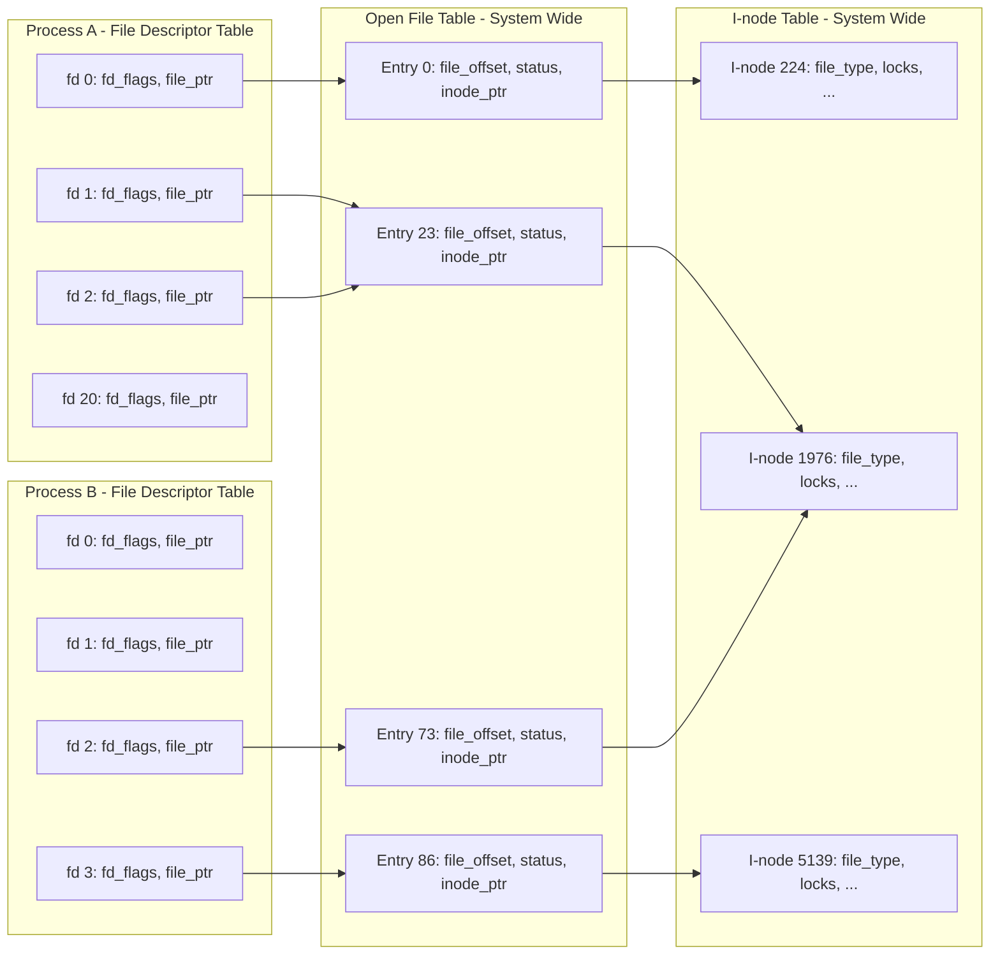

## Chapter 5
# <span id="page-68-0"></span>**FILE I/O: FURTHER DETAILS**

In this chapter, we extend the discussion of file I/O that we started in the previous chapter.

In continuing the discussion of the open() system call, we explain the concept of atomicity—the notion that the actions performed by a system call are executed as a single uninterruptible step. This is a necessary requirement for the correct operation of many system calls.

We introduce another file-related system call, the multipurpose fcntl(), and show one of its uses: fetching and setting open file status flags.

Next, we look at the kernel data structures used to represent file descriptors and open files. Understanding the relationship between these structures clarifies some of the subtleties of file I/O discussed in subsequent chapters. Building on this model, we then explain how to duplicate file descriptors.

We then consider some system calls that provide extended read and write functionality. These system calls allow us to perform I/O at a specific location in a file without changing the file offset, and to transfer data to and from multiple buffers in a program.

We briefly introduce the concept of nonblocking I/O, and describe some extensions provided to support I/O on very large files.

Since temporary files are used by many system programs, we'll also look at some library functions that allow us to create and use temporary files with randomly generated unique names.

## <span id="page-69-2"></span>**5.1 Atomicity and Race Conditions**

<span id="page-69-0"></span>Atomicity is a concept that we'll encounter repeatedly when discussing the operation of system calls. All system calls are executed atomically. By this, we mean that the kernel guarantees that all of the steps in a system call are completed as a single operation, without being interrupted by another process or thread.

Atomicity is essential to the successful completion of some operations. In particular, it allows us to avoid race conditions (sometimes known as race hazards). A race condition is a situation where the result produced by two processes (or threads) operating on shared resources depends in an unexpected way on the relative order in which the processes gain access to the CPU(s).

In the next few pages, we look at two situations involving file I/O where race conditions occur, and show how these conditions are eliminated through the use of open() flags that guarantee the atomicity of the relevant file operations.

We revisit the topic of race conditions when we describe sigsuspend() in Section 22.9 and fork() in Section 24.4.

## **Creating a file exclusively**

In Section [4.3.1,](#page-53-0) we noted that specifying O\_EXCL in conjunction with O\_CREAT causes open() to return an error if the file already exists. This provides a way for a process to ensure that it is the creator of a file. The check on the prior existence of the file and the creation of the file are performed atomically. To see why this is important, consider the code shown in [Listing 5-1](#page-69-1), which we might resort to in the absence of the O\_EXCL flag. (In this code, we display the process ID returned by the getpid() system call, which enables us to distinguish the output of two different runs of this program.)

<span id="page-69-1"></span>**Listing 5-1:** Incorrect code to exclusively open a file

```
–––––––––––––––––––––––––––––––––––––––––––– from fileio/bad_exclusive_open.c
fd = open(argv[1], O_WRONLY); /* Open 1: check if file exists */
 if (fd != -1) { /* Open succeeded */
 printf("[PID %ld] File \"%s\" already exists\n",
 (long) getpid(), argv[1]);
 close(fd);
 } else {
 if (errno != ENOENT) { /* Failed for unexpected reason */
 errExit("open");
 } else {
 /* WINDOW FOR FAILURE */
 fd = open(argv[1], O_WRONLY | O_CREAT, S_IRUSR | S_IWUSR);
 if (fd == -1)
 errExit("open");
 printf("[PID %ld] Created file \"%s\" exclusively\n",
 (long) getpid(), argv[1]); /* MAY NOT BE TRUE! */
 }
 }
–––––––––––––––––––––––––––––––––––––––––––– from fileio/bad_exclusive_open.c
```

Aside from the long-winded use of two calls to open(), the code in [Listing 5-1](#page-69-1) also contains a bug. Suppose that when our process first called open(), the file did not exist, but by the time of the second open(), some other process had created the file. This could happen if the kernel scheduler decided that the process's time slice had expired and gave control to another process, as shown in [Figure 5-1,](#page-70-0) or if the two processes were running at the same time on a multiprocessor system. [Figure 5-1](#page-70-0) portrays the case where two processes are both executing the code shown in [List](#page-69-1)[ing 5-1.](#page-69-1) In this scenario, process A would wrongly conclude that it had created the file, since the second open() succeeds whether or not the file exists.

While the chance of the process wrongly believing it was the creator of the file is relatively small, the possibility that it may occur nevertheless renders this code unreliable. The fact that the outcome of these operations depends on the order of scheduling of the two processes means that this is a race condition.

```txt
Process A                                    Process B
    |                                            |
    |                                            |
    v                                            |
┌─────────────────────┐                         |
│ open(..., O_WRONLY) │                         |
└─────────────────────┘                         |
    |                                            |
    | open() fails                               |
    |                                            |
    |  time slice            ||    time slice    |
    |  expires               ||    begins        |
    |                        ||                  |
    ├────────────────────────||──────────────────┤
    :                                            v
    :                                    ┌─────────────────────┐
    :                                    │ open(..., O_WRONLY) │
    :                                    └─────────────────────┘
    :                                            |
    :                                            | open() fails
    :                                            |
    :                                            v
    :                                    ┌──────────────────────┐
    :                                    │ open(..., O_WRONLY   │
    :                                    │      | O_CREAT, ...) │
    :                                    └──────────────────────┘
    :                                            |
    :                                            | open() succeeds,
    :                                            | file created
    :                                            |
    :  time slice            ||    time slice    |
    :  begins                ||    ends          |
    :                        ||                  |
    ├────────────────────────||──────────────────┤
    v                                            :
┌──────────────────────┐                        :
│ open(..., O_WRONLY   │                        :
│      | O_CREAT, ...) │                        :
└──────────────────────┘                        :
    |                                            :
    | open() succeeds                            :
    v                                            :


Key:
───►  Executing on CPU
- - ►  Waiting for CPU
```

<span id="page-70-0"></span>**Figure 5-1:** Failing to exclusively create a file

To demonstrate that there is indeed a problem with this code, we could replace the commented line WINDOW FOR FAILURE in [Listing 5-1](#page-69-1) with a piece of code that creates an artificially long delay between the check for file existence and the creation of the file:

```
printf("[PID %ld] File \"%s\" doesn't exist yet\n", (long) getpid(), argv[1]);
if (argc > 2) { /* Delay between check and create */
 sleep(5); /* Suspend execution for 5 seconds */
 printf("[PID %ld] Done sleeping\n", (long) getpid());
}
```

The sleep() library function suspends the execution of a process for a specified number of seconds. We discuss this function in Section 23.4.

If we run two simultaneous instances of the program in [Listing 5-1](#page-69-1), we see that they both claim to have exclusively created the file:

```
$ ./bad_exclusive_open tfile sleep &
[PID 3317] File "tfile" doesn't exist yet
[1] 3317
$ ./bad_exclusive_open tfile
[PID 3318] File "tfile" doesn't exist yet
[PID 3318] Created file "tfile" exclusively
$ [PID 3317] Done sleeping
[PID 3317] Created file "tfile" exclusively Not true
```

In the penultimate line of the above output, we see the shell prompt mixed with output from the first instance of the test program.

Both processes claim to have created the file because the code of the first process was interrupted between the existence check and the creation of the file. Using a single open() call that specifies the O\_CREAT and O\_EXCL flags prevents this possibility by guaranteeing that the check and creation steps are carried out as a single atomic (i.e., uninterruptible) operation.

### **Appending data to a file**

A second example of the need for atomicity is when we have multiple processes appending data to the same file (e.g., a global log file). For this purpose, we might consider using a piece of code such as the following in each of our writers:

```
if (lseek(fd, 0, SEEK_END) == -1)
 errExit("lseek");
if (write(fd, buf, len) != len)
 fatal("Partial/failed write");
```

However, this code suffers the same defect as the previous example. If the first process executing the code is interrupted between the lseek() and write() calls by a second process doing the same thing, then both processes will set their file offset to the same location before writing, and when the first process is rescheduled, it will overwrite the data already written by the second process. Again, this is a race condition because the results depend on the order of scheduling of the two processes.

Avoiding this problem requires that the seek to the next byte past the end of the file and the write operation happen atomically. This is what opening a file with the O\_APPEND flag guarantees.

> Some file systems (e.g., NFS) don't support O\_APPEND. In this case, the kernel reverts to the nonatomic sequence of calls shown above, with the consequent possibility of file corruption as just described.

# **5.2 File Control Operations: fcntl()**

The fcntl() system call performs a range of control operations on an open file descriptor.

```
#include <fcntl.h>
int fcntl(int fd, int cmd, ...);
                             Return on success depends on cmd, or –1 on error
```

The cmd argument can specify a wide range of operations. We examine some of them in the following sections, and delay examination of others until later chapters.

As indicated by the ellipsis, the third argument to fcntl() can be of different types, or it can be omitted. The kernel uses the value of the cmd argument to determine the data type (if any) to expect for this argument.

# <span id="page-72-1"></span>**5.3 Open File Status Flags**

<span id="page-72-0"></span>One use of fcntl() is to retrieve or modify the access mode and open file status flags of an open file. (These are the values set by the flags argument specified in the call to open().) To retrieve these settings, we specify cmd as F\_GETFL:

```
int flags, accessMode;
flags = fcntl(fd, F_GETFL); /* Third argument is not required */
if (flags == -1)
 errExit("fcntl");
```

After the above piece of code, we could test if the file was opened for synchronized writes as follows:

```
if (flags & O_SYNC)
 printf("writes are synchronized\n");
```

SUSv3 requires that only status flags that were specified during an open() or a later fcntl() F\_SETFL should be set on an open file. However, Linux deviates from this in one respect: if an application was compiled using one of the techniques described in [Section 5.10](#page-83-1) for opening large files, then O\_LARGEFILE will always be set in the flags retrieved by F\_GETFL.

Checking the access mode of the file is slightly more complex, since the O\_RDONLY (0), O\_WRONLY (1), and O\_RDWR (2) constants don't correspond to single bits in the open file status flags. Therefore, to make this check, we mask the flags value with the constant O\_ACCMODE, and then test for equality with one of the constants:

```
accessMode = flags & O_ACCMODE;
if (accessMode == O_WRONLY || accessMode == O_RDWR)
 printf("file is writable\n");
```

We can use the fcntl() F\_SETFL command to modify some of the open file status flags. The flags that can be modified are O\_APPEND, O\_NONBLOCK, O\_NOATIME, O\_ASYNC, and O\_DIRECT. Attempts to modify other flags are ignored. (Some other UNIX implementations allow fcntl() to modify other flags, such as O\_SYNC.)

Using fcntl() to modify open file status flags is particularly useful in the following cases:

-  The file was not opened by the calling program, so that it had no control over the flags used in the open() call (e.g., the file may be one of the three standard descriptors that are opened before the program is started).
-  The file descriptor was obtained from a system call other than open(). Examples of such system calls are pipe(), which creates a pipe and returns two file descriptors referring to either end of the pipe, and socket(), which creates a socket and returns a file descriptor referring to the socket.

To modify the open file status flags, we use fcntl() to retrieve a copy of the existing flags, then modify the bits we wish to change, and finally make a further call to fcntl() to update the flags. Thus, to enable the O\_APPEND flag, we would write the following:

```
int flags;
flags = fcntl(fd, F_GETFL);
if (flags == -1)
 errExit("fcntl");
flags |= O_APPEND;
if (fcntl(fd, F_SETFL, flags) == -1)
 errExit("fcntl");
```

# **5.4 Relationship Between File Descriptors and Open Files**

<span id="page-73-0"></span>Up until now, it may have appeared that there is a one-to-one correspondence between a file descriptor and an open file. However, this is not the case. It is possible and useful—to have multiple descriptors referring to the same open file. These file descriptors may be open in the same process or in different processes.

To understand what is going on, we need to examine three data structures maintained by the kernel:

-  the per-process file descriptor table;
-  the system-wide table of open file descriptions; and
-  the file system i-node table.

For each process, the kernel maintains a table of open file descriptors. Each entry in this table records information about a single file descriptor, including:

-  a set of flags controlling the operation of the file descriptor (there is just one such flag, the close-on-exec flag, which we describe in Section 27.4); and
-  a reference to the open file description.

The kernel maintains a system-wide table of all open file descriptions. (This table is sometimes referred to as the open file table, and its entries are sometimes called open file handles.) An open file description stores all information relating to an open file, including:

 the current file offset (as updated by read() and write(), or explicitly modified using lseek());

-  status flags specified when opening the file (i.e., the flags argument to open());
-  the file access mode (read-only, write-only, or read-write, as specified in open());
-  settings relating to signal-driven I/O (Section 63.3); and
-  a reference to the i-node object for this file.

Each file system has a table of i-nodes for all files residing in the file system. The i-node structure, and file systems in general, are discussed in more detail in Chapter 14. For now, we note that the i-node for each file includes the following information:

-  file type (e.g., regular file, socket, or FIFO) and permissions;
-  a pointer to a list of locks held on this file; and
-  various properties of the file, including its size and timestamps relating to different types of file operations.

Here, we are overlooking the distinction between on-disk and in-memory representations of an i-node. The on-disk i-node records the persistent attributes of a file, such as its type, permissions, and timestamps. When a file is accessed, an in-memory copy of the i-node is created, and this version of the i-node records a count of the open file descriptions referring to the i-node and the major and minor IDs of the device from which the i-node was copied. The inmemory i-node also records various ephemeral attributes that are associated with a file while it is open, such as file locks.

[Figure 5-2](#page-74-0) illustrates the relationship between file descriptors, open file descriptions, and i-nodes. In this diagram, two processes have a number of open file descriptors.



<span id="page-74-0"></span>**Figure 5-2:** Relationship between file descriptors, open file descriptions, and i-nodes

In process A, descriptors 1 and 20 both refer to the same open file description (labeled 23). This situation may arise as a result of a call to dup(), dup2(), or fcntl() (see [Section 5.5\)](#page-75-1).

Descriptor 2 of process A and descriptor 2 of process B refer to a single open file description (73). This scenario could occur after a call to fork() (i.e., process A is the parent of process B, or vice versa), or if one process passed an open descriptor to another process using a UNIX domain socket (Section 61.13.3).

Finally, we see that descriptor 0 of process A and descriptor 3 of process B refer to different open file descriptions, but that these descriptions refer to the same i-node table entry (1976)—in other words, to the same file. This occurs because each process independently called open() for the same file. A similar situation could occur if a single process opened the same file twice.

We can draw a number of implications from the preceding discussion:

-  Two different file descriptors that refer to the same open file description share a file offset value. Therefore, if the file offset is changed via one file descriptor (as a consequence of calls to read(), write(), or lseek()), this change is visible through the other file descriptor. This applies both when the two file descriptors belong to the same process and when they belong to different processes.
-  Similar scope rules apply when retrieving and changing the open file status flags (e.g., O\_APPEND, O\_NONBLOCK, and O\_ASYNC) using the fcntl() F\_GETFL and F\_SETFL operations.
-  By contrast, the file descriptor flags (i.e., the close-on-exec flag) are private to the process and file descriptor. Modifying these flags does not affect other file descriptors in the same process or a different process.

## <span id="page-75-1"></span>**5.5 Duplicating File Descriptors**

<span id="page-75-0"></span>Using the (Bourne shell) I/O redirection syntax 2>&1 informs the shell that we wish to have standard error (file descriptor 2) redirected to the same place to which standard output (file descriptor 1) is being sent. Thus, the following command would (since the shell evaluates I/O directions from left to right) send both standard output and standard error to the file results.log:

#### \$ **./myscript > results.log 2>&1**

The shell achieves the redirection of standard error by duplicating file descriptor 2 so that it refers to the same open file description as file descriptor 1 (in the same way that descriptors 1 and 20 of process A refer to the same open file description in [Figure 5-2\)](#page-74-0). This effect can be achieved using the dup() and dup2() system calls.

Note that it is not sufficient for the shell simply to open the results.log file twice: once on descriptor 1 and once on descriptor 2. One reason for this is that the two file descriptors would not share a file offset pointer, and hence could end up overwriting each other's output. Another reason is that the file may not be a disk file. Consider the following command, which sends standard error down the same pipe as standard output:

#### \$ **./myscript 2>&1 | less**

The dup() call takes oldfd, an open file descriptor, and returns a new descriptor that refers to the same open file description. The new descriptor is guaranteed to be the lowest unused file descriptor.

```
#include <unistd.h>
int dup(int oldfd);
                          Returns (new) file descriptor on success, or –1 on error
```

Suppose we make the following call:

```
newfd = dup(1);
```

Assuming the normal situation where the shell has opened file descriptors 0, 1, and 2 on the program's behalf, and no other descriptors are in use, dup() will create the duplicate of descriptor 1 using file 3.

If we wanted the duplicate to be descriptor 2, we could use the following technique:

```
close(2); /* Frees file descriptor 2 */
newfd = dup(1); /* Should reuse file descriptor 2 */
```

This code works only if descriptor 0 was open. To make the above code simpler, and to ensure we always get the file descriptor we want, we can use dup2().

```
#include <unistd.h>
int dup2(int oldfd, int newfd);
                         Returns (new) file descriptor on success, or –1 on error
```

The dup2() system call makes a duplicate of the file descriptor given in oldfd using the descriptor number supplied in newfd. If the file descriptor specified in newfd is already open, dup2() closes it first. (Any error that occurs during this close is silently ignored; safer programming practice is to explicitly close() newfd if it is open before the call to dup2().)

We could simplify the preceding calls to close() and dup() to the following:

```
dup2(1, 2);
```

A successful dup2() call returns the number of the duplicate descriptor (i.e., the value passed in newfd).

If oldfd is not a valid file descriptor, then dup2() fails with the error EBADF and newfd is not closed. If oldfd is a valid file descriptor, and oldfd and newfd have the same value, then dup2() does nothing—newfd is not closed, and dup2() returns the newfd as its function result.

A further interface that provides some extra flexibility for duplicating file descriptors is the fcntl() F\_DUPFD operation:

```
newfd = fcntl(oldfd, F_DUPFD, startfd);
```

This call makes a duplicate of oldfd by using the lowest unused file descriptor greater than or equal to startfd. This is useful if we want a guarantee that the new descriptor (newfd) falls in a certain range of values. Calls to dup() and dup2() can always be recoded as calls to close() and fcntl(), although the former calls are more concise. (Note also that some of the errno error codes returned by dup2() and fcntl() differ, as described in the manual pages.)

From [Figure 5-2](#page-74-0), we can see that duplicate file descriptors share the same file offset value and status flags in their shared open file description. However, the new file descriptor has its own set of file descriptor flags, and its close-on-exec flag (FD\_CLOEXEC) is always turned off. The interfaces that we describe next allow explicit control of the new file descriptor's close-on-exec flag.

The dup3() system call performs the same task as dup2(), but adds an additional argument, flags, that is a bit mask that modifies the behavior of the system call.

```
#define _GNU_SOURCE
#include <unistd.h>
int dup3(int oldfd, int newfd, int flags);
                          Returns (new) file descriptor on success, or –1 on error
```

Currently, dup3() supports one flag, O\_CLOEXEC, which causes the kernel to enable the close-on-exec flag (FD\_CLOEXEC) for the new file descriptor. This flag is useful for the same reasons as the open() O\_CLOEXEC flag described in [Section 4.3.1.](#page-53-0)

The dup3() system call is new in Linux 2.6.27, and is Linux-specific.

Since Linux 2.6.24, Linux also supports an additional fcntl() operation for duplicating file descriptors: F\_DUPFD\_CLOEXEC. This flag does the same thing as F\_DUPFD, but additionally sets the close-on-exec flag (FD\_CLOEXEC) for the new file descriptor. Again, this operation is useful for the same reasons as the open() O\_CLOEXEC flag. F\_DUPFD\_CLOEXEC is not specified in SUSv3, but is specified in SUSv4.

# **5.6 File I/O at a Specified Offset: pread() and pwrite()**

The pread() and pwrite() system calls operate just like read() and write(), except that the file I/O is performed at the location specified by offset, rather than at the current file offset. The file offset is left unchanged by these calls.

```
#include <unistd.h>
ssize_t pread(int fd, void *buf, size_t count, off_t offset);
                        Returns number of bytes read, 0 on EOF, or –1 on error
ssize_t pwrite(int fd, const void *buf, size_t count, off_t offset);
                                Returns number of bytes written, or –1 on error
```

Calling pread() is equivalent to atomically performing the following calls:

```
off_t orig;
orig = lseek(fd, 0, SEEK_CUR); /* Save current offset */
lseek(fd, offset, SEEK_SET);
s = read(fd, buf, len);
lseek(fd, orig, SEEK_SET); /* Restore original file offset */
```

For both pread() and pwrite(), the file referred to by fd must be seekable (i.e., a file descriptor on which it is permissible to call lseek()).

These system calls can be particularly useful in multithreaded applications. As we'll see in Chapter 29, all of the threads in a process share the same file descriptor table. This means that the file offset for each open file is global to all threads. Using pread() or pwrite(), multiple threads can simultaneously perform I/O on the same file descriptor without being affected by changes made to the file offset by other threads. If we attempted to use lseek() plus read() (or write()) instead, then we would create a race condition similar to the one that we described when discussing the O\_APPEND flag in [Section 5.1](#page-69-2). (The pread() and pwrite() system calls can similarly be useful for avoiding race conditions in applications where multiple processes have file descriptors referring to the same open file description.)

> If we are repeatedly performing lseek() calls followed by file I/O, then the pread() and pwrite() system calls can also offer a performance advantage in some cases. This is because the cost of a single pread() (or pwrite()) system call is less than the cost of two system calls: lseek() and read() (or write()). However, the cost of system calls is usually dwarfed by the time required to actually perform I/O.

# **5.7 Scatter-Gather I/O: readv() and writev()**

The readv() and writev() system calls perform scatter-gather I/O.

```
#include <sys/uio.h>
ssize_t readv(int fd, const struct iovec *iov, int iovcnt);
                        Returns number of bytes read, 0 on EOF, or –1 on error
ssize_t writev(int fd, const struct iovec *iov, int iovcnt);
                                Returns number of bytes written, or –1 on error
```

Instead of accepting a single buffer of data to be read or written, these functions transfer multiple buffers of data in a single system call. The set of buffers to be transferred is defined by the array iov. The integer count specifies the number of elements in iov. Each element of iov is a structure of the following form:

```
struct iovec {
 void *iov_base; /* Start address of buffer */
 size_t iov_len; /* Number of bytes to transfer to/from buffer */
};
```

SUSv3 allows an implementation to place a limit on the number of elements in iov. An implementation can advertise its limit by defining IOV\_MAX in <limits.h> or at run time via the return from the call sysconf(\_SC\_IOV\_MAX). (We describe sysconf() in Section 11.2.) SUSv3 requires that this limit be at least 16. On Linux, IOV\_MAX is defined as 1024, which corresponds to the kernel's limit on the size of this vector (defined by the kernel constant UIO\_MAXIOV).

However, the glibc wrapper functions for readv() and writev() silently do some extra work. If the system call fails because iovcnt is too large, then the wrapper function temporarily allocates a single buffer large enough to hold all of the items described by iov and performs a read() or write() call (see the discussion below of how writev() could be implemented in terms of write()).

Figure 5-3 shows an example of the relationship between the iov and iovcnt arguments, and the buffers to which they refer.

```text 
iowcnt          iov
  ┌───┐    ┌────────────────────┐              ┌──────────┐
  │ 3 │    │ iov_base           │─────────────>│  buffer0 │
  └───┘    │ iov_len = len0     │<─────len0────┤          │
       [0] └────────────────────┘              └──────────┘
           ┌────────────────────┐              ┌──────────┐
           │ iov_base           │─────────────>│  buffer1 │
           │ iov_len = len1     │<─────len1────┤          │
       [1] └────────────────────┘              └──────────┘
           ┌────────────────────┐              ┌──────────────────┐
           │ iov_base           │─────────────>│     buffer2      │
           │ iov_len = len2     │<─────len2────┤                  │
       [2] └────────────────────┘              └──────────────────┘
```

**Figure 5-3:** Example of an iovec array and associated buffers

#### **Scatter input**

The readv() system call performs scatter input: it reads a contiguous sequence of bytes from the file referred to by the file descriptor fd and places ("scatters") these bytes into the buffers specified by iov. Each of the buffers, starting with the one defined by iov[0], is completely filled before readv() proceeds to the next buffer.

An important property of readv() is that it completes atomically; that is, from the point of view of the calling process, the kernel performs a single data transfer between the file referred to by fd and user memory. This means, for example, that when reading from a file, we can be sure that the range of bytes read is contiguous, even if another process (or thread) sharing the same file offset attempts to manipulate the offset at the same time as the readv() call.

On successful completion, readv() returns the number of bytes read, or 0 if end-of-file was encountered. The caller must examine this count to verify whether all requested bytes were read. If insufficient data was available, then only some of the buffers may have been filled, and the last of these may be only partially filled.

[Listing 5-2](#page-80-0) demonstrates the use of readv().

Using the prefix t\_ followed by a function name as the name of an example program (e.g., t\_readv.c in Listing [5-2\)](#page-80-0) is our way of indicating that the program primarily demonstrates the use of a single system call or library function.

```
–––––––––––––––––––––––––––––––––––––––––––––––––––––––––– fileio/t_readv.c
#include <sys/stat.h>
#include <sys/uio.h>
#include <fcntl.h>
#include "tlpi_hdr.h"
int
main(int argc, char *argv[])
{
 int fd;
 struct iovec iov[3];
 struct stat myStruct; /* First buffer */
 int x; /* Second buffer */
#define STR_SIZE 100
 char str[STR_SIZE]; /* Third buffer */
 ssize_t numRead, totRequired;
 if (argc != 2 || strcmp(argv[1], "--help") == 0)
 usageErr("%s file\n", argv[0]);
 fd = open(argv[1], O_RDONLY);
 if (fd == -1)
 errExit("open");
 totRequired = 0;
 iov[0].iov_base = &myStruct;
 iov[0].iov_len = sizeof(struct stat);
 totRequired += iov[0].iov_len;
 iov[1].iov_base = &x;
 iov[1].iov_len = sizeof(x);
 totRequired += iov[1].iov_len;
 iov[2].iov_base = str;
 iov[2].iov_len = STR_SIZE;
 totRequired += iov[2].iov_len;
 numRead = readv(fd, iov, 3);
 if (numRead == -1)
 errExit("readv");
 if (numRead < totRequired)
 printf("Read fewer bytes than requested\n");
 printf("total bytes requested: %ld; bytes read: %ld\n",
 (long) totRequired, (long) numRead);
 exit(EXIT_SUCCESS);
}
–––––––––––––––––––––––––––––––––––––––––––––––––––––––––– fileio/t_readv.c
```

#### **Gather output**

The writev() system call performs gather output. It concatenates ("gathers") data from all of the buffers specified by iov and writes them as a sequence of contiguous bytes to the file referred to by the file descriptor fd. The buffers are gathered in array order, starting with the buffer defined by iov[0].

Like readv(), writev() completes atomically, with all data being transferred in a single operation from user memory to the file referred to by fd. Thus, when writing to a regular file, we can be sure that all of the requested data is written contiguously to the file, rather than being interspersed with writes by other processes (or threads).

As with write(), a partial write is possible. Therefore, we must check the return value from writev() to see if all requested bytes were written.

The primary advantages of readv() and writev() are convenience and speed. For example, we could replace a call to writev() by either:

-  code that allocates a single large buffer, copies the data to be written from other locations in the process's address space into that buffer, and then calls write() to output the buffer; or
-  a series of write() calls that output the buffers individually.

The first of these options, while semantically equivalent to using writev(), leaves us with the inconvenience (and inefficiency) of allocating buffers and copying data in user space.

The second option is not semantically equivalent to a single call to writev(), since the write() calls are not performed atomically. Furthermore, performing a single writev() system call is cheaper than performing multiple write() calls (refer to the discussion of system calls in [Section 3.1\)](#page-22-0).

## **Performing scatter-gather I/O at a specified offset**

Linux 2.6.30 adds two new system calls that combine scatter-gather I/O functionality with the ability to perform the I/O at a specified offset: preadv() and pwritev(). These system calls are nonstandard, but are also available on the modern BSDs.

```
#define _BSD_SOURCE
#include <sys/uio.h>
ssize_t preadv(int fd, const struct iovec *iov, int iovcnt, off_t offset);
                        Returns number of bytes read, 0 on EOF, or –1 on error
ssize_t pwritev(int fd, const struct iovec *iov, int iovcnt, off_t offset);
                                Returns number of bytes written, or –1 on error
```

The preadv() and pwritev() system calls perform the same task as readv() and writev(), but perform the I/O at the file location specified by offset (like pread() and pwrite()).

These system calls are useful for applications (e.g., multithreaded applications) that want to combine the benefits of scatter-gather I/O with the ability to perform I/O at a location that is independent of the current file offset.

# **5.8 Truncating a File: truncate() and ftruncate()**

The truncate() and ftruncate() system calls set the size of a file to the value specified by length.

```
#include <unistd.h>
int truncate(const char *pathname, off_t length);
int ftruncate(int fd, off_t length);
                                         Both return 0 on success, or –1 on error
```

If the file is longer than length, the excess data is lost. If the file is currently shorter than length, it is extended by padding with a sequence of null bytes or a hole.

The difference between the two system calls lies in how the file is specified. With truncate(), the file, which must be accessible and writable, is specified as a pathname string. If pathname is a symbolic link, it is dereferenced. The ftruncate() system call takes a descriptor for a file that has been opened for writing. It doesn't change the file offset for the file.

If the length argument to ftruncate() exceeds the current file size, SUSv3 allows two possible behaviors: either the file is extended (as on Linux) or the system call returns an error. XSI-conformant systems must adopt the former behavior. SUSv3 requires that truncate() always extend the file if length is greater than the current file size.

> The truncate() system call is unique in being the only system call that can change the contents of a file without first obtaining a descriptor for the file via open() (or by some other means).

# **5.9 Nonblocking I/O**

<span id="page-82-0"></span>Specifying the O\_NONBLOCK flag when opening a file serves two purposes:

-  If the file can't be opened immediately, then open() returns an error instead of blocking. One case where open() can block is with FIFOs (Section 44.7).
-  After a successful open(), subsequent I/O operations are also nonblocking. If an I/O system call can't complete immediately, then either a partial data transfer is performed or the system call fails with one of the errors EAGAIN or EWOULDBLOCK. Which error is returned depends on the system call. On Linux, as on many UNIX implementations, these two error constants are synonymous.

Nonblocking mode can be used with devices (e.g., terminals and pseudoterminals), pipes, FIFOs, and sockets. (Because file descriptors for pipes and sockets are not obtained using open(), we must enable this flag using the fcntl() F\_SETFL operation described in [Section 5.3](#page-72-1).)

O\_NONBLOCK is generally ignored for regular files, because the kernel buffer cache ensures that I/O on regular files does not block, as described in Section 13.1. However, O\_NONBLOCK does have an effect for regular files when mandatory file locking is employed (Section 55.4).

We say more about nonblocking I/O in Section 44.9 and in Chapter 63.

Historically, System V–derived implementations provided the O\_NDELAY flag, with similar semantics to O\_NONBLOCK. The main difference was that a nonblocking write() on System V returned 0 if a write() could not be completed or if no input was available to satisfy a read(). This behavior was problematic for read() because it was indistinguishable from an end-of-file condition, and so the first POSIX.1 standard introduced O\_NONBLOCK. Some UNIX implementations continue to provide the O\_NDELAY flag with the old semantics. On Linux, the O\_NDELAY constant is defined, but it is synonymous with O\_NONBLOCK.

## <span id="page-83-1"></span>**5.10 I/O on Large Files**

<span id="page-83-0"></span>The off\_t data type used to hold a file offset is typically implemented as a signed long integer. (A signed data type is required because the value –1 is used for representing error conditions.) On 32-bit architectures (such as x86-32) this would limit the size of files to 231–1 bytes (i.e., 2 GB).

However, the capacity of disk drives long ago exceeded this limit, and thus the need arose for 32-bit UNIX implementations to handle files larger than this size. Since this is a problem common to many implementations, a consortium of UNIX vendors cooperated on the Large File Summit (LFS), to enhance the SUSv2 specification with the extra functionality required to access large files. We outline the LFS enhancements in this section. (The complete LFS specification, finalized in 1996, can be found at http://opengroup.org/platform/lfs.html.)

Linux has provided LFS support on 32-bit systems since kernel 2.4 (glibc 2.2 or later is also required). In addition, the corresponding file system must also support large files. Most native Linux file systems provide this support, but some nonnative file systems do not (notable examples are Microsoft's VFAT and NFSv2, both of which impose hard limits of 2 GB, regardless of whether the LFS extensions are employed).

> Because long integers use 64 bits on 64-bit architectures (e.g., Alpha, IA-64), these architectures generally don't suffer the limitations that the LFS enhancements were designed to address. Nevertheless, the implementation details of some native Linux file systems mean that the theoretical maximum size of a file may be less than 263–1, even on 64-bit systems. In most cases, these limits are much higher than current disk sizes, so they don't impose a practical limitation on file sizes.

We can write applications requiring LFS functionality in one of two ways:

-  Use an alternative API that supports large files. This API was designed by the LFS as a "transitional extension" to the Single UNIX Specification. Thus, this API is not required to be present on systems conforming to SUSv2 or SUSv3, but many conforming systems do provide it. This approach is now obsolete.
-  Define the \_FILE\_OFFSET\_BITS macro with the value 64 when compiling our programs. This is the preferred approach, because it allows conforming applications to obtain LFS functionality without making any source code changes.

## **The transitional LFS API**

To use the transitional LFS API, we must define the \_LARGEFILE64\_SOURCE feature test macro when compiling our program, either on the command line, or within the source file before including any header files. This API provides functions capable of handling 64-bit file sizes and offsets. These functions have the same names as their 32-bit counterparts, but have the suffix 64 appended to the function name. Among these functions are fopen64(), open64(), lseek64(), truncate64(), stat64(), mmap64(), and setrlimit64(). (We've already described some of the 32-bit counterparts of these functions; others are described in later chapters.)

In order to access a large file, we simply use the 64-bit version of the function. For example, to open a large file, we could write the following:

```
fd = open64(name, O_CREAT | O_RDWR, mode);
if (fd == -1)
 errExit("open");
```

Calling open64() is equivalent to specifying the O\_LARGEFILE flag when calling open(). Attempts to open a file larger than 2 GB by calling open() without this flag return an error.

In addition to the aforementioned functions, the transitional LFS API adds some new data types, including:

-  struct stat64: an analog of the stat structure (Section 15.1) allowing for large file sizes.
-  off64\_t: a 64-bit type for representing file offsets.

The off64\_t data type is used with (among others) the lseek64() function, as shown in Listing 5-3. This program takes two command-line arguments: the name of a file to be opened and an integer value specifying a file offset. The program opens the specified file, seeks to the given file offset, and then writes a string. The following shell session demonstrates the use of the program to seek to a very large offset in the file (greater than 10 GB) and then write some bytes:

```
$ ./large_file x 10111222333
$ ls -l x Check size of resulting file
-rw------- 1 mtk users 10111222337 Mar 4 13:34 x
```

**Listing 5-3:** Accessing large files

––––––––––––––––––––––––––––––––––––––––––––––––––––––– **fileio/large\_file.c**

```
#define _LARGEFILE64_SOURCE
#include <sys/stat.h>
#include <fcntl.h>
#include "tlpi_hdr.h"
int
main(int argc, char *argv[])
{
 int fd;
 off64_t off;
```

```
 if (argc != 3 || strcmp(argv[1], "--help") == 0)
 usageErr("%s pathname offset\n", argv[0]);
 fd = open64(argv[1], O_RDWR | O_CREAT, S_IRUSR | S_IWUSR);
 if (fd == -1)
 errExit("open64");
 off = atoll(argv[2]);
 if (lseek64(fd, off, SEEK_SET) == -1)
 errExit("lseek64");
 if (write(fd, "test", 4) == -1)
 errExit("write");
 exit(EXIT_SUCCESS);
}
––––––––––––––––––––––––––––––––––––––––––––––––––––––– fileio/large_file.c
```

#### **The \_FILE\_OFFSET\_BITS macro**

The recommended method of obtaining LFS functionality is to define the macro \_FILE\_OFFSET\_BITS with the value 64 when compiling a program. One way to do this is via a command-line option to the C compiler:

```
$ cc -D_FILE_OFFSET_BITS=64 prog.c
```

Alternatively, we can define this macro in the C source before including any header files:

```
#define _FILE_OFFSET_BITS 64
```

This automatically converts all of the relevant 32-bit functions and data types into their 64-bit counterparts. Thus, for example, calls to open() are actually converted into calls to open64(), and the off\_t data type is defined to be 64 bits long. In other words, we can recompile an existing program to handle large files without needing to make any changes to the source code.

Using \_FILE\_OFFSET\_BITS is clearly simpler than using the transitional LFS API, but this approach relies on applications being cleanly written (e.g., correctly using off\_t to declare variables holding file offsets, rather than using a native C integer type).

The \_FILE\_OFFSET\_BITS macro is not required by the LFS specification, which merely mentions this macro as an optional method of specifying the size of the off\_t data type. Some UNIX implementations use a different feature test macro to obtain this functionality.

> If we attempt to access a large file using 32-bit functions (i.e., from a program compiled without setting \_FILE\_OFFSET\_BITS to 64), then we may encounter the error EOVERFLOW. For example, this error can occur if we attempt to use the 32-bit version of stat() (Section 15.1) to retrieve information about a file whose size exceeds 2 GB.

## **Passing off\_t values to printf()**

One problem that the LFS extensions don't solve for us is how to pass off\_t values to printf() calls. In [Section 3.6.2](#page-42-0), we noted that the portable method of displaying values of one of the predefined system data types (e.g., pid\_t or uid\_t) was to cast that value to long, and use the %ld printf() specifier. However, if we are employing the LFS extensions, then this is often not sufficient for the off\_t data type, because it may be defined as a type larger than long, typically long long. Therefore, to display a value of type off\_t, we cast it to long long and use the %lld printf() specifier, as in the following:

```
#define _FILE_OFFSET_BITS 64
off_t offset; /* Will be 64 bits, the size of 'long long' */
/* Other code assigning a value to 'offset' */
printf("offset=%lld\n", (long long) offset);
```

Similar remarks also apply for the related blkcnt\_t data type, which is employed in the stat structure (described in Section 15.1).

> If we are passing function arguments of the types off\_t or stat between separately compiled modules, then we need to ensure that both modules use the same sizes for these types (i.e., either both were compiled with \_FILE\_OFFSET\_BITS set to 64 or both were compiled without this setting).

# **5.11 The /dev/fd Directory**

For each process, the kernel provides the special virtual directory /dev/fd. This directory contains filenames of the form /dev/fd/n, where n is a number corresponding to one of the open file descriptors for the process. Thus, for example, /dev/fd/0 is standard input for the process. (The /dev/fd feature is not specified by SUSv3, but several other UNIX implementations provide this feature.)

Opening one of the files in the /dev/fd directory is equivalent to duplicating the corresponding file descriptor. Thus, the following statements are equivalent:

```
fd = open("/dev/fd/1", O_WRONLY);
fd = dup(1); /* Duplicate standard output */
```

The flags argument of the open() call is interpreted, so that we should take care to specify the same access mode as was used by the original descriptor. Specifying other flags, such as O\_CREAT, is meaningless (and ignored) in this context.

> /dev/fd is actually a symbolic link to the Linux-specific /proc/self/fd directory. The latter directory is a special case of the Linux-specific /proc/PID/fd directories, each of which contains symbolic links corresponding to all of the files held open by a process.

The files in the /dev/fd directory are rarely used within programs. Their most common use is in the shell. Many user-level commands take filename arguments, and sometimes we would like to put them in a pipeline and have one of the arguments be standard input or output instead. For this purpose, some programs (e.g., diff, ed, tar, and comm) have evolved the hack of using an argument consisting of a single hyphen (-) to mean "use standard input or output (as appropriate) for this filename argument." Thus, to compare a file list from ls against a previously built file list, we might write the following:

#### \$ **ls | diff - oldfilelist**

This approach has various problems. First, it requires specific interpretation of the hyphen character on the part of each program, and many programs don't perform such interpretation; they are written to work only with filename arguments, and they have no means of specifying standard input or output as the files with which they are to work. Second, some programs instead interpret a single hyphen as a delimiter marking the end of command-line options.

Using /dev/fd eliminates these difficulties, allowing the specification of standard input, output, and error as filename arguments to any program requiring them. Thus, we can write the previous shell command as follows:

#### \$ **ls | diff /dev/fd/0 oldfilelist**

As a convenience, the names /dev/stdin, /dev/stdout, and /dev/stderr are provided as symbolic links to, respectively, /dev/fd/0, /dev/fd/1, and /dev/fd/2.

## **5.12 Creating Temporary Files**

Some programs need to create temporary files that are used only while the program is running, and these files should be removed when the program terminates. For example, many compilers create temporary files during the compilation process. The GNU C library provides a range of library functions for this purpose. (The variety is, in part, a consequence of inheritance from various other UNIX implementations.) Here, we describe two of these functions: mkstemp() and tmpfile().

The mkstemp() function generates a unique filename based on a template supplied by the caller and opens the file, returning a file descriptor that can be used with I/O system calls.

```
#include <stdlib.h>
int mkstemp(char *template);
                                Returns file descriptor on success, or –1 on error
```

The template argument takes the form of a pathname in which the last 6 characters must be XXXXXX. These 6 characters are replaced with a string that makes the filename unique, and this modified string is returned via the template argument. Because template is modified, it must be specified as a character array, rather than as a string constant.

The mkstemp() function creates the file with read and write permissions for the file owner (and no permissions for other users), and opens it with the O\_EXCL flag, guaranteeing that the caller has exclusive access to the file.

Typically, a temporary file is unlinked (deleted) soon after it is opened, using the unlink() system call (Section 18.3). Thus, we could employ mkstemp() as follows:

```
int fd;
char template[] = "/tmp/somestringXXXXXX";
fd = mkstemp(template);
if (fd == -1)
 errExit("mkstemp");
printf("Generated filename was: %s\n", template);
unlink(template); /* Name disappears immediately, but the file
 is removed only after close() */
/* Use file I/O system calls - read(), write(), and so on */
if (close(fd) == -1)
 errExit("close");
```

The tmpnam(), tempnam(), and mktemp() functions can also be used to generate unique filenames. However, these functions should be avoided because they can create security holes in an application. See the manual pages for further details on these functions.

The tmpfile() function creates a uniquely named temporary file that is opened for reading and writing. (The file is opened with the O\_EXCL flag to guard against the unlikely possibility that another process has already created a file with the same name.)

```
#include <stdio.h>
FILE *tmpfile(void);
                                 Returns file pointer on success, or NULL on error
```

On success, tmpfile() returns a file stream that can be used with the stdio library functions. The temporary file is automatically deleted when it is closed. To do this, tmpfile() makes an internal call to unlink() to remove the filename immediately after opening the file.

# **5.13 Summary**

In the course of this chapter, we introduced the concept of atomicity, which is crucial to the correct operation of some system calls. In particular, the open() O\_EXCL flag allows the caller to ensure that it is the creator of a file, and the open() O\_APPEND flag ensures that multiple processes appending data to the same file don't overwrite each other's output.

The fcntl() system call performs a variety of file control operations, including changing open file status flags and duplicating file descriptors. Duplicating file descriptors is also possible using dup() and dup2().

We looked at the relationship between file descriptors, open file descriptions, and file i-nodes, and noted that different information is associated with each of these three objects. Duplicate file descriptors refer to the same open file description, and thus share open file status flags and the file offset.

We described a number of system calls that extend the functionality of the conventional read() and write() system calls. The pread() and pwrite() system calls perform I/O at a specified file location without changing the file offset. The readv() and writev() calls perform scatter-gather I/O. The preadv() and pwritev() calls combine scatter-gather I/O functionality with the ability to perform I/O at a specified file location.

The truncate() and ftruncate() system calls can be used to decrease the size of a file, discarding the excess bytes, or to increase the size, padding with a zero-filled file hole.

We briefly introduced the concept of nonblocking I/O, and we'll return to it in later chapters.

The LFS specification defines a set of extensions that allow processes running on 32-bit systems to perform operations on files whose size is too large to be represented in 32 bits.

The numbered files in the /dev/fd virtual directory allow a process to access its own open files via file descriptor numbers, which can be particularly useful in shell commands.

The mkstemp() and tmpfile() functions allow an application to create temporary files.

# **5.14 Exercises**

- **5-1.** Modify the program in Listing 5-3 to use standard file I/O system calls (open() and lseek()) and the off\_t data type. Compile the program with the \_FILE\_OFFSET\_BITS macro set to 64, and test it to show that a large file can be successfully created.
- **5-2.** Write a program that opens an existing file for writing with the O\_APPEND flag, and then seeks to the beginning of the file before writing some data. Where does the data appear in the file? Why?
- **5-3.** This exercise is designed to demonstrate why the atomicity guaranteed by opening a file with the O\_APPEND flag is necessary. Write a program that takes up to three command-line arguments:

#### \$ **atomic\_append** *filename num-bytes* [*x*]

This file should open the specified filename (creating it if necessary) and append num-bytes bytes to the file by using write() to write a byte at a time. By default, the program should open the file with the O\_APPEND flag, but if a third command-line argument (x) is supplied, then the O\_APPEND flag should be omitted, and instead the program should perform an lseek(fd, 0, SEEK\_END) call before each write(). Run two instances of this program at the same time without the x argument to write 1 million bytes to the same file:

```
$ atomic_append f1 1000000 & atomic_append f1 1000000
```

Repeat the same steps, writing to a different file, but this time specifying the x argument:

```
$ atomic_append f2 1000000 x & atomic_append f2 1000000 x
```

List the sizes of the files f1 and f2 using ls –l and explain the difference.

- **5-4.** Implement dup() and dup2() using fcntl() and, where necessary, close(). (You may ignore the fact that dup2() and fcntl() return different errno values for some error cases.) For dup2(), remember to handle the special case where oldfd equals newfd. In this case, you should check whether oldfd is valid, which can be done by, for example, checking if fcntl(oldfd, F\_GETFL) succeeds. If oldfd is not valid, then the function should return –1 with errno set to EBADF.
- **5-5.** Write a program to verify that duplicated file descriptors share a file offset value and open file status flags.
- **5-6.** After each of the calls to write() in the following code, explain what the content of the output file would be, and why:

```
fd1 = open(file, O_RDWR | O_CREAT | O_TRUNC, S_IRUSR | S_IWUSR);
fd2 = dup(fd1);
fd3 = open(file, O_RDWR);
write(fd1, "Hello,", 6);
write(fd2, "world", 6);
lseek(fd2, 0, SEEK_SET);
write(fd1, "HELLO,", 6);
write(fd3, "Gidday", 6);
```

**5-7.** Implement readv() and writev() using read(), write(), and suitable functions from the malloc package (Section 7.1.2).

