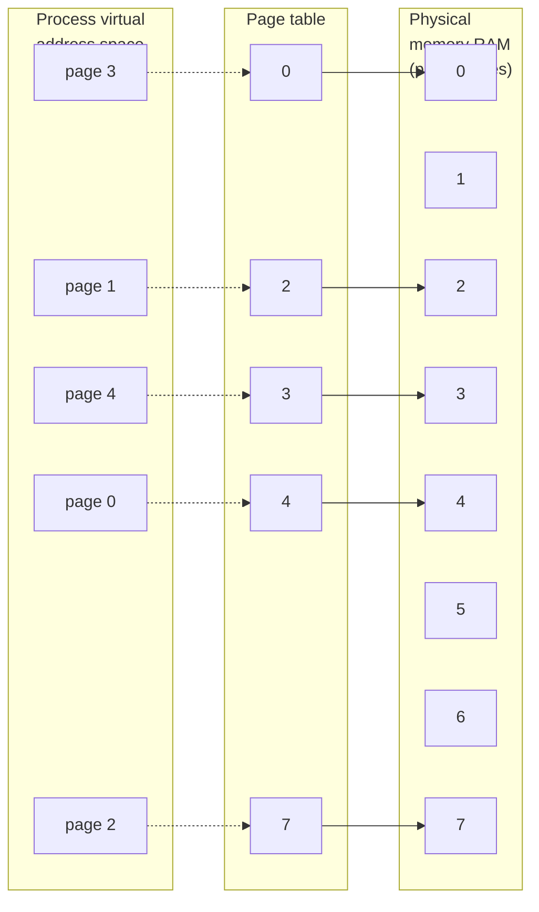

## Chapter 6
# **PROCESSES**

In this chapter, we look at the structure of a process, paying particular attention to the layout and contents of a process's virtual memory. We also examine some of the attributes of a process. In later chapters, we examine further process attributes (for example, process credentials in Chapter 9, and process priorities and scheduling in Chapter 35). In Chapters 24 to 27, we look at how processes are created, how they terminate, and how they can be made to execute new programs.

## **6.1 Processes and Programs**

A process is an instance of an executing program. In this section, we elaborate on this definition and clarify the distinction between a program and a process.

A program is a file containing a range of information that describes how to construct a process at run time. This information includes the following:

 Binary format identification: Each program file includes metainformation describing the format of the executable file. This enables the kernel to interpret the remaining information in the file. Historically, two widely used formats for UNIX executable files were the original a.out ("assembler output") format and the later, more sophisticated COFF (Common Object File Format). Nowadays, most UNIX implementations (including Linux) employ the Executable and Linking Format (ELF), which provides a number of advantages over the older formats.

-  Machine-language instructions: These encode the algorithm of the program.
-  Program entry-point address: This identifies the location of the instruction at which execution of the program should commence.
-  Data: The program file contains values used to initialize variables and also literal constants used by the program (e.g., strings).
-  Symbol and relocation tables: These describe the locations and names of functions and variables within the program. These tables are used for a variety of purposes, including debugging and run-time symbol resolution (dynamic linking).
-  Shared-library and dynamic-linking information: The program file includes fields listing the shared libraries that the program needs to use at run time and the pathname of the dynamic linker that should be used to load these libraries.
-  Other information: The program file contains various other information that describes how to construct a process.

One program may be used to construct many processes, or, put conversely, many processes may be running the same program.

We can recast the definition of a process given at the start of this section as follows: a process is an abstract entity, defined by the kernel, to which system resources are allocated in order to execute a program.

From the kernel's point of view, a process consists of user-space memory containing program code and variables used by that code, and a range of kernel data structures that maintain information about the state of the process. The information recorded in the kernel data structures includes various identifier numbers (IDs) associated with the process, virtual memory tables, the table of open file descriptors, information relating to signal delivery and handling, process resource usages and limits, the current working directory, and a host of other information.

# **6.2 Process ID and Parent Process ID**

Each process has a process ID (PID), a positive integer that uniquely identifies the process on the system. Process IDs are used and returned by a variety of system calls. For example, the kill() system call (Section 20.5) allows the caller to send a signal to a process with a specific process ID. The process ID is also useful if we need to build an identifier that is unique to a process. A common example of this is the use of the process ID as part of a process-unique filename.

The getpid() system call returns the process ID of the calling process.

```
#include <unistd.h>
pid_t getpid(void);
                                  Always successfully returns process ID of caller
```

The pid\_t data type used for the return value of getpid() is an integer type specified by SUSv3 for the purpose of storing process IDs.

With the exception of a few system processes such as init (process ID 1), there is no fixed relationship between a program and the process ID of the process that is created to run that program.

The Linux kernel limits process IDs to being less than or equal to 32,767. When a new process is created, it is assigned the next sequentially available process ID. Each time the limit of 32,767 is reached, the kernel resets its process ID counter so that process IDs are assigned starting from low integer values.

> Once it has reached 32,767, the process ID counter is reset to 300, rather than 1. This is done because many low-numbered process IDs are in permanent use by system processes and daemons, and thus time would be wasted searching for an unused process ID in this range.

> In Linux 2.4 and earlier, the process ID limit of 32,767 is defined by the kernel constant PID\_MAX. With Linux 2.6, things change. While the default upper limit for process IDs remains 32,767, this limit is adjustable via the value in the Linux-specific /proc/sys/kernel/pid\_max file (which is one greater than the maximum process ID). On 32-bit platforms, the maximum value for this file is 32,768, but on 64-bit platforms, it can be adjusted to any value up to 222 (approximately 4 million), making it possible to accommodate very large numbers of processes.

Each process has a parent—the process that created it. A process can find out the process ID of its parent using the getppid() system call.

```
#include <unistd.h>
pid_t getppid(void);
                        Always successfully returns process ID of parent of caller
```

In effect, the parent process ID attribute of each process represents the tree-like relationship of all processes on the system. The parent of each process has its own parent, and so on, going all the way back to process 1, init, the ancestor of all processes. (This "family tree" can be viewed using the pstree(1) command.)

If a child process becomes orphaned because its "birth" parent terminates, then the child is adopted by the init process, and subsequent calls to getppid() in the child return 1 (see Section 26.2).

The parent of any process can be found by looking at the Ppid field provided in the Linux-specific /proc/PID/status file.

## **6.3 Memory Layout of a Process**

The memory allocated to each process is composed of a number of parts, usually referred to as segments. These segments are as follows:

 The text segment contains the machine-language instructions of the program run by the process. The text segment is made read-only so that a process doesn't accidentally modify its own instructions via a bad pointer value. Since many processes may be running the same program, the text segment is made sharable so that a single copy of the program code can be mapped into the virtual address space of all of the processes.

-  The initialized data segment contains global and static variables that are explicitly initialized. The values of these variables are read from the executable file when the program is loaded into memory.
-  The uninitialized data segment contains global and static variables that are not explicitly initialized. Before starting the program, the system initializes all memory in this segment to 0. For historical reasons, this is often called the bss segment, a name derived from an old assembler mnemonic for "block started by symbol." The main reason for placing global and static variables that are initialized into a separate segment from those that are uninitialized is that, when a program is stored on disk, it is not necessary to allocate space for the uninitialized data. Instead, the executable merely needs to record the location and size required for the uninitialized data segment, and this space is allocated by the program loader at run time.
-  The stack is a dynamically growing and shrinking segment containing stack frames. One stack frame is allocated for each currently called function. A frame stores the function's local variables (so-called automatic variables), arguments, and return value. Stack frames are discussed in more detail in [Section 6.5](#page-8-0).
-  The heap is an area from which memory (for variables) can be dynamically allocated at run time. The top end of the heap is called the program break.

Less commonly used, but more descriptive labels for the initialized and uninitialized data segments are user-initialized data segment and zero-initialized data segment.

The size(1) command displays the size of the text, initialized data, and uninitialized data (bss) segments of a binary executable.

> The term segment as used in the main text should not be confused with the hardware segmentation used on some hardware architectures such as x86-32. Rather, segments are logical divisions of a process's virtual memory on UNIX systems. Sometimes, the term section is used instead of segment, since section is more consistent with the terminology used in the now ubiquitous ELF specification for executable file formats.

> In many places in this book, we note that a library function returns a pointer to statically allocated memory. By this, we mean that the memory is allocated in either the initialized or the uninitialized data segment. (In some cases, the library function may instead do a one-time dynamic allocation of the memory on the heap; however, this implementation detail is irrelevant to the semantic point we describe here.) It is important to be aware of cases where a library function returns information via statically allocated memory, since that memory has an existence that is independent of the function invocation, and the memory may be overwritten by subsequent calls to the same function (or in some cases, by subsequent calls to related functions). The effect of using statically allocated memory is to render a function nonreentrant. We say more about reentrancy in Sections 21.1.2 and 31.1.

Listing 6-1 shows various types of C variables along with comments indicating in which segment each variable is located. These comments assume a nonoptimizing compiler and an application binary interface in which all arguments are passed on the stack. In practice, an optimizing compiler may allocate frequently used variables in registers, or optimize a variable out of existence altogether. Furthermore, some ABIs require function arguments and the function result to be passed via registers, rather than on the stack. Nevertheless, this example serves to demonstrate the mapping between C variables and the segments of a process.

**Listing 6-1:** Locations of program variables in process memory segments

––––––––––––––––––––––––––––––––––––––––––––––––––––––– **proc/mem\_segments.c** #include <stdio.h> #include <stdlib.h> char globBuf[65536]; /\* Uninitialized data segment \*/ int primes[] = { 2, 3, 5, 7 }; /\* Initialized data segment \*/ static int square(int x) /\* Allocated in frame for square() \*/ { int result; /\* Allocated in frame for square() \*/ result = x \* x; return result; /\* Return value passed via register \*/ } static void doCalc(int val) /\* Allocated in frame for doCalc() \*/ { printf("The square of %d is %d\n", val, square(val)); if (val < 1000) { int t; /\* Allocated in frame for doCalc() \*/ t = val \* val \* val; printf("The cube of %d is %d\n", val, t); } } int main(int argc, char \*argv[]) /\* Allocated in frame for main() \*/ { static int key = 9973; /\* Initialized data segment \*/ static char mbuf[10240000]; /\* Uninitialized data segment \*/ char \*p; /\* Allocated in frame for main() \*/ p = malloc(1024); /\* Points to memory in heap segment \*/ doCalc(key); exit(EXIT\_SUCCESS); }

––––––––––––––––––––––––––––––––––––––––––––––––––––––– **proc/mem\_segments.c**

An application binary interface (ABI) is a set of rules specifying how a binary executable should exchange information with some service (e.g., the kernel or a library) at run time. Among other things, an ABI specifies which registers and stack locations are used to exchange this information, and what meaning is attached to the exchanged values. Once compiled for a particular ABI, a binary executable should be able to run on any system presenting the same ABI. This contrasts with a standardized API (such as SUSv3), which guarantees portability only for applications compiled from source code.

Although not specified in SUSv3, the C program environment on most UNIX implementations (including Linux) provides three global symbols: etext, edata, and end. These symbols can be used from within a program to obtain the addresses of the next byte past, respectively, the end of the program text, the end of the initialized data segment, and the end of the uninitialized data segment. To make use of these symbols, we must explicitly declare them, as follows:

```
extern char etext, edata, end;
 /* For example, &etext gives the address of the end
 of the program text / start of initialized data */
```

[Figure 6-1](#page-6-0) shows the arrangement of the various memory segments on the x86-32 architecture. The space labeled argv, environ at the top of this diagram holds the program command-line arguments (available in C via the argv argument of the main() function) and the process environment list (which we discuss shortly). The hexadecimal addresses shown in the diagram may vary, depending on kernel configuration and program linking options. The grayed-out areas represent invalid ranges in the process's virtual address space; that is, areas for which page tables have not been created (see the following discussion of virtual memory management).

We revisit the topic of process memory layout in a little more detail in Section 48.5, where we consider where shared memory and shared libraries are placed in a process's virtual memory.

## **6.4 Virtual Memory Management**

The previous discussion of the memory layout of a process glossed over the fact that we were talking about the layout in virtual memory. Since an understanding of virtual memory is useful later on when we look at topics such as the fork() system call, shared memory, and mapped files, we now consider some of the details.

Like most modern kernels, Linux employs a technique known as virtual memory management. The aim of this technique is to make efficient use of both the CPU and RAM (physical memory) by exploiting a property that is typical of most programs: locality of reference. Most programs demonstrate two kinds of locality:

-  Spatial locality is the tendency of a program to reference memory addresses that are near those that were recently accessed (because of sequential processing of instructions, and, sometimes, sequential processing of data structures).
-  Temporal locality is the tendency of a program to access the same memory addresses in the near future that it accessed in the recent past (because of loops).

```text
Virtual memory address
    (hexadecimal)
                        ┌─────────────────────────────────┐
                        │          Kernel                 │  /proc/kallsyms
                        │  (mapped into process           │  provides addresses of
                        │   virtual memory, but not       │◄─kernel symbols in this
                        │   accessible to program)        │  region (/proc/ksyms in
    0xC0000000          ├─────────────────────────────────┤  kernel 2.4 and earlier)
                        │       argc, environ             │
                        ├─────────────────────────────────┤
                        │          Stack                  │
                        │     (grows downwards)           │
    Top of      ───────>├ ─ ─ ─ ─ ─ ─ ─ ─ ─ ─ ─ ─ ─ ─ ─ --┤
    stack               │             │                   │
                        │             ▼                   │
                        │                                 │
                        │    (unallocated memory)         │
                        │                                 │
                        │             ▲                   │
                        │             │                   │
    Program     ───────>├ ─ ─ ─ ─ ─ ─ ─ ─ ─ ─ ─ ─ ─ ─ ─ --┤
    break               │          Heap                   │
        ▲               │     (grows upwards)             │
        │               ├─────────────────────────────────┤◄─── &end
        │               │  Uninitialized data (bss)       │
        │               ├─────────────────────────────────┤◄─── &edata
Increasing virtual      │     Initialized data            │
addresses               ├─────────────────────────────────┤◄─── &etext
        │               │    Text (program code)          │
        │               │                                 │
                        ├─────────────────────────────────┤
    0x08048000          │                                 │
                        │                                 │
    0x00000000          └─────────────────────────────────┘
```

<span id="page-6-0"></span>**Figure 6-1:** Typical memory layout of a process on Linux/x86-32

The upshot of locality of reference is that it is possible to execute a program while maintaining only part of its address space in RAM.

A virtual memory scheme splits the memory used by each program into small, fixed-size units called pages. Correspondingly, RAM is divided into a series of page frames of the same size. At any one time, only some of the pages of a program need to be resident in physical memory page frames; these pages form the so-called resident set. Copies of the unused pages of a program are maintained in the swap area—a reserved area of disk space used to supplement the computer's RAM—and loaded into physical memory only as required. When a process references a page that is not currently resident in physical memory, a page fault occurs, at which point the kernel suspends execution of the process while the page is loaded from disk into memory.

> On x86-32, pages are 4096 bytes in size. Some other Linux implementations use larger page sizes. For example, Alpha uses a page size of 8192 bytes, and IA-64 has a variable page size, with the usual default being 16,384 bytes. A program can determine the system virtual memory page size using the call sysconf(\_SC\_PAGESIZE), as described in Section 11.2.



<span id="page-7-0"></span>**Figure 6-2:** Overview of virtual memory

In order to support this organization, the kernel maintains a page table for each process (Figure [6-2\)](#page-7-0). The page table describes the location of each page in the process's virtual address space (the set of all virtual memory pages available to the process). Each entry in the page table either indicates the location of a virtual page in RAM or indicates that it currently resides on disk.

Not all address ranges in the process's virtual address space require page-table entries. Typically, large ranges of the potential virtual address space are unused, so that it isn't necessary to maintain corresponding page-table entries. If a process tries to access an address for which there is no corresponding page-table entry, it receives a SIGSEGV signal.

A process's range of valid virtual addresses can change over its lifetime, as the kernel allocates and deallocates pages (and page-table entries) for the process. This can happen in the following circumstances:

-  as the stack grows downward beyond limits previously reached;
-  when memory is allocated or deallocated on the heap, by raising the program break using brk(), sbrk(), or the malloc family of functions (Chapter 7);
-  when System V shared memory regions are attached using shmat() and detached using shmdt() (Chapter 48); and
-  when memory mappings are created using mmap() and unmapped using munmap() (Chapter 49).

The implementation of virtual memory requires hardware support in the form of a paged memory management unit (PMMU). The PMMU translates each virtual memory address reference into the corresponding physical memory address and advises the kernel of a page fault when a particular virtual memory address corresponds to a page that is not resident in RAM.

Virtual memory management separates the virtual address space of a process from the physical address space of RAM. This provides many advantages:

-  Processes are isolated from one another and from the kernel, so that one process can't read or modify the memory of another process or the kernel. This is accomplished by having the page-table entries for each process point to distinct sets of physical pages in RAM (or in the swap area).
-  Where appropriate, two or more processes can share memory. The kernel makes this possible by having page-table entries in different processes refer to the same pages of RAM. Memory sharing occurs in two common circumstances:
  - Multiple processes executing the same program can share a single (readonly) copy of the program code. This type of sharing is performed implicitly when multiple programs execute the same program file (or load the same shared library).
  - Processes can use the shmget() and mmap() system calls to explicitly request sharing of memory regions with other processes. This is done for the purpose of interprocess communication.
-  The implementation of memory protection schemes is facilitated; that is, pagetable entries can be marked to indicate that the contents of the corresponding page are readable, writable, executable, or some combination of these protections. Where multiple processes share pages of RAM, it is possible to specify that each process has different protections on the memory; for example, one process might have read-only access to a page, while another has read-write access.
-  Programmers, and tools such as the compiler and linker, don't need to be concerned with the physical layout of the program in RAM.
-  Because only a part of a program needs to reside in memory, the program loads and runs faster. Furthermore, the memory footprint (i.e., virtual size) of a process can exceed the capacity of RAM.

One final advantage of virtual memory management is that since each process uses less RAM, more processes can simultaneously be held in RAM. This typically leads to better CPU utilization, since it increases the likelihood that, at any moment in time, there is at least one process that the CPU can execute.

# <span id="page-8-0"></span>**6.5 The Stack and Stack Frames**

The stack grows and shrinks linearly as functions are called and return. For Linux on the x86-32 architecture (and on most other Linux and UNIX implementations), the stack resides at the high end of memory and grows downward (toward the heap). A special-purpose register, the stack pointer, tracks the current top of the stack. Each time a function is called, an additional frame is allocated on the stack, and this frame is removed when the function returns.

> Even though the stack grows downward, we still call the growing end of the stack the top, since, in abstract terms, that is what it is. The actual direction of stack growth is a (hardware) implementation detail. One Linux implementation, the HP PA-RISC, does use an upwardly growing stack.

In virtual memory terms, the stack segment increases in size as stack frames are allocated, but on most implementations, it won't decrease in size after these frames are deallocated (the memory is simply reused when new stack frames are allocated). When we talk about the stack segment growing and shrinking, we are considering things from the logical perspective of frames being added to and removed from the stack.

Sometimes, the term user stack is used to distinguish the stack we describe here from the kernel stack. The kernel stack is a per-process memory region maintained in kernel memory that is used as the stack for execution of the functions called internally during the execution of a system call. (The kernel can't employ the user stack for this purpose since it resides in unprotected user memory.)

Each (user) stack frame contains the following information:

-  Function arguments and local variables: In C these are referred to as automatic variables, since they are automatically created when a function is called. These variables also automatically disappear when the function returns (since the stack frame disappears), and this forms the primary semantic distinction between automatic and static (and global) variables: the latter have a permanent existence independent of the execution of functions.
-  Call linkage information: Each function uses certain CPU registers, such as the program counter, which points to the next machine-language instruction to be executed. Each time one function calls another, a copy of these registers is saved in the called function's stack frame so that when the function returns, the appropriate register values can be restored for the calling function.

Since functions can call one another, there may be multiple frames on the stack. (If a function calls itself recursively, there will be multiple frames on the stack for that function.) Referring to Listing 6-1, during the execution of the function square(), the stack will contain frames as shown in [Figure 6-3.](#page-9-0)

```text
    ┌ ─ ─ ─ ─ ─ ─ ─ ─ ─ ─ ─ ─ ─ ┐
    │ Frames for C run-time     │
    │   startup functions       │
    ├───────────────────────────┤
    │   Frame for main()        │
    ├───────────────────────────┤
    │   Frame for doCalc()      │
    ├───────────────────────────┤
    │   Frame for square()      │◄── stack pointer
    └───────────────────────────┘
                │
                │  Direction of
                │  stack growth
                ▼
```
<span id="page-9-0"></span>**Figure 6-3:** Example of a process stack

## **6.6 Command-Line Arguments (argc, argv)**

Every C program must have a function called main(), which is the point where execution of the program starts. When the program is executed, the commandline arguments (the separate words parsed by the shell) are made available via two arguments to the function main(). The first argument, int argc, indicates how many command-line arguments there are. The second argument, char \*argv[], is an array of pointers to the command-line arguments, each of which is a null-terminated character string. The first of these strings, in argv[0], is (conventionally) the name of the program itself. The list of pointers in argv is terminated by a NULL pointer (i.e., argv[argc] is NULL).

The fact that argv[0] contains the name used to invoke the program can be employed to perform a useful trick. We can create multiple links to (i.e., names for) the same program, and then have the program look at argv[0] and take different actions depending on the name used to invoke it. An example of this technique is provided by the gzip(1), gunzip(1), and zcat(1) commands, all of which are links to the same executable file. (If we employ this technique, we must be careful to handle the possibility that the user might invoke the program via a link with a name other than any of those that we expect.)

[Figure 6-4](#page-10-0) shows an example of the data structures associated with argc and argv when executing the program in [Listing 6-2.](#page-10-1) In this diagram, we show the terminating null bytes at the end of each string using the C notation \0.

```text
argc  ┌───┐
      │ 3 │
      └───┘

argv  ┌───┐
      │   │─────> 0  ┌───┬───┬───┬───┬───┬─────┬──────┐
      └───┘          │   │──>│ n │ e │ c │ h │ o │ \0 │
                     └───┴───┴───┴───┴───┴───┴────────┘
                  1  ┌───┬───┬───┬───┬───┬───────┬────┐
                     │   │──>│ h │ e │ l │ l │ o │ \0 │
                     └───┴───┴───┴───┴───┴───┴────────┘
                  2  ┌───┬───┬───┬───┬───┬────┬───────┐
                     │   │──>│ w │ o │ r │ l │ d │ \0 │
                     └───┴───┴───┴───┴───┴───┴────────┘
                  3  ┌──────┐
                     │ NULL │
                     └──────┘
```

<span id="page-10-0"></span>**Figure 6-4:** Values of argc and argv for the command necho hello world

The program in [Listing 6-2](#page-10-1) echoes its command-line arguments, one per line of output, preceded by a string showing which element of argv is being displayed.

<span id="page-10-1"></span>**Listing 6-2:** Echoing command-line arguments

```
––––––––––––––––––––––––––––––––––––––––––––––––––––––––––––– proc/necho.c
#include "tlpi_hdr.h"
int
main(int argc, char *argv[])
{
 int j;
 for (j = 0; j < argc; j++)
 printf("argv[%d] = %s\n", j, argv[j]);
 exit(EXIT_SUCCESS);
}
––––––––––––––––––––––––––––––––––––––––––––––––––––––––––––– proc/necho.c
```

Since the argv list is terminated by a NULL value, we could alternatively code the body of the program in [Listing 6-2](#page-10-1) as follows, to output just the command-line arguments one per line:

```
char **p;
for (p = argv; *p != NULL; p++)
 puts(*p);
```

One limitation of the argc/argv mechanism is that these variables are available only as arguments to main(). To portably make the command-line arguments available in other functions, we must either pass argv as an argument to those functions or set a global variable pointing to argv.

There are a couple of nonportable methods of accessing part or all of this information from anywhere in a program:

-  The command-line arguments of any process can be read via the Linux-specific /proc/PID/cmdline file, with each argument being terminated by a null byte. (A program can access its own command-line arguments via /proc/self/cmdline.)
-  The GNU C library provides two global variables that may be used anywhere in a program in order to obtain the name used to invoke the program (i.e., the first command-line argument). The first of these, program\_invocation\_name, provides the complete pathname used to invoke the program. The second, program\_invocation\_short\_name, provides a version of this name with any directory prefix stripped off (i.e., the basename component of the pathname). Declarations for these two variables can be obtained from <errno.h> by defining the macro \_GNU\_SOURCE.

As shown in [Figure 6-1,](#page-6-0) the argv and environ arrays, as well as the strings they initially point to, reside in a single contiguous area of memory just above the process stack. (We describe environ, which holds the program's environment list, in the next section.) There is an upper limit on the total number of bytes that can be stored in this area. SUSv3 prescribes the use of the ARG\_MAX constant (defined in <limits.h>) or the call sysconf(\_SC\_ARG\_MAX) to determine this limit. (We describe sysconf() in Section 11.2.) SUSv3 requires ARG\_MAX to be at least \_POSIX\_ARG\_MAX (4096) bytes. Most UNIX implementations allow a considerably higher limit than this. SUSv3 leaves it unspecified whether an implementation counts overhead bytes (for terminating null bytes, alignment bytes, and the argv and environ arrays of pointers) against the ARG\_MAX limit.

> On Linux, ARG\_MAX was historically fixed at 32 pages (i.e., 131,072 bytes on Linux/x86-32), and included the space for overhead bytes. Starting with kernel 2.6.23, the limit on the total space used for argv and environ can be controlled via the RLIMIT\_STACK resource limit, and a much larger limit is permitted for argv and environ. The limit is calculated as one-quarter of the soft RLIMIT\_STACK resource limit that was in force at the time of the execve() call. For further details, see the execve(2) man page.

Many programs (including several of the examples in this book) parse commandline options (i.e., arguments beginning with a hyphen) using the getopt() library function. We describe getopt() in Appendix B.

## **6.7 Environment List**

Each process has an associated array of strings called the environment list, or simply the environment. Each of these strings is a definition of the form name=value. Thus, the environment represents a set of name-value pairs that can be used to hold arbitrary information. The names in the list are referred to as environment variables.

When a new process is created, it inherits a copy of its parent's environment. This is a primitive but frequently used form of interprocess communication—the environment provides a way to transfer information from a parent process to its child(ren). Since the child gets a copy of its parent's environment at the time it is created, this transfer of information is one-way and once-only. After the child process has been created, either process may change its own environment, and these changes are not seen by the other process.

A common use of environment variables is in the shell. By placing values in its own environment, the shell can ensure that these values are passed to the processes that it creates to execute user commands. For example, the environment variable SHELL is set to be the pathname of the shell program itself. Many programs interpret this variable as the name of the shell that should be executed if the program needs to execute a shell.

Some library functions allow their behavior to be modified by setting environment variables. This allows the user to control the behavior of an application using the function without needing to change the code of the application or relink it against the corresponding library. An example of this technique is provided by the getopt() function (Appendix B), whose behavior can be modified by setting the POSIXLY\_CORRECT environment variable.

In most shells, a value can be added to the environment using the export command:

\$ **SHELL=/bin/bash** Create a shell variable

\$ **export SHELL** Put variable into shell process's environment

In bash and the Korn shell, this can be abbreviated to:

#### \$ **export SHELL=/bin/bash**

In the C shell, the setenv command is used instead:

#### % **setenv SHELL /bin/bash**

The above commands permanently add a value to the shell's environment, and this environment is then inherited by all child processes that the shell creates. At any point, an environment variable can be removed with the unset command (unsetenv in the C shell).

In the Bourne shell and its descendants (e.g., bash and the Korn shell), the following syntax can be used to add values to the environment used to execute a single program, without affecting the parent shell (and subsequent commands):

#### \$ *NAME=value program*

This adds a definition to the environment of just the child process executing the named program. If desired, multiple assignments (delimited by white space) can precede the program name.

The env command runs a program using a modified copy of the shell's environment list. The environment list can be modified to both add and remove definitions from the list copied from the shell. See the env(1) manual page for further details.

The printenv command displays the current environment list. Here is an example of its output:

```
$ printenv
LOGNAME=mtk
SHELL=/bin/bash
HOME=/home/mtk
PATH=/usr/local/bin:/usr/bin:/bin:.
TERM=xterm
```

We describe the purpose of most of the above environment variables at appropriate points in later chapters (see also the environ(7) manual page).

From the above output, we can see that the environment list is not sorted; the order of the strings in the list is simply the arrangement that is most convenient for the implementation. In general, this is not a problem, since we normally want to access individual variables in the environment, rather than some ordered sequence of them.

The environment list of any process can be examined via the Linux-specific /proc/ PID/environ file, with each NAME=value pair being terminated by a null byte.

## **Accessing the environment from a program**

Within a C program, the environment list can be accessed using the global variable char \*\*environ. (The C run-time startup code defines this variable and assigns the location of the environment list to it.) Like argv, environ points to a NULL-terminated list of pointers to null-terminated strings. [Figure 6-5](#page-13-0) shows the environment list data structures as they would appear for the environment displayed by the printenv command above.

```text
environ
┌───┐
│   │───> ┌───┬───> LOGNAME=mtk\0
└───┘     │   │
          │   ├───> SHELL=/bin/bash\0
          │   │
          │   ├───> HOME=/home/mtk\0
          │   │
          │   ├───> PATH=/usr/local/bin:/usr/bin:/bin:..\0
          │   │
          │   └───> TERM=xterm\0
          │
          └──────┐
                 │
              ┌──────┐
              │ NULL │
              └──────┘
```

<span id="page-13-0"></span>**Figure 6-5:** Example of process environment list data structures

The program in [Listing 6-3](#page-14-0) accesses environ in order to list all of the values in the process environment. This program yields the same output as the printenv command. The loop in this program relies on the use of pointers to walk through environ. While it would be possible to treat environ as an array (as we use argv in [Listing 6-2](#page-10-1)), this is less natural, since the items in the environment list are in no particular order and there is no variable (corresponding to argc) that specifies the size of the environment list. (For similar reasons, we don't number the elements of the environ array in [Figure 6-5.](#page-13-0))

<span id="page-14-0"></span>**Listing 6-3:** Displaying the process environment

```
–––––––––––––––––––––––––––––––––––––––––––––––––––––––– proc/display_env.c
#include "tlpi_hdr.h"
extern char **environ;
int
main(int argc, char *argv[])
{
 char **ep;
 for (ep = environ; *ep != NULL; ep++)
 puts(*ep);
 exit(EXIT_SUCCESS);
}
–––––––––––––––––––––––––––––––––––––––––––––––––––––––– proc/display_env.c
```

An alternative method of accessing the environment list is to declare a third argument to the main() function:

```
int main(int argc, char *argv[], char *envp[])
```

This argument can then be treated in the same way as environ, with the difference that its scope is local to main(). Although this feature is widely implemented on UNIX systems, its use should be avoided since, in addition to the scope limitation, it is not specified in SUSv3.

The getenv() function retrieves individual values from the process environment.

```
#include <stdlib.h>
char *getenv(const char *name);
                     Returns pointer to (value) string, or NULL if no such variable
```

Given the name of an environment variable, getenv() returns a pointer to the corresponding value string. Thus, in the case of our example environment shown earlier, /bin/bash would be returned if SHELL was specified as the name argument. If no environment variable with the specified name exists, then getenv() returns NULL.

Note the following portability considerations when using getenv():

 SUSv3 stipulates that an application should not modify the string returned by getenv(). This is because (in most implementations) this string is actually part of the environment (i.e., the value part of the name=value string). If we need to change the value of an environment variable, then we can use the setenv() or putenv() functions (described below).

 SUSv3 permits an implementation of getenv() to return its result using a statically allocated buffer that may be overwritten by subsequent calls to getenv(), setenv(), putenv(), or unsetenv(). Although the glibc implementation of getenv() doesn't use a static buffer in this way, a portable program that needs to preserve the string returned by a call to getenv() should copy it to a different location before making a subsequent call to one of these functions.

### **Modifying the environment**

Sometimes, it is useful for a process to modify its environment. One reason is to make a change that is visible in all child processes subsequently created by that process. Another possibility is that we want to set a variable that is visible to a new program to be loaded into the memory of this process ("execed"). In this sense, the environment is not just a form of interprocess communication, but also a method of interprogram communication. (This point will become clearer in Chapter 27, where we explain how the exec() functions permit a program to replace itself by a new program within the same process.)

The putenv() function adds a new variable to the calling process's environment or modifies the value of an existing variable.

```
#include <stdlib.h>
int putenv(char *string);
                                       Returns 0 on success, or nonzero on error
```

The string argument is a pointer to a string of the form name=value. After the putenv() call, this string is part of the environment. In other words, rather than duplicating the string pointed to by string, one of the elements of environ will be set to point to the same location as string. Therefore, if we subsequently modify the bytes pointed to by string, that change will affect the process environment. For this reason, string should not be an automatic variable (i.e., a character array allocated on the stack), since this memory area may be overwritten once the function in which the variable is defined returns.

Note that putenv() returns a nonzero value on error, rather than –1.

The glibc implementation of putenv() provides a nonstandard extension. If string doesn't contain an equal sign (=), then the environment variable identified by string is removed from the environment list.

The setenv() function is an alternative to putenv() for adding a variable to the environment.

```
#include <stdlib.h>
int setenv(const char *name, const char *value, int overwrite);
                                            Returns 0 on success, or –1 on error
```

The setenv() function creates a new environment variable by allocating a memory buffer for a string of the form name=value, and copying the strings pointed to by name and value into that buffer. Note that we don't need to (in fact, must not) supply an equal sign at the end of name or the start of value, because setenv() adds this character when it adds the new definition to the environment.

The setenv() function doesn't change the environment if the variable identified by name already exists and overwrite has the value 0. If overwrite is nonzero, the environment is always changed.

The fact that setenv() copies its arguments means that, unlike with putenv(), we can subsequently modify the contents of the strings pointed to by name and value without affecting the environment. It also means that using automatic variables as arguments to setenv() doesn't cause any problems.

The unsetenv() function removes the variable identified by name from the environment.

```
#include <stdlib.h>
int unsetenv(const char *name);
                                             Returns 0 on success, or –1 on error
```

As with setenv(), name should not include an equal sign.

Both setenv() and unsetenv() derive from BSD, and are less widespread than putenv(). Although not defined in the original POSIX.1 standard or in SUSv2, they are included in SUSv3.

> In versions of glibc before 2.2.2, unsetenv() was prototyped as returning void. This was how unsetenv() was prototyped in the original BSD implementation, and some UNIX implementations still follow the BSD prototype.

On occasion, it is useful to erase the entire environment, and then rebuild it with selected values. For example, we might do this in order to execute set-user-ID programs in a secure manner (Section 38.8). We can erase the environment by assigning NULL to environ:

```
environ = NULL;
```

This is exactly the step performed by the clearenv() library function.

```
#define _BSD_SOURCE /* Or: #define _SVID_SOURCE */
#include <stdlib.h>
int clearenv(void)
                                  Returns 0 on success, or a nonzero on error
```

In some circumstances, the use of setenv() and clearenv() can lead to memory leaks in a program. We noted above that setenv() allocates a memory buffer that is then made part of the environment. When we call clearenv(), it doesn't free this buffer (it can't, since it doesn't know of the buffer's existence). A program that repeatedly employed these two functions would steadily leak memory. In practice, this is unlikely to be a problem, because a program typically calls clearenv() just once on startup, in order to remove all entries from the environment that it inherited from its predecessor (i.e., the program that called exec() to start this program).

> Many UNIX implementations provide clearenv(), but it is not specified in SUSv3. SUSv3 specifies that if an application directly modifies environ, as is done by clearenv(), then the behavior of setenv(), unsetenv(), and getenv() is undefined. (The rationale behind this is that preventing a conforming application from directly modifying the environment allows the implementation full control over the data structures that it uses to implement environment variables.) The only way that SUSv3 permits an application to clear its environment is to obtain a list of all environment variables (by getting the names from environ), and then using unsetenv() to remove each of these names.

#### **Example program**

[Listing 6-4](#page-18-0) demonstrates the use of all of the functions discussed in this section. After first clearing the environment, this program adds any environment definitions provided as command-line arguments. It then: adds a definition for a variable called GREET, if one doesn't already exist in the environment; removes any definition for a variable named BYE; and, finally, prints the current environment list. Here is an example of the output produced when the program is run:

```
$ ./modify_env "GREET=Guten Tag" SHELL=/bin/bash BYE=Ciao
GREET=Guten Tag
SHELL=/bin/bash
$ ./modify_env SHELL=/bin/sh BYE=byebye
SHELL=/bin/sh
GREET=Hello world
```

If we assign NULL to environ (as is done by the call to clearenv() in [Listing 6-4\)](#page-18-0), then we would expect that a loop of the following form (as used in the program) would fail, since \*environ is invalid:

```
for (ep = environ; *ep != NULL; ep++)
 puts(*ep);
```

However, if setenv() and putenv() find that environ is NULL, they create a new environment list and set environ pointing to it, with the result that the above loop operates correctly.

```
––––––––––––––––––––––––––––––––––––––––––––––––––––––––– proc/modify_env.c
#define _GNU_SOURCE /* To get various declarations from <stdlib.h> */
#include <stdlib.h>
#include "tlpi_hdr.h"
extern char **environ;
int
main(int argc, char *argv[])
{
 int j;
 char **ep;
 clearenv(); /* Erase entire environment */
 for (j = 1; j < argc; j++)
 if (putenv(argv[j]) != 0)
 errExit("putenv: %s", argv[j]);
 if (setenv("GREET", "Hello world", 0) == -1)
 errExit("setenv");
 unsetenv("BYE");
 for (ep = environ; *ep != NULL; ep++)
 puts(*ep);
 exit(EXIT_SUCCESS);
}
––––––––––––––––––––––––––––––––––––––––––––––––––––––––– proc/modify_env.c
```

# **6.8 Performing a Nonlocal Goto: setjmp() and longjmp()**

The setjmp() and longjmp() library functions are used to perform a nonlocal goto. The term nonlocal refers to the fact that the target of the goto is a location somewhere outside the currently executing function.

Like many programming languages, C includes the goto statement, which is open to endless abuse in making programs difficult to read and maintain, and is occasionally useful to make a program simpler, faster, or both.

One restriction of C's goto is that it is not possible to jump out of the current function into another function. However, such functionality can occasionally be useful. Consider the following common scenario in error handling: during a deeply nested function call, we encounter an error that should be handled by abandoning the current task, returning through multiple function calls, and then continuing execution in some much higher function (perhaps even main()). To do this, we could have each function return a status value that is checked and appropriately handled by its caller. This is perfectly valid, and, in many cases, the desirable method for handling this kind of scenario. However, in some cases, coding would be simpler if we could jump from the middle of the nested function call back to one of the functions that called it (the immediate caller, or the caller of the caller, and so on). This is the functionality that setjmp() and longjmp() provide.

> The restriction that a goto can't be used to jump between functions in C exists because all C functions reside at the same scope level (i.e., there is no nesting of function declarations in standard C, although gcc does permit this as an extension). Thus, given two functions, X and Y, the compiler has no way of knowing whether a stack frame for function X might be on the stack at the time Y is invoked, and thus whether a goto from function Y to function X would be possible. In languages such as Pascal, where function declarations can be nested, and a goto from a nested function to a function that encloses it is permitted, the static scope of a function allows the compiler to determine some information about the dynamic scope of the function. Thus, if function Y is lexically nested within function X, then the compiler knows that a stack frame for X must already be on the stack at the time Y is invoked, and can generate code for a goto from function Y to somewhere within function X.

```
#include <setjmp.h>
int setjmp(jmp_buf env);
                         Returns 0 on initial call, nonzero on return via longjmp()
void longjmp(jmp_buf env, int val);
```

Calling setjmp() establishes a target for a later jump performed by longjmp(). This target is exactly the point in the program where the setjmp() call occurred. From a programming point of view, after the longjmp(), it looks exactly as though we have just returned from the setjmp() call for a second time. The way in which we distinguish the second "return" from the initial return is by the integer value returned by setjmp(). The initial setjmp() returns 0, while the later "faked" return supplies whatever value is specified in the val argument of the longjmp() call. By using different values for the val argument, we can distinguish jumps to the same target from different points in the program.

Specifying the val argument to longjmp() as 0 would, if unchecked, cause the faked return from setjmp() to look as though it were the initial return. For this reason, if val is specified as 0, longjmp() actually uses the value 1.

The env argument used by both functions supplies the glue enabling the jump to be accomplished. The setjmp() call saves various information about the current process environment into env. This allows the longjmp() call, which must specify the same env variable, to perform the fake return. Since the setjmp() and longjmp() calls are in different functions (otherwise, we could use a simple goto), env is declared globally or, less commonly, passed as a function argument.

Along with other information, env stores a copy of the program counter register (which points to the currently executing machine-language instruction) and the stack pointer register (which marks the top of the stack) at the time of the call to setjmp(). This information enables the subsequent longjmp() call to accomplish two key steps:

-  Strip off the stack frames for all of the intervening functions on the stack between the function calling longjmp() and the function that previously called setjmp(). This procedure is sometimes called "unwinding the stack," and is accomplished by resetting the stack pointer register to the value saved in the env argument.
-  Reset the program counter register so that the program continues execution from the location of the initial setjmp() call. Again, this is accomplished using the value saved in env.

#### **Example program**

[Listing 6-5](#page-21-0) demonstrates the use of setjmp() and longjmp(). This program sets up a jump target with an initial call to setjmp(). The subsequent switch (on the value returned by setjmp()) is the means of detecting whether we have just completed the initial return from setjmp() or whether we have arrived back after a longjmp(). In the case of a 0 return—meaning we have just done the initial setjmp()—we call f1(), which either immediately calls longjmp() or goes on to call f2(), depending on the value of argc (i.e., the number of command-line arguments). If f2() is reached, it does an immediate longjmp(). A longjmp() from either function takes us back to the point of the setjmp() call. We use different val arguments in the two longjmp() calls, so that the switch statement in main() can determine the function from which the jump occurred and print a suitable message.

When we run the program in [Listing 6-5](#page-21-0) without any command-line arguments, this is what we see:

```
$ ./longjmp
Calling f1() after initial setjmp()
We jumped back from f1()
```

Specifying a command-line argument causes the jump to occur from f2():

```
$ ./longjmp x
Calling f1() after initial setjmp()
We jumped back from f2()
```

```
–––––––––––––––––––––––––––––––––––––––––––––––––––––––––––– proc/longjmp.c
#include <setjmp.h>
#include "tlpi_hdr.h"
static jmp_buf env;
static void
f2(void)
{
 longjmp(env, 2);
}
static void
f1(int argc)
{
 if (argc == 1)
 longjmp(env, 1);
 f2();
}
int
main(int argc, char *argv[])
{
 switch (setjmp(env)) {
 case 0: /* This is the return after the initial setjmp() */
 printf("Calling f1() after initial setjmp()\n");
 f1(argc); /* Never returns... */
 break; /* ... but this is good form */
 case 1:
 printf("We jumped back from f1()\n");
 break;
 case 2:
 printf("We jumped back from f2()\n");
 break;
 }
 exit(EXIT_SUCCESS);
}
––––––––––––––––––––––––––––––––––––––––––––––––––––––––––– proc/longjmp.c
```

## **Restrictions on the use of setjmp()**

SUSv3 and C99 specify that a call to setjmp() may appear only in the following contexts:

-  as the entire controlling expression of a selection or iteration statement (if, switch, while, and so on);
-  as the operand of a unary ! (not) operator, where the resulting expression is the entire controlling expression of a selection or iteration statement;

-  as part of a comparison operation (==, !=, <, and so on), where the other operand is an integer constant expression and the resulting expression is the entire controlling expression of a selection or iteration statement; or
-  as a free-standing function call that is not embedded inside some larger expression.

Note that the C assignment statement doesn't figure in the list above. A statement of the following form is not standards-conformant:

```
s = setjmp(env); /* WRONG! */
```

These restrictions are specified because an implementation of setjmp() as a conventional function can't be guaranteed to have enough information to be able to save the values of all registers and temporary stack locations used in an enclosing expression so that they could then be correctly restored after a longjmp(). Thus, it is permitted to call setjmp() only inside expressions simple enough not to require temporary storage.

## **Abusing longjmp()**

If the env buffer is declared global to all functions (which is typical), then it is possible to execute the following sequence of steps:

- 1. Call a function x() that uses setjmp() to establish a jump target in the global variable env.
- 2. Return from function x().
- 3. Call a function y() that does a longjmp() using env.

This is a serious error. We can't do a longjmp() into a function that has already returned. Considering what longjmp() tries to do to the stack—it attempts to unwind the stack back to a frame that no longer exists—leads us to realize that chaos will result. If we are lucky, our program will simply crash. However, depending on the state of the stack, other possibilities include infinite call-return loops and the program behaving as though it really did return from a function that was not currently executing. (In a multithreaded program, a similar abuse is to call longjmp() in a different thread from that in which setjmp() was called.)

> SUSv3 says that if longjmp() is called from within a nested signal handler (i.e., a handler that was invoked while the handler for another signal was executing), then the program behavior is undefined.

#### **Problems with optimizing compilers**

Optimizing compilers may rearrange the order of instructions in a program and store certain variables in CPU registers, rather than RAM. Such optimizations generally rely on the run-time flow of control reflecting the lexical structure of the program. Since jump operations performed via setjmp() and longjmp() are established and executed at run time, and are not reflected in the lexical structure of the program, a compiler optimizer is unable to take them into account when performing its task. Furthermore, the semantics of some ABI implementations require longjmp() to restore copies of the CPU registers saved by the earlier setjmp() call. This means that optimized variables may end up with incorrect values as a consequence of a longjmp() operation. We can see an example of this by examining the behavior of the program in [Listing 6-6](#page-23-0).

<span id="page-23-0"></span>**Listing 6-6:** A demonstration of the interaction of compiler optimization and longjmp()

```
–––––––––––––––––––––––––––––––––––––––––––––––––––––––– proc/setjmp_vars.c
#include <stdio.h>
#include <stdlib.h>
#include <setjmp.h>
static jmp_buf env;
static void
doJump(int nvar, int rvar, int vvar)
{
 printf("Inside doJump(): nvar=%d rvar=%d vvar=%d\n", nvar, rvar, vvar);
 longjmp(env, 1);
}
int
main(int argc, char *argv[])
{
 int nvar;
 register int rvar; /* Allocated in register if possible */
 volatile int vvar; /* See text */
 nvar = 111;
 rvar = 222;
 vvar = 333;
 if (setjmp(env) == 0) { /* Code executed after setjmp() */
 nvar = 777;
 rvar = 888;
 vvar = 999;
 doJump(nvar, rvar, vvar);
 } else { /* Code executed after longjmp() */
 printf("After longjmp(): nvar=%d rvar=%d vvar=%d\n", nvar, rvar, vvar);
 }
 exit(EXIT_SUCCESS);
}
–––––––––––––––––––––––––––––––––––––––––––––––––––––––– proc/setjmp_vars.c
```

When we compile the program in [Listing 6-6](#page-23-0) normally, we see the expected output:

```
$ cc -o setjmp_vars setjmp_vars.c
$ ./setjmp_vars
Inside doJump(): nvar=777 rvar=888 vvar=999
After longjmp(): nvar=777 rvar=888 vvar=999
```

However, when we compile with optimization, we get the following unexpected results:

```
$ cc -O -o setjmp_vars setjmp_vars.c
$ ./setjmp_vars
Inside doJump(): nvar=777 rvar=888 vvar=999
After longjmp(): nvar=111 rvar=222 vvar=999
```

Here, we see that after the longjmp(), nvar and rvar have been reset to their values at the time of the setjmp() call. This has occurred because the code reorganization performed by the optimizer has been confused as a consequence of the longjmp(). Any local variables that are candidates for optimization may be subject to this sort of problem; this generally means pointer variables and variables of any of the simple types char, int, float, and long.

We can prevent such code reorganization by declaring variables as volatile, which tells the optimizer not to optimize them. In the preceding program output, we see that the variable vvar, which was declared volatile, was correctly handled, even when we compiled with optimization.

Since different compilers do different types of optimizations, portable programs should employ the volatile keyword with all of the local variables of the aforementioned types in the function that calls setjmp().

If we specify the –Wextra (extra warnings) option to the GNU C compiler, it produces the following helpful warning for the setjmp\_vars.c program:

```
$ cc -Wall -Wextra -O -o setjmp_vars setjmp_vars.c
setjmp_vars.c: In function `main':
setjmp_vars.c:17: warning: variable `nvar' might be clobbered by `longjmp' or 
`vfork'
setjmp_vars.c:18: warning: variable `rvar' might be clobbered by `longjmp' or 
`vfork'
```

It is instructive to look at the assembler output produced when compiling the setjmp\_vars.c program both with and without optimization. The cc –S command produces a file with the extension .s containing the generated assembler code for a program.

#### **Avoid setjmp() and longjmp() where possible**

If goto statements are capable of rendering a program difficult to read, then nonlocal gotos can make things an order of magnitude worse, since they can transfer control between any two functions in a program. For this reason, setjmp() and longjmp() should be used sparingly. It is often worth the extra work in design and coding to come up with a program that avoids their use, because the program will be more readable and possibly more portable. Having said that, we revisit variants of these functions (sigsetjmp() and siglongjmp(), described in Section 21.2.1) when we discuss signals, since they are occasionally useful when writing signal handlers.

## **6.9 Summary**

Each process has a unique process ID and maintains a record of its parent's process ID. The virtual memory of a process is logically divided into a number of segments: text, (initialized and uninitialized) data, stack, and heap.

The stack consists of a series of frames, with a new frame being added as a function is invoked and removed when the function returns. Each frame contains the local variables, function arguments, and call linkage information for a single function invocation.

The command-line arguments supplied when a program is invoked are made available via the argc and argv arguments to main(). By convention, argv[0] contains the name used to invoke the program.

Each process receives a copy of its parent's environment list, a set of name-value pairs. The global variable environ and various library functions allow a process to access and modify the variables in its environment list.

The setjmp() and longjmp() functions provide a way to perform a nonlocal goto from one function to another (unwinding the stack). In order to avoid problems with compiler optimization, we may need to declare variables with the volatile modifier when making use of these functions. Nonlocal gotos can render a program difficult to read and maintain, and should be avoided whenever possible.

## **Further information**

[Tanenbaum, 2007] and [Vahalia, 1996] describe virtual memory management in detail. The Linux kernel memory management algorithms and code are described in detail in [Gorman, 2004].

## **6.10 Exercises**

- **6-1.** Compile the program in Listing 6-1 (mem\_segments.c), and list its size using ls –l. Although the program contains an array (mbuf) that is around 10 MB in size, the executable file is much smaller than this. Why is this?
- **6-2.** Write a program to see what happens if we try to longjmp() into a function that has already returned.
- **6-3.** Implement setenv() and unsetenv() using getenv(), putenv(), and, where necessary, code that directly modifies environ. Your version of unsetenv() should check to see whether there are multiple definitions of an environment variable, and remove them all (which is what the glibc version of unsetenv() does).

