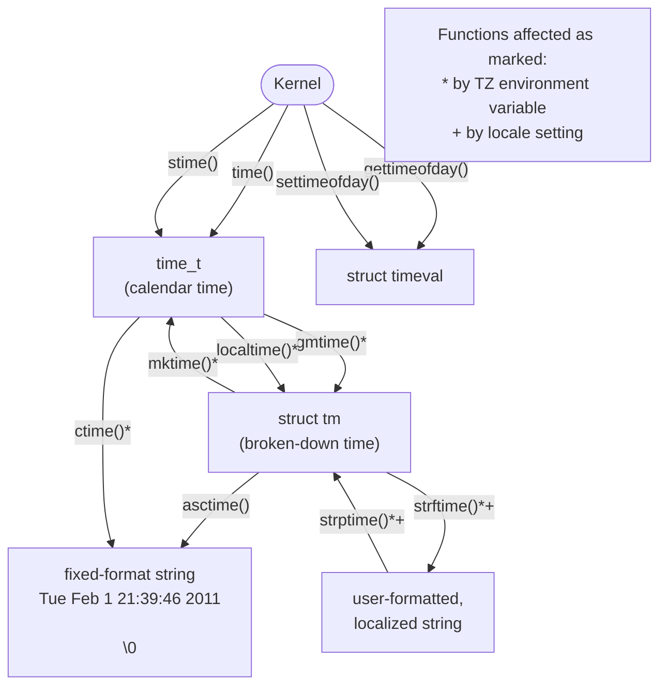

## Chapter 10
# **TIME**

Within a program, we may be interested in two kinds of time:

-  Real time: This is the time as measured either from some standard point (calendar time) or from some fixed point (typically the start) in the life of a process (elapsed or wall clock time). Obtaining the calendar time is useful to programs that, for example, timestamp database records or files. Measuring elapsed time is useful for a program that takes periodic actions or makes regular measurements from some external input device.
-  Process time: This is the amount of CPU time used by a process. Measuring process time is useful for checking or optimizing the performance of a program or algorithm.

Most computer architectures have a built-in hardware clock that enables the kernel to measure real and process time. In this chapter, we look at system calls for dealing with both sorts of time, and library functions for converting between humanreadable and internal representations of time. Since human-readable representations of time are dependent on the geographical location and on linguistic and cultural conventions, discussion of these representations leads us into an investigation of timezones and locales.

## <span id="page-33-0"></span>**10.1 Calendar Time**

Regardless of geographic location, UNIX systems represent time internally as a measure of seconds since the Epoch; that is, since midnight on the morning of 1 January 1970, Universal Coordinated Time (UTC, previously known as Greenwich Mean Time, or GMT). This is approximately the date when the UNIX system came into being. Calendar time is stored in variables of type time\_t, an integer type specified by SUSv3.

> On 32-bit Linux systems, time\_t, which is a signed integer, can represent dates in the range 13 December 1901 20:45:52 to 19 January 2038 03:14:07. (SUSv3 leaves the meaning of negative time\_t values unspecified.) Thus, many current 32-bit UNIX systems face a theoretical Year 2038 problem, which they may encounter before 2038, if they do calculations based on dates in the future. This problem will be significantly alleviated by the fact that by 2038, probably all UNIX systems will have long become 64-bit and beyond. However, 32-bit embedded systems, which typically have a much longer lifespan than desktop hardware, may still be afflicted by the problem. Furthermore, the problem will remain for any legacy data and applications that maintain time in a 32-bit time\_t format.

The gettimeofday() system call returns the calendar time in the buffer pointed to by tv.

```
#include <sys/time.h>
int gettimeofday(struct timeval *tv, struct timezone *tz);
                                             Returns 0 on success, or –1 on error
```

The tv argument is a pointer to a structure of the following form:

```
struct timeval {
 time_t tv_sec; /* Seconds since 00:00:00, 1 Jan 1970 UTC */
 suseconds_t tv_usec; /* Additional microseconds (long int) */
};
```

Although the tv\_usec field affords microsecond precision, the accuracy of the value it returns is determined by the architecture-dependent implementation. (The u in tv\_usec derives from the resemblance to the Greek letter μ ("mu") used in the metric system to denote one-millionth.) On modern x86-32 systems (i.e., Pentium systems with a Timestamp Counter register that is incremented once at each CPU clock cycle), gettimeofday() does provide microsecond accuracy.

The tz argument to gettimeofday() is a historical artifact. In older UNIX implementations, it was used to retrieve timezone information for the system. This argument is now obsolete and should always be specified as NULL.

If the tz argument is supplied, then it returns a timezone structure whose fields contain whatever values were specified in the (obsolete) tz argument in a previous call to settimeofday(). This structure contains two fields: tz\_minuteswest and tz\_dsttime. The tz\_minuteswest field indicates the number of minutes that must be added to times in this zone to match UTC, with a negative value indicating that an adjustment of minutes to the east of UTC (e.g., for Central European Time, one hour ahead of UTC, this field would contain the value –60). The tz\_dsttime field contains a constant that was designed to represent the daylight saving time (DST) regime in force in this timezone. It is because the DST regime can't be represented using a simple algorithm that the tz argument is obsolete. (This field has never been supported on Linux.) See the gettimeofday(2) manual page for further details.

The time() system call returns the number of seconds since the Epoch (i.e., the same value that gettimeofday() returns in the tv\_sec field of its tv argument).

```
#include <time.h>
time_t time(time_t *timep);
             Returns number of seconds since the Epoch,or (time_t) –1 on error
```

If the timep argument is not NULL, the number of seconds since the Epoch is also placed in the location to which timep points.

Since time() returns the same value in two ways, and the only possible error that can occur when using time() is to give an invalid address in the timep argument (EFAULT), we often simply use the following call (without error checking):

```
t = time(NULL);
```

The reason for the existence of two system calls (time() and gettimeofday()) with essentially the same purpose is historical. Early UNIX implementations provided time(). 4.3BSD added the more precise gettimeofday() system call. The existence of time() as a system call is now redundant; it could be implemented as a library function that calls gettimeofday().

## **10.2 Time-Conversion Functions**

Figure [10-1](#page-35-0) shows the functions used to convert between time\_t values and other time formats, including printable representations. These functions shield us from the complexity brought to such conversions by timezones, daylight saving time (DST) regimes, and localization issues. (We describe timezones in Section [10.3](#page-44-0) and locales in Section [10.4](#page-47-0).)


<span id="page-35-0"></span>**Figure 10-1:** Functions for retrieving and working with calendar time

## **10.2.1 Converting time\_t to Printable Form**

The ctime() function provides a simple method of converting a time\_t value into printable form.

```
#include <time.h>
char *ctime(const time_t *timep);
                         Returns pointer to statically allocated string terminated
                                   by newline and \0 on success, or NULL on error
```

Given a pointer to a time\_t value in timep, ctime() returns a 26-byte string containing the date and time in a standard format, as illustrated by the following example:

```
Wed Jun 8 14:22:34 2011
```

The string includes a terminating newline character and a terminating null byte. The ctime() function automatically accounts for local timezone and DST settings when performing the conversion. (We explain how these settings are determined in Section [10.3](#page-44-0).) The returned string is statically allocated; future calls to ctime() will overwrite it.

SUSv3 states that calls to any of the functions ctime(), gmtime(), localtime(), or asctime() may overwrite the statically allocated structure that is returned by any of the other functions. In other words, these functions may share single copies of the returned character array and tm structure, and this is done in some versions of glibc. If we need to maintain the returned information across multiple calls to these functions, we must save local copies.

A reentrant version of ctime() is provided in the form of ctime\_r(). (We explain reentrancy in Section 21.1.2.) This function permits the caller to specify an additional argument that is a pointer to a (caller-supplied) buffer that is used to return the time string. Other reentrant versions of functions mentioned in this chapter operate similarly.

#### **10.2.2 Converting Between time\_t and Broken-Down Time**

The gmtime() and localtime() functions convert a time\_t value into a so-called brokendown time. The broken-down time is placed in a statically allocated structure whose address is returned as the function result.

```
#include <time.h>
struct tm *gmtime(const time_t *timep);
struct tm *localtime(const time_t *timep);
                      Both return a pointer to a statically allocated broken-down
                                       time structure on success, or NULL on error
```

The gmtime() function converts a calendar time into a broken-down time corresponding to UTC. (The letters gm derive from Greenwich Mean Time.) By contrast, localtime() takes into account timezone and DST settings to return a broken-down time corresponding to the system's local time.

> Reentrant versions of these functions are provided as gmtime\_r() and localtime\_r().

The tm structure returned by these functions contains the date and time fields broken into individual parts. This structure has the following form:

```
struct tm {
 int tm_sec; /* Seconds (0-60) */
 int tm_min; /* Minutes (0-59) */
 int tm_hour; /* Hours (0-23) */
 int tm_mday; /* Day of the month (1-31) */
 int tm_mon; /* Month (0-11) */
 int tm_year; /* Year since 1900 */
 int tm_wday; /* Day of the week (Sunday = 0)*/
 int tm_yday; /* Day in the year (0-365; 1 Jan = 0)*/
 int tm_isdst; /* Daylight saving time flag
 > 0: DST is in effect;
 = 0: DST is not effect;
 < 0: DST information not available */
};
```

The tm\_sec field can be up to 60 (rather than 59) to account for the leap seconds that are occasionally applied to adjust human calendars to the astronomically exact (the so-called tropical) year.

If the \_BSD\_SOURCE feature test macro is defined, then the glibc definition of the tm structure also includes two additional fields containing further information about the represented time. The first of these, long int tm\_gmtoff, contains the number of seconds that the represented time falls east of UTC. The second field, const char \*tm\_zone, is the abbreviated timezone name (e.g., CEST for Central European Summer Time). SUSv3 doesn't specify either of these fields, and they appear on only a few other UNIX implementations (mainly BSD derivatives).

The mktime() function translates a broken-down time, expressed as local time, into a time\_t value, which is returned as the function result. The caller supplies the broken-down time in a tm structure pointed to by timeptr. During this translation, the tm\_wday and tm\_yday fields of the input tm structure are ignored.

```
#include <time.h>
time_t mktime(struct tm *timeptr);
                      Returns seconds since the Epoch corresponding to timeptr
                                               on success, or (time_t) –1 on error
```

The mktime() function may modify the structure pointed to by timeptr. At a minimum, it ensures that the tm\_wday and tm\_yday fields are set to values that correspond appropriately to the values of the other input fields.

In addition, mktime() doesn't require the other fields of the tm structure to be restricted to the ranges described earlier. For each field whose value is out of range, mktime() adjusts that field's value so that it is in range and makes suitable adjustments to the other fields. All of these adjustments are performed before mktime() updates the tm\_wday and tm\_yday fields and calculates the returned time\_t value.

For example, if the input tm\_sec field were 123, then on return, the value of this field would be 3, and the value of the tm\_min field would have 2 added to whatever value it previously had. (And if that addition caused tm\_min to overflow, then the tm\_min value would be adjusted and the tm\_hour field would be incremented, and so on.) These adjustments even apply for negative field values. For example, specifying –1 for tm\_sec means the 59th second of the previous minute. This feature is useful since it allows us to perform date and time arithmetic on a broken-down time value.

The timezone setting is used by mktime() when performing the translation. In addition, the DST setting may or may not be used, depending on the value of the input tm\_isdst field:

-  If tm\_isdst is 0, treat this time as standard time (i.e., ignore DST, even if it would be in effect at this time of year).
-  If tm\_isdst is greater than 0, treat this time as DST (i.e., behave as though DST is in effect, even if it would not normally be so at this time of year).
-  If tm\_isdst is less than 0, attempt to determine if DST would be in effect at this time of the year. This is typically the setting we want.

On completion (and regardless of the initial setting of tm\_isdst), mktime() sets the tm\_isdst field to a positive value if DST is in effect at the given date, or to 0 if DST is not in effect.

## <span id="page-38-1"></span>**10.2.3 Converting Between Broken-Down Time and Printable Form**

In this section, we describe functions that convert a broken-down time to printable form, and vice versa.

#### **Converting from broken-down time to printable form**

Given a pointer to a broken-down time structure in the argument tm, asctime() returns a pointer to a statically allocated string containing the time in the same form as ctime().

```
#include <time.h>
char *asctime(const struct tm *timeptr);
                      Returns pointer to statically allocated string terminated by
                                      newline and \0 on success, or NULL on error
```

By contrast with ctime(), local timezone settings have no effect on asctime(), since it is converting a broken-down time that is typically either already localized via localtime() or in UTC as returned by gmtime().

As with ctime(), we have no control over the format of the string produced by asctime().

A reentrant version of asctime() is provided in the form of asctime\_r().

Listing [10-1](#page-38-0) demonstrates the use of asctime(), as well as all of the time-conversion functions described so far in this chapter. This program retrieves the current calendar time, and then uses various time-conversion functions and displays their results. Here is an example of what we see when running this program in Munich, Germany, which (in winter) is on Central European Time, one hour ahead of UTC:

```
$ date
Tue Dec 28 16:01:51 CET 2010
$ ./calendar_time
Seconds since the Epoch (1 Jan 1970): 1293548517 (about 40.991 years)
 gettimeofday() returned 1293548517 secs, 715616 microsecs
Broken down by gmtime():
 year=110 mon=11 mday=28 hour=15 min=1 sec=57 wday=2 yday=361 isdst=0
Broken down by localtime():
 year=110 mon=11 mday=28 hour=16 min=1 sec=57 wday=2 yday=361 isdst=0
asctime() formats the gmtime() value as: Tue Dec 28 15:01:57 2010
ctime() formats the time() value as: Tue Dec 28 16:01:57 2010
mktime() of gmtime() value: 1293544917 secs
mktime() of localtime() value: 1293548517 secs 3600 secs ahead of UTC
```

<span id="page-38-0"></span>**Listing 10-1:** Retrieving and converting calendar times

```
–––––––––––––––––––––––––––––––––––––––––––––––––––––– time/calendar_time.c
#include <locale.h>
#include <time.h>
#include <sys/time.h>
#include "tlpi_hdr.h"
```

```
#define SECONDS_IN_TROPICAL_YEAR (365.24219 * 24 * 60 * 60)
int
main(int argc, char *argv[])
{
 time_t t;
 struct tm *gmp, *locp;
 struct tm gm, loc;
 struct timeval tv;
 t = time(NULL);
 printf("Seconds since the Epoch (1 Jan 1970): %ld", (long) t);
 printf(" (about %6.3f years)\n", t / SECONDS_IN_TROPICAL_YEAR);
 if (gettimeofday(&tv, NULL) == -1)
 errExit("gettimeofday");
 printf(" gettimeofday() returned %ld secs, %ld microsecs\n",
 (long) tv.tv_sec, (long) tv.tv_usec);
 gmp = gmtime(&t);
 if (gmp == NULL)
 errExit("gmtime");
 gm = *gmp; /* Save local copy, since *gmp may be modified
 by asctime() or gmtime() */
 printf("Broken down by gmtime():\n");
 printf(" year=%d mon=%d mday=%d hour=%d min=%d sec=%d ", gm.tm_year,
 gm.tm_mon, gm.tm_mday, gm.tm_hour, gm.tm_min, gm.tm_sec);
 printf("wday=%d yday=%d isdst=%d\n", gm.tm_wday, gm.tm_yday, gm.tm_isdst);
 locp = localtime(&t);
 if (locp == NULL)
 errExit("localtime");
 loc = *locp; /* Save local copy */
 printf("Broken down by localtime():\n");
 printf(" year=%d mon=%d mday=%d hour=%d min=%d sec=%d ",
 loc.tm_year, loc.tm_mon, loc.tm_mday,
 loc.tm_hour, loc.tm_min, loc.tm_sec);
 printf("wday=%d yday=%d isdst=%d\n\n",
 loc.tm_wday, loc.tm_yday, loc.tm_isdst);
 printf("asctime() formats the gmtime() value as: %s", asctime(&gm));
 printf("ctime() formats the time() value as: %s", ctime(&t));
 printf("mktime() of gmtime() value: %ld secs\n", (long) mktime(&gm));
 printf("mktime() of localtime() value: %ld secs\n", (long) mktime(&loc));
 exit(EXIT_SUCCESS);
}
–––––––––––––––––––––––––––––––––––––––––––––––––––––– time/calendar_time.c
```

The strftime() function provides us with more precise control when converting a broken-down time into printable form. Given a broken-down time pointed to by timeptr, strftime() places a corresponding null-terminated, date-plus-time string in the buffer pointed to by outstr.

```
#include <time.h>
size_t strftime(char *outstr, size_t maxsize, const char *format,
 const struct tm *timeptr);
                           Returns number of bytes placed in outstr (excluding
                               terminating null byte) on success, or 0 on error
```

The string returned in outstr is formatted according to the specification in format. The maxsize argument specifies the maximum space available in outstr. Unlike ctime() and asctime(), strftime() doesn't include a newline character at the end of the string (unless one is included in format).

On success, strftime() returns the number of bytes placed in outstr, excluding the terminating null byte. If the total length of the resulting string, including the terminating null byte, would exceed maxsize bytes, then strftime() returns 0 to indicate an error, and the contents of outstr are indeterminate.

The format argument to strftime() is a string akin to that given to printf(). Sequences beginning with a percent character (%) are conversion specifications, which are replaced by various components of the date and time according to the specifier character following the percent character. A rich set of conversion specifiers is provided, a subset of which is listed in Table 10-1. (For a complete list, see the strftime(3) manual page.) Except as otherwise noted, all of these conversion specifiers are standardized in SUSv3.

The %U and %W specifiers both produce a week number in the year. The %U week numbers are calculated such that the first week containing a Sunday is numbered 1, and the partial week preceding that is numbered 0. If Sunday happens to fall as the first day of the year, then there is no week 0, and the last day of the year falls in week 53. The %W week numbers work in the same way, but with Monday rather than Sunday.

Often, we want to display the current time in various demonstration programs in this book. For this purpose we provide the function currTime(), which returns a string containing the current time as formatted by strftime() when given the argument format.

```
#include "curr_time.h"
char *currTime(const char *format);
                    Returns pointer to statically allocated string, or NULL on error
```

The currTime() function implementation is shown in Listing [10-2.](#page-41-0)

**Table 10-1:** Selected conversion specifiers for strftime()

| Specifier | Description                               | Example                 |
|-----------|-------------------------------------------|-------------------------|
| %%        | A % character                             | %                       |
| %a        | Abbreviated weekday name                  | Tue                     |
| %A        | Full weekday name                         | Tuesday                 |
| %b, %h    | Abbreviated month name                    | Feb                     |
| %B        | Full month name                           | February                |
| %c        | Date and time                             | Tue Feb 1 21:39:46 2011 |
| %d        | Day of month (2 digits, 01 to 31)         | 01                      |
| %D        | American date (same as %m/%d/%y)          | 02/01/11                |
| %e        | Day of month (2 characters)               | 1                       |
| %F        | ISO date (same as %Y-%m-%d)               | 2011-02-01              |
| %H        | Hour (24-hour clock, 2 digits)            | 21                      |
| %I        | Hour (12-hour clock, 2 digits)            | 09                      |
| %j        | Day of year (3 digits, 001 to 366)<br>032 |                         |
| %m        | Decimal month (2 digits, 01 to 12)<br>02  |                         |
| %M        | Minute (2 digits)<br>39                   |                         |
| %p        | AM/PM<br>PM                               |                         |
| %P        | am/pm (GNU extension)<br>pm               |                         |
| %R        | 24-hour time (same as %H:%M)<br>21:39     |                         |
| %S        | Second (00 to 60)<br>46                   |                         |
| %T        | Time (same as %H:%M:%S)                   | 21:39:46                |
| %u        | Weekday number (1 to 7, Monday = 1)       | 2                       |
| %U        | Sunday week number (00 to 53)<br>05       |                         |
| %w        | Weekday number (0 to 6, Sunday = 0)<br>2  |                         |
| %W        | Monday week number (00 to 53)<br>05       |                         |
| %x        | Date (localized)<br>02/01/11              |                         |
| %X        | Time (localized)                          | 21:39:46                |
| %y        | 2-digit year<br>11                        |                         |
| %Y        | 4-digit year                              | 2011                    |
| %Z        | Timezone name                             | CET                     |

<span id="page-41-0"></span>**Listing 10-2:** A function that returns a string containing the current time

```
–––––––––––––––––––––––––––––––––––––––––––––––––––––––––– time/curr_time.c
#include <time.h>
#include "curr_time.h" /* Declares function defined here */
#define BUF_SIZE 1000
/* Return a string containing the current time formatted according to
 the specification in 'format' (see strftime(3) for specifiers).
 If 'format' is NULL, we use "%c" as a specifier (which gives the
 date and time as for ctime(3), but without the trailing newline).
```

Returns NULL on error. \*/

```
char *
currTime(const char *format)
{
 static char buf[BUF_SIZE]; /* Nonreentrant */
 time_t t;
 size_t s;
 struct tm *tm;
 t = time(NULL);
 tm = localtime(&t);
 if (tm == NULL)
 return NULL;
 s = strftime(buf, BUF_SIZE, (format != NULL) ? format : "%c", tm);
 return (s == 0) ? NULL : buf;
}
–––––––––––––––––––––––––––––––––––––––––––––––––––––––––– time/curr_time.c
```

#### **Converting from printable form to broken-down time**

The strptime() function is the converse of strftime(). It converts a date-plus-time string to a broken-down time.

```
#define _XOPEN_SOURCE
#include <time.h>
char *strptime(const char *str, const char *format, struct tm *timeptr);
                               Returns pointer to next unprocessed character in
                                                   str on success, or NULL on error
```

The strptime() function uses the specification given in format to parse the date-plustime string given in str, and places the converted broken-down time in the structure pointed to by timeptr.

On success, strptime() returns a pointer to the next unprocessed character in str. (This is useful if the string contains further information to be processed by the calling program.) If the complete format string could not be matched, strptime() returns NULL to indicate the error.

The format specification given to strptime() is akin to that given to scanf(3). It contains the following types of characters:

-  conversion specifications beginning with a percent character (%);
-  white-space characters, which match zero or more white spaces in the input string; and
-  non-white-space characters (other than %), which must match exactly the same characters in the input string.

The conversion specifications are similar to those given to strftime() (Table 10-1). The major difference is that the specifiers are more general. For example, both %a and %A can accept a weekday name in either full or abbreviated form, and %d or %e can be used to read a day of the month with or without a leading 0 in the case of singledigit days. In addition, case is ignored; for example, May and MAY are equivalent month names. The string %% is used to match a percent character in the input string. The strptime(3) manual page provides more details.

The glibc implementation of strptime() doesn't modify those fields of the tm structure that are not initialized by specifiers in format. This means that we can employ a series of strptime() calls to construct a single tm structure from information in multiple strings, such as a date string and a time string. While SUSv3 permits this behavior, it doesn't require it, and so we can't rely on it on other UNIX implementations. In a portable application, we must ensure that str and format contain input that will set all fields of the resulting tm structure, or make sure that the tm structure is suitably initialized before calling strptime(). In most cases, it would be sufficient to zero out the entire structure using memset(), but be aware that a value of 0 in the tm\_mday field corresponds to the last day of the previous month in glibc and many other implementations of the time-conversion functions. Finally, note that strptime() never sets the value of the tm\_isdst field of the tm structure.

> The GNU C library also provides two other functions that serve a similar purpose to strptime(): getdate() (specified in SUSv3 and widely available) and its reentrant analog getdate\_r() (not specified in SUSv3 and available on only a few other UNIX implementations). We don't describe these functions here, because they employ an external file (identified by the environment variable DATEMSK) to specify the format used for scanning the date, which makes them somewhat awkward to use and also creates security vulnerabilities in set-user-ID programs.

Listing [10-3](#page-44-1) demonstrates the use of strptime() and strftime(). This program takes a command-line argument containing a date and time, converts this to a broken-down time using strptime(), and then displays the result of performing the reverse conversion using strftime(). The program takes up to three arguments, of which the first two are required. The first argument is the string containing a date and time. The second argument is the format specification to be used by strptime() to parse the first argument. The optional third argument is the format string to be used by strftime() for the reverse conversion. If this argument is omitted, a default format string is used. (We describe the setlocale() function used in this program in Section [10.4.](#page-47-0)) The following shell session log shows some examples of the use of this program:

```
$ ./strtime "9:39:46pm 1 Feb 2011" "%I:%M:%S%p %d %b %Y"
calendar time (seconds since Epoch): 1296592786
strftime() yields: 21:39:46 Tuesday, 01 February 2011 CET
```

The following usage is similar, but this time we explicitly specify a format for strftime():

```
$ ./strtime "9:39:46pm 1 Feb 2011" "%I:%M:%S%p %d %b %Y" "%F %T"
calendar time (seconds since Epoch): 1296592786
strftime() yields: 2011-02-01 21:39:46
```

```
–––––––––––––––––––––––––––––––––––––––––––––––––––––––––––– time/strtime.c
#define _XOPEN_SOURCE
#include <time.h>
#include <locale.h>
#include "tlpi_hdr.h"
#define SBUF_SIZE 1000
int
main(int argc, char *argv[])
{
 struct tm tm;
 char sbuf[SBUF_SIZE];
 char *ofmt;
 if (argc < 3 || strcmp(argv[1], "--help") == 0)
 usageErr("%s input-date-time in-format [out-format]\n", argv[0]);
 if (setlocale(LC_ALL, "") == NULL)
 errExit("setlocale"); /* Use locale settings in conversions */
 memset(&tm, 0, sizeof(struct tm)); /* Initialize 'tm' */
 if (strptime(argv[1], argv[2], &tm) == NULL)
 fatal("strptime");
 tm.tm_isdst = -1; /* Not set by strptime(); tells mktime()
 to determine if DST is in effect */
 printf("calendar time (seconds since Epoch): %ld\n", (long) mktime(&tm));
 ofmt = (argc > 3) ? argv[3] : "%H:%M:%S %A, %d %B %Y %Z";
 if (strftime(sbuf, SBUF_SIZE, ofmt, &tm) == 0)
 fatal("strftime returned 0");
 printf("strftime() yields: %s\n", sbuf);
 exit(EXIT_SUCCESS);
}
–––––––––––––––––––––––––––––––––––––––––––––––––––––––––––– time/strtime.c
```

# <span id="page-44-0"></span>**10.3 Timezones**

Different countries (and sometimes even different regions within a single country) operate on different timezones and DST regimes. Programs that input and output times must take into account the timezone and DST regime of the system on which they are run. Fortunately, all of the details are handled by the C library.

#### **Timezone definitions**

Timezone information tends to be both voluminous and volatile. For this reason, rather than encoding it directly into programs or libraries, the system maintains this information in files in standard formats.

These files reside in the directory /usr/share/zoneinfo. Each file in this directory contains information about the timezone regime in a particular country or region. These files are named according to the timezone they describe, so we may find files with names such as EST (US Eastern Standard Time), CET (Central European Time), UTC, Turkey, and Iran. In addition, subdirectories can be used to hierarchically group related timezones. Under a directory such as Pacific, we may find the files Auckland, Port\_Moresby, and Galapagos. When we specify a timezone for use by a program, in effect, we are specifying a relative pathname for one of the timezone files in this directory.

The local time for the system is defined by the timezone file /etc/localtime, which is often linked to one of the files in /usr/share/zoneinfo.

> The format of timezone files is documented in the tzfile(5) manual page. Timezone files are built using zic(8), the zone information compiler. The zdump(8) command can be used to display the time as it would be currently according to the timezone in a specified timezone file.

#### **Specifying the timezone for a program**

To specify a timezone when running a program, we set the TZ environment variable to a string consisting of a colon (:) followed by one of the timezone names defined in /usr/share/zoneinfo. Setting the timezone automatically influences the functions ctime(), localtime(), mktime(), and strftime().

To obtain the current timezone setting, each of these functions uses tzset(3), which initializes three global variables:

```
char *tzname[2]; /* Name of timezone and alternate (DST) timezone */
int daylight; /* Nonzero if there is an alternate (DST) timezone */
long timezone; /* Seconds difference between UTC and local
 standard time */
```

The tzset() function first checks the TZ environment variable. If this variable is not set, then the timezone is initialized to the default defined in the timezone file /etc/localtime. If the TZ environment variable is defined with a value that can't be matched to a timezone file, or it is an empty string, then UTC is used. The TZDIR environment variable (a nonstandard GNU-extension) can be set to the name of a directory in which timezone information should be sought instead of in the default /usr/share/zoneinfo.

We can see the effect of the TZ variable by running the program in Listing [10-4.](#page-46-0) In the first run, we see the output corresponding to the system's default timezone (Central European Time, CET). In the second run, we specify the timezone for New Zealand, which at this time of year is on daylight saving time, 12 hours ahead of CET.

```
$ ./show_time
ctime() of time() value is: Tue Feb 1 10:25:56 2011
asctime() of local time is: Tue Feb 1 10:25:56 2011
strftime() of local time is: Tuesday, 01 Feb 2011, 10:25:56 CET
$ TZ=":Pacific/Auckland" ./show_time
ctime() of time() value is: Tue Feb 1 22:26:19 2011
asctime() of local time is: Tue Feb 1 22:26:19 2011
strftime() of local time is: Tuesday, 01 February 2011, 22:26:19 NZDT
```

```
––––––––––––––––––––––––––––––––––––––––––––––––––––––––– time/show_time.c
#include <time.h>
#include <locale.h>
#include "tlpi_hdr.h"
#define BUF_SIZE 200
int
main(int argc, char *argv[])
{
 time_t t;
 struct tm *loc;
 char buf[BUF_SIZE];
 if (setlocale(LC_ALL, "") == NULL)
 errExit("setlocale"); /* Use locale settings in conversions */
 t = time(NULL);
 printf("ctime() of time() value is: %s", ctime(&t));
 loc = localtime(&t);
 if (loc == NULL)
 errExit("localtime");
 printf("asctime() of local time is: %s", asctime(loc));
 if (strftime(buf, BUF_SIZE, "%A, %d %B %Y, %H:%M:%S %Z", loc) == 0)
 fatal("strftime returned 0");
 printf("strftime() of local time is: %s\n", buf);
 exit(EXIT_SUCCESS);
}
––––––––––––––––––––––––––––––––––––––––––––––––––––––––– time/show_time.c
```

SUSv3 defines two general ways in which the TZ environment variable can be set. As just described, TZ can be set to a character sequence consisting of a colon plus a string that identifies the timezone in an implementation-specific manner, typically as a pathname for a timezone description file. (Linux and some other UNIX implementations permit the colon to be omitted when using this form, but SUSv3 doesn't specify this; for portability, we should always include the colon.)

The other method of setting TZ is fully specified in SUSv3. In this method, we assign a string of the following form to TZ:

```
std offset [ dst [ offset ][ , start-date [ /time ] , end-date [ /time ]]]
```

Spaces are included in the line above for clarity, but none should appear in the TZ value. The brackets ([]) are used to indicate optional components.

The std and dst components are strings identifying the standard and DST timezones; for example, CET and CEST for Central European Time and Central European Summer Time. The offset in each case specifies the positive or negative adjustment to add to the local time to convert it to UTC. The final four components provide a rule describing when the change from standard time to DST occurs.

The dates can be specified in a variety of forms, one of which is Mm.n.d. This notation means day d (0 = Sunday, 6 = Saturday) of week n (1 to 5, where 5 always means the last d day) of month m (1 to 12). If the time is omitted, it defaults to 02:00:00 (2 AM) in each case.

Here is how we could define TZ for Central Europe, where standard time is one hour ahead of UTC, and DST—running from the last Sunday in March to the last Sunday in October—is 2 hours ahead of UTC:

```
TZ="CET-1:00:00CEST-2:00:00,M3.5.0,M10.5.0
```

We omitted the specification of the time for the DST changeover, since it occurs at the default of 02:00:00. Of course, the preceding form is less readable than the Linux-specific near equivalent:

TZ=":Europe/Berlin"

## <span id="page-47-0"></span>**10.4 Locales**

Several thousand languages are spoken across the world, of which a significant percentage are regularly used on computer systems. Furthermore, different countries use different conventions for displaying information such as numbers, currency amounts, dates, and times. For example, in most European countries, a comma, rather than a decimal point, is used to separate the integer and fractional parts of (real) numbers, and most countries use formats for writing dates that are different from the MM/DD/YY format used in the United States. SUSv3 defines a locale as the "subset of a user's environment that depends on language and cultural conventions."

Ideally, all programs designed to run in more than one location should deal with locales in order to display and input information in the user's preferred language and format. This constitutes the complex subject of internationalization. In the ideal world, we would write a program once, and then, wherever it was run, it would automatically do the right things when performing I/O; that is, it would perform the task of localization. Internationalizing programs is a somewhat timeconsuming job, although various tools are available to ease the task. Program libraries such as glibc also provide facilities to help with internationalization.

> The term internationalization is often written as I18N, for I plus 18 letters plus N. As well as being quicker to write, this term has the advantage of avoiding the difference in the spelling of the term itself in British and American English.

#### **Locale definitions**

Like timezone information, locale information tends to be both voluminous and volatile. For this reason, rather than requiring each program and library to store locale information, the system maintains this information in files in standard formats.

Locale information is maintained in a directory hierarchy under /usr/share/ locale (or /usr/lib/locale in some distributions). Each subdirectory under this directory contains information about a particular locale. These directories are named using the following convention:

#### language[\_territory[.codeset]][@modifier]

The language is a two-letter ISO language code, and the territory is a two-letter ISO country code. The codeset designates a character-encoding set. The modifier provides a means of distinguishing multiple locale directories whose language, territory, and codeset are the same. An example of a complete locale directory name is de\_DE.utf-8@euro, as the locale for: German language, Germany, UTF-8 character encoding, employing the euro as the monetary unit.

As indicated by the brackets shown in the directory naming format, various parts of the name of a locale directory can be omitted. Often the name consists of just a language and a territory. Thus, the directory en\_US is the locale directory for the (English-speaking) United States, and fr\_CH is the locale directory for the French-speaking region of Switzerland.

> The CH stands for Confoederatio Helvetica, the Latin (and thus locally languageneutral) name for Switzerland. With four official national languages, Switzerland is an example of a locale analog of a country with multiple timezones.

When we specify a locale to be used within a program, we are, in effect, specifying the name of one of the subdirectories under /usr/share/locale. If the locale specified to the program doesn't match a locale directory name exactly, then the C library searches for a match by stripping components from the specified locale in the following order:

- 1. codeset
- 2. normalized codeset
- 3. territory
- 4. modifier

The normalized codeset is a version of the codeset name in which all nonalphanumeric characters are removed, all letters are converted to lowercase, and the resulting string is preprended with the characters iso. The aim of normalizing is to handle variations in the capitalization and punctuation (e.g., extra hyphens) of codeset names.

As an example of this stripping process, if the locale for a program is specified as fr\_CH.utf-8, but no locale directory by that name exists, then the fr\_CH locale directory will be matched if it exists. If the fr\_CH directory doesn't exist, then the fr locale directory will be used. In the unlikely event that the fr directory doesn't exist, then the setlocale() function, described shortly, will report an error.

> The file /usr/share/locale/locale.alias defines alternative ways of specifying locales to a program. See the locale.aliases(5) manual page for details.

Under each locale subdirectory is a standard set of files that specify the conventions for this locale, as shown in Table [10-2](#page-49-0). Note the following further points concerning the information in this table:

-  The LC\_COLLATE file defines a set of rules describing how the characters in a character set are ordered (i.e., the "alphabetical" order for the character set). These rules determine the operation of the strcoll(3) and strxfrm(3) functions. Even languages using Latin-based scripts don't follow the same ordering rules. For example, several European languages have additional letters that, in some cases, sort after the letter Z. Other special cases include the Spanish two-letter sequence ll, which sorts as a single letter after l, and the German umlauted characters such as ä, which corresponds to ae and sorts as those two letters.
-  The LC\_MESSAGES directory is one step toward internationalizing the messages displayed by a program. More extensive internationalization of program messages can be accomplished through the use of either message catalogs (see the catopen(3) and catgets(3) manual pages) or the GNU gettext API (available at http://www.gnu.org/).

Version 2.2.2 of glibc introduced a number of new, nonstandard locale categories. LC\_ADDRESS defines rules for the locale-specific representation of a postal address. LC\_IDENTIFICATION specifies information identifying the locale. LC\_MEASUREMENT defines the measurement system for the locale (e.g., metric versus imperial). LC\_NAME defines the locale-specific rules for representation of a person's names and title. LC\_PAPER defines the standard paper size for the locale (e.g., US letter versus the A4 format used in most other countries). LC\_TELEPHONE defines the rules for locale-specific representation of domestic and international telephone numbers, as well as the international country prefix and international dial-out prefix.

<span id="page-49-0"></span>**Table 10-2:** Contents of locale-specific subdirectories

| Filename    | Purpose                                                                                                                    |
|-------------|----------------------------------------------------------------------------------------------------------------------------|
| LC_CTYPE    | A file containing character classifications (see isalpha(3)) and rules for case<br>conversion                              |
| LC_COLLATE  | A file containing the collation rules for a character set                                                                  |
| LC_MONETARY | A file containing formatting rules for monetary values (see localeconv(3) and<br><locale.h>)</locale.h>                    |
| LC_NUMERIC  | A file containing formatting rules for numbers other than monetary values<br>(see localeconv(3) and <locale.h>)</locale.h> |
| LC_TIME     | A file containing formatting rules for dates and times                                                                     |
| LC_MESSAGES | A directory containing files specifying formats and values used for<br>affirmative and negative (yes/no) responses         |

The actual locales that are defined on a system can vary. SUSv3 doesn't make any requirements about this, except that a standard locale called POSIX (and synonymously, C, a name that exists for historical reasons) must be defined. This locale mirrors the historical behavior of UNIX systems. Thus, it is based on an ASCII character set, and uses English for names of days and months, and for yes/no responses. The monetary and numeric components of this locale are undefined.

> The locale command displays information about the current locale environment (within the shell). The command locale –a lists the full set of locales defined on the system.

#### **Specifying the locale for a program**

The setlocale() function is used to both set and query a program's current locale.

```
#include <locale.h>
char *setlocale(int category, const char *locale);
              Returns pointer to a (usually statically allocated) string identifying
                            the new or current locale on success, or NULL on error
```

The category argument selects which part of the locale to set or query, and is specified as one of a set of constants whose names are the same as the locale categories listed in Table [10-2](#page-49-0). Thus, for example, it is possible to set the locale for time displays to be Germany, while setting the locale for monetary displays to US dollars. Alternatively, and more commonly, we can use the value LC\_ALL to specify that we want to set all aspects of the locale.

There are two different methods of setting the locale using setlocale(). The locale argument may be a string specifying one of the locales defined on the system (i.e., the name of one of the subdirectories under /usr/lib/locale), such as de\_DE or en\_US. Alternatively, locale may be specified as an empty string, meaning that locale settings should be taken from environment variables:

```
setlocale(LC_ALL, "");
```

We must make this call in order for a program to be cognizant of the locale environment variables. If the call is omitted, these environment variables will have no effect on the program.

When running a program that makes a setlocale(LC\_ALL, "") call, we can control various aspects of the locale using a set of environment variables whose names again correspond to the categories listed in Table [10-2](#page-49-0): LC\_CTYPE, LC\_COLLATE, LC\_MONETARY, LC\_NUMERIC, LC\_TIME, and LC\_MESSAGES. Alternatively, we can use the LC\_ALL or the LANG environment variable to specify the setting of the entire locale. If more than one of the preceding variables is set, then LC\_ALL has precedence over all of the other LC\_\* environment variables, and LANG has lowest precedence. Thus, it is possible to use LANG to set a default locale for all categories, and then use individual LC\_\* variables to set aspects of the locale to something other than this default.

As its result, setlocale() returns a pointer to a (usually statically allocated) string that identifies the locale setting for this category. If we are interested only in discovering the current locale setting, without changing it, then we can specify the locale argument as NULL.

Locale settings control the operation of a wide range of GNU/Linux utilities, as well as many functions in glibc. Among these are the functions strftime() and strptime() (Section [10.2.3](#page-38-1)), as shown by the results from strftime() when we run the program in Listing [10-4](#page-46-0) in a number of different locales:

```
$ LANG=de_DE ./show_time German locale
ctime() of time() value is: Tue Feb 1 12:23:39 2011
asctime() of local time is: Tue Feb 1 12:23:39 2011
strftime() of local time is: Dienstag, 01 Februar 2011, 12:23:39 CET
```

The next run demonstrates that the LC\_TIME has precedence over LANG:

```
$ LANG=de_DE LC_TIME=it_IT ./show_time German and Italian locales
ctime() of time() value is: Tue Feb 1 12:24:03 2011
asctime() of local time is: Tue Feb 1 12:24:03 2011
strftime() of local time is: martedì, 01 febbraio 2011, 12:24:03 CET
```

And this run demonstrates that LC\_ALL has precedence over LC\_TIME:

```
$ LC_ALL=fr_FR LC_TIME=en_US ./show_time French and US locales
ctime() of time() value is: Tue Feb 1 12:25:38 2011
asctime() of local time is: Tue Feb 1 12:25:38 2011
strftime() of local time is: mardi, 01 février 2011, 12:25:38 CET
```

# **10.5 Updating the System Clock**

We now look at two interfaces that update the system clock: settimeofday() and adjtime(). These interfaces are rarely used by application programs (since the system time is usually maintained by tools such as the Network Time Protocol daemon), and they require that the caller be privileged (CAP\_SYS\_TIME).

The settimeofday() system call performs the converse of gettimeofday() (which we described in Section [10.1](#page-33-0)): it sets the system's calendar time to the number of seconds and microseconds specified in the timeval structure pointed to by tv.

```
#define _BSD_SOURCE
#include <sys/time.h>
int settimeofday(const struct timeval *tv, const struct timezone *tz);
                                             Returns 0 on success, or –1 on error
```

As with gettimeofday(), the use of the tz argument is obsolete, and this argument should always be specified as NULL.

The microsecond precision of the tv.tv\_usec field doesn't mean that we have microsecond accuracy in controlling the system clock, since the clock's granularity may be larger than one microsecond.

Although settimeofday() is not specified in SUSv3, it is widely available on other UNIX implementations.

> Linux also provides the stime() system call for setting the system clock. The difference between settimeofday() and stime() is that the latter call allows the new calendar time to be expressed with a precision of only 1 second. As with time() and gettimeofday(), the reason for the existence of both stime() and settimeofday() is historical: the latter, more precise call was added by 4.3BSD.

Abrupt changes in the system time of the sort caused by calls to settimeofday() can have deleterious effects on applications (e.g., make(1), a database system using timestamps, or time-stamped log files) that depend on a monotonically increasing system clock. For this reason, when making small changes to the time (of the order of a few seconds), it is usually preferable to use the adjtime() library function, which causes the system clock to gradually adjust to the desired value.

```
#define _BSD_SOURCE
#include <sys/time.h>
int adjtime(struct timeval *delta, struct timeval *olddelta);
                                             Returns 0 on success, or –1 on error
```

The delta argument points to a timeval structure that specifies the number of seconds and microseconds by which to change the time. If this value is positive, then a small amount of additional time is added to the system clock each second, until the desired amount of time has been added. If the delta value is negative, the clock is slowed down in a similar fashion.

> The rate of clock adjustment on Linux/x86-32 amounts to 1 second per 2000 seconds (or 43.2 seconds per day).

It may be that an incomplete clock adjustment was in progress at the time of the adjtime() call. In this case, the amount of remaining, unadjusted time is returned in the timeval structure pointed to by olddelta. If we are not interested in this value, we can specify olddelta as NULL. Conversely, if we are interested only in knowing the currently outstanding time correction to be made, and don't want to change the value, we can specify the delta argument as NULL.

Although not specified in SUSv3, adjtime() is available on most UNIX implementations.

> On Linux, adjtime() is implemented on top of a more general (and complex) Linux-specific system call, adjtimex(). This system call is employed by the Network Time Protocol (NTP) daemon. For further information, refer to the Linux source code, the Linux adjtimex(2) manual page, and the NTP specification ([Mills, 1992]).

## <span id="page-52-0"></span>**10.6 The Software Clock (Jiffies)**

The accuracy of various time-related system calls described in this book is limited to the resolution of the system software clock, which measures time in units called jiffies. The size of a jiffy is defined by the constant HZ within the kernel source code. This is the unit in which the kernel allocates the CPU to processes under the roundrobin time-sharing scheduling algorithm (Section 35.1).

On Linux/x86-32 in kernel versions up to and including 2.4, the rate of the software clock was 100 hertz; that is, a jiffy is 10 milliseconds.

Because CPU speeds have greatly increased since Linux was first implemented, in kernel 2.6.0, the rate of the software clock was raised to 1000 hertz on Linux/ x86-32. The advantages of a higher software clock rate are that timers can operate with greater accuracy and time measurements can be made with greater precision. However, it isn't desirable to set the clock rate to arbitrarily high values, because each clock interrupt consumes a small amount of CPU time, which is time that the CPU can't spend executing processes.

Debate among kernel developers eventually resulted in the software clock rate becoming a configurable kernel option (under Processor type and features, Timer frequency). Since kernel 2.6.13, the clock rate can be set to 100, 250 (the default), or 1000 hertz, giving jiffy values of 10, 4, and 1 milliseconds, respectively. Since kernel 2.6.20, a further frequency is available: 300 hertz, a number that divides evenly for two common video frame rates: 25 frames per second (PAL) and 30 frames per second (NTSC).

## **10.7 Process Time**

Process time is the amount of CPU time used by a process since it was created. For recording purposes, the kernel separates CPU time into the following two components:

-  User CPU time is the amount of time spent executing in user mode. Sometimes referred to as virtual time, this is the time that it appears to the program that it has access to the CPU.
-  System CPU time is amount of time spent executing in kernel mode. This is the time that the kernel spends executing system calls or performing other tasks on behalf of the program (e.g., servicing page faults).

Sometimes, we refer to process time as the total CPU time consumed by the process. When we run a program from the shell, we can use the time(1) command to obtain both process time values, as well as the real time required to run the program:

```
$ time ./myprog
real 0m4.84s
user 0m1.030s
sys 0m3.43s
```

The times() system call retrieves process time information, returning it in the structure pointed to by buf.

```
#include <sys/times.h>
clock_t times(struct tms *buf);
                   Returns number of clock ticks (sysconf(_SC_CLK_TCK)) since
                      "arbitrary" time in past on success, or (clock_t) –1 on error
```

This tms structure pointed to by buf has the following form:

```
struct tms {
 clock_t tms_utime; /* User CPU time used by caller */
 clock_t tms_stime; /* System CPU time used by caller */
```

```
 clock_t tms_cutime; /* User CPU time of all (waited for) children */
 clock_t tms_cstime; /* System CPU time of all (waited for) children */
};
```

The first two fields of the tms structure return the user and system components of CPU time used so far by the calling process. The last two fields return information about the CPU time used by all child processes that have terminated and for which the parent (i.e., the caller of times()) has done a wait() system call.

The clock\_t data type used to type the four fields of the tms structure is an integer type that measures time in units called clock ticks. We can call sysconf(\_SC\_CLK\_TCK) to obtain the number of clock ticks per second, and then divide a clock\_t value by this number to convert to seconds. (We describe sysconf() in Section [11.2.](#page-62-0))

> On most Linux hardware architectures, sysconf(\_SC\_CLK\_TCK) returns the number 100. This corresponds to the kernel constant USER\_HZ. However, USER\_HZ can be defined with a value other than 100 on a few architectures, such as Alpha and IA-64.

On success, times() returns the elapsed (real) time in clock ticks since some arbitrary point in the past. SUSv3 deliberately does not specify what this point is, merely stating that it will be constant during the life of the calling process. Therefore, the only portable use of this return value is to measure elapsed time in the execution of the process by calculating the difference in the value returned by pairs of times() calls. However, even for this use, the return value of times() is unreliable, since it can overflow the range of clock\_t, at which point the value would cycle to start again at 0 (i.e., a later times() call could return a number that is lower than an earlier times() call). The reliable way to measure the passage of elapsed time is to use gettimeofday() (described in Section [10.1\)](#page-33-0).

On Linux, we can specify buf as NULL; in this case, times() simply returns a function result. However, this is not portable. The use of NULL for buf is not specified in SUSv3, and many other UNIX implementations require a non-NULL value for this argument.

The clock() function provides a simpler interface for retrieving the process time. It returns a single value that measures the total (i.e., user plus system) CPU time used by the calling process.

```
#include <time.h>
clock_t clock(void);
                    Returns total CPU time used by calling process measured in
                                           CLOCKS_PER_SEC, or (clock_t) –1 on error
```

The value returned by clock() is measured in units of CLOCKS\_PER\_SEC, so we must divide by this value to arrive at the number of seconds of CPU time used by the process. CLOCKS\_PER\_SEC is fixed at 1 million by POSIX.1, regardless of the resolution of the underlying software clock (Section [10.6](#page-52-0)). The accuracy of clock() is nevertheless limited to the resolution of the software clock.

Although the clock\_t return type of clock() is the same data type that is used in the times() call, the units of measurement employed by these two interfaces are different. This is the result of historically conflicting definitions of clock\_t in POSIX.1 and the C programming language standard.

Even though CLOCKS\_PER\_SEC is fixed at 1 million, SUSv3 notes that this constant could be an integer variable on non-XSI-conformant systems, so that we can't portably treat it as a compile-time constant (i.e., we can't use it in #ifdef preprocessor expressions). Because it may be defined as a long integer (i.e., 1000000L), we always cast this constant to long so that we can portably print it with printf() (see Section 3.6.2).

SUSv3 states that clock() should return "the processor time used by the process." This is open to different interpretations. On some UNIX implementations, the time returned by clock() includes the CPU time used by all waited-for children. On Linux, it does not.

#### **Example program**

The program in Listing [10-5](#page-55-0) demonstrates the use of the functions described in this section. The displayProcessTimes() function prints the message supplied by the caller, and then uses clock() and times() to retrieve and display process times. The main program makes an initial call to displayProcessTimes(), and then executes a loop that consumes some CPU time by repeatedly calling getppid(), before again calling displayProcessTimes() once more to see how much CPU time has been consumed within the loop. When we use this program to call getppid() 10 million times, this is what we see:

```
$ ./process_time 10000000
CLOCKS_PER_SEC=1000000 sysconf(_SC_CLK_TCK)=100
At program start:
 clock() returns: 0 clocks-per-sec (0.00 secs)
 times() yields: user CPU=0.00; system CPU: 0.00
After getppid() loop:
 clock() returns: 2960000 clocks-per-sec (2.96 secs)
 times() yields: user CPU=1.09; system CPU: 1.87
```

<span id="page-55-0"></span>**Listing 10-5:** Retrieving process CPU times

––––––––––––––––––––––––––––––––––––––––––––––––––––––– **time/process\_time.c**

```
#include <sys/times.h>
#include <time.h>
#include "tlpi_hdr.h"
static void /* Display 'msg' and process times */
displayProcessTimes(const char *msg)
{
 struct tms t;
 clock_t clockTime;
 static long clockTicks = 0;
 if (msg != NULL)
 printf("%s", msg);
```

```
 if (clockTicks == 0) { /* Fetch clock ticks on first call */
 clockTicks = sysconf(_SC_CLK_TCK);
 if (clockTicks == -1)
 errExit("sysconf");
 }
 clockTime = clock();
 if (clockTime == -1)
 errExit("clock");
 printf(" clock() returns: %ld clocks-per-sec (%.2f secs)\n",
 (long) clockTime, (double) clockTime / CLOCKS_PER_SEC);
 if (times(&t) == -1)
 errExit("times");
 printf(" times() yields: user CPU=%.2f; system CPU: %.2f\n",
 (double) t.tms_utime / clockTicks,
 (double) t.tms_stime / clockTicks);
}
int
main(int argc, char *argv[])
{
 int numCalls, j;
 printf("CLOCKS_PER_SEC=%ld sysconf(_SC_CLK_TCK)=%ld\n\n",
 (long) CLOCKS_PER_SEC, sysconf(_SC_CLK_TCK));
 displayProcessTimes("At program start:\n");
 numCalls = (argc > 1) ? getInt(argv[1], GN_GT_0, "num-calls") : 100000000;
 for (j = 0; j < numCalls; j++)
 (void) getppid();
 displayProcessTimes("After getppid() loop:\n");
 exit(EXIT_SUCCESS);
}
––––––––––––––––––––––––––––––––––––––––––––––––––––––– time/process_time.c
```

## **10.8 Summary**

Real time corresponds to the everyday definition of time. When real time is measured from some standard point, we refer to it as calendar time, by contrast with elapsed time, which is measured from some point (usually the start) in the life of a process.

Process time is the amount of CPU time used by a process, and is divided into user and system components.

Various system calls enable us to get and set the system clock value (i.e., calendar time, as measured in seconds since the Epoch), and a range of library functions allow conversions between calendar time and other time formats, including broken-down time and human-readable character strings. Describing such conversions took us into a discussion of locales and internationalization.

Using and displaying times and dates is an important part of many applications, and we'll make frequent use of the functions described in this chapter in later parts of this book. We also say a little more about the measurement of time in Chapter 23.

#### **Further information**

Details of how the Linux kernel measures time can be found in [Love, 2010].

An extensive discussion of timezones and internationalization can be found in the GNU C library manual (online at http://www.gnu.org/). The SUSv3 documents also cover locales in detail.

## **10.9 Exercise**

**10-1.** Assume a system where the value returned by the call sysconf(\_SC\_CLK\_TCK) is 100. Assuming that the clock\_t value returned by times() is an unsigned 32-bit integer, how long will it take before this value cycles so that it restarts at 0? Perform the same calculation for the CLOCKS\_PER\_SEC value returned by clock().

