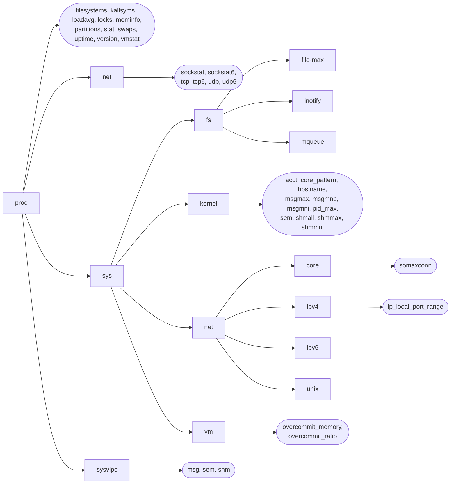

## Chapter 12
# **SYSTEM AND PROCESS INFORMATION**

In this chapter, we look at ways of accessing a variety of system and process information. The primary focus of the chapter is a discussion of the /proc file system. We also describe the uname() system call, which is used to retrieve various system identifiers.

## **12.1 The /proc File System**

In older UNIX implementations, there was typically no easy way to introspectively analyze (or change) attributes of the kernel, to answer questions such as the following:

-  How many processes are running on the system and who owns them?
-  What files does a process have open?
-  What files are currently locked, and which processes hold the locks?
-  What sockets are being used on the system?

Some older UNIX implementations solved this problem by allowing privileged programs to delve into data structures in kernel memory. However, this approach suffered various problems. In particular, it required specialized knowledge of the kernel data structures, and these structures might change from one kernel version to the next, requiring programs that depended on them to be rewritten.

In order to provide easier access to kernel information, many modern UNIX implementations provide a /proc virtual file system. This file system resides under the /proc directory and contains various files that expose kernel information, allowing processes to conveniently read that information, and change it in some cases, using normal file I/O system calls. The /proc file system is said to be virtual because the files and subdirectories that it contains don't reside on a disk. Instead, the kernel creates them "on the fly" as processes access them.

In this section, we present an overview of the /proc file system. In later chapters, we describe specific /proc files, as they relate to the topics of each chapter. Although many UNIX implementations provide a /proc file system, SUSv3 doesn't specify this file system; the details described in this book are Linux-specific.

#### **12.1.1 Obtaining Information About a Process: /proc/PID**

For each process on the system, the kernel provides a corresponding directory named /proc/PID, where PID is the ID of the process. Within this directory are various files and subdirectories containing information about that process. For example, we can obtain information about the init process, which always has the process ID 1, by looking at files under the directory /proc/1.

Among the files in each /proc/PID directory is one named status, which provides a range of information about the process:

| Name of command run by this process<br>Name:<br>init<br>State of this process<br>State: S (sleeping)<br>Thread group ID (traditional PID, getpid())<br>Tgid:<br>1<br>Actually, thread ID (gettid())<br>Pid:<br>1<br>Parent process ID<br>PPid:<br>0<br>PID of tracing process (0 if not traced)<br>TracerPid:<br>0<br>Real, effective, saved set, and FS UIDs<br>Uid:<br>0<br>0<br>0<br>0<br>Real, effective, saved set, and FS GIDs<br>Gid:<br>0<br>0<br>0<br>0<br># of file descriptor slots currently allocated<br>FDSize: 256<br>Supplementary group IDs<br>Groups:<br>Peak virtual memory size<br>VmPeak:<br>852 kB<br>Current virtual memory size<br>VmSize:<br>724 kB<br>Locked memory<br>VmLck:<br>0 kB<br>Peak resident set size<br>VmHWM:<br>288 kB<br>Current resident set size<br>VmRSS:<br>288 kB<br>Data segment size<br>VmData:<br>148 kB<br>Stack size<br>VmStk:<br>88 kB<br>Text (executable code) size<br>VmExe:<br>484 kB<br>Shared library code size<br>VmLib:<br>0 kB<br>Size of page table (since 2.6.10)<br>VmPTE:<br>12 kB<br># of threads in this thread's thread group<br>Threads:<br>1<br>Current/max. queued signals (since 2.6.12)<br>SigQ:<br>0/3067<br>Signals pending for thread<br>SigPnd: 0000000000000000<br>Signals pending for process (since 2.6)<br>ShdPnd: 0000000000000000<br>Blocked signals<br>SigBlk: 0000000000000000<br>Ignored signals<br>SigIgn: fffffffe5770d8fc<br>Caught signals<br>SigCgt: 00000000280b2603<br>Inheritable capabilities<br>CapInh: 0000000000000000<br>CapPrm: 00000000ffffffff | \$ cat /proc/1/status |  |  |  |                        |
|-----------------------------------------------------------------------------------------------------------------------------------------------------------------------------------------------------------------------------------------------------------------------------------------------------------------------------------------------------------------------------------------------------------------------------------------------------------------------------------------------------------------------------------------------------------------------------------------------------------------------------------------------------------------------------------------------------------------------------------------------------------------------------------------------------------------------------------------------------------------------------------------------------------------------------------------------------------------------------------------------------------------------------------------------------------------------------------------------------------------------------------------------------------------------------------------------------------------------------------------------------------------------------------------------------------------------------------------------------------------------------------------------------------------------------------------------------------------------------------------------------------------------------------------------------|-----------------------|--|--|--|------------------------|
|                                                                                                                                                                                                                                                                                                                                                                                                                                                                                                                                                                                                                                                                                                                                                                                                                                                                                                                                                                                                                                                                                                                                                                                                                                                                                                                                                                                                                                                                                                                                                     |                       |  |  |  |                        |
|                                                                                                                                                                                                                                                                                                                                                                                                                                                                                                                                                                                                                                                                                                                                                                                                                                                                                                                                                                                                                                                                                                                                                                                                                                                                                                                                                                                                                                                                                                                                                     |                       |  |  |  |                        |
|                                                                                                                                                                                                                                                                                                                                                                                                                                                                                                                                                                                                                                                                                                                                                                                                                                                                                                                                                                                                                                                                                                                                                                                                                                                                                                                                                                                                                                                                                                                                                     |                       |  |  |  |                        |
|                                                                                                                                                                                                                                                                                                                                                                                                                                                                                                                                                                                                                                                                                                                                                                                                                                                                                                                                                                                                                                                                                                                                                                                                                                                                                                                                                                                                                                                                                                                                                     |                       |  |  |  |                        |
|                                                                                                                                                                                                                                                                                                                                                                                                                                                                                                                                                                                                                                                                                                                                                                                                                                                                                                                                                                                                                                                                                                                                                                                                                                                                                                                                                                                                                                                                                                                                                     |                       |  |  |  |                        |
|                                                                                                                                                                                                                                                                                                                                                                                                                                                                                                                                                                                                                                                                                                                                                                                                                                                                                                                                                                                                                                                                                                                                                                                                                                                                                                                                                                                                                                                                                                                                                     |                       |  |  |  |                        |
|                                                                                                                                                                                                                                                                                                                                                                                                                                                                                                                                                                                                                                                                                                                                                                                                                                                                                                                                                                                                                                                                                                                                                                                                                                                                                                                                                                                                                                                                                                                                                     |                       |  |  |  |                        |
|                                                                                                                                                                                                                                                                                                                                                                                                                                                                                                                                                                                                                                                                                                                                                                                                                                                                                                                                                                                                                                                                                                                                                                                                                                                                                                                                                                                                                                                                                                                                                     |                       |  |  |  |                        |
|                                                                                                                                                                                                                                                                                                                                                                                                                                                                                                                                                                                                                                                                                                                                                                                                                                                                                                                                                                                                                                                                                                                                                                                                                                                                                                                                                                                                                                                                                                                                                     |                       |  |  |  |                        |
|                                                                                                                                                                                                                                                                                                                                                                                                                                                                                                                                                                                                                                                                                                                                                                                                                                                                                                                                                                                                                                                                                                                                                                                                                                                                                                                                                                                                                                                                                                                                                     |                       |  |  |  |                        |
|                                                                                                                                                                                                                                                                                                                                                                                                                                                                                                                                                                                                                                                                                                                                                                                                                                                                                                                                                                                                                                                                                                                                                                                                                                                                                                                                                                                                                                                                                                                                                     |                       |  |  |  |                        |
|                                                                                                                                                                                                                                                                                                                                                                                                                                                                                                                                                                                                                                                                                                                                                                                                                                                                                                                                                                                                                                                                                                                                                                                                                                                                                                                                                                                                                                                                                                                                                     |                       |  |  |  |                        |
|                                                                                                                                                                                                                                                                                                                                                                                                                                                                                                                                                                                                                                                                                                                                                                                                                                                                                                                                                                                                                                                                                                                                                                                                                                                                                                                                                                                                                                                                                                                                                     |                       |  |  |  |                        |
|                                                                                                                                                                                                                                                                                                                                                                                                                                                                                                                                                                                                                                                                                                                                                                                                                                                                                                                                                                                                                                                                                                                                                                                                                                                                                                                                                                                                                                                                                                                                                     |                       |  |  |  |                        |
|                                                                                                                                                                                                                                                                                                                                                                                                                                                                                                                                                                                                                                                                                                                                                                                                                                                                                                                                                                                                                                                                                                                                                                                                                                                                                                                                                                                                                                                                                                                                                     |                       |  |  |  |                        |
|                                                                                                                                                                                                                                                                                                                                                                                                                                                                                                                                                                                                                                                                                                                                                                                                                                                                                                                                                                                                                                                                                                                                                                                                                                                                                                                                                                                                                                                                                                                                                     |                       |  |  |  |                        |
|                                                                                                                                                                                                                                                                                                                                                                                                                                                                                                                                                                                                                                                                                                                                                                                                                                                                                                                                                                                                                                                                                                                                                                                                                                                                                                                                                                                                                                                                                                                                                     |                       |  |  |  |                        |
|                                                                                                                                                                                                                                                                                                                                                                                                                                                                                                                                                                                                                                                                                                                                                                                                                                                                                                                                                                                                                                                                                                                                                                                                                                                                                                                                                                                                                                                                                                                                                     |                       |  |  |  |                        |
|                                                                                                                                                                                                                                                                                                                                                                                                                                                                                                                                                                                                                                                                                                                                                                                                                                                                                                                                                                                                                                                                                                                                                                                                                                                                                                                                                                                                                                                                                                                                                     |                       |  |  |  |                        |
|                                                                                                                                                                                                                                                                                                                                                                                                                                                                                                                                                                                                                                                                                                                                                                                                                                                                                                                                                                                                                                                                                                                                                                                                                                                                                                                                                                                                                                                                                                                                                     |                       |  |  |  |                        |
|                                                                                                                                                                                                                                                                                                                                                                                                                                                                                                                                                                                                                                                                                                                                                                                                                                                                                                                                                                                                                                                                                                                                                                                                                                                                                                                                                                                                                                                                                                                                                     |                       |  |  |  |                        |
|                                                                                                                                                                                                                                                                                                                                                                                                                                                                                                                                                                                                                                                                                                                                                                                                                                                                                                                                                                                                                                                                                                                                                                                                                                                                                                                                                                                                                                                                                                                                                     |                       |  |  |  |                        |
|                                                                                                                                                                                                                                                                                                                                                                                                                                                                                                                                                                                                                                                                                                                                                                                                                                                                                                                                                                                                                                                                                                                                                                                                                                                                                                                                                                                                                                                                                                                                                     |                       |  |  |  |                        |
|                                                                                                                                                                                                                                                                                                                                                                                                                                                                                                                                                                                                                                                                                                                                                                                                                                                                                                                                                                                                                                                                                                                                                                                                                                                                                                                                                                                                                                                                                                                                                     |                       |  |  |  |                        |
|                                                                                                                                                                                                                                                                                                                                                                                                                                                                                                                                                                                                                                                                                                                                                                                                                                                                                                                                                                                                                                                                                                                                                                                                                                                                                                                                                                                                                                                                                                                                                     |                       |  |  |  |                        |
|                                                                                                                                                                                                                                                                                                                                                                                                                                                                                                                                                                                                                                                                                                                                                                                                                                                                                                                                                                                                                                                                                                                                                                                                                                                                                                                                                                                                                                                                                                                                                     |                       |  |  |  |                        |
|                                                                                                                                                                                                                                                                                                                                                                                                                                                                                                                                                                                                                                                                                                                                                                                                                                                                                                                                                                                                                                                                                                                                                                                                                                                                                                                                                                                                                                                                                                                                                     |                       |  |  |  |                        |
|                                                                                                                                                                                                                                                                                                                                                                                                                                                                                                                                                                                                                                                                                                                                                                                                                                                                                                                                                                                                                                                                                                                                                                                                                                                                                                                                                                                                                                                                                                                                                     |                       |  |  |  |                        |
|                                                                                                                                                                                                                                                                                                                                                                                                                                                                                                                                                                                                                                                                                                                                                                                                                                                                                                                                                                                                                                                                                                                                                                                                                                                                                                                                                                                                                                                                                                                                                     |                       |  |  |  | Permitted capabilities |

CapEff: 00000000fffffeff Effective capabilities CapBnd: 00000000ffffffff Capability bounding set (since 2.6.26) Cpus\_allowed: 1 CPUs allowed, mask (since 2.6.24) Cpus\_allowed\_list: 0 Same as above, list format (since 2.6.26) Mems\_allowed: 1 Memory nodes allowed, mask (since 2.6.24) Mems\_allowed\_list: 0 Same as above, list format (since 2.6.26) voluntary\_ctxt\_switches: 6998 Voluntary context switches (since 2.6.23) nonvoluntary\_ctxt\_switches: 107 Involuntary context switches (since 2.6.23) Stack usage: 8 kB Stack usage high-water mark (since 2.6.32)

The above output is taken from kernel 2.6.32. As indicated by the since comments accompanying the file output, the format of this file has evolved over time, with new fields added (and in a few cases, removed) in various kernel versions. (Aside from the Linux 2.6 changes noted above, Linux 2.4 added the Tgid, TracerPid, FDSize, and Threads fields.)

The fact that the contents of this file have changed over time raises a general point about the use of /proc files: when these files consist of multiple entries, we should parse them defensively—in this case, looking for a match on a line containing a particular string (e.g., PPid:), rather than processing the file by (logical) line number.

[Table 12-1](#page-72-0) lists some of the other files found in each /proc/PID directory.

<span id="page-72-0"></span>**Table 12-1:** Selected files in each /proc/PID directory

| File    | Description (process attribute)                                             |
|---------|-----------------------------------------------------------------------------|
| cmdline | Command-line arguments delimited by \0                                      |
| cwd     | Symbolic link to current working directory                                  |
| environ | Environment list NAME=value pairs, delimited by \0                          |
| exe     | Symbolic link to file being executed                                        |
| fd      | Directory containing symbolic links to files opened by this process         |
| maps    | Memory mappings                                                             |
| mem     | Process virtual memory (must lseek() to valid offset before I/O)            |
| mounts  | Mount points for this process                                               |
| root    | Symbolic link to root directory                                             |
| status  | Various information (e.g., process IDs, credentials, memory usage, signals) |
| task    | Contains one subdirectory for each thread in process (Linux 2.6)            |

#### **The /proc/PID/fd directory**

The /proc/PID/fd directory contains one symbolic link for each file descriptor that the process has open. Each of these symbolic links has a name that matches the descriptor number; for example, /proc/1968/1 is a symbolic link to the standard output of process 1968. Refer to Section 5.11 for further information.

As a convenience, any process can access its own /proc/PID directory using the symbolic link /proc/self.

#### **Threads: the /proc/PID/task directory**

Linux 2.4 added the notion of thread groups to properly support the POSIX threading model. Since some attributes are distinct for the threads in a thread group, Linux 2.4 added a task subdirectory under the /proc/PID directory. For each thread in this process, the kernel provides a subdirectory named /proc/PID/task/TID, where TID is the thread ID of the thread. (This is the same number as would be returned by a call to gettid() in the thread.)

Under each /proc/PID/task/TID subdirectory is a set of files and directories exactly like those that are found under /proc/PID. Since threads share many attributes, much of the information in these files is the same for each of the threads in the process. However, where it makes sense, these files show distinct information for each thread. For example, in the /proc/PID/task/TID/status files for a thread group, State, Pid, SigPnd, SigBlk, CapInh, CapPrm, CapEff, and CapBnd are some of the fields that may be distinct for each thread.

#### **12.1.2 System Information Under /proc**

Various files and subdirectories under /proc provide access to system-wide information. A few of these are shown in [Figure 12-1](#page-74-0).

Many of the files shown in [Figure 12-1](#page-74-0) are described elsewhere in this book. [Table 12-2](#page-73-0) summarizes the general purpose of the /proc subdirectories shown in [Figure 12-1.](#page-74-0)

| Directory        | Information exposed by files in this directory  |
|------------------|-------------------------------------------------|
| /proc            | Various system information                      |
| /proc/net        | Status information about networking and sockets |
| /proc/sys/fs     | Settings related to file systems                |
| /proc/sys/kernel | Various general kernel settings                 |
| /proc/sys/net    | Networking and sockets settings                 |
| /proc/sys/vm     | Memory-management settings                      |
| /proc/sysvipc    | Information about System V IPC objects          |

<span id="page-73-0"></span>**Table 12-2:** Purpose of selected /proc subdirectories

## **12.1.3 Accessing /proc Files**

Files under /proc are often accessed using shell scripts (most /proc files that contain multiple values can be easily parsed with a scripting language such as Python or Perl). For example, we can modify and view the contents of a /proc file using shell commands as follows:

```
# echo 100000 > /proc/sys/kernel/pid_max
# cat /proc/sys/kernel/pid_max
100000
```

/proc files can also be accessed from a program using normal file I/O system calls. Some restrictions apply when accessing these files:

-  Some /proc files are read-only; that is, they exist only to display kernel information and can't be used to modify that information. This applies to most files under the /proc/PID directories.
-  Some /proc files can be read only by the file owner (or by a privileged process). For example, all files under /proc/PID are owned by the user who owns the corresponding process, and on some of these files (e.g., /proc/PID/environ), read permission is granted only to the file owner.

 Other than the files in the /proc/PID subdirectories, most files under /proc are owned by root, and the files that are modifiable can be modified only by root.



<span id="page-74-0"></span>**Figure 12-1:** Selected files and subdirectories under /proc

### **Accessing files in /proc/PID**

The /proc/PID directories are volatile. Each of these directories comes into existence when a process with the corresponding process ID is created and disappears when that process terminates. This means that if we determine that a particular /proc/PID directory exists, then we need to cleanly handle the possibility that the process has terminated, and the corresponding /proc/PID directory has been deleted, by the time we try to open a file in that directory.

#### **Example program**

[Listing 12-1](#page-75-0) demonstrates how to read and modify a /proc file. This program reads and displays the contents of /proc/sys/kernel/pid\_max. If a command-line argument is supplied, the program updates the file using that value. This file (which is new in Linux 2.6) specifies an upper limit for process IDs (Section 6.2). Here is an example of the use of this program:

```
$ su Privilege is required to update pid_max file
Password:
# ./procfs_pidmax 10000
Old value: 32768
/proc/sys/kernel/pid_max now contains 10000
```

<span id="page-75-0"></span>**Listing 12-1:** Accessing /proc/sys/kernel/pid\_max

```
–––––––––––––––––––––––––––––––––––––––––––––––––––– sysinfo/procfs_pidmax.c
#include <fcntl.h>
#include "tlpi_hdr.h"
#define MAX_LINE 100
int
main(int argc, char *argv[])
{
 int fd;
 char line[MAX_LINE];
 ssize_t n;
 fd = open("/proc/sys/kernel/pid_max", (argc > 1) ? O_RDWR : O_RDONLY);
 if (fd == -1)
 errExit("open");
 n = read(fd, line, MAX_LINE);
 if (n == -1)
 errExit("read");
 if (argc > 1)
 printf("Old value: ");
 printf("%.*s", (int) n, line);
 if (argc > 1) {
 if (write(fd, argv[1], strlen(argv[1])) != strlen(argv[1]))
 fatal("write() failed");
 system("echo /proc/sys/kernel/pid_max now contains "
 "`cat /proc/sys/kernel/pid_max`");
 }
 exit(EXIT_SUCCESS);
}
–––––––––––––––––––––––––––––––––––––––––––––––––––– sysinfo/procfs_pidmax.c
```

## **12.2 System Identification: uname()**

The uname() system call returns a range of identifying information about the host system on which an application is running, in the structure pointed to by utsbuf.

```
#include <sys/utsname.h>
int uname(struct utsname *utsbuf);
                                             Returns 0 on success, or –1 on error
```

The utsbuf argument is a pointer to a utsname structure, which is defined as follows:

```
#define _UTSNAME_LENGTH 65
struct utsname {
 char sysname[_UTSNAME_LENGTH]; /* Implementation name */
 char nodename[_UTSNAME_LENGTH]; /* Node name on network */
 char release[_UTSNAME_LENGTH]; /* Implementation release level */
 char version[_UTSNAME_LENGTH]; /* Release version level */
 char machine[_UTSNAME_LENGTH]; /* Hardware on which system
 is running */
#ifdef _GNU_SOURCE /* Following is Linux-specific */
 char domainname[_UTSNAME_LENGTH]; /* NIS domain name of host */
#endif
};
```

SUSv3 specifies uname(), but leaves the lengths of the various fields of the utsname structure undefined, requiring only that the strings be terminated by a null byte. On Linux, these fields are each 65 bytes long, including space for the terminating null byte. On some UNIX implementations, these fields are shorter; on others (e.g., Solaris), they range up to 257 bytes.

The sysname, release, version, and machine fields of the utsname structure are automatically set by the kernel.

> On Linux, three files in the directory /proc/sys/kernel provide access to the same information as is returned in the sysname, release, and version fields of the utsname structure. These read-only files are, respectively, ostype, osrelease, and version. Another file, /proc/version, includes the same information as in these files, and also includes information about the kernel compilation step (i.e., the name of the user that performed the compilation, the name of host on which the compilation was performed, and the gcc version used).

The nodename field returns the value that was set using the sethostname() system call (see the manual page for details of this system call). Often, this name is something like the hostname prefix from the system's DNS domain name.

The domainname field returns the value that was set using the setdomainname() system call (see the manual page for details of this system call). This is the Network Information Services (NIS) domain name of the host (which is not the same thing as the host's DNS domain name).

The gethostname() system call, which is the converse of sethostname(), retrieves the system hostname. The system hostname is also viewable and settable using the hostname(1) command and the Linux-specific /proc/hostname file.

The getdomainname() system call, which is the converse of setdomainname(), retrieves the NIS domain name. The NIS domain name is also viewable and settable using the domainname(1) command and the Linux-specific /proc/domainname file.

The sethostname() and setdomainname() system calls are rarely used in application programs. Normally, the hostname and NIS domain name are established at boot time by startup scripts.

The program in Listing 12-2 displays the information returned by uname(). Here's an example of the output we might see when running this program:

```
$ ./t_uname
   Node name: tekapo
   System name: Linux
   Release: 2.6.30-default
   Version: #3 SMP Fri Jul 17 10:25:00 CEST 2009
   Machine: i686
   Domain name:
Listing 12-2: Using uname()
–––––––––––––––––––––––––––––––––––––––––––––––––––––––– sysinfo/t_uname.c
#define _GNU_SOURCE
#include <sys/utsname.h>
#include "tlpi_hdr.h"
int
main(int argc, char *argv[])
{
 struct utsname uts;
 if (uname(&uts) == -1)
 errExit("uname");
 printf("Node name: %s\n", uts.nodename);
 printf("System name: %s\n", uts.sysname);
 printf("Release: %s\n", uts.release);
 printf("Version: %s\n", uts.version);
 printf("Machine: %s\n", uts.machine);
#ifdef _GNU_SOURCE
 printf("Domain name: %s\n", uts.domainname);
#endif
 exit(EXIT_SUCCESS);
}
–––––––––––––––––––––––––––––––––––––––––––––––––––––––– sysinfo/t_uname.c
```

## **12.3 Summary**

The /proc file system exposes a range of kernel information to application programs. Each /proc/PID subdirectory contains files and subdirectories that provide information about the process whose ID matches PID. Various other files and directories under /proc expose system-wide information that programs can read and, in some cases, modify.

The uname() system call allows us to discover the UNIX implementation and the type of machine on which an application is running.

#### **Further information**

Further information about the /proc file system can be found in the proc(5) manual page, in the kernel source file Documentation/filesystems/proc.txt, and in various files in the Documentation/sysctl directory.

## **12.4 Exercises**

- **12-1.** Write a program that lists the process ID and command name for all processes being run by the user named in the program's command-line argument. (You may find the userIdFromName() function from [Listing 8-1](#page-6-1), on page [159,](#page-6-1) useful.) This can be done by inspecting the Name: and Uid: lines of all of the /proc/PID/status files on the system. Walking through all of the /proc/PID directories on the system requires the use of readdir(3), which is described in Section 18.8. Make sure your program correctly handles the possibility that a /proc/PID directory disappears between the time that the program determines that the directory exists and the time that it tries to open the corresponding /proc/PID/status file.
- **12-2.** Write a program that draws a tree showing the hierarchical parent-child relationships of all processes on the system, going all the way back to init. For each process, the program should display the process ID and the command being executed. The output of the program should be similar to that produced by pstree(1), although it does need not to be as sophisticated. The parent of each process on the system can be found by inspecting the PPid: line of all of the /proc/PID/status files on the system. Be careful to handle the possibility that a process's parent (and thus its /proc/PID directory) disappears during the scan of all /proc/PID directories.
- **12-3.** Write a program that lists all processes that have a particular file pathname open. This can be achieved by inspecting the contents of all of the /proc/PID/fd/\* symbolic links. This will require nested loops employing readdir(3) to scan all /proc/PID directories, and then the contents of all /proc/PID/fd entries within each /proc/PID directory. To read the contents of a /proc/PID/fd/n symbolic link requires the use of readlink(), described in Section 18.5.

