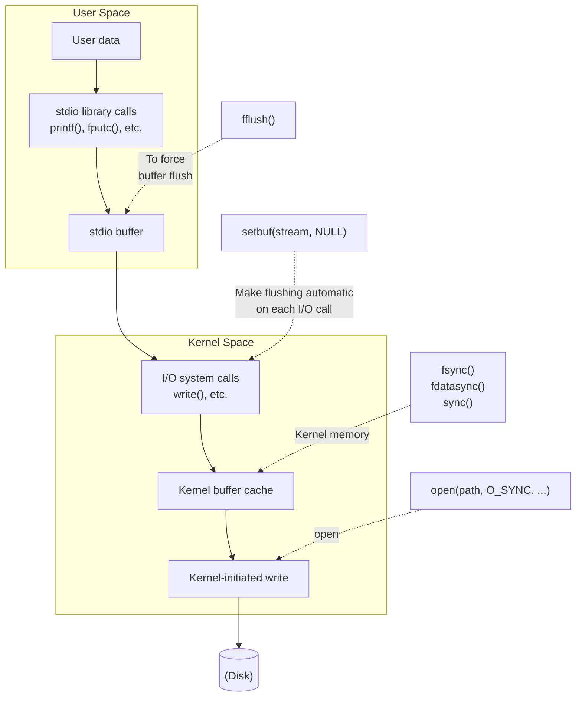

## Chapter 13
# <span id="page-0-0"></span>**FILE I/O BUFFERING**

In the interests of speed and efficiency, I/O system calls (i.e., the kernel) and the I/O functions of the standard C library (i.e., the stdio functions) buffer data when operating on disk files. In this chapter, we describe both types of buffering and consider how they affect application performance. We also look at various techniques for influencing and disabling both types of buffering, and look at a technique called direct I/O, which is useful for bypassing kernel buffering in certain circumstances.

# **13.1 Kernel Buffering of File I/O: The Buffer Cache**

<span id="page-0-1"></span>When working with disk files, the read() and write() system calls don't directly initiate disk access. Instead, they simply copy data between a user-space buffer and a buffer in the kernel buffer cache. For example, the following call transfers 3 bytes of data from a buffer in user-space memory to a buffer in kernel space:

```
write(fd, "abc", 3);
```

At this point, write() returns. At some later point, the kernel writes (flushes) its buffer to the disk. (Hence, we say that the system call is not synchronized with the disk operation.) If, in the interim, another process attempts to read these bytes of the file, then the kernel automatically supplies the data from the buffer cache, rather than from (the outdated contents of) the file.

Correspondingly, for input, the kernel reads data from the disk and stores it in a kernel buffer. Calls to read() fetch data from this buffer until it is exhausted, at which point the kernel reads the next segment of the file into the buffer cache. (This is a simplification; for sequential file access, the kernel typically performs read-ahead to try to ensure that the next blocks of a file are read into the buffer cache before the reading process requires them. We say a bit more about readahead in Section [13.5](#page-11-0).)

The aim of this design is to allow read() and write() to be fast, since they don't need to wait on a (slow) disk operation. This design is also efficient, since it reduces the number of disk transfers that the kernel must perform.

The Linux kernel imposes no fixed upper limit on the size of the buffer cache. The kernel will allocate as many buffer cache pages as are required, limited only by the amount of available physical memory and the demands for physical memory for other purposes (e.g., holding the text and data pages required by running processes). If available memory is scarce, then the kernel flushes some modified buffer cache pages to disk, in order to free those pages for reuse.

> Speaking more precisely, from kernel 2.4 onward, Linux no longer maintains a separate buffer cache. Instead, file I/O buffers are included in the page cache, which, for example, also contains pages from memory-mapped files. Nevertheless, in the discussion in the main text, we use the term buffer cache, since that term is historically common on UNIX implementations.

### **Effect of buffer size on I/O system call performance**

The kernel performs the same number of disk accesses, regardless of whether we perform 1000 writes of a single byte or a single write of a 1000 bytes. However, the latter is preferable, since it requires a single system call, while the former requires 1000. Although much faster than disk operations, system calls nevertheless take an appreciable amount of time, since the kernel must trap the call, check the validity of the system call arguments, and transfer data between user space and kernel space (refer to Section 3.1 for further details).

The impact of performing file I/O using different buffer sizes can be seen by running the program in Listing 4-1 (on page 71) with different BUF\_SIZE values. (The BUF\_SIZE constant specifies how many bytes are transferred by each call to read() and write().) Table 13-1 shows the time that this program requires to copy a file of 100 million bytes on a Linux ext2 file system using different BUF\_SIZE values. Note the following points concerning the information in this table:

-  The Elapsed and Total CPU time columns have the obvious meanings. The User CPU and System CPU columns show a breakdown of the Total CPU time into, respectively, the time spent executing code in user mode and the time spent executing kernel code (i.e., system calls).
-  The tests shown in the table were performed using a vanilla 2.6.30 kernel on an ext2 file system with a block size of 4096 bytes.

When we talk about a vanilla kernel, we mean an unpatched mainline kernel. This is in contrast to kernels that are supplied by most distributors, which often include various patches to fix bugs or add features.

 Each row shows the average of 20 runs for the given buffer size. In these tests, as in other tests shown later in this chapter, the file system was unmounted and remounted between each execution of the program to ensure that the buffer cache for the file system was empty. Timing was done using the shell time command.

**Table 13-1:** Time required to duplicate a file of 100 million bytes

|          | Time (seconds) |           |          |            |  |  |
|----------|----------------|-----------|----------|------------|--|--|
| BUF_SIZE | Elapsed        | Total CPU | User CPU | System CPU |  |  |
| 1        | 107.43         | 107.32    | 8.20     | 99.12      |  |  |
| 2        | 54.16          | 53.89     | 4.13     | 49.76      |  |  |
| 4        | 31.72          | 30.96     | 2.30     | 28.66      |  |  |
| 8        | 15.59          | 14.34     | 1.08     | 13.26      |  |  |
| 16       | 7.50           | 7.14      | 0.51     | 6.63       |  |  |
| 32       | 3.76           | 3.68      | 0.26     | 3.41       |  |  |
| 64       | 2.19           | 2.04      | 0.13     | 1.91       |  |  |
| 128      | 2.16           | 1.59      | 0.11     | 1.48       |  |  |
| 256      | 2.06           | 1.75      | 0.10     | 1.65       |  |  |
| 512      | 2.06           | 1.03      | 0.05     | 0.98       |  |  |
| 1024     | 2.05           | 0.65      | 0.02     | 0.63       |  |  |
| 4096     | 2.05           | 0.38      | 0.01     | 0.38       |  |  |
| 16384    | 2.05           | 0.34      | 0.00     | 0.33       |  |  |
| 65536    | 2.06           | 0.32      | 0.00     | 0.32       |  |  |

Since the total amount of data transferred (and hence the number of disk operations) is the same for the various buffer sizes, what Table 13-1 illustrates is the overhead of making read() and write() calls. With a buffer size of 1 byte, 100 million calls are made to read() and write(). With a buffer size of 4096 bytes, the number of invocations of each system call falls to around 24,000, and near optimal performance is reached. Beyond this point, there is no significant performance improvement, because the cost of making read() and write() system calls becomes negligible compared to the time required to copy data between user space and kernel space, and to perform actual disk I/O.

> The final rows of Table 13-1 allow us to make rough estimates of the times required for data transfer between user space and kernel space, and for file I/O. Since the number of system calls in these cases is relatively small, their contribution to the elapsed and CPU times is negligible. Thus, we can say that the System CPU time is essentially measuring the time for data transfers between user space and kernel space. The Elapsed time value gives us an estimate of the time required for data transfer to and from the disk. (As we'll see in a moment, this is mainly the time required for disk reads.)

In summary, if we are transferring a large amount of data to or from a file, then by buffering data in large blocks, and thus performing fewer system calls, we can greatly improve I/O performance.

The data in Table 13-1 measures a range of factors: the time to perform read() and write() system calls, the time to transfer data between buffers in kernel space and user space, and the time to transfer data between kernel buffers and the disk. Let's consider the last factor further. Obviously, transferring the contents of the input file into the buffer cache is unavoidable. However, we already saw that write() returns immediately after transferring data from user space to the kernel buffer cache. Since the RAM size on the test system (4 GB) far exceeds the size of the file being copied (100 MB), we can assume that by the time the program completes, the output file has not actually been written to disk. Therefore, as a further experiment, we ran a program that simply wrote arbitrary data to a file using different write() buffer sizes. The results are shown in Table 13-2.

Again, the data shown in Table 13-2 was obtained from kernel 2.6.30, on an ext2 file system with a 4096-byte block size, and each row shows the average of 20 runs. We don't show the test program (filebuff/write\_bytes.c), but it is available in the source code distribution for this book.

|  | Table 13-2: Time required to write a file of 100 million bytes |  |  |
|--|----------------------------------------------------------------|--|--|
|--|----------------------------------------------------------------|--|--|

|          | Time (seconds) |           |          |            |  |  |
|----------|----------------|-----------|----------|------------|--|--|
| BUF_SIZE | Elapsed        | Total CPU | User CPU | System CPU |  |  |
| 1        | 72.13          | 72.11     | 5.00     | 67.11      |  |  |
| 2        | 36.19          | 36.17     | 2.47     | 33.70      |  |  |
| 4        | 20.01          | 19.99     | 1.26     | 18.73      |  |  |
| 8        | 9.35           | 9.32      | 0.62     | 8.70       |  |  |
| 16       | 4.70           | 4.68      | 0.31     | 4.37       |  |  |
| 32       | 2.39           | 2.39      | 0.16     | 2.23       |  |  |
| 64       | 1.24           | 1.24      | 0.07     | 1.16       |  |  |
| 128      | 0.67           | 0.67      | 0.04     | 0.63       |  |  |
| 256      | 0.38           | 0.38      | 0.02     | 0.36       |  |  |
| 512      | 0.24           | 0.24      | 0.01     | 0.23       |  |  |
| 1024     | 0.17           | 0.17      | 0.01     | 0.16       |  |  |
| 4096     | 0.11           | 0.11      | 0.00     | 0.11       |  |  |
| 16384    | 0.10           | 0.10      | 0.00     | 0.10       |  |  |
| 65536    | 0.09           | 0.09      | 0.00     | 0.09       |  |  |

Table 13-2 shows the costs just for making write() system calls and transferring data from user space to the kernel buffer cache using different write() buffer sizes. For larger buffer sizes, we see significant differences from the data shown in Table 13-1. For example, for a 65,536-byte buffer size, the elapsed time in Table 13-1 is 2.06 seconds, while for Table 13-2 it is 0.09 seconds. This is because no actual disk I/O is being performed in the latter case. In other words, the majority of the time required for the large buffer cases in Table 13-1 is due to the disk reads.

As we'll see in Section [13.3,](#page-6-0) when we force output operations to block until data is transferred to the disk, the times for write() calls rise significantly.

Finally, it is worth noting that the information in Table 13-2 (and later, in [Table 13-3](#page-9-0)) represents just one form of (naive) benchmark for a file system. Furthermore, the results will probably show some variation across file systems. File systems can be measured by various other criteria, such as performance under heavy multiuser load, speed of file creation and deletion, time required to search for a file in a large directory, space required to store small files, or maintenance of file integrity in the event of a system crash. Where the performance of I/O or other file-system operations is critical, there is no substitute for application-specific benchmarks on the target platform.

# **13.2 Buffering in the stdio Library**

Buffering of data into large blocks to reduce system calls is exactly what is done by the C library I/O functions (e.g., fprintf(), fscanf(), fgets(), fputs(), fputc(), fgetc()) when operating on disk files. Thus, using the stdio library relieves us of the task of buffering data for output with write() or input via read().

### **Setting the buffering mode of a stdio stream**

The setvbuf() function controls the form of buffering employed by the stdio library.

```
#include <stdio.h>
int setvbuf(FILE *stream, char *buf, int mode, size_t size);
                                      Returns 0 on success, or nonzero on error
```

The stream argument identifies the file stream whose buffering is to be modified. After the stream has been opened, the setvbuf() call must be made before calling any other stdio function on the stream. The setvbuf() call affects the behavior of all subsequent stdio operations on the specified stream.

> The streams used by the stdio library should not be confused with the STREAMS facility of System V. The System V STREAMS facility is not implemented in the mainline Linux kernel.

The buf and size arguments specify the buffer to be used for stream. These arguments may be specified in two ways:

-  If buf is non-NULL, then it points to a block of memory of size bytes that is to be used as the buffer for stream. Since the buffer pointed to by buf is then used by the stdio library, it should be either statically allocated or dynamically allocated on the heap (using malloc() or similar). It should not be allocated as a local function variable on the stack, since chaos will result when that function returns and its stack frame is deallocated.
-  If buf is NULL, then the stdio library automatically allocates a buffer for use with stream (unless we select unbuffered I/O, as described below). SUSv3 permits, but does not require, an implementation to use size to determine the size for this buffer. In the glibc implementation, size is ignored in this case.

The mode argument specifies the type of buffering and has one of the following values: \_IONBF

Don't buffer I/O. Each stdio library call results in an immediate write() or read() system call. The buf and size arguments are ignored, and can be specified as NULL and 0, respectively. This is the default for stderr, so that error output is guaranteed to appear immediately.

\_IOLBF

Employ line-buffered I/O. This flag is the default for streams referring to terminal devices. For output streams, data is buffered until a newline character is output (unless the buffer fills first). For input streams, data is read a line at a time.

\_IOFBF

Employ fully buffered I/O. Data is read or written (via calls to read() or write()) in units equal to the size of the buffer. This mode is the default for streams referring to disk files.

The following code demonstrates the use of setvbuf():

```
#define BUF_SIZE 1024
static char buf[BUF_SIZE];
if (setvbuf(stdout, buf, _IOFBF, BUF_SIZE) != 0)
 errExit("setvbuf");
```

Note that setvbuf() returns a nonzero value (not necessarily –1) on error.

The setbuf() function is layered on top of setvbuf(), and performs a similar task.

```
#include <stdio.h>
void setbuf(FILE *stream, char *buf);
```

Other than the fact that it doesn't return a function result, the call setbuf(fp, buf) is equivalent to:

```
setvbuf(fp, buf, (buf != NULL) ? _IOFBF: _IONBF, BUFSIZ);
```

The buf argument is specified either as NULL, for no buffering, or as a pointer to a caller-allocated buffer of BUFSIZ bytes. (BUFSIZ is defined in <stdio.h>. In the glibc implementation, this constant has the value 8192, which is typical.)

The setbuffer() function is similar to setbuf(), but allows the caller to specify the size of buf.

```
#define _BSD_SOURCE
#include <stdio.h>
void setbuffer(FILE *stream, char *buf, size_t size);
```

The call setbuffer(fp, buf, size) is equivalent to the following:

```
setvbuf(fp, buf, (buf != NULL) ? _IOFBF : _IONBF, size);
```

The setbuffer() function is not specified in SUSv3, but is available on most UNIX implementations.

### **Flushing a stdio buffer**

Regardless of the current buffering mode, at any time, we can force the data in a stdio output stream to be written (i.e., flushed to a kernel buffer via write()) using the fflush() library function. This function flushes the output buffer for the specified stream.

```
#include <stdio.h>
int fflush(FILE *stream);
                                               Returns 0 on success, EOF on error
```

If stream is NULL, fflush() flushes all stdio buffers.

The fflush() function can also be applied to an input stream. This causes any buffered input to be discarded. (The buffer will be refilled when the program next tries to read from the stream.)

A stdio buffer is automatically flushed when the corresponding stream is closed.

In many C library implementations, including glibc, if stdin and stdout refer to a terminal, then an implicit fflush(stdout) is performed whenever input is read from stdin. This has the effect of flushing any prompts written to stdout that don't include a terminating newline character (e.g., printf("Date: ")). However, this behavior is not specified in SUSv3 or C99 and is not implemented in all C libraries. Portable programs should use explicit fflush(stdout) calls to ensure that such prompts are displayed.

> The C99 standard makes two requirements if a stream is opened for both input and output. First, an output operation can't be directly followed by an input operation without an intervening call to fflush() or one of the file-positioning functions (fseek(), fsetpos(), or rewind()). Second, an input operation can't be directly followed by an output operation without an intervening call to one of the file-positioning functions, unless the input operation encountered endof-file.

# <span id="page-6-0"></span>**13.3 Controlling Kernel Buffering of File I/O**

<span id="page-6-1"></span>It is possible to force flushing of kernel buffers for output files. Sometimes, this is necessary if an application (e.g., a database journaling process) must ensure that output really has been written to the disk (or at least to the disk's hardware cache) before continuing.

Before we describe the system calls used to control kernel buffering, it is useful to consider a few relevant definitions from SUSv3.

### **Synchronized I/O data integrity and synchronized I/O file integrity**

SUSv3 defines the term synchronized I/O completion to mean "an I/O operation that has either been successfully transferred [to the disk] or diagnosed as unsuccessful."

SUSv3 defines two different types of synchronized I/O completion. The difference between the types involves the metadata ("data about data") describing the file, which the kernel stores along with the data for a file. We consider file metadata in detail when we look at file i-nodes in Section [14.4,](#page-23-0) but for now, it is sufficient to note that the file metadata includes information such as the file owner and group; file permissions; file size; number of (hard) links to the file; timestamps indicating the time of the last file access, last file modification, and last metadata change; and file data block pointers.

The first type of synchronized I/O completion defined by SUSv3 is synchronized I/O data integrity completion. This is concerned with ensuring that a file data update transfers sufficient information to allow a later retrieval of that data to proceed.

-  For a read operation, this means that the requested file data has been transferred (from the disk) to the process. If there were any pending write operations affecting the requested data, these are transferred to the disk before performing the read.
-  For a write operation, this means that the data specified in the write request has been transferred (to the disk) and all file metadata required to retrieve that data has also been transferred. The key point to note here is that not all modified file metadata attributes need to be transferred to allow the file data to be retrieved. An example of a modified file metadata attribute that would need to be transferred is the file size (if the write operation extended the file). By contrast, modified file timestamps would not need to be transferred to disk before a subsequent data retrieval could proceed.

The other type of synchronized I/O completion defined by SUSv3 is synchronized I/O file integrity completion, which is a superset of synchronized I/O data integrity completion. The difference with this mode of I/O completion is that during a file update, all updated file metadata is transferred to disk, even if it is not necessary for the operation of a subsequent read of the file data.

### **System calls for controlling kernel buffering of file I/O**

The fsync() system call causes the buffered data and all metadata associated with the open file descriptor fd to be flushed to disk. Calling fsync() forces the file to the synchronized I/O file integrity completion state.

```
#include <unistd.h>
int fsync(int fd);
                                              Returns 0 on success, or –1 on error
```

An fsync() call returns only after the transfer to the disk device (or at least its cache) has completed.

The fdatasync() system call operates similarly to fsync(), but only forces the file to the synchronized I/O data integrity completion state.

```
#include <unistd.h>
int fdatasync(int fd);
                                             Returns 0 on success, or –1 on error
```

Using fdatasync() potentially reduces the number of disk operations from the two required by fsync() to one. For example, if the file data has changed, but the file size has not, then calling fdatasync() only forces the data to be updated. (We noted above that changes to file metadata attributes such as the last modification timestamp don't need to be transferred for synchronized I/O data completion.) By contrast, calling fsync() would also force the metadata to be transferred to disk.

Reducing the number of disk I/O operations in this manner is useful for certain applications in which performance is crucial and the accurate maintenance of certain metadata (such as timestamps) is not essential. This can make a considerable performance difference for applications that are making multiple file updates: because the file data and metadata normally reside on different parts of the disk, updating them both would require repeated seek operations backward and forward across the disk.

In Linux 2.2 and earlier, fdatasync() is implemented as a call to fsync(), and thus carries no performance gain.

> Starting with kernel 2.6.17, Linux provides the nonstandard sync\_file\_range() system call, which allows more precise control than fdatasync() when flushing file data. The caller can specify the file region to be flushed, and specify flags controlling whether the system call blocks on disk writes. See the sync\_file\_range(2) manual page for further details.

The sync() system call causes all kernel buffers containing updated file information (i.e., data blocks, pointer blocks, metadata, and so on) to be flushed to disk.

```
#include <unistd.h>
void sync(void);
```

In the Linux implementation, sync() returns only after all data has been transferred to the disk device (or at least to its cache). However, SUSv3 permits an implementation of sync() to simply schedule the I/O transfer and return before it has completed.

> A permanently running kernel thread ensures that modified kernel buffers are flushed to disk if they are not explicitly synchronized within 30 seconds. This is done to ensure that buffers don't remain unsynchronized with the corresponding disk file (and thus vulnerable to loss in the event of a system crash) for long periods. In Linux 2.6, this task is performed by the pdflush kernel thread. (In Linux 2.4, it is performed by the kupdated kernel thread.)

> The file /proc/sys/vm/dirty\_expire\_centisecs specifies the age (in hundredths of a second) that a dirty buffer must reach before it is flushed by pdflush. Additional files in the same directory control other aspects of the operation of pdflush.

### **Making all writes synchronous: O\_SYNC**

Specifying the O\_SYNC flag when calling open() makes all subsequent output synchronous:

```
fd = open(pathname, O_WRONLY | O_SYNC);
```

After this open() call, every write() to the file automatically flushes the file data and metadata to the disk (i.e., writes are performed according to synchronized I/O file integrity completion).

> Older BSD systems used the O\_FSYNC flag to provide O\_SYNC functionality. In glibc, O\_FSYNC is defined as a synonym for O\_SYNC.

### **Performance impact of O\_SYNC**

Using the O\_SYNC flag (or making frequent calls to fsync(), fdatasync(), or sync()) can strongly affect performance. [Table 13-3](#page-9-0) shows the time required to write 1 million bytes to a newly created file (on an ext2 file system) for a range of buffer sizes with and without O\_SYNC. The results were obtained (using the filebuff/write\_bytes.c program provided in the source code distribution for this book) using a vanilla 2.6.30 kernel and an ext2 file system with a block size of 4096 bytes. Each row shows the average of 20 runs for the given buffer size.

As can be seen from the table, O\_SYNC increases elapsed times enormously—in the 1-byte buffer case, by a factor of more than 1000. Note also the large differences between the elapsed and CPU times for writes with O\_SYNC. This is a consequence of the program being blocked while each buffer is actually transferred to disk.

The results shown in [Table 13-3](#page-9-0) omit a further factor that affects performance when using O\_SYNC. Modern disk drives have large internal caches, and by default, O\_SYNC merely causes data to be transferred to the cache. If we disable caching on the disk (using the command hdparm –W0), then the performance impact of O\_SYNC becomes even more extreme. In the 1-byte case, the elapsed time rises from 1030 seconds to around 16,000 seconds. In the 4096-byte case, the elapsed time rises from 0.34 seconds to 4 seconds.

In summary, if we need to force flushing of kernel buffers, we should consider whether we can design our application to use large write() buffer sizes or make judicious use of occasional calls to fsync() or fdatasync(), instead of using the O\_SYNC flag when opening the file.

|          |                |           | Time required (seconds) |             |
|----------|----------------|-----------|-------------------------|-------------|
| BUF_SIZE | Without O_SYNC |           |                         | With O_SYNC |
|          | Elapsed        | Total CPU | Elapsed                 | Total CPU   |
| 1        | 0.73           | 0.73      | 1030                    | 98.8        |
| 16       | 0.05           | 0.05      | 65.0                    | 0.40        |
| 256      | 0.02           | 0.02      | 4.07                    | 0.03        |

4096 0.01 0.01 0.34 0.03

<span id="page-9-0"></span>**Table 13-3:** Impact of the O\_SYNC flag on the speed of writing 1 million bytes

### **The O\_DSYNC and O\_RSYNC flags**

SUSv3 specifies two further open file status flags related to synchronized I/O: O\_DSYNC and O\_RSYNC.

The O\_DSYNC flag causes writes to be performed according to the requirements of synchronized I/O data integrity completion (like fdatasync()). This contrasts with O\_SYNC, which causes writes to be performed according to the requirements of synchronized I/O file integrity completion (like fsync()).

The O\_RSYNC flag is specified in conjunction with either O\_SYNC or O\_DSYNC, and extends the write behaviors of these flags to read operations. Specifying both O\_RSYNC and O\_DSYNC when opening a file means that all subsequent reads are completed according to the requirements of synchronized I/O data integrity (i.e., prior to performing the read, all pending file writes are completed as though carried out with O\_DSYNC). Specifying both O\_RSYNC and O\_SYNC when opening a file means that all subsequent reads are completed according to the requirements of synchronized I/O file integrity (i.e., prior to performing the read, all pending file writes are completed as though carried out with O\_SYNC).

Before kernel 2.6.33, the O\_DSYNC and O\_RSYNC flags were not implemented on Linux, and the glibc headers defined these constants to be the same as O\_SYNC. (This isn't actually correct in the case of O\_RSYNC, since O\_SYNC doesn't provide any functionality for read operations.)

Starting with kernel 2.6.33, Linux implements O\_DSYNC, and an implementation of O\_RSYNC is likely to be added in a future kernel release.

> Before kernel 2.6.33, Linux didn't fully implement O\_SYNC semantics. Instead, O\_SYNC was implemented as O\_DSYNC. To maintain consistent behavior for applications that were built for older kernels, applications that were linked against older versions of the GNU C library continue to provide O\_DSYNC semantics for O\_SYNC, even on Linux 2.6.33 and later.

# **13.4 Summary of I/O Buffering**

Figure 13-1 provides an overview of the buffering employed (for output files) by the stdio library and the kernel, along with the mechanisms for controlling each type of buffering. Traveling downward through the middle of this diagram, we see the transfer of user data by the stdio library functions to the stdio buffer, which is maintained in user memory space. When this buffer is filled, the stdio library invokes the write() system call, which transfers the data into the kernel buffer cache (maintained in kernel memory). Eventually, the kernel initiates a disk operation to transfer the data to the disk.

The left side of Figure 13-1 shows the calls that can be used at any time to explicitly force a flush of either of the buffers. The right side shows the calls that can be used to make flushing automatic, either by disabling buffering in the stdio library or by making file output system calls synchronous, so that each write() is immediately flushed to the disk.



Figure 13-1: Summary of I/O buffering

# <span id="page-11-0"></span>13.5 Advising the Kernel About I/O Patterns

The *posix\_fadvise()* system call allows a process to inform the kernel about its likely pattern for accessing file data.

```
#define _XOPEN_SOURCE 600
#include <fcntl.h>
\nint posix_fadvise(int fd, off_t offset, off_t len, int advice);
```

The kernel may (but is not obliged to) use the information provided by *posix\_fadvise()* to optimize its use of the buffer cache, thereby improving I/O performance for the process and for the system as a whole. Calling *posix\_fadvise()* has no effect on the semantics of a program.

The *fd* argument is a file descriptor identifying the file about whose access patterns we wish to inform the kernel. The *offset* and *len* arguments identify the region of the file about which advice is being given: *offset* specifies the starting offset of the region, and *len* specifies the size of the region in bytes. A *len* value of 0 means all

bytes from offset through to the end of the file. (In kernels before 2.6.6, a len of 0 was interpreted literally as zero bytes.)

The advice argument indicates the process's expected pattern of access for the file. It is specified as one of the following:

#### POSIX\_FADV\_NORMAL

The process has no special advice to give about access patterns. This is the default behavior if no advice is given for the file. On Linux, this operation sets the file read-ahead window to the default size (128 kB).

#### POSIX\_FADV\_SEQUENTIAL

The process expects to read data sequentially from lower offsets to higher offsets. On Linux, this operation sets the file read-ahead window to the twice the default size.

#### POSIX\_FADV\_RANDOM

The process expects to access the data in random order. On Linux, this option disables file read-ahead.

#### POSIX\_FADV\_WILLNEED

The process expects to access the specified file region in the near future. The kernel performs read-ahead to populate the buffer cache with file data in the range specified by offset and len. Subsequent read() calls on the file don't block on disk I/O; instead, they simply fetch data from the buffer cache. The kernel provides no guarantees about how long the data fetched from the file will remain resident in the buffer cache. If other processes or kernel activities place a sufficiently strong demand on memory, then the pages will eventually be reused. In other words, if memory pressure is high, then we should ensure that the elapsed time between the posix\_fadvise() call and the subsequent read() call(s) is short. (The Linux-specific readahead() system call provides functionality equivalent to the POSIX\_FADV\_WILLNEED operation.)

#### POSIX\_FADV\_DONTNEED

The process expects not to access the specified file region in the near future. This advises the kernel that it can free the corresponding cache pages (if there are any). On Linux, this operation is performed in two steps. First, if the underlying device is not currently congested with a series of queued write operations, the kernel flushes any modified pages in the specified region. Second, the kernel attempts to free any cache pages for the region. For modified pages in the region, this second step will succeed only if the pages have been written to the underlying device in the first step—that is, if the device's write queue was not congested. Since congestion on the device can't be controlled by the application, an alternate way of ensuring that the cache pages can be freed is to precede the POSIX\_FADV\_DONTNEED operation with a sync() or fdatasync() call that specifies fd.

#### POSIX\_FADV\_NOREUSE

The process expects to access data in the specified file region once, and then not to reuse it. This hint tells the kernel that it can free the pages after they have been accessed once. On Linux, this operation currently has no effect.

<span id="page-13-0"></span>The specification of posix\_fadvise() is new in SUSv3, and not all UNIX implementations support this interface. Linux provides posix\_fadvise() since kernel 2.6.

# **13.6 Bypassing the Buffer Cache: Direct I/O**

Starting with kernel 2.4, Linux allows an application to bypass the buffer cache when performing disk I/O, thus transferring data directly from user space to a file or disk device. This is sometimes termed direct I/O or raw I/O.

> The details described here are Linux-specific and are not standardized by SUSv3. Nevertheless, most UNIX implementations provide some form of direct I/O access to devices and files.

Direct I/O is sometimes misunderstood as being a means of obtaining fast I/O performance. However, for most applications, using direct I/O can considerably degrade performance. This is because the kernel applies a number of optimizations to improve the performance of I/O done via the buffer cache, including performing sequential read-ahead, performing I/O in clusters of disk blocks, and allowing processes accessing the same file to share buffers in the cache. All of these optimizations are lost when we use direct I/O. Direct I/O is intended only for applications with specialized I/O requirements. For example, database systems that perform their own caching and I/O optimizations don't need the kernel to consume CPU time and memory performing the same tasks.

We can perform direct I/O either on an individual file or on a block device (e.g., a disk). To do this, we specify the O\_DIRECT flag when opening the file or device with open().

The O\_DIRECT flag is effective since kernel 2.4.10. Not all Linux file systems and kernel versions support the use of this flag. Most native file systems support O\_DIRECT, but many non-UNIX file systems (e.g., VFAT) do not. It may be necessary to test the file system concerned (if a file system doesn't support O\_DIRECT, then open() fails with the error EINVAL) or read the kernel source code to check for this support.

> If a file is opened with O\_DIRECT by one process, and opened normally (i.e., so that the buffer cache is used) by another process, then there is no coherency between the contents of the buffer cache and the data read or written via direct I/O. Such scenarios should be avoided.

> The raw(8) manual page describes an older (now deprecated) technique for obtaining raw access to a disk device.

### **Alignment restrictions for direct I/O**

Because direct I/O (on both disk devices and files) involves direct access to the disk, we must observe a number of restrictions when performing I/O:

-  The data buffer being transferred must be aligned on a memory boundary that is a multiple of the block size.
-  The file or device offset at which data transfer commences must be a multiple of the block size.
-  The length of the data to be transferred must be a multiple of the block size.

Failure to observe any of these restrictions results in the error EINVAL. In the above list, block size means the physical block size of the device (typically 512 bytes).

> When performing direct I/O, Linux 2.4 is more restrictive than Linux 2.6: the alignment, length, and offset must be multiples of the logical block size of the underlying file system. (Typical file system logical block sizes are 1024, 2048, or 4096 bytes.)

### **Example program**

Listing 13-1 provides a simple example of the use of O\_DIRECT while opening a file for reading. This program takes up to four command-line arguments specifying, in order, the file to be read, the number of bytes to be read from the file, the offset to which the program should seek before reading from the file, and the alignment of the data buffer passed to read(). The last two arguments are optional, and default to offset 0 and 4096 bytes, respectively. Here are some examples of what we see when we run this program:

```
$ ./direct_read /test/x 512 Read 512 bytes at offset 0
Read 512 bytes Succeeds
$ ./direct_read /test/x 256
ERROR [EINVAL Invalid argument] read Length is not a multiple of 512
$ ./direct_read /test/x 512 1
ERROR [EINVAL Invalid argument] read Offset is not a multiple of 512
$ ./direct_read /test/x 4096 8192 512
Read 4096 bytes Succeeds
$ ./direct_read /test/x 4096 512 256
ERROR [EINVAL Invalid argument] read Alignment is not a multiple of 512
```

The program in Listing 13-1 uses the memalign() function to allocate a block of memory aligned on a multiple of its first argument. We describe memalign() in Section 7.1.4.

**Listing 13-1:** Using O\_DIRECT to bypass the buffer cache

```
–––––––––––––––––––––––––––––––––––––––––––––––––––– filebuff/direct_read.c
#define _GNU_SOURCE /* Obtain O_DIRECT definition from <fcntl.h> */
#include <fcntl.h>
#include <malloc.h>
#include "tlpi_hdr.h"
int
main(int argc, char *argv[])
{
 int fd;
 ssize_t numRead;
 size_t length, alignment;
 off_t offset;
 void *buf;
 if (argc < 3 || strcmp(argv[1], "--help") == 0)
 usageErr("%s file length [offset [alignment]]\n", argv[0]);
```

```
 length = getLong(argv[2], GN_ANY_BASE, "length");
 offset = (argc > 3) ? getLong(argv[3], GN_ANY_BASE, "offset") : 0;
 alignment = (argc > 4) ? getLong(argv[4], GN_ANY_BASE, "alignment") : 4096;
 fd = open(argv[1], O_RDONLY | O_DIRECT);
 if (fd == -1)
 errExit("open");
 /* memalign() allocates a block of memory aligned on an address that
 is a multiple of its first argument. The following expression
 ensures that 'buf' is aligned on a non-power-of-two multiple of
 'alignment'. We do this to ensure that if, for example, we ask
 for a 256-byte aligned buffer, then we don't accidentally get
 a buffer that is also aligned on a 512-byte boundary.
 The '(char *)' cast is needed to allow pointer arithmetic (which
 is not possible on the 'void *' returned by memalign()). */
 buf = (char *) memalign(alignment * 2, length + alignment) + alignment;
 if (buf == NULL)
 errExit("memalign");
 if (lseek(fd, offset, SEEK_SET) == -1)
 errExit("lseek");
 numRead = read(fd, buf, length);
 if (numRead == -1)
 errExit("read");
 printf("Read %ld bytes\n", (long) numRead);
 exit(EXIT_SUCCESS);
}
–––––––––––––––––––––––––––––––––––––––––––––––––––– filebuff/direct_read.c
```

# **13.7 Mixing Library Functions and System Calls for File I/O**

It is possible to mix the use of system calls and the standard C library functions to perform I/O on the same file. The fileno() and fdopen() functions assist us with this task.

```
#include <stdio.h>
int fileno(FILE *stream);
                                Returns file descriptor on success, or –1 on error
FILE *fdopen(int fd, const char *mode);
                           Returns (new) file pointer on success, or NULL on error
```

Given a stream, fileno() returns the corresponding file descriptor (i.e., the one that the stdio library has opened for this stream). This file descriptor can then be used in the usual way with I/O system calls such as read(), write(), dup(), and fcntl().

The fdopen() function is the converse of fileno(). Given a file descriptor, it creates a corresponding stream that uses this descriptor for its I/O. The mode argument is the same as for fopen(); for example, r for read, w for write, or a for append. If this argument is not consistent with the access mode of the file descriptor fd, then fdopen() fails.

The fdopen() function is especially useful for descriptors referring to files other than regular files. As we'll see in later chapters, the system calls for creating sockets and pipes always return file descriptors. To use the stdio library with these file types, we must use fdopen() to create a corresponding file stream.

When using the stdio library functions in conjunction with I/O system calls to perform I/O on disk files, we must keep buffering issues in mind. I/O system calls transfer data directly to the kernel buffer cache, while the stdio library waits until the stream's user-space buffer is full before calling write() to transfer that buffer to the kernel buffer cache. Consider the following code used to write to standard output:

```
printf("To man the world is twofold, ");
write(STDOUT_FILENO, "in accordance with his twofold attitude.\n", 41);
```

In the usual case, the output of the printf() will typically appear after the output of the write(), so that this code yields the following output:

```
in accordance with his twofold attitude.
To man the world is twofold,
```

When intermingling I/O system calls and stdio functions, judicious use of fflush() may be required to avoid this problem. We could also use setvbuf() or setbuf() to disable buffering, but doing so might impact I/O performance for the application, since each output operation would then result in the execution of a write() system call.

> SUSv3 goes to some length specifying the requirements for an application to be able to mix the use of I/O system calls and stdio functions. See the section headed Interaction of File Descriptors and Standard I/O Streams under the chapter General Information in the System Interfaces (XSH) volume for details.

# **13.8 Summary**

Buffering of input and output data is performed by the kernel, and also by the stdio library. In some cases, we may wish to prevent buffering, but we need to be aware of the impact this has on application performance. Various system calls and library functions can be used to control kernel and stdio buffering and to perform one-off buffer flushes.

A process can use posix\_fadvise() to advise the kernel of its likely pattern for accessing data from a specified file. The kernel may use this information to optimize the use of the buffer cache, thus improving I/O performance.

The Linux-specific open() O\_DIRECT flag allows specialized applications to bypass the buffer cache.

The fileno() and fdopen() functions assist us with the task of mixing system calls and standard C library functions to perform I/O on the same file. Given a stream, fileno() returns the corresponding file descriptor; fdopen() performs the converse operation, creating a new stream that employs a specified open file descriptor.

### **Further information**

[Bach, 1986] describes the implementation and advantages of the buffer cache on System V. [Goodheart & Cox, 1994] and [Vahalia, 1996] also describe the rationale and implementation of the System V buffer cache. Further relevant information specific to Linux can be found in [Bovet & Cesati, 2005] and [Love, 2010].

# **13.9 Exercises**

- **13-1.** Using the time built-in command of the shell, try timing the operation of the program in Listing 4-1 (copy.c) on your system.
  - a) Experiment with different file and buffer sizes. You can set the buffer size using the –DBUF\_SIZE=nbytes option when compiling the program.
  - b) Modify the open() system call to include the O\_SYNC flag. How much difference does this make to the speed for various buffer sizes?
  - c) Try performing these timing tests on a range of file systems (e.g., ext3, XFS, Btrfs, and JFS). Are the results similar? Are the trends the same when going from small to large buffer sizes?
- **13-2.** Time the operation of the filebuff/write\_bytes.c program (provided in the source code distribution for this book) for various buffer sizes and file systems.
- **13-3.** What is the effect of the following statements?

```
fflush(fp);
fsync(fileno(fp));
```

**13-4.** Explain why the output of the following code differs depending on whether standard output is redirected to a terminal or to a disk file.

```
printf("If I had more time, \n");
write(STDOUT_FILENO, "I would have written you a shorter letter.\n", 43);
```

**13-5.** The command tail [ –n num ] file prints the last num lines (ten by default) of the named file. Implement this command using I/O system calls (lseek(), read(), write(), and so on). Keep in mind the buffering issues described in this chapter, in order to make the implementation efficient.

