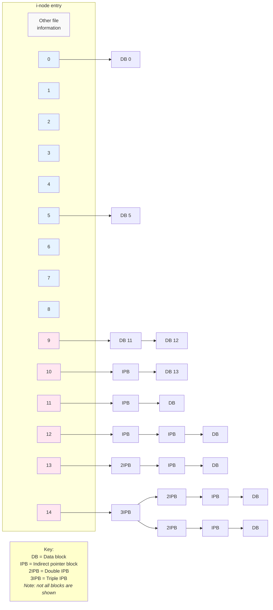
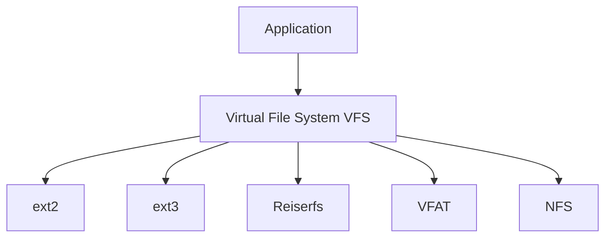
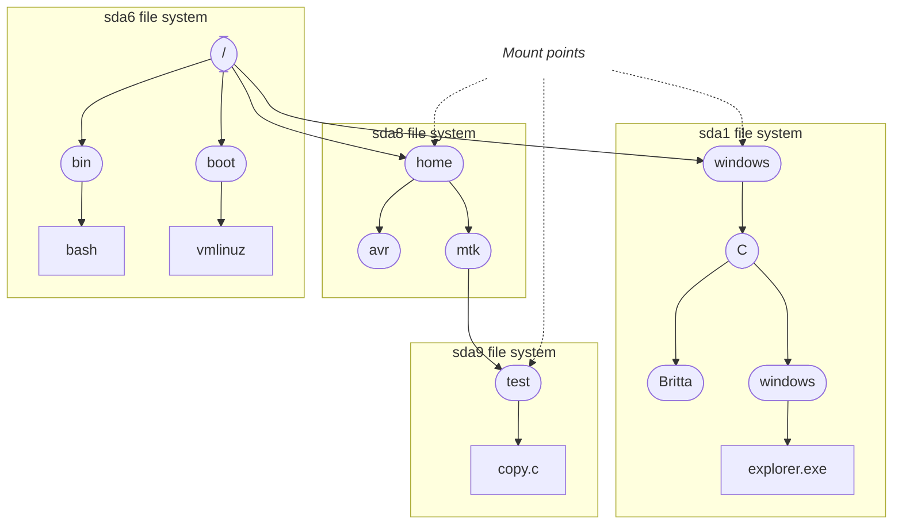

## Chapter 14
# **FILE SYSTEMS**

In Chapters 4, 5, and [13](#page-0-0), we looked at file I/O, with a particular focus on regular (i.e., disk) files. In this and the following chapters, we go into detail on a range of file-related topics:

-  This chapter looks at file systems.
-  Chapter [15](#page-46-0) describes various attributes associated with a file, including the timestamps, ownership, and permissions.
-  Chapters 16 and 17 consider two new features of Linux 2.6: extended attributes and access control lists (ACLs). Extended attributes are a method of associating arbitrary metadata with a file. ACLs are an extension of the traditional UNIX file permission model.
-  Chapter 18 looks at directories and links.

The majority of this chapter is concerned with file systems, which are organized collections of files and directories. We explain a range of file-system concepts, sometimes using the traditional Linux ext2 file system as a specific example. We also briefly describe some of the journaling file systems available on Linux.

We conclude the chapter with a discussion of the system calls used to mount and unmount a file system, and the library functions used to obtain information about mounted file systems.

# **14.1 Device Special Files (Devices)**

<span id="page-19-0"></span>This chapter frequently mentions disk devices, so we start with a brief overview of the concept of a device file.

A device special file corresponds to a device on the system. Within the kernel, each device type has a corresponding device driver, which handles all I/O requests for the device. A device driver is a unit of kernel code that implements a set of operations that (normally) correspond to input and output actions on an associated piece of hardware. The API provided by device drivers is fixed, and includes operations corresponding to the system calls open(), close(), read(), write(), mmap(), and ioctl(). The fact that each device driver provides a consistent interface, hiding the differences in operation of individual devices, allows for universality of I/O (Section 4.2).

Some devices are real, such as mice, disks, and tape drives. Others are virtual, meaning that there is no corresponding hardware; rather, the kernel provides (via a device driver) an abstract device with an API that is the same as a real device.

Devices can be divided into two types:

-  Character devices handle data on a character-by-character basis. Terminals and keyboards are examples of character devices.
-  Block devices handle data a block at a time. The size of a block depends on the type of device, but is typically some multiple of 512 bytes. Examples of block devices include disks and tape drives.

Device files appear within the file system, just like other files, usually under the /dev directory. The superuser can create a device file using the mknod command, and the same task can be performed in a privileged (CAP\_MKNOD) program using the mknod() system call.

> We don't describe the mknod() ("make file-system i-node") system call in detail since its use is straightforward, and the only purpose for which it is required nowadays is to create device files, which is not a common application requirement. We can also use mknod() to create FIFOs (Section 44.7), but the mkfifo() function is preferred for this task. Historically, some UNIX implementations also used mknod() for creating directories, but this use has now been replaced by the mkdir() system call. Nevertheless, some UNIX implementations—but not Linux—preserve this capability in mknod() for backward compatibility. See the mknod(2) manual page for further details.

In earlier versions of Linux, /dev contained entries for all possible devices on the system, even if such devices weren't actually connected to the system. This meant that /dev could contain literally thousands of unused entries, slowing the task of programs that needed to scan the contents of that directory, and making it impossible to use the contents of the directory as a means of discovering which devices were actually present on the system. In Linux 2.6, these problems are solved by the udev program. The udev program relies on the sysfs file system, which exports information about devices and other kernel objects into user space via a pseudo-file system mounted under /sys.

[Kroah-Hartman, 2003] provides an overview of udev, and outlines the reasons it is considered superior to devfs, the Linux 2.4 solution to the same problems. Information about the sysfs file system can be found in the Linux 2.6 kernel source file Documentation/filesystems/sysfs.txt and in [Mochel, 2005].

### **Device IDs**

Each device file has a major ID number and a minor ID number. The major ID identifies the general class of device, and is used by the kernel to look up the appropriate driver for this type of device. The minor ID uniquely identifies a particular device within a general class. The major and minor IDs of a device file are displayed by the ls –l command.

A device's major and minor IDs are recorded in the i-node for the device file. (We describe i-nodes in Section [14.4](#page-23-1).) Each device driver registers its association with a specific major device ID, and this association provides the connection between the device special file and the device driver. The name of the device file has no relevance when the kernel looks for the device driver.

On Linux 2.4 and earlier, the total number of devices on the system is limited by the fact that device major and minor IDs are each represented using just 8 bits. The fact that major device IDs are fixed and centrally assigned (by the Linux Assigned Names and Numbers Authority; see http://www.lanana.org/) further exacerbates this limitation. Linux 2.6 eases this limitation by using more bits to hold the major and minor device IDs (respectively, 12 and 20 bits).

# **14.2 Disks and Partitions**

Regular files and directories typically reside on hard disk devices. (Files and directories may also exist on other devices, such as CD-ROMs, flash memory cards, and virtual disks, but for the present discussion, we are interested primarily in hard disk devices.) In the following sections, we look at how disks are organized and divided into partitions.

### **Disk drives**

A hard disk drive is a mechanical device consisting of one or more platters that rotate at high speed (of the order of thousands of revolutions per minute). Magnetically encoded information on the disk surface is retrieved or modified by read/ write heads that move radially across the disk. Physically, information on the disk surface is located on a set of concentric circles called tracks. Tracks themselves are divided into a number of sectors, each of which consists of a series of physical blocks. Physical blocks are typically 512 bytes (or some multiple thereof) in size, and represent the smallest unit of information that the drive can read or write.

Although modern disks are fast, reading and writing information on the disk still takes significant time. The disk head must first move to the appropriate track (seek time), then the drive must wait until the appropriate sector rotates under the head (rotational latency), and finally the required blocks must be transferred (transfer time). The total time required to carry out such an operation is typically of the order of milliseconds. By comparison, modern CPUs are capable of executing millions of instructions in this time.

### **Disk partitions**

Each disk is divided into one or more (nonoverlapping) partitions. Each partition is treated by the kernel as a separate device residing under the /dev directory.

> The system administrator determines the number, type, and size of partitions on a disk using the fdisk command. The command fdisk –l lists all partitions on a disk. The Linux-specific /proc/partitions file lists the major and minor device numbers, size, and name of each disk partition on the system.

A disk partition may hold any type of information, but usually contains one of the following:

-  a file system holding regular files and directories, as described in Section [14.3](#page-21-0);
-  a data area accessed as a raw-mode device, as described in Section [13.6](#page-13-0) (some database management systems use this technique); or
-  a swap area used by the kernel for memory management.

A swap area is created using the mkswap(8) command. A privileged (CAP\_SYS\_ADMIN) process can use the swapon() system call to notify the kernel that a disk partition is to be used as a swap area. The swapoff() system call performs the converse function, telling the kernel to cease using a disk partition as a swap area. These system calls are not standardized in SUSv3, but they exist on many UNIX implementations. See the swapon(2), and swapon(8) manual pages for additional information.

> The Linux-specific /proc/swaps file can be used to display information about the currently enabled swap areas on the system. This information includes the size of each swap area and the amount of the area that is in use.

# <span id="page-21-0"></span>**14.3 File Systems**

A file system is an organized collection of regular files and directories. A file system is created using the mkfs command.

One of the strengths of Linux is that it supports a wide variety of file systems, including the following:

-  the traditional ext2 file system;
-  various native UNIX file systems such as the Minix, System V, and BSD file systems;
-  Microsoft's FAT, FAT32, and NTFS file systems;
-  the ISO 9660 CD-ROM file system;
-  Apple Macintosh's HFS;
-  a range of network file systems, including Sun's widely used NFS (information about the Linux implementation of NFS is available at http://nfs.sourceforge.net/), IBM and Microsoft's SMB, Novell's NCP, and the Coda file system developed at Carnegie Mellon University; and
-  a range of journaling file systems, including ext3, ext4, Reiserfs, JFS, XFS, and Btrfs.

The file-system types currently known by the kernel can be viewed in the Linux-specific /proc/filesystems file.

> Linux 2.6.14 added the Filesystem in Userspace (FUSE) facility. This mechanism adds hooks to the kernel that allow a file system to be completely implemented via a user-space program, without needing to patch or recompile the kernel. For further details, see http://fuse.sourceforge.net/.

### **The ext2 file system**

For many years, the most widely used file system on Linux was ext2, the Second Extended File System, which is the successor to the original Linux file system, ext. In more recent times, the use of ext2 has declined in favor of various journaling file systems. Sometimes, it is useful to describe generic file-system concepts in terms of a specific file-system implementation, and for this purpose, we use ext2 as an example at various points later in this chapter.

> The ext2 file system was written by Remy Card. The source code for ext2 is small (around 5000 lines of C) and forms the model for several other file-system implementations. The ext2 home page is http://e2fsprogs.sourceforge.net/ext2.html. This web site includes a good overview paper describing the implementation of ext2. The Linux Kernel, an online book by David Rusling available at http:// www.tldp.org/, also describes ext2.

### **File-system structure**

The basic unit for allocating space in a file system is a logical block, which is some multiple of contiguous physical blocks on the disk device on which the file system resides. For example, the logical block size on ext2 is 1024, 2048, or 4096 bytes. (The logical block size is specified as an argument of the mkfs(8) command used to build the file system.)

> A privileged (CAP\_SYS\_RAWIO) program can use the FIBMAP ioctl() operation to determine the physical location of a specified block of a file. The third argument of the call is a value-result integer. Before the call, this argument should be set to a logical block number (the first logical block is number 0); after the call, it is set to the number of the starting physical block where that logical block is stored.

[Figure 14-1](#page-22-0) shows the relationship between disk partitions and file systems, and shows the parts of a (generic) file system.

```text
┌──────────┬──────────┬──────────┐
Disk   │partition │partition │partition │
       └────┬─────┴─────┬────┴─────┬────┘
            │           │          │
            └─ ─ ─ ─ ─ ─┼─ ─ ─ ─ ─ ┘
                        │
       ┌────────┬───────┴──┬────────┬────────────────────────┐
File   │  boot  │  super-  │ i-node │     data blocks        │
system │  block │  block   │ table  │                        │
       └────────┴──────────┴────────┴────────────────────────┘
```

<span id="page-22-0"></span>**Figure 14-1:** Layout of disk partitions and a file system

A file system contains the following parts:

-  Boot block: This is always the first block in a file system. The boot block is not used by the file system; rather, it contains information used to boot the operating system. Although only one boot block is needed by the operating system, all file systems have a boot block (most of which are unused).
-  Superblock: This is a single block, immediately following the boot block, which contains parameter information about the file system, including:
  - the size of the i-node table;
  - the size of logical blocks in this file system; and
  - the size of the file system in logical blocks.

Different file systems residing on the same physical device can be of different types and sizes, and have different parameter settings (e.g., block size). This is one of the reasons for splitting a disk into multiple partitions.

-  I-node table: Each file or directory in the file system has a unique entry in the i-node table. This entry records various information about the file. I-nodes are discussed in greater detail in the next section. The i-node table is sometimes also called the i-list.
-  Data blocks: The great majority of space in a file system is used for the blocks of data that form the files and directories residing in the file system.

In the specific case of the ext2 file system, the picture is somewhat more complex than described in the main text. After the initial boot block, the file system is broken into a set of equal-sized block groups. Each block group contains a copy of the superblock, parameter information about the block group, and then the i-node table and data blocks for this block group. By attempting to store all of the blocks of a file within the same block group, the ext2 file system aims to reduce seek time when sequentially accessing a file. For further information, see the Linux source code file Documentation/filesystems/ext2.txt, the source code of the dumpe2fs program that comes as part of the e2fsprogs package, and [Bovet & Cesati, 2005].

# <span id="page-23-1"></span>**14.4 I-nodes**

<span id="page-23-0"></span>A file system's i-node table contains one i-node (short for index node) for each file residing in the file system. I-nodes are identified numerically by their sequential location in the i-node table. The i-node number (or simply i-number) of a file is the first field displayed by the ls –li command. The information maintained in an i-node includes the following:

-  File type (e.g., regular file, directory, symbolic link, character device).
-  Owner (also referred to as the user ID or UID) for the file.
-  Group (also referred to as the group ID or GID) for the file.
-  Access permissions for three categories of user: owner (sometimes referred to as user), group, and other (the rest of the world). Section [15.4](#page-61-0) provides further details.

-  Three timestamps: time of last access to the file (shown by ls –lu), time of last modification of the file (the default time shown by ls –l), and time of last status change (last change to i-node information, shown by ls –lc). As on other UNIX implementations, it is notable that most Linux file systems don't record the creation time of a file.
-  Number of hard links to the file.
-  Size of the file in bytes.
-  Number of blocks actually allocated to the file, measured in units of 512-byte blocks. There may not be a simple correspondence between this number and the size of the file in bytes, since a file can contain holes (Section 4.7), and thus require fewer allocated blocks than would be expected according to its nominal size in bytes.
-  Pointers to the data blocks of the file.

### **I-nodes and data block pointers in ext2**

Like most UNIX file systems, the ext2 file system doesn't store the data blocks of a file contiguously or even in sequential order (though it does attempt to store them close to one another). To locate the file data blocks, the kernel maintains a set of pointers in the i-node. The system used for doing this on the ext2 file system is shown in Figure 14-2.

> Removing the need to store the blocks of a file contiguously allows the file system to use space in an efficient way. In particular, it reduces the incidence of fragmentation of free disk space—the wastage created by the existence of numerous pieces of noncontiguous free space, all of which are too small to use. Put conversely, we could say that the advantage of efficiently using the free disk space is paid for by fragmenting files in the filled disk space.

Under ext2, each i-node contains 15 pointers. The first 12 of these pointers (numbered 0 to 11 in Figure 14-2) point to the location in the file system of the first 12 blocks of the file. The next pointer is a pointer to a block of pointers that give the locations of the thirteenth and subsequent data blocks of the file. The number of pointers in this block depends on the block size of the file system. Each pointer requires 4 bytes, so there may be from 256 pointers (for a 1024-byte block size) to 1024 pointers (for a 4096-byte block size). This allows for quite large files. For even larger files, the fourteenth pointer (numbered 13 in the diagram) is a double indirect pointer—it points to blocks of pointers that in turn point to blocks of pointers that in turn point to data blocks of the file. And should the need for a truly enormous file arise, there is a further level of indirection: the last pointer in the i-node is a triple-indirect pointer.

This seemingly complex system is designed to satisfy a number of requirements. To begin with, it allows the i-node structure to be a fixed size, while at the same time allowing for files of an arbitrary size. Additionally, it allows the file system to store the blocks of a file noncontiguously, while also allowing the data to be accessed randomly via lseek(); the kernel just needs to calculate which pointer(s) to follow. Finally, for small files, which form the overwhelming majority of files on most systems, this scheme allows the file data blocks to be accessed rapidly via the direct pointers of the i-node.



**Figure 14-2:** Structure of file blocks for a file in an *ext2* file system

<span id="page-25-0"></span>As an example, the author measured one system containing somewhat more than 150,000 files. Just over 30% of the files were less than 1000 bytes in size, and 80% occupied 10,000 bytes or less. Assuming a 1024-byte block size, all of the latter files could be referenced using just the 12 direct pointers, which can refer to blocks containing a total of 12,288 bytes. Using a 4096-byte block size, this limit rises to 49,152 bytes (95% of the files on the system fell under that limit).

This design also allows for enormous file sizes; for a block size of 4096 bytes, the theoretical largest file size is slightly more than 1024\*1024\*4096, or approximately 4 terabytes (4096 GB). (We say *slightly more* because of the blocks pointed to by the direct, indirect, and double indirect pointers. These are insignificant compared to the range that can be pointed to by the triple indirect pointer.)

One other benefit conferred by this design is that files can have holes, as described in Section 4.7. Rather than allocate blocks of null bytes for the holes in a file, the file system can just mark (with the value 0) appropriate pointers in the i-node and in the indirect pointer blocks to indicate that they don't refer to actual disk blocks.

# **14.5 The Virtual File System (VFS)**

Each of the file systems available on Linux differs in the details of its implementation. Such differences include, for example, the way in which the blocks of a file are allocated and the manner in which directories are organized. If every program that worked with files needed to understand the specific details of each file system, the task of writing programs that worked with all of the different file systems would be nearly impossible. The virtual file system (VFS, sometimes also referred to as the virtual file switch) is a kernel feature that resolves this problem by creating an abstraction layer for file-system operations (see Figure 14-3). The ideas behind the VFS are straightforward:

-  The VFS defines a generic interface for file-system operations. All programs that work with files specify their operations in terms of this generic interface.
-  Each file system provides an implementation for the VFS interface.

Under this scheme, programs need to understand only the VFS interface and can ignore details of individual file-system implementations.

The VFS interface includes operations corresponding to all of the usual system calls for working with file systems and directories, such as open(), read(), write(), lseek(), close(), truncate(), stat(), mount(), umount(), mmap(), mkdir(), link(), unlink(), symlink(), and rename().

The VFS abstraction layer is closely modeled on the traditional UNIX file-system model. Naturally, some file systems—especially non-UNIX file systems—don't support all of the VFS operations (e.g., Microsoft's VFAT doesn't support the notion of symbolic links, created using symlink()). In such cases, the underlying file system passes an error code back to the VFS layer indicating the lack of support, and the VFS in turn passes this error code back to the application.



**Figure 14-3:** The virtual file system

# **14.6 Journaling File Systems**

The ext2 file system is a good example of a traditional UNIX file system, and suffers from a classic limitation of such file systems: after a system crash, a file-system consistency check ( fsck) must be performed on reboot in order to ensure the integrity of the file system. This is necessary because, at the time of the system crash, a file update may have been only partially completed, and the file-system metadata (directory entries, i-node information, and file data block pointers) may be in an inconsistent state, so that the file system might be further damaged if these inconsistencies are not repaired. A file-system consistency check ensures the consistency of the file-system metadata. Where possible, repairs are performed; otherwise, information that is not retrievable (possibly including file data) is discarded.

The problem is that a consistency check requires examining the entire file system. On a small file system, this may take anything from several seconds to a few minutes. On a large file system, this may require several hours, which is a serious problem for systems that must maintain high availability (e.g., network servers).

Journaling file systems eliminate the need for lengthy file-system consistency checks after a system crash. A journaling file system logs (journals) all metadata updates to a special on-disk journal file before they are actually carried out. The updates are logged in groups of related metadata updates (transactions). In the event of a system crash in the middle of a transaction, on system reboot, the log can be used to rapidly redo any incomplete updates and bring the file system back to a consistent state. (To borrow database parlance, we can say that a journaling file system ensures that file metadata transactions are always committed as a complete unit.) Even very large journaling file systems can typically be available within seconds after a system crash, making them very attractive for systems with highavailability requirements.

The most notable disadvantage of journaling is that it adds time to file updates, though good design can make this overhead low.

> Some journaling file systems ensure only the consistency of file metadata. Because they don't log file data, data may still be lost in the event of a crash. The ext3, ext4, and Reiserfs file systems provide options for logging data updates, but, depending on the workload, this may result in lower file I/O performance.

The journaling file systems available for Linux include the following:

-  Reiserfs was the first of the journaling file systems to be integrated into the kernel (in version 2.4.1). Reiserfs provides a feature called tail packing (or tail merging): small files (and the final fragment of larger files) are packed into the same disk blocks as the file metadata. Because many systems have (and some applications create) large numbers of small files, this can save a significant amount of disk space.
-  The ext3 file system was a result of a project to add journaling to ext2 with minimal impact. The migration path from ext2 to ext3 is very easy (no backup and restore are required), and it is possible to migrate in the reverse direction as well. The ext3 file system was integrated into the kernel in version 2.4.15.

-  JFS was developed at IBM. It was integrated into the 2.4.20 kernel.
-  XFS (http://oss.sgi.com/projects/xfs/) was originally developed by Silicon Graphics (SGI) in the early 1990s for Irix, its proprietary UNIX implementation. In 2001, XFS was ported to Linux and made available as a free software project. XFS was integrated into the 2.4.24 kernel.

Support for the various file systems is enabled using kernel options that are set under the File systems menu when configuring the kernel.

At the time of writing, work is in progress on two other file systems that provide journaling and a range of other advanced features:

-  The ext4 file system (http://ext4.wiki.kernel.org/) is the successor to ext3. The first pieces of the implementation were added in kernel 2.6.19, and various features were added in later kernel versions. Among the planned (or already implemented) features for ext4 are extents (reservation of contiguous blocks of storage) and other allocation features that aim to reduce file fragmentation, online file-system defragmentation, faster file-system checking, and support for nanosecond timestamps.
-  Btrfs (B-tree FS, usually pronounced "butter FS"; http://btrfs.wiki.kernel.org/) is a new file system designed from the ground up to provide a range of modern features, including extents, writable snapshots (which provide functionality equivalent to metadata and data journaling), checksums on data and metadata, online file-system checking, online file-system defragmentation, space-efficient packing of small files, and space-efficient indexed directories. It was integrated into the kernel in version 2.6.29.

# **14.7 Single Directory Hierarchy and Mount Points**

On Linux, as on other UNIX systems, all files from all file systems reside under a single directory tree. At the base of this tree is the root directory, / (slash). Other file systems are mounted under the root directory and appear as subtrees within the overall hierarchy. The superuser uses a command of the following form to mount a file system:

#### \$ **mount** *device directory*

This command attaches the file system on the named device into the directory hierarchy at the specified directory—the file system's mount point. It is possible to change the location at which a file system is mounted—the file system is unmounted using the umount command, and then mounted once more at a different point.

> With Linux 2.4.19 and later, things became more complicated. The kernel now supports per-process mount namespaces. This means that each process potentially has its own set of file-system mount points, and thus may see a different single directory hierarchy from other processes. We explain this point further when we describe the CLONE\_NEWNS flag in Section 28.2.1.

To list the currently mounted file systems, we can use the command *mount*, with no arguments, as in the following example (whose output has been somewhat abridged):

### \$ mount /dev/sda6 on / type ext4 (rw) proc on /proc type proc (rw) sysfs on /sys type sysfs (rw) devpts on /dev/pts type devpts (rw,mode=0620,gid=5) /dev/sda8 on /home type ext3 (rw,acl,user xattr) /dev/sda1 on /windows/C type vfat (rw,noexec,nosuid,nodev) /dev/sda9 on /home/mtk/test type reiserfs (rw)

Figure 14-4 shows a partial directory and file structure for the system on which the above mount command was performed. This diagram shows how the mount points map onto the directory hierarchy.



<span id="page-29-0"></span>Figure 14-4: Example directory hierarchy showing file-system mount points

#### 14.8 **Mounting and Unmounting File Systems**

The mount() and umount() system calls allow a privileged (CAP SYS ADMIN) process to mount and unmount file systems. Most UNIX implementations provide versions of these system calls. However, they are not standardized by SUSv3, and their operation varies both across UNIX implementations and across file systems.

Before looking at these system calls, it is useful to know about three files that contain information about the file systems that are currently mounted or can be mounted:

 A list of the currently mounted file systems can be read from the Linux-specific /proc/mounts virtual file. /proc/mounts is an interface to kernel data structures, so it always contains accurate information about mounted file systems.

> With the arrival of the per-process mount namespace feature mentioned earlier, each process now has a /proc/PID/mounts file that lists the mount points constituting its mount namespace, and /proc/mounts is just a symbolic link to /proc/self/mounts.

-  The mount(8) and umount(8) commands automatically maintain the file /etc/mtab, which contains information that is similar to that in /proc/mounts, but slightly more detailed. In particular, /etc/mtab includes file system–specific options given to mount(8), which are not shown in /proc/mounts. However, because the mount() and umount() system calls don't update /etc/mtab, this file may be inaccurate if some application that mounts or unmounts devices fails to update it.
-  The /etc/fstab file, maintained manually by the system administrator, contains descriptions of all of the available file systems on a system, and is used by the mount(8), umount(8), and fsck(8) commands.

The /proc/mounts, /etc/mtab, and /etc/fstab files share a common format, described in the fstab(5) manual page. Here is an example of a line from the /proc/mounts file:

/dev/sda9 /boot ext3 rw 0 0

This line contains six fields:

- 1. The name of the mounted device.
- 2. The mount point for the device.
- 3. The file-system type.
- 4. Mount flags. In the above example, rw indicates that the file system was mounted read-write.
- 5. A number used to control the operation of file-system backups by dump(8). This field and the next are used only in the /etc/fstab file; for /proc/mounts and /etc/mtab, these fields are always 0.
- 6. A number used to control the order in which fsck(8) checks file systems at system boot time.

The getfsent(3) and getmntent(3) manual pages document functions that can be used to read records from these files.

# <span id="page-31-0"></span>**14.8.1 Mounting a File System: mount()**

<span id="page-31-1"></span>The mount() system call mounts the file system contained on the device specified by source under the directory (the mount point) specified by target.

```
#include <sys/mount.h>
int mount(const char *source, const char *target, const char *fstype,
 unsigned long mountflags, const void *data);
                                           Returns 0 on success, or –1 on error
```

The names source and target are used for the first two arguments because mount() can perform other tasks than mounting a disk file system under a directory.

The fstype argument is a string identifying the type of file system contained on the device, such as ext4 or btrfs.

The mountflags argument is a bit mask constructed by ORing (|) zero or more of the flags shown in Table 14-1, which are described in more detail below.

The final mount() argument, data, is a pointer to a buffer of information whose interpretation depends on the file system. For most file-system types, this argument is a string consisting of comma-separated option settings. A full list of these options can be found in the mount(8) manual page (or the documentation for the file system concerned, if it is not described in mount(8)).

**Table 14-1:** mountflags values for mount()

| Flag           | Purpose                                                                   |
|----------------|---------------------------------------------------------------------------|
| MS_BIND        | Create a bind mount (since Linux 2.4)                                     |
| MS_DIRSYNC     | Make directory updates synchronous (since Linux 2.6)                      |
| MS_MANDLOCK    | Permit mandatory locking of files                                         |
| MS_MOVE        | Atomically move mount point to new location                               |
| MS_NOATIME     | Don't update last access time for files                                   |
| MS_NODEV       | Don't allow access to devices                                             |
| MS_NODIRATIME  | Don't update last access time for directories                             |
| MS_NOEXEC      | Don't allow programs to be executed                                       |
| MS_NOSUID      | Disable set-user-ID and set-group-ID programs                             |
| MS_RDONLY      | Read-only mount; files can't be created or modified                       |
| MS_REC         | Recursive mount (since Linux 2.6.20)                                      |
| MS_RELATIME    | Update last access time only if older than last modification time or last |
|                | status change time (since Linux 2.4.11)                                   |
| MS_REMOUNT     | Remount with new mountflags and data                                      |
| MS_STRICTATIME | Always update last access time (since Linux 2.6.30)                       |
| MS_SYNCHRONOUS | Make all file and directory updates synchronous                           |

The mountflags argument is a bit mask of flags that modify the operation of mount(). Zero or more of the following flags can be specified in mountflags:

### MS\_BIND (since Linux 2.4)

Create a bind mount. We describe this feature in Section [14.9.4.](#page-39-0) If this flag is specified, then the fstype, mountflags, and data arguments are ignored.

### MS\_DIRSYNC (since Linux 2.6)

Make directory updates synchronous. This is similar to the effect of the open() O\_SYNC flag (Section [13.3](#page-6-1)), but applies only to directory updates. The MS\_SYNCHRONOUS flag described below provides a superset of the functionality of MS\_DIRSYNC, ensuring that both file and directory updates are performed synchronously. The MS\_DIRSYNC flag allows an application to ensure that directory updates (e.g., open(pathname, O\_CREAT), rename(), link(), unlink(), symlink(), and mkdir()) are synchronized without incurring the expense of synchronizing all file updates. The FS\_DIRSYNC\_FL flag (Section [15.5\)](#page-71-0) serves a similar purpose to MS\_DIRSYNC, with the difference that FS\_DIRSYNC\_FL can be applied to individual directories. In addition, on Linux, calling fsync() on a file descriptor that refers to a directory provides a means of synchronizing directory updates on a per-directory basis. (This Linux-specific fsync() behavior is not specified in SUSv3.)

#### MS\_MANDLOCK

Permit mandatory record locking on files in this file system. We describe record locking in Chapter 55.

#### MS\_MOVE

Atomically move the existing mount point specified by source to the new location specified by target. This corresponds to the ––move option to mount(8). This is equivalent to unmounting the subtree and then remounting at a different location, except that there is no point in time when the subtree is unmounted. The source argument should be a string specified as a target in a previous mount() call. When this flag is specified, the fstype, mountflags, and data arguments are ignored.

#### MS\_NOATIME

Don't update the last access time for files in this file system. The purpose of this flag, as well as the MS\_NODIRATIME flag described below, is to eliminate the extra disk access required to update the file i-node each time a file is accessed. In some applications, maintaining this timestamp is not critical, and avoiding doing so can significantly improve performance. The MS\_NOATIME flag serves a similar purpose to the FS\_NOATIME\_FL flag (Section [15.5](#page-71-0)), with the difference that FS\_NOATIME\_FL can be applied to single files. Linux also provides similar functionality via the O\_NOATIME open() flag, which selects this behavior for individual open files (Section 4.3.1).

#### MS\_NODEV

Don't allow access to block and character devices on this file system. This is a security feature designed to prevent users from doing things such as inserting a removable disk containing device special files that would allow arbitrary access to the system.

#### MS\_NODIRATIME

Don't update the last access time for directories on this file system. (This flag provides a subset of the functionality of MS\_NOATIME, which prevents updates to the last access time for all file types.)

#### MS\_NOEXEC

Don't allow programs (or scripts) to be executed from this file system. This is useful if the file system contains non-Linux executables.

#### MS\_NOSUID

Disable set-user-ID and set-group-ID programs on this file system. This is a security feature to prevent users from running set-user-ID and set-group-ID programs from removable devices.

#### MS\_RDONLY

Mount the file system read-only, so that no new files can be created and no existing files can be modified.

### MS\_REC (since Linux 2.4.11)

This flag is used in conjunction with other flags (e.g., MS\_BIND) to recursively apply the mount action to all of the mounts in a subtree.

#### MS\_RELATIME (since Linux 2.6.20)

Update the last access timestamp for files on this file system only if the current setting of this timestamp is less than or equal to either the last modification or the last status change timestamp. This provides some of the performance benefits of MS\_NOATIME, but is useful for programs that need to know if a file has been read since it was last updated. Since Linux 2.6.30, the behavior provided by MS\_RELATIME is the default (unless the MS\_NOATIME flag is specified), and the MS\_STRICTATIME flag is required to obtain classical behavior. In addition, since Linux 2.6.30, the last access timestamp is always updated if its current value is more than 24 hours in the past, even if the current value is more recent than the last modification and last status change timestamps. (This is useful for certain system programs that monitor directories to see whether files have recently been accessed.)

#### MS\_REMOUNT

Alter the mountflags and data for a file system that is already mounted (e.g., to make a read-only file system writable). When using this flag, the source and target arguments should be the same as for the original mount() call, and the fstype argument is ignored. This flag avoids the need to unmount and remount the disk, which may not be possible in some cases. For example, we can't unmount a file system if any process has files open on, or its current working directory located within, the file system (this will always be true of the root file system). Another example of where we need to use MS\_REMOUNT is with tmpfs (memory-based) file systems (Section [14.10\)](#page-41-0), which can't be unmounted without losing their contents. Not all mountflags are modifiable; see the mount(2) manual page for details.

### MS\_STRICTATIME (since Linux 2.6.30)

Always update the last access timestamp when files on this file system are accessed. This was the default behavior before Linux 2.6.30. If MS\_STRICTATIME is specified, then MS\_NOATIME and MS\_RELATIME are ignored if they are also specified in mountflags.

#### MS\_SYNCHRONOUS

Make all file and directory updates on this file system synchronous. (In the case of files, this is as though files were always opened with the open() O\_SYNC flag.)

Starting with kernel 2.6.15, Linux provides four new mount flags to support the notion of shared subtrees. The new flags are MS\_PRIVATE, MS\_SHARED, MS\_SLAVE, and MS\_UNBINDABLE. (These flags can be used in conjunction with MS\_REC to propagate their effects to all of the submounts under a mount subtree.) Shared subtrees are designed for use with certain advanced file-system features, such as per-process mount namespaces (see the description of CLONE\_NEWNS in Section 28.2.1), and the Filesystem in Userspace (FUSE) facility. The shared subtree facility permits file-system mounts to be propagated between mount namespaces in a controlled fashion. Details on shared subtrees can be found in the kernel source code file Documentation/filesystems/sharedsubtree.txt and [Viro & Pai, 2006].

### **Example program**

The program in Listing 14-1 provides a command-level interface to the mount(2) system call. In effect, it is a crude version of the mount(8) command. The following shell session log demonstrates the use of this program. We begin by creating a directory to be used as a mount point and mounting a file system:

```
$ su Need privilege to mount a file system
Password:
# mkdir /testfs
# ./t_mount -t ext2 -o bsdgroups /dev/sda12 /testfs
# cat /proc/mounts | grep sda12 Verify the setup
/dev/sda12 /testfs ext3 rw 0 0 Doesn't show bsdgroups
# grep sda12 /etc/mtab
```

We find that the preceding grep command produces no output because our program doesn't update /etc/mtab. We continue, remounting the file system read-only:

```
# ./t_mount -f Rr /dev/sda12 /testfs
# cat /proc/mounts | grep sda12 Verify change
/dev/sda12 /testfs ext3 ro 0 0
```

The string ro in the line displayed from /proc/mounts indicates that this is a read-only mount.

Finally, we move the mount point to a new location within the directory hierarchy:

```
# mkdir /demo
   # ./t_mount -f m /testfs /demo
   # cat /proc/mounts | grep sda12 Verify change
   /dev/sda12 /demo ext3 ro 0
Listing 14-1: Using mount()
––––––––––––––––––––––––––––––––––––––––––––––––––––––––– filesys/t_mount.c
#include <sys/mount.h>
#include "tlpi_hdr.h"
static void
usageError(const char *progName, const char *msg)
{
 if (msg != NULL)
 fprintf(stderr, "%s", msg);
 fprintf(stderr, "Usage: %s [options] source target\n\n", progName);
 fprintf(stderr, "Available options:\n");
#define fpe(str) fprintf(stderr, " " str) /* Shorter! */
 fpe("-t fstype [e.g., 'ext2' or 'reiserfs']\n");
 fpe("-o data [file system-dependent options,\n");
 fpe(" e.g., 'bsdgroups' for ext2]\n");
 fpe("-f mountflags can include any of:\n");
#define fpe2(str) fprintf(stderr, " " str)
 fpe2("b - MS_BIND create a bind mount\n");
 fpe2("d - MS_DIRSYNC synchronous directory updates\n");
 fpe2("l - MS_MANDLOCK permit mandatory locking\n");
 fpe2("m - MS_MOVE atomically move subtree\n");
 fpe2("A - MS_NOATIME don't update atime (last access time)\n");
 fpe2("V - MS_NODEV don't permit device access\n");
 fpe2("D - MS_NODIRATIME don't update atime on directories\n");
 fpe2("E - MS_NOEXEC don't allow executables\n");
 fpe2("S - MS_NOSUID disable set-user/group-ID programs\n");
 fpe2("r - MS_RDONLY read-only mount\n");
 fpe2("c - MS_REC recursive mount\n");
 fpe2("R - MS_REMOUNT remount\n");
 fpe2("s - MS_SYNCHRONOUS make writes synchronous\n");
 exit(EXIT_FAILURE);
}
int
main(int argc, char *argv[])
{
 unsigned long flags;
 char *data, *fstype;
 int j, opt;
 flags = 0;
 data = NULL;
 fstype = NULL;
 while ((opt = getopt(argc, argv, "o:t:f:")) != -1) {
 switch (opt) {
```

```
 case 'o':
 data = optarg;
 break;
 case 't':
 fstype = optarg;
 break;
 case 'f':
 for (j = 0; j < strlen(optarg); j++) {
 switch (optarg[j]) {
 case 'b': flags |= MS_BIND; break;
 case 'd': flags |= MS_DIRSYNC; break;
 case 'l': flags |= MS_MANDLOCK; break;
 case 'm': flags |= MS_MOVE; break;
 case 'A': flags |= MS_NOATIME; break;
 case 'V': flags |= MS_NODEV; break;
 case 'D': flags |= MS_NODIRATIME; break;
 case 'E': flags |= MS_NOEXEC; break;
 case 'S': flags |= MS_NOSUID; break;
 case 'r': flags |= MS_RDONLY; break;
 case 'c': flags |= MS_REC; break;
 case 'R': flags |= MS_REMOUNT; break;
 case 's': flags |= MS_SYNCHRONOUS; break;
 default: usageError(argv[0], NULL);
 }
 }
 break;
 default:
 usageError(argv[0], NULL);
 }
 }
 if (argc != optind + 2)
 usageError(argv[0], "Wrong number of arguments\n");
 if (mount(argv[optind], argv[optind + 1], fstype, flags, data) == -1)
 errExit("mount");
 exit(EXIT_SUCCESS);
}
––––––––––––––––––––––––––––––––––––––––––––––––––––––––– filesys/t_mount.c
```

### **14.8.2 Unmounting a File System: umount() and umount2()**

The umount() system call unmounts a mounted file system.

```
#include <sys/mount.h>
int umount(const char *target);
                                             Returns 0 on success, or –1 on error
```

The target argument specifies the mount point of the file system to be unmounted.

On Linux 2.2 and earlier, the file system can be identified in two ways: by the mount point or by the name of the device containing the file system. Since kernel 2.4, Linux doesn't allow the latter possibility, because a single file system can now be mounted at multiple locations, so that specifying a file system for target would be ambiguous. We explain this point in further detail in Section [14.9.1.](#page-38-0)

It is not possible to unmount a file system that is busy; that is, if there are open files on the file system, or a process's current working directory is somewhere in the file system. Calling umount() on a busy file system yields the error EBUSY.

The umount2() system call is an extended version of umount(). It allows finer control over the unmount operation via the flags argument.

```
#include <sys/mount.h>
int umount2(const char *target, int flags);
                                             Returns 0 on success, or –1 on error
```

This flags bit-mask argument consists of zero or more of the following values ORed together:

```
MNT_DETACH (since Linux 2.4.11)
```

Perform a lazy unmount. The mount point is marked so that no process can make new accesses to it, but processes that are already using it can continue to do so. The file system is actually unmounted when all processes cease using the mount.

#### MNT\_EXPIRE (since Linux 2.6.8)

Mark the mount point as expired. If an initial umount2() call is made specifying this flag, and the mount point is not busy, then the call fails with the error EAGAIN, but the mount point is marked to expire. (If the mount point is busy, then the call fails with the error EBUSY, and the mount point is not marked to expire.) A mount point remains expired as long as no process subsequently makes use of it. A second umount2() call specifying MNT\_EXPIRE will unmount an expired mount point. This provides a mechanism to unmount a file system that hasn't been used for some period of time. This flag can't be specified with MNT\_DETACH or MNT\_FORCE.

### MNT\_FORCE

Force an unmount even if the device is busy (NFS mounts only). Employing this option can cause data loss.

#### UMOUNT\_NOFOLLOW (since Linux 2.6.34)

Don't dereference target if it is a symbolic link. This flag is designed for use in certain set-user-ID-root programs that allow unprivileged users to perform unmounts, in order to avoid the security problems that could occur if target is a symbolic link that is changed to point to a different location.

# **14.9 Advanced Mount Features**

We now look at a number of more advanced features that can be employed when mounting file systems. We demonstrate the use of most of these features using the mount(8) command. The same effects can also be accomplished from a program via calls to mount(2).

### <span id="page-38-0"></span>**14.9.1 Mounting a File System at Multiple Mount Points**

In kernel versions before 2.4, a file system could be mounted only on a single mount point. From kernel 2.4 onward, a file system can be mounted at multiple locations within the file system. Because each of the mount points shows the same subtree, changes made via one mount point are visible through the other(s), as demonstrated by the following shell session:

```
$ su Privilege is required to use mount(8)
Password:
# mkdir /testfs Create two directories for mount points
# mkdir /demo
# mount /dev/sda12 /testfs Mount file system at one mount point
# mount /dev/sda12 /demo Mount file system at second mount point
# mount | grep sda12 Verify the setup
/dev/sda12 on /testfs type ext3 (rw)
/dev/sda12 on /demo type ext3 (rw)
# touch /testfs/myfile Make a change via first mount point
# ls /demo View files at second mount point
lost+found myfile
```

The output of the ls command shows that the change made via the first mount point (/testfs) was visible via the second mount point (/demo).

We present one example of why it is useful to mount a file system at multiple points when we describe bind mounts in Section [14.9.4](#page-39-0).

> It is because a device can be mounted at multiple points that the umount() system call can't take a device as its argument in Linux 2.4 and later.

# **14.9.2 Stacking Multiple Mounts on the Same Mount Point**

In kernel versions before 2.4, a mount point could be used only once. Since kernel 2.4, Linux allows multiple mounts to be stacked on a single mount point. Each new mount hides the directory subtree previously visible at that mount point. When the mount at the top of the stack is unmounted, the previously hidden mount becomes visible once more, as demonstrated by the following shell session:

```
$ su Privilege is required to use mount(8)
Password:
# mount /dev/sda12 /testfs Create first mount on /testfs
# touch /testfs/myfile Make a file in this subtree
# mount /dev/sda13 /testfs Stack a second mount on /testfs
# mount | grep testfs Verify the setup
/dev/sda12 on /testfs type ext3 (rw)
/dev/sda13 on /testfs type reiserfs (rw)
```

```
# touch /testfs/newfile Create a file in this subtree
# ls /testfs View files in this subtree
newfile
# umount /testfs Pop a mount from the stack
# mount | grep testfs
/dev/sda12 on /testfs type ext3 (rw) Now only one mount on /testfs
# ls /testfs Previous mount is now visible
lost+found myfile
```

One use of mount stacking is to stack a new mount on an existing mount point that is busy. Processes that hold file descriptors open, that are chroot()-jailed, or that have current working directories within the old mount point continue to operate under that mount, but processes making new accesses to the mount point use the new mount. Combined with a MNT\_DETACH unmount, this can provide a smooth migration off a file system without needing to take the system into single-user mode. We'll see another example of how stacking mounts is useful when we discuss the tmpfs file system in Section [14.10](#page-41-0).

# **14.9.3 Mount Flags That Are Per-Mount Options**

In kernel versions before 2.4, there was a one-to-one correspondence between file systems and mount points. Because this no longer holds in Linux 2.4 and later, some of the mountflags values described in Section [14.8.1](#page-31-0) can be set on a per-mount basis. These flags are MS\_NOATIME (since Linux 2.6.16), MS\_NODEV, MS\_NODIRATIME (since Linux 2.6.16), MS\_NOEXEC, MS\_NOSUID, MS\_RDONLY (since Linux 2.6.26), and MS\_RELATIME. The following shell session demonstrates this effect for the MS\_NOEXEC flag:

```
$ su
Password:
# mount /dev/sda12 /testfs
# mount -o noexec /dev/sda12 /demo
# cat /proc/mounts | grep sda12
/dev/sda12 /testfs ext3 rw 0 0
/dev/sda12 /demo ext3 rw,noexec 0 0
# cp /bin/echo /testfs
# /testfs/echo "Art is something which is well done"
Art is something which is well done
# /demo/echo "Art is something which is well done"
bash: /demo/echo: Permission denied
```

### <span id="page-39-0"></span>**14.9.4 Bind Mounts**

Starting with kernel 2.4, Linux permits the creation of bind mounts. A bind mount (created using the mount() MS\_BIND flag) allows a directory or a file to be mounted at some other location in the file-system hierarchy. This results in the directory or file being visible in both locations. A bind mount is somewhat like a hard link, but differs in two respects:

-  A bind mount can cross file-system mount points (and even chroot jails).
-  It is possible to make a bind mount for a directory.

We can create a bind mount from the shell using the ––bind option to mount(8), as shown in the following examples.

In the first example, we bind mount a directory at another location and show that files created in one directory are visible at the other location:

```
$ su Privilege is required to use mount(8)
Password:
# pwd
/testfs
# mkdir d1 Create directory to be bound at another location
# touch d1/x Create file in the directory
# mkdir d2 Create mount point to which d1 will be bound
# mount --bind d1 d2 Create bind mount: d1 visible via d2
# ls d2 Verify that we can see contents of d1 via d2
x
# touch d2/y Create second file in directory d2
# ls d1 Verify that this change is visible via d1
x y
```

In the second example, we bind mount a file at another location and demonstrate that changes to the file via one mount are visible via the other mount:

```
# cat > f1 Create file to be bound to another location
Chance is always powerful. Let your hook be always cast.
Type Control-D
# touch f2 This is the new mount point
# mount --bind f1 f2 Bind f1 as f2
# mount | egrep '(d1|f1)' See how mount points look
/testfs/d1 on /testfs/d2 type none (rw,bind)
/testfs/f1 on /testfs/f2 type none (rw,bind)
# cat >> f2 Change f2
In the pool where you least expect it, will be a fish.
# cat f1 The change is visible via original file f1
Chance is always powerful. Let your hook be always cast.
In the pool where you least expect it, will be a fish.
# rm f2 Can't do this because it is a mount point
rm: cannot unlink `f2': Device or resource busy
# umount f2 So unmount
# rm f2 Now we can remove f2
```

One example of when we might use a bind mount is in the creation of a chroot jail (Section 18.12). Rather than replicating various standard directories (such as /lib) in the jail, we can simply create bind mounts for these directories (possibly mounted read-only) within the jail.

### **14.9.5 Recursive Bind Mounts**

By default, if we create a bind mount for a directory using MS\_BIND, then only that directory is mounted at the new location; if there are any submounts under the source directory, they are not replicated under the mount target. Linux 2.4.11 added the MS\_REC flag, which can be ORed with MS\_BIND as part of the flags argument to mount() so that submounts are replicated under the mount target. This is referred to as a recursive bind mount. The mount(8) command provides the ––rbind option to achieve the same effect from the shell, as shown in the following shell session.

We begin by creating a directory tree (src1) mounted under top. This tree includes a submount (src2) at top/sub.

```
$ su
Password:
# mkdir top This is our top-level mount point
# mkdir src1 We'll mount this under top
# touch src1/aaa
# mount --bind src1 top Create a normal bind mount
# mkdir top/sub Create directory for a submount under top
# mkdir src2 We'll mount this under top/sub
# touch src2/bbb
# mount --bind src2 top/sub Create a normal bind mount
# find top Verify contents under top mount tree
top
top/aaa
top/sub This is the submount
top/sub/bbb
```

Now we create another bind mount (dir1) using top as the source. Since this new mount is nonrecursive, the submount is not replicated.

```
# mkdir dir1
# mount --bind top dir1 Here we use a normal bind mount
# find dir1
dir1
dir1/aaa
dir1/sub
```

The absence of dir1/sub/bbb in the output of find shows that the submount top/sub was not replicated.

Now we create a recursive bind mount (dir2) using top as the source.

```
# mkdir dir2
# mount --rbind top dir2
# find dir2
dir2
dir2/aaa
dir2/sub
dir2/sub/bbb
```

The presence of dir2/sub/bbb in the output of find shows that the submount top/sub was replicated.

# <span id="page-41-0"></span>**14.10 A Virtual Memory File System: tmpfs**

All of the file systems we have described so far in this chapter reside on disks. However, Linux also supports the notion of virtual file systems that reside in memory. To applications, these look just like any other file system—the same operations (open(), read(), write(), link(), mkdir(), and so on) can be applied to files and directories in such file systems. There is, however, one important difference: file operations are much faster, since no disk access is involved.

Various memory-based file systems have been developed for Linux. The most sophisticated of these to date is the tmpfs file system, which first appeared in Linux 2.4. The tmpfs file system differs from other memory-based file systems in that it is a virtual memory file system. This means that tmpfs uses not only RAM, but also the swap space, if RAM is exhausted. (Although the tmpfs file system described here is Linux-specific, most UNIX implementations provide some form of memorybased file system.)

> The tmpfs file system is an optional Linux kernel component that is configured via the CONFIG\_TMPFS option.

To create a tmpfs file system, we use a command of the following form:

```
# mount -t tmpfs source target
```

The source can be any name; its only significance is that it appears in /proc/mounts and is displayed by the mount and df commands. As usual, target is the mount point for the file system. Note that it is not necessary to use mkfs to create a file system first, because the kernel automatically builds a file system as part of the mount() system call.

As an example of the use of tmpfs, we could employ mount stacking (so that we don't need to care if /tmp is already in use) and create a tmpfs file system mounted on /tmp as follows:

```
# mount -t tmpfs newtmp /tmp
# cat /proc/mounts | grep tmp
newtmp /tmp tmpfs rw 0 0
```

A command such as the above (or an equivalent entry in /etc/fstab) is sometimes used to improve the performance of applications (e.g., compilers) that make heavy use of the /tmp directory for creating temporary files.

By default, a tmpfs file system is permitted to grow to half the size of RAM, but the size=nbytes mount option can be used to set a different ceiling for the file-system size, either when the file system is created or during a later remount. (A tmpfs file system consumes only as much memory and swap space as is currently required for the files it holds.)

If we unmount a tmpfs file system, or the system crashes, then all data in the file system is lost; hence the name tmpfs.

Aside from use by user applications, tmpfs file systems also serve two special purposes:

-  An invisible tmpfs file system, mounted internally by the kernel, is used for implementing System V shared memory (Chapter 48) and shared anonymous memory mappings (Chapter 49).
-  A tmpfs file system mounted at /dev/shm is used for the glibc implementation of POSIX shared memory and POSIX semaphores.

# **14.11 Obtaining Information About a File System: statvfs()**

The statvfs() and fstatvfs() library functions obtain information about a mounted file system.

```
#include <sys/statvfs.h>
int statvfs(const char *pathname, struct statvfs *statvfsbuf);
int fstatvfs(int fd, struct statvfs *statvfsbuf);
                                         Both return 0 on success, or –1 on error
```

The only difference between these two functions is in how the file system is identified. For statvfs(), we use pathname to specify the name of any file in the file system. For fstatvfs(), we specify an open file descriptor, fd, referring to any file in the file system. Both functions return a statvfs structure containing information about the file system in the buffer pointed to by statvfsbuf. This structure has the following form:

```
struct statvfs {
 unsigned long f_bsize; /* File-system block size (in bytes) */
 unsigned long f_frsize; /* Fundamental file-system block size
                               (in bytes) */
 fsblkcnt_t f_blocks; /* Total number of blocks in file
                               system (in units of 'f_frsize') */
 fsblkcnt_t f_bfree; /* Total number of free blocks */
 fsblkcnt_t f_bavail; /* Number of free blocks available to
                               unprivileged process */
 fsfilcnt_t f_files; /* Total number of i-nodes */
 fsfilcnt_t f_ffree; /* Total number of free i-nodes */
 fsfilcnt_t f_favail; /* Number of i-nodes available to unprivileged
                               process (set to 'f_ffree' on Linux) */
 unsigned long f_fsid; /* File-system ID */
 unsigned long f_flag; /* Mount flags */
 unsigned long f_namemax; /* Maximum length of filenames on
                               this file system */
};
```

The purpose of most of the fields in the statvfs structure is made clear in the comments above. We note a few further points regarding some fields:

-  The fsblkcnt\_t and fsfilcnt\_t data types are integer types specified by SUSv3.
-  For most file Linux systems, the values of f\_bsize and f\_frsize are the same. However, some file systems support the notion of block fragments, which can be used to allocate a smaller unit of storage at the end of the file if a full block is not required. This avoids the waste of space that would otherwise occur if a full block was allocated. On such file systems, f\_frsize is the size of a fragment, and f\_bsize is the size of a whole block. (The notion of fragments in UNIX file systems first appeared in the early 1980s with the 4.2BSD Fast File System, described in [McKusick et al., 1984].)

-  Many native UNIX and Linux file systems support the notion of reserving a certain portion of the blocks of a file system for the superuser, so that if the file system fills up, the superuser can still log in to the system and do some work to resolve the problem. If there are reserved blocks in the file system, then the difference in values of the f\_bfree and f\_bavail fields in the statvfs structure tells us how many blocks are reserved.
-  The f\_flag field is a bit mask of the flags used to mount the file system; that is, it contains information similar to the mountflags argument given to mount(2). However, the constants used for the bits in this field have names starting with ST\_ instead of the MS\_ used for mountflags. SUSv3 requires only the ST\_RDONLY and ST\_NOSUID constants, but the glibc implementation supports a full range of constants with names corresponding to the MS\_\* constants described for the mount() mountflags argument.
-  The f\_fsid field is used on some UNIX implementations to return a unique identifier for the file system—for example, a value based on the identifier of the device on which the file system resides. For most Linux file systems, this field contains 0.

SUSv3 specifies both statvfs() and fstatvfs(). On Linux (as on several other UNIX implementations), these functions are layered on top of the quite similar statfs() and fstatfs() system calls. (Some UNIX implementations provide a statfs() system call, but don't provide statvfs().) The principal differences (aside from some differently named fields) are as follows

-  The statvfs() and fstatvfs() functions return the f\_flag field, giving information about the file-system mount flags. (The glibc implementation obtains this information by scanning /proc/mounts or /etc/mtab.)
-  The statfs() and fstatfs() system calls return the field f\_type, giving the type of the file system (e.g., the value 0xef53 indicates that this is an ext2 file system).

The filesys subdirectory in the source code distribution for this book contains two files, t\_statvfs.c and t\_statfs.c, demonstrating the use of statvfs() and statfs().

# **14.12 Summary**

Devices are represented by entries in the /dev directory. Each device has a corresponding device driver, which implements a standard set of operations, including those corresponding to the open(), read(), write(), and close() system calls. A device may be real, meaning that there is a corresponding hardware device, or virtual, meaning that no hardware device exists, but the kernel nevertheless provides a device driver that implements an API that is the same as a real device.

A hard disk is divided into one or more partitions, each of which may contain a file system. A file system is an organized collection of regular files and directories. Linux implements a wide variety of file systems, including the traditional ext2 file system. The ext2 file system is conceptually similar to early UNIX file systems, consisting of a boot block, a superblock, an i-node table, and a data area containing file data blocks. Each file has an entry in the file system's i-node table. This entry contains various information about the file, including its type, size, link count, ownership, permissions, timestamps, and pointers to the file's data blocks.

Linux provides a range of journaling file systems, including Reiserfs, ext3, ext4, XFS, JFS, and Btrfs. A journaling file system records metadata updates (and optionally on some file systems, data updates) to a log file before the actual file updates are performed. This means that in the event of a system crash, the log file can be replayed to quickly restore the file system to a consistent state. The key benefit of journaling file systems is that they avoid the lengthy file-system consistency checks required by conventional UNIX file systems after a system crash.

All file systems on a Linux system are mounted under a single directory tree, with the directory / at its root. The location at which a file system is mounted in the directory tree is called its mount point.

A privileged process can mount and unmount a file system using the mount() and umount() system calls. Information about a mounted file system can be retrieved using statvfs().

### **Further information**

For detailed information about devices and device drivers, see [Bovet & Cesati, 2005] and especially [Corbet et al., 2005]. Some useful information about devices can be found in the kernel source file Documentation/devices.txt.

Several books provide further information about file systems. [Tanenbaum, 2007] is a general introduction to file-system structures and implementation. [Bach, 1986] provides an introduction to the implementation of UNIX file systems, oriented primarily toward System V. [Vahalia, 1996] and [Goodheart & Cox, 1994] also describe the System V file-system implementation. [Love, 2010] and [Bovet & Cesati, 2005] describe the Linux VFS implementation.

Documentation on various file systems can be found in the kernel source subdirectory Documentation/filesystems. Individual web sites can be found describing most of the file-system implementations available on Linux.

# **14.13 Exercise**

**14-1.** Write a program that measures the time required to create and then remove a large number of 1-byte files from a single directory. The program should create files with names of the form xNNNNNN, where NNNNNN is replaced by a random six-digit number. The files should be created in the random order in which their names are generated, and then deleted in increasing numerical order (i.e., an order that is different from that in which they were created). The number of files (NF) and the directory in which they are to be created should be specifiable on the command line. Measure the times required for different values of NF (e.g., in the range from 1000 to 20,000) and for different file systems (e.g., ext2, ext3, and XFS). What patterns do you observe on each file system as NF increases? How do the various file systems compare? Do the results change if the files are created in increasing numerical order (x000001, x000001, x0000002, and so on) and then deleted in the same order? If so, what do you think the reason(s) might be? Again, do the results vary across file-system types?

