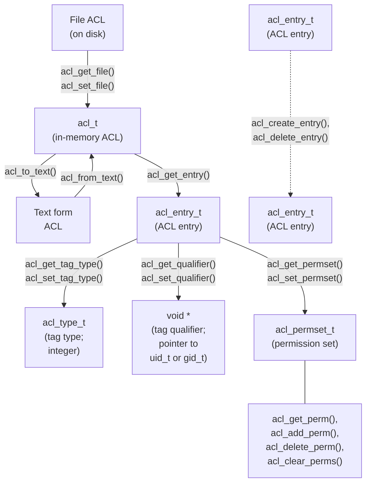

## Chapter 17
# <span id="page-8-0"></span>**ACCESS CONTROL LISTS**

Section 15.4 described the traditional UNIX (and Linux) file permissions scheme. For many applications, this scheme is sufficient. However, some applications need finer control over the permissions granted to specific users and groups. To meet this requirement, many UNIX systems implement an extension to the traditional UNIX file permissions model known as access control lists (ACLs). ACLs allow file permissions to be specified per user or per group, for an arbitrary number of users and groups. Linux provides ACLs from kernel 2.6 onward.

> Support for ACLs is optional for each file system, and is controlled by kernel configuration options under the File systems menu. Reiserfs support for ACLs has been available since kernel 2.6.7.

> In order to be able to create ACLs on an ext2, ext3, ext4, or Reiserfs file system, the file system must be mounted with the mount –o acl option.

ACLs have never been formally standardized for UNIX systems. An attempt was made to do this in the form of the POSIX.1e and POSIX.2c draft standards, which aimed to specify, respectively, the application program interface (API) and the shell commands for ACLs (as well as other features, such as capabilities). Ultimately, this standardization attempt foundered, and these draft standards were withdrawn. Nevertheless, many UNIX implementations (including Linux) base their ACL implementations on these draft standards (usually on the final version, Draft 17). However, because there are many variations across ACL implementations (in part springing from the incompleteness of the draft standards), writing portable programs that use ACLs presents some difficulties.

This chapter provides a description of ACLs and a brief tutorial on their use. It also describes some of the library functions used for manipulating and retrieving ACLs. We won't go into detail on all of these functions because there are so many of them. (For the details, see the manual pages.)

# **17.1 Overview**

An ACL is a series of ACL entries, each of which defines the file permissions for an individual user or group of users (see Figure 17-1).

```text
┌──────────────┬───────────────┬─────────────┐
│   Tag type   │ Tag qualifier │ Permissions │
├──────────────┼───────────────┼─────────────┤
│ ACL_USER_OBJ │       -       │     rwx     │ ◄── Corresponds to traditional owner
│ ACL_USER     │     1007      │     r--     │     (user) permissions
│ ACL_USER     │     1010      │     rwx     │
├──────────────┼───────────────┼─────────────┤
│ACL_GROUP_OBJ │       -       │     rwx     │ ◄── Corresponds to traditional group
│ ACL_GROUP    │      102      │     r--     │     permissions
│ ACL_GROUP    │      103      │     -w-     │
│ ACL_GROUP    │      109      │     --x     │
├──────────────┼───────────────┼─────────────┤
│   ACL_MASK   │       -       │     rw-     │
├──────────────┼───────────────┼─────────────┤
│  ACL_OTHER   │       -       │     r--     │ ◄── Corresponds to traditional other
└──────────────┴───────────────┴─────────────┘     permissions

 ↑ Group class entries: ACL_USER, ACL_GROUP_OBJ, ACL_GROUP
```

**Figure 17-1:** An access control list

### **ACL entries**

Each ACL entry consists of the following parts:

-  a tag type, which indicates whether this entry applies to a user, to a group, or to some other category of user;
-  an optional tag qualifier, which identifies a specific user or group (i.e., a user ID or a group ID); and
-  a permission set, which specifies the permissions (read, write, and execute) that are granted by the entry.

The tag type has one of the following values:

#### ACL\_USER\_OBJ

This entry specifies the permissions granted to the file owner. Each ACL contains exactly one ACL\_USER\_OBJ entry. This entry corresponds to the traditional file owner (user) permissions.

#### ACL\_USER

This entry specifies the permissions granted to the user identified by the tag qualifier. An ACL may contain zero or more ACL\_USER entries, but at most one ACL\_USER entry may be defined for a particular user.

#### ACL\_GROUP\_OBJ

This entry specifies permissions granted to the file group. Each ACL contains exactly one ACL\_GROUP\_OBJ entry. This entry corresponds to the traditional file group permissions, unless the ACL also contains an ACL\_MASK entry.

### ACL\_GROUP

This entry specifies the permissions granted to the group identified by the tag qualifier. An ACL may contain zero or more ACL\_GROUP entries, but at most one ACL\_GROUP entry may be defined for a particular group.

#### ACL\_MASK

This entry specifies the maximum permissions that may be granted by ACL\_USER, ACL\_GROUP\_OBJ, and ACL\_GROUP entries. An ACL contains at most one ACL\_MASK entry. If the ACL contains ACL\_USER or ACL\_GROUP entries, then an ACL\_MASK entry is mandatory. We say more about this tag type shortly.

### ACL\_OTHER

This entry specifies the permissions that are granted to users that don't match any other ACL entry. Each ACL contains exactly one ACL\_OTHER entry. This entry corresponds to the traditional file other permissions.

The tag qualifier is employed only for ACL\_USER and ACL\_GROUP entries. It specifies either a user ID or a group ID.

# **Minimal and extended ACLs**

A minimal ACL is one that is semantically equivalent to the traditional file permission set. It contains exactly three entries: one of each of the types ACL\_USER\_OBJ, ACL\_GROUP\_OBJ, and ACL\_OTHER. An extended ACL is one that additionally contains ACL\_USER, ACL\_GROUP, and ACL\_MASK entries.

One reason for drawing a distinction between minimal ACLs and extended ACLs is that the latter provide a semantic extension to the traditional permissions model. Another reason concerns the Linux implementation of ACLs. ACLs are implemented as system extended attributes (Chapter [16\)](#page-0-0). The extended attribute used for maintaining a file access ACL is named system.posix\_acl\_access. This extended attribute is required only if the file has an extended ACL. The permissions information for a minimal ACL can be (and is) stored in the traditional file permission bits.

# **17.2 ACL Permission-Checking Algorithm**

Permission checking on a file that has an ACL is performed in the same circumstances as for the traditional file permissions model (Section 15.4.3). Checks are performed in the following order, until one of the criteria is matched:

1. If the process is privileged, all access is granted. There is one exception to this statement, analogous to the traditional permissions model described in Section 15.4.3. When executing a file, a privileged process is granted execute permission only if that permission is granted via at least one of the ACL entries on the file.

- 2. If the effective user ID of the process matches the owner (user ID) of the file, then the process is granted the permissions specified in the ACL\_USER\_OBJ entry. (To be strictly accurate, on Linux, it is the process's file-system IDs, rather than its effective IDs, that are used for the checks described in this section, as described in Section 9.5.)
- 3. If the effective user ID of the process matches the tag qualifier in one of the ACL\_USER entries, then the process is granted the permissions specified in that entry, masked (ANDed) against the value of the ACL\_MASK entry.
- 4. If one of the process's group IDs (i.e., the effective group ID or any of the supplementary group IDs) matches the file group (this corresponds to the ACL\_GROUP\_OBJ entry) or the tag qualifier of any of the ACL\_GROUP entries, then access is determined by checking each of the following, until a match is found:
  - a) If one of the process's group IDs matches the file group, and the ACL\_GROUP\_OBJ entry grants the requested permissions, then this entry determines the access granted to the file. The granted access is restricted by masking (ANDing) against the value in the ACL\_MASK entry, if present.
  - b) If one of the process's group IDs matches the tag qualifier in an ACL\_GROUP entry for the file, and that entry grants the requested permissions, then this entry determines the permissions granted. The granted access is restricted by masking (ANDing) against the value in the ACL\_MASK entry.
  - c) Otherwise, access is denied.
- 5. Otherwise, the process is granted the permissions specified in the ACL\_OTHER entry.

We can clarify the rules relating to group IDs with some examples. Suppose we have a file whose group ID is 100, and that file is protected by the ACL shown in Figure 17-1. If a process whose group ID is 100 makes the call access(file, R\_OK), then that call would succeed (i.e., return 0). (We describe access() in Section 15.4.4.) On the other hand, even though the ACL\_GROUP\_OBJ entry grants all permissions, the call access(file, R\_OK | W\_OK | X\_OK) would fail (i.e., return –1, with errno set to EACCES) because the ACL\_GROUP\_OBJ permissions are masked (ANDed) against the ACL\_MASK entry, and this entry denies execute permission.

As another example using Figure 17-1, suppose we have a process that has a group ID of 102 and that also contains the group ID 103 in its supplementary group IDs. For this process, the calls access(file, R\_OK) and access(file, W\_OK) would both succeed, since they would match the ACL\_GROUP entries for the group IDs 102 and 103, respectively. On the other hand, the call access(file, R\_OK | W\_OK) would fail because there is no matching ACL\_GROUP entry that grants both read and write permissions.

# **17.3 Long and Short Text Forms for ACLs**

When manipulating ACLs using the setfacl and getfacl commands (described in a moment) or certain ACL library functions, we specify textual representations of the ACL entries. Two formats are permitted for these textual representations:

-  Long text form ACLs contain one ACL entry per line, and may include comments, which are started by a # character and continue to the end-of-line. The getfacl command displays ACLs in long text form. The setfacl –M acl-file option, which takes an ACL specification from a file, expects the specification to be in long text form.
-  Short text form ACLs consist of a sequence of ACL entries separated by commas.

In both forms, each ACL entry consists of three parts separated by colons:

```
tag-type:[tag-qualifier]: permissions
```

The tag-type is one of the values shown in the first column of [Table 17-1.](#page-12-0) The tag-type may optionally be followed by a tag-qualifier, which identifies a user or group, either by name or numeric identifier. The tag-qualifier is present only for ACL\_USER and ACL\_GROUP entries.

The following are all short text form ACLs corresponding to a traditional permissions mask of 0650:

```
u::rw-,g::r-x,o::---
u::rw,g::rx,o::-
user::rw,group::rx,other::-
```

The following short text form ACL includes two named users, a named group, and a mask entry:

```
u::rw,u:paulh:rw,u:annabel:rw,g::r,g:teach:rw,m::rwx,o::-
```

<span id="page-12-0"></span>**Table 17-1:** Interpretation of ACL entry text forms

| Tag text<br>forms | Tag qualifier<br>present? | Corresponding<br>tag type | Entry for            |
|-------------------|---------------------------|---------------------------|----------------------|
| u, user           | N                         | ACL_USER_OBJ              | File owner (user)    |
| u, user           | Y                         | ACL_USER                  | Specified user       |
| g, group          | N                         | ACL_GROUP_OBJ             | File group           |
| g, group          | Y                         | ACL_GROUP                 | Specified group      |
| m, mask           | N                         | ACL_MASK                  | Mask for group class |
| o, other          | N                         | ACL_OTHER                 | Other users          |

# **17.4 The ACL\_MASK Entry and the ACL Group Class**

If an ACL contains ACL\_USER or ACL\_GROUP entries, then it must contain an ACL\_MASK entry. If the ACL doesn't contain any ACL\_USER or ACL\_GROUP entries, then the ACL\_MASK entry is optional.

The ACL\_MASK entry acts as an upper limit on the permissions granted by ACL entries in the so-called group class. The group class is the set of all ACL\_USER, ACL\_GROUP, and ACL\_GROUP\_OBJ entries in the ACL.

The purpose of the ACL\_MASK entry is to provide consistent behavior when running ACL-unaware applications. As an example of why the mask entry is needed, suppose that the ACL on a file includes the following entries:

```
user::rwx # ACL_USER_OBJ
user:paulh:r-x # ACL_USER
group::r-x # ACL_GROUP_OBJ
group:teach:--x # ACL_GROUP
other::--x # ACL_OTHER
```

Now suppose that a program executes the following chmod() call on this file:

```
chmod(pathname, 0700); /* Set permissions to rwx------ */
```

In an ACL-unaware application, this means "Deny access to everyone except the file owner." These semantics should hold even in the presence of ACLs. In the absence of an ACL\_MASK entry, this behavior could be implemented in various ways, but there are problems with each approach:

-  Simply modifying the ACL\_GROUP\_OBJ and ACL\_USER\_OBJ entries to have the mask --- would be insufficient, since the user paulh and the group teach would still have some permissions on the file.
-  Another possibility would be to apply the new group and other permission settings (i.e., all permissions disabled) to all of the ACL\_USER, ACL\_GROUP, ACL\_GROUP\_OBJ, and ACL\_OTHER entries in the ACL:

```
user::rwx # ACL_USER_OBJ
user:paulh:--- # ACL_USER
group::--- # ACL_GROUP_OBJ
group:teach:--- # ACL_GROUP
other::--- # ACL_OTHER
```

The problem with this approach is that the ACL-unaware application would thereby inadvertently destroy the file permission semantics established by ACL-aware applications, since the following call (for example) would not restore the ACL\_USER and ACL\_GROUP entries of the ACL to their former states:

```
chmod(pathname, 751);
```

 To avoid these problems, we might consider making the ACL\_GROUP\_OBJ entry the limiting set for all ACL\_USER and ACL\_GROUP entries. However, this would mean that the ACL\_GROUP\_OBJ permissions would always need to be set to the union of all permissions allowed in all ACL\_USER and ACL\_GROUP entries. This would conflict with the use of the ACL\_GROUP\_OBJ entry for determining the permissions accorded to the file group.

The ACL\_MASK entry was devised to solve these problems. It provides a mechanism that allows the traditional meanings of chmod() operations to be implemented, without destroying the file permission semantics established by ACL-aware applications. When an ACL has an ACL\_MASK entry:

-  all changes to traditional group permissions via chmod() change the setting of the ACL\_MASK entry (rather than the ACL\_GROUP\_OBJ entry); and
-  a call to stat() returns the ACL\_MASK permissions (instead of the ACL\_GROUP\_OBJ permissions) in the group permission bits of the st\_mode field (Figure 15-1, on page 281).

While the ACL\_MASK entry provides a way of preserving ACL information in the face of ACL-unaware applications, the reverse is not guaranteed. The presence of ACLs overrides the effect of traditional operations on file group permissions. For example, suppose that we have placed the following ACL on a file:

```
user::rw-,group::---,mask::---,other::r--
```

If we then execute the command chmod g+rw on this file, the ACL becomes:

```
user::rw-,group::---,mask::rw-,other::r--
```

In this case, group still has no access to the file. One workaround for this is to modify the ACL entry for group to grant all permissions. Consequently, group will then always obtain whatever permissions are granted to the ACL\_MASK entry.

# **17.5 The getfacl and setfacl Commands**

From the shell, we can use the getfacl command to view the ACL on a file.

```
$ umask 022 Set shell umask to known state
$ touch tfile Create a new file
$ getfacl tfile
# file: tfile
# owner: mtk
# group: users
user::rw-
group::r--
other::r--
```

From the output of the getfacl command, we see that the new file is created with a minimal ACL. When displaying the text form of this ACL, getfacl precedes the ACL entries with three lines showing the name and ownership of the file. We can prevent these lines from being displayed by specifying the ––omit–header option.

Next, we demonstrate that changes to a file's permissions using the traditional chmod command are carried through to the ACL.

```
$ chmod u=rwx,g=rx,o=x tfile
$ getfacl --omit-header tfile
user::rwx
group::r-x
other::--x
```

The setfacl command modifies a file ACL. Here, we use the setfacl –m command to add an ACL\_USER and an ACL\_GROUP entry to the ACL:

```
$ setfacl -m u:paulh:rx,g:teach:x tfile
$ getfacl --omit-header tfile
user::rwx
user:paulh:r-x ACL_USER entry
group::r-x
group:teach:--x ACL_GROUP entry
mask::r-x ACL_MASK entry
other::--x
```

The setfacl –m option modifies existing ACL entries, or adds new entries if corresponding entries with the given tag type and qualifier do not already exist. We can additionally use the –R option to recursively apply the specified ACL to all of the files in a directory tree.

From the output of the getfacl command, we can see that setfacl automatically created an ACL\_MASK entry for this ACL.

The addition of the ACL\_USER and ACL\_GROUP entries converts this ACL into an extended ACL, and ls –l indicates this fact by appending a plus sign (+) after the traditional file permissions mask:

```
$ ls -l tfile
-rwxr-x--x+ 1 mtk users 0 Dec 3 15:42 tfile
```

We continue by using setfacl to disable all permissions except execute on the ACL\_MASK entry, and then view the ACL once more with getfacl:

```
$ setfacl -m m::x tfile
$ getfacl --omit-header tfile
user::rwx
user:paulh:r-x #effective:--x
group::r-x #effective:--x
group:teach:--x
mask::--x
other::--x
```

The #effective: comments that getfacl prints after the entries for the user paulh and the file group (group::) inform us that after masking (ANDing) against the ACL\_MASK entry, the permissions granted by each of these entries will actually be less than those specified in the entry.

We then use ls –l to once more view the traditional permission bits of the file. We see that the displayed group class permission bits reflect the permissions in the ACL\_MASK entry (--x), rather than those in the ACL\_GROUP entry (r-x):

```
$ ls -l tfile
-rwx--x--x+ 1 mtk users 0 Dec 3 15:42 tfile
```

The setfacl –x command can be used to remove entries from an ACL. Here, we remove the entries for the user paulh and the group teach (no permissions are specified when removing entries):

```
$ setfacl -x u:paulh,g:teach tfile
$ getfacl --omit-header tfile
user::rwx
group::r-x
mask::r-x
other::--x
```

Note that during the above operation, setfacl automatically adjusted the mask entry to be the union of all of the group class entries. (There was just one such entry: ACL\_GROUP\_OBJ.) If we want to prevent such adjustment, then we must specify the –n option to setfacl.

Finally, we note that the setfacl –b option can be used to remove all extended entries from an ACL, leaving just the minimal (i.e., user, group, and other) entries.

# **17.6 Default ACLs and File Creation**

In the discussion of ACLs so far, we have been describing access ACLs. As its name implies, an access ACL is used in determining the permissions that a process has when accessing the file associated with the ACL. We can create a second type of ACL on directories: a default ACL.

A default ACL plays no part in determining the permissions granted when accessing the directory. Instead, its presence or absence determines the ACL(s) and permissions that are placed on files and subdirectories that are created in the directory. (A default ACL is stored as an extended attribute named system.posix\_acl\_default.)

To view and set the default ACL of a directory, we use the –d option of the getfacl and setfacl commands.

```
$ mkdir sub
$ setfacl -d -m u::rwx,u:paulh:rx,g::rx,g:teach:rwx,o::- sub
$ getfacl -d --omit-header sub
user::rwx
user:paulh:r-x
group::r-x
group:teach:rwx
mask::rwx setfacl generated ACL_MASK entry automatically
other::---
```

We can remove a default ACL from a directory using the setfacl –k option.

If a directory has a default ACL, then:

-  A new subdirectory created in this directory inherits the directory's default ACL as its default ACL. In other words, default ACLs propagate down through a directory tree as new subdirectories are created.
-  A new file or subdirectory created in this directory inherits the directory's default ACL as its access ACL. The ACL entries that correspond to the traditional file permission bits are masked (ANDed) against the corresponding bits of the mode argument in the system call (open(), mkdir(), and so on) used to create the file or subdirectory. By "corresponding ACL entries," we mean:
  - ACL\_USER\_OBJ;
  - ACL\_MASK or, if ACL\_MASK is absent, then ACL\_GROUP\_OBJ; and
  - ACL\_OTHER.

When a directory has a default ACL, the process umask (Section 15.4.6) doesn't play a part in determining the permissions in the entries of the access ACL of a new file created in that directory.

As an example of how a new file inherits its access ACL from the parent directory's default ACL, suppose we used the following open() call to create a new file in the directory created above:

```
open("sub/tfile", O_RDWR | O_CREAT,
 S_IRWXU | S_IXGRP | S_IXOTH); /* rwx--x--x */
```

The new file would have the following access ACL:

```
$ getfacl --omit-header sub/tfile
user::rwx
user:paulh:r-x #effective:--x
group::r-x #effective:--x
group:teach:rwx #effective:--x
mask::--x
other::---
```

If a directory doesn't have a default ACL, then:

-  New subdirectories created in this directory also do not have a default ACL.
-  The permissions of the new file or directory are set following the traditional rules (Section 15.4.6): the file permissions are set to the value in the mode argument (given to open(), mkdir(), and so on), less the bits that are turned off by the process umask. This results in a minimal ACL on the new file.

# **17.7 ACL Implementation Limits**

The various file-system implementations impose limits on the number of entries in an ACL:

 On ext2, ext3, and ext4, the total number of ACLs on a file is governed by the requirement that the bytes in all of the names and values of a file's extended attributes must be contained in a single logical disk block (Section [16.2](#page-2-0)). Each ACL entry requires 8 bytes, so that the maximum number of ACL entries for a file is somewhat less (because of some overhead for the name of the extended attribute for the ACL) than one-eighth of the block size. Thus, a 4096-byte block size allows for a maximum of around 500 ACL entries. (Kernels before 2.6.11 imposed an arbitrary limitation of 32 entries for ACLs on ext2 and ext3.)

-  On XFS, an ACL is limited to 25 entries.
-  On Reiserfs and JFS, ACLs can contain up to 8191 entries. This limit is a consequence of the size limitation (64 kB) imposed by the VFS on the value of an extended attribute (Section [16.2](#page-2-0)).

At the time of writing, Btrfs limits ACLs to around 500 entries. However, since Btrfs was still under heavy development, this limit may change.

Although most of the above file systems allow large numbers of entries to be created in an ACL, this should be avoided for the following reasons:

-  The maintenance of lengthy ACLs becomes a complex and potentially errorprone system administration task.
-  The amount of time required to scan the ACL for the matching entry (or matching entries in the case of group ID checks) increases linearly with the number of ACL entries.

Generally, we can keep the number of ACL entries on a file down to a reasonable number by defining suitable groups in the system group file (Section 8.3) and using those groups within the ACL.

# **17.8 The ACL API**

The POSIX.1e draft standard defined a large suite of functions and data structures for manipulating ACLs. Since they are so numerous, we won't attempt to describe the details of all of these functions. Instead, we provide an overview of their usage and conclude with an example program.

Programs that use the ACL API should include <sys/acl.h>. It may also be necessary to include <acl/libacl.h> if the program makes use of various Linux extensions to the POSIX.1e draft standard. (A list of the Linux extensions is provided in the acl(5) manual page.) Programs using this API must be compiled with the –lacl option, in order to link against the libacl library.

> As already noted, on Linux, ACLs are implemented using extended attributes, and the ACL API is implemented as a set of library functions that manipulate user-space data structures, and, where necessary, make calls to getxattr() and setxattr() to retrieve and modify the on-disk system extended attribute that holds the ACL representation. It is also possible (though not recommended) for an application to use getxattr() and setxattr() to manipulate ACLs directly.

#### **Overview**

The functions that constitute the ACL API are listed in the *acl*(5) manual page. At first sight, this plethora of functions and data structures can seem bewildering. Figure 17-2 provides an overview of the relationship between the various data structures and indicates the use of many of the ACL functions.



<span id="page-19-0"></span>Figure 17-2: Relationship between ACL library functions and data structures

From Figure 17-2, we can see that the ACL API considers an ACL as a hierarchical object:

- An ACL consists of one or more ACL entries.
- Each ACL entry consists of a tag type, an optional tag qualifier, and a permission set.

We now look briefly at the various ACL functions. In most cases, we don't describe the error returns from each function. Functions that return an integer (status) typically return 0 on success and –1 on error. Functions that return a handle (pointer) return NULL on error. Errors can be diagnosed using errno in the usual manner.

> A handle is an abstract term for some technique used to refer to an object or data structure. The representation of a handle is private to the API implementation. It may be, for example, a pointer, an array index, or a hash key.

### **Fetching a file's ACL into memory**

The acl\_get\_file() function retrieves a copy of the ACL of the file identified by pathname.

```
acl_t acl;
acl = acl_get_file(pathname, type);
```

This function retrieves either the access ACL or the default ACL, depending on whether type is specified as ACL\_TYPE\_ACCESS or ACL\_TYPE\_DEFAULT. As its function result, acl\_get\_file() returns a handle (of type acl\_t) for use with other ACL functions.

# **Retrieving entries from an in-memory ACL**

The acl\_get\_entry() function returns a handle (of type acl\_entry\_t) referring to one of the ACL entries within the in-memory ACL referred to by its acl argument. This handle is returned in the location pointed to by the final function argument.

```
acl_entry_t entry;
status = acl_get_entry(acl, entry_id, &entry);
```

The entry\_id argument determines which entry's handle is returned. If entry\_id is specified as ACL\_FIRST\_ENTRY, then a handle for the first entry in the ACL is returned. If entry\_id is specified as ACL\_NEXT\_ENTRY, then a handle is returned for the entry following the last ACL entry that was retrieved. Thus, we can loop through all of the entries in an ACL by specifying type as ACL\_FIRST\_ENTRY in the first call to acl\_get\_entry() and specifying type as ACL\_NEXT\_ENTRY in subsequent calls.

The acl\_get\_entry() function returns 1 if it successfully fetches an ACL entry, 0 if there are no more entries, or –1 on error.

### **Retrieving and modifying attributes in an ACL entry**

The acl\_get\_tag\_type() and acl\_set\_tag\_type() functions retrieve and modify the tag type in the ACL entry referred to by their entry argument.

```
acl_tag_t tag_type;
status = acl_get_tag_type(entry, &tag_type);
status = acl_set_tag_type(entry, tag_type);
```

The tag\_type argument has the type acl\_type\_t (an integer type), and has one of the values ACL\_USER\_OBJ, ACL\_USER, ACL\_GROUP\_OBJ, ACL\_GROUP, ACL\_OTHER, or ACL\_MASK.

The acl\_get\_qualifier() and acl\_set\_qualifier() functions retrieve and modify the tag qualifier in the ACL entry referred to by their entry argument. Here is an example, in which we assume that we have already determined that this is an ACL\_USER entry by inspecting the tag type:

```
uid_t *qualp; /* Pointer to UID */
qualp = acl_get_qualifier(entry);
status = acl_set_qualifier(entry, qualp);
```

The tag qualifier is valid only if the tag type of this entry is ACL\_USER or ACL\_GROUP. In the former case, qualp is a pointer to a user ID (uid\_t \*); in the latter case, it is a pointer to a group ID (gid\_t \*).

The acl\_get\_permset() and acl\_set\_permset() functions retrieve and modify the permission set in the ACL entry referred to by their entry argument.

```
acl_permset_t permset;
status = acl_get_permset(entry, &permset);
status = acl_set_permset(entry, permset);
```

The acl\_permset\_t data type is a handle referring to a permission set.

The following functions are used to manipulate the contents of a permission set:

```
int is_set;
is_set = acl_get_perm(permset, perm);
status = acl_add_perm(permset, perm);
status = acl_delete_perm(permset, perm);
status = acl_clear_perms(permset);
```

In each of these calls, perm is specified as ACL\_READ, ACL\_WRITE, or ACL\_EXECUTE, with the obvious meanings. These functions are used as follows:

-  The acl\_get\_perm() function returns 1 (true) if the permission specified in perm is enabled in the permission set referred to by permset, or 0 if it is not. This function is a Linux extension to the POSIX.1e draft standard.
-  The acl\_add\_perm() function adds the permission specified in perm to the permission set referred to by permset.
-  The acl\_delete\_perm() function removes the permission specified in perm from the permission set referred to by permset. (It is not an error to remove a permission if it is not present in the set.)
-  The acl\_clear\_perms() function removes all permissions from the permission set referred to by permset.

# **Creating and deleting ACL entries**

The acl\_create\_entry() function creates a new entry in an existing ACL. A handle referring to the new entry is returned in the location pointed to by the second function argument.

```
acl_entry_t entry;
status = acl_create_entry(&acl, &entry);
```

The new entry can then be populated using the functions described previously. The acl\_delete\_entry() function removes an entry from an ACL.

```
status = acl_delete_entry(acl, entry);
```

### **Updating a file's ACL**

The acl\_set\_file() function is the converse of acl\_get\_file(). It updates the on-disk ACL with the contents of the in-memory ACL referred to by its acl argument.

```
int status;
status = acl_set_file(pathname, type, acl);
```

The type argument is either ACL\_TYPE\_ACCESS, to update the access ACL, or ACL\_TYPE\_DEFAULT, to update a directory's default ACL.

# **Converting an ACL between in-memory and text form**

The acl\_from\_text() function translates a string containing a long or short text form ACL into an in-memory ACL, and returns a handle that can be used to refer to the ACL in subsequent function calls.

```
acl = acl_from_text(acl_string);
```

The acl\_to\_text() function performs the reverse conversion, returning a long text form string corresponding to the ACL referred to by its acl argument.

```
char *str;
ssize_t len;
str = acl_to_text(acl, &len);
```

If the len argument is not specified as NULL, then the buffer it points to is used to return the length of the string returned as the function result.

### **Other functions in the ACL API**

The following paragraphs describe several other commonly used ACL functions that are not shown in [Figure 17-2](#page-19-0).

The acl\_calc\_mask(&acl) function calculates and sets the permissions in the ACL\_MASK entry of the in-memory ACL whose handle is pointed to by its argument. Typically, we use this function whenever we create or modify an ACL. The ACL\_MASK permissions are calculated as the union of the permissions in all ACL\_USER, ACL\_GROUP, and ACL\_GROUP\_OBJ entries. A useful property of this function is that it creates the ACL\_MASK entry if it doesn't already exist. This means that if we add ACL\_USER and ACL\_GROUP entries to a previously minimal ACL, then we can use this function to ensure the creation of the ACL\_MASK entry.

The acl\_valid(acl) function returns 0 if the ACL referred to by its argument is valid, or –1 otherwise. An ACL is valid if all of the following are true:

-  the ACL\_USER\_OBJ, ACL\_GROUP\_OBJ, and ACL\_OTHER entries appear exactly once;
-  there is an ACL\_MASK entry if any ACL\_USER or ACL\_GROUP entries are present;
-  there is at most one ACL\_MASK entry;
-  each ACL\_USER entry has a unique user ID; and
-  each ACL\_GROUP entry has a unique group ID.

The acl\_check() and acl\_error() functions (the latter is a Linux extension) are alternatives to acl\_valid() that are less portable, but provide a more precise description of the error in a malformed ACL. See the manual pages for details.

The acl\_delete\_def\_file(pathname) function removes the default ACL on the directory referred to by pathname.

The acl\_init(count) function creates a new, empty ACL structure that initially contains space for at least count ACL entries. (The count argument is a hint to the system about intended usage, not a hard limit.) A handle for the new ACL is returned as the function result.

The acl\_dup(acl) function creates a duplicate of the ACL referred to by acl and returns a handle for the duplicate ACL as its function result.

The acl\_free(handle) function frees memory allocated by other ACL functions. For example, we must use acl\_free() to free memory allocated by calls to acl\_from\_text(), acl\_to\_text(), acl\_get\_file(), acl\_init(), and acl\_dup().

# **Example program**

[Listing 17-1](#page-24-0) demonstrates the use of some of the ACL library functions. This program retrieves and displays the ACL on a file (i.e., it provides a subset of the functionality of the getfacl command). If the –d command-line option is specified, then the program displays the default ACL (of a directory) instead of the access ACL.

Here is an example of the use of this program:

```
$ touch tfile
$ setfacl -m 'u:annie:r,u:paulh:rw,g:teach:r' tfile
$ ./acl_view tfile
user_obj rw-
user annie r--
user paulh rw-
group_obj r--
group teach r--
mask rw-
other r--
```

The source code distribution of this book also includes a program, acl/ acl\_update.c, that performs updates on an ACL (i.e., it provides a subset of the functionality of the setfacl command).

<span id="page-24-0"></span>**Listing 17-1:** Display the access or default ACL on a file

```
––––––––––––––––––––––––––––––––––––––––––––––––––––––––––– acl/acl_view.c
#include <acl/libacl.h>
#include <sys/acl.h>
#include "ugid_functions.h"
#include "tlpi_hdr.h"
static void
usageError(char *progName)
{
 fprintf(stderr, "Usage: %s [-d] filename\n", progName);
 exit(EXIT_FAILURE);
}
int
main(int argc, char *argv[])
{
 acl_t acl;
 acl_type_t type;
 acl_entry_t entry;
 acl_tag_t tag;
 uid_t *uidp;
 gid_t *gidp;
 acl_permset_t permset;
 char *name;
 int entryId, permVal, opt;
 type = ACL_TYPE_ACCESS;
 while ((opt = getopt(argc, argv, "d")) != -1) {
 switch (opt) {
 case 'd': type = ACL_TYPE_DEFAULT; break;
 case '?': usageError(argv[0]);
 }
 }
 if (optind + 1 != argc)
 usageError(argv[0]);
 acl = acl_get_file(argv[optind], type);
 if (acl == NULL)
 errExit("acl_get_file");
 /* Walk through each entry in this ACL */
 for (entryId = ACL_FIRST_ENTRY; ; entryId = ACL_NEXT_ENTRY) {
 if (acl_get_entry(acl, entryId, &entry) != 1)
 break; /* Exit on error or no more entries */
```

```
 /* Retrieve and display tag type */
 if (acl_get_tag_type(entry, &tag) == -1)
 errExit("acl_get_tag_type");
 printf("%-12s", (tag == ACL_USER_OBJ) ? "user_obj" :
 (tag == ACL_USER) ? "user" :
 (tag == ACL_GROUP_OBJ) ? "group_obj" :
 (tag == ACL_GROUP) ? "group" :
 (tag == ACL_MASK) ? "mask" :
 (tag == ACL_OTHER) ? "other" : "???");
 /* Retrieve and display optional tag qualifier */
 if (tag == ACL_USER) {
 uidp = acl_get_qualifier(entry);
 if (uidp == NULL)
 errExit("acl_get_qualifier");
 name = groupNameFromId(*uidp);
 if (name == NULL)
 printf("%-8d ", *uidp);
 else
 printf("%-8s ", name);
 if (acl_free(uidp) == -1)
 errExit("acl_free");
 } else if (tag == ACL_GROUP) {
 gidp = acl_get_qualifier(entry);
 if (gidp == NULL)
 errExit("acl_get_qualifier");
 name = groupNameFromId(*gidp);
 if (name == NULL)
 printf("%-8d ", *gidp);
 else
 printf("%-8s ", name);
 if (acl_free(gidp) == -1)
 errExit("acl_free");
 } else {
 printf(" ");
 }
 /* Retrieve and display permissions */
 if (acl_get_permset(entry, &permset) == -1)
 errExit("acl_get_permset");
 permVal = acl_get_perm(permset, ACL_READ);
 if (permVal == -1)
 errExit("acl_get_perm - ACL_READ");
```

```
 printf("%c", (permVal == 1) ? 'r' : '-');
 permVal = acl_get_perm(permset, ACL_WRITE);
 if (permVal == -1)
 errExit("acl_get_perm - ACL_WRITE");
 printf("%c", (permVal == 1) ? 'w' : '-');
 permVal = acl_get_perm(permset, ACL_EXECUTE);
 if (permVal == -1)
 errExit("acl_get_perm - ACL_EXECUTE");
 printf("%c", (permVal == 1) ? 'x' : '-');
 printf("\n");
 }
 if (acl_free(acl) == -1)
 errExit("acl_free");
 exit(EXIT_SUCCESS);
}
–––––––––––––––––––––––––––––––––––––––––––––––––––––––––––– acl/acl_view.c
```

# **17.9 Summary**

From version 2.6 onward, Linux supports ACLs. ACLs extend the traditional UNIX file permissions model, allowing file permissions to be controlled on a peruser and per-group basis.

### **Further information**

The final versions (Draft 17) of the draft POSIX.1e and POSIX.2c standards are available online at http://wt.tuxomania.net/publications/posix.1e/.

The acl(5) manual page gives an overview of ACLs and some guidance on the portability of the various ACL library functions implemented on Linux.

Details of the Linux implementation of ACLs and extended attributes can be found in [Grünbacher, 2003]. Andreas Grünbacher maintains a web site containing information about ACLs at http://acl.bestbits.at/.

# **17.10 Exercise**

**17-1.** Write a program that displays the permissions from the ACL entry that corresponds to a particular user or group. The program should take two command-line arguments. The first argument is either of the letters u or g, indicating whether the second argument identifies a user or group. (The functions defined in Listing 8-1, on page 159, can be used to allow the second command-line argument to be specified numerically or as a name.) If the ACL entry that corresponds to the given user or group falls into the group class, then the program should additionally display the permissions that would apply after the ACL entry has been modified by the ACL mask entry.

