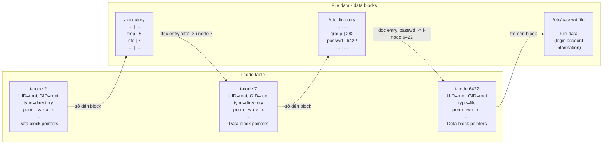
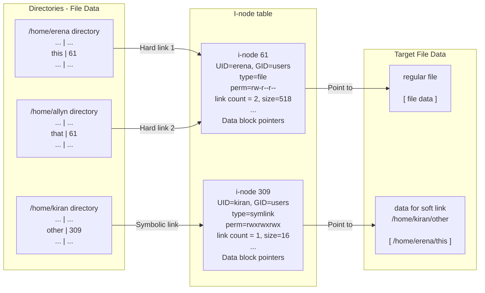

## Chapter 18
# **DIRECTORIES AND LINKS**

In this chapter, we conclude our discussion of file-related topics by looking at directories and links. After an overview of their implementation, we describe the system calls used to create and remove directories and links. We then look at library functions that allow a program to scan the contents of a single directory and to walk through (i.e., examine each file in) a directory tree.

Each process has two directory-related attributes: a root directory, which determines the point from which absolute pathnames are interpreted, and a current working directory, which determines the point from which relative pathnames are interpreted. We look at the system calls that allow a process to change both of these attributes.

We finish the chapter with a discussion of library functions that are used to resolve pathnames and to parse them into directory and filename components.

### **18.1 Directories and (Hard) Links**

A directory is stored in the file system in a similar way to a regular file. Two things distinguish a directory from a regular file:

-  A directory is marked with a different file type in its i-node entry (Section 14.4).
-  A directory is a file with a special organization. Essentially, it is a table consisting of filenames and i-node numbers.

On most native Linux file systems, filenames can be up to 255 characters long. The relationship between directories and i-nodes is illustrated in [Figure 18-1,](#page-1-0) which shows the partial contents of the file system i-node table and relevant directory files that are maintained for an example file (/etc/passwd).

> Although a process can open a directory, it can't use read() to read the contents of a directory. To retrieve the contents of a directory, a process must instead use the system calls and library functions discussed later in this chapter. (On some UNIX implementations, it is possible to perform a read() on a directory, but this is not portable.) Nor can a process directly change a directory's contents with write(); it can only indirectly (i.e., request the kernel to) change the contents using system calls such as open() (to create a new file), link(), mkdir(), symlink(), unlink(), and rmdir(). (All of these system calls are described later in this chapter, except open(), which was described in Section 4.3.)

> The i-node table is numbered starting at 1, rather than 0, because 0 in the i-node field of a directory entry indicates that the entry is unused. I-node 1 is used to record bad blocks in the file system. The root directory (/) of a file system is always stored in i-node entry 2 (as shown in [Figure 18-1\)](#page-1-0), so that the kernel knows where to start when resolving a pathname.



<span id="page-1-0"></span>**Figure 18-1:** Relationship between i-node and directory structures for the file /etc/passwd

If we review the list of information stored in a file i-node (Section 14.4), we see that the i-node doesn't contain a filename; it is only the mapping within a directory list that defines the name of a file. This has a useful consequence: we can create multiple names—in the same or in different directories—each of which refers to the same i-node. These multiple names are known as links, or sometimes as hard links to distinguish them from symbolic links, which we discuss shortly.

> All native Linux and UNIX file systems support hard links. However, many non-UNIX file systems (e.g., Microsoft's VFAT) do not. (Microsoft's NTFS file system does support hard links.)

From the shell, we can create new hard links to an existing file using the ln command, as shown in the following shell session log:

```
$ echo -n 'It is good to collect things,' > abc
$ ls -li abc
 122232 -rw-r--r-- 1 mtk users 29 Jun 15 17:07 abc
$ ln abc xyz
$ echo ' but it is better to go on walks.' >> xyz
$ cat abc
It is good to collect things, but it is better to go on walks.
$ ls -li abc xyz
 122232 -rw-r--r-- 2 mtk users 63 Jun 15 17:07 abc
 122232 -rw-r--r-- 2 mtk users 63 Jun 15 17:07 xyz
```

The i-node numbers displayed (as the first column) by ls –li confirm what was already clear from the output of the cat command: the names abc and xyz refer to the same i-node entry, and hence to the same file. In the third field displayed by ls –li, we can see the link count for the i-node. After the ln abc xyz command, the link count of the i-node referred to by abc has risen to 2, since there are now two names referring to the file. (The same link count is displayed for the file xyz, since it refers to the same i-node.)

If one of these filenames is removed, the other name, and the file itself, continue to exist:

```
$ rm abc
$ ls -li xyz
 122232 -rw-r--r-- 1 mtk users 63 Jun 15 17:07 xyz
```

The i-node entry and data blocks for the file are removed (deallocated) only when the i-node's link count falls to 0—that is, when all of the names for the file have been removed. To summarize: the rm command removes a filename from a directory list, decrements the link count of the corresponding i-node by 1, and, if the link count thereby falls to 0, deallocates the i-node and the data blocks to which it refers.

All of the names (links) for a file are equivalent—none of the names (e.g., the first) has priority over any of the others. As we saw in the above example, after the first name associated with the file was removed, the physical file continued to exist, but it was then accessible only by the other name.

A question often asked in online forums is "How can I find the filename associated with the file descriptor X in my program?" The short answer is that we can'tat least not portably and unambiguously—since a file descriptor refers to an i-node, and multiple filenames (or even, as described in Section [18.3,](#page-5-0) none at all) may refer to this i-node.

> On Linux, we can see which files a process currently has open by using readdir() (Section [18.8](#page-13-0)) to scan the contents of the Linux-specific /proc/PID/fd directory, which contains symbolic links for each of the file descriptors currently opened by the process. The lsof(1) and fuser(1) tools, which have been ported to many UNIX systems, can also be useful in this regard.

Hard links have two limitations, both of which can be circumvented by the use of symbolic links:

-  Because directory entries (hard links) refer to files using just an i-node number, and i-node numbers are unique only within a file system, a hard link must reside on the same file system as the file to which it refers.
-  A hard link can't be made to a directory. This prevents the creation of circular links, which would confuse many system programs.

Early UNIX implementations permitted the superuser to create hard links to directories. This was necessary because these implementations did not provide a mkdir() system call. Instead, a directory was created using mknod(), and then links for the . and .. entries were created ([Vahalia, 1996]). Although this feature is no longer needed, some modern UNIX implementations retain it for backward compatibility.

An effect similar to hard links on directories can be achieved using bind mounts (Section 14.9.4).

# **18.2 Symbolic (Soft) Links**

A symbolic link, also sometimes called a soft link, is a special file type whose data is the name of another file. [Figure 18-2](#page-4-0) illustrates the situation where two hard links, /home/erena/this and /home/allyn/that, refer to the same file, and a symbolic link, /home/ kiran/other, refers to the name /home/erena/this.

From the shell, symbolic links are created using the ln –s command. The ls –F command displays a trailing @ character at the end of symbolic links.

The pathname to which a symbolic link refers may be either absolute or relative. A relative symbolic link is interpreted relative to the location of the link itself.

Symbolic links don't have the same status as hard links. In particular, a symbolic link is not included in the link count of the file to which it refers. (Thus, the link count of i-node 61 in [Figure 18-2](#page-4-0) is 2, not 3.) Therefore, if the filename to which the symbolic link refers is removed, the symbolic link itself continues to exist, even though it can no longer be dereferenced (followed). We say that it has become a dangling link. It is even possible to create a symbolic link to a filename that doesn't exist at the time the link is created.

> Symbolic links were introduced by 4.2BSD. Although they were not included in POSIX.1-1990, they were subsequently incorporated into SUSv1, and thus are in SUSv3.



<span id="page-4-0"></span>**Figure 18-2:** Representation of hard and symbolic links

Since a symbolic link refers to a filename, rather than an i-node number, it can be used to link to a file in a different file system. Symbolic links also do not suffer the other limitation of hard links: we can create symbolic links to directories. Tools such as find and tar can tell the difference between hard and symbolic links, and either don't follow symbolic links by default, or avoid getting trapped in circular references created using symbolic links.

It is possible to chain symbolic links (e.g., a is a symbolic link to b, which is a symbolic link to c). When a symbolic link is specified in various file-related system calls, the kernel dereferences the series of links to arrive at the final file.

SUSv3 requires that an implementation allow at least \_POSIX\_SYMLOOP\_MAX dereferences of each symbolic link component of a pathname. The specified value for \_POSIX\_SYMLOOP\_MAX is 8. However, before kernel 2.6.18, Linux imposed a limit of 5 dereferences when following a chain of symbolic links. Starting with kernel 2.6.18, Linux implements the SUSv3-specified minimum of 8 dereferences. Linux also imposes a total of 40 dereferences for an entire pathname. These limits are required to prevent extremely long symbolic link chains, as well as symbolic link loops, from causing stack overflows in the kernel code that resolves symbolic links.

Some UNIX file systems perform an optimization not mentioned in the main text nor shown in [Figure 18-2.](#page-4-0) When the total length of the string forming the symbolic link's contents is small enough to fit in the part of the i-node that would normally be used for data pointers, the link string is instead stored there. This saves allocating a disk block and also speeds access to the symbolic link information, since it is retrieved along with the file i-node. For example, ext2, ext3, and ext4 employ this technique to fit short symbolic strings into the 60 bytes normally used for data block pointers. In practice, this can be a very effective optimization. Of the 20,700 symbolic links on one system checked by the author, 97% were 60 bytes or smaller.

### **Interpretation of symbolic links by system calls**

Many system calls dereference (follow) symbolic links and thus work on the file to which the link refers. Some system calls don't dereference symbolic links, but instead operate directly on the link file itself. As each system call is covered, we describe its behavior with respect to symbolic links. This behavior is also summarized in Table 18-1.

In a few cases where it is necessary to have similar functionality for both the file to which a symbolic link refers and for the symbolic link itself, alternative system calls are provided: one that dereferences the link and another that does not, with the latter prefixed by the letter l; for example, stat() and lstat().

One point generally applies: symbolic links in the directory part of a pathname (i.e., all of the components preceding the final slash) are always dereferenced. Thus, in the pathname /somedir/somesubdir/file, somedir and somesubdir will always be dereferenced if they are symbolic links, and file may be dereferenced, depending on the system call to which the pathname is passed.

> In Section [18.11](#page-26-0), we describe a set of system calls, added in Linux 2.6.16, that extend the functionality of some of the interfaces shown in Table 18-1. For some of these system calls, the behavior with respect to following symbolic links can be controlled by the flags argument to the call.

### **File permissions and ownership for symbolic links**

The ownership and permissions of a symbolic link are ignored for most operations (symbolic links are always created with all permissions enabled). Instead, the ownership and permissions of the file to which the link refers are used in determining whether an operation is permitted. The ownership of a symbolic link is relevant only when the link itself is being removed or renamed in a directory with the sticky permission bit set (Section 15.4.5).

## <span id="page-5-0"></span>**18.3 Creating and Removing (Hard) Links: link() and unlink()**

The link() and unlink() system calls create and remove hard links.

```
#include <unistd.h>
int link(const char *oldpath, const char *newpath);
                                            Returns 0 on success, or –1 on error
```

**Table 18-1:** Interpretation of symbolic links by various functions

| Function            | Follows links? | Notes                                              |
|---------------------|----------------|----------------------------------------------------|
| access()            | z              |                                                    |
| acct()              | z              |                                                    |
| bind()              | z              | UNIX domain sockets have pathnames                 |
| chdir()             | z              |                                                    |
| chmod()             | z              |                                                    |
| chown()             | z              |                                                    |
| chroot()            | z              |                                                    |
| creat()             | z              |                                                    |
| exec()              | z              |                                                    |
| getxattr()          | z              |                                                    |
| lchown()            |                |                                                    |
| lgetxattr()         |                |                                                    |
| link()              |                | See Section 18.3                                   |
| listxattr()         | z              |                                                    |
| llistxattr()        |                |                                                    |
| lremovexattr()      |                |                                                    |
| lsetxattr()         |                |                                                    |
| lstat()             |                |                                                    |
| lutimes()           |                |                                                    |
| open()              | z              | Unless O_NOFOLLOW or O_EXCL<br>  O_CREAT specified |
| opendir()           | z              |                                                    |
| pathconf()          | z              |                                                    |
| pivot_root()        | z              |                                                    |
| quotactl()          | z              |                                                    |
| readlink()          |                |                                                    |
| removexattr()       | z              |                                                    |
| rename()            |                | Links are not followed in either argument          |
| rmdir()             |                | Fails with ENOTDIR if argument is a symbolic link  |
| setxattr()          | z              |                                                    |
| stat()              | z              |                                                    |
| statfs(), statvfs() | z              |                                                    |
| swapon(), swapoff() | z              |                                                    |
| truncate()          | z              |                                                    |
| unlink()            |                |                                                    |
| uselib()            | z              |                                                    |
| utime(), utimes()   | z              |                                                    |

Given the pathname of an existing file in oldpath, the link() system call creates a new link, using the pathname specified in newpath. If newpath already exists, it is not overwritten; instead, an error (EEXIST) results.

On Linux, the link() system call doesn't dereference symbolic links. If oldpath is a symbolic link, then newpath is created as a new hard link to the same symbolic link file. (In other words, newpath is also a symbolic link to the same file to which oldpath refers.) This behavior doesn't conform to SUSv3, which says that all functions that perform pathname resolution should dereference symbolic links unless otherwise specified (and there is no exception specified for link()). Most other UNIX implementations behave in the manner specified by SUSv3. One notable exception is Solaris, which provides the same behavior as Linux by default, but provides SUSv3-conformant behavior if appropriate compiler options are used. The upshot of this inconsistency across implementations is that portable applications should avoid specifying a symbolic link for the oldpath argument.

> SUSv4 recognizes the inconsistency across existing implementations and specifies that the choice of whether or not link() dereferences symbolic links is implementation-defined. SUSv4 also adds the specification of linkat(), which performs the same task as link(), but has a flags argument that can be used to control whether the call dereferences symbolic links. See Section [18.11](#page-26-0) for further details.

```
#include <unistd.h>
int unlink(const char *pathname);
                                            Returns 0 on success, or –1 on error
```

The unlink() system call removes a link (deletes a filename) and, if that is the last link to the file, also removes the file itself. If the link specified in pathname doesn't exist, then unlink() fails with the error ENOENT.

We can't use unlink() to remove a directory; that task requires rmdir() or remove(), which we look at in Section [18.6](#page-11-0).

> SUSv3 says that if pathname specifies a directory, then unlink() should fail with the error EPERM. However, on Linux, unlink() fails with the error EISDIR in this case. (LSB explicitly permits this deviation from SUSv3.) A portable application should be prepared to handle either value if checking for this case.

The unlink() system call doesn't dereference symbolic links. If pathname is a symbolic link, the link itself is removed, rather than the name to which it points.

### **An open file is deleted only when all file descriptors are closed**

In addition to maintaining a link count for each i-node, the kernel also counts open file descriptions for the file (see Figure 5-2, on page 95). If the last link to a file is removed and any processes hold open descriptors referring to the file, the file won't actually be deleted until all of the descriptors are closed. This is a useful feature, because it permits us to unlink a file without needing to worry about whether some other process has it open. (However, we can't reattach a name to an open file whose link count has fallen to 0.) In addition, we can perform tricks such as creating and opening a temporary file, unlinking it immediately, and then continuing to use it within our program, relying on the fact that the file is destroyed only when we close the file descriptor—either explicitly, or implicitly when the program exits. (This is what the tmpfile() function described in Section 5.12 does.)

The program in [Listing 18-1](#page-8-0) demonstrates that even when the last link to a file is removed, the file is deleted only when all open file descriptors that refer to it are closed.

```
––––––––––––––––––––––––––––––––––––––––––––––––––––– dirs_links/t_unlink.c
#include <sys/stat.h>
#include <fcntl.h>
#include "tlpi_hdr.h"
#define CMD_SIZE 200
#define BUF_SIZE 1024
int
main(int argc, char *argv[])
{
 int fd, j, numBlocks;
 char shellCmd[CMD_SIZE]; /* Command to be passed to system() */
 char buf[BUF_SIZE]; /* Random bytes to write to file */
 if (argc < 2 || strcmp(argv[1], "--help") == 0)
 usageErr("%s temp-file [num-1kB-blocks] \n", argv[0]);
 numBlocks = (argc > 2) ? getInt(argv[2], GN_GT_0, "num-1kB-blocks")
 : 100000;
 fd = open(argv[1], O_WRONLY | O_CREAT | O_EXCL, S_IRUSR | S_IWUSR);
 if (fd == -1)
 errExit("open");
 if (unlink(argv[1]) == -1) /* Remove filename */
 errExit("unlink");
 for (j = 0; j < numBlocks; j++) /* Write lots of junk to file */
 if (write(fd, buf, BUF_SIZE) != BUF_SIZE)
 fatal("partial/failed write");
 snprintf(shellCmd, CMD_SIZE, "df -k `dirname %s`", argv[1]);
 system(shellCmd); /* View space used in file system */
 if (close(fd) == -1) /* File is now destroyed */
 errExit("close");
 printf("********** Closed file descriptor\n");
 system(shellCmd); /* Review space used in file system */
 exit(EXIT_SUCCESS);
}
––––––––––––––––––––––––––––––––––––––––––––––––––––– dirs_links/t_unlink.c
```

The program in Listing 18-1 accepts two command-line arguments. The first argument identifies the name of a file that the program should create. The program opens this file and then immediately unlinks the filename. Although the filename disappears, the file itself continues to exist. The program then writes random blocks of data to the file. The number of these blocks is specified in the optional second command-line argument of the program. At this point, the program employs the df(1) command to display the amount of space used on the file system. The program then closes the file descriptor, at which the point the file is removed, and uses df(1) once more to show that the amount of disk space in use has decreased. The following shell session demonstrates the use of the program in Listing 18-1:

### \$ **./t\_unlink /tmp/tfile 1000000**

```
Filesystem 1K-blocks Used Available Use% Mounted on
/dev/sda10 5245020 3204044 2040976 62% /
********** Closed file descriptor
Filesystem 1K-blocks Used Available Use% Mounted on
/dev/sda10 5245020 2201128 3043892 42% /
```

In [Listing 18-1,](#page-8-0) we use the system() function to execute a shell command. We describe system() in detail in Section 27.6.

# **18.4 Changing the Name of a File: rename()**

The rename() system call can be used both to rename a file and to move it into another directory on the same file system.

```
#include <stdio.h>
int rename(const char *oldpath, const char *newpath);
                                            Returns 0 on success, or –1 on error
```

The oldpath argument is an existing pathname, which is renamed to the pathname given in newpath.

The rename() call just manipulates directory entries; it doesn't move file data. Renaming a file doesn't affect other hard links to the file, nor does it affect any processes that hold open descriptors for the file, since these descriptors refer to open file descriptions, which (after the open() call) have no connection with filenames.

The following rules apply to the use of rename():

-  If newpath already exists, it is overwritten.
-  If newpath and oldpath refer to the same file, then no changes are made (and the call succeeds). This is rather counterintuitive. Following from the previous point, we normally expect that if two filenames x and y exist, then the call rename("x", "y") would remove the name x. This is not the case if x and y are links to the same file.

The rationale for this rule, which comes from the original BSD implementation, was probably to simplify the checks that the kernel must perform in order to guarantee that calls such as rename("x", "x"), rename("x", "./x"), and rename("x", "somedir/../x") don't remove the file.

 The rename() system call doesn't dereference symbolic links in either of its arguments. If oldpath is a symbolic link, then the symbolic link is renamed. If newpath is a symbolic link, then it is treated as a normal pathname to which oldpath is to be renamed (i.e., the existing newpath symbolic link is removed).

 If oldpath refers to a file other than a directory, then newpath can't specify the pathname of a directory (the error is EISDIR). To rename a file to a location inside a directory (i.e., move the file to another directory), newpath must include the new filename. The following call both moves a file into a different directory and changes its name:

```
rename("sub1/x", "sub2/y");
```

-  Specifying the name of a directory in oldpath allows us to rename that directory. In this case, newpath either must not exist or must be the name of an empty directory. If newpath is an existing file or an existing, nonempty directory, then an error results (respectively, ENOTDIR and ENOTEMPTY).
-  If oldpath is a directory, then newpath can't contain a directory prefix that is the same as oldpath. For example, we could not rename /home/mtk to /home/mtk/bin (the error is EINVAL).
-  The files referred to by oldpath and newpath must be on the same file system. This is required because a directory is a list of hard links that refer to i-nodes in the same file system as the directory. As stated earlier, rename() is merely manipulating the contents of directory lists. Attempting to rename a file into a different file system fails with the error EXDEV. (To achieve the desired result, we must instead copy the contents of the file from one file system to another and then delete the old file. This is what the mv command does in this case.)

# **18.5 Working with Symbolic Links: symlink() and readlink()**

We now look at the system calls used to create symbolic links and examine their contents.

The symlink() system call creates a new symbolic link, linkpath, to the pathname specified in filepath. (To remove a symbolic link, we use unlink().)

```
#include <unistd.h>
int symlink(const char *filepath, const char *linkpath);
                                             Returns 0 on success, or –1 on error
```

If the pathname given in linkpath already exists, then the call fails (with errno set to EEXIST). The pathname specified in filepath may be absolute or relative.

The file or directory named in filepath doesn't need to exist at the time of the call. Even if it exists at that time, there is nothing to prevent it from being removed later. In this case, linkpath becomes a dangling link, and attempts to dereference it in other system calls yield an error (usually ENOENT).

If we specify a symbolic link as the pathname argument to open(), it opens the file to which the link refers. Sometimes, we would rather retrieve the content of the link itself—that is, the pathname to which it refers. The readlink() system call performs this task, placing a copy of the symbolic link string in the character array pointed to by buffer.

```
#include <unistd.h>
ssize_t readlink(const char *pathname, char *buffer, size_t bufsiz);
             Returns number of bytes placed in buffer on success, or –1 on error
```

The bufsiz argument is an integer used to tell readlink() the number of bytes available in buffer.

If no errors occur, then readlink() returns the number of bytes actually placed in buffer. If the length of the link exceeds bufsiz, then a truncated string is placed in buffer (and readlink() returns the size of that string—that is, bufsiz).

Because a terminating null byte is not placed at the end of buffer, there is no way to distinguish the case where readlink() returns a truncated string from that where it returns a string that exactly fills buffer. One way of checking if the latter has occurred is to reallocate a larger buffer array and call readlink() again. Alternatively, we can size pathname using the PATH\_MAX constant (described in Section 11.1), which defines the length of the longest pathname that a program should have to accommodate.

We demonstrate the use of readlink() in Listing 18-4.

SUSv3 defined a new limit, SYMLINK\_MAX, that an implementation should define to indicate the maximum number of bytes that can be stored in a symbolic link. This limit is required to be at least 255 bytes. At the time of writing, Linux doesn't define this limit. In the main text, we suggest the use of PATH\_MAX because that limit should be at least as large as SYMLINK\_MAX.

In SUSv2, the return type of readlink() was specified as int, and many current implementations (as well as older glibc versions on Linux) follow that specification. SUSv3 changed the return type to ssize\_t.

# <span id="page-11-0"></span>**18.6 Creating and Removing Directories: mkdir() and rmdir()**

The mkdir() system call creates a new directory.

```
#include <sys/stat.h>
int mkdir(const char *pathname, mode_t mode);
                                            Returns 0 on success, or –1 on error
```

The pathname argument specifies the pathname of the new directory. This pathname may be relative or absolute. If a file with this pathname already exists, then the call fails with the error EEXIST.

The ownership of the new directory is set according to the rules described in Section 15.3.1.

The mode argument specifies the permissions for the new directory. (We describe the meanings of the permission bits for directories in Sections 15.3.1, 15.3.2, and 15.4.5.) This bit-mask value may be specified by ORing (|) together constants from Table 15-4, on page 295, but, as with open(), it may also be specified as an octal number. The value given in mode is ANDed against the process umask (Section 15.4.6). In addition, the set-user-ID bit (S\_ISUID) is always turned off, since it has no meaning for directories.

If the sticky bit (S\_ISVTX) is set in mode, then it will be set on the new directory.

The setting of the set-group-ID bit (S\_ISGID) in mode is ignored. Instead, if the set-group-ID bit is set on the parent directory, then it will also be set on the newly created directory. In Section 15.3.1, we noted that setting the set-group-ID permission bit on a directory causes new files created in the directory to take their group ID from the directory's group ID, rather than the process's effective group ID. The mkdir() system call propagates the set-group-ID permission bit in the manner described here so that all subdirectories under a directory will share the same behavior.

SUSv3 explicitly notes that the manner in which mkdir() treats the set-user-ID, set-group-ID, and sticky bits is implementation-defined. On some UNIX implementations, these 3 bits are always turned off on a new directory.

The newly created directory contains two entries: . (dot), which is a link to the directory itself, and .. (dot-dot), which is a link to the parent directory.

> SUSv3 doesn't require directories to contain . and .. entries. It requires only that an implementation correctly interpret . and .. when they appear in pathnames. A portable application should not rely on the existence of these entries in a directory.

The mkdir() system call creates only the last component of pathname. In other words, the call mkdir("aaa/bbb/ccc", mode) will succeed only if the directories aaa and aaa/bbb already exist. (This corresponds to the default operation of the mkdir(1) command, but mkdir(1) also provides the –p option to create all of the intervening directory names if they don't exist.)

> The GNU C library provides the mkdtemp(template) function, which is the directory analog of the mkstemp() function. It creates a uniquely named directory with read, write, and execute permissions enabled for the owner, and no permissions allowed for any other users. Instead of returning a file descriptor as its result, mkdtemp() returns a pointer to a modified string containing the actual directory name in template. SUSv3 doesn't specify this function, and it is not available on all UNIX implementations; it is specified in SUSv4.

The rmdir() system call removes the directory specified in pathname, which may be an absolute or a relative pathname.

```
#include <unistd.h>
int rmdir(const char *pathname);
                                            Returns 0 on success, or –1 on error
```

In order for rmdir() to succeed, the directory must be empty. If the final component of pathname is a symbolic link, it is not dereferenced; instead, the error ENOTDIR results.

# **18.7 Removing a File or Directory: remove()**

The remove() library function removes a file or an empty directory.

```
#include <stdio.h>
int remove(const char *pathname);
                                             Returns 0 on success, or –1 on error
```

If pathname is a file, remove() calls unlink(); if pathname is a directory, remove() calls rmdir().

Like unlink() and rmdir(), remove() doesn't dereference symbolic links. If pathname is a symbolic link, remove() removes the link itself, rather than the file to which it refers.

If we want to remove a file in preparation for creating a new file with the same name, then using remove() is simpler than code that checks whether a pathname refers to a file or directory and calls unlink() or rmdir().

> The remove() function was invented for the standard C library, which is implemented on both UNIX and non-UNIX systems. Most non-UNIX systems don't support hard links, so removing files with a function named unlink() would not make sense.

# <span id="page-13-0"></span>**18.8 Reading Directories: opendir() and readdir()**

The library functions described in this section can be used to open a directory and retrieve the names of the files it contains one by one.

> The library functions for reading directories are layered on top of the getdents() system call (which is not part of SUSv3), but provide an interface that is easier to use. Linux also provides a readdir(2) system call (as opposed to the readdir(3) library function described here), which performs a similar task to, but is made obsolete by, getdents().

The opendir() function opens a directory and returns a handle that can be used to refer to the directory in later calls.

```
#include <dirent.h>
DIR *opendir(const char *dirpath);
                               Returns directory stream handle, or NULL on error
```

The opendir() function opens the directory specified by dirpath and returns a pointer to a structure of type DIR. This structure is a so-called directory stream, which is a handle that the caller passes to the other functions described below. Upon return from opendir(), the directory stream is positioned at the first entry in the directory list.

The fdopendir() function is like opendir(), except that the directory for which a stream is to be created is specified via the open file descriptor fd.

```
#include <dirent.h>
DIR *fdopendir(int fd);
                               Returns directory stream handle, or NULL on error
```

The fdopendir() function is provided so that applications can avoid the kinds of race conditions described in Section [18.11.](#page-26-0)

After a successful call to fdopendir(), this file descriptor is under the control of the system, and the program should not access it in any way other than by using the functions described in the remainder of this section.

The fdopendir() function is specified in SUSv4 (but not in SUSv3).

The readdir() function reads successive entries from a directory stream.

```
#include <dirent.h>
struct dirent *readdir(DIR *dirp);
                     Returns pointer to a statically allocated structure describing
                        next directory entry, or NULL on end-of-directory or error
```

Each call to readdir() reads the next directory from the directory stream referred to by dirp and returns a pointer to a statically allocated structure of type dirent, containing the following information about the entry:

```
struct dirent {
 ino_t d_ino; /* File i-node number */
 char d_name[]; /* Null-terminated name of file */
};
```

This structure is overwritten on each call to readdir().

We have omitted various nonstandard fields in the Linux dirent structure from the above definition, since their use renders an application nonportable. The most interesting of these nonstandard fields is d\_type, which is also present on BSD derivatives, but not on other UNIX implementations. This field holds a value indicating the type of the file named in d\_name, such as DT\_REG (regular file), DT\_DIR (directory), DT\_LNK (symbolic link), or DT\_FIFO (FIFO). (These names are analogous to the macros in Table 15-1, on page 282.) Using the information in this field saves the cost of calling lstat() in order to discover the file type. Note, however, that, at the time of writing, this field is fully supported only on Btrfs, ext2, ext3, and ext4.

Further information about the file referred to by d\_name can be obtained by calling stat() on the pathname constructed using the dirpath argument that was specified to opendir() concatenated with (a slash and) the value returned in the d\_name field.

The filenames returned by readdir() are not in sorted order, but rather in the order in which they happen to occur in the directory (this depends on the order in which the file system adds files to the directory and how it fills gaps in the directory list after files are removed). (The command ls –f lists files in the same unsorted order that they would be retrieved by readdir().)

> We can use the function scandir(3) to retrieve a sorted list of files matching programmer-defined criteria; see the manual page for details. Although not specified in SUSv3, scandir() is provided on most UNIX implementations.

On end-of-directory or error, readdir() returns NULL, in the latter case setting errno to indicate the error. To distinguish these two cases, we can write the following:

```
errno = 0;
direntp = readdir(dirp);
if (direntp == NULL) {
 if (errno != 0) {
 /* Handle error */
 } else {
 /* We reached end-of-directory */
 }
}
```

If the contents of a directory change while a program is scanning it with readdir(), the program might not see the changes. SUSv3 explicitly notes that it is unspecified whether readdir() will return a filename that has been added to or removed from the directory since the last call to opendir() or rewinddir(). All filenames that have been neither added nor removed since the last such call are guaranteed to be returned.

The rewinddir() function moves the directory stream back to the beginning so that the next call to readdir() will begin again with the first file in the directory.

```
#include <dirent.h>
void rewinddir(DIR *dirp);
```

The closedir() function closes the open directory stream referred to by dirp, freeing the resources used by the stream.

```
#include <dirent.h>
int closedir(DIR *dirp);
                                             Returns 0 on success, or –1 on error
```

Two further functions, telldir() and seekdir(), which are also specified in SUSv3, allow random access within a directory stream. Refer to the manual pages for further information about these functions.

### **Directory streams and file descriptors**

A directory stream has an associated file descriptor. The dirfd() function returns the file descriptor associated with the directory stream referred to by dirp.

```
#include <dirent.h>
int dirfd(DIR *dirp);
                                Returns file descriptor on success, or –1 on error
```

We might, for example, pass the file descriptor returned by dirfd() to fchdir() (Section [18.10](#page-24-0)) in order to change the current working directory of the process to the corresponding directory. Alternatively, we might pass the file descriptor as the dirfd argument of one of the functions described in Section [18.11](#page-26-0).

The dirfd() function also appears on the BSDs, but is present on few other implementations. It is not specified in SUSv3, but is specified in SUSv4.

At this point, it is worth mentioning that opendir() automatically sets the close-on-exec flag (FD\_CLOEXEC) for the file descriptor associated with the directory stream. This ensures that the file descriptor is automatically closed when an exec() is performed. (SUSv3 requires this behavior.) We describe the close-on-exec flag in Section 27.4.

### **Example program**

[Listing 18-2](#page-17-0) uses opendir(), readdir(), and closedir() to list the contents of each of the directories specified in its command line (or in the current working directory if no arguments are supplied). Here is an example of the use of this program:

```
$ mkdir sub Create a test directory
$ touch sub/a sub/b Make some files in the test directory
$ ./list_files sub List contents of directory
sub/a
sub/b
```

```
––––––––––––––––––––––––––––––––––––––––––––––––––– dirs_links/list_files.c
#include <dirent.h>
#include "tlpi_hdr.h"
static void /* List all files in directory 'dirPath' */
listFiles(const char *dirpath)
{
 DIR *dirp;
 struct dirent *dp;
 Boolean isCurrent; /* True if 'dirpath' is "." */
 isCurrent = strcmp(dirpath, ".") == 0;
 dirp = opendir(dirpath);
 if (dirp == NULL) {
 errMsg("opendir failed on '%s'", dirpath);
 return;
 }
 /* For each entry in this directory, print directory + filename */
 for (;;) {
 errno = 0; /* To distinguish error from end-of-directory */
 dp = readdir(dirp);
 if (dp == NULL)
 break;
 if (strcmp(dp->d_name, ".") == 0 || strcmp(dp->d_name, "..") == 0)
 continue; /* Skip . and .. */
 if (!isCurrent)
 printf("%s/", dirpath);
 printf("%s\n", dp->d_name);
 }
 if (errno != 0)
 errExit("readdir");
 if (closedir(dirp) == -1)
 errMsg("closedir");
}
int
main(int argc, char *argv[])
{
 if (argc > 1 && strcmp(argv[1], "--help") == 0)
 usageErr("%s [dir...]\n", argv[0]);
 if (argc == 1) /* No arguments - use current directory */
 listFiles(".");
```

```
 else
 for (argv++; *argv; argv++)
 listFiles(*argv);
 exit(EXIT_SUCCESS);
}
––––––––––––––––––––––––––––––––––––––––––––––––––– dirs_links/list_files.c
```

### **The readdir\_r() function**

The readdir\_r() function is a variation on readdir(). The key semantic difference between readdir\_r() and readdir() is that the former is reentrant, while the latter is not. This is because readdir\_r() returns the file entry via the caller-allocated entry argument, while readdir() returns information via a pointer to a statically allocated structure. We discuss reentrancy in Sections 21.1.2 and 31.1.

```
#include <dirent.h>
int readdir_r(DIR *dirp, struct dirent *entry, struct dirent **result);
                      Returns 0 on success, or a positive error number on error
```

Given dirp, which is a directory stream previously opened via opendir(), readdir\_r() places information about the next directory entry into the dirent structure referred to by entry. In addition, a pointer to this structure is placed in result. If the end of the directory stream is reached, then NULL is placed in result instead (and readdir\_r() returns 0). On error, readdir\_r() doesn't return –1, but instead returns a positive integer corresponding to one of the errno values.

On Linux, the d\_name field of the dirent structure is sized as an array of 256 bytes, which is long enough to hold the largest possible filename. Although several other UNIX implementations define the same size for d\_name, SUSv3 leaves this point unspecified, and some UNIX implementations instead define the field as a 1-byte array, leaving the calling program with the task of allocating a structure of the correct size. When doing this, we should size the d\_name field as one greater (for the terminating null byte) than the value of the constant NAME\_MAX. Portable applications should thus allocate the dirent structure as follows:

```
struct dirent *entryp;
size_t len;
len = offsetof(struct dirent, d_name) + NAME_MAX + 1;
entryp = malloc(len);
if (entryp == NULL)
 errExit("malloc");
```

Using the offsetof() macro (defined in <stddef.h>) avoids any implementationspecific dependencies on the number and size of fields in the dirent structure preceding the d\_name field (which is always the last field in the structure).

The offsetof() macro takes two arguments—a structure type and the name of a field within that structure—and returns a value of type size\_t that is the offset in bytes of the field from the beginning of the structure. This macro is necessary because a compiler may insert padding bytes in a structure to satisfy alignment requirements for types such as int, with the result that a field's offset within a structure may be greater than the sum of the sizes of the fields that precede it.

# **18.9 File Tree Walking: nftw()**

The nftw() function allows a program to recursively walk through an entire directory subtree performing some operation (i.e., calling some programmer-defined function) for each file in the subtree.

> The nftw() function is an enhancement of the older ftw() function, which performs a similar task. New applications should use nftw() (new ftw) because it provides more functionality, and predictable handling of symbolic links (SUSv3 permits ftw() either to follow or not follow symbolic links). SUSv3 specifies both nftw() and ftw(), but the latter function is marked obsolete in SUSv4.

> The GNU C library also provides the BSD-derived fts API (fts\_open(), fts\_read(), fts\_children(), fts\_set(), and fts\_close()). These functions perform a similar task to ftw() and nftw(), but offer greater flexibility to an application walking the tree. However, this API is not standardized and is provided on few UNIX implementations other than BSD descendants, so we omit discussion of it here.

The nftw() function walks through the directory tree specified by dirpath and calls the programmer-defined function func once for each file in the directory tree.

```
#define _XOPEN_SOURCE 500
#include <ftw.h>
int nftw(const char *dirpath,
 int (*func) (const char *pathname, const struct stat *statbuf,
 int typeflag, struct FTW *ftwbuf),
 int nopenfd, int flags);
                  Returns 0 after successful walk of entire tree, or –1 on error,
                           or the first nonzero value returned by a call to func
```

By default, nftw() performs an unsorted, preorder traversal of the given tree, processing each directory before processing the files and subdirectories within that directory.

While traversing the directory tree, nftw() opens at most one file descriptor for each level of the tree. The nopenfd argument specifies the maximum number of file descriptors that nftw() may use. If the depth of the directory tree exceeds this maximum, nftw() does some bookkeeping, and closes and reopens descriptors in order to avoid holding open more than nopenfd descriptors simultaneously (and consequently runs more slowly). The need for this argument was greater under older UNIX implementations, some of which had a limit of 20 open file descriptors per process. Modern UNIX implementations allow a process to open a large number of file descriptors, and thus we can specify a generous number here (say 10 or more).

The flags argument to nftw() is created by ORing (|) zero or more of the following constants, which modify the operation of the function:

#### FTW\_CHDIR

Do a chdir() into each directory before processing its contents. This is useful if func is designed to do some work in the directory in which the file specified by its pathname argument resides.

#### FTW\_DEPTH

Do a postorder traversal of the directory tree. This means that nftw() calls func on all of the files (and subdirectories) within a directory before executing func on the directory itself. (The name of this flag is somewhat misleading—nftw() always does a depth-first, rather than a breadth-first, traversal of the directory tree. All that this flag does is convert the traversal from preorder to postorder.)

#### FTW\_MOUNT

Don't cross over into another file system. Thus, if one of the subdirectories of the tree is a mount point, it is not traversed.

#### FTW\_PHYS

By default, nftw() dereferences symbolic links. This flag tells it not to do so. Instead, a symbolic link is passed to func with a typeflag value of FTW\_SL, as described below.

For each file, nftw() passes four arguments when calling func. The first of these arguments, pathname, is the pathname of the file. This pathname may be absolute, if dirpath was specified as an absolute pathname, or relative to the current working directory of the calling process at the time of the call to ntfw(), if dirpath was expressed as a relative pathname. The second argument, statbuf, is a pointer to a stat structure (Section 15.1) containing information about this file. The third argument, typeflag, provides further information about the file, and has one of the following symbolic values:

FTW\_D

This is a directory.

FTW\_DNR

This is a directory that can't be read (and so nftw() doesn't traverse any of its descendants).

FTW\_DP

We are doing a postorder traversal (FTW\_DEPTH) of a directory, and the current item is a directory whose files and subdirectories have already been processed.

FTW\_F

This is a file of any type other than a directory or symbolic link.

FTW\_NS

Calling stat() on this file failed, probably because of permission restrictions. The value in statbuf is undefined.

FTW\_SL

This is a symbolic link. This value is returned only if nftw() is called with the FTW\_PHYS flag.

FTW\_SLN

This item is a dangling symbolic link. This value occurs only if FTW\_PHYS was not specified in the flags argument.

The fourth argument to func, ftwbuf, is pointer to a structure defined as follows:

```
struct FTW {
 int base; /* Offset to basename part of pathname */
 int level; /* Depth of file within tree traversal */
};
```

The base field of this structure is the integer offset of the filename part (the component after the last /) of the pathname argument of func. The level field is the depth of this item relative to the starting point of the traversal (which is level 0).

Each time it is called, func must return an integer value, and this value is interpreted by nftw(). Returning 0 tells nftw() to continue the tree walk, and if all calls to func return 0, nftw() itself returns 0 to its caller. Returning a nonzero value tells nftw() to immediately stop the tree walk, in which case nftw() returns the same nonzero value as its return value.

Because nftw() uses dynamically allocated data structures, the only way that a program should ever prematurely terminate a directory tree walk is by returning a nonzero value from func. Using longjmp() (Section 6.8) to exit from func may lead to unpredictable results—at the very least, memory leaks in a program.

### **Example program**

Listing 18-3 demonstrates the use of nftw().

**Listing 18-3:** Using nftw() to walk a directory tree

```
––––––––––––––––––––––––––––––––––––––––––––––––– dirs_links/nftw_dir_tree.c
#define _XOPEN_SOURCE 600 /* Get nftw() and S_IFSOCK declarations */
#include <ftw.h>
#include "tlpi_hdr.h"
static void
usageError(const char *progName, const char *msg)
{
 if (msg != NULL)
 fprintf(stderr, "%s\n", msg);
 fprintf(stderr, "Usage: %s [-d] [-m] [-p] [directory-path]\n", progName);
 fprintf(stderr, "\t-d Use FTW_DEPTH flag\n");
 fprintf(stderr, "\t-m Use FTW_MOUNT flag\n");
 fprintf(stderr, "\t-p Use FTW_PHYS flag\n");
 exit(EXIT_FAILURE);
}
static int /* Function called by nftw() */
dirTree(const char *pathname, const struct stat *sbuf, int type,
 struct FTW *ftwb)
```

```
{
 switch (sbuf->st_mode & S_IFMT) { /* Print file type */
 case S_IFREG: printf("-"); break;
 case S_IFDIR: printf("d"); break;
 case S_IFCHR: printf("c"); break;
 case S_IFBLK: printf("b"); break;
 case S_IFLNK: printf("l"); break;
 case S_IFIFO: printf("p"); break;
 case S_IFSOCK: printf("s"); break;
 default: printf("?"); break; /* Should never happen (on Linux) */
 }
 printf(" %s ",
 (type == FTW_D) ? "D " : (type == FTW_DNR) ? "DNR" :
 (type == FTW_DP) ? "DP " : (type == FTW_F) ? "F " :
 (type == FTW_SL) ? "SL " : (type == FTW_SLN) ? "SLN" :
 (type == FTW_NS) ? "NS " : " ");
 if (type != FTW_NS)
 printf("%7ld ", (long) sbuf->st_ino);
 else
 printf(" ");
 printf(" %*s", 4 * ftwb->level, ""); /* Indent suitably */
 printf("%s\n", &pathname[ftwb->base]); /* Print basename */
 return 0; /* Tell nftw() to continue */
}
int
main(int argc, char *argv[])
{
 int flags, opt;
 flags = 0;
 while ((opt = getopt(argc, argv, "dmp")) != -1) {
 switch (opt) {
 case 'd': flags |= FTW_DEPTH; break;
 case 'm': flags |= FTW_MOUNT; break;
 case 'p': flags |= FTW_PHYS; break;
 default: usageError(argv[0], NULL);
 }
 }
 if (argc > optind + 1)
 usageError(argv[0], NULL);
 if (nftw((argc > optind) ? argv[optind] : ".", dirTree, 10, flags) == -1) {
 perror("nftw");
 exit(EXIT_FAILURE);
 }
 exit(EXIT_SUCCESS);
}
––––––––––––––––––––––––––––––––––––––––––––––––– dirs_links/nftw_dir_tree.c
```

The program in Listing 18-3 displays an indented hierarchy of the filenames in a directory tree, one file per line, as well as the file type and i-node number. Command-line options can be used to specify settings for the flags argument used to call nftw(). The following shell session shows examples of what we see when we run this program. We first create a new empty subdirectory, which we populate with various types of files:

```
$ mkdir dir
$ touch dir/a dir/b Create some plain files
$ ln -s a dir/sl and a symbolic link
$ ln -s x dir/dsl and a dangling symbolic link
$ mkdir dir/sub and a subdirectory
$ touch dir/sub/x with a file of its own
$ mkdir dir/sub2 and another subdirectory
$ chmod 0 dir/sub2 that is not readable
```

We then use our program to invoke nftw() with a flags argument of 0:

```
$ ./nftw_dir_tree dir
d D 2327983 dir
- F 2327984 a
- F 2327985 b
- F 2327984 sl The symbolic link sl was resolved to a
l SLN 2327987 dsl
d D 2327988 sub
- F 2327989 x
d DNR 2327994 sub2
```

In the above output, we can see that the symbolic link s1 was resolved.

We then use our program to invoke nftw() with a flags argument containing FTW\_PHYS and FTW\_DEPTH:

```
$ ./nftw_dir_tree -p -d dir
- F 2327984 a
- F 2327985 b
l SL 2327986 sl The symbolic link sl was not resolved
l SL 2327987 dsl
- F 2327989 x
d DP 2327988 sub
d DNR 2327994 sub2
d DP 2327983 dir
```

From the above output, we can see that the symbolic link s1 was not resolved.

### **The nftw() FTW\_ACTIONRETVAL flag**

Starting with version 2.3.3, glibc permits an additional, nonstandard flag to be specified in flags. This flag, FTW\_ACTIONRETVAL, changes the way that nftw() interprets the return value from calls to func(). When this flag is specified, func() should return one of the following values:

#### FTW\_CONTINUE

Continue processing entries in the directory tree, as with the traditional 0 return from func().

#### FTW\_SKIP\_SIBLINGS

Don't process any further entries in the current directory; resume processing in the parent directory.

#### FTW\_SKIP\_SUBTREE

If pathname is a directory (i.e., typeflag is FTW\_D), then don't call func() for entries under that directory. Processing resumes with the next sibling of this directory.

FTW\_STOP

Don't process any further entries in the directory tree, as with the traditional nonzero return from func(). The value FTW\_STOP is returned to the caller of nftw().

The \_GNU\_SOURCE feature test macro must be defined in order to obtain the definition of FTW\_ACTIONRETVAL from <ftw.h>.

# <span id="page-24-0"></span>**18.10 The Current Working Directory of a Process**

A process's current working directory defines the starting point for the resolution of relative pathnames referred to by the process. A new process inherits its current working directory from its parent.

### **Retrieving the current working directory**

A process can retrieve its current working directory using getcwd().

```
#include <unistd.h>
char *getcwd(char *cwdbuf, size_t size);
                                      Returns cwdbuf on success, or NULL on error
```

The getcwd() function places a null-terminated string containing the absolute pathname of the current working directory into the allocated buffer pointed to by cwdbuf. The caller must allocate the cwdbuf buffer to be at least size bytes in length. (Normally, we would size cwdbuf using the PATH\_MAX constant.)

On success, getcwd() returns a pointer to cwdbuf as its function result. If the pathname for the current working directory exceeds size bytes, then getcwd() returns NULL, with errno set to ERANGE.

On Linux/x86-32, getcwd() returns a maximum of 4096 (PATH\_MAX) bytes. If the current working directory (and cwdbuf and size) exceeds this limit, then the pathname is silently truncated, removing complete directory prefixes from the beginning of the string (which is still null-terminated). In other words, we can't use getcwd() reliably when the length of the absolute pathname for the current working directory exceeds this limit.

> In fact, the Linux getcwd() system call internally allocates a virtual memory page for the returned pathname. On the x86-32 architecture, the page size is 4096 bytes, but on architectures with larger page sizes (e.g., Alpha with a page size of 8192 bytes), getcwd() can return larger pathnames.

If the cwdbuf argument is NULL and size is 0, then the glibc wrapper function for getcwd() allocates a buffer as large as required and returns a pointer to that buffer as its function result. To avoid memory leaks, the caller must later deallocate this buffer with free(). Reliance on this feature should be avoided in portable applications. Most other implementations provide a simpler extension of the SUSv3 specification: if cwdbuf is NULL, then getcwd() allocates size bytes and uses this buffer to return the result to the caller. The glibc getcwd() implementation also provides this feature.

> The GNU C library also provides two other functions for obtaining the current working directory. The BSD-derived getwd(path) function is vulnerable to buffer overruns, since it provides no method of specifying an upper limit for the size of the returned pathname. The get\_current\_dir\_name() function returns a string containing the current working directory name as its function result. This function is easy to use, but it is not portable. For security and portability, getcwd() is preferred over these two functions (as long as we avoid using the GNU extensions).

With suitable permissions (roughly, we own the process or have the CAP\_SYS\_PTRACE capability), we can determine the current working directory of any process by reading (readlink()) the contents of the Linux-specific /proc/PID/cwd symbolic link.

### **Changing the current working directory**

The chdir() system call changes the calling process's current working directory to the relative or absolute pathname specified in pathname (which is dereferenced if it is a symbolic link).

```
#include <unistd.h>
int chdir(const char *pathname);
                                             Returns 0 on success, or –1 on error
```

The fchdir() system call does the same as chdir(), except that the directory is specified via a file descriptor previously obtained by opening the directory with open().

```
#define _XOPEN_SOURCE 500 /* Or: #define _BSD_SOURCE */
#include <unistd.h>
int fchdir(int fd);
                                            Returns 0 on success, or –1 on error
```

We can use fchdir() to change the process's current working directory to another location, and then later return to the original location, as follows:

```
int fd;
fd = open(".", O_RDONLY); /* Remember where we are */
chdir(somepath); /* Go somewhere else */
fchdir(fd); /* Return to original directory */
close(fd);
```

The equivalent using chdir() is as follows:

```
char buf[PATH_MAX];
getcwd(buf, PATH_MAX); /* Remember where we are */
chdir(somepath); /* Go somewhere else */
chdir(buf); /* Return to original directory */
```

# <span id="page-26-0"></span>**18.11 Operating Relative to a Directory File Descriptor**

Starting with kernel 2.6.16, Linux provides a range of new system calls that perform similar tasks to various traditional system calls, but provide additional functionality that is useful to some applications. These system calls are summarized in [Table 18-2.](#page-26-1) We describe these system calls in this chapter because they provide variations on the traditional semantics of the process's current working directory.

<span id="page-26-1"></span>

| New<br>interface | Traditional<br>analog | Notes                                                |
|------------------|-----------------------|------------------------------------------------------|
| faccessat()      | access()              | Supports AT_EACCESS and AT_SYMLINK_NOFOLLOW flags    |
| fchmodat()       | chmod()               |                                                      |
| fchownat()       | chown()               | Supports AT_SYMLINK_NOFOLLOW flag                    |
| fstatat()        | stat()                | Supports AT_SYMLINK_NOFOLLOW flag                    |
| linkat()         | link()                | Supports (since Linux 2.6.18) AT_SYMLINK_FOLLOW flag |
| mkdirat()        | mkdir()               |                                                      |
| mkfifoat()       | mkfifo()              | Library function layered on top of mknodat()         |
| mknodat()        | mknod()               |                                                      |
| openat()         | open()                |                                                      |
| readlinkat()     | readlink()            |                                                      |
| renameat()       | rename()              |                                                      |
| symlinkat()      | symlink()             |                                                      |
| unlinkat()       | unlink()              | Supports AT_REMOVEDIR flag                           |
| utimensat()      | utimes()              | Supports AT_SYMLINK_NOFOLLOW flag                    |

In order to describe these system calls, we'll use a specific example: openat().

```
#define _XOPEN_SOURCE 700 /* Or define _POSIX_C_SOURCE >= 200809 */
#include <fcntl.h>
int openat(int dirfd, const char *pathname, int flags, ... /* mode_t mode */);
                               Returns file descriptor on success, or –1 on error
```

The openat() system call is similar to the traditional open() system call, but adds an argument, dirfd, that is used as follows:

-  If pathname specifies a relative pathname, then it is interpreted relative to the directory referred to by the open file descriptor dirfd, rather than relative to the process's current working directory.
-  If pathname specifies a relative pathname, and dirfd contains the special value AT\_FDCWD, then pathname is interpreted relative to the process's current working directory (i.e., the same behavior as open(2)).
-  If pathname specifies an absolute pathname, then dirfd is ignored.

The flags argument of openat() serves the same purpose as for open(). However, some of the system calls listed in [Table 18-2](#page-26-1) support a flags argument that is not provided by the corresponding traditional system call, and the purpose of this argument is to modify the semantics of the call. The most frequently provided flag is AT\_SYMLINK\_NOFOLLOW, which specifies that if pathname is a symbolic link, then the system call should operate on the link, rather than the file to which it refers. (The linkat() system call provides the AT\_SYMLINK\_FOLLOW flag, which performs the converse action, changing the default behavior of linkat() so that it dereferences oldpath if it is a symbolic link.) For details of the other flags, refer to the corresponding manual pages.

The system calls listed in [Table 18-2](#page-26-1) are supported for two reasons (again, we explain using the example of openat()):

-  Using openat() allows an application to avoid certain race conditions that can occur when open() is used to open files in locations other than the current working directory. These races can occur because some component of the directory prefix of pathname could be changed in parallel with the open() call. By opening a file descriptor for the target directory, and passing that descriptor to openat(), such races can be avoided.
-  In Chapter 29, we'll see that the working directory is a process attribute that is shared by all threads of the process. For some applications, it is useful for different threads to have different "virtual" working directories. An application can emulate this functionality using openat() in conjunction with directory file descriptors maintained by the application.

These system calls are not standardized in SUSv3, but are included in SUSv4. In order to expose the declaration of each of these system calls, the \_XOPEN\_SOURCE feature test macro must be defined with a value greater than or equal to 700 before including the appropriate header file (e.g., <fcntl.h> for open()). Alternatively, the \_POSIX\_C\_SOURCE macro can be defined with a value greater than or equal to 200809. (Before glibc 2.10, the \_ATFILE\_SOURCE macro needed to be defined to expose the declarations of these system calls.)

> Solaris 9 and later provide versions of some of the interfaces listed in [Table 18-2](#page-26-1), with slightly different semantics.

# **18.12 Changing the Root Directory of a Process: chroot()**

Every process has a root directory, which is the point from which absolute pathnames (i.e., those beginning with /) are interpreted. By default, this is the real root directory of the file system. (A new process inherits its parent's root directory.) On occasion, it is useful for a process to change its root directory, and a privileged (CAP\_SYS\_CHROOT) process can do this using the chroot() system call.

```
#define _BSD_SOURCE
#include <unistd.h>
int chroot(const char *pathname);
                                            Returns 0 on success, or –1 on error
```

The chroot() system call changes the process's root directory to the directory specified by pathname (which is dereferenced if it is a symbolic link). Thereafter, all absolute pathnames are interpreted as starting from that location in the file system. This is sometimes referred to as setting up a chroot jail, since the program is then confined to a particular area of the file system.

SUSv2 contained a specification for chroot() (marked LEGACY), but this was removed in SUSv3. Nevertheless, chroot() appears on most UNIX implementations.

> The chroot() system call is employed by the chroot command, which enables us to execute shell commands in a chroot jail.

> The root directory of any process can be found by reading (readlink()) the contents of the Linux-specific /proc/PID/root symbolic link.

The classic example of the use of chroot() is in the ftp program. As a security measure, when a user logs in anonymously under FTP, the ftp program uses chroot() to set the root directory for the new process to the directory specifically reserved for anonymous logins. After the chroot() call, the user is limited to the file-system subtree under their new root directory, so they can't roam around the entire file system. (This relies on the fact that the root directory is its own parent; that is, /.. is a link to /, so that changing directory to / and then attempting a cd .. leaves the user in the same directory.)

> Some UNIX implementations (but not Linux) allow multiple hard links to a directory, so that it is possible to create a hard link within a subdirectory to its parent (or a further removed ancestor). On implementations permitting this, the presence of a hard link that reaches outside the jail directory tree compromises the jail. Symbolic links to directories outside the jail don't pose a problem because they are interpreted within the framework of the process's new root directory, they can't reach outside the chroot jail.

Normally, we can't execute arbitrary programs within a chroot jail. This is because most programs are dynamically linked against shared libraries. Therefore, we must either limit ourselves to executing statically linked programs, or replicate a standard set of system directories containing shared libraries (including, for example, /lib and /usr/lib) within the jail (in this regard, the bind mount feature described in Section 14.9.4 can be useful).

The chroot() system call was not conceived as a completely secure jail mechanism. To begin with, there are various ways in which a privileged program can subsequently use a further chroot() call to break out of the jail. For example, a privileged (CAP\_MKNOD) program can use mknod() to create a memory device file (similar to /dev/mem) giving access to the contents of RAM, and, from that point, anything is possible. In general, it is advisable not to include set-user-ID-root programs within a chroot jail file system.

Even with unprivileged programs, we must take care to prevent the following possible routes for breaking out of a chroot jail:

-  Calling chroot() doesn't change the process's current working directory. Thus, a call to chroot() is typically preceded or followed by a call to chdir() (e.g., chdir("/") after the chroot() call). If this is not done, then a process can use relative pathnames to access files and directories outside the jail. (Some BSD derivatives prevent this possibility—if the current working directory lies outside the new root directory tree, then it is changed by the chroot() call to be the same as the root directory.)
-  If a process holds an open file descriptor for a directory outside the jail, then the combination of fchdir() plus chroot() can be used to break out of the jail, as shown in the following code sample:

```
int fd;
fd = open("/", O_RDONLY);
chroot("/home/mtk"); /* Jailed */
fchdir(fd);
chroot("."); /* Out of jail */
```

To prevent this possibility, we must close all open file descriptors referring to directories outside the jail. (Some other UNIX implementations provide the fchroot() system call, which can be used to achieve a similar result to the above code snippet.)

 Even preventing the preceding possibilities is insufficient to stop an arbitrary unprivileged program (i.e., one whose operation we don't have control over) from breaking out of the jail. The jailed process can still use a UNIX domain socket to receive a file descriptor (from another process) referring to a directory outside the jail. (We briefly explain the concept of passing file descriptors between processes via a socket in Section 61.13.3.) By specifying this file descriptor in a call to fchdir(), the program can set its current working directory outside the jail and then access arbitrary files and directories using relative pathnames.

> Some BSD derivatives provide a jail() system call, which addresses the points described above, as well as several others, to create a jail that is secure even for a privileged process.

### **18.13 Resolving a Pathname: realpath()**

The realpath() library function dereferences all symbolic links in pathname (a null-terminated string) and resolves all references to /. and /.. to produce a nullterminated string containing the corresponding absolute pathname.

```
#include <stdlib.h>
char *realpath(const char *pathname, char *resolved_path);
             Returns pointer to resolved pathname on success, or NULL on error
```

The resulting string is placed in the buffer pointed to by resolved\_path, which should be a character array of at least PATH\_MAX bytes. On success, realpath() also returns a pointer to this resolved string.

The glibc implementation of realpath() allows the caller to specify resolved\_path as NULL. In this case, realpath() allocates a buffer of up to PATH\_MAX bytes for the resolved pathname and returns a pointer to that buffer as the function result. (The caller must deallocate this buffer using free().) SUSv3 doesn't specify this extension, but it is specified in SUSv4.

The program in Listing 18-4 uses readlink() and realpath() to read the contents of a symbolic link and to resolve the link to an absolute pathname. Here is an example of the use of this program:

```
$ pwd Where are we?
/home/mtk
$ touch x Make a file
$ ln -s x y and a symbolic link to it
$ ./view_symlink y
readlink: y --> x
realpath: y --> /home/mtk/x
```

**Listing 18-4:** Read and resolve a symbolic link

–––––––––––––––––––––––––––––––––––––––––––––––––– **dirs\_links/view\_symlink.c**

```
#include <sys/stat.h>
#include <limits.h> /* For definition of PATH_MAX */
#include "tlpi_hdr.h"
#define BUF_SIZE PATH_MAX
int
main(int argc, char *argv[])
{
 struct stat statbuf;
 char buf[BUF_SIZE];
 ssize_t numBytes;
 if (argc != 2 || strcmp(argv[1], "--help") == 0)
 usageErr("%s pathname\n", argv[0]);
```

```
 if (lstat(argv[1], &statbuf) == -1)
 errExit("lstat");
 if (!S_ISLNK(statbuf.st_mode))
 fatal("%s is not a symbolic link", argv[1]);
 numBytes = readlink(argv[1], buf, BUF_SIZE - 1);
 if (numBytes == -1)
 errExit("readlink");
 buf[numBytes] = '\0'; /* Add terminating null byte */
 printf("readlink: %s --> %s\n", argv[1], buf);
 if (realpath(argv[1], buf) == NULL)
 errExit("realpath");
 printf("realpath: %s --> %s\n", argv[1], buf);
 exit(EXIT_SUCCESS);
}
–––––––––––––––––––––––––––––––––––––––––––––––––– dirs_links/view_symlink.c
```

### **18.14 Parsing Pathname Strings: dirname() and basename()**

The dirname() and basename() functions break a pathname string into directory and filename parts. (These functions perform a similar task to the dirname(1) and basename(1) commands.)

```
#include <libgen.h>
char *dirname(char *pathname);
char *basename(char *pathname);
                         Both return a pointer to a null-terminated (and possibly
                                                        statically allocated) string
```

For example, given the pathname /home/britta/prog.c, dirname() returns /home/britta and basename() returns prog.c. Concatenating the string returned by dirname(), a slash (/), and the string returned by basename() yields a complete pathname.

Note the following points regarding the operation of dirname() and basename():

-  Trailing slash characters in pathname are ignored.
-  If pathname doesn't contain a slash, then dirname() returns the string . (dot) and basename() returns pathname.
-  If pathname consists of just a slash, then both dirname() and basename() return the string /. Applying the concatenation rule above to create a pathname from these returned strings would yield the string ///. This is a valid pathname. Because multiple consecutive slashes are equivalent to a single slash, the pathname /// is equivalent to the pathname /.

 If pathname is a NULL pointer or an empty string, then both dirname() and basename() return the string . (dot). (Concatenating these strings yields the pathname ./., which is equivalent to ., the current directory.)

[Table 18-3](#page-32-0) shows the strings returned by dirname() and basename() for various example pathnames.

<span id="page-32-0"></span>**Table 18-3:** Examples of strings returned by dirname() and basename()

| Pathname string | dirname() | basename() |
|-----------------|-----------|------------|
| /               | /         | /          |
| /usr/bin/zip    | /usr/bin  | zip        |
| /etc/passwd//// | /etc      | passwd     |
| /etc////passwd  | /etc      | passwd     |
| etc/passwd      | etc       | passwd     |
| passwd          |           | passwd     |
| passwd/         |           | passwd     |
|                 |           |            |
| NULL            |           |            |

**Listing 18-5:** Using dirname() and basename()

```
––––––––––––––––––––––––––––––––––––––––––––––––– dirs_links/t_dirbasename.c
#include <libgen.h>
#include "tlpi_hdr.h"
int
main(int argc, char *argv[])
{
 char *t1, *t2;
 int j;
 for (j = 1; j < argc; j++) {
 t1 = strdup(argv[j]);
 if (t1 == NULL)
 errExit("strdup");
 t2 = strdup(argv[j]);
 if (t2 == NULL)
 errExit("strdup");
 printf("%s ==> %s + %s\n", argv[j], dirname(t1), basename(t2));
 free(t1);
 free(t2);
 }
 exit(EXIT_SUCCESS);
}
––––––––––––––––––––––––––––––––––––––––––––––––– dirs_links/t_dirbasename.c
```

Both dirname() and basename() may modify the string pointed to by pathname. Therefore, if we wish to preserve a pathname string, we must pass copies of it to dirname() and basename(), as shown in Listing 18-5 (page 371). This program uses strdup() (which calls malloc()) to make copies of the strings to be passed to dirname() and basename(), and then uses free() to deallocate the duplicate strings.

Finally, note that both dirname() and basename() can return pointers to statically allocated strings that may be modified by future calls to the same functions.

### **18.15 Summary**

An i-node doesn't contain a file's name. Instead, files are assigned names via entries in directories, which are tables listing filename and i-node number correspondences. These directory entries are called (hard) links. A file may have multiple links, all of which enjoy equal status. Links are created and removed using link() and unlink(). A file can be renamed using the rename() system call.

A symbolic (or soft) link is created using symlink(). Symbolic links are similar to hard links in some respects, with the differences that symbolic links can cross filesystem boundaries and can refer to directories. A symbolic link is just a file containing the name of another file; this name may be retrieved using readlink(). A symbolic link is not included in the (target) i-node's link count, and it may be left dangling if the filename to which it refers is removed. Some system calls automatically dereference (follow) symbolic links; others do not. In some cases, two versions of a system call are provided: one that dereferences symbolic links and another that does not. Examples are stat() and lstat().

Directories are created with mkdir() and removed using rmdir(). To scan the contents of a directory, we can use opendir(), readdir(), and related functions. The nftw() function allows a program to walk an entire directory tree, calling a programmerdefined function to operate on each file in the tree.

The remove() function can be used to remove a file (i.e., a link) or an empty directory.

Each process has a root directory, which determines the point from which absolute pathnames are interpreted, and a current working directory, which determines the point from which relative pathnames are interpreted. The chroot() and chdir() system calls are used to change these attributes. The getcwd() function returns a process's current working directory.

Linux provides a set of system calls (e.g., openat()) that behave like their traditional counterparts (e.g., open()), except that relative pathnames can be interpreted with respect to the directory specified by a file descriptor supplied to the call (instead of using the process's current working directory). This is useful for avoiding certain types of race conditions and for implementing per-thread virtual working directories.

The realpath() function resolves a pathname—dereferencing all symbolic links and resolving all references to . and .. to corresponding directories—to yield a corresponding absolute pathname. The dirname() and basename() functions can be used to parse a pathname into directory and filename components.

### **18.16 Exercises**

**18-1.** In Section 4.3.2, we noted that it is not possible to open a file for writing if it is currently being executed (open() returns –1, with errno set to ETXTBSY). Nevertheless, it is possible to do the following from the shell:

```
$ cc -o longrunner longrunner.c
$ ./longrunner & Leave running in background
$ vi longrunner.c Make some changes to the source code
$ cc -o longrunner longrunner.c
```

The last command overwrites the existing executable of the same name. How is this possible? (For a clue, use ls –li to look at the i-node number of the executable file after each compilation.)

**18-2.** Why does the call to chmod() in the following code fail?

```
mkdir("test", S_IRUSR | S_IWUSR | S_IXUSR);
chdir("test");
fd = open("myfile", O_RDWR | O_CREAT, S_IRUSR | S_IWUSR);
symlink("myfile", "../mylink");
chmod("../mylink", S_IRUSR);
```

- **18-3.** Implement realpath().
- **18-4.** Modify the program in [Listing 18-2](#page-17-0) (list\_files.c) to use readdir\_r() instead of readdir().
- **18-5.** Implement a function that performs the equivalent of getcwd(). A useful tip for solving this problem is that you can find the name of the current working directory by using opendir() and readdir() to walk through each of the entries in the parent directory (..) to find an entry with the same i-node and device number as the current working directory (i.e., respectively, the st\_ino and st\_dev fields in the stat structure returned by stat() and lstat()). Thus, it is possible to construct the directory path by walking up the directory tree (chdir("..")) one step at a time and performing such scans. The walk can be finished when the parent directory is the same as the current working directory (recall that /.. is the same as /). The caller should be left in the same directory in which it started, regardless of whether your getcwd() function succeeds or fails (open() plus fchdir() are handy for this purpose).
- **18-6.** Modify the program in Listing 18-3 (nftw\_dir\_tree.c) to use the FTW\_DEPTH flag. Note the difference in the order in which the directory tree is traversed.
- **18-7.** Write a program that uses nftw() to traverse a directory tree and finishes by printing out counts and percentages of the various types (regular, directory, symbolic link, and so on) of files in the tree.
- **18-8.** Implement nftw(). (This will require the use of the opendir(), readdir(), closedir(), and stat() system calls, among others.)
- **18-9.** In Section [18.10,](#page-24-0) we showed two different techniques (using fchdir() and chdir(), respectively) to return to the previous current working directory after changing the current working directory to another location. Suppose we are performing such an operation repeatedly. Which method do you expect to be more efficient? Why? Write a program to confirm your answer.

