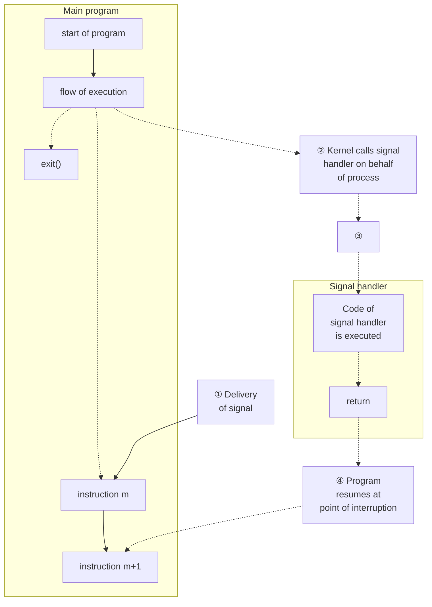

## Chapter 20
# **SIGNALS: FUNDAMENTAL CONCEPTS**

This chapter and next two chapters discuss signals. Although the fundamental concepts are simple, our discussion is quite lengthy, since there are many details to cover. This chapter covers the following topics:

-  the various different signals and their purposes;
-  the circumstances in which the kernel may generate a signal for a process, and the system calls that one process may use to send a signal to another process;
-  how a process responds to a signal by default, and the means by which a process can change its response to a signal, in particular, through the use of a signal handler, a programmer-defined function that is automatically invoked on receipt of a signal;
-  the use of a process signal mask to block signals, and the associated notion of pending signals; and
-  how a process can suspend execution and wait for the delivery of a signal.

### **20.1 Concepts and Overview**

A signal is a notification to a process that an event has occurred. Signals are sometimes described as software interrupts. Signals are analogous to hardware interrupts in that they interrupt the normal flow of execution of a program; in most cases, it is not possible to predict exactly when a signal will arrive.

One process can (if it has suitable permissions) send a signal to another process. In this use, signals can be employed as a synchronization technique, or even as a primitive form of interprocess communication (IPC). It is also possible for a process to send a signal to itself. However, the usual source of many signals sent to a process is the kernel. Among the types of events that cause the kernel to generate a signal for a process are the following:

-  A hardware exception occurred, meaning that the hardware detected a fault condition that was notified to the kernel, which in turn sent a corresponding signal to the process concerned. Examples of hardware exceptions include executing a malformed machine-language instruction, dividing by 0, or referencing a part of memory that is inaccessible.
-  The user typed one of the terminal special characters that generate signals. These characters include the interrupt character (usually Control-C) and the suspend character (usually Control-Z).
-  A software event occurred. For example, input became available on a file descriptor, the terminal window was resized, a timer went off, the process's CPU time limit was exceeded, or a child of this process terminated.

Each signal is defined as a unique (small) integer, starting sequentially from 1. These integers are defined in <signal.h> with symbolic names of the form SIGxxxx. Since the actual numbers used for each signal vary across implementations, it is these symbolic names that are always used in programs. For example, when the user types the interrupt character, SIGINT (signal number 2) is delivered to a process.

Signals fall into two broad categories. The first set constitutes the traditional or standard signals, which are used by the kernel to notify processes of events. On Linux, the standard signals are numbered from 1 to 31. We describe the standard signals in this chapter. The other set of signals consists of the realtime signals, whose differences from standard signals are described in Section 22.8.

A signal is said to be generated by some event. Once generated, a signal is later delivered to a process, which then takes some action in response to the signal. Between the time it is generated and the time it is delivered, a signal is said to be pending.

Normally, a pending signal is delivered to a process as soon as it is next scheduled to run, or immediately if the process is already running (e.g., if the process sent a signal to itself). Sometimes, however, we need to ensure that a segment of code is not interrupted by the delivery of a signal. To do this, we can add a signal to the process's signal mask—a set of signals whose delivery is currently blocked. If a signal is generated while it is blocked, it remains pending until it is later unblocked (removed from the signal mask). Various system calls allow a process to add and remove signals from its signal mask.

Upon delivery of a signal, a process carries out one of the following default actions, depending on the signal:

-  The signal is ignored; that is, it is discarded by the kernel and has no effect on the process. (The process never even knows that it occurred.)
-  The process is terminated (killed). This is sometimes referred to as abnormal process termination, as opposed to the normal process termination that occurs when a process terminates using exit().
-  A core dump file is generated, and the process is terminated. A core dump file contains an image of the virtual memory of the process, which can be loaded into a debugger in order to inspect the state of the process at the time that it terminated.
-  The process is stopped—execution of the process is suspended.
-  Execution of the process is resumed after previously being stopped.

Instead of accepting the default for a particular signal, a program can change the action that occurs when the signal is delivered. This is known as setting the disposition of the signal. A program can set one of the following dispositions for a signal:

-  The default action should occur. This is useful to undo an earlier change of the disposition of the signal to something other than its default.
-  The signal is ignored. This is useful for a signal whose default action would be to terminate the process.
-  A signal handler is executed.

A signal handler is a function, written by the programmer, that performs appropriate tasks in response to the delivery of a signal. For example, the shell has a handler for the SIGINT signal (generated by the interrupt character, Control-C) that causes it to stop what it is currently doing and return control to the main input loop, so that the user is once more presented with the shell prompt. Notifying the kernel that a handler function should be invoked is usually referred to as installing or establishing a signal handler. When a signal handler is invoked in response to the delivery of a signal, we say that the signal has been handled or, synonymously, caught.

Note that it isn't possible to set the disposition of a signal to terminate or dump core (unless one of these is the default disposition of the signal). The nearest we can get to this is to install a handler for the signal that then calls either exit() or abort(). The abort() function (Section 21.2.2) generates a SIGABRT signal for the process, which causes it to dump core and terminate.

> The Linux-specific /proc/PID/status file contains various bit-mask fields that can be inspected to determine a process's treatment of signals. The bit masks are displayed as hexadecimal numbers, with the least significant bit representing signal 1, the next bit to the left representing signal 2, and so on. These fields are SigPnd (per-thread pending signals), ShdPnd (process-wide pending signals; since Linux 2.6), SigBlk (blocked signals), SigIgn (ignored signals), and SigCgt (caught signals). (The difference between the SigPnd and ShdPnd fields will become clear when we describe the handling of signals in multithreaded processes in Section 33.2.) The same information can also be obtained using various options to the ps(1) command.

Signals appeared in very early UNIX implementations, but have gone through some significant changes since their inception. In early implementations, signals could be lost (i.e., not delivered to the target process) in certain circumstances. Furthermore, although facilities were provided to block delivery of signals while critical code was executed, in some circumstances, blocking was not reliable. These problems were remedied in 4.2BSD, which provided so-called reliable signals. (One further BSD innovation was the addition of extra signals to support shell job control, which we describe in Section 34.7.)

System V also added reliable semantics to signals, but employed a model incompatible with BSD. These incompatibilities were resolved only with the arrival of the POSIX.1-1990 standard, which adopted a specification for reliable signals largely based on the BSD model.

We consider the details of reliable and unreliable signals in Section 22.7, and briefly describe the older BSD and System V signal APIs in Section 22.13.

# **20.2 Signal Types and Default Actions**

Earlier, we mentioned that the standard signals are numbered from 1 to 31 on Linux. However, the Linux signal(7) manual page lists more than 31 signal names. The excess names can be accounted for in a variety of ways. Some of the names are simply synonyms for other names, and are defined for source compatibility with other UNIX implementations. Other names are defined but unused. The following list describes the various signals:

### SIGABRT

A process is sent this signal when it calls the abort() function (Section 21.2.2). By default, this signal terminates the process with a core dump. This achieves the intended purpose of the abort() call: to produce a core dump for debugging.

### SIGALRM

The kernel generates this signal upon the expiration of a real-time timer set by a call to alarm() or setitimer(). A real-time timer is one that counts according to wall clock time (i.e., the human notion of elapsed time). For further details, see Section 23.1.

### SIGBUS

This signal ("bus error") is generated to indicate certain kinds of memoryaccess errors. One such error can occur when using memory mappings created with mmap(), if we attempt to access an address that lies beyond the end of the underlying memory-mapped file, as described in Section 49.4.3.

### SIGCHLD

This signal is sent (by the kernel) to a parent process when one of its children terminates (either by calling exit() or as a result of being killed by a signal). It may also be sent to a process when one of its children is stopped or resumed by a signal. We consider SIGCHLD in detail in Section 26.3.

SIGCLD

This is a synonym for SIGCHLD.

SIGCONT

When sent to a stopped process, this signal causes the process to resume (i.e., to be rescheduled to run at some later time). When received by a process that is not currently stopped, this signal is ignored by default. A process may catch this signal, so that it carries out some action when it resumes. This signal is covered in more detail in Sections 22.2 and 34.7.

SIGEMT

In UNIX systems generally, this signal is used to indicate an implementationdependent hardware error. On Linux, this signal is used only in the Sun SPARC implementation. The suffix EMT derives from emulator trap, an assembler mnemonic on the Digital PDP-11.

SIGFPE

This signal is generated for certain types of arithmetic errors, such as divide-by-zero. The suffix FPE is an abbreviation for floating-point exception, although this signal can also be generated for integer arithmetic errors. The precise details of when this signal is generated depend on the hardware architecture and the settings of CPU control registers. For example, on x86-32, integer divide-by-zero always yields a SIGFPE, but the handling of floating-point divide-by-zero depends on whether the FE\_DIVBYZERO exception has been enabled. If this exception is enabled (using feenableexcept()), then a floating-point divide-by-zero generates SIGFPE; otherwise, it yields the IEEE-standard result for the operands (a floating-point representation of infinity). See the fenv(3) manual page and <fenv.h> for further information.

SIGHUP

When a terminal disconnect (hangup) occurs, this signal is sent to the controlling process of the terminal. We describe the concept of a controlling process and the various circumstances in which SIGHUP is sent in Section 34.6. A second use of SIGHUP is with daemons (e.g., init, httpd, and inetd). Many daemons are designed to respond to the receipt of SIGHUP by reinitializing themselves and rereading their configuration files. The system administrator triggers these actions by manually sending SIGHUP to the daemon, either by using an explicit kill command or by executing a program or script that does the same.

SIGILL

This signal is sent to a process if it tries to execute an illegal (i.e., incorrectly formed) machine-language instruction.

SIGINFO

On Linux, this signal name is a synonym for SIGPWR. On BSD systems, the SIGINFO signal, generated by typing Control-T, is used to obtain status information about the foreground process group.

SIGINT

When the user types the terminal interrupt character (usually Control-C), the terminal driver sends this signal to the foreground process group. The default action for this signal is to terminate the process.

SIGIO

Using the fcntl() system call, it is possible to arrange for this signal to be generated when an I/O event (e.g., input becoming available) occurs on certain types of open file descriptors, such as those for terminals and sockets. This feature is described further in Section 63.3.

SIGIOT

On Linux, this is a synonym for SIGABRT. On some other UNIX implementations, this signal indicates an implementation-defined hardware fault.

SIGKILL

This is the sure kill signal. It can't be blocked, ignored, or caught by a handler, and thus always terminates a process.

SIGLOST

This signal name exists on Linux, but is unused. On some other UNIX implementations, the NFS client sends this signal to local processes holding locks if the NSF client fails to regain locks held by the those processes following the recovery of a remote NFS server that crashed. (This feature is not standardized in NFS specifications.)

SIGPIPE

This signal is generated when a process tries to write to a pipe, a FIFO, or a socket for which there is no corresponding reader process. This normally occurs because the reading process has closed its file descriptor for the IPC channel. See Section 44.2 for further details.

SIGPOLL

This signal, which is derived from System V, is a synonym for SIGIO on Linux.

SIGPROF

The kernel generates this signal upon the expiration of a profiling timer set by a call to setitimer() (Section 23.1). A profiling timer is one that counts the CPU time used by a process. Unlike a virtual timer (see SIGVTALRM below), a profiling timer counts CPU time used in both user mode and kernel mode.

SIGPWR

This is the power failure signal. On systems that have an uninterruptible power supply (UPS), it is possible to set up a daemon process that monitors the backup battery level in the event of a power failure. If the battery power is about to run out (after an extended power outage), then the monitoring process sends SIGPWR to the init process, which interprets this signal as a request to shut down the system in a quick and orderly fashion.

### SIGQUIT

When the user types the quit character (usually Control-\) on the keyboard, this signal is sent to the foreground process group. By default, this signal terminates a process and causes it to produce a core dump, which can then be used for debugging. Using SIGQUIT in this manner is useful with a program that is stuck in an infinite loop or is otherwise not responding. By typing Control-\ and then loading the resulting core dump with the gdb debugger and using the backtrace command to obtain a stack trace, we can find out which part of the program code was executing. ([Matloff, 2008] describes the use of gdb.)

### SIGSEGV

This very popular signal is generated when a program makes an invalid memory reference. A memory reference may be invalid because the referenced page doesn't exist (e.g., it lies in an unmapped area somewhere between the heap and the stack), the process tried to update a location in read-only memory (e.g., the program text segment or a region of mapped memory marked read-only), or the process tried to access a part of kernel memory while running in user mode (Section 2.1). In C, these events often result from dereferencing a pointer containing a bad address (e.g., an uninitialized pointer) or passing an invalid argument in a function call. The name of this signal derives from the term segmentation violation.

### SIGSTKFLT

Documented in signal(7) as "stack fault on coprocessor," this signal is defined, but is unused on Linux.

### SIGSTOP

This is the sure stop signal. It can't be blocked, ignored, or caught by a handler; thus, it always stops a process.

### SIGSYS

This signal is generated if a process makes a "bad" system call. This means that the process executed an instruction that was interpreted as a system call trap, but the associated system call number was not valid (refer to Section 3.1).

### SIGTERM

This is the standard signal used for terminating a process and is the default signal sent by the kill and killall commands. Users sometimes explicitly send the SIGKILL signal to a process using kill –KILL or kill –9. However, this is generally a mistake. A well-designed application will have a handler for SIGTERM that causes the application to exit gracefully, cleaning up temporary files and releasing other resources beforehand. Killing a process with SIGKILL bypasses the SIGTERM handler. Thus, we should always first attempt to terminate a process using SIGTERM, and reserve SIGKILL as a last resort for killing runaway processes that don't respond to SIGTERM.

### SIGTRAP

This signal is used to implement debugger breakpoints and system call tracing, as performed by strace(1) (Appendix A). See the ptrace(2) manual page for further information.

### SIGTSTP

This is the job-control stop signal, sent to stop the foreground process group when the user types the suspend character (usually Control-Z) on the keyboard. Chapter 34 describes process groups (jobs) and job control in detail, as well as details of when and how a program may need to handle this signal. The name of this signal derives from "terminal stop."

### SIGTTIN

When running under a job-control shell, the terminal driver sends this signal to a background process group when it attempts to read() from the terminal. This signal stops a process by default.

### SIGTTOU

This signal serves an analogous purpose to SIGTTIN, but for terminal output by background jobs. When running under a job-control shell, if the TOSTOP (terminal output stop) option has been enabled for the terminal (perhaps via the command stty tostop), the terminal driver sends SIGTTOU to a background process group when it attempts to write() to the terminal (see Section 34.7.1). This signal stops a process by default.

### SIGUNUSED

As the name implies, this signal is unused. On Linux 2.4 and later, this signal name is synonymous with SIGSYS on many architectures. In other words, this signal number is no longer unused on those architectures, although the signal name remains for backward compatibility.

### SIGURG

This signal is sent to a process to indicate the presence of out-of-band (also known as urgent) data on a socket (Section 61.13.1).

### SIGUSR1

This signal and SIGUSR2 are available for programmer-defined purposes. The kernel never generates these signals for a process. Processes may use these signals to notify one another of events or to synchronize with each other. In early UNIX implementations, these were the only two signals that could be freely used in applications. (In fact, processes can send one another any signal, but this has the potential for confusion if the kernel also generates one of the signals for a process.) Modern UNIX implementations provide a large set of realtime signals that are also available for programmer-defined purposes (Section 22.8).

### SIGUSR2

See the description of SIGUSR1.

### SIGVTALRM

The kernel generates this signal upon expiration of a virtual timer set by a call to setitimer() (Section 23.1). A virtual timer is one that counts the usermode CPU time used by a process.

### SIGWINCH

In a windowing environment, this signal is sent to the foreground process group when the terminal window size changes (as a consequence either of the user manually resizing it, or of a program resizing it via a call to ioctl(), as described in Section 62.9). By installing a handler for this signal, programs such as vi and less can know to redraw their output after a change in window size.

### SIGXCPU

This signal is sent to a process when it exceeds its CPU time resource limit (RLIMIT\_CPU, described in Section 36.3).

### SIGXFSZ

This signal is sent to a process if it attempts (using write() or truncate()) to increase the size of a file beyond the process's file size resource limit (RLIMIT\_FSIZE, described in Section 36.3).

Table 20-1 summarizes a range of information about signals on Linux. Note the following points about this table:

-  The signal number column shows the number assigned to this signal on various hardware architectures. Except where otherwise indicated, signals have the same number on all architectures. Architectural differences in signal numbers are indicated in parentheses, and occur on the Sun SPARC and SPARC64 (S), HP/Compaq/Digital Alpha (A), MIPS (M), and HP PA-RISC (P) architectures. In this column, undef indicates that a symbol is undefined on the indicated architectures.
-  The SUSv3 column indicates whether the signal is standardized in SUSv3.
-  The Default column indicates the default action of the signal: term means that the signal terminates the process, core means that the process produces a core dump file and terminates, ignore means that the signal is ignored, stop means that the signal stops the process, and cont means that the signal resumes a stopped process.

Certain of the signals listed previously are not shown in Table 20-1: SIGCLD (synonym for SIGCHLD), SIGINFO (unused), SIGIOT (synonym for SIGABRT), SIGLOST (unused), and SIGUNUSED (synonym for SIGSYS on many architectures).

**Table 20-1:** Linux signals

| Name      | Signal number          | Description                      | SUSv3 | Default |
|-----------|------------------------|----------------------------------|-------|---------|
| SIGABRT   | 6                      | Abort process                    | •     | core    |
| SIGALRM   | 14                     | Real-time timer expired<br>•     |       | term    |
| SIGBUS    | 7 (SAMP=10)            | Memory access error<br>•         |       | core    |
| SIGCHLD   | 17 (SA=20, MP=18)      | •<br>Child terminated or stopped |       | ignore  |
| SIGCONT   | 18 (SA=19, M=25, P=26) | Continue if stopped<br>•         |       | cont    |
| SIGEMT    | undef (SAMP=7)         | Hardware fault                   |       | term    |
| SIGFPE    | 8                      | •<br>Arithmetic exception        |       | core    |
| SIGHUP    | 1                      | Hangup<br>•                      |       | term    |
| SIGILL    | 4                      | Illegal instruction<br>•         |       | core    |
| SIGINT    | 2                      | •<br>Terminal interrupt          |       | term    |
| SIGIO /   | 29 (SA=23, MP=22)      | I/O possible                     | •     | term    |
| SIGPOLL   |                        |                                  |       |         |
| SIGKILL   | 9                      | Sure kill                        | •     | term    |
| SIGPIPE   | 13                     | Broken pipe                      | •     | term    |
| SIGPROF   | 27 (M=29, P=21)        | Profiling timer expired          | •     | term    |
| SIGPWR    | 30 (SA=29, MP=19)      | Power about to fail              |       | term    |
| SIGQUIT   | 3                      | Terminal quit                    | •     | core    |
| SIGSEGV   | 11                     | Invalid memory reference         | •     | core    |
| SIGSTKFLT | 16 (SAM=undef, P=36)   | Stack fault on coprocessor       |       | term    |
| SIGSTOP   | 19 (SA=17, M=23, P=24) | Sure stop<br>•                   |       | stop    |
| SIGSYS    | 31 (SAMP=12)           | Invalid system call              | •     | core    |
| SIGTERM   | 15                     | Terminate process                | •     | term    |
| SIGTRAP   | 5                      | Trace/breakpoint trap            | •     | core    |
| SIGTSTP   | 20 (SA=18, M=24, P=25) | Terminal stop                    | •     | stop    |
| SIGTTIN   | 21 (M=26, P=27)        | Terminal read from BG            | •     | stop    |
| SIGTTOU   | 22 (M=27, P=28)        | Terminal write from BG           | •     | stop    |
| SIGURG    | 23 (SA=16, M=21, P=29) | Urgent data on socket            | •     | ignore  |
| SIGUSR1   | 10 (SA=30, MP=16)      | User-defined signal 1            | •     | term    |
| SIGUSR2   | 12 (SA=31, MP=17)      | User-defined signal 2            | •     | term    |
| SIGVTALRM | 26 (M=28, P=20)        | Virtual timer expired            | •     | term    |
| SIGWINCH  | 28 (M=20, P=23)        | Terminal window size change      |       | ignore  |
| SIGXCPU   | 24 (M=30, P=33)        | CPU time limit exceeded          | •     | core    |
| SIGXFSZ   | 25 (M=31, P=34)        | File size limit exceeded         | •     | core    |

Note the following points regarding the default behavior shown for certain signals in Table 20-1:

-  On Linux 2.2, the default action for the signals SIGXCPU, SIGXFSZ, SIGSYS, and SIGBUS is to terminate the process without producing a core dump. From kernel 2.4 onward, Linux conforms to the requirements of SUSv3, with these signals causing termination with a core dump. On several other UNIX implementations, SIGXCPU and SIGXFSZ are treated in the same way as on Linux 2.2.
-  SIGPWR is typically ignored by default on those other UNIX implementations where it appears.

-  SIGIO is ignored by default on several UNIX implementations (particularly BSD derivatives).
-  Although not specified by any standards, SIGEMT appears on most UNIX implementations. However, this signal typically results in termination with a core dump on other implementations.
-  In SUSv1, the default action for SIGURG was specified as process termination, and this is the default in some older UNIX implementations. SUSv2 adopted the current specification (ignore).

# <span id="page-10-0"></span>**20.3 Changing Signal Dispositions: signal()**

UNIX systems provide two ways of changing the disposition of a signal: signal() and sigaction(). The signal() system call, which is described in this section, was the original API for setting the disposition of a signal, and it provides a simpler interface than sigaction(). On the other hand, sigaction() provides functionality that is not available with signal(). Furthermore, there are variations in the behavior of signal() across UNIX implementations (Section 22.7), which mean that it should never be used for establishing signal handlers in portable programs. Because of these portability issues, sigaction() is the (strongly) preferred API for establishing a signal handler. After we explain the use of sigaction() in Section [20.13,](#page-29-0) we'll always employ that call when establishing signal handlers in our example programs.

> Although documented in section 2 of the Linux manual pages, signal() is actually implemented in glibc as a library function layered on top of the sigaction() system call.

```
#include <signal.h>
void ( *signal(int sig, void (*handler)(int)) ) (int);
              Returns previous signal disposition on success, or SIG_ERR on error
```

The function prototype for signal() requires some decoding. The first argument, sig, identifies the signal whose disposition we wish to change. The second argument, handler, is the address of the function that should be called when this signal is delivered. This function returns nothing (void) and takes one integer argument. Thus, a signal handler has the following general form:

```
void
handler(int sig)
{
 /* Code for the handler */
}
```

We describe the purpose of the sig argument to the handler function in Section [20.4](#page-11-0). The return value of signal() is the previous disposition of the signal. Like the handler argument, this is a pointer to a function returning nothing and taking one integer argument. In other words, we could write code such as the following to temporarily establish a handler for a signal, and then reset the disposition of the signal to whatever it was previously:

```
void (*oldHandler)(int);
oldHandler = signal(SIGINT, newHandler);
if (oldHandler == SIG_ERR)
 errExit("signal");
/* Do something else here. During this time, if SIGINT is
 delivered, newHandler will be used to handle the signal. */
if (signal(SIGINT, oldHandler) == SIG_ERR)
 errExit("signal");
```

It is not possible to use signal() to retrieve the current disposition of a signal without at the same time changing that disposition. To do that, we must use sigaction().

We can make the prototype for signal() much more comprehensible by using the following type definition for a pointer to a signal handler function:

```
typedef void (*sighandler_t)(int);
```

This enables us to rewrite the prototype for signal() as follows:

```
sighandler_t signal(int sig, sighandler_t handler);
```

If the \_GNU\_SOURCE feature test macro is defined, then glibc exposes the nonstandard sighandler\_t data type in the <signal.h> header file.

Instead of specifying the address of a function as the handler argument of signal(), we can specify one of the following values:

SIG\_DFL

Reset the disposition of the signal to its default (Table 20-1). This is useful for undoing the effect of an earlier call to signal() that changed the disposition for the signal.

SIG\_IGN

Ignore the signal. If the signal is generated for this process, the kernel silently discards it. The process never even knows that the signal occurred.

A successful call to signal() returns the previous disposition of the signal, which may be the address of a previously installed handler function, or one of the constants SIG\_DFL or SIG\_IGN. On error, signal() returns the value SIG\_ERR.

# <span id="page-11-0"></span>**20.4 Introduction to Signal Handlers**

A signal handler (also called a signal catcher) is a function that is called when a specified signal is delivered to a process. We describe the fundamentals of signal handlers in this section, and then go into the details in Chapter 21.

Invocation of a signal handler may interrupt the main program flow at any time; the kernel calls the handler on the process's behalf, and when the handler returns, execution of the program resumes at the point where the handler interrupted it. This sequence is illustrated in [Figure 20-1.](#page-12-0)



<span id="page-12-0"></span>**Figure 20-1:** Signal delivery and handler execution

Although signal handlers can do virtually anything, they should, in general, be designed to be as simple as possible. We expand on this point in Section 21.1.

<span id="page-12-1"></span>**Listing 20-1:** Installing a handler for SIGINT

```
––––––––––––––––––––––––––––––––––––––––––––––––––––––––––– signals/ouch.c
#include <signal.h>
#include "tlpi_hdr.h"
static void
sigHandler(int sig)
{
 printf("Ouch!\n"); /* UNSAFE (see Section 21.1.2) */
}
int
main(int argc, char *argv[])
{
 int j;
 if (signal(SIGINT, sigHandler) == SIG_ERR)
 errExit("signal");
 for (j = 0; ; j++) {
 printf("%d\n", j);
 sleep(3); /* Loop slowly... */
 }
}
––––––––––––––––––––––––––––––––––––––––––––––––––––––––––– signals/ouch.c
```

[Listing 20-1](#page-12-1) (on page [399\)](#page-12-1) shows a simple example of a signal handler function and a main program that establishes it as the handler for the SIGINT signal. (The terminal driver generates this signal when we type the terminal interrupt character, usually Control-C.) The handler simply prints a message and returns.

The main program continuously loops. On each iteration, the program increments a counter whose value it prints, and then the program sleeps for a few seconds. (To sleep in this manner, we use the sleep() function, which suspends the execution of its caller for a specified number of seconds. We describe this function in Section 23.4.1.)

When we run the program in [Listing 20-1,](#page-12-1) we see the following:

```
$ ./ouch
0 Main program loops, displaying successive integers
Type Control-C
Ouch! Signal handler is executed, and returns
1 Control has returned to main program
2
Type Control-C again
Ouch!
3
Type Control-\ (the terminal quit character)
Quit (core dumped)
```

When the kernel invokes a signal handler, it passes the number of the signal that caused the invocation as an integer argument to the handler. (This is the sig argument in the handler of [Listing 20-1\)](#page-12-1). If a signal handler catches only one type of signal, then this argument is of little use. We can, however, establish the same handler to catch different types of signals and use this argument to determine which signal caused the handler to be invoked.

This is illustrated in [Listing 20-2,](#page-14-0) a program that establishes the same handler for SIGINT and SIGQUIT. (SIGQUIT is generated by the terminal driver when we type the terminal quit character, usually Control-\.) The code of the handler distinguishes the two signals by examining the sig argument, and takes different actions for each signal. In the main() function, we use pause() (described in Section [20.14](#page-31-0)) to block the process until a signal is caught.

The following shell session log demonstrates the use of this program:

```
$ ./intquit
Type Control-C
Caught SIGINT (1)
Type Control-C again
Caught SIGINT (2)
and again
Caught SIGINT (3)
Type Control-\
Caught SIGQUIT - that's all folks!
```

In [Listing 20-1](#page-12-1) and [Listing 20-2,](#page-14-0) we use printf() to display the message from the signal handler. For reasons that we discuss in Section 21.1.2, real-world applications should generally never call stdio functions from within a signal handler. However, in various example programs, we'll nevertheless call printf() from a signal handler as a simple means of seeing when the handler is called.

<span id="page-14-0"></span>**Listing 20-2:** Establishing the same handler for two different signals

```
––––––––––––––––––––––––––––––––––––––––––––––––––––––––– signals/intquit.c
#include <signal.h>
#include "tlpi_hdr.h"
static void
sigHandler(int sig)
{
 static int count = 0;
 /* UNSAFE: This handler uses non-async-signal-safe functions
 (printf(), exit(); see Section 21.1.2) */
 if (sig == SIGINT) {
 count++;
 printf("Caught SIGINT (%d)\n", count);
 return; /* Resume execution at point of interruption */
 }
 /* Must be SIGQUIT - print a message and terminate the process */
 printf("Caught SIGQUIT - that's all folks!\n");
 exit(EXIT_SUCCESS);
}
int
main(int argc, char *argv[])
{
 /* Establish same handler for SIGINT and SIGQUIT */
 if (signal(SIGINT, sigHandler) == SIG_ERR)
 errExit("signal");
 if (signal(SIGQUIT, sigHandler) == SIG_ERR)
 errExit("signal");
 for (;;) /* Loop forever, waiting for signals */
 pause(); /* Block until a signal is caught */
}
––––––––––––––––––––––––––––––––––––––––––––––––––––––––– signals/intquit.c
```

# **20.5 Sending Signals: kill()**

One process can send a signal to another process using the kill() system call, which is the analog of the kill shell command. (The term kill was chosen because the default action of most of the signals that were available on early UNIX implementations was to terminate the process.)

```
#include <signal.h>
int kill(pid_t pid, int sig);
                                             Returns 0 on success, or –1 on error
```

The pid argument identifies one or more processes to which the signal specified by sig is to be sent. Four different cases determine how pid is interpreted:

-  If pid is greater than 0, the signal is sent to the process with the process ID specified by pid.
-  If pid equals 0, the signal is sent to every process in the same process group as the calling process, including the calling process itself. (SUSv3 states that the signal should be sent to all processes in the same process group, excluding an "unspecified set of system processes" and adds the same qualification to each of the remaining cases.)
-  If pid is less than –1, the signal is sent to all of the processes in the process group whose ID equals the absolute value of pid. Sending a signal to all of the processes in a process group finds particular use in shell job control (Section 34.7).
-  If pid equals –1, the signal is sent to every process for which the calling process has permission to send a signal, except init (process ID 1) and the calling process. If a privileged process makes this call, then all processes on the system will be signaled, except for these last two. For obvious reasons, signals sent in this way are sometimes called broadcast signals. (SUSv3 doesn't require that the calling process be excluded from receiving the signal; Linux follows the BSD semantics in this regard.)

If no process matches the specified pid, kill() fails and sets errno to ESRCH ("No such process").

A process needs appropriate permissions to be able send a signal to another process. The permission rules are as follows:

-  A privileged (CAP\_KILL) process may send a signal to any process.
-  The init process (process ID 1), which runs with user and group of root, is a special case. It can be sent only signals for which it has a handler installed. This prevents the system administrator from accidentally killing init, which is fundamental to the operation of the system.
-  An unprivileged process can send a signal to another process if the real or effective user ID of the sending process matches the real user ID or saved setuser-ID of the receiving process, as shown in [Figure 20-2](#page-16-0). This rule allows users to send signals to set-user-ID programs that they have started, regardless of the current setting of the target process's effective user ID. Excluding the effective user ID of the target from the check serves a complementary purpose: it prevents one user from sending signals to another user's process that is running a setuser-ID program belonging to the user trying to send the signal. (SUSv3 mandates the rules shown in [Figure 20-2,](#page-16-0) but Linux followed slightly different rules in kernel versions before 2.0, as described in the kill(2) manual page.)

 The SIGCONT signal is treated specially. An unprivileged process may send this signal to any other process in the same session, regardless of user ID checks. This rule allows job-control shells to restart stopped jobs (process groups), even if the processes of the job have changed their user IDs (i.e., they are privileged processes that have used the system calls described in Section 9.7 to change their credentials).

```text
Sending process              Receiving process
┌─────────────────────┐      ┌─────────────────────┐
│   real user ID      │─────>│   real user ID      │
├─────────────────────┤  ┌──>├─────────────────────┤
│ effective user ID   │──┤   │ effective user ID   │
├─────────────────────┤  └──>├─────────────────────┤
│ saved set-user-ID   │─────>│ saved set-user-ID   │
└─────────────────────┘      └─────────────────────┘

        indicates that if IDs match,
───────> then sender has permission
        to send a signal to receiver
```

<span id="page-16-0"></span>**Figure 20-2:** Permissions required for an unprivileged process to send a signal

If a process doesn't have permissions to send a signal to the requested pid, then kill() fails, setting errno to EPERM. Where pid specifies a set of processes (i.e., pid is negative), kill() succeeds if at least one of them could be signaled.

We demonstrate the use of kill() in Listing 20-3.

# **20.6 Checking for the Existence of a Process**

The kill() system call can serve another purpose. If the sig argument is specified as 0 (the so-called null signal), then no signal is sent. Instead, kill() merely performs error checking to see if the process can be signaled. Read another way, this means we can use the null signal to test if a process with a specific process ID exists. If sending a null signal fails with the error ESRCH, then we know the process doesn't exist. If the call fails with the error EPERM (meaning the process exists, but we don't have permission to send a signal to it) or succeeds (meaning we do have permission to send a signal to the process), then we know that the process exists.

Verifying the existence of a particular process ID doesn't guarantee that a particular program is still running. Because the kernel recycles process IDs as processes are born and die, the same process ID may, over time, refer to a different process. Furthermore, a particular process ID may exist, but be a zombie (i.e., a process that has died, but whose parent has not yet performed a wait() to obtain its termination status, as described in Section 26.2).

Various other techniques can also be used to check whether a particular process is running, including the following:

-  The wait() system calls: These calls are described in Chapter 26. They can be employed only if the monitored process is a child of the caller.
-  Semaphores and exclusive file locks: If the process that is being monitored continuously holds a semaphore or a file lock, then, if we can acquire the semaphore or lock, we know the process has terminated. We describe semaphores in Chapters 47 and 53 and file locks in Chapter 55.

-  IPC channels such as pipes and FIFOs: We set up the monitored process so that it holds a file descriptor open for writing on the channel as long as it is alive. Meanwhile, the monitoring process holds open a read descriptor for the channel, and it knows that the monitored process has terminated when the write end of the channel is closed (because it sees end-of-file). The monitoring process can determine this either by reading from its file descriptor or by monitoring the descriptor using one of the techniques described in Chapter 63.
-  The /proc/PID interface: For example, if a process with the process ID 12345 exists, then the directory /proc/12345 will exist, and we can check this using a call such as stat().

All of these techniques, except the last, are unaffected by recycling of process IDs. Listing 20-3 demonstrates the use of kill(). This program takes two commandline arguments, a signal number and a process ID, and uses kill() to send the signal to the specified process. If signal 0 (the null signal) is specified, then the program reports on the existence of the target process.

# **20.7 Other Ways of Sending Signals: raise() and killpg()**

Sometimes, it is useful for a process to send a signal to itself. (We see an example of this in Section 34.7.3.) The raise() function performs this task.

```
#include <signal.h>
int raise(int sig);
                                      Returns 0 on success, or nonzero on error
```

In a single-threaded program, a call to raise() is equivalent to the following call to kill():

```
kill(getpid(), sig);
```

On a system that supports threads, raise(sig) is implemented as:

```
pthread_kill(pthread_self(), sig)
```

We describe the pthread\_kill() function in Section 33.2.3, but for now it is sufficient to say that this implementation means that the signal will be delivered to the specific thread that called raise(). By contrast, the call kill(getpid(), sig) sends a signal to the calling process, and that signal may be delivered to any thread in the process.

> The raise() function originates from C89. The C standards don't cover operating system details such as process IDs, but raise() can be specified within the C standard because it doesn't require reference to process IDs.

When a process sends itself a signal using raise() (or kill()), the signal is delivered immediately (i.e., before raise() returns to the caller).

Note that raise() returns a nonzero value (not necessarily –1) on error. The only error that can occur with raise() is EINVAL, because sig was invalid. Therefore, where we specify one of the SIGxxxx constants, we don't check the return status of this function.

```
––––––––––––––––––––––––––––––––––––––––––––––––––––––––––signals/t_kill.c
#include <signal.h>
#include "tlpi_hdr.h"
int
main(int argc, char *argv[])
{
 int s, sig;
 if (argc != 3 || strcmp(argv[1], "--help") == 0)
 usageErr("%s sig-num pid\n", argv[0]);
 sig = getInt(argv[2], 0, "sig-num");
 s = kill(getLong(argv[1], 0, "pid"), sig);
 if (sig != 0) {
 if (s == -1)
 errExit("kill");
 } else { /* Null signal: process existence check */
 if (s == 0) {
 printf("Process exists and we can send it a signal\n");
 } else {
 if (errno == EPERM)
 printf("Process exists, but we don't have "
 "permission to send it a signal\n");
 else if (errno == ESRCH)
 printf("Process does not exist\n");
 else
 errExit("kill");
 }
 }
 exit(EXIT_SUCCESS);
}
––––––––––––––––––––––––––––––––––––––––––––––––––––––––––signals/t_kill.c
```

The killpg() function sends a signal to all of the members of a process group.

```
#include <signal.h>
int killpg(pid_t pgrp, int sig);
                                             Returns 0 on success, or –1 on error
```

A call to killpg() is equivalent to the following call to kill():

```
kill(-pgrp, sig);
```

If pgrp is specified as 0, then the signal is sent to all processes in the same process group as the caller. SUSv3 leaves this point unspecified, but most UNIX implementations interpret this case in the same way as Linux.

# **20.8 Displaying Signal Descriptions**

Each signal has an associated printable description. These descriptions are listed in the array sys\_siglist. For example, we can refer to sys\_siglist[SIGPIPE] to get the description for SIGPIPE (broken pipe). However, rather than using the sys\_siglist array directly, the strsignal() function is preferable.

```
#define _BSD_SOURCE
#include <signal.h>
extern const char *const sys_siglist[];
#define _GNU_SOURCE
#include <string.h>
char *strsignal(int sig);
                                      Returns pointer to signal description string
```

The strsignal() function performs bounds checking on the sig argument, and then returns a pointer to a printable description of the signal, or a pointer to an error string if the signal number was invalid. (On some other UNIX implementations, strsignal() returns NULL if sig is invalid.)

Aside from bounds checking, another advantage of strsignal() over the direct use of sys\_siglist is that strsignal() is locale-sensitive (Section 10.4), so that signal descriptions will be displayed in the local language.

An example of the use of strsignal() is shown in Listing 20-4.

The psignal() function displays (on standard error) the string given in its argument msg, followed by a colon, and then the signal description corresponding to sig. Like strsignal(), psignal() is locale-sensitive.

```
#include <signal.h>
void psignal(int sig, const char *msg);
```

Although psignal(), strsignal(), and sys\_siglist are not standardized as part of SUSv3, they are nevertheless available on many UNIX implementations. (SUSv4 adds specifications for psignal() and strsignal().)

# <span id="page-19-0"></span>**20.9 Signal Sets**

Many signal-related system calls need to be able to represent a group of different signals. For example, sigaction() and sigprocmask() allow a program to specify a group of signals that are to be blocked by a process, while sigpending() returns a group of signals that are currently pending for a process. (We describe these system calls shortly.)

Multiple signals are represented using a data structure called a signal set, provided by the system data type sigset\_t. SUSv3 specifies a range of functions for manipulating signal sets, and we now describe these functions.

> On Linux, as on most UNIX implementations, the sigset\_t data type is a bit mask. However, SUSv3 doesn't require this. A signal set could conceivably be represented using some other kind of structure. SUSv3 requires only that the type of sigset\_t be assignable. Thus, it must be implemented using either some scalar type (e.g., an integer) or a C structure (perhaps containing an array of integers).

The sigemptyset() function initializes a signal set to contain no members. The sigfillset() function initializes a set to contain all signals (including all realtime signals).

```
#include <signal.h>
int sigemptyset(sigset_t *set);
int sigfillset(sigset_t *set);
                                          Both return 0 on success, or –1 on error
```

One of sigemptyset() or sigaddset() must be used to initialize a signal set. This is because C doesn't initialize automatic variables, and the initialization of static variables to 0 can't portably be relied upon as indicating an empty signal set, since signal sets may be implemented using structures other than bit masks. (For the same reason, it is incorrect to use memset(3) to zero the contents of a signal set in order to mark it as empty.)

After initialization, individual signals can be added to a set using sigaddset() and removed using sigdelset().

```
#include <signal.h>
int sigaddset(sigset_t *set, int sig);
int sigdelset(sigset_t *set, int sig);
                                          Both return 0 on success, or –1 on error
```

For both sigaddset() and sigdelset(), the sig argument is a signal number. The sigismember() function is used to test for membership of a set.

```
#include <signal.h>
int sigismember(const sigset_t *set, int sig);
                                    Returns 1 if sig is a member of set, otherwise 0
```

The sigismember() function returns 1 (true) if sig is a member of set, and 0 (false) otherwise.

The GNU C library implements three nonstandard functions that perform tasks that are complementary to the standard signal set functions just described.

```
#define _GNU_SOURCE
#include <signal.h>
int sigandset(sigset_t *set, sigset_t *left, sigset_t *right);
int sigorset(sigset_t *dest, sigset_t *left, sigset_t *right);
                                          Both return 0 on success, or –1 on error
int sigisemptyset(const sigset_t *set);
                                              Returns 1 if sig is empty, otherwise 0
```

These functions perform the following tasks:

-  sigandset() places the intersection of the sets left and right in the set dest;
-  sigorset() places the union of the sets left and right in the set dest; and
-  sigisemptyset() returns true if set contains no signals.

### **Example program**

Using the functions described in this section, we can write the functions shown in [Listing 20-4](#page-21-0), which we employ in various later programs. The first of these, printSigset(), displays the signals that are members of the specified signal set. This function uses the NSIG constant, which is defined in <signal.h> to be one greater than the highest signal number. We use NSIG as the upper bound in a loop that tests all signal numbers for membership of a set.

> Although NSIG is not specified in SUSv3, it is defined on most UNIX implementations. However, it may be necessary to use implementation-specific compiler options to make it visible. For example, on Linux, we must define one of the feature test macros \_BSD\_SOURCE, \_SVID\_SOURCE, or \_GNU\_SOURCE.

The printSigMask() and printPendingSigs() functions employ printSigset() to display, respectively, the process signal mask and the set of currently pending signals. The printSigMask() and printPendingSigs() functions use the sigprocmask() and sigpending() system calls, respectively. We describe the sigprocmask() and sigpending() system calls in Sections [20.10](#page-23-0) and [20.11](#page-24-0).

<span id="page-21-0"></span>**Listing 20-4:** Functions for displaying signal sets

```
––––––––––––––––––––––––––––––––––––––––––––––––– signals/signal_functions.c
#define _GNU_SOURCE
#include <string.h>
#include <signal.h>
#include "signal_functions.h" /* Declares functions defined here */
#include "tlpi_hdr.h"
/* NOTE: All of the following functions employ fprintf(), which
 is not async-signal-safe (see Section 21.1.2). As such, these
```

```
 functions are also not async-signal-safe (i.e., beware of
 indiscriminately calling them from signal handlers). */
void /* Print list of signals within a signal set */
printSigset(FILE *of, const char *prefix, const sigset_t *sigset)
{
 int sig, cnt;
 cnt = 0;
 for (sig = 1; sig < NSIG; sig++) {
 if (sigismember(sigset, sig)) {
 cnt++;
 fprintf(of, "%s%d (%s)\n", prefix, sig, strsignal(sig));
 }
 }
 if (cnt == 0)
 fprintf(of, "%s<empty signal set>\n", prefix);
}
int /* Print mask of blocked signals for this process */
printSigMask(FILE *of, const char *msg)
{
 sigset_t currMask;
 if (msg != NULL)
 fprintf(of, "%s", msg);
 if (sigprocmask(SIG_BLOCK, NULL, &currMask) == -1)
 return -1;
 printSigset(of, "\t\t", &currMask);
 return 0;
}
int /* Print signals currently pending for this process */
printPendingSigs(FILE *of, const char *msg)
{
 sigset_t pendingSigs;
 if (msg != NULL)
 fprintf(of, "%s", msg);
 if (sigpending(&pendingSigs) == -1)
 return -1;
 printSigset(of, "\t\t", &pendingSigs);
 return 0;
}
––––––––––––––––––––––––––––––––––––––––––––––––– signals/signal_functions.c
```

# <span id="page-23-0"></span>**20.10 The Signal Mask (Blocking Signal Delivery)**

For each process, the kernel maintains a signal mask—a set of signals whose delivery to the process is currently blocked. If a signal that is blocked is sent to a process, delivery of that signal is delayed until it is unblocked by being removed from the process signal mask. (In Section 33.2.1, we'll see that the signal mask is actually a per-thread attribute, and that each thread in a multithreaded process can independently examine and modify its signal mask using the pthread\_sigmask() function.)

A signal may be added to the signal mask in the following ways:

-  When a signal handler is invoked, the signal that caused its invocation can be automatically added to the signal mask. Whether or not this occurs depends on the flags used when the handler is established using sigaction().
-  When a signal handler is established with sigaction(), it is possible to specify an additional set of signals that are to be blocked when the handler is invoked.
-  The sigprocmask() system call can be used at any time to explicitly add signals to, and remove signals from, the signal mask.

We delay discussion of the first two cases until we examine sigaction() in Section [20.13](#page-29-0), and discuss sigprocmask() now.

```
#include <signal.h>
int sigprocmask(int how, const sigset_t *set, sigset_t *oldset);
                                             Returns 0 on success, or –1 on error
```

We can use sigprocmask() to change the process signal mask, to retrieve the existing mask, or both. The how argument determines the changes that sigprocmask() makes to the signal mask:

### SIG\_BLOCK

The signals specified in the signal set pointed to by set are added to the signal mask. In other words, the signal mask is set to the union of its current value and set.

### SIG\_UNBLOCK

The signals in the signal set pointed to by set are removed from the signal mask. Unblocking a signal that is not currently blocked doesn't cause an error to be returned.

#### SIG\_SETMASK

The signal set pointed to by set is assigned to the signal mask.

In each case, if the oldset argument is not NULL, it points to a sigset\_t buffer that is used to return the previous signal mask.

If we want to retrieve the signal mask without changing it, then we can specify NULL for the set argument, in which case the how argument is ignored.

To temporarily prevent delivery of a signal, we can use the series of calls shown in [Listing 20-5](#page-24-1) to block the signal, and then unblock it by resetting the signal mask to its previous state.

<span id="page-24-1"></span>**Listing 20-5:** Temporarily blocking delivery of a signal

```
 sigset_t blockSet, prevMask;
 /* Initialize a signal set to contain SIGINT */
 sigemptyset(&blockSet);
 sigaddset(&blockSet, SIGINT);
 /* Block SIGINT, save previous signal mask */
 if (sigprocmask(SIG_BLOCK, &blockSet, &prevMask) == -1)
 errExit("sigprocmask1");
 /* ... Code that should not be interrupted by SIGINT ... */
 /* Restore previous signal mask, unblocking SIGINT */
 if (sigprocmask(SIG_SETMASK, &prevMask, NULL) == -1)
 errExit("sigprocmask2");
```

SUSv3 specifies that if any pending signals are unblocked by a call to sigprocmask(), then at least one of those signals will be delivered before the call returns. In other words, if we unblock a pending signal, it is delivered to the process immediately.

Attempts to block SIGKILL and SIGSTOP are silently ignored. If we attempt to block these signals, sigprocmask() neither honors the request nor generates an error. This means that we can use the following code to block all signals except SIGKILL and SIGSTOP:

```
sigfillset(&blockSet);
if (sigprocmask(SIG_BLOCK, &blockSet, NULL) == -1)
 errExit("sigprocmask");
```

# <span id="page-24-0"></span>**20.11 Pending Signals**

If a process receives a signal that it is currently blocking, that signal is added to the process's set of pending signals. When (and if) the signal is later unblocked, it is then delivered to the process. To determine which signals are pending for a process, we can call sigpending().

```
#include <signal.h>
int sigpending(sigset_t *set);
                                             Returns 0 on success, or –1 on error
```

The sigpending() system call returns the set of signals that are pending for the calling process in the sigset\_t structure pointed to by set. We can then examine set using the sigismember() function described in Section [20.9](#page-19-0).

If we change the disposition of a pending signal, then, when the signal is later unblocked, it is handled according to its new disposition. Although not often used, one application of this technique is to prevent the delivery of a pending signal by setting its disposition to SIG\_IGN, or to SIG\_DFL if the default action for the signal is ignore. As a result, the signal is removed from the process's set of pending signals and thus not delivered.

# **20.12 Signals Are Not Queued**

The set of pending signals is only a mask; it indicates whether or not a signal has occurred, but not how many times it has occurred. In other words, if the same signal is generated multiple times while it is blocked, then it is recorded in the set of pending signals, and later delivered, just once. (One of the differences between standard and realtime signals is that realtime signals are queued, as discussed in Section 22.8.)

[Listing 20-6](#page-25-0) and [Listing 20-7](#page-27-0) show two programs that can be used to observe that signals are not queued. The program in [Listing 20-6](#page-25-0) takes up to four command-line arguments, as follows:

### \$ **./sig\_sender** *PID num-sigs sig-num [sig-num-2]*

The first argument is the process ID of a process to which the program should send signals. The second argument specifies the number of signals to be sent to the target process. The third argument specifies the signal number that is to be sent to the target process. If a signal number is supplied as the fourth argument, then the program sends one instance of that signal after sending the signals specified by the previous arguments. In the example shell session below, we use this final argument to send a SIGINT signal to the target process; the purpose of sending this signal will become clear in a moment.

<span id="page-25-0"></span>**Listing 20-6:** Sending multiple signals

```
–––––––––––––––––––––––––––––––––––––––––––––––––––––– signals/sig_sender.c
#include <signal.h>
#include "tlpi_hdr.h"
int
main(int argc, char *argv[])
{
 int numSigs, sig, j;
 pid_t pid;
 if (argc < 4 || strcmp(argv[1], "--help") == 0)
 usageErr("%s pid num-sigs sig-num [sig-num-2]\n", argv[0]);
```

```
 pid = getLong(argv[1], 0, "PID");
 numSigs = getInt(argv[2], GN_GT_0, "num-sigs");
 sig = getInt(argv[3], 0, "sig-num");
 /* Send signals to receiver */
 printf("%s: sending signal %d to process %ld %d times\n",
 argv[0], sig, (long) pid, numSigs);
 for (j = 0; j < numSigs; j++)
 if (kill(pid, sig) == -1)
 errExit("kill");
 /* If a fourth command-line argument was specified, send that signal */
 if (argc > 4)
 if (kill(pid, getInt(argv[4], 0, "sig-num-2")) == -1)
 errExit("kill");
 printf("%s: exiting\n", argv[0]);
 exit(EXIT_SUCCESS);
}
–––––––––––––––––––––––––––––––––––––––––––––––––––––– signals/sig_sender.c
```

The program shown in [Listing 20-7](#page-27-0) is designed to catch and report statistics on signals sent by the program in [Listing 20-6](#page-25-0). This program performs the following steps:

-  The program sets up a single handler to catch all signals w. (It isn't possible to catch SIGKILL and SIGSTOP, but we ignore the error that occurs when trying to establish a handler for these signals.) For most types of signals, the handler q simply counts the signal using an array. If SIGINT is received, the handler sets a flag (gotSigint) that causes the program to exit its main loop (the while loop described below). (We explain the use of the volatile qualifier and the sig\_atomic\_t data type used to declare the gotSigint variable in Section 21.1.3.)
-  If a command-line argument was supplied to the program, then the program blocks all signals for the number of seconds specified by that argument, and then, prior to unblocking the signals, displays the set of pending signals e. This allows us to send signals to the process before it commences the following step.
-  The program executes a while loop that consumes CPU time until gotSigint is set r. (Sections [20.14](#page-31-0) and 22.9 describe the use of pause() and sigsuspend(), which are more CPU-efficient ways of waiting for the arrival of a signal.)
-  After exiting the while loop, the program displays counts of all signals received t.

We first use these two programs to illustrate that a blocked signal is delivered only once, no matter how many times it is generated. We do this by specifying a sleep interval for the receiver and sending all signals before the sleep interval completes.

```
$ ./sig_receiver 15 & Receiver blocks signals for 15 secs
[1] 5368
./sig_receiver: PID is 5368
./sig_receiver: sleeping for 15 seconds
```

```
$ ./sig_sender 5368 1000000 10 2 Send SIGUSR1 signals, plus a SIGINT
./sig_sender: sending signal 10 to process 5368 1000000 times
./sig_sender: exiting
./sig_receiver: pending signals are:
 2 (Interrupt)
 10 (User defined signal 1)
./sig_receiver: signal 10 caught 1 time
[1]+ Done ./sig_receiver 15
```

The command-line arguments to the sending program specified the SIGUSR1 and SIGINT signals, which are signals 10 and 2, respectively, on Linux/x86.

From the output above, we can see that even though one million signals were sent, only one was delivered to the receiver.

Even if a process doesn't block signals, it may receive fewer signals than are sent to it. This can happen if the signals are sent so fast that they arrive before the receiving process has a chance to be scheduled for execution by the kernel, with the result that the multiple signals are recorded just once in the process's pending signal set. If we execute the program in [Listing 20-7](#page-27-0) with no command-line arguments (so that it doesn't block signals and sleep), we see the following:

```
$ ./sig_receiver &
[1] 5393
./sig_receiver: PID is 5393
$ ./sig_sender 5393 1000000 10 2
./sig_sender: sending signal 10 to process 5393 1000000 times
./sig_sender: exiting
./sig_receiver: signal 10 caught 52 times
[1]+ Done ./sig_receiver
```

Of the million signals sent, just 52 were caught by the receiving process. (The precise number of signals caught will vary depending on the vagaries of decisions made by the kernel scheduling algorithm.) The reason for this is that each time the sending program is scheduled to run, it sends multiple signals to the receiver. However, only one of these signals is marked as pending and then delivered when the receiver has a chance to run.

<span id="page-27-0"></span>**Listing 20-7:** Catching and counting signals

```
––––––––––––––––––––––––––––––––––––––––––––––––––––– signals/sig_receiver.c
  #define _GNU_SOURCE
  #include <signal.h>
  #include "signal_functions.h" /* Declaration of printSigset() */
  #include "tlpi_hdr.h"
  static int sigCnt[NSIG]; /* Counts deliveries of each signal */
  static volatile sig_atomic_t gotSigint = 0;
   /* Set nonzero if SIGINT is delivered */
  static void
q handler(int sig)
  {
```

```
 if (sig == SIGINT)
   gotSigint = 1;
   else
   sigCnt[sig]++;
  }
  int
  main(int argc, char *argv[])
  {
   int n, numSecs;
   sigset_t pendingMask, blockingMask, emptyMask;
   printf("%s: PID is %ld\n", argv[0], (long) getpid());
w for (n = 1; n < NSIG; n++) /* Same handler for all signals */
   (void) signal(n, handler); /* Ignore errors */
   /* If a sleep time was specified, temporarily block all signals,
   sleep (while another process sends us signals), and then
   display the mask of pending signals and unblock all signals */
e if (argc > 1) {
   numSecs = getInt(argv[1], GN_GT_0, NULL);
   sigfillset(&blockingMask);
   if (sigprocmask(SIG_SETMASK, &blockingMask, NULL) == -1)
   errExit("sigprocmask");
   printf("%s: sleeping for %d seconds\n", argv[0], numSecs);
   sleep(numSecs);
   if (sigpending(&pendingMask) == -1)
   errExit("sigpending");
   printf("%s: pending signals are: \n", argv[0]);
   printSigset(stdout, "\t\t", &pendingMask);
   sigemptyset(&emptyMask); /* Unblock all signals */
   if (sigprocmask(SIG_SETMASK, &emptyMask, NULL) == -1)
   errExit("sigprocmask");
   }
r while (!gotSigint) /* Loop until SIGINT caught */
   continue;
t for (n = 1; n < NSIG; n++) /* Display number of signals received */
   if (sigCnt[n] != 0)
   printf("%s: signal %d caught %d time%s\n", argv[0], n,
   sigCnt[n], (sigCnt[n] == 1) ? "" : "s");
   exit(EXIT_SUCCESS);
  }
  –––––––––––––––––––––––––––––––––––––––––––––––––––– signals/sig_receiver.c
```

# <span id="page-29-0"></span>**20.13 Changing Signal Dispositions: sigaction()**

The sigaction() system call is an alternative to signal() for setting the disposition of a signal. Although sigaction() is somewhat more complex to use than signal(), in return it provides greater flexibility. In particular, sigaction() allows us to retrieve the disposition of a signal without changing it, and to set various attributes controlling precisely what happens when a signal handler is invoked. Additionally, as we'll elaborate in Section 22.7, sigaction() is more portable than signal() when establishing a signal handler.

```
#include <signal.h>
int sigaction(int sig, const struct sigaction *act, struct sigaction *oldact);
                                             Returns 0 on success, or –1 on error
```

The sig argument identifies the signal whose disposition we want to retrieve or change. This argument can be any signal except SIGKILL or SIGSTOP.

The act argument is a pointer to a structure specifying a new disposition for the signal. If we are interested only in finding the existing disposition of the signal, then we can specify NULL for this argument. The oldact argument is a pointer to a structure of the same type, and is used to return information about the signal's previous disposition. If we are not interested in this information, then we can specify NULL for this argument. The structures pointed to by act and oldact are of the following type:

```
struct sigaction {
 void (*sa_handler)(int); /* Address of handler */
 sigset_t sa_mask; /* Signals blocked during handler
 invocation */
 int sa_flags; /* Flags controlling handler invocation */
 void (*sa_restorer)(void); /* Not for application use */
};
```

The sigaction structure is actually somewhat more complex than shown here. We consider further details in Section 21.4.

The sa\_handler field corresponds to the handler argument given to signal(). It specifies the address of a signal handler, or one of the constants SIG\_IGN or SIG\_DFL. The sa\_mask and sa\_flags fields, which we discuss in a moment, are interpreted only if sa\_handler is the address of a signal handler—that is, a value other than SIG\_IGN or SIG\_DFL. The remaining field, sa\_restorer, is not intended for use in applications (and is not specified by SUSv3).

> The sa\_restorer field is used internally to ensure that on completion of a signal handler, a call is made to the special-purpose sigreturn() system call, which restores the process's execution context so that it can continue execution at the point where it was interrupted by the signal handler. An example of this usage can be found in the glibc source file sysdeps/unix/sysv/linux/i386/ sigaction.c.

The sa\_mask field defines a set of signals that are to be blocked during invocation of the handler defined by sa\_handler. When the signal handler is invoked, any signals in this set that are not currently part of the process signal mask are automatically added to the mask before the handler is called. These signals remain in the process signal mask until the signal handler returns, at which time they are automatically removed. The sa\_mask field allows us to specify a set of signals that aren't permitted to interrupt execution of this handler. In addition, the signal that caused the handler to be invoked is automatically added to the process signal mask. This means that a signal handler won't recursively interrupt itself if a second instance of the same signal arrives while the handler is executing. Because blocked signals are not queued, if any of these signals are repeatedly generated during the execution of the handler, they are (later) delivered only once.

The sa\_flags field is a bit mask specifying various options controlling how the signal is handled. The following bits may be ORed (|) together in this field:

### SA\_NOCLDSTOP

If sig is SIGCHLD, don't generate this signal when a child process is stopped or resumed as a consequence of receiving a signal. Refer to Section 26.3.2.

### SA\_NOCLDWAIT

(since Linux 2.6) If sig is SIGCHLD, don't transform children into zombies when they terminate. For further details, see Section 26.3.3.

### SA\_NODEFER

When this signal is caught, don't automatically add it to the process signal mask while the handler is executing. The name SA\_NOMASK is provided as a historical synonym for SA\_NODEFER, but the latter name is preferable because it is standardized in SUSv3.

### SA\_ONSTACK

Invoke the handler for this signal using an alternate stack installed by sigaltstack(). Refer to Section 21.3.

### SA\_RESETHAND

When this signal is caught, reset its disposition to the default (i.e., SIG\_DFL) before invoking the handler. (By default, a signal handler remains established until it is explicitly disestablished by a further call to sigaction().) The name SA\_ONESHOT is provided as a historical synonym for SA\_RESETHAND, but the latter name is preferable because it is standardized in SUSv3.

### SA\_RESTART

Automatically restart system calls interrupted by this signal handler. See Section 21.5.

### SA\_SIGINFO

Invoke the signal handler with additional arguments providing further information about the signal. We describe this flag in Section 21.4.

### All of the above options are specified in SUSv3.

An example of the use of sigaction() is shown in Listing 21-1.

# <span id="page-31-0"></span>**20.14 Waiting for a Signal: pause()**

Calling pause() suspends execution of the process until the call is interrupted by a signal handler (or until an unhandled signal terminates the process).

```
#include <unistd.h>
int pause(void);
                                          Always returns –1 with errno set to EINTR
```

When a signal is handled, pause() is interrupted and always returns –1 with errno set to EINTR. (We say more about the EINTR error in Section 21.5.)

An example of the use of pause() is provided in [Listing 20-2.](#page-14-0)

In Sections 22.9, 22.10, and 22.11, we look at various other ways that a program can suspend execution while waiting for a signal.

# **20.15 Summary**

A signal is a notification that some kind of event has occurred, and may be sent to a process by the kernel, by another process, or by itself. There is a range of standard signal types, each of which has a unique number and purpose.

Signal delivery is typically asynchronous, meaning that the point at which the signal interrupts execution of the process is unpredictable. In some cases (e.g., hardware-generated signals), signals are delivered synchronously, meaning that delivery occurs predictably and reproducibly at a certain point in the execution of a program.

By default, a signal either is ignored, terminates a process (with or without a core dump), stops a running process, or restarts a stopped process. The particular default action depends on the signal type. Alternatively, a program can use signal() or sigaction() to explicitly ignore a signal or to establish a programmer-defined signal handler function that is invoked when the signal is delivered. For portability reasons, establishing a signal handler is best performed using sigaction().

A process (with suitable permissions) can send a signal to another process using kill(). Sending the null signal (0) is a way of determining if a particular process ID is in use.

Each process has a signal mask, which is the set of signals whose delivery is currently blocked. Signals can be added to and removed from the signal mask using sigprocmask().

If a signal is received while it is blocked, then it remains pending until it is unblocked. Standard signals can't be queued; that is, a signal can be marked as pending (and thus later delivered) only once. A process can use the sigpending() system call to retrieve a signal set (a data structure used to represent multiple different signals) identifying the signals that it has pending.

The sigaction() system call provides more control and flexibility than signal() when setting the disposition of a signal. First, we can specify a set of additional signals to be blocked when a handler is invoked. In addition, various flags can be used to control the actions that occur when a signal handler is invoked. For example, there are flags that select the older unreliable signal semantics (not blocking the signal causing invocation of a handler, and having the disposition of the signal reset to its default before the handler is called).

Using pause(), a process can suspend execution until a signal arrives.

### **Further information**

[Bovet & Cesati, 2005] and [Maxwell, 1999] provide background on the implementation of signals in Linux. [Goodheart & Cox, 1994] details the implementation of signals on System V Release 4. The GNU C library manual (available online at http://www.gnu.org/) contains an extensive description of signals.

# **20.16 Exercises**

- **20-1.** As noted in Section [20.3,](#page-10-0) sigaction() is more portable than signal() for establishing a signal handler. Replace the use of signal() by sigaction() in the program in [Listing 20-7](#page-27-0) (sig\_receiver.c).
- **20-2.** Write a program that shows that when the disposition of a pending signal is changed to be SIG\_IGN, the program never sees (catches) the signal.
- **20-3.** Write programs that verify the effect of the SA\_RESETHAND and SA\_NODEFER flags when establishing a signal handler with sigaction().
- **20-4.** Implement siginterrupt() using sigaction().

