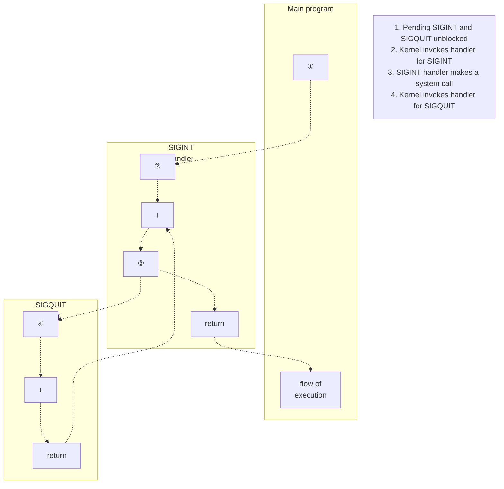

## Chapter 22
# **SIGNALS: ADVANCED FEATURES**

This chapter completes the discussion of signals that we began in Chapter 20, covering a number of more advanced topics, including the following:

-  core dump files;
-  special cases regarding signal delivery, disposition, and handling;
-  synchronous and asynchronous generation of signals;
-  when and in what order signals are delivered;
-  interruption of system calls by signal handlers, and how to automatically restart interrupted system calls;
-  realtime signals;
-  the use of sigsuspend() to set the process signal mask and wait for a signal to arrive;
-  the use of sigwaitinfo() (and sigtimedwait()) to synchronously wait for a signal to arrive;
-  the use of signalfd() to receive a signal via file descriptor; and
-  the older BSD and System V signal APIs.

## **22.1 Core Dump Files**

Certain signals cause a process to create a core dump and terminate (Table 20-1, page 396). A core dump is a file containing a memory image of the process at the time it terminated. (The term core derives from an old memory technology.) This memory image can be loaded into a debugger in order to examine the state of a program's code and data at the moment when the signal arrived.

One way of causing a program to produce a core dump is to type the quit character (usually Control-\), which causes the SIGQUIT signal to be generated:

```
$ ulimit -c unlimited Explained in main text
$ sleep 30
Type Control-\
Quit (core dumped)
$ ls -l core Shows core dump file for sleep(1)
-rw------- 1 mtk users 57344 Nov 30 13:39 core
```

In this example, the message Quit (core dumped) is printed by the shell, which detects that its child (the process running sleep) was killed by SIGQUIT and did a core dump.

The core dump file was created in the working directory of the process, with the name core. This is the default location and name for a core dump file; shortly, we explain how these defaults can be changed.

> Many implementations provide a tool (e.g., gcore on FreeBSD and Solaris) to obtain a core dump of a running process. Similar functionality is available on Linux by attaching to a running process using gdb and then using the gcore command.

#### **Circumstances in which core dump files are not produced**

A core dump is not produced in the following circumstances:

-  The process doesn't have permission to write the core dump file. This could happen because the process doesn't have write permission for the directory in which the core dump file is to be created, or because a file with the same name already exists and either is not writable or is not a regular file (e.g., it is a directory or a symbolic link).
-  A regular file with the same name already exists, and is writable, but there is more than one (hard) link to the file.
-  The directory in which the core dump file is to be created doesn't exist.
-  The process resource limit on the size of a core dump file is set to 0. This limit, RLIMIT\_CORE, is discussed in more detail in Section 36.3. In the example above, we used the ulimit command (limit in the C shell) to ensure that there is no limit on the size of core files.
-  The process resource limit on the size of a file that may be produced by the process is set to 0. We describe this limit, RLIMIT\_FSIZE, in Section 36.3.
-  The binary executable file that the process is executing doesn't have read permission enabled. This prevents users from using a core dump to obtain a copy of the code of a program that they would otherwise be unable to read.

-  The file system on which the current working directory resides is mounted read-only, is full, or has run out of i-nodes. Alternatively, the user has reached their quota limit on the file system.
-  Set-user-ID (set-group-ID) programs executed by a user other than the file owner (group owner) don't generate core dumps. This prevents malicious users from dumping the memory of a secure program and examining it for sensitive information such as passwords.

Using the PR\_SET\_DUMPABLE operation of the Linux-specific prctl() system call, we can set the dumpable flag for a process, so that when a set-user-ID (set-group-ID) program is run by a user other than the owner (group owner), a core dump can be produced. The PR\_SET\_DUMPABLE operation is available from Linux 2.4 onward. See the prctl(2) manual page for further details. In addition, since kernel 2.6.13, the /proc/sys/fs/suid\_dumpable file provides system-wide control over whether or not set-user-ID and set-group-ID processes produce core dumps. For details, see the proc(5) manual page.

Since kernel 2.6.23, the Linux-specific /proc/PID/coredump\_filter can be used on a per-process basis to determine which types of memory mappings are written to a core dump file. (We explain memory mappings in Chapter 49.) The value in this file is a mask of four bits corresponding to the four types of memory mappings: private anonymous mappings, private file mappings, shared anonymous mappings, and shared file mappings. The default value of the file provides traditional Linux behavior: only private anonymous and shared anonymous mappings are dumped. See the core(5) manual page for further details.

#### **Naming the core dump file: /proc/sys/kernel/core\_pattern**

Starting with Linux 2.6, the format string contained in the Linux-specific /proc/sys/ kernel/core\_pattern file controls the naming of all core dump files produced on the system. By default, this file contains the string core. A privileged user can define this file to include any of the format specifiers shown in Table 22-1. These format specifiers are replaced by the value indicated in the right column of the table. Additionally, the string may include slashes (/). In other words, we can control not just the name of the core file, but also the (absolute or relative) directory in which it is created. After all format specifiers have been replaced, the resulting pathname string is truncated to a maximum of 128 characters (64 characters before Linux 2.6.19).

Since kernel 2.6.19, Linux supports an additional syntax in the core\_pattern file. If this file contains a string starting with the pipe symbol (|), then the remaining characters in the file are interpreted as a program—with optional arguments that may include the % specifiers shown in Table 22-1—that is to be executed when a process dumps core. The core dump is written to the standard input of that program instead of to a file. See the core(5) manual page for further details.

> Some other UNIX implementations provide facilities similar to core\_pattern. For example, in BSD derivatives, the program name is appended to the filename, thus core.progname. Solaris provides a tool (coreadm) that allows the user to choose the filename and directory where core dump files are placed.

**Table 22-1:** Format specifiers for /proc/sys/kernel/core\_pattern

| Specifier | Replaced by                                                    |
|-----------|----------------------------------------------------------------|
| %c        | Core file size soft resource limit (bytes; since Linux 2.6.24) |
| %e        | Executable filename (without path prefix)                      |
| %g        | Real group ID of dumped process                                |
| %h        | Name of host system                                            |
| %p        | Process ID of dumped process                                   |
| %s        | Number of signal that terminated process                       |
| %t        | Time of dump, in seconds since the Epoch                       |
| %u        | Real user ID of dumped process                                 |
| %%        | A single % character                                           |

## <span id="page-29-0"></span>**22.2 Special Cases for Delivery, Disposition, and Handling**

For certain signals, special rules apply regarding delivery, disposition, and handling, as described in this section.

#### **SIGKILL and SIGSTOP**

It is not possible to change the default action for SIGKILL, which always terminates a process, and SIGSTOP, which always stops a process. Both signal() and sigaction() return an error on attempts to change the disposition of these signals. These two signals also can't be blocked. This is a deliberate design decision. Disallowing changes to the default actions of these signals means that they can always be used to kill or stop a runaway process.

#### **SIGCONT and stop signals**

As noted earlier, the SIGCONT signal is used to continue a process previously stopped by one of the stop signals (SIGSTOP, SIGTSTP, SIGTTIN, and SIGTTOU). Because of their unique purpose, in certain situations the kernel deals with these signals differently from other signals.

If a process is currently stopped, the arrival of a SIGCONT signal always causes the process to resume, even if the process is currently blocking or ignoring SIGCONT. This feature is necessary because it would otherwise be impossible to resume such stopped processes. (If the stopped process was blocking SIGCONT, and had established a handler for SIGCONT, then, after the process is resumed, the handler is invoked only when SIGCONT is later unblocked.)

> If any other signal is sent to a stopped process, the signal is not actually delivered to the process until it is resumed via receipt of a SIGCONT signal. The one exception is SIGKILL, which always kills a process—even one that is currently stopped.

Whenever SIGCONT is delivered to a process, any pending stop signals for the process are discarded (i.e., the process never sees them). Conversely, if any of the stop signals is delivered to a process, then any pending SIGCONT signal is automatically discarded. These steps are taken in order to prevent the action of a SIGCONT signal from being subsequently undone by a stop signal that was actually sent beforehand, and vice versa.

#### **Don't change the disposition of ignored terminal-generated signals**

If, at the time it was execed, a program finds that the disposition of a terminalgenerated signals has been set to SIG\_IGN (ignore), then generally the program should not attempt to change the disposition of the signal. This is not a rule enforced by the system, but rather a convention that should be followed when writing applications. We explain the reasons for this in Section 34.7.3. The signals for which this convention is relevant are SIGHUP, SIGINT, SIGQUIT, SIGTTIN, SIGTTOU, and SIGTSTP.

# **22.3 Interruptible and Uninterruptible Process Sleep States**

We need to add a proviso to our earlier statement that SIGKILL and SIGSTOP always act immediately on a process. At various times, the kernel may put a process to sleep, and two sleep states are distinguished:

-  TASK\_INTERRUPTIBLE: The process is waiting for some event. For example, it is waiting for terminal input, for data to be written to a currently empty pipe, or for the value of a System V semaphore to be increased. A process may spend an arbitrary length of time in this state. If a signal is generated for a process in this state, then the operation is interrupted and the process is woken up by the delivery of a signal. When listed by ps(1), processes in the TASK\_INTERRUPTIBLE state are marked by the letter S in the STAT (process state) field.
-  TASK\_UNINTERRUPTIBLE: The process is waiting on certain special classes of event, such as the completion of a disk I/O. If a signal is generated for a process in this state, then the signal is not delivered until the process emerges from this state. Processes in the TASK\_UNINTERRUPTIBLE state are listed by ps(1) with a D in the STAT field.

Because a process normally spends only very brief periods in the TASK\_UNINTERRUPTIBLE state, the fact that a signal is delivered only when the process leaves this state is invisible. However, in rare circumstances, a process may remain hung in this state, perhaps as the result of a hardware failure, an NFS problem, or a kernel bug. In such cases, SIGKILL won't terminate the hung process. If the underlying problem can't otherwise be resolved, then we must restart the system in order to eliminate the process.

The TASK\_INTERRUPTIBLE and TASK\_UNINTERRUPTIBLE states are present on most UNIX implementations. Starting with kernel 2.6.25, Linux adds a third state to address the hanging process problem just described:

 TASK\_KILLABLE: This state is like TASK\_UNINTERRUPTIBLE, but wakes the process if a fatal signal (i.e., one that would kill the process) is received. By converting relevant parts of the kernel code to use this state, various scenarios where a hung process requires a system restart can be avoided. Instead, the process can be killed by sending it a fatal signal. The first piece of kernel code to be converted to use TASK\_KILLABLE was NFS.

## <span id="page-31-1"></span>**22.4 Hardware-Generated Signals**

<span id="page-31-0"></span>SIGBUS, SIGFPE, SIGILL, and SIGSEGV can be generated as a consequence of a hardware exception or, less usually, by being sent by kill(). In the case of a hardware exception, SUSv3 specifies that the behavior of a process is undefined if it returns from a handler for the signal, or if it ignores or blocks the signal. The reasons for this are as follows:

-  Returning from the signal handler: Suppose that a machine-language instruction generates one of these signals, and a signal handler is consequently invoked. On normal return from the handler, the program attempts to resume execution at the point where it was interrupted. But this is the very instruction that generated the signal in the first place, so the signal is generated once more. The consequence is usually that the program goes into an infinite loop, repeatedly calling the signal handler.
-  Ignoring the signal: It makes little sense to ignore a hardware-generated signal, as it is unclear how a program should continue execution after, say, an arithmetic exception. When one of these signals is generated as a consequence of a hardware exception, Linux forces its delivery, even if the program has requested that the signal be ignored.
-  Blocking the signal: As with the previous case, it makes little sense to block a hardware-generated signal, as it is unclear how a program should then continue execution. On Linux 2.4 and earlier, the kernel simply ignores attempts to block a hardware-generated signal; the signal is delivered to the process anyway, and then either terminates the process or is caught by a signal handler, if one has been established. Starting with Linux 2.6, if the signal is blocked, then the process is always immediately killed by that signal, even if the process has installed a handler for the signal. (The rationale for the Linux 2.6 change in the treatment of blocked hardware-generated signals was that the Linux 2.4 behavior hid bugs and could cause deadlocks in threaded programs.)

The signals/demo\_SIGFPE.c program in the source code distribution for this book can be used to demonstrate the results of ignoring or blocking SIGFPE or catching the signal with a handler that performs a normal return.

The correct way to deal with hardware-generated signals is either to accept their default action (process termination) or to write handlers that don't perform a normal return. Other than returning normally, a handler can complete execution by calling \_exit() to terminate the process or by calling siglongjmp() (Section [21.2.1](#page-8-1)) to ensure that control passes to some point in the program other than the instruction that generated the signal.

## <span id="page-31-2"></span>**22.5 Synchronous and Asynchronous Signal Generation**

We have already seen that a process generally can't predict when it will receive a signal. We now need to qualify this observation by distinguishing between synchronous and asynchronous signal generation.

The model we have implicitly considered so far is asynchronous signal generation, in which the signal is sent either by another process or generated by the kernel for an event that occurs independently of the execution of the process (e.g., the user types the interrupt character or a child of this process terminates). For asynchronously generated signals, the earlier statement that a process can't predict when the signal will be delivered holds true.

However, in some cases, a signal is generated while the process itself is executing. We have already seen two examples of this:

-  The hardware-generated signals (SIGBUS, SIGFPE, SIGILL, SIGSEGV, and SIGEMT) described in Section [22.4](#page-31-1) are generated as a consequence of executing a specific machine-language instruction that results in a hardware exception.
-  A process can use raise(), kill(), or killpg() to send a signal to itself.

In these cases, the generation of the signal is synchronous—the signal is delivered immediately (unless it is blocked, but see Section [22.4](#page-31-1) for a discussion of what happens when blocking hardware-generated signals). In other words, the earlier statement about the unpredictability of the delivery of a signal doesn't apply. For synchronously generated signals, delivery is predictable and reproducible.

Note that synchronicity is an attribute of how a signal is generated, rather than of the signal itself. All signals may be generated synchronously (e.g., when a process sends itself a signal using kill()) or asynchronously (e.g., when the signal is sent by another process using kill()).

## **22.6 Timing and Order of Signal Delivery**

As the first topic of this section, we consider exactly when a pending signal is delivered. We then consider what happens if multiple pending blocked signals are simultaneously unblocked.

#### **When is a signal delivered?**

As noted in Section [22.5](#page-31-2), synchronously generated signals are delivered immediately. For example, a hardware exception triggers an immediate signal, and when a process sends itself a signal using raise(), the signal is delivered before the raise() call returns.

When a signal is generated asynchronously, there may be a (small) delay while the signal is pending between the time when it was generated and the time it is actually delivered, even if we have not blocked the signal. The reason for this is that the kernel delivers a pending signal to a process only at the next switch from kernel mode to user mode while executing that process. In practice, this means the signal is delivered at one of the following times:

-  when the process is rescheduled after it earlier timed out (i.e., at the start of a time slice); or
-  at completion of a system call (delivery of the signal may cause a blocking system call to complete prematurely).

#### **Order of delivery of multiple unblocked signals**

If a process has multiple pending signals that are unblocked using sigprocmask(), then all of these signals are immediately delivered to the process.

As currently implemented, the Linux kernel delivers the signals in ascending order. For example, if pending SIGINT (signal 2) and SIGQUIT (signal 3) signals were both simultaneously unblocked, then the SIGINT signal would be delivered before SIGQUIT, regardless of the order in which the two signals were generated.

We can't, however, rely on (standard) signals being delivered in any particular order, since SUSv3 says that the delivery order of multiple signals is implementationdefined. (This statement applies only to standard signals. As we'll see in Section [22.8,](#page-35-0) the standards governing realtime signals do provide guarantees about the order in which multiple unblocked realtime signals are delivered.)

When multiple unblocked signals are awaiting delivery, if a switch between kernel mode and user mode occurs during the execution of a signal handler, then the execution of that handler will be interrupted by the invocation of a second signal handler (and so on), as shown in [Figure 22-1.](#page-33-0)



<span id="page-33-0"></span>**Figure 22-1:** Delivery of multiple unblocked signals

# **22.7 Implementation and Portability of signal()**

In this section, we show how to implement signal() using sigaction(). The implementation is straightforward, but needs to account for the fact that, historically and across different UNIX implementations, signal() has had different semantics. In particular, early implementations of signals were unreliable, meaning that:

 On entry to a signal handler, the disposition of the signal was reset to its default. (This corresponds to the SA\_RESETHAND flag described in Section 20.13.) In order to have the signal handler invoked again for a subsequent delivery of the same signal, the programmer needed to make a call to signal() from within the handler to explicitly reestablish the handler. The problem in this scenario is that there is a small window of time between entering the signal handler and reestablishment of the handler, during which, if the signal arrives a second time, it would be processed according to its default disposition.

 Delivery of further occurrences of a signal was not blocked during execution of a signal handler. (This corresponds to the SA\_NODEFER flag described in Section 20.13.) This meant that if the signal was delivered again while the handler was still executing, then the handler would be recursively invoked. Given a sufficiently rapid stream of signals, the resulting recursive invocations of the handler could overflow the stack.

As well as being unreliable, early UNIX implementations did not provide automatic restarting of system calls (i.e., the behavior described for the SA\_RESTART flag in Section [21.5](#page-21-0)).

The 4.2BSD reliable signals implementation rectified these limitations, and several other UNIX implementations followed suit. However, the older semantics live on today in the System V implementation of signal(), and even contemporary standards such as SUSv3 and C99 leave these aspects of signal() deliberately unspecified.

Tying the above information together, we implement signal() as shown in [List](#page-34-0)[ing 22-1.](#page-34-0) By default, this implementation provides the modern signal semantics. If compiled with –DOLD\_SIGNAL, then it provides the earlier unreliable signal semantics and doesn't enable automatic restarting of system calls.

<span id="page-34-0"></span>**Listing 22-1:** An implementation of signal()

```
––––––––––––––––––––––––––––––––––––––––––––––––––––––––––signals/signal.c
#include <signal.h>
typedef void (*sighandler_t)(int);
sighandler_t
signal(int sig, sighandler_t handler)
{
 struct sigaction newDisp, prevDisp;
 newDisp.sa_handler = handler;
 sigemptyset(&newDisp.sa_mask);
#ifdef OLD_SIGNAL
 newDisp.sa_flags = SA_RESETHAND | SA_NODEFER;
#else
 newDisp.sa_flags = SA_RESTART;
#endif
 if (sigaction(sig, &newDisp, &prevDisp) == -1)
 return SIG_ERR;
 else
 return prevDisp.sa_handler;
}
––––––––––––––––––––––––––––––––––––––––––––––––––––––––––signals/signal.c
```

### **Some glibc details**

The glibc implementation of the signal() library function has changed over time. In newer versions of the library (glibc 2 and later), the modern semantics are provided by default. In older versions of the library, the earlier unreliable (System V-compatible) semantics are provided.

> The Linux kernel contains an implementation of signal() as a system call. This implementation provides the older, unreliable semantics. However, glibc bypasses this system call by providing a signal() library function that calls sigaction().

If we want to obtain unreliable signal semantics with modern versions of glibc, we can explicitly replace our calls to signal() with calls to the (nonstandard) sysv\_signal() function.

```
#define _GNU_SOURCE
#include <signal.h>
void ( *sysv_signal(int sig, void (*handler)(int)) ) (int);
              Returns previous signal disposition on success, or SIG_ERR on error
```

The sysv\_signal() function takes the same arguments as signal().

If the \_BSD\_SOURCE feature test macro is not defined when compiling a program, glibc implicitly redefines all calls to signal() to be calls to sysv\_signal(), meaning that signal() has unreliable semantics. By default, \_BSD\_SOURCE is defined, but it is disabled (unless also explicitly defined) if other feature test macros such as \_SVID\_SOURCE or \_XOPEN\_SOURCE are defined when compiling a program.

### **sigaction() is the preferred API for establishing a signal handler**

Because of the System V versus BSD (and old versus recent glibc) portability issues described above, it is good practice always to use sigaction(), rather than signal(), to establish signal handlers. We follow this practice throughout the remainder of this book. (An alternative is to write our own version of signal(), probably similar to [List](#page-34-0)[ing 22-1,](#page-34-0) specifying exactly the flags that we require, and employ that version with our applications.) Note, however, that it is portable (and shorter) to use signal() to set the disposition of a signal to SIG\_IGN or SIG\_DFL, and we'll often use signal() for that purpose.

## <span id="page-35-0"></span>**22.8 Realtime Signals**

Realtime signals were defined in POSIX.1b to remedy a number of limitations of standard signals. They have the following advantages over standard signals:

-  Realtime signals provide an increased range of signals that can be used for application-defined purposes. Only two standard signals are freely available for application-defined purposes: SIGUSR1 and SIGUSR2.
-  Realtime signals are queued. If multiple instances of a realtime signal are sent to a process, then the signal is delivered multiple times. By contrast, if we send further instances of a standard signal that is already pending for a process, that signal is delivered only once.

-  When sending a realtime signal, it is possible to specify data (an integer or pointer value) that accompanies the signal. The signal handler in the receiving process can retrieve this data.
-  The order of delivery of different realtime signals is guaranteed. If multiple different realtime signals are pending, then the lowest-numbered signal is delivered first. In other words, signals are prioritized, with lower-numbered signals having higher priority. When multiple signals of the same type are queued, they are delivered—along with their accompanying data—in the order in which they were sent.

SUSv3 requires that an implementation provide a minimum of \_POSIX\_RTSIG\_MAX (defined as 8) different realtime signals. The Linux kernel defines 32 different realtime signals, numbered from 32 to 63. The <signal.h> header file defines the constant RTSIG\_MAX to indicate the number of available realtime signals, and the constants SIGRTMIN and SIGRTMAX to indicate the lowest and highest available realtime signal numbers.

> On systems employing the LinuxThreads threading implementation, SIGRTMIN is defined as 35 (rather than 32) to allow for the fact that LinuxThreads makes internal use of the first three realtime signals. On systems employing the NPTL threading implementation, SIGRTMIN is defined as 34 to allow for the fact that NPTL makes internal use of the first two realtime signals.

Realtime signals are not individually identified by different constants in the manner of standard signals. However, an application should not hard-code integer values for them, since the range used for realtime signals varies across UNIX implementations. Instead, a realtime signal number can be referred to by adding a value to SIGRTMIN; for example, the expression (SIGRTMIN + 1) refers to the second realtime signal.

Be aware that SUSv3 doesn't require SIGRTMAX and SIGRTMIN to be simple integer values. They may be defined as functions (as they are on Linux). This means that we can't write code for the preprocessor such as the following:

```
#if SIGRTMIN+100 > SIGRTMAX /* WRONG! */
#error "Not enough realtime signals"
#endif
```

Instead, we must perform equivalent checks at run time.

#### **Limits on the number of queued realtime signals**

Queuing realtime signals (with associated data) requires that the kernel maintain data structures listing the signals queued to each process. Since these data structures consume kernel memory, the kernel places limits on the number of realtime signals that may be queued.

SUSv3 allows an implementation to place an upper limit on the number of realtime signals (of all types) that may be queued to a process, and requires that this limit be at least \_POSIX\_SIGQUEUE\_MAX (defined as 32). An implementation can define the constant SIGQUEUE\_MAX to indicate the number of realtime signals it allows to be queued. It can also make this information available through the following call:

```
lim = sysconf(_SC_SIGQUEUE_MAX);
```

On Linux, this call returns –1. The reason for this is that Linux employs a different model for limiting the number of realtime signals that may be queued to a process. In Linux versions up to and including 2.6.7, the kernel enforces a system-wide limit on the total number of realtime signals that may be queued to all processes. This limit can be viewed and (with privilege) changed via the Linux-specific /proc/sys/kernel/rtsig-max file. The default value in this file is 1024. The number of currently queued realtime signals can be found in the Linux-specific /proc/sys/kernel/rtsig-nr file.

Starting with Linux 2.6.8, this model was changed, and the aforementioned /proc interfaces were removed. Under the new model, the RLIMIT\_SIGPENDING soft resource limit defines a limit on the number of signals that can be queued to all processes owned by a particular real user ID. We describe this limit further in Section 36.3.

#### **Using realtime signals**

In order for a pair of processes to send and receive realtime signals, SUSv3 requires the following:

 The sending process sends the signal plus its accompanying data using the sigqueue() system call.

> A realtime signal can also be sent using kill(), killpg(), and raise(). However, SUSv3 leaves it as implementation-dependent whether realtime signals sent using these interfaces are queued. On Linux, these interfaces do queue realtime signals, but on many other UNIX implementations, they do not.

 The receiving process establishes a handler for the signal using a call to sigaction() that specifies the SA\_SIGINFO flag. This causes the signal handler to be invoked with additional arguments, one of which includes the data accompanying the realtime signal.

> On Linux, it is possible to queue realtime signals even if the receiving process doesn't specify the SA\_SIGINFO flag when establishing the signal handler (although it is not then possible to obtain the data associated with the signal in this case). However, SUSv3 doesn't require implementations to guarantee this behavior, so we can't portably rely on it.

## **22.8.1 Sending Realtime Signals**

<span id="page-37-0"></span>The sigqueue() system call sends the realtime signal specified by sig to the process specified by pid.

```
#define _POSIX_C_SOURCE 199309
#include <signal.h>
int sigqueue(pid_t pid, int sig, const union sigval value);
                                             Returns 0 on success, or –1 on error
```

The same permissions are required to send a signal using sigqueue() as are required with kill() (see Section 20.5). A null signal (i.e., signal 0) can be sent, with the same meaning as for kill(). (Unlike kill(), we can't use sigqueue() to send a signal to an entire process group by specifying a negative value in pid.)

```
–––––––––––––––––––––––––––––––––––––––––––––––––––––– signals/t_sigqueue.c
#define _POSIX_C_SOURCE 199309
#include <signal.h>
#include "tlpi_hdr.h"
int
main(int argc, char *argv[])
{
 int sig, numSigs, j, sigData;
 union sigval sv;
 if (argc < 4 || strcmp(argv[1], "--help") == 0)
 usageErr("%s pid sig-num data [num-sigs]\n", argv[0]);
 /* Display our PID and UID, so that they can be compared with the
 corresponding fields of the siginfo_t argument supplied to the
 handler in the receiving process */
 printf("%s: PID is %ld, UID is %ld\n", argv[0],
 (long) getpid(), (long) getuid());
 sig = getInt(argv[2], 0, "sig-num");
 sigData = getInt(argv[3], GN_ANY_BASE, "data");
 numSigs = (argc > 4) ? getInt(argv[4], GN_GT_0, "num-sigs") : 1;
 for (j = 0; j < numSigs; j++) {
 sv.sival_int = sigData + j;
 if (sigqueue(getLong(argv[1], 0, "pid"), sig, sv) == -1)
 errExit("sigqueue %d", j);
 }
 exit(EXIT_SUCCESS);
}
–––––––––––––––––––––––––––––––––––––––––––––––––––––– signals/t_sigqueue.c
```

The value argument specifies the data to accompany the signal. This argument has the following form:

```
union sigval {
 int sival_int; /* Integer value for accompanying data */
 void *sival_ptr; /* Pointer value for accompanying data */
};
```

The interpretation of this argument is application-dependent, as is the choice of whether to set the sival\_int or the sival\_ptr field of the union. The sival\_ptr field is seldom useful with sigqueue(), since a pointer value that is useful in one process is rarely meaningful in another process. However, this field is useful in other functions that employ sigval unions, as we'll see when we consider POSIX timers in Section 23.6 and POSIX message queue notification in Section 52.6.

> Several UNIX implementations, including Linux, define a sigval\_t data type as a synonym for union sigval. However, this type is not specified in SUSv3 and is not available on some implementations. Portable applications should avoid using it.

A call to sigqueue() may fail if the limit on the number of queued signals has been reached. In this case, errno is set to EAGAIN, indicating that we need to send the signal again (at some later time when some of the currently queued signals have been delivered).

An example of the use of sigqueue() is provided in [Listing 22-2](#page-38-0) (page [459\)](#page-38-0). This program takes up to four arguments, of which the first three are mandatory: a signal number, a target process ID, and an integer value to accompany the realtime signal. If more than one instance of the specified signal is to be sent, the optional fourth argument specifies the number of instances; in this case, the accompanying integer data value is incremented by one for each successive signal. We demonstrate the use of this program in Section [22.8.2.](#page-39-0)

## <span id="page-39-0"></span>**22.8.2 Handling Realtime Signals**

We can handle realtime signals just like standard signals, using a normal (singleargument) signal handler. Alternatively, we can handle a realtime signal using a three-argument signal handler established using the SA\_SIGINFO flag (Section [21.4](#page-16-0)). Here is an example of using SA\_SIGINFO to establish a handler for the sixth realtime signal:

```
struct sigaction act;
sigemptyset(&act.sa_mask);
act.sa_sigaction = handler;
act.sa_flags = SA_RESTART | SA_SIGINFO;
if (sigaction(SIGRTMIN + 5, &act, NULL) == -1)
 errExit("sigaction");
```

When we employ the SA\_SIGINFO flag, the second argument passed to the signal handler is a siginfo\_t structure that contains additional information about the realtime signal. We described this structure in detail in Section [21.4](#page-16-0). For a realtime signal, the following fields are set in the siginfo\_t structure:

-  The si\_signo field is the same value as is passed in the first argument of the signal handler.
-  The si\_code field indicates the source of the signal, and contains one of the values shown in [Table 21-2](#page-20-0) (page [441](#page-20-0)). For a realtime signal sent via sigqueue(), this field always has the value SI\_QUEUE.
-  The si\_value field contains the data specified in the value argument (the sigval union) by the process that sent the signal using sigqueue(). As noted already, the interpretation of this data is application-defined. (The si\_value field doesn't contain valid information if the signal was sent using kill().)
-  The si\_pid and si\_uid fields contain, respectively, the process ID and real user ID of the process sending the signal.

[Listing 22-3](#page-41-1) provides an example of handling realtime signals. This program catches signals and displays various fields from the siginfo\_t structure passed to the signal handler. The program takes two optional integer command-line arguments. If the first argument is supplied, the main program blocks all signals, and then sleeps for the number of seconds specified by this argument. During this time, we can queue multiple realtime signals to the process and observe what happens when the signals are unblocked. The second argument specifies the number of seconds that the signal handler should sleep before returning. Specifying a nonzero value (the default is 1 second) is useful for slowing down the program so that we can more easily see what is happening when multiple signals are handled.

We can use the program in [Listing 22-3,](#page-41-1) along with the program in [Listing 22-2](#page-38-0) (t\_sigqueue.c) to explore the behavior of realtime signals, as shown in the following shell session log:

```
$ ./catch_rtsigs 60 &
[1] 12842
$ ./catch_rtsigs: PID is 12842 Shell prompt mixed with program output
./catch_rtsigs: signals blocked - sleeping 60 seconds
Press Enter to see next shell prompt
$ ./t_sigqueue 12842 54 100 3 Send signal three times
./t_sigqueue: PID is 12843, UID is 1000
$ ./t_sigqueue 12842 43 200
./t_sigqueue: PID is 12844, UID is 1000
$ ./t_sigqueue 12842 40 300
./t_sigqueue: PID is 12845, UID is 1000
```

Eventually, the catch\_rtsigs program completes sleeping, and displays messages as the signal handler catches various signals. (We see a shell prompt mixed with the next line of the program's output because the catch\_rtsigs program is writing output from the background.) We first observe that realtime signals are delivered lowestnumbered signal first, and that the siginfo\_t structure passed to the handler includes the process ID and user ID of the process that sent the signal:

```
$ ./catch_rtsigs: sleep complete
caught signal 40
 si_signo=40, si_code=-1 (SI_QUEUE), si_value=300
 si_pid=12845, si_uid=1000
caught signal 43
 si_signo=43, si_code=-1 (SI_QUEUE), si_value=200
 si_pid=12844, si_uid=1000
```

The remaining output is produced by the three instances of the same realtime signal. Looking at the si\_value values, we can see that these signals were delivered in the order they were sent:

```
caught signal 54
 si_signo=54, si_code=-1 (SI_QUEUE), si_value=100
 si_pid=12843, si_uid=1000
caught signal 54
 si_signo=54, si_code=-1 (SI_QUEUE), si_value=101
 si_pid=12843, si_uid=1000
caught signal 54
 si_signo=54, si_code=-1 (SI_QUEUE), si_value=102
 si_pid=12843, si_uid=1000
```

We continue by using the shell kill command to send a signal to the catch\_rtsigs program. As before, we see that the siginfo\_t structure received by the handler includes the process ID and user ID of the sending process, but in this case, the si\_code value is SI\_USER:

```
Press Enter to see next shell prompt
$ echo $$ Display PID of shell
12780
$ kill -40 12842 Uses kill(2) to send a signal
$ caught signal 40
 si_signo=40, si_code=0 (SI_USER), si_value=0
 si_pid=12780, si_uid=1000 PID is that of the shell
Press Enter to see next shell prompt
$ kill 12842 Kill catch_rtsigs by sending SIGTERM
Caught 6 signals
Press Enter to see notification from shell about terminated background job
[1]+ Done ./catch_rtsigs 60
```

<span id="page-41-1"></span><span id="page-41-0"></span>**Listing 22-3:** Handling realtime signals

```
––––––––––––––––––––––––––––––––––––––––––––––––––––– signals/catch_rtsigs.c
#define _GNU_SOURCE
#include <string.h>
#include <signal.h>
#include "tlpi_hdr.h"
static volatile int handlerSleepTime;
static volatile int sigCnt = 0; /* Number of signals received */
static volatile int allDone = 0;
static void /* Handler for signals established using SA_SIGINFO */
siginfoHandler(int sig, siginfo_t *si, void *ucontext)
{
 /* UNSAFE: This handler uses non-async-signal-safe functions
 (printf()); see Section 21.1.2) */
 /* SIGINT or SIGTERM can be used to terminate program */
 if (sig == SIGINT || sig == SIGTERM) {
 allDone = 1;
 return;
 }
 sigCnt++;
 printf("caught signal %d\n", sig);
 printf(" si_signo=%d, si_code=%d (%s), ", si->si_signo, si->si_code,
 (si->si_code == SI_USER) ? "SI_USER" :
 (si->si_code == SI_QUEUE) ? "SI_QUEUE" : "other");
 printf("si_value=%d\n", si->si_value.sival_int);
 printf(" si_pid=%ld, si_uid=%ld\n", (long) si->si_pid, (long) si->si_uid);
 sleep(handlerSleepTime);
}
```

```
int
main(int argc, char *argv[])
{
 struct sigaction sa;
 int sig;
 sigset_t prevMask, blockMask;
 if (argc > 1 && strcmp(argv[1], "--help") == 0)
 usageErr("%s [block-time [handler-sleep-time]]\n", argv[0]);
 printf("%s: PID is %ld\n", argv[0], (long) getpid());
 handlerSleepTime = (argc > 2) ?
 getInt(argv[2], GN_NONNEG, "handler-sleep-time") : 1;
 /* Establish handler for most signals. During execution of the handler,
 mask all other signals to prevent handlers recursively interrupting
 each other (which would make the output hard to read). */
 sa.sa_sigaction = siginfoHandler;
 sa.sa_flags = SA_SIGINFO;
 sigfillset(&sa.sa_mask);
 for (sig = 1; sig < NSIG; sig++)
 if (sig != SIGTSTP && sig != SIGQUIT)
 sigaction(sig, &sa, NULL);
 /* Optionally block signals and sleep, allowing signals to be
 sent to us before they are unblocked and handled */
 if (argc > 1) {
 sigfillset(&blockMask);
 sigdelset(&blockMask, SIGINT);
 sigdelset(&blockMask, SIGTERM);
 if (sigprocmask(SIG_SETMASK, &blockMask, &prevMask) == -1)
 errExit("sigprocmask");
 printf("%s: signals blocked - sleeping %s seconds\n", argv[0], argv[1]);
 sleep(getInt(argv[1], GN_GT_0, "block-time"));
 printf("%s: sleep complete\n", argv[0]);
 if (sigprocmask(SIG_SETMASK, &prevMask, NULL) == -1)
 errExit("sigprocmask");
 }
 while (!allDone) /* Wait for incoming signals */
 pause();
}
–––––––––––––––––––––––––––––––––––––––––––––––––––– signals/catch_rtsigs.c
```

## <span id="page-43-1"></span>**22.9 Waiting for a Signal Using a Mask: sigsuspend()**

Before we explain what sigsuspend() does, we first describe a situation where we need to use it. Consider the following scenario that is sometimes encountered when programming with signals:

- 1. We temporarily block a signal so that the handler for the signal doesn't interrupt the execution of some critical section of code.
- 2. We unblock the signal, and then suspend execution until the signal is delivered.

In order to do this, we might try using code such as that shown in [Listing 22-4.](#page-43-0)

<span id="page-43-0"></span>**Listing 22-4:** Incorrectly unblocking and waiting for a signal

```
 sigset_t prevMask, intMask;
 struct sigaction sa;
 sigemptyset(&intMask);
 sigaddset(&intMask, SIGINT);
 sigemptyset(&sa.sa_mask);
 sa.sa_flags = 0;
 sa.sa_handler = handler;
 if (sigaction(SIGINT, &sa, NULL) == -1)
 errExit("sigaction");
 /* Block SIGINT prior to executing critical section. (At this
 point we assume that SIGINT is not already blocked.) */
 if (sigprocmask(SIG_BLOCK, &intMask, &prevMask) == -1)
 errExit("sigprocmask - SIG_BLOCK");
 /* Critical section: do some work here that must not be
 interrupted by the SIGINT handler */
 /* End of critical section - restore old mask to unblock SIGINT */
 if (sigprocmask(SIG_SETMASK, &prevMask, NULL) == -1)
 errExit("sigprocmask - SIG_SETMASK");
 /* BUG: what if SIGINT arrives now... */
 pause(); /* Wait for SIGINT */
```

There is a problem with the code in Listing 22-4. Suppose that the SIGINT signal is delivered after execution of the second sigprocmask(), but before the pause() call. (The signal might actually have been generated at any time during the execution of the critical section, and then be delivered only when it is unblocked.) Delivery of the SIGINT signal will cause the handler to be invoked, and after the handler returns and the main program resumes, the pause() call will block until a second instance of SIGINT is delivered. This defeats the purpose of the code, which was to unblock SIGINT and then wait for its first occurrence.

Even if the likelihood of SIGINT being generated between the start of the critical section (i.e., the first sigprocmask() call) and the pause() call is small, this nevertheless constitutes a bug in the above code. This time-dependent bug is an example of a race condition (Section 5.1). Normally, race conditions occur where two processes or threads share common resources. However, in this case, the main program is racing against its own signal handler.

To avoid this problem, we require a means of atomically unblocking a signal and suspending the process. That is the purpose of the sigsuspend() system call.

```
#include <signal.h>
int sigsuspend(const sigset_t *mask);
                                     (Normally) returns –1 with errno set to EINTR
```

The sigsuspend() system call replaces the process signal mask by the signal set pointed to by mask, and then suspends execution of the process until a signal is caught and its handler returns. Once the handler returns, sigsuspend() restores the process signal mask to the value it had prior to the call.

Calling sigsuspend() is equivalent to atomically performing these operations:

```
sigprocmask(SIG_SETMASK, &mask, &prevMask); /* Assign new mask */
pause();
sigprocmask(SIG_SETMASK, &prevMask, NULL); /* Restore old mask */
```

Although restoring the old signal mask (i.e., the last step in the above sequence) may at first appear inconvenient, it is essential to avoid race conditions in situations where we need to repeatedly wait for signals. In such situations, the signals must remain blocked except during the sigsuspend() calls. If we later need to unblock the signals that were blocked prior to the sigsuspend() call, we can employ a further call to sigprocmask().

When sigsuspend() is interrupted by delivery of a signal, it returns –1, with errno set to EINTR. If mask doesn't point to a valid address, sigsuspend() fails with the error EFAULT.

#### **Example program**

[Listing 22-5](#page-45-1) demonstrates the use of sigsuspend(). This program performs the following steps:

-  Display the initial value of the process signal mask using the printSigMask() function (Listing 20-4, on page 408) q.
-  Block SIGINT and SIGQUIT, and save the original process signal mask w.
-  Establish the same handler for both SIGINT and SIGQUIT e. This handler displays a message, and, if it was invoked via delivery of SIGQUIT, sets the global variable gotSigquit.

-  Loop until gotSigquit is set r. Each loop iteration performs the following steps:
  - Display the current value of the signal mask using our printSigMask() function.
  - Simulate a critical section by executing a CPU busy loop for a few seconds.
  - Display the mask of pending signals using our printPendingSigs() function (Listing 20-4).
  - Uses sigsuspend() to unblock SIGINT and SIGQUIT and wait for a signal (if one is not already pending).
-  Use sigprocmask() to restore the process signal mask to its original state t, and then display the signal mask using printSigMask() y.

<span id="page-45-1"></span><span id="page-45-0"></span>**Listing 22-5:** Using sigsuspend()

```
–––––––––––––––––––––––––––––––––––––––––––––––––––– signals/t_sigsuspend.c
  #define _GNU_SOURCE /* Get strsignal() declaration from <string.h> */
  #include <string.h>
  #include <signal.h>
  #include <time.h>
  #include "signal_functions.h" /* Declarations of printSigMask()
   and printPendingSigs() */
  #include "tlpi_hdr.h"
  static volatile sig_atomic_t gotSigquit = 0;
  static void
  handler(int sig)
  {
   printf("Caught signal %d (%s)\n", sig, strsignal(sig));
   /* UNSAFE (see Section 21.1.2) */
   if (sig == SIGQUIT)
   gotSigquit = 1;
  }
  int
  main(int argc, char *argv[])
  {
   int loopNum;
   time_t startTime;
   sigset_t origMask, blockMask;
   struct sigaction sa;
q printSigMask(stdout, "Initial signal mask is:\n");
   sigemptyset(&blockMask);
   sigaddset(&blockMask, SIGINT);
   sigaddset(&blockMask, SIGQUIT);
w if (sigprocmask(SIG_BLOCK, &blockMask, &origMask) == -1)
   errExit("sigprocmask - SIG_BLOCK");
   sigemptyset(&sa.sa_mask);
   sa.sa_flags = 0;
   sa.sa_handler = handler;
```

```
e if (sigaction(SIGINT, &sa, NULL) == -1)
   errExit("sigaction");
   if (sigaction(SIGQUIT, &sa, NULL) == -1)
   errExit("sigaction");
r for (loopNum = 1; !gotSigquit; loopNum++) {
   printf("=== LOOP %d\n", loopNum);
   /* Simulate a critical section by delaying a few seconds */
   printSigMask(stdout, "Starting critical section, signal mask is:\n");
   for (startTime = time(NULL); time(NULL) < startTime + 4; )
   continue; /* Run for a few seconds elapsed time */
   printPendingSigs(stdout,
   "Before sigsuspend() - pending signals:\n");
   if (sigsuspend(&origMask) == -1 && errno != EINTR)
   errExit("sigsuspend");
   }
t if (sigprocmask(SIG_SETMASK, &origMask, NULL) == -1)
   errExit("sigprocmask - SIG_SETMASK");
y printSigMask(stdout, "=== Exited loop\nRestored signal mask to:\n");
   /* Do other processing... */
   exit(EXIT_SUCCESS);
  }
  –––––––––––––––––––––––––––––––––––––––––––––––––––– signals/t_sigsuspend.c
```

The following shell session log shows an example of what we see when running the program in Listing 22-5:

```
$ ./t_sigsuspend
Initial signal mask is:
 <empty signal set>
=== LOOP 1
Starting critical section, signal mask is:
 2 (Interrupt)
 3 (Quit)
Type Control-C; SIGINT is generated, but remains pending because it is blocked
Before sigsuspend() - pending signals:
 2 (Interrupt)
Caught signal 2 (Interrupt) sigsuspend() is called, signals are unblocked
```

The last line of output appeared when the program called sigsuspend(), which caused SIGINT to be unblocked. At that point, the signal handler was called and displayed that line of output.

The main program continues its loop:

```
=== LOOP 2
Starting critical section, signal mask is:
 2 (Interrupt)
 3 (Quit)
Type Control-\ to generate SIGQUIT
Before sigsuspend() - pending signals:
 3 (Quit)
Caught signal 3 (Quit) sigsuspend() is called, signals are unblocked
=== Exited loop Signal handler set gotSigquit
Restored signal mask to:
 <empty signal set>
```

This time, we typed Control-\, which caused the signal handler to set the gotSigquit flag, which in turn caused the main program to terminate its loop.

# <span id="page-47-0"></span>**22.10 Synchronously Waiting for a Signal**

In Section [22.9](#page-43-1), we saw how to use a signal handler plus sigsuspend() to suspend execution of a process until a signal is delivered. However, the need to write a signal handler and to handle the complexities of asynchronous delivery makes this approach cumbersome for some applications. Instead, we can use the sigwaitinfo() system call to synchronously accept a signal.

```
#define _POSIX_C_SOURCE 199309
#include <signal.h>
int sigwaitinfo(const sigset_t *set, siginfo_t *info);
                  Returns number of delivered signal on success, or –1 on error
```

The sigwaitinfo() system call suspends execution of the process until one of the signals in the signal set pointed to by set is delivered. If one of the signals in set is already pending at the time of the call, sigwaitinfo() returns immediately. The delivered signal is removed from the process's list of pending signals, and the signal number is returned as the function result. If the info argument is not NULL, then it points to a siginfo\_t structure that is initialized to contain the same information provided to a signal handler taking a siginfo\_t argument (Section [21.4](#page-16-0)).

The delivery order and queuing characteristics of signals accepted by sigwaitinfo() are the same as for signals caught by a signal handler; that is, standard signals are not queued, and realtime signals are queued and delivered lowest signal number first.

As well as saving us the extra baggage of writing a signal handler, waiting for signals using sigwaitinfo() is somewhat faster than the combination of a signal handler plus sigsuspend() (see Exercise [22-3.\)](#page-57-0).

It usually makes sense to use sigwaitinfo() only in conjunction with blocking the set of signals for which we were interested in waiting. (We can fetch a pending signal with sigwaitinfo() even while that signal is blocked.) If we fail to do this and a signal arrives before the first, or between successive calls to sigwaitinfo(), then the signal will be handled according to its current disposition.

An example of the use of sigwaitinfo() is shown in [Listing 22-6.](#page-49-0) This program first blocks all signals, then delays for the number of seconds specified in its optional command-line argument. This allows signals to be sent to the program before sigwaitinfo(). The program then loops continuously using sigwaitinfo() to accept incoming signals, until SIGINT or SIGTERM is received.

The following shell session log demonstrates the use of the program in Listing 22-6. We run the program in the background, specifying that it should delay 60 seconds before calling sigwaitinfo(), and then send it two signals:

```
$ ./t_sigwaitinfo 60 &
./t_sigwaitinfo: PID is 3837
./t_sigwaitinfo: signals blocked
./t_sigwaitinfo: about to delay 60 seconds
[1] 3837
$ ./t_sigqueue 3837 43 100 Send signal 43
./t_sigqueue: PID is 3839, UID is 1000
$ ./t_sigqueue 3837 42 200 Send signal 42
./t_sigqueue: PID is 3840, UID is 1000
```

Eventually, the program completes its sleep interval, and the sigwaitinfo() loop accepts the queued signals. (We see a shell prompt mixed with the next line of the program's output because the t\_sigwaitinfo program is writing output from the background.) As with realtime signals caught with a handler, we see that signals are delivered lowest number first, and that the siginfo\_t structure passed to the signal handler allows us to obtain the process ID and user ID of the sending process:

```
$ ./t_sigwaitinfo: finished delay
got signal: 42
 si_signo=42, si_code=-1 (SI_QUEUE), si_value=200
 si_pid=3840, si_uid=1000
got signal: 43
 si_signo=43, si_code=-1 (SI_QUEUE), si_value=100
 si_pid=3839, si_uid=1000
```

We continue, using the shell kill command to send a signal to the process. This time, we see that the si\_code field is set to SI\_USER (instead of SI\_QUEUE):

```
Press Enter to see next shell prompt
$ echo $$ Display PID of shell
3744
$ kill -USR1 3837 Shell sends SIGUSR1 using kill()
$ got signal: 10 Delivery of SIGUSR1
 si_signo=10, si_code=0 (SI_USER), si_value=100
 si_pid=3744, si_uid=1000 3744 is PID of shell
Press Enter to see next shell prompt
$ kill %1 Terminate program with SIGTERM
$
Press Enter to see notification of background job termination
[1]+ Done ./t_sigwaitinfo 60
```

In the output for the accepted SIGUSR1 signal, we see that the si\_value field has the value 100. This is the value to which the field was initialized by the preceding signal that was sent using sigqueue(). We noted earlier that the si\_value field contains valid information only for signals sent using sigqueue().

<span id="page-49-0"></span>**Listing 22-6:** Synchronously waiting for a signal with sigwaitinfo()

––––––––––––––––––––––––––––––––––––––––––––––––––– **signals/t\_sigwaitinfo.c** #define \_GNU\_SOURCE #include <string.h> #include <signal.h> #include <time.h> #include "tlpi\_hdr.h" int main(int argc, char \*argv[]) { int sig; siginfo\_t si; sigset\_t allSigs; if (argc > 1 && strcmp(argv[1], "--help") == 0) usageErr("%s [delay-secs]\n", argv[0]); printf("%s: PID is %ld\n", argv[0], (long) getpid()); /\* Block all signals (except SIGKILL and SIGSTOP) \*/ sigfillset(&allSigs); if (sigprocmask(SIG\_SETMASK, &allSigs, NULL) == -1) errExit("sigprocmask"); printf("%s: signals blocked\n", argv[0]); if (argc > 1) { /\* Delay so that signals can be sent to us \*/ printf("%s: about to delay %s seconds\n", argv[0], argv[1]); sleep(getInt(argv[1], GN\_GT\_0, "delay-secs")); printf("%s: finished delay\n", argv[0]); } for (;;) { /\* Fetch signals until SIGINT (^C) or SIGTERM \*/ sig = sigwaitinfo(&allSigs, &si); if (sig == -1) errExit("sigwaitinfo"); if (sig == SIGINT || sig == SIGTERM) exit(EXIT\_SUCCESS); printf("got signal: %d (%s)\n", sig, strsignal(sig)); printf(" si\_signo=%d, si\_code=%d (%s), si\_value=%d\n", si.si\_signo, si.si\_code, (si.si\_code == SI\_USER) ? "SI\_USER" : (si.si\_code == SI\_QUEUE) ? "SI\_QUEUE" : "other",

si.si\_value.sival\_int);

```
 printf(" si_pid=%ld, si_uid=%ld\n",
 (long) si.si_pid, (long) si.si_uid);
 }
}
––––––––––––––––––––––––––––––––––––––––––––––––––– signals/t_sigwaitinfo.c
```

The sigtimedwait() system call is a variation on sigwaitinfo(). The only difference is that sigtimedwait() allows us to specify a time limit for waiting.

```
#define _POSIX_C_SOURCE 199309
#include <signal.h>
int sigtimedwait(const sigset_t *set, siginfo_t *info,
 const struct timespec *timeout);
                               Returns number of delivered signal on success,
                                             or –1 on error or timeout (EAGAIN)
```

The timeout argument specifies the maximum time that sigtimedwait() should wait for a signal. It is a pointer to a structure of the following type:

```
struct timespec {
 time_t tv_sec; /* Seconds ('time_t' is an integer type) */
 long tv_nsec; /* Nanoseconds */
};
```

The fields of the timespec structure are filled in to specify the maximum number of seconds and nanoseconds that sigtimedwait() should wait. Specifying both fields of the structure as 0 causes an immediate timeout—that is, a poll to check if any of the specified set of signals is pending. If the call times out without a signal being delivered, sigtimedwait() fails with the error EAGAIN.

If the timeout argument is specified as NULL, then sigtimedwait() is exactly equivalent to sigwaitinfo(). SUSv3 leaves the meaning of a NULL timeout unspecified, and some UNIX implementations instead interpret this as a poll request that returns immediately.

# **22.11 Fetching Signals via a File Descriptor**

Starting with kernel 2.6.22, Linux provides the (nonstandard) signalfd() system call, which creates a special file descriptor from which signals directed to the caller can be read. The signalfd mechanism provides an alternative to the use of sigwaitinfo() for synchronously accepting signals.

```
#include <sys/signalfd.h>
int signalfd(int fd, const sigset_t *mask, int flags);
                                Returns file descriptor on success, or –1 on error
```

The mask argument is a signal set that specifies the signals that we want to be able to read via the signalfd file descriptor. As with sigwaitinfo(), we should normally also block all of the signals in mask using sigprocmask(), so that the signals don't get handled according to their default dispositions before we have a chance to read them.

If fd is specified as –1, then signalfd() creates a new file descriptor that can be used to read the signals in mask; otherwise, it modifies the mask associated with fd, which must be a file descriptor created by a previous call to signalfd().

In the initial implementation, the flags argument was reserved for future use and had to be specified as 0. However, since Linux 2.6.27, two flags are supported:

#### SFD\_CLOEXEC

Set the close-on-exec flag (FD\_CLOEXEC) for the new file descriptor. This flag is useful for the same reasons as the open() O\_CLOEXEC flag described in Section 4.3.1.

#### SFD\_NONBLOCK

Set the O\_NONBLOCK flag on the underlying open file description, so that future reads will be nonblocking. This saves additional calls to fcntl() to achieve the same result.

Having created the file descriptor, we can then read signals from it using read(). The buffer given to read() must be large enough to hold at least one signalfd\_siginfo structure, defined as follows in <sys/signalfd.h>:

```
struct signalfd_siginfo {
 uint32_t ssi_signo; /* Signal number */
 int32_t ssi_errno; /* Error number (generally unused) */
 int32_t ssi_code; /* Signal code */
 uint32_t ssi_pid; /* Process ID of sending process */
 uint32_t ssi_uid; /* Real user ID of sender */
 int32_t ssi_fd; /* File descriptor (SIGPOLL/SIGIO) */
 uint32_t ssi_tid; /* Kernel timer ID (POSIX timers) */
 uint32_t ssi_band; /* Band event (SIGPOLL/SIGIO) */
 uint32_t ssi_tid; /* (Kernel-internal) timer ID (POSIX timers) */
 uint32_t ssi_overrun; /* Overrun count (POSIX timers) */
 uint32_t ssi_trapno; /* Trap number */
 int32_t ssi_status; /* Exit status or signal (SIGCHLD) */
 int32_t ssi_int; /* Integer sent by sigqueue() */
 uint64_t ssi_ptr; /* Pointer sent by sigqueue() */
 uint64_t ssi_utime; /* User CPU time (SIGCHLD) */
 uint64_t ssi_stime; /* System CPU time (SIGCHLD) */
 uint64_t ssi_addr; /* Address that generated signal
 (hardware-generated signals only) */
};
```

The fields in this structure return the same information as the similarly named fields in the traditional siginfo\_t structure (Section [21.4\)](#page-16-0).

Each call to read() returns as many signalfd\_siginfo structures as there are signals pending and will fit in the supplied buffer. If no signals are pending at the time of the call, then read() blocks until a signal arrives. We can also use the fcntl() F\_SETFL operation (Section 5.3) to set the O\_NONBLOCK flag for the file descriptor, so that reads are nonblocking and will fail with the error EAGAIN if no signals are pending.

When a signal is read from a signalfd file descriptor, it is consumed and ceases to be pending for the process.

<span id="page-52-0"></span>**Listing 22-7:** Using signalfd() to read signals

```
–––––––––––––––––––––––––––––––––––––––––––––––––– signals/signalfd_sigval.c
#include <sys/signalfd.h>
#include <signal.h>
#include "tlpi_hdr.h"
int
main(int argc, char *argv[])
{
 sigset_t mask;
 int sfd, j;
 struct signalfd_siginfo fdsi;
 ssize_t s;
 if (argc < 2 || strcmp(argv[1], "--help") == 0)
 usageErr("%s sig-num...\n", argv[0]);
 printf("%s: PID = %ld\n", argv[0], (long) getpid());
 sigemptyset(&mask);
 for (j = 1; j < argc; j++)
 sigaddset(&mask, atoi(argv[j]));
 if (sigprocmask(SIG_BLOCK, &mask, NULL) == -1)
 errExit("sigprocmask");
 sfd = signalfd(-1, &mask, 0);
 if (sfd == -1)
 errExit("signalfd");
 for (;;) {
 s = read(sfd, &fdsi, sizeof(struct signalfd_siginfo));
 if (s != sizeof(struct signalfd_siginfo))
 errExit("read");
 printf("%s: got signal %d", argv[0], fdsi.ssi_signo);
 if (fdsi.ssi_code == SI_QUEUE) {
 printf("; ssi_pid = %d; ", fdsi.ssi_pid);
 printf("ssi_int = %d", fdsi.ssi_int);
 }
 printf("\n");
 }
}
```

–––––––––––––––––––––––––––––––––––––––––––––––––– **signals/signalfd\_sigval.c**

A signalfd file descriptor can be monitored along with other descriptors using select(), poll(), and epoll (described in Chapter 63). Among other uses, this feature provides an alternative to the self-pipe trick described in Section 63.5.2. If signals are pending, then these techniques indicate the file descriptor as being readable.

When we no longer require a signalfd file descriptor, we should close it, in order to release the associated kernel resources.

[Listing 22-7](#page-52-0) (on page [473](#page-52-0)) demonstrates the use of signalfd(). This program creates a mask of the signal numbers specified in its command-line arguments, blocks those signals, and then creates a signalfd file descriptor to read those signals. It then loops, reading signals from the file descriptor and displaying some of the information from the returned signalfd\_siginfo structure. In the following shell session, we run the program in Listing 22-7 in the background and send it a realtime signal with accompanying data using the program in [Listing 22-2](#page-38-0) (t\_sigqueue.c):

```
$ ./signalfd_sigval 44 &
./signalfd_sigval: PID = 6267
[1] 6267
$ ./t_sigqueue 6267 44 123 Send signal 44 with data 123 to PID 6267
./t_sigqueue: PID is 6269, UID is 1000
./signalfd_sigval: got signal 44; ssi_pid=6269; ssi_int=123
$ kill %1 Kill program running in background
```

# **22.12 Interprocess Communication with Signals**

From one viewpoint, we can consider signals as a form of interprocess communication (IPC). However, signals suffer a number of limitations as an IPC mechanism. First, by comparison with other methods of IPC that we examine in later chapters, programming with signals is cumbersome and difficult. The reasons for this are as follows:

-  The asynchronous nature of signals means that we face various problems, including reentrancy requirements, race conditions, and the correct handling of global variables from signal handlers. (Most of these problems do not occur if we are using sigwaitinfo() or signalfd() to synchronously fetch signals.)
-  Standard signals are not queued. Even for realtime signals, there are upper limits on the number of signals that may be queued. This means that in order to avoid loss of information, the process receiving the signals must have a method of informing the sender that it is ready to receive another signal. The most obvious method of doing this is for the receiver to send a signal to the sender.

A further problem is that signals carry only a limited amount of information: the signal number, and in the case of realtime signals, a word (an integer or a pointer) of additional data. This low bandwidth makes signals slow by comparison with other methods of IPC such as pipes.

As a consequence of the above limitations, signals are rarely used for IPC.

## **22.13 Earlier Signal APIs (System V and BSD)**

Our discussion of signals has focused on the POSIX signal API. We now briefly look at the historical APIs provided by System V and BSD. Although all new applications should use the POSIX API, we may encounter these obsolete APIs when porting (usually older) applications from other UNIX implementations. Because Linux (like many other UNIX implementations) provides System V and BSD compatibility APIs, often all that is required to port programs using these older APIs is to recompile them on Linux.

#### **The System V signal API**

As noted earlier, one important difference in the System V signal API is that when a handler is established with signal(), we get the older, unreliable signal semantics. This means that the signal is not added to the process signal mask, the disposition of the signal is reset to the default when the handler is called, and system calls are not automatically restarted.

Below, we briefly describe the functions in the System V signal API. The manual pages provide full details. SUSv3 specifies all of these functions, but notes that the modern POSIX equivalents are preferred. SUSv4 marks these functions obsolete.

```
#define _XOPEN_SOURCE 500
#include <signal.h>
void (*sigset(int sig, void (*handler)(int)))(int);
                   On success: returns the previous disposition of sig, or SIG_HOLD
                             if sig was previously blocked; on error –1 is returned
```

To establish a signal handler with reliable semantics, System V provided the sigset() call (with a prototype similar to that of signal()). As with signal(), the handler argument for sigset() can be specified as SIG\_IGN, SIG\_DFL, or the address of a signal handler. Alternatively, it can be specified as SIG\_HOLD, to add the signal to the process signal mask while leaving the disposition of the signal unchanged.

If handler is specified as anything other than SIG\_HOLD, sig is removed from the process signal mask (i.e., if sig was blocked, it is unblocked).

```
#define _XOPEN_SOURCE 500
#include <signal.h>
int sighold(int sig);
int sigrelse(int sig);
int sigignore(int sig);
                                            All return 0 on success, or –1 on error
int sigpause(int sig);
                                           Always returns –1 with errno set to EINTR
```

The sighold() function adds a signal to the process signal mask. The sigrelse() function removes a signal from the signal mask. The sigignore() function sets a signal's disposition to ignore. The sigpause() function is similar to sigsuspend(), but removes just one signal from the process signal mask before suspending the process until the arrival of a signal.

#### **The BSD signal API**

The POSIX signal API drew heavily on the 4.2BSD API, so the BSD functions are mainly direct analogs of those in POSIX.

As with the functions in the System V signal API described above, we present the prototypes of the functions in the BSD signal API, and briefly explain the operation of each function. Once again, the manual pages provide full details.

```
#define _BSD_SOURCE
#include <signal.h>
int sigvec(int sig, struct sigvec *vec, struct sigvec *ovec);
                                             Returns 0 on success, or –1 on error
```

The sigvec() function is analogous to sigaction(). The vec and ovec arguments are pointers to structures of the following type:

```
struct sigvec {
 void (*sv_handler)();
 int sv_mask;
 int sv_flags;
};
```

The fields of the sigvec structure correspond closely with those of the sigaction structure. The first notable difference is that the sv\_mask field (the analog of sa\_mask) was an integer rather than a sigset\_t, which meant that, on 32-bit architectures, there was a maximum of 31 different signals. The other difference is the use of the SV\_INTERRUPT flag in the sv\_flags field (the analog of sa\_flags). Since system call restarting was the default on 4.2BSD, this flag was used to specify that slow system calls should be interrupted by signal handlers. (This contrasts with the POSIX API, where we must explicitly specify SA\_RESTART in order to enable restarting of system calls when establishing a signal handler with sigaction().)

```
#define _BSD_SOURCE
#include <signal.h>
int sigblock(int mask);
int sigsetmask(int mask);
                                                Both return previous signal mask
int sigpause(int sigmask);
                                          Always returns –1 with errno set to EINTR
int sigmask(sig);
                                         Returns signal mask value with bit sig set
```

The sigblock() function adds a set of signals to the process signal mask. It is analogous to the sigprocmask() SIG\_BLOCK operation. The sigsetmask() call specifies an absolute value for the signal mask. It is analogous to the sigprocmask() SIG\_SETMASK operation.

The sigpause() function is analogous to sigsuspend(). Note that this function is defined with different calling signatures in the System V and BSD APIs. The GNU C library provides the System V version by default, unless we specify the \_BSD\_SOURCE feature test macro when compiling a program.

The sigmask() macro turns a signal number into the corresponding 32-bit mask value. Such bit masks can then be ORed together to create a set of signals, as in the following:

```
sigblock(sigmask(SIGINT) | sigmask(SIGQUIT));
```

## **22.14 Summary**

Certain signals cause a process to create a core dump and terminate. This file contains information that can be used by a debugger to inspect the state of a process at the time that it terminated. By default, a core dump file is named core, but Linux provides the /proc/sys/kernel/core\_pattern file to control the naming of core dump files.

A signal may be generated asynchronously or synchronously. Asynchronous generation occurs when a signal is sent a process by the kernel or by another process. A process can't predict precisely when an asynchronously generated signal will be delivered. (We noted that asynchronous signals are normally delivered the next time the receiving process switches from kernel mode to user mode.) Synchronous generation occurs when the process itself executes code that directly generates the signal—for example, by executing an instruction that causes a hardware exception or by calling raise(). The delivery of a synchronously generated signal is precisely predictable (it occurs immediately).

Realtime signals are a POSIX addition to the original signal model, and differ from standard signals in that they are queued, have a specified delivery order, and can be sent with an accompanying piece of data. Realtime signals are designed to be used for application-defined purposes. A realtime signal is sent using the sigqueue() system call, and an additional argument (the siginfo\_t structure) is supplied to the signal handler so that it can obtain the data accompanying the signal, as well as the process ID and real user ID of the sending process.

The sigsuspend() system call allows a program to atomically modify the process signal mask and suspend execution until a signal arrives, The atomicity of sigsuspend() is essential to avoid race conditions when unblocking a signal and then suspending execution until that signal arrives.

We can use sigwaitinfo() and sigtimedwait() to synchronously wait for a signal. This saves us the work of designing and writing a signal handler, which may be unnecessary if our only aim is to wait for the delivery of a signal.

Like sigwaitinfo() and sigtimedwait(), the Linux-specific signalfd() system call can be used to synchronously wait for a signal. The distinctive feature of this interface is that signals can be read via a file descriptor. This file descriptor can also be monitored using select(), poll(), and epoll.

Although signals can be viewed as a method of IPC, many factors make them generally unsuitable for this purpose, including their asynchronous nature, the fact that they are not queued, and their low bandwidth. More usually, signals are used as a method of process synchronization and for a variety of other purposes (e.g., event notification, job control, and timer expiration).

Although the fundamental signal concepts are straightforward, our discussion has stretched over three chapters, since there were many details to cover. Signals play an important role in various parts of the system call API, and we'll revisit their use in several later chapters. In addition, various signal-related functions are specific to threads (e.g., pthread\_kill() and pthread\_sigmask()), and we defer discussion of these functions until Section 33.2.

#### **Further information**

See the sources listed in Section 20.15.

## **22.15 Exercises**

- **22-1.** Section [22.2](#page-29-0) noted that if a stopped process that has established a handler for and blocked SIGCONT is later resumed as a consequence of receiving a SIGCONT, then the handler is invoked only when SIGCONT is unblocked. Write a program to verify this. Recall that a process can be stopped by typing the terminal suspend character (usually Control-Z) and can be sent a SIGCONT signal using the command kill –CONT (or implicitly, using the shell fg command).
- **22-2.** If both a realtime and a standard signal are pending for a process, SUSv3 leaves it unspecified which is delivered first. Write a program that shows what Linux does in this case. (Have the program set up a handler for all signals, block signals for a period time so that you can send various signals to it, and then unblock all signals.)
- <span id="page-57-0"></span>**22-3.** Section [22.10](#page-47-0) stated that accepting signals using sigwaitinfo() is faster than the use of a signal handler plus sigsuspend(). The program signals/sig\_speed\_sigsuspend.c, supplied in the source code distribution for this book, uses sigsuspend() to alternately send signals back and forward between a parent and a child process. Time the operation of this program to exchange one million signals between the two processes. (The number of signals to exchange is provided as a command-line argument to the program.) Create a modified version of the program that instead uses sigwaitinfo(), and time that version. What is the speed difference between the two programs?
- **22-4.** Implement the System V functions sigset(), sighold(), sigrelse(), sigignore(), and sigpause() using the POSIX signal API.

