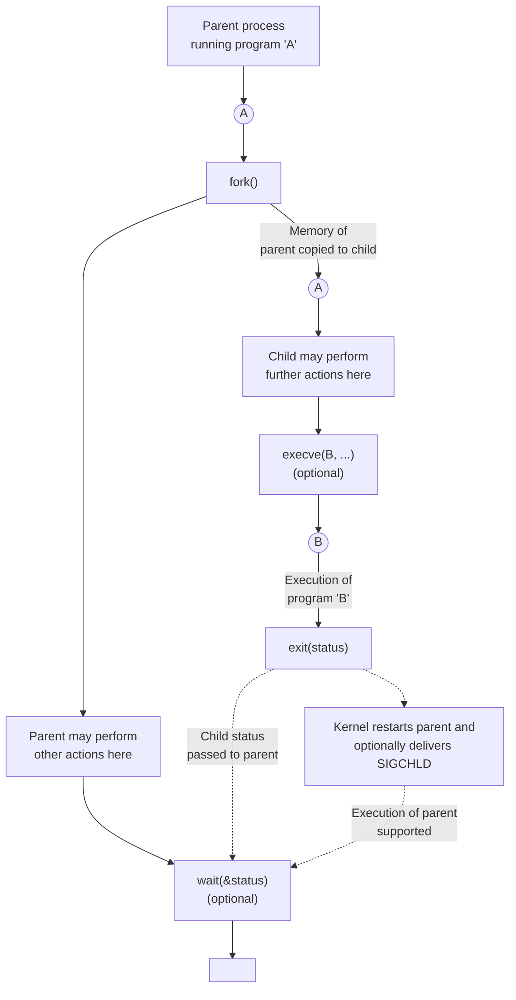
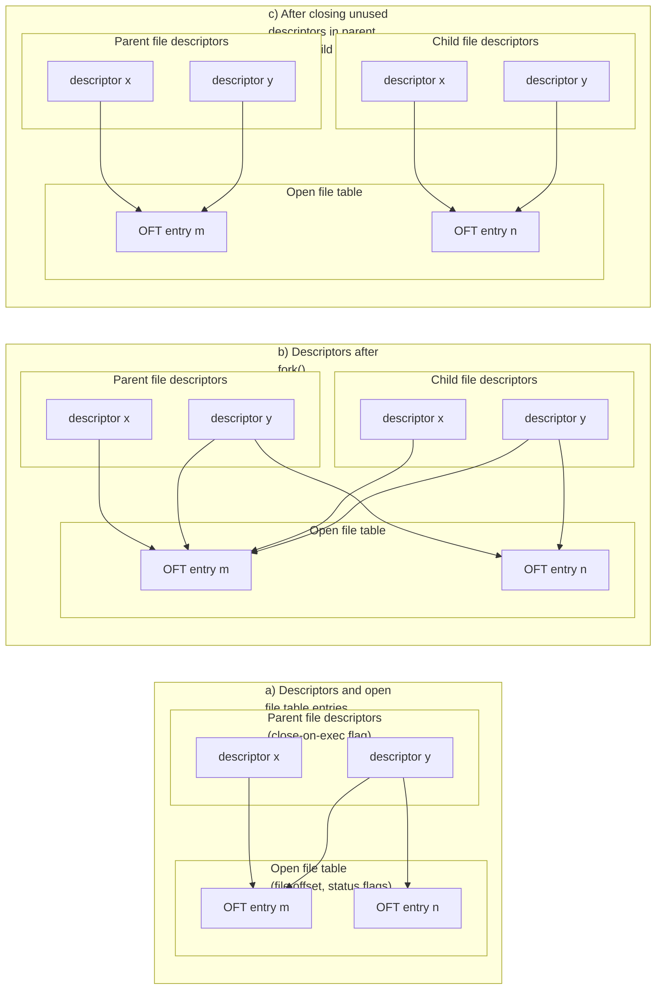
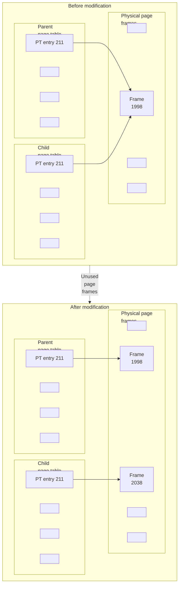

## Chapter 24
# <span id="page-0-0"></span>**PROCESS CREATION**

In this and the next three chapters, we look at how a process is created and terminates, and how a process can execute a new program. This chapter covers process creation. However, before diving into that subject, we present a short overview of the main system calls covered in these four chapters.

## **24.1 Overview of fork(), exit(), wait(), and execve()**

The principal topics of this and the next few chapters are the system calls fork(), exit(), wait(), and execve(). Each of these system calls has variants, which we'll also look at. For now, we provide an overview of these four system calls and how they are typically used together.

-  The fork() system call allows one process, the parent, to create a new process, the child. This is done by making the new child process an (almost) exact duplicate of the parent: the child obtains copies of the parent's stack, data, heap, and text segments (Section 6.3). The term fork derives from the fact that we can envisage the parent process as dividing to yield two copies of itself.
-  The exit(status) library function terminates a process, making all resources (memory, open file descriptors, and so on) used by the process available for subsequent reallocation by the kernel. The status argument is an integer that determines the termination status for the process. Using the wait() system call, the parent can retrieve this status.

The exit() library function is layered on top of the \_exit() system call. In Chapter [25](#page-18-0), we explain the difference between the two interfaces. In the meantime, we'll just note that, after a fork(), generally only one of the parent and child terminate by calling exit(); the other process should terminate using \_exit().

-  The wait(&status) system call has two purposes. First, if a child of this process has not yet terminated by calling exit(), then wait() suspends execution of the process until one of its children has terminated. Second, the termination status of the child is returned in the status argument of wait().
-  The execve(pathname, argv, envp) system call loads a new program (pathname, with argument list argv, and environment list envp) into a process's memory. The existing program text is discarded, and the stack, data, and heap segments are freshly created for the new program. This operation is often referred to as execing a new program. Later, we'll see that several library functions are layered on top of execve(), each of which provides a useful variation in the programming interface. Where we don't care about these interface variations, we follow the common convention of referring to these calls generically as exec(), but be aware that there is no system call or library function with this name.

Some other operating systems combine the functionality of fork() and exec() into a single operation—a so-called spawn—that creates a new process that then executes a specified program. By comparison, the UNIX approach is usually simpler and more elegant. Separating these two steps makes the APIs simpler (the fork() system call takes no arguments) and allows a program a great degree of flexibility in the actions it performs between the two steps. Moreover, it is often useful to perform a fork() without a following exec().

> SUSv3 specifies the optional posix\_spawn() function, which combines the effect of fork() and exec(). This function, and several related APIs specified by SUSv3, are implemented on Linux in glibc. SUSv3 specifies posix\_spawn() to permit portable applications to be written for hardware architectures that don't provide swap facilities or memory-management units (this is typical of many embedded systems). On such architectures, a traditional fork() is difficult or impossible to implement.

Figure 24-1 provides an overview of how fork(), exit(), wait(), and execve() are commonly used together. (This diagram outlines the steps taken by the shell in executing a command: the shell continuously executes a loop that reads a command, performs various processing on it, and then forks a child process to exec the command.)

The use of execve() shown in this diagram is optional. Sometimes, it is instead useful to have the child carry on executing the same program as the parent. In either case, the execution of the child is ultimately terminated by a call to exit() (or by delivery of a signal), yielding a termination status that the parent can obtain via wait().

The call to wait() is likewise optional. The parent can simply ignore its child and continue executing. However, we'll see later that the use of wait() is usually desirable, and is often employed within a handler for the SIGCHLD signal, which the kernel generates for a parent process when one of its children terminates. (By default, SIGCHLD is ignored, which is why we label it as being optionally delivered in the diagram.)



**Figure 24-1:** Overview of the use of fork(), exit(), wait(), and execve()

## <span id="page-2-0"></span>**24.2 Creating a New Process: fork()**

In many applications, creating multiple processes can be a useful way of dividing up a task. For example, a network server process may listen for incoming client requests and create a new child process to handle each request; meanwhile, the server process continues to listen for further client connections. Dividing tasks up in this way often makes application design simpler. It also permits greater concurrency (i.e., more tasks or requests can be handled simultaneously).

The fork() system call creates a new process, the child, which is an almost exact duplicate of the calling process, the parent.

```
#include <unistd.h>
pid_t fork(void);
                In parent: returns process ID of child on success, or –1 on error;
                                    in successfully created child: always returns 0
```

The key point to understanding fork() is to realize that after it has completed its work, two processes exist, and, in each process, execution continues from the point where fork() returns.

The two processes are executing the same program text, but they have separate copies of the stack, data, and heap segments. The child's stack, data, and heap segments are initially exact duplicates of the corresponding parts the parent's memory. After the fork(), each process can modify the variables in its stack, data, and heap segments without affecting the other process.

Within the code of a program, we can distinguish the two processes via the value returned from fork(). For the parent, fork() returns the process ID of the newly created child. This is useful because the parent may create, and thus need to track, several children (via wait() or one of its relatives). For the child, fork() returns 0. If necessary, the child can obtain its own process ID using getpid(), and the process ID of its parent using getppid().

If a new process can't be created, fork() returns –1. Possible reasons for failure are that the resource limit (RLIMIT\_NPROC, described in Section 36.3) on the number of processes permitted to this (real) user ID has been exceeded or that the systemwide limit on the number of processes that can be created has been reached.

The following idiom is sometimes employed when calling fork():

```
pid_t childPid; /* Used in parent after successful fork()
 to record PID of child */
switch (childPid = fork()) {
case -1: /* fork() failed */
 /* Handle error */
case 0: /* Child of successful fork() comes here */
 /* Perform actions specific to child */
default: /* Parent comes here after successful fork() */
 /* Perform actions specific to parent */
}
```

It is important to realize that after a fork(), it is indeterminate which of the two processes is next scheduled to use the CPU. In poorly written programs, this indeterminacy can lead to errors known as race conditions, which we describe further in Section [24.4](#page-12-0).

[Listing 24-1](#page-4-0) demonstrates the use of fork(). This program creates a child that modifies the copies of global and automatic variables that it inherits during the during the fork().

The use of sleep() (in the code executed by the parent) in this program permits the child to be scheduled for the CPU before the parent, so that the child can complete its work and terminate before the parent continues execution. Using sleep() in this manner is not a foolproof method of guaranteeing this result; we look at a better method in Section [24.5](#page-14-0).

When we run the program in Listing 24-1, we see the following output:

```
$ ./t_fork
PID=28557 (child) idata=333 istack=666
PID=28556 (parent) idata=111 istack=222
```

The above output demonstrates that the child process gets its own copy of the stack and data segments at the time of the fork(), and it is able to modify variables in these segments without affecting the parent.

<span id="page-4-1"></span><span id="page-4-0"></span>**Listing 24-1:** Using fork()

```
–––––––––––––––––––––––––––––––––––––––––––––––––––––––– procexec/t_fork.c
#include "tlpi_hdr.h"
static int idata = 111; /* Allocated in data segment */
int
main(int argc, char *argv[])
{
 int istack = 222; /* Allocated in stack segment */
 pid_t childPid;
 switch (childPid = fork()) {
 case -1:
 errExit("fork");
 case 0:
 idata *= 3;
 istack *= 3;
 break;
 default:
 sleep(3); /* Give child a chance to execute */
 break;
 }
 /* Both parent and child come here */
 printf("PID=%ld %s idata=%d istack=%d\n", (long) getpid(),
 (childPid == 0) ? "(child) " : "(parent)", idata, istack);
 exit(EXIT_SUCCESS);
}
–––––––––––––––––––––––––––––––––––––––––––––––––––––––– procexec/t_fork.c
```

## **24.2.1 File Sharing Between Parent and Child**

When a fork() is performed, the child receives duplicates of all of the parent's file descriptors. These duplicates are made in the manner of dup(), which means that corresponding descriptors in the parent and the child refer to the same open file description. As we saw in Section 5.4, the open file description contains the current file offset (as modified by read(), write(), and lseek()) and the open file status flags (set by open() and changed by the fcntl() F\_SETFL operation). Consequently, these attributes of an open file are shared between the parent and child. For example, if the child updates the file offset, this change is visible through the corresponding descriptor in the parent.

The fact that these attributes are shared by the parent and child after a fork() is demonstrated by the program in [Listing 24-2](#page-5-0). This program opens a temporary file using mkstemp(), and then calls fork() to create a child process. The child changes the file offset and open file status flags of the temporary file, and exits. The parent then retrieves the file offset and flags to verify that it can see the changes made by the child. When we run the program, we see the following:

```
$ ./fork_file_sharing
File offset before fork(): 0
O_APPEND flag before fork() is: off
Child has exited
File offset in parent: 1000
O_APPEND flag in parent is: on
```

For an explanation of why we cast the return value from lseek() to long long in [Listing 24-2,](#page-5-0) see Section 5.10.

<span id="page-5-0"></span>**Listing 24-2:** Sharing of file offset and open file status flags between parent and child

```
––––––––––––––––––––––––––––––––––––––––––––––– procexec/fork_file_sharing.c
#include <sys/stat.h>
#include <fcntl.h>
#include <sys/wait.h>
#include "tlpi_hdr.h"
int
main(int argc, char *argv[])
{
 int fd, flags;
   char template[] = "/tmp/testXXXXXX";
 setbuf(stdout, NULL); /* Disable buffering of stdout */
 fd = mkstemp(template);
 if (fd == -1)
 errExit("mkstemp");
 printf("File offset before fork(): %lld\n",
 (long long) lseek(fd, 0, SEEK_CUR));
 flags = fcntl(fd, F_GETFL);
 if (flags == -1)
 errExit("fcntl - F_GETFL");
 printf("O_APPEND flag before fork() is: %s\n",
 (flags & O_APPEND) ? "on" : "off");
```

```
 switch (fork()) {
 case -1:
 errExit("fork");
 case 0: /* Child: change file offset and status flags */
 if (lseek(fd, 1000, SEEK_SET) == -1)
 errExit("lseek");
 flags = fcntl(fd, F_GETFL); /* Fetch current flags */
 if (flags == -1)
 errExit("fcntl - F_GETFL");
 flags |= O_APPEND; /* Turn O_APPEND on */
 if (fcntl(fd, F_SETFL, flags) == -1)
 errExit("fcntl - F_SETFL");
 _exit(EXIT_SUCCESS);
 default: /* Parent: can see file changes made by child */
 if (wait(NULL) == -1)
 errExit("wait"); /* Wait for child exit */
 printf("Child has exited\n");
 printf("File offset in parent: %lld\n",
 (long long) lseek(fd, 0, SEEK_CUR));
 flags = fcntl(fd, F_GETFL);
 if (flags == -1)
 errExit("fcntl - F_GETFL");
 printf("O_APPEND flag in parent is: %s\n",
 (flags & O_APPEND) ? "on" : "off");
 exit(EXIT_SUCCESS);
 }
}
```

––––––––––––––––––––––––––––––––––––––––––––––– **procexec/fork\_file\_sharing.c**

Sharing of open file attributes between the parent and child processes is frequently useful. For example, if the parent and child are both writing to a file, sharing the file offset ensures that the two processes don't overwrite each other's output. It does not, however, prevent the output of the two processes from being randomly intermingled. If this is not desired, then some form of process synchronization is required. For example, the parent can use the wait() system call to pause until the child has exited. This is what the shell does, so that it prints its prompt only after the child process executing a command has terminated (unless the user explicitly runs the command in the background by placing an ampersand character at the end of the command).

If sharing of file descriptors in this manner is not required, then an application should be designed so that, after a fork(), the parent and child use different file descriptors, with each process closing unused descriptors (i.e., those used by the other process) immediately after forking. (If one of the processes performs an exec(), the close-on-exec flag described in Section [27.4](#page-62-0) can also be useful.) These steps are shown in [Figure 24-2](#page-7-0).



<span id="page-7-0"></span>**Figure 24-2:** Duplication of file descriptors during fork(), and closing of unused descriptors

## **24.2.2 Memory Semantics of fork()**

Conceptually, we can consider fork() as creating copies of the parent's text, data, heap, and stack segments. (Indeed, in some early UNIX implementations, such duplication was literally performed: a new process image was created by copying the parent's memory to swap space, and making that swapped-out image the child process while the parent kept its own memory.) However, actually performing a simple copy of the parent's virtual memory pages into the new child process would be wasteful for a number of reasons—one being that a fork() is often followed by an immediate exec(), which replaces the process's text with a new program and reinitializes the process's data, heap, and stack segments. Most modern UNIX implementations, including Linux, use two techniques to avoid such wasteful copying:

-  The kernel marks the text segment of each process as read-only, so that a process can't modify its own code. This means that the parent and child can share the same text segment. The fork() system call creates a text segment for the child by building a set of per-process page-table entries that refer to the same virtual memory page frames already used by the parent.
-  For the pages in the data, heap, and stack segments of the parent process, the kernel employs a technique known as copy-on-write. (The implementation of copy-on-write is described in [Bach, 1986] and [Bovet & Cesati, 2005].) Initially, the kernel sets things up so that the page-table entries for these segments refer to the same physical memory pages as the corresponding page-table entries in the parent, and the pages themselves are marked read-only. After the fork(), the kernel traps any attempts by either the parent or the child to modify one of these pages, and makes a duplicate copy of the about-to-be-modified page. This new page copy is assigned to the faulting process, and the corresponding pagetable entry for the child is adjusted appropriately. From this point on, the parent and child can each modify their private copies of the page, without the changes being visible to the other process. [Figure 24-3](#page-8-0) illustrates the copy-on-write technique.



<span id="page-8-0"></span>**Figure 24-3:** Page tables before and after modification of a shared copy-on-write page

#### **Controlling a process's memory footprint**

We can combine the use of fork() and wait() to control the memory footprint of a process. The process's memory footprint is the range of virtual memory pages used by the process, as affected by factors such as the adjustment of the stack as functions are called and return, calls to exec(), and, of particular interest to this discussion, modification of the heap as a consequence of calls to malloc() and free().

Suppose that we bracket a call to some function, func(), using fork() and wait() in the manner shown in [Listing 24-3](#page-9-0). After executing this code, we know that the memory footprint of the parent is unchanged from the point before func() was called, since all possible changes will have occurred in the child process. This can be useful for the following reasons:

-  If we know that func() causes memory leaks or excessive fragmentation of the heap, this technique eliminates the problem. (We might not otherwise be able to deal with these problems if we don't have access to the source code of func().)
-  Suppose that we have some algorithm that performs memory allocation while doing a tree analysis (for example, a game program that analyzes a range of possible moves and their responses). We could code such a program to make calls to free() to deallocate all of the allocated memory. However, in some cases, it is simpler to employ the technique we describe here in order to allow us to backtrack, leaving the caller (the parent) with its original memory footprint unchanged.

In the implementation shown in [Listing 24-3](#page-9-0), the result of func() must be expressed in the 8 bits that exit() passes from the terminating child to the parent calling wait(). However, we could employ a file, a pipe, or some other interprocess communication technique to allow func() to return larger results.

<span id="page-9-0"></span>**Listing 24-3:** Calling a function without changing the process's memory footprint

```
–––––––––––––––––––––––––––––––––––––––––––––––––– fromprocexec/footprint.c
 pid_t childPid;
 int status;
 childPid = fork();
 if (childPid == -1)
 errExit("fork");
 if (childPid == 0) /* Child calls func() and */
 exit(func(arg)); /* uses return value as exit status */
 /* Parent waits for child to terminate. It can determine the
 result of func() by inspecting 'status'. */
 if (wait(&status) == -1)
 errExit("wait");
–––––––––––––––––––––––––––––––––––––––––––––––––– fromprocexec/footprint.c
```

# **24.3 The vfork() System Call**

Early BSD implementations were among those in which fork() performed a literal duplication of the parent's data, heap, and stack. As noted earlier, this is wasteful, especially if the fork() is followed by an immediate exec(). For this reason, later versions of BSD introduced the vfork() system call, which was far more efficient than BSD's fork(), although it operated with slightly different (in fact, somewhat strange) semantics. Modern UNIX implementations employing copy-on-write for implementing fork() are much more efficient than older fork() implementations, thus largely eliminating the need for vfork(). Nevertheless, Linux (like many other UNIX implementations) provides a vfork() system call with BSD semantics for programs that require the fastest possible fork. However, because the unusual semantics of vfork() can lead to some subtle program bugs, its use should normally be avoided, except in the rare cases where it provides worthwhile performance gains.

Like fork(), vfork() is used by the calling process to create a new child process. However, vfork() is expressly designed to be used in programs where the child performs an immediate exec() call.

```
#include <unistd.h>
pid_t vfork(void);
                In parent: returns process ID of child on success, or –1 on error;
                                    in successfully created child: always returns 0
```

Two features distinguish the vfork() system call from fork() and make it more efficient:

-  No duplication of virtual memory pages or page tables is done for the child process. Instead, the child shares the parent's memory until it either performs a successful exec() or calls \_exit() to terminate.
-  Execution of the parent process is suspended until the child has performed an exec() or \_exit().

These points have some important implications. Since the child is using the parent's memory, any changes made by the child to the data, heap, or stack segments will be visible to the parent once it resumes. Furthermore, if the child performs a function return between the vfork() and a later exec() or \_exit(), this will also affect the parent. This is similar to the example described in Section 6.8 of trying to longjmp() into a function from which a return has already been performed. Similar chaos—typically a segmentation fault (SIGSEGV)—is likely to result.

There are a few things that the child process can do between vfork() and exec() without affecting the parent. Among these are operations on open file descriptors (but not stdio file streams). Since the file descriptor table for each process is maintained in kernel space (Section 5.4) and is duplicated during vfork(), the child process can perform file descriptor operations without affecting the parent.

> SUSv3 says that the behavior of a program is undefined if it: a) modifies any data other than a variable of type pid\_t used to store the return value of vfork(); b) returns from the function in which vfork() was called; or c) calls any other function before successfully calling \_exit() or performing an exec().

> When we look at the clone() system call in Section [28.2,](#page-85-0) we'll see that a child created using fork() or vfork() also obtains its own copies of a few other process attributes.

The semantics of vfork() mean that after the call, the child is guaranteed to be scheduled for the CPU before the parent. In Section [24.2](#page-2-0), we noted that this is not a guarantee made by fork(), after which either the parent or the child may be scheduled first.

[Listing 24-4](#page-11-0) shows the use of vfork(), demonstrating both of the semantic features that distinguish it from fork(): the child shares the parent's memory, and the parent is suspended until the child terminates or calls exec(). When we run this program, we see the following output:

```
$ ./t_vfork
Child executing Even though child slept, parent was not scheduled
Parent executing
istack=666
```

<span id="page-11-0"></span>**Listing 24-4:** Using vfork()

From the last line of output, we can see that the change made by the child to the variable istack was performed on the parent's variable.

```
–––––––––––––––––––––––––––––––––––––––––––––––––––––––– procexec/t_vfork.c
#include "tlpi_hdr.h"
int
main(int argc, char *argv[])
{
 int istack = 222;
 switch (vfork()) {
 case -1:
 errExit("vfork");
```

 case 0: /\* Child executes first, in parent's memory space \*/ sleep(3); /\* Even if we sleep for a while, parent still is not scheduled \*/

istack \*= 3; /\* This change will be seen by parent \*/

write(STDOUT\_FILENO, "Child executing\n", 16);

 \_exit(EXIT\_SUCCESS); default: /\* Parent is blocked until child exits \*/ write(STDOUT\_FILENO, "Parent executing\n", 17); printf("istack=%d\n", istack); exit(EXIT\_SUCCESS); } }

Except where speed is absolutely critical, new programs should avoid the use of vfork() in favor of fork(). This is because, when fork() is implemented using copy-onwrite semantics (as is done on most modern UNIX implementations), it approaches the speed of vfork(), and we avoid the eccentric behaviors associated with vfork() described above. (We show some speed comparisons between fork() and vfork() in Section [28.3](#page-97-0).)

–––––––––––––––––––––––––––––––––––––––––––––––––––––––– **procexec/t\_vfork.c**

SUSv3 marks vfork() as obsolete, and SUSv4 goes further, removing the specification of vfork(). SUSv3 leaves many details of the operation of vfork() unspecified, allowing the possibility that it is implemented as a call to fork(). When implemented in this manner, the BSD semantics for vfork() are not preserved. Some UNIX systems do indeed implement vfork() as a call to fork(), and Linux also did this in kernel 2.0 and earlier.

Where it is used, vfork() should generally be immediately followed by a call to exec(). If the exec() call fails, the child process should terminate using \_exit(). (The child of a vfork() should not terminate by calling exit(), since that would cause the parent's stdio buffers to be flushed and closed. We go into more detail on this point in Section [25.4.](#page-24-0))

Other uses of vfork()—in particular, those relying on its unusual semantics for memory sharing and process scheduling—are likely to render a program nonportable, especially to implementations where vfork() is implemented simply as a call to fork().

## <span id="page-12-0"></span>**24.4 Race Conditions After fork()**

After a fork(), it is indeterminate which process—the parent or the child—next has access to the CPU. (On a multiprocessor system, they may both simultaneously get access to a CPU.) Applications that implicitly or explicitly rely on a particular sequence of execution in order to achieve correct results are open to failure due to race conditions, which we described in Section 5.1. Such bugs can be hard to find, as their occurrence depends on scheduling decisions that the kernel makes according to system load.

We can use the program in Listing 24-5 to demonstrate this indeterminacy. This program loops, using fork() to create multiple children. After each fork(), both parent and child print a message containing the loop counter value and a string indicating whether the process is the parent or child. For example, if we asked the program to produce just one child, we might see the following:

```
$ ./fork_whos_on_first 1
0 parent
0 child
```

We can use this program to create a large number of children, and then analyze the output to see whether the parent or the child is the first to print its message each time. Analyzing the results when using this program to create 1 million children on a Linux/x86-32 2.2.19 system showed that the parent printed its message first in all but 332 cases (i.e., in 99.97% of the cases).

> The results from running the program in Listing 24-5 were analyzed using the script procexec/fork\_whos\_on\_first.count.awk, which is provided in the source code distribution for this book.

From these results, we may surmise that, on Linux 2.2.19, execution always continues with the parent process after a fork(). The reason that the child occasionally printed its message first was that, in 0.03% of cases, the parent's CPU time slice ran out before it had time to print its message. In other words, if this example represented a case where we were relying on the parent to always be scheduled first after fork(), then things would usually go right, but one time out of every 3000, things would go wrong. Of course, if the application expected that the parent should be able to carry out a larger piece of work before the child was scheduled, the possibility of things going wrong would be greater. Trying to debug such errors in a complex program can be difficult.

**Listing 24-5:** Parent and child race to write a message after fork()

```
–––––––––––––––––––––––––––––––––––––––––––––– procexec/fork_whos_on_first.c
#include <sys/wait.h>
#include "tlpi_hdr.h"
int
main(int argc, char *argv[])
{
 int numChildren, j;
 pid_t childPid;
 if (argc > 1 && strcmp(argv[1], "--help") == 0)
 usageErr("%s [num-children]\n", argv[0]);
 numChildren = (argc > 1) ? getInt(argv[1], GN_GT_0, "num-children") : 1;
 setbuf(stdout, NULL); /* Make stdout unbuffered */
 for (j = 0; j < numChildren; j++) {
 switch (childPid = fork()) {
 case -1:
 errExit("fork");
 case 0:
 printf("%d child\n", j);
 _exit(EXIT_SUCCESS);
 default:
 printf("%d parent\n", j);
 wait(NULL); /* Wait for child to terminate */
 break;
 }
 }
 exit(EXIT_SUCCESS);
}
–––––––––––––––––––––––––––––––––––––––––––––– procexec/fork_whos_on_first.c
```

Although Linux 2.2.19 always continues execution with the parent after a fork(), we can't rely on this being the case on other UNIX implementations, or even across different versions of the Linux kernel. During the 2.4 stable kernel series, experiments were briefly made with a "child first after fork()" patch, which completely reverses the results obtained from 2.2.19. Although this change was later dropped from the 2.4 kernel series, it was subsequently adopted in Linux 2.6. Thus, programs that assume the 2.2.19 behavior would be broken by the 2.6 kernel.

Some more recent experiments reversed the kernel developers' assessment of whether it was better to run the child or the parent first after fork(), and, since Linux 2.6.32, it is once more the parent that is, by default, run first after a fork(). This default can be changed by assigning a nonzero value to the Linux-specific /proc/sys/kernel/sched\_child\_runs\_first file.

To see the argument for the "children first after fork()" behavior, consider what happens with copy-on-write semantics when the child of a fork() performs an immediate exec(). In this case, as the parent carries on after the fork() to modify data and stack pages, the kernel duplicates the to-be-modified pages for the child. Since the child performs an exec() as soon as it is scheduled to run, this duplication is wasted. According to this argument, it is better to schedule the child first, so that by the time the parent is next scheduled, no page copying is required. Using the program in Listing 24-5 to create 1 million child processes on one busy Linux/x86-32 system running kernel 2.6.30 showed that, in 99.98% of cases, the child process displayed its message first. (The precise percentage depends on factors such as system load.) Testing this program on other UNIX implementations showed wide variation in the rules that govern which process runs first after fork().

The argument for switching back to "parent first after fork()" in Linux 2.6.32 was based on the observation that, after a fork(), the parent's state is already active in the CPU and its memory-management information is already cached in the hardware memory management unit's translation look-aside buffer (TLB). Therefore, running the parent first should result in better performance. This was informally verified by measuring the time required for kernel builds under the two behaviors.

In conclusion, it is worth noting that the performance differences between the two behaviors are rather small, and won't affect most applications.

From the preceding discussion, it is clear that we can't assume a particular order of execution for the parent and child after a fork(). If we need to guarantee a particular order, we must use some kind of synchronization technique. We describe several synchronization techniques in later chapters, including semaphores, file locks, and sending messages between processes using pipes. One other method, which we describe next, is to use signals.

## <span id="page-14-0"></span>**24.5 Avoiding Race Conditions by Synchronizing with Signals**

After a fork(), if either process needs to wait for the other to complete an action, then the active process can send a signal after completing the action; the other process waits for the signal.

[Listing 24-6](#page-15-0) demonstrates this technique. In this program, we assume that it is the parent that must wait on the child to carry out some action. The signal-related calls in the parent and child can be swapped if the child must wait on the parent. It is even possible for both parent and child to signal each other multiple times in order to coordinate their actions, although, in practice, such coordination is more likely to be done using semaphores, file locks, or message passing.

> [Stevens & Rago, 2005] suggests encapsulating such synchronization steps (block signal, send signal, catch signal) into a standard set of functions for process synchronization. The advantage of such encapsulation is that we can then later replace the use of signals by another IPC mechanism, if desired.

Note that we block the synchronization signal (SIGUSR1) before the fork() call in [Listing 24-6](#page-15-0). If the parent tried blocking the signal after the fork(), it would remain vulnerable to the very race condition we are trying to avoid. (In this program, we assume that the state of the signal mask in the child is irrelevant; if necessary, we can unblock SIGUSR1 in the child after the fork().)

The following shell session log shows what happens when we run the program in Listing 24-6:

```
$ ./fork_sig_sync
[17:59:02 5173] Child started - doing some work
[17:59:02 5172] Parent about to wait for signal
[17:59:04 5173] Child about to signal parent
[17:59:04 5172] Parent got signal
```

<span id="page-15-0"></span>**Listing 24-6:** Using signals to synchronize process actions

```
–––––––––––––––––––––––––––––––––––––––––––––––––– procexec/fork_sig_sync.c
#include <signal.h>
#include "curr_time.h" /* Declaration of currTime() */
#include "tlpi_hdr.h"
#define SYNC_SIG SIGUSR1 /* Synchronization signal */
static void /* Signal handler - does nothing but return */
handler(int sig)
{
}
int
main(int argc, char *argv[])
{
 pid_t childPid;
 sigset_t blockMask, origMask, emptyMask;
 struct sigaction sa;
 setbuf(stdout, NULL); /* Disable buffering of stdout */
 sigemptyset(&blockMask);
 sigaddset(&blockMask, SYNC_SIG); /* Block signal */
 if (sigprocmask(SIG_BLOCK, &blockMask, &origMask) == -1)
 errExit("sigprocmask");
 sigemptyset(&sa.sa_mask);
 sa.sa_flags = SA_RESTART;
 sa.sa_handler = handler;
 if (sigaction(SYNC_SIG, &sa, NULL) == -1)
 errExit("sigaction");
 switch (childPid = fork()) {
 case -1:
 errExit("fork");
 case 0: /* Child */
 /* Child does some required action here... */
```

```
 printf("[%s %ld] Child started - doing some work\n",
 currTime("%T"), (long) getpid());
 sleep(2); /* Simulate time spent doing some work */
 /* And then signals parent that it's done */
 printf("[%s %ld] Child about to signal parent\n",
 currTime("%T"), (long) getpid());
 if (kill(getppid(), SYNC_SIG) == -1)
 errExit("kill");
 /* Now child can do other things... */
 _exit(EXIT_SUCCESS);
 default: /* Parent */
 /* Parent may do some work here, and then waits for child to
 complete the required action */
 printf("[%s %ld] Parent about to wait for signal\n",
 currTime("%T"), (long) getpid());
 sigemptyset(&emptyMask);
 if (sigsuspend(&emptyMask) == -1 && errno != EINTR)
 errExit("sigsuspend");
 printf("[%s %ld] Parent got signal\n", currTime("%T"), (long) getpid());
 /* If required, return signal mask to its original state */
 if (sigprocmask(SIG_SETMASK, &origMask, NULL) == -1)
 errExit("sigprocmask");
 /* Parent carries on to do other things... */
 exit(EXIT_SUCCESS);
 }
}
–––––––––––––––––––––––––––––––––––––––––––––––––– procexec/fork_sig_sync.c
```

## **24.6 Summary**

<span id="page-16-0"></span>The fork() system call creates a new process (the child) by making an almost exact duplicate of the calling process (the parent). The vfork() system call is a more efficient version of fork(), but is usually best avoided because of its unusual semantics, whereby the child uses the parent's memory until it either performs an exec() or terminates; in the meantime, execution of the parent process is suspended.

After a fork() call, we can't rely on the order in which the parent and the child are next scheduled to use the CPU(s). Programs that make assumptions about the order of execution are susceptible to errors known as race conditions. Because the occurrence of such errors depends on external factors such as system load, they can be difficult to find and debug.

#### **Further information**

[Bach, 1986] and [Goodheart & Cox, 1994] provide details of the implementation of fork(), execve(), wait(), and exit() on UNIX systems. [Bovet & Cesati, 2005] and [Love, 2010] provide Linux-specific implementation details of process creation and termination.

## **24.7 Exercises**

**24-1.** After a program executes the following series of fork() calls, how many new processes will result (assuming that none of the calls fails)?

```
fork();
fork();
fork();
```

- **24-2.** Write a program to demonstrate that after a vfork(), the child process can close a file descriptor (e.g., descriptor 0) without affecting the corresponding file descriptor in the parent.
- **24-3.** Assuming that we can modify the program source code, how could we get a core dump of a process at a given moment in time, while letting the process continue execution?
- **24-4.** Experiment with the program in Listing 24-5 (fork\_whos\_on\_first.c) on other UNIX implementations to determine how these implementations schedule the parent and child processes after a fork().
- **24-5.** Suppose that in the program in [Listing 24-6,](#page-15-0) the child process also needed to wait on the parent to complete some actions. What changes to the program would be required in order to enforce this?

