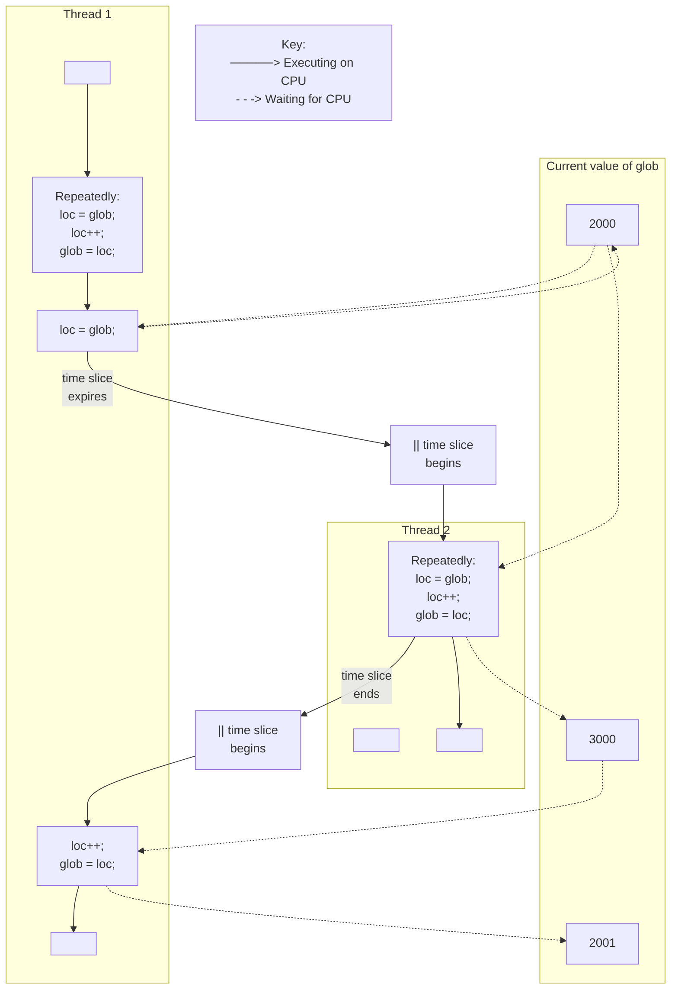

## Chapter 30
# <span id="page-14-0"></span>**THREADS: THREAD SYNCHRONIZATION**

In this chapter, we describe two tools that threads can use to synchronize their actions: mutexes and condition variables. Mutexes allow threads to synchronize their use of a shared resource, so that, for example, one thread doesn't try to access a shared variable at the same time as another thread is modifying it. Condition variables perform a complementary task: they allow threads to inform each other that a shared variable (or other shared resource) has changed state.

## **30.1 Protecting Accesses to Shared Variables: Mutexes**

<span id="page-14-1"></span>One of the principal advantages of threads is that they can share information via global variables. However, this easy sharing comes at a cost: we must take care that multiple threads do not attempt to modify the same variable at the same time, or that one thread doesn't try to read the value of a variable while another thread is modifying it. The term critical section is used to refer to a section of code that accesses a shared resource and whose execution should be atomic; that is, its execution should not be interrupted by another thread that simultaneously accesses the same shared resource.

Listing 30-1 provides a simple example of the kind of problems that can occur when shared resources are not accessed atomically. This program creates two threads, each of which executes the same function. The function executes a loop that repeatedly increments a global variable, glob, by copying glob into the local variable loc, incrementing loc, and copying loc back to glob. (Since loc is an automatic variable allocated on the per-thread stack, each thread has its own copy of this variable.) The number of iterations of the loop is determined by the command-line argument supplied to the program, or by a default value, if no argument is supplied.

**Listing 30-1:** Incorrectly incrementing a global variable from two threads

```
––––––––––––––––––––––––––––––––––––––––––––––––––––– threads/thread_incr.c
#include <pthread.h>
#include "tlpi_hdr.h"
static int glob = 0;
static void * /* Loop 'arg' times incrementing 'glob' */
threadFunc(void *arg)
{
 int loops = *((int *) arg);
 int loc, j;
 for (j = 0; j < loops; j++) {
 loc = glob;
 loc++;
 glob = loc;
 }
 return NULL;
}
int
main(int argc, char *argv[])
{
 pthread_t t1, t2;
 int loops, s;
 loops = (argc > 1) ? getInt(argv[1], GN_GT_0, "num-loops") : 10000000;
 s = pthread_create(&t1, NULL, threadFunc, &loops);
 if (s != 0)
 errExitEN(s, "pthread_create");
 s = pthread_create(&t2, NULL, threadFunc, &loops);
 if (s != 0)
 errExitEN(s, "pthread_create");
 s = pthread_join(t1, NULL);
 if (s != 0)
 errExitEN(s, "pthread_join");
 s = pthread_join(t2, NULL);
 if (s != 0)
 errExitEN(s, "pthread_join");
 printf("glob = %d\n", glob);
 exit(EXIT_SUCCESS);
}
––––––––––––––––––––––––––––––––––––––––––––––––––––– threads/thread_incr.c
```



**Figure 30-1:** Two threads incrementing a global variable without synchronization

When we run the program in Listing 30-1 specifying that each thread should increment the variable 1000 times, all seems well:

```
$ ./thread_incr 1000
glob = 2000
```

However, what has probably happened here is that the first thread completed all of its work and terminated before the second thread even started. When we ask both threads to do a lot more work, we see a rather different result:

```
$ ./thread_incr 10000000
glob = 16517656
```

At the end of this sequence, the value of glob should have been 20 million. The problem here results from execution sequences such as the following (see also Figure 30-1, above):

- 1. Thread 1 fetches the current value of glob into its local variable loc. Let's assume that the current value of glob is 2000.
- 2. The scheduler time slice for thread 1 expires, and thread 2 commences execution.
- 3. Thread 2 performs multiple loops in which it fetches the current value of glob into its local variable loc, increments loc, and assigns the result to glob. In the first of these loops, the value fetched from glob will be 2000. Let's suppose that by the time the time slice for thread 2 has expired, glob has been increased to 3000.

4. Thread 1 receives another time slice and resumes execution where it left off. Having previously (step 1) copied the value of glob (2000) into its loc, it now increments loc and assigns the result (2001) to glob. At this point, the effect of the increment operations performed by thread 2 is lost.

If we run the program in Listing 30-1 multiple times with the same command-line argument, we see that the printed value of glob fluctuates wildly:

```
$ ./thread_incr 10000000
glob = 10880429
$ ./thread_incr 10000000
glob = 13493953
```

This nondeterministic behavior is a consequence of the vagaries of the kernel's CPU scheduling decisions. In complex programs, this nondeterministic behavior means that such errors may occur only rarely, be hard to reproduce, and therefore be difficult to find.

It might seem that we could eliminate the problem by replacing the three statements inside the for loop in the threadFunc() function in Listing 30-1 with a single statement:

```
glob++; /* or: ++glob; */
```

However, on many hardware architectures (e.g., RISC architectures), the compiler would still need to convert this single statement into machine code whose steps are equivalent to the three statements inside the loop in threadFunc(). In other words, despite its simple appearance, even a C increment operator may not be atomic, and it might demonstrate the behavior that we described above.

To avoid the problems that can occur when threads try to update a shared variable, we must use a mutex (short for mutual exclusion) to ensure that only one thread at a time can access the variable. More generally, mutexes can be used to ensure atomic access to any shared resource, but protecting shared variables is the most common use.

A mutex has two states: locked and unlocked. At any moment, at most one thread may hold the lock on a mutex. Attempting to lock a mutex that is already locked either blocks or fails with an error, depending on the method used to place the lock.

When a thread locks a mutex, it becomes the owner of that mutex. Only the mutex owner can unlock the mutex. This property improves the structure of code that uses mutexes and also allows for some optimizations in the implementation of mutexes. Because of this ownership property, the terms acquire and release are sometimes used synonymously for lock and unlock.

In general, we employ a different mutex for each shared resource (which may consist of multiple related variables), and each thread employs the following protocol for accessing a resource:

-  lock the mutex for the shared resource;
-  access the shared resource; and
-  unlock the mutex.

If multiple threads try to execute this block of code (a critical section), the fact that only one thread can hold the mutex (the others remain blocked) means that only one thread at a time can enter the block, as illustrated in [Figure 30-2.](#page-18-0)

```text
Thread A                         Thread B

lock mutex M
     │
     ▼
access shared resource         lock mutex M
     │                              │
     │                            blocks
     ▼                              │
unlock mutex M ─ ─ ─ ─ ─ ─ ─ ─ ─ ─ -┼─> unblocks, lock granted
     │                              │
     │                              ▼
                           access shared resource
                                    │
                                    ▼
                             unlock mutex M
                                    │
                                    ▼
```

<span id="page-18-0"></span>**Figure 30-2:** Using a mutex to protect a critical section

Finally, note that mutex locking is advisory, rather than mandatory. By this, we mean that a thread is free to ignore the use of a mutex and simply access the corresponding shared variable(s). In order to safely handle shared variables, all threads must cooperate in their use of a mutex, abiding by the locking rules it enforces.

## **30.1.1 Statically Allocated Mutexes**

A mutex can either be allocated as a static variable or be created dynamically at run time (for example, in a block of memory allocated via malloc()). Dynamic mutex creation is somewhat more complex, and we delay discussion of it until Section [30.1.5.](#page-22-0)

A mutex is a variable of the type pthread\_mutex\_t. Before it can be used, a mutex must always be initialized. For a statically allocated mutex, we can do this by assigning it the value PTHREAD\_MUTEX\_INITIALIZER, as in the following example:

```
pthread_mutex_t mtx = PTHREAD_MUTEX_INITIALIZER;
```

According to SUSv3, applying the operations that we describe in the remainder of this section to a copy of a mutex yields results that are undefined. Mutex operations should always be performed only on the original mutex that has been statically initialized using PTHREAD\_MUTEX\_INITIALIZER or dynamically initialized using pthread\_mutex\_init() (described in Section [30.1.5\)](#page-22-0).

## **30.1.2 Locking and Unlocking a Mutex**

After initialization, a mutex is unlocked. To lock and unlock a mutex, we use the pthread\_mutex\_lock() and pthread\_mutex\_unlock() functions.

```
#include <pthread.h>
int pthread_mutex_lock(pthread_mutex_t *mutex);
int pthread_mutex_unlock(pthread_mutex_t *mutex);
                  Both return 0 on success, or a positive error number on error
```

To lock a mutex, we specify the mutex in a call to pthread\_mutex\_lock(). If the mutex is currently unlocked, this call locks the mutex and returns immediately. If the mutex is currently locked by another thread, then pthread\_mutex\_lock() blocks until the mutex is unlocked, at which point it locks the mutex and returns.

If the calling thread itself has already locked the mutex given to pthread\_mutex\_lock(), then, for the default type of mutex, one of two implementationdefined possibilities may result: the thread deadlocks, blocked trying to lock a mutex that it already owns, or the call fails, returning the error EDEADLK. On Linux, the thread deadlocks by default. (We describe some other possible behaviors when we look at mutex types in Section [30.1.7.](#page-23-0))

The pthread\_mutex\_unlock() function unlocks a mutex previously locked by the calling thread. It is an error to unlock a mutex that is not currently locked, or to unlock a mutex that is locked by another thread.

If more than one other thread is waiting to acquire the mutex unlocked by a call to pthread\_mutex\_unlock(), it is indeterminate which thread will succeed in acquiring it.

## **Example program**

[Listing 30-2](#page-19-0) is a modified version of the program in Listing 30-1. It uses a mutex to protect access to the global variable glob. When we run this program with a similar command line to that used earlier, we see that glob is always reliably incremented:

```
$ ./thread_incr_mutex 10000000
glob = 20000000
```

<span id="page-19-0"></span>**Listing 30-2:** Using a mutex to protect access to a global variable

```
–––––––––––––––––––––––––––––––––––––––––––––––– threads/thread_incr_mutex.c
#include <pthread.h>
#include "tlpi_hdr.h"
static int glob = 0;
static pthread_mutex_t mtx = PTHREAD_MUTEX_INITIALIZER;
static void * /* Loop 'arg' times incrementing 'glob' */
threadFunc(void *arg)
{
 int loops = *((int *) arg);
 int loc, j, s;
 for (j = 0; j < loops; j++) {
 s = pthread_mutex_lock(&mtx);
 if (s != 0)
 errExitEN(s, "pthread_mutex_lock");
```

```
 loc = glob;
 loc++;
 glob = loc;
 s = pthread_mutex_unlock(&mtx);
 if (s != 0)
 errExitEN(s, "pthread_mutex_unlock");
 }
 return NULL;
}
int
main(int argc, char *argv[])
{
 pthread_t t1, t2;
 int loops, s;
 loops = (argc > 1) ? getInt(argv[1], GN_GT_0, "num-loops") : 10000000;
 s = pthread_create(&t1, NULL, threadFunc, &loops);
 if (s != 0)
 errExitEN(s, "pthread_create");
 s = pthread_create(&t2, NULL, threadFunc, &loops);
 if (s != 0)
 errExitEN(s, "pthread_create");
 s = pthread_join(t1, NULL);
 if (s != 0)
 errExitEN(s, "pthread_join");
 s = pthread_join(t2, NULL);
 if (s != 0)
 errExitEN(s, "pthread_join");
 printf("glob = %d\n", glob);
 exit(EXIT_SUCCESS);
}
```

–––––––––––––––––––––––––––––––––––––––––––––––– **threads/thread\_incr\_mutex.c**

## **pthread\_mutex\_trylock() and pthread\_mutex\_timedlock()**

The Pthreads API provides two variants of the pthread\_mutex\_lock() function: pthread\_mutex\_trylock() and pthread\_mutex\_timedlock(). (See the manual pages for prototypes of these functions.)

The pthread\_mutex\_trylock() function is the same as pthread\_mutex\_lock(), except that if the mutex is currently locked, pthread\_mutex\_trylock() fails, returning the error EBUSY.

The pthread\_mutex\_timedlock() function is the same as pthread\_mutex\_lock(), except that the caller can specify an additional argument, abstime, that places a limit on the time that the thread will sleep while waiting to acquire the mutex. If the time interval specified by its abstime argument expires without the caller becoming the owner of the mutex, pthread\_mutex\_timedlock() returns the error ETIMEDOUT.

The pthread\_mutex\_trylock() and pthread\_mutex\_timedlock() functions are much less frequently used than pthread\_mutex\_lock(). In most well-designed applications, a thread should hold a mutex for only a short time, so that other threads are not prevented from executing in parallel. This guarantees that other threads that are blocked on the mutex will soon be granted a lock on the mutex. A thread that uses pthread\_mutex\_trylock() to periodically poll the mutex to see if it can be locked risks being starved of access to the mutex while other queued threads are successively granted access to the mutex via pthread\_mutex\_lock().

## **30.1.3 Performance of Mutexes**

What is the cost of using a mutex? We have shown two different versions of a program that increments a shared variable: one without mutexes (Listing 30-1) and one with mutexes ([Listing 30-2](#page-19-0)). When we run these two programs on an x86-32 system running Linux 2.6.31 (with NPTL), we find that the version without mutexes requires a total of 0.35 seconds to execute 10 million loops in each thread (and produces the wrong result), while the version with mutexes requires 3.1 seconds.

At first, this seems expensive. But, consider the main loop executed by the version that does not employ a mutex (Listing 30-1). In that version, the threadFunc() function executes a for loop that increments a loop control variable, compares that variable against another variable, performs two assignments and another increment operation, and then branches back to the top of the loop. The version that uses a mutex ([Listing 30-2](#page-19-0)) performs the same steps, and locks and unlocks the mutex each time around the loop. In other words, the cost of locking and unlocking a mutex is somewhat less than ten times the cost of the operations that we listed for the first program. This is relatively cheap. Furthermore, in the typical case, a thread would spend much more time doing other work, and perform relatively fewer mutex lock and unlock operations, so that the performance impact of using a mutex is not significant in most applications.

To put this further in perspective, running some simple test programs on the same system showed that 20 million loops locking and unlocking a file region using fcntl() (Section 55.3) require 44 seconds, and 20 million loops incrementing and decrementing a System V semaphore (Chapter 47) require 28 seconds. The problem with file locks and semaphores is that they always require a system call for the lock and unlock operations, and each system call has a small, but appreciable, cost (Section 3.1). By contrast, mutexes are implemented using atomic machine-language operations (performed on memory locations visible to all threads) and require system calls only in case of lock contention.

> On Linux, mutexes are implemented using futexes (an acronym derived from fast user space mutexes), and lock contentions are dealt with using the futex() system call. We don't describe futexes in this book (they are not intended for direct use in user-space applications), but details can be found in [Drepper, 2004 (a)], which also describes how mutexes are implemented using futexes. [Franke et al., 2002] is a (now outdated) paper written by the developers of futexes, which describes the early futex implementation and looks at the performance gains derived from futexes.

## **30.1.4 Mutex Deadlocks**

Sometimes, a thread needs to simultaneously access two or more different shared resources, each of which is governed by a separate mutex. When more than one thread is locking the same set of mutexes, deadlock situations can arise. [Figure 30-3](#page-22-1) shows an example of a deadlock in which each thread successfully locks one mutex, and then tries to lock the mutex that the other thread has already locked. Both threads will remain blocked indefinitely.

| Thread A                       | Thread B                       |
|--------------------------------|--------------------------------|
| 1. pthread_mutex_lock(mutex1); | 1. pthread_mutex_lock(mutex2); |
| 2. pthread_mutex_lock(mutex2); | 2. pthread_mutex_lock(mutex1); |
| blocks                         | blocks                         |

<span id="page-22-1"></span>**Figure 30-3:** A deadlock when two threads lock two mutexes

The simplest way to avoid such deadlocks is to define a mutex hierarchy. When threads can lock the same set of mutexes, they should always lock them in the same order. For example, in the scenario in [Figure 30-3,](#page-22-1) the deadlock could be avoided if the two threads always lock the mutexes in the order mutex1 followed by mutex2. Sometimes, there is a logically obvious hierarchy of mutexes. However, even if there isn't, it may be possible to devise an arbitrary hierarchical order that all threads should follow.

An alternative strategy that is less frequently used is "try, and then back off." In this strategy, a thread locks the first mutex using pthread\_mutex\_lock(), and then locks the remaining mutexes using pthread\_mutex\_trylock(). If any of the pthread\_mutex\_trylock() calls fails (with EBUSY), then the thread releases all mutexes, and then tries again, perhaps after a delay interval. This approach is less efficient than a lock hierarchy, since multiple iterations may be required. On the other hand, it can be more flexible, since it doesn't require a rigid mutex hierarchy. An example of this strategy is shown in [Butenhof, 1996].

## <span id="page-22-0"></span>**30.1.5 Dynamically Initializing a Mutex**

The static initializer value PTHREAD\_MUTEX\_INITIALIZER can be used only for initializing a statically allocated mutex with default attributes. In all other cases, we must dynamically initialize the mutex using pthread\_mutex\_init().

```
#include <pthread.h>
int pthread_mutex_init(pthread_mutex_t *mutex, const pthread_mutexattr_t *attr);
                      Returns 0 on success, or a positive error number on error
```

The mutex argument identifies the mutex to be initialized. The attr argument is a pointer to a pthread\_mutexattr\_t object that has previously been initialized to define the attributes for the mutex. (We say some more about mutex attributes in the next section.) If attr is specified as NULL, then the mutex is assigned various default attributes.

SUSv3 specifies that initializing an already initialized mutex results in undefined behavior; we should not do this.

Among the cases where we must use pthread\_mutex\_init() rather than a static initializer are the following:

-  The mutex was dynamically allocated on the heap. For example, suppose that we create a dynamically allocated linked list of structures, and each structure in the list includes a pthread\_mutex\_t field that holds a mutex that is used to protect access to that structure.
-  The mutex is an automatic variable allocated on the stack.
-  We want to initialize a statically allocated mutex with attributes other than the defaults.

When an automatically or dynamically allocated mutex is no longer required, it should be destroyed using pthread\_mutex\_destroy(). (It is not necessary to call pthread\_mutex\_destroy() on a mutex that was statically initialized using PTHREAD\_MUTEX\_INITIALIZER.)

```
#include <pthread.h>
int pthread_mutex_destroy(pthread_mutex_t *mutex);
                      Returns 0 on success, or a positive error number on error
```

It is safe to destroy a mutex only when it is unlocked, and no thread will subsequently try to lock it. If the mutex resides in a region of dynamically allocated memory, then it should be destroyed before freeing that memory region. An automatically allocated mutex should be destroyed before its host function returns.

A mutex that has been destroyed with pthread\_mutex\_destroy() can subsequently be reinitialized by pthread\_mutex\_init().

## **30.1.6 Mutex Attributes**

As noted earlier, the pthread\_mutex\_init() attr argument can be used to specify a pthread\_mutexattr\_t object that defines the attributes of a mutex. Various Pthreads functions can be used to initialize and retrieve the attributes in a pthread\_mutexattr\_t object. We won't go into all of the details of mutex attributes or show the prototypes of the various functions that can be used to initialize the attributes in a pthread\_mutexattr\_t object. However, we'll describe one of the attributes that can be set for a mutex: its type.

## <span id="page-23-0"></span>**30.1.7 Mutex Types**

In the preceding pages, we made a number of statements about the behavior of mutexes:

-  A single thread may not lock the same mutex twice.
-  A thread may not unlock a mutex that it doesn't currently own (i.e., that it did not lock).
-  A thread may not unlock a mutex that is not currently locked.

Precisely what happens in each of these cases depends on the type of the mutex. SUSv3 defines the following mutex types:

#### PTHREAD\_MUTEX\_NORMAL

(Self-)deadlock detection is not provided for this type of mutex. If a thread tries to lock a mutex that it has already locked, then deadlock results. Unlocking a mutex that is not locked or that is locked by another thread produces undefined results. (On Linux, both of these operations succeed for this mutex type.)

#### PTHREAD\_MUTEX\_ERRORCHECK

Error checking is performed on all operations. All three of the above scenarios cause the relevant Pthreads function to return an error. This type of mutex is typically slower than a normal mutex, but can be useful as a debugging tool to discover where an application is violating the rules about how a mutex should be used.

#### PTHREAD\_MUTEX\_RECURSIVE

A recursive mutex maintains the concept of a lock count. When a thread first acquires the mutex, the lock count is set to 1. Each subsequent lock operation by the same thread increments the lock count, and each unlock operation decrements the count. The mutex is released (i.e., made available for other threads to acquire) only when the lock count falls to 0. Unlocking an unlocked mutex fails, as does unlocking a mutex that is currently locked by another thread.

The Linux threading implementation provides nonstandard static initializers for each of the above mutex types (e.g., PTHREAD\_RECURSIVE\_MUTEX\_INITIALIZER\_NP), so that the use of pthread\_mutex\_init() is not required to initialize these mutex types for statically allocated mutexes. However, portable applications should avoid the use of these initializers.

In addition to the above mutex types, SUSv3 defines the PTHREAD\_MUTEX\_DEFAULT type, which is the default type of mutex if we use PTHREAD\_MUTEX\_INITIALIZER or specify attr as NULL in a call to pthread\_mutex\_init(). The behavior of this mutex type is deliberately undefined in all three of the scenarios described at the start of this section, which allows maximum flexibility for efficient implementation of mutexes. On Linux, a PTHREAD\_MUTEX\_DEFAULT mutex behaves like a PTHREAD\_MUTEX\_NORMAL mutex.

The code shown in [Listing 30-3](#page-24-0) demonstrates how to set the type of a mutex, in this case to create an error-checking mutex.

#### <span id="page-24-0"></span>**Listing 30-3:** Setting the mutex type

```
 pthread_mutex_t mtx;
 pthread_mutexattr_t mtxAttr;
 int s, type;
 s = pthread_mutexattr_init(&mtxAttr);
 if (s != 0)
 errExitEN(s, "pthread_mutexattr_init");
```

```
 s = pthread_mutexattr_settype(&mtxAttr, PTHREAD_MUTEX_ERRORCHECK);
 if (s != 0)
 errExitEN(s, "pthread_mutexattr_settype");
 s = pthread_mutex_init(mtx, &mtxAttr);
 if (s != 0)
 errExitEN(s, "pthread_mutex_init");
 s = pthread_mutexattr_destroy(&mtxAttr); /* No longer needed */
 if (s != 0)
 errExitEN(s, "pthread_mutexattr_destroy");
```

# **30.2 Signaling Changes of State: Condition Variables**

A mutex prevents multiple threads from accessing a shared variable at the same time. A condition variable allows one thread to inform other threads about changes in the state of a shared variable (or other shared resource) and allows the other threads to wait (block) for such notification.

A simple example that doesn't use condition variables serves to demonstrate why they are useful. Suppose that we have a number of threads that produce some "result units" that are consumed by the main thread, and that we use a mutex-protected variable, avail, to represent the number of produced units awaiting consumption:

```
static pthread_mutex_t mtx = PTHREAD_MUTEX_INITIALIZER;
static int avail = 0;
```

The code segments shown in this section can be found in the file threads/ prod\_no\_condvar.c in the source code distribution for this book.

In the producer threads, we would have code such as the following:

```
/* Code to produce a unit omitted */
s = pthread_mutex_lock(&mtx);
if (s != 0)
 errExitEN(s, "pthread_mutex_lock");
avail++; /* Let consumer know another unit is available */
s = pthread_mutex_unlock(&mtx);
if (s != 0)
 errExitEN(s, "pthread_mutex_unlock");
```

And in the main (consumer) thread, we could employ the following code:

```
for (;;) {
 s = pthread_mutex_lock(&mtx);
 if (s != 0)
 errExitEN(s, "pthread_mutex_lock");
```

```
 while (avail > 0) { /* Consume all available units */
 /* Do something with produced unit */
 avail--;
 }
 s = pthread_mutex_unlock(&mtx);
 if (s != 0)
 errExitEN(s, "pthread_mutex_unlock");
}
```

The above code works, but it wastes CPU time, because the main thread continually loops, checking the state of the variable avail. A condition variable remedies this problem. It allows a thread to sleep (wait) until another thread notifies (signals) it that it must do something (i.e., that some "condition" has arisen that the sleeper must now respond to).

A condition variable is always used in conjunction with a mutex. The mutex provides mutual exclusion for accessing the shared variable, while the condition variable is used to signal changes in the variable's state. (The use of the term signal here has nothing to do with the signals described in Chapters 20 to 22; rather, it is used in the sense of indicate.)

## **30.2.1 Statically Allocated Condition Variables**

As with mutexes, condition variables can be allocated statically or dynamically. We defer discussion of dynamically allocated condition variables until Section [30.2.5,](#page-34-0) and consider statically allocated condition variables here.

A condition variable has the type pthread\_cond\_t. As with a mutex, a condition variable must be initialized before use. For a statically allocated condition variable, this is done by assigning it the value PTHREAD\_COND\_INITIALIZER, as in the following example:

```
pthread_cond_t cond = PTHREAD_COND_INITIALIZER;
```

According to SUSv3, applying the operations that we describe in the remainder of this section to a copy of a condition variable yields results that are undefined. Operations should always be performed only on the original condition variable that has been statically initialized using PTHREAD\_COND\_INITIALIZER or dynamically initialized using pthread\_cond\_init() (described in Section [30.2.5](#page-34-0)).

## **30.2.2 Signaling and Waiting on Condition Variables**

The principal condition variable operations are signal and wait. The signal operation is a notification to one or more waiting threads that a shared variable's state has changed. The wait operation is the means of blocking until such a notification is received.

The pthread\_cond\_signal() and pthread\_cond\_broadcast() functions both signal the condition variable specified by cond. The pthread\_cond\_wait() function blocks a thread until the condition variable cond is signaled.

```
#include <pthread.h>
int pthread_cond_signal(pthread_cond_t *cond);
int pthread_cond_broadcast(pthread_cond_t *cond);
int pthread_cond_wait(pthread_cond_t *cond, pthread_mutex_t *mutex);
                    All return 0 on success, or a positive error number on error
```

The difference between pthread\_cond\_signal() and pthread\_cond\_broadcast() lies in what happens if multiple threads are blocked in pthread\_cond\_wait(). With pthread\_cond\_signal(), we are simply guaranteed that at least one of the blocked threads is woken up; with pthread\_cond\_broadcast(), all blocked threads are woken up.

Using pthread\_cond\_broadcast() always yields correct results (since all threads should be programmed to handle redundant and spurious wake-ups), but pthread\_cond\_signal() can be more efficient. However, pthread\_cond\_signal() should be used only if just one of the waiting threads needs to be woken up to handle the change in state of the shared variable, and it doesn't matter which one of the waiting threads is woken up. This scenario typically applies when all of the waiting threads are designed to perform the exactly same task. Given these assumptions, pthread\_cond\_signal() can be more efficient than pthread\_cond\_broadcast(), because it avoids the following possibility:

- 1. All waiting threads are awoken.
- 2. One thread is scheduled first. This thread checks the state of the shared variable(s) (under protection of the associated mutex) and sees that there is work to be done. The thread performs the required work, changes the state of the shared variable(s) to indicate that the work has been done, and unlocks the associated mutex.
- 3. Each of the remaining threads in turn locks the mutex and tests the state of the shared variable. However, because of the change made by the first thread, these threads see that there is no work to be done, and so unlock the mutex and go back to sleep (i.e., call pthread\_cond\_wait() once more).

By contrast, pthread\_cond\_broadcast() handles the case where the waiting threads are designed to perform different tasks (in which case they probably have different predicates associated with the condition variable).

A condition variable holds no state information. It is simply a mechanism for communicating information about the application's state. If no thread is waiting on the condition variable at the time that it is signaled, then the signal is lost. A thread that later waits on the condition variable will unblock only when the variable is signaled once more.

The pthread\_cond\_timedwait() function is the same as pthread\_cond\_wait(), except that the abstime argument specifies an upper limit on the time that the thread will sleep while waiting for the condition variable to be signaled.

```
#include <pthread.h>
int pthread_cond_timedwait(pthread_cond_t *cond, pthread_mutex_t *mutex,
 const struct timespec *abstime);
                   Returns 0 on success, or a positive error number on error
```

The abstime argument is a timespec structure (Section 23.4.2) specifying an absolute time expressed as seconds and nanoseconds since the Epoch (Section 10.1). If the time interval specified by abstime expires without the condition variable being signaled, then pthread\_cond\_timedwait() returns the error ETIMEDOUT.

### **Using a condition variable in the producer-consumer example**

Let's revise our previous example to use a condition variable. The declarations of our global variable and associated mutex and condition variable are as follows:

```
static pthread_mutex_t mtx = PTHREAD_MUTEX_INITIALIZER;
static pthread_cond_t cond = PTHREAD_COND_INITIALIZER;
static int avail = 0;
```

The code segments shown in this section can be found in the file threads/ prod\_condvar.c in the source code distribution for this book.

The code in the producer threads is the same as before, except that we add a call to pthread\_cond\_signal():

```
s = pthread_mutex_lock(&mtx);
if (s != 0)
 errExitEN(s, "pthread_mutex_lock");
avail++; /* Let consumer know another unit is available */
s = pthread_mutex_unlock(&mtx);
if (s != 0)
 errExitEN(s, "pthread_mutex_unlock");
s = pthread_cond_signal(&cond); /* Wake sleeping consumer */
if (s != 0)
 errExitEN(s, "pthread_cond_signal");
```

Before considering the code of the consumer, we need to explain pthread\_cond\_wait() in greater detail. We noted earlier that a condition variable always has an associated mutex. Both of these objects are passed as arguments to pthread\_cond\_wait(), which performs the following steps:

-  unlock the mutex specified by mutex;
-  block the calling thread until another thread signals the condition variable cond; and
-  relock mutex.

The pthread\_cond\_wait() function is designed to perform these steps because, normally, we access a shared variable in the following manner:

```
s = pthread_mutex_lock(&mtx);
if (s != 0)
 errExitEN(s, "pthread_mutex_lock");
while (/* Check that shared variable is not in state we want */)
 pthread_cond_wait(&cond, &mtx);
/* Now shared variable is in desired state; do some work */
s = pthread_mutex_unlock(&mtx);
if (s != 0)
 errExitEN(s, "pthread_mutex_unlock");
```

(We explain why the pthread\_cond\_wait() call is placed within a while loop rather than an if statement in the next section.)

In the above code, both accesses to the shared variable must be mutex-protected for the reasons that we explained earlier. In other words, there is a natural association of a mutex with a condition variable:

- 1. The thread locks the mutex in preparation for checking the state of the shared variable.
- 2. The state of the shared variable is checked.
- 3. If the shared variable is not in the desired state, then the thread must unlock the mutex (so that other threads can access the shared variable) before it goes to sleep on the condition variable.
- 4. When the thread is reawakened because the condition variable has been signaled, the mutex must once more be locked, since, typically, the thread then immediately accesses the shared variable.

The pthread\_cond\_wait() function automatically performs the mutex unlocking and locking required in the last two of these steps. In the third step, releasing the mutex and blocking on the condition variable are performed atomically. In other words, it is not possible for some other thread to acquire the mutex and signal the condition variable before the thread calling pthread\_cond\_wait() has blocked on the condition variable.

> There is a corollary to the observation that there is a natural relationship between a condition variable and a mutex: all threads that concurrently wait on a particular condition variable must specify the same mutex in their pthread\_cond\_wait() (or pthread\_cond\_timedwait()) calls. In effect, a pthread\_cond\_wait() call dynamically binds a condition variable to a unique mutex for the duration of the call. SUSv3 notes that the result of using more than one mutex for concurrent pthread\_cond\_wait() calls on the same condition variable is undefined.

Putting the above details together, we can now modify the main (consumer) thread to use pthread\_cond\_wait(), as follows:

```
for (;;) {
 s = pthread_mutex_lock(&mtx);
 if (s != 0)
 errExitEN(s, "pthread_mutex_lock");
 while (avail == 0) { /* Wait for something to consume */
 s = pthread_cond_wait(&cond, &mtx);
 if (s != 0)
 errExitEN(s, "pthread_cond_wait");
 }
 while (avail > 0) { /* Consume all available units */
 /* Do something with produced unit */
 avail--;
 }
 s = pthread_mutex_unlock(&mtx);
   if (s != 0)
 errExitEN(s, "pthread_mutex_unlock");
   /* Perhaps do other work here that doesn't require mutex lock */
}
```

We conclude with one final observation about the use of pthread\_cond\_signal() (and pthread\_cond\_broadcast()). In the producer code shown earlier, we called pthread\_mutex\_unlock(), and then called pthread\_cond\_signal(); that is, we first unlocked the mutex associated with the shared variable, and then signaled the corresponding condition variable. We could have reversed these two steps; SUSv3 permits them to be done in either order.

> [Butenhof, 1996] points out that, on some implementations, unlocking the mutex and then signaling the condition variable may yield better performance than performing these steps in the reverse sequence. If the mutex is unlocked only after the condition variable is signaled, the thread performing pthread\_cond\_wait() may wake up while the mutex is still locked, and then immediately go back to sleep again when it finds that the mutex is locked. This results in two superfluous context switches. Some implementations eliminate this problem by employing a technique called wait morphing, which moves the signaled thread from the condition variable wait queue to the mutex wait queue without performing a context switch if the mutex is locked.

## **30.2.3 Testing a Condition Variable's Predicate**

<span id="page-30-0"></span>Each condition variable has an associated predicate involving one or more shared variables. For example, in the code segment in the preceding section, the predicate associated with cond is (avail == 0). This code segment demonstrates a general design principle: a pthread\_cond\_wait() call must be governed by a while loop rather than an if statement. This is so because, on return from pthread\_cond\_wait(), there are no guarantees about the state of the predicate; therefore, we should immediately recheck the predicate and resume sleeping if it is not in the desired state.

We can't make any assumptions about the state of the predicate upon return from pthread\_cond\_wait(), for the following reasons:

-  Other threads may be woken up first. Perhaps several threads were waiting to acquire the mutex associated with the condition variable. Even if the thread that signaled the mutex set the predicate to the desired state, it is still possible that another thread might acquire the mutex first and change the state of the associated shared variable(s), and thus the state of the predicate.
-  Designing for "loose" predicates may be simpler. Sometimes, it is easier to design applications based on condition variables that indicate possibility rather than certainty. In other words, signaling a condition variable would mean "there may be something" for the signaled thread to do, rather than "there is something" to do. Using this approach, the condition variable can be signaled based on approximations of the predicate's state, and the signaled thread can ascertain if there really is something to do by rechecking the predicate.
-  Spurious wake-ups can occur. On some implementations, a thread waiting on a condition variable may be woken up even though no other thread actually signaled the condition variable. Such spurious wake-ups are a (rare) consequence of the techniques required for efficient implementation on some multiprocessor systems, and are explicitly permitted by SUSv3.

## **30.2.4 Example Program: Joining Any Terminated Thread**

<span id="page-31-0"></span>We noted earlier that pthread\_join() can be used to join with only a specific thread. It provides no mechanism for joining with any terminated thread. We now show how a condition variable can be used to circumvent this restriction.

The program in [Listing 30-4](#page-32-0) creates one thread for each of its command-line arguments. Each thread sleeps for the number of seconds specified in the corresponding command-line argument and then terminates. The sleep interval is our means of simulating the idea of a thread that does work for a period of time.

The program maintains a set of global variables recording information about all of the threads that have been created. For each thread, an element in the global thread array records the ID of the thread (the tid field) and its current state (the state field). The state field has one of the following values: TS\_ALIVE, meaning the thread is alive; TS\_TERMINATED, meaning the thread has terminated but not yet been joined; or TS\_JOINED, meaning the thread has terminated and been joined.

As each thread terminates, it assigns the value TS\_TERMINATED to the state field for its element in the thread array, increments a global counter of terminated but as yet unjoined threads (numUnjoined), and signals the condition variable threadDied.

The main thread employs a loop that continuously waits on the condition variable threadDied. Whenever threadDied is signaled and there are terminated threads that have not been joined, the main thread scans the thread array, looking for elements with state set to TS\_TERMINATED. For each thread in this state, pthread\_join() is called using the corresponding tid field from the thread array, and then the state is set to TS\_JOINED. The main loop terminates when all of the threads created by the main thread have died—that is, when the global variable numLive is 0.

The following shell session log demonstrates the use of the program in Listing 30-4:

```
$ ./thread_multijoin 1 1 2 3 3 Create 5 threads
Thread 0 terminating
Thread 1 terminating
Reaped thread 0 (numLive=4)
Reaped thread 1 (numLive=3)
Thread 2 terminating
Reaped thread 2 (numLive=2)
Thread 3 terminating
Thread 4 terminating
Reaped thread 3 (numLive=1)
Reaped thread 4 (numLive=0)
```

Finally, note that although the threads in the example program are created as joinable and are immediately reaped on termination using pthread\_join(), we don't need to use this approach in order to find out about thread termination. We could have made the threads detached, removed the use of pthread\_join(), and simply used the thread array (and associated global variables) as the means of recording the termination of each thread.

<span id="page-32-0"></span>**Listing 30-4:** A main thread that can join with any terminated thread

```
–––––––––––––––––––––––––––––––––––––––––––––––––threads/thread_multijoin.c
#include <pthread.h>
#include "tlpi_hdr.h"
static pthread_cond_t threadDied = PTHREAD_COND_INITIALIZER;
static pthread_mutex_t threadMutex = PTHREAD_MUTEX_INITIALIZER;
 /* Protects all of the following global variables */
static int totThreads = 0; /* Total number of threads created */
static int numLive = 0; /* Total number of threads still alive or
 terminated but not yet joined */
static int numUnjoined = 0; /* Number of terminated threads that
 have not yet been joined */
enum tstate { /* Thread states */
 TS_ALIVE, /* Thread is alive */
 TS_TERMINATED, /* Thread terminated, not yet joined */
 TS_JOINED /* Thread terminated, and joined */
};
static struct { /* Info about each thread */
 pthread_t tid; /* ID of this thread */
 enum tstate state; /* Thread state (TS_* constants above) */
 int sleepTime; /* Number seconds to live before terminating */
} *thread;
static void * /* Start function for thread */
threadFunc(void *arg)
{
 int idx = *((int *) arg);
 int s;
```

```
 sleep(thread[idx].sleepTime); /* Simulate doing some work */
 printf("Thread %d terminating\n", idx);
 s = pthread_mutex_lock(&threadMutex);
 if (s != 0)
 errExitEN(s, "pthread_mutex_lock");
 numUnjoined++;
 thread[idx].state = TS_TERMINATED;
 s = pthread_mutex_unlock(&threadMutex);
 if (s != 0)
 errExitEN(s, "pthread_mutex_unlock");
 s = pthread_cond_signal(&threadDied);
 if (s != 0)
 errExitEN(s, "pthread_cond_signal");
 return NULL;
}
int
main(int argc, char *argv[])
{
 int s, idx;
 if (argc < 2 || strcmp(argv[1], "--help") == 0)
 usageErr("%s nsecs...\n", argv[0]);
 thread = calloc(argc - 1, sizeof(*thread));
 if (thread == NULL)
 errExit("calloc");
 /* Create all threads */
 for (idx = 0; idx < argc - 1; idx++) {
 thread[idx].sleepTime = getInt(argv[idx + 1], GN_NONNEG, NULL);
 thread[idx].state = TS_ALIVE;
 s = pthread_create(&thread[idx].tid, NULL, threadFunc, &idx);
 if (s != 0)
 errExitEN(s, "pthread_create");
 }
 totThreads = argc - 1;
 numLive = totThreads;
 /* Join with terminated threads */
 while (numLive > 0) {
 s = pthread_mutex_lock(&threadMutex);
 if (s != 0)
 errExitEN(s, "pthread_mutex_lock");
```

```
 while (numUnjoined == 0) {
 s = pthread_cond_wait(&threadDied, &threadMutex);
 if (s != 0)
 errExitEN(s, "pthread_cond_wait");
 }
 for (idx = 0; idx < totThreads; idx++) {
 if (thread[idx].state == TS_TERMINATED){
 s = pthread_join(thread[idx].tid, NULL);
 if (s != 0)
 errExitEN(s, "pthread_join");
 thread[idx].state = TS_JOINED;
 numLive--;
 numUnjoined--;
 printf("Reaped thread %d (numLive=%d)\n", idx, numLive);
 }
 }
 s = pthread_mutex_unlock(&threadMutex);
 if (s != 0)
 errExitEN(s, "pthread_mutex_unlock");
 }
 exit(EXIT_SUCCESS);
}
–––––––––––––––––––––––––––––––––––––––––––––––––threads/thread_multijoin.c
```

## <span id="page-34-0"></span>**30.2.5 Dynamically Allocated Condition Variables**

The pthread\_cond\_init() function is used to dynamically initialize a condition variable. The circumstances in which we need to use pthread\_cond\_init() are analogous to those where pthread\_mutex\_init() is needed to dynamically initialize a mutex (Section [30.1.5\)](#page-22-0); that is, we must use pthread\_cond\_init() to initialize automatically and dynamically allocated condition variables, and to initialize a statically allocated condition variable with attributes other than the defaults.

```
#include <pthread.h>
int pthread_cond_init(pthread_cond_t *cond, const pthread_condattr_t *attr);
                      Returns 0 on success, or a positive error number on error
```

The cond argument identifies the condition variable to be initialized. As with mutexes, we can specify an attr argument that has been previously initialized to determine attributes for the condition variable. Various Pthreads functions can be used to initialize the attributes in the pthread\_condattr\_t object pointed to by attr. If attr is NULL, a default set of attributes is assigned to the condition variable.

SUSv3 specifies that initializing an already initialized condition variable results in undefined behavior; we should not do this.

When an automatically or dynamically allocated condition variable is no longer required, then it should be destroyed using pthread\_cond\_destroy(). It is not necessary to call pthread\_cond\_destroy() on a condition variable that was statically initialized using PTHREAD\_COND\_INITIALIZER.

```
#include <pthread.h>
int pthread_cond_destroy(pthread_cond_t *cond);
                      Returns 0 on success, or a positive error number on error
```

It is safe to destroy a condition variable only when no threads are waiting on it. If the condition variable resides in a region of dynamically allocated memory, then it should be destroyed before freeing that memory region. An automatically allocated condition variable should be destroyed before its host function returns.

A condition variable that has been destroyed with pthread\_cond\_destroy() can subsequently be reinitialized by pthread\_cond\_init().

## **30.3 Summary**

The greater sharing provided by threads comes at a cost. Threaded applications must employ synchronization primitives such as mutexes and condition variables in order to coordinate access to shared variables. A mutex provides exclusive access to a shared variable. A condition variable allows one or more threads to wait for notification that some other thread has changed the state of a shared variable.

#### **Further information**

Refer to the sources of further information listed in Section [29.10.](#page-12-0)

## **30.4 Exercises**

**30-1.** Modify the program in Listing 30-1 (thread\_incr.c) so that each loop in the thread's start function outputs the current value of glob and some identifier that uniquely identifies the thread. The unique identifier for the thread could be specified as an argument to the pthread\_create() call used to create the thread. For this program, that would require changing the argument of the thread's start function to be a pointer to a structure containing the unique identifier and a loop limit value. Run the program, redirecting output to a file, and then inspect the file to see what happens to glob as the kernel scheduler alternates execution between the two threads.

**30-2.** Implement a set of thread-safe functions that update and search an unbalanced binary tree. This library should include functions (with the obvious purposes) of the following form:

```
initialize(tree);
add(tree, char *key, void *value);
delete(tree, char *key)
Boolean lookup(char *key, void **value)
```

In the above prototypes, tree is a structure that points to the root of the tree (you will need to define a suitable structure for this purpose). Each element of the tree holds a key-value pair. You will also need to define the structure for each element to include a mutex that protects that element so that only one thread at a time can access it. The initialize(), add(), and lookup() functions are relatively simple to implement. The delete() operation requires a little more effort.

> Removing the need to maintain a balanced tree greatly simplifies the locking requirements of the implementation, but carries the risk that certain patterns of input would result in a tree that performs poorly. Maintaining a balanced tree necessitates moving nodes between subtrees during the add() and delete() operations, which requires much more complex locking strategies.

