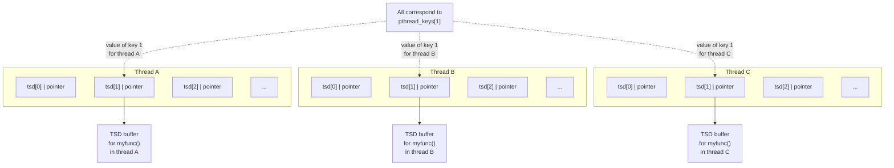

## Chapter 31
# **THREADS: THREAD SAFETY AND PER-THREAD STORAGE**

This chapter extends the discussion of the POSIX threads API, providing a description of thread-safe functions and one-time initialization. We also discuss how to use thread-specific data or thread-local storage to make an existing function thread-safe without changing the function's interface.

## **31.1 Thread Safety (and Reentrancy Revisited)**

<span id="page-38-0"></span>A function is said to be thread-safe if it can safely be invoked by multiple threads at the same time; put conversely, if a function is not thread-safe, then we can't call it from one thread while it is being executed in another thread. For example, the following function (similar to code that we looked at in Section [30.1](#page-14-1)) is not thread-safe:

```
static int glob = 0;
static void
incr(int loops)
{
 int loc, j;
```

```
 for (j = 0; j < loops; j++) {
 loc = glob;
 loc++;
 glob = loc;
 }
}
```

If multiple threads invoke this function concurrently, the final value in glob is unpredictable. This function illustrates the typical reason that a function is not thread-safe: it employs global or static variables that are shared by all threads.

There are various methods of rendering a function thread-safe. One way is to associate a mutex with the function (or perhaps with all of the functions in a library, if they all share the same global variables), lock that mutex when the function is called, and unlock it when the mutex returns. This approach has the virtue of simplicity. On the other hand, it means that only one thread at a time can execute the function—we say that access to the function is serialized. If the threads spend a significant amount of time executing this function, then this serialization results in a loss of concurrency, because the threads of a program can no longer execute in parallel.

A more sophisticated solution is to associate the mutex with a shared variable. We then determine which parts of the function are critical sections that access the shared variable, and acquire and release the mutex only during the execution of these critical sections. This allows multiple threads to execute the function at the same time and to operate in parallel, except when more than one thread needs to execute a critical section.

### **Non-thread-safe functions**

To facilitate the development of threaded applications, all of the functions specified in SUSv3 are required to be implemented in a thread-safe manner, except those listed in [Table 31-1](#page-40-0). (Many of these functions are not discussed in this book.) In addition to the functions listed in [Table 31-1](#page-40-0), SUSv3 specifies the following:

-  The ctermid() and tmpnam() functions need not be thread-safe if passed a NULL argument.
-  The wcrtomb() and wcsrtombs() functions need not be thread-safe if their final argument (ps) is NULL.

SUSv4 modifies the list of functions in [Table 31-1](#page-40-0) as follows:

-  The ecvt(), fcvt(), gcvt(), gethostbyname(), and gethostbyaddr() are removed, since these functions have been removed from the standard.
-  The strsignal() and system() functions are added. The system() function is nonreentrant because the manipulations that it must make to signal dispositions have a process-wide effect.

The standards do not prohibit an implementation from making the functions in [Table 31-1](#page-40-0) thread-safe. However, even if some of these functions are thread-safe on some implementations, a portable application can't rely on this to be the case on all implementations.

<span id="page-40-0"></span>**Table 31-1:** Functions that SUSv3 does not require to be thread-safe

| asctime()      | fcvt()             | getpwnam()      | nl_langinfo()      |
|----------------|--------------------|-----------------|--------------------|
| basename()     | ftw()              | getpwuid()      | ptsname()          |
| catgets()      | gcvt()             | getservbyname() | putc_unlocked()    |
| crypt()        | getc_unlocked()    | getservbyport() | putchar_unlocked() |
| ctime()        | getchar_unlocked() | getservent()    | putenv()           |
| dbm_clearerr() | getdate()          | getutxent()     | pututxline()       |
| dbm_close()    | getenv()           | getutxid()      | rand()             |
| dbm_delete()   | getgrent()         | getutxline()    | readdir()          |
| dbm_error()    | getgrgid()         | gmtime()        | setenv()           |
| dbm_fetch()    | getgrnam()         | hcreate()       | setgrent()         |
| dbm_firstkey() | gethostbyaddr()    | hdestroy()      | setkey()           |
| dbm_nextkey()  | gethostbyname()    | hsearch()       | setpwent()         |
| dbm_open()     | gethostent()       | inet_ntoa()     | setutxent()        |
| dbm_store()    | getlogin()         | l64a()          | strerror()         |
| dirname()      | getnetbyaddr()     | lgamma()        | strtok()           |
| dlerror()      | getnetbyname()     | lgammaf()       | ttyname()          |
| drand48()      | getnetent()        | lgammal()       | unsetenv()         |
| ecvt()         | getopt()           | localeconv()    | wcstombs()         |
| encrypt()      | getprotobyname()   | localtime()     | wctomb()           |
| endgrent()     | getprotobynumber() | lrand48()       |                    |
| endpwent()     | getprotoent()      | mrand48()       |                    |
| endutxent()    | getpwent()         | nftw()          |                    |

### **Reentrant and nonreentrant functions**

Although the use of critical sections to implement thread safety is a significant improvement over the use of per-function mutexes, it is still somewhat inefficient because there is a cost to locking and unlocking a mutex. A reentrant function achieves thread safety without the use of mutexes. It does this by avoiding the use of global and static variables. Any information that must be returned to the caller, or maintained between calls to the function, is stored in buffers allocated by the caller. (We first encountered reentrancy when discussing the treatment of global variables within signal handlers in Section 21.1.2.) However, not all functions can be made reentrant. The usual reasons are the following:

-  By their nature, some functions must access global data structures. The functions in the malloc library provide a good example. These functions maintain a global linked list of free blocks on the heap. The functions of the malloc library are made thread-safe through the use of mutexes.
-  Some functions (defined before the invention of threads) have an interface that by definition is nonreentrant, because they return pointers to storage statically allocated by the function, or they employ static storage to maintain information between successive calls to the same (or a related) function. Most of the functions in [Table 31-1](#page-40-0) fall into this category. For example, the asctime() function (Section 10.2.3) returns a pointer to a statically allocated buffer containing a date-time string.

For several of the functions that have nonreentrant interfaces, SUSv3 specifies reentrant equivalents with names ending with the suffix \_r. These functions require the caller to allocate a buffer whose address is then passed to the function and used to return the result. This allows the calling thread to use a local (stack) variable for the function result buffer. For this purpose, SUSv3 specifies asctime\_r(), ctime\_r(), getgrgid\_r(), getgrnam\_r(), getlogin\_r(), getpwnam\_r(), getpwuid\_r(), gmtime\_r(), localtime\_r(), rand\_r(), readdir\_r(), strerror\_r(), strtok\_r(), and ttyname\_r().

> Some implementations also provide additional reentrant equivalents of other traditional nonreentrant functions. For example, glibc provides crypt\_r(), gethostbyname\_r(), getservbyname\_r(), getutent\_r(), getutid\_r(), getutline\_r(), and ptsname\_r(). However, a portable application can't rely on these functions being present on other implementations. In some cases, SUSv3 doesn't specify these reentrant equivalents because alternatives to the traditional functions exist that are both superior and reentrant. For example, getaddrinfo() is the modern, reentrant alternative to gethostbyname() and getservbyname().

## **31.2 One-Time Initialization**

Sometimes, a threaded application needs to ensure that some initialization action occurs just once, regardless of how many threads are created. For example, a mutex may need to be initialized with special attributes using pthread\_mutex\_init(), and that initialization must occur just once. If we are creating the threads from the main program, then this is generally easy to achieve—we perform the initialization before creating any threads that depend on the initialization. However, in a library function, this is not possible, because the calling program may create the threads before the first call to the library function. Therefore, the library function needs a method of performing the initialization the first time that it is called from any thread.

A library function can perform one-time initialization using the pthread\_once() function.

```
#include <pthread.h>
int pthread_once(pthread_once_t *once_control, void (*init)(void));
                      Returns 0 on success, or a positive error number on error
```

The pthread\_once() function uses the state of the argument once\_control to ensure that the caller-defined function pointed to by init is called just once, no matter how many times or from how many different threads the pthread\_once() call is made.

The init function is called without any arguments, and thus has the following form:

```
void
init(void)
{
 /* Function body */
}
```

The once\_control argument is a pointer to a variable that must be statically initialized with the value PTHREAD\_ONCE\_INIT:

```
pthread_once_t once_var = PTHREAD_ONCE_INIT;
```

The first call to pthread\_once() that specifies a pointer to a particular pthread\_once\_t variable modifies the value of the variable pointed to by once\_control so that subsequent calls to pthread\_once() don't invoke init.

One common use of pthread\_once() is in conjunction with thread-specific data, which we describe next.

> The main reason for the existence of pthread\_once() is that in early versions of Pthreads, it was not possible to statically initialize a mutex. Instead, the use of pthread\_mutex\_init() was required ([Butenhof, 1996]). Given the later addition of statically allocated mutexes, it is possible for a library function to perform one-time initialization using a statically allocated mutex and a static Boolean variable. Nevertheless, pthread\_once() is retained as a convenience.

## **31.3 Thread-Specific Data**

<span id="page-42-0"></span>The most efficient way of making a function thread-safe is to make it reentrant. All new library functions should be implemented in this way. However, for an existing nonreentrant library function (one that was perhaps designed before the use of threads became common), this approach usually requires changing the function's interface, which means modifying all of the programs that use the function.

Thread-specific data is a technique for making an existing function thread-safe without changing its interface. A function that uses thread-specific data may be slightly less efficient than a reentrant function, but allows us to leave the programs that call the function unchanged.

Thread-specific data allows a function to maintain a separate copy of a variable for each thread that calls the function, as illustrated in [Figure 31-1](#page-42-1). Thread-specific data is persistent; each thread's variable continues to exist between the thread's invocations of the function. This allows the function to maintain per-thread information between calls to the function, and allows the function to pass distinct result buffers (if required) to each calling thread.

```text
 ┌──────────┐        ┌─────────────────┐
 │ Thread A │───────>│   TSD buffer    │
 └──────────┘        │  for myfunc()   │
                     │   in thread A   │
                     └─────────────────┘

 ┌──────────┐        ┌─────────────────┐
 │ Thread B │───────>│   TSD buffer    │
 └──────────┘        │  for myfunc()   │
                     │   in thread B   │
                     └─────────────────┘

 ┌──────────┐        ┌─────────────────┐
 │ Thread C │───────>│   TSD buffer    │
 └──────────┘        │  for myfunc()   │
                     │   in thread C   │
                     └─────────────────┘
```

<span id="page-42-1"></span>**Figure 31-1:** Thread-specific data (TSD) provides per-thread storage for a function

## **31.3.1 Thread-Specific Data from the Library Function's Perspective**

In order to understand the use of the thread-specific data API, we need to consider things from the point of view of a library function that uses thread-specific data:

-  The function must allocate a separate block of storage for each thread that calls the function. This block needs to be allocated once, the first time the thread calls the function.
-  On each subsequent call from the same thread, the function needs to be able to obtain the address of the storage block that was allocated the first time this thread called the function. The function can't maintain a pointer to the block in an automatic variable, since automatic variables disappear when the function returns; nor can it store the pointer in a static variable, since only one instance of each static variable exists in the process. The Pthreads API provides functions to handle this task.
-  Different (i.e., independent) functions may each need thread-specific data. Each function needs a method of identifying its thread-specific data (a key), as distinct from the thread-specific data used by other functions.
-  The function has no direct control over what happens when the thread terminates. When the thread terminates, it is probably executing code outside the function. Nevertheless, there must be some mechanism (a destructor) to ensure that the storage block allocated for this thread is automatically deallocated when the thread terminates. If this is not done, then a memory leak could occur as threads are continuously created, call the function, and then terminate.

## **31.3.2 Overview of the Thread-Specific Data API**

The general steps that a library function performs in order to use thread-specific data are as follows:

- 1. The function creates a key, which is the means of differentiating the thread-specific data item used by this function from the thread-specific data items used by other functions. The key is created by calling the pthread\_key\_create() function. Creating a key needs to be done only once, when the first thread calls the function. For this purpose, pthread\_once() is employed. Creating a key doesn't allocate any blocks of thread-specific data.
- 2. The call to pthread\_key\_create() serves a second purpose: it allows the caller to specify the address of the programmer-defined destructor function that is used to deallocate each of the storage blocks allocated for this key (see the next step). When a thread that has thread-specific data terminates, the Pthreads API automatically invokes the destructor, passing it a pointer to the data block for this thread.
- 3. The function allocates a thread-specific data block for each thread from which it is called. This is done using malloc() (or a similar function). This allocation is done once for each thread, the first time the thread calls the function.
- 4. In order to save a pointer to the storage allocated in the previous step, the function employs two Pthreads functions: pthread\_setspecific() and pthread\_getspecific(). A call to pthread\_setspecific() is a request to the Pthreads implementation to say

"save this pointer, recording the fact that it is associated with a particular key (the one for this function) and a particular thread (the calling thread)." Calling pthread\_getspecific() performs the complementary task, returning the pointer previously associated with a given key for the calling thread. If no pointer was previously associated with a particular key and thread, then pthread\_getspecific() returns NULL. This is how a function can determine that it is being called for the first time by this thread, and thus must allocate the storage block for the thread.

## **31.3.3 Details of the Thread-Specific Data API**

In this section, we provide details of each of the functions mentioned in the previous section, and elucidate the operation of thread-specific data by describing how it is typically implemented. The next section shows how to use thread-specific data to write a thread-safe implementation of the standard C library function strerror().

Calling pthread\_key\_create() creates a new thread-specific data key that is returned to the caller in the buffer pointed to by key.

```
#include <pthread.h>
int pthread_key_create(pthread_key_t *key, void (*destructor)(void *));
                      Returns 0 on success, or a positive error number on error
```

Because the returned key is used by all threads in the process, key should point to a global variable.

The destructor argument points to a programmer-defined function of the following form:

```
void
dest(void *value)
{
 /* Release storage pointed to by 'value' */
}
```

Upon termination of a thread that has a non-NULL value associated with key, the destructor function is automatically invoked by the Pthreads API and given that value as its argument. The passed value is normally a pointer to this thread's thread-specific data block for this key. If a destructor is not required, then destructor can be specified as NULL.

> If a thread has multiple thread-specific data blocks, then the order in which the destructors are called is unspecified. Destructor functions should be designed to operate independently of one another.

Looking at the implementation of thread-specific data helps us to understand how it is used. A typical implementation (NPTL is typical), involves the following arrays:

 a single global (i.e., process-wide) array of information about thread-specific data keys; and

 a set of per-thread arrays, each containing pointers to all of the thread-specific data blocks allocated for a particular thread (i.e., this array contains the pointers stored by calls to pthread\_setspecific()).

In this implementation, the pthread\_key\_t value returned by pthread\_key\_create() is simply an index into the global array, which we label pthread\_keys, whose form is shown in [Figure 31-2](#page-45-0). Each element of this array is a structure containing two fields. The first field indicates whether this array element is in use (i.e., has been allocated by a previous call to pthread\_key\_create()). The second field is used to store the pointer to the destructor function for the thread-specific data blocks for this key (i.e., it is a copy of the destructor argument to pthread\_key\_create()).

```text
pthread_keys[0]  ┌──────────────────┐
                 │   "in use" flag  │
                 ├──────────────────┤
                 │destructor pointer│
                 ├──────────────────┤
pthread_keys[1]  │   "in use" flag  │
                 ├──────────────────┤
                 │destructor pointer│
                 ├──────────────────┤
pthread_keys[2]  │   "in use" flag  │
                 ├──────────────────┤
                 │destructor pointer│
                 ├──────────────────┤
                 │       ...        │
                 └──────────────────┘
```

<span id="page-45-0"></span>**Figure 31-2:** Implementation of thread-specific data keys

The pthread\_setspecific() function requests the Pthreads API to save a copy of value in a data structure that associates it with the calling thread and with key, a key returned by a previous call to pthread\_key\_create(). The pthread\_getspecific() function performs the converse operation, returning the value that was previously associated with the given key for this thread.

```
#include <pthread.h>
int pthread_setspecific(pthread_key_t key, const void *value);
                       Returns 0 on success, or a positive error number on error
void *pthread_getspecific(pthread_key_t key);
          Returns pointer, or NULL if no thread-specific data isassociated with key
```

The value argument given to pthread\_setspecific() is normally a pointer to a block of memory that has previously been allocated by the caller. This pointer will be passed as the argument for the destructor function for this key when the thread terminates.

> The value argument doesn't need to be a pointer to a block of memory. It could be some scalar value that can be assigned (with a cast) to void \*. In this case, the earlier call to pthread\_key\_create() would specify destructor as NULL.

[Figure 31-3](#page-46-0) shows a typical implementation of the data structure used to store value. In this diagram, we assume that pthread\_keys[1] was allocated to a function named myfunc(). For each thread, the Pthreads API maintains an array of pointers to thread-specific data blocks. The elements of each of these thread-specific arrays have a one-to-one correspondence with the elements of the global pthread\_keys array shown in [Figure 31-2](#page-45-0). The pthread\_setspecific() function sets the element corresponding to key in the array for the calling thread.



<span id="page-46-0"></span>**Figure 31-3:** Data structure used to implement thread-specific data (TSD) pointers

When a thread is first created, all of its thread-specific data pointers are initialized to NULL. This means that when our library function is called by a thread for the first time, it must begin by using pthread\_getspecific() to check whether the thread already has an associated value for key. If it does not, then the function allocates a block of memory and saves a pointer to the block using pthread\_setspecific(). We show an example of this in the thread-safe strerror() implementation presented in the next section.

## **31.3.4 Employing the Thread-Specific Data API**

When we first described the standard strerror() function in Section 3.4, we noted that it may return a pointer to a statically allocated string as its function result. This means that strerror() may not be thread-safe. In the next few pages, we look at a nonthread-safe implementation of strerror(), and then show how thread-specific data can be used to make this function thread-safe.

On many UNIX implementations, including Linux, the strerror() function provided by the standard C library is thread-safe. However, we use the example of strerror() anyway, because SUSv3 doesn't require this function to be threadsafe, and its implementation provides a simple example of the use of threadspecific data.

[Listing 31-1](#page-47-0) shows a simple non-thread-safe implementation of strerror(). This function makes use of a pair of global variables defined by glibc: \_sys\_errlist is an array of pointers to strings corresponding to the error numbers in errno (thus, for example, \_sys\_errlist[EINVAL] points to the string Invalid operation), and \_sys\_nerr specifies the number of elements in \_sys\_errlist.

<span id="page-47-0"></span>**Listing 31-1:** An implementation of strerror() that is not thread-safe

```
–––––––––––––––––––––––––––––––––––––––––––––––––––––––– threads/strerror.c
#define _GNU_SOURCE /* Get '_sys_nerr' and '_sys_errlist'
 declarations from <stdio.h> */
#include <stdio.h>
#include <string.h> /* Get declaration of strerror() */
#define MAX_ERROR_LEN 256 /* Maximum length of string
 returned by strerror() */
static char buf[MAX_ERROR_LEN]; /* Statically allocated return buffer */
char *
strerror(int err)
{
 if (err < 0 || err >= _sys_nerr || _sys_errlist[err] == NULL) {
 snprintf(buf, MAX_ERROR_LEN, "Unknown error %d", err);
 } else {
 strncpy(buf, _sys_errlist[err], MAX_ERROR_LEN - 1);
 buf[MAX_ERROR_LEN - 1] = '\0'; /* Ensure null termination */
 }
 return buf;
}
–––––––––––––––––––––––––––––––––––––––––––––––––––––––– threads/strerror.c
```

We can use the program in [Listing 31-2](#page-48-0) to demonstrate the consequences of the fact that the strerror() implementation in [Listing 31-1](#page-47-0) is not thread-safe. This program calls strerror() from two different threads, but displays the returned value only after both threads have called strerror(). Even though each thread specifies a different value (EINVAL and EPERM) as the argument to strerror(), this is what we see when we compile and link this program with the version of strerror() shown in [Listing 31-1](#page-47-0):

```
$ ./strerror_test
```

```
Main thread has called strerror()
Other thread about to call strerror()
Other thread: str (0x804a7c0) = Operation not permitted
Main thread: str (0x804a7c0) = Operation not permitted
```

Both threads displayed the errno string corresponding to EPERM, because the call to strerror() by the second thread (in threadFunc) overwrote the buffer that was written by the call to strerror() in the main thread. Inspection of the output shows that the local variable str in the two threads points to the same memory address.

<span id="page-48-0"></span>**Listing 31-2:** Calling strerror() from two different threads

```
––––––––––––––––––––––––––––––––––––––––––––––––––– threads/strerror_test.c
#include <stdio.h>
#include <string.h> /* Get declaration of strerror() */
#include <pthread.h>
#include "tlpi_hdr.h"
static void *
threadFunc(void *arg)
{
 char *str;
 printf("Other thread about to call strerror()\n");
 str = strerror(EPERM);
 printf("Other thread: str (%p) = %s\n", str, str);
 return NULL;
}
int
main(int argc, char *argv[])
{
 pthread_t t;
 int s;
 char *str;
 str = strerror(EINVAL);
 printf("Main thread has called strerror()\n");
 s = pthread_create(&t, NULL, threadFunc, NULL);
 if (s != 0)
 errExitEN(s, "pthread_create");
 s = pthread_join(t, NULL);
 if (s != 0)
 errExitEN(s, "pthread_join");
 printf("Main thread: str (%p) = %s\n", str, str);
 exit(EXIT_SUCCESS);
}
––––––––––––––––––––––––––––––––––––––––––––––––––– threads/strerror_test.c
```

[Listing 31-3](#page-49-0) shows a reimplementation of strerror() that uses thread-specific data to ensure thread safety.

The first step performed by the revised strerror() is to call pthread\_once() r to ensure that the first invocation of this function (from any thread) calls createKey() w. The createKey() function calls pthread\_key\_create() to allocate a thread-specific data key that is stored in the global variable strerrorKey e. The call to pthread\_key\_create() also records the address of the destructor q that will be used to free the thread-specific buffers corresponding to this key.

The strerror() function then calls pthread\_getspecific() t to retrieve the address of this thread's unique buffer corresponding to strerrorKey. If pthread\_getspecific() returns NULL, then this thread is calling strerror() for the first time, and so the function allocates a new buffer using malloc() y, and saves the address of the buffer using pthread\_setspecific() u. If the pthread\_getspecific() call returns a non-NULL value, then that pointer refers to an existing buffer that was allocated when this thread previously called strerror().

The remainder of this strerror() implementation is similar to the implementation that we showed earlier, with the difference that buf is the address of a threadspecific data buffer, rather than a static variable.

<span id="page-49-0"></span>**Listing 31-3:** A thread-safe implementation of strerror() using thread-specific data

```
–––––––––––––––––––––––––––––––––––––––––––––––––––– threads/strerror_tsd.c
  #define _GNU_SOURCE /* Get '_sys_nerr' and '_sys_errlist'
   declarations from <stdio.h> */
  #include <stdio.h>
  #include <string.h> /* Get declaration of strerror() */
  #include <pthread.h>
  #include "tlpi_hdr.h"
  static pthread_once_t once = PTHREAD_ONCE_INIT;
  static pthread_key_t strerrorKey;
  #define MAX_ERROR_LEN 256 /* Maximum length of string in per-thread
   buffer returned by strerror() */
  static void /* Free thread-specific data buffer */
q destructor(void *buf)
  {
   free(buf);
  }
  static void /* One-time key creation function */
w createKey(void)
  {
   int s;
   /* Allocate a unique thread-specific data key and save the address
   of the destructor for thread-specific data buffers */
e s = pthread_key_create(&strerrorKey, destructor);
   if (s != 0)
   errExitEN(s, "pthread_key_create");
  }
```

```
char *
  strerror(int err)
  {
   int s;
   char *buf;
   /* Make first caller allocate key for thread-specific data */
r s = pthread_once(&once, createKey);
   if (s != 0)
   errExitEN(s, "pthread_once");
t buf = pthread_getspecific(strerrorKey);
   if (buf == NULL) { /* If first call from this thread, allocate
   buffer for thread, and save its location */
y buf = malloc(MAX_ERROR_LEN);
   if (buf == NULL)
   errExit("malloc");
u s = pthread_setspecific(strerrorKey, buf);
   if (s != 0)
   errExitEN(s, "pthread_setspecific");
   }
   if (err < 0 || err >= _sys_nerr || _sys_errlist[err] == NULL) {
   snprintf(buf, MAX_ERROR_LEN, "Unknown error %d", err);
   } else {
   strncpy(buf, _sys_errlist[err], MAX_ERROR_LEN - 1);
   buf[MAX_ERROR_LEN - 1] = '\0'; /* Ensure null termination */
   }
   return buf;
  }
  –––––––––––––––––––––––––––––––––––––––––––––––––––– threads/strerror_tsd.c
```

If we compile and link our test program ([Listing 31-2](#page-48-0)) with the new version of strerror() ([Listing 31-3\)](#page-49-0) to create an executable file, strerror\_test\_tsd, then we see the following results when running the program:

```
$ ./strerror_test_tsd
Main thread has called strerror()
```

```
Other thread about to call strerror()
Other thread: str (0x804b158) = Operation not permitted
Main thread: str (0x804b008) = Invalid argument
```

From this output, we see that the new version of strerror() is thread-safe. We also see that the address pointed to by the local variable str in the two threads is different.

## **31.3.5 Thread-Specific Data Implementation Limits**

As implied by our description of how thread-specific data is typically implemented, an implementation may need to impose limits on the number of thread-specific data keys that it supports. SUSv3 requires that an implementation support at least 128 (\_POSIX\_THREAD\_KEYS\_MAX) keys. An application can determine how many keys an implementation actually supports either via the definition of PTHREAD\_KEYS\_MAX (defined in <limits.h>) or by calling sysconf(\_SC\_THREAD\_KEYS\_MAX). Linux supports up to 1024 keys.

Even 128 keys should be more than sufficient for most applications. This is because each library function should employ only a small number of keys—often just one. If a function requires multiple thread-specific data values, these can usually be placed in a single structure that has just one associated thread-specific data key.

## **31.4 Thread-Local Storage**

Like thread-specific data, thread-local storage provides persistent per-thread storage. This feature is nonstandard, but it is provided in the same or a similar form on many other UNIX implementations (e.g., Solaris and FreeBSD).

The main advantage of thread-local storage is that it is much simpler to use than thread-specific data. To create a thread-local variable, we simply include the \_\_thread specifier in the declaration of a global or static variable:

```
static __thread buf[MAX_ERROR_LEN];
```

Each thread has its own copy of the variables declared with this specifier. The variables in a thread's thread-local storage persist until the thread terminates, at which time the storage is automatically deallocated.

Note the following points about the declaration and use of thread-local variables:

-  The \_\_thread keyword must immediately follow the static or extern keyword, if either of these is specified in the variable's declaration.
-  The declaration of a thread-local variable can include an initializer, in the same manner as a normal global or static variable declaration.
-  The C address (&) operator can be used to obtain the address of a thread-local variable.

Thread-local storage requires support from the kernel (provided in Linux 2.6), the Pthreads implementation (provided in NPTL), and the C compiler (provided on x86-32 with gcc 3.3 and later).

[Listing 31-4](#page-52-0) shows a thread-safe implementation of strerror() using thread-local storage. If we compile and link our test program [\(Listing 31-2](#page-48-0)) with this version of strerror() to create an executable file, strerror\_test\_tls, then we see the following results when running the program:

```
$ ./strerror_test_tls
```

```
Main thread has called strerror()
Other thread about to call strerror()
Other thread: str (0x40376ab0) = Operation not permitted
Main thread: str (0x40175080) = Invalid argument
```

<span id="page-52-0"></span>**Listing 31-4:** A thread-safe implementation of strerror() using thread-local storage

```
–––––––––––––––––––––––––––––––––––––––––––––––––––– threads/strerror_tls.c
#define _GNU_SOURCE /* Get '_sys_nerr' and '_sys_errlist'
 declarations from <stdio.h> */
#include <stdio.h>
#include <string.h> /* Get declaration of strerror() */
#include <pthread.h>
#define MAX_ERROR_LEN 256 /* Maximum length of string in per-thread
 buffer returned by strerror() */
static __thread char buf[MAX_ERROR_LEN];
 /* Thread-local return buffer */
char *
strerror(int err)
{
 if (err < 0 || err >= _sys_nerr || _sys_errlist[err] == NULL) {
 snprintf(buf, MAX_ERROR_LEN, "Unknown error %d", err);
 } else {
 strncpy(buf, _sys_errlist[err], MAX_ERROR_LEN - 1);
 buf[MAX_ERROR_LEN - 1] = '\0'; /* Ensure null termination */
 }
 return buf;
}
––––––––––––––––––––––––––––––––––––––––––––––––––––– threads/strerror_tls.c
```

## **31.5 Summary**

A function is said to be thread-safe if it can safely be invoked from multiple threads at the same time. The usual reason a function is not thread-safe is that it makes use of global or static variables. One way to render a non-thread-safe function safe in a multithreaded application is to guard all calls to the function with a mutex lock. This approach suffers the problem that it reduces concurrency, because only one thread can be in the function at any time. An approach that allows greater concurrency is to add mutex locks around just those parts of the function that manipulate shared variables (the critical sections).

Mutexes can be used to render most functions thread-safe, but they carry a performance penalty because there is a cost to locking and unlocking a mutex. By avoiding the use of global and static variables, a reentrant function achieves threadsafety without the use of mutexes.

Most of the functions specified in SUSv3 are required to be thread-safe. SUSv3 also lists a small set of functions that are not required to be thread-safe. Typically, these are functions that employ static storage to return information to the caller or to maintain information between successive calls. By definition, such functions are not reentrant, and mutexes can't be used to make them thread-safe. We considered two roughly equivalent coding techniques—thread-specific data and thread-local storage—that can be used to render an unsafe function thread-safe without needing to change its interface. Both of these techniques allow a function to allocate persistent, per-thread storage.

## **Further information**

Refer to the sources of further information listed in Section [29.10.](#page-12-0)

# **31.6 Exercises**

- **31-1.** Implement a function, one\_time\_init(control, init), that performs the equivalent of pthread\_once(). The control argument should be a pointer to a statically allocated structure containing a Boolean variable and a mutex. The Boolean variable indicates whether the function init has already been called, and the mutex controls access to that variable. To keep the implementation simple, you can ignore possibilities such as init() failing or being canceled when first called from a thread (i.e., it is not necessary to devise a scheme whereby, if such an event occurs, the next thread that calls one\_time\_init() reattempts the call to init()).
- **31-2.** Use thread-specific data to write thread-safe versions of dirname() and basename() (Section 18.14).

