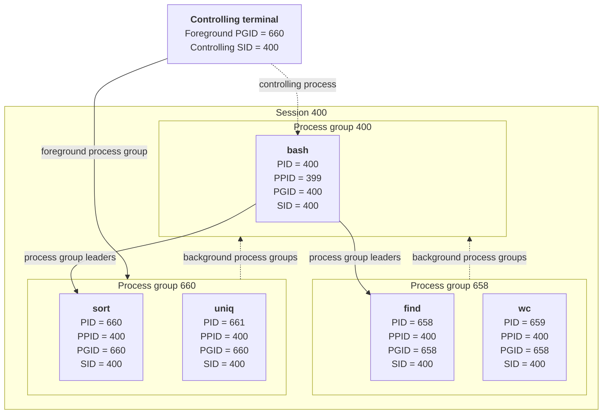
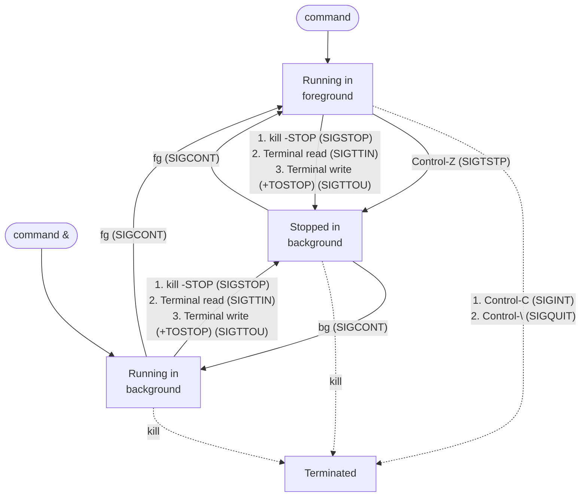
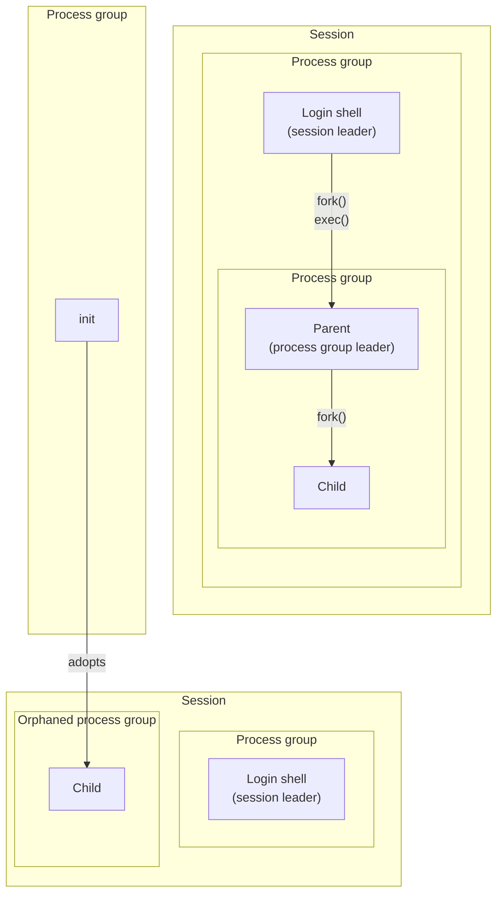

## Chapter 34
# **PROCESS GROUPS, SESSIONS, AND JOB CONTROL**

Process groups and sessions form a two-level hierarchical relationship between processes: a process group is a collection of related processes, and a session is a collection of related process groups. The meaning of the term related in each case will become clear in the course of this chapter.

Process groups and sessions are abstractions defined to support shell job control, which allows interactive users to run commands in the foreground or in the background. The term job is often used synonymously with the term process group.

This chapter describes process groups, sessions, and job control.

# **34.1 Overview**

A process group is a set of one or more processes sharing the same process group identifier (PGID). A process group ID is a number of the same type (pid\_t) as a process ID. A process group has a process group leader, which is the process that creates the group and whose process ID becomes the process group ID of the group. A new process inherits its parent's process group ID.

A process group has a lifetime, which is the period of time beginning when the leader creates the group and ending when the last member process leaves the group. A process may leave a process group either by terminating or by joining another process group. The process group leader need not be the last member of a process group.

A session is a collection of process groups. A process's session membership is determined by its session identifier (SID), which, like the process group ID, is a number of type pid\_t. A session leader is the process that creates a new session and whose process ID becomes the session ID. A new process inherits its parent's session ID.

All of the processes in a session share a single controlling terminal. The controlling terminal is established when the session leader first opens a terminal device. A terminal may be the controlling terminal of at most one session.

At any point in time, one of the process groups in a session is the foreground process group for the terminal, and the others are background process groups. Only processes in the foreground process group can read input from the controlling terminal. When the user types one of the signal-generating terminal characters on the controlling terminal, a signal is sent to all members of the foreground process group. These characters are the interrupt character (usually Control-C), which generates SIGINT; the quit character (usually Control-\), which generates SIGQUIT; and the suspend character (usually Control-Z), which generates SIGTSTP.

As a consequence of establishing the connection to (i.e., opening) the controlling terminal, the session leader becomes the controlling process for the terminal. The principal significance of being the controlling process is that the kernel sends this process a SIGHUP signal if a terminal disconnect occurs.

> By inspecting the Linux-specific /proc/PID/stat files, we can determine the process group ID and session ID of any process. We can also determine the device ID of the process's controlling terminal (expressed as a single decimal integer containing both major and minor IDs) and the process ID of the controlling process for that terminal. See the proc(5) manual page for further details.

The main use of sessions and process groups is for shell job control. Looking at a specific example from this domain helps clarify these concepts. For an interactive login, the controlling terminal is the one on which the user logs in. The login shell becomes the session leader and the controlling process for the terminal, and is also made the sole member of its own process group. Each command or pipeline of commands started from the shell results in the creation of one or more processes, and the shell places all of these processes in a new process group. (These processes are initially the only members of that process group, although any child processes that they create will also be members of the group.) A command or pipeline is created as a background process group if it is terminated with an ampersand (&). Otherwise, it becomes the foreground process group. All processes created during the login session are part of the same session.

> In a windowing environment, the controlling terminal is a pseudoterminal, and there is a separate session for each terminal window, with the window's startup shell being the session leader and controlling process for the terminal.

> Process groups occasionally find uses in areas other than job control, since they have two useful properties: a parent process can wait on any of its children in a particular process group (Section 26.1.2), and a signal can be sent to all of the members of a process group (Section 20.5).

[Figure 34-1](#page-2-0) shows the process group and session relationships between the various processes resulting from the execution of the following commands:

```
$ echo $$ Display the PID of the shell
400
$ find / 2> /dev/null | wc -l & Creates 2 processes in background group
[1] 659
$ sort < longlist | uniq -c Creates 2 processes in foreground group
```

At this point, the shell (bash), find, wc, sort, and uniq are all running.


<span id="page-2-0"></span>**Figure 34-1:** Relationships between process groups, sessions, and the controlling terminal

# **34.2 Process Groups**

Each process has a numeric process group ID that defines the process group to which it belongs. A new process inherits its parent's process group ID. A process can obtain its process group ID using getpgrp().

```
#include <unistd.h>
pid_t getpgrp(void);
                 Always successfully returns process group ID of calling process
```

If the value returned by getpgrp() matches the caller's process ID, this process is the leader of its process group.

The setpgid() system call changes the process group of the process whose process ID is pid to the value specified in pgid.

```
#include <unistd.h>
int setpgid(pid_t pid, pid_t pgid);
                                             Returns 0 on success, or –1 on error
```

If pid is specified as 0, the calling process's process group ID is changed. If pgid is specified as 0, then the process group ID of the process specified by pid is made the same as its process ID. Thus, the following setpgid() calls are equivalent:

```
setpgid(0, 0);
setpgid(getpid(), 0);
setpgid(getpid(), getpid());
```

If the pid and pgid arguments specify the same process (i.e., pgid is 0 or matches the process ID of the process specified by pid), then a new process group is created, and the specified process is made the leader of the new group (i.e., the process group ID of the process is made the same as its process ID). If the two arguments specify different values (i.e., pgid is not 0 and doesn't match the process ID of the process specified by pid), then setpgid() is being used to move a process between process groups.

The typical callers of setpgid() (and setsid(), described in Section [34.3](#page-5-0)) are programs such as the shell and login(1). In Section 37.2, we'll see that a program also calls setsid() as one of the steps on the way to becoming a daemon.

Several restrictions apply when calling setpgid():

- The pid argument may specify only the calling process or one of its children. Violation of this rule results in the error ESRCH.
- When moving a process between groups, the calling process and the process specified by pid (which may be one and the same), as well as the target process group, must all be part of the same session. Violation of this rule results in the error EPERM.
- The pid argument may not specify a process that is a session leader. Violation of this rule results in the error EPERM.
- A process may not change the process group ID of one of its children after that child has performed an exec(). Violation of this rule results in the error EACCES. The rationale for this constraint is that it could confuse a program if its process group ID were changed after it had commenced.

#### **Using setpgid() in a job-control shell**

The restriction that a process may not change the process group ID of one of its children after that child has performed an exec() affects the programming of jobcontrol shells, which have the following requirements:

- All of the processes in a job (i.e., a command or a pipeline) must be placed in a single process group. (We can see the desired result by looking at the two process groups created by bash in [Figure 34-1.](#page-2-0)) This step permits the shell to use killpg() (or, equivalently, kill() with a negative pid argument) to simultaneously send job-control signals to all of the members of the process group. Naturally, this step must be carried out before any job-control signals are sent.
- Each of the child processes must be transferred to the process group before it execs a program, since the program itself is ignorant of manipulations of the process group ID.

For each process in the job, either the parent or the child could use setpgid() to change the process group ID of the child. However, because the scheduling of the parent and child is indeterminate after a fork() (Section 24.4), we can't rely on the parent changing the child's process group ID before the child does an exec(); nor can we rely on the child changing its process group ID before the parent tries to send any job-control signals to it. (Dependence on either one of these behaviors would result in a race condition.) Therefore, job-control shells are programmed so that the parent and the child process both call setpgid() to change the child's process group ID to the same value immediately after a fork(), and the parent ignores any occurrence of the EACCES error on the setpgid() call. In other words, in a job-control shell, we'll find code something like that shown in [Listing 34-1](#page-4-0).

<span id="page-4-0"></span>**Listing 34-1:** How a job-control shell sets the process group ID of a child process

```
 pid_t childPid;
 pid_t pipelinePgid; /* PGID to which processes in a pipeline
 are to be assigned */
 /* Other code */
 childPid = fork();
 switch (childPid) {
 case -1: /* fork() failed */
 /* Handle error */
 case 0: /* Child */
 if (setpgid(0, pipelinePgid) == -1)
 /* Handle error */
 /* Child carries on to exec the required program */
 default: /* Parent (shell) */
 if (setpgid(childPid, pipelinePgid) == -1 && errno != EACCES)
 /* Handle error */
 /* Parent carries on to do other things */
 }
```

Things are slightly more complex than shown in [Listing 34-1,](#page-4-0) since, when creating the processes for a pipeline, the parent shell records the process ID of the first process in the pipeline and uses this as the process group ID (pipelinePgid) for all of the processes in the group.

### **Other (obsolete) interfaces for retrieving and modifying process group IDs**

The different suffixes in the names of the getpgrp() and setpgid() system calls deserve explanation.

In the beginning, 4.2BSD provided a getprgp(pid) system call that returned the process group ID of the process specified by pid. In practice, pid was always used to specify the calling process. Consequently, the POSIX committee deemed the call to be more complex than necessary, and instead adopted the System V getpgrp() call, which took no arguments and returned the process group ID of the calling process.

In order to change the process group ID, 4.2BSD provided the call setpgrp(pid, pgid), which operated in a similar manner to setpgid(). The principal difference was that the BSD setpgrp() could be used to set the process group ID to any value. (We noted earlier that setpgid() can't transfer a process into a process group in a different session.) This resulted in some security issues and was also more flexible than required for implementing job control. Consequently, the POSIX committee settled on a more restrictive function and gave it the name setpgid().

To further complicate matters, SUSv3 specifies getpgid(pid), with the same semantics as the old BSD getpgrp(), and also weakly specifies an alternative, System V– derived version of setpgrp(), taking no arguments, as being approximately equivalent to setpgid(0, 0).

Although the setpgid() and getpgrp() system calls that we described earlier are sufficient for implementing shell job control, Linux, like most other UNIX implementations, also provides getpgid(pid) and setpgrp(void). For backward compatibility, many BSD-derived implementations continue to provide setprgp(pid, pgid) as a synonym for setpgid(pid, pgid).

If we explicitly define the \_BSD\_SOURCE feature test macro when compiling a program, then glibc provides the BSD-derived versions of setpgrp() and getpgrp(), instead of the default versions.

# <span id="page-5-0"></span>**34.3 Sessions**

A session is a collection of process groups. The session membership of a process is defined by its numeric session ID. A new process inherits its parent's session ID. The getsid() system call returns the session ID of the process specified by pid.

```
#define _XOPEN_SOURCE 500
#include <unistd.h>
pid_t getsid(pid_t pid);
                   Returns session ID of specified process, or (pid_t) –1 on error
```

If pid is specified as 0, getsid() returns the session ID of the calling process.

On a few UNIX implementations (e.g., HP-UX 11), getsid() can be used to retrieve the session ID of a process only if it is in the same session as the calling process. (SUSv3 permits this possibility.) In other words, the call merely serves, by its success or failure (EPERM), to inform us if the specified process is in the same session as the caller. This restriction doesn't apply on Linux or on most other implementations.

If the calling process is not a process group leader, setsid() creates a new session.

```
#include <unistd.h>
pid_t setsid(void);
                        Returns session ID of new session, or (pid_t) –1 on error
```

The setsid() system call creates a new session as follows:

- The calling process becomes the leader of a new session, and is made the leader of a new process group within that session. The calling process's process group ID and session ID are set to the same value as its process ID.
- The calling process has no controlling terminal. Any previously existing connection to a controlling terminal is broken.

If the calling process is a process group leader, setsid() fails with the error EPERM. The simplest way of ensuring that this doesn't happen is to perform a fork() and have the parent exit while the child carries on to call setsid(). Since the child inherits its parent's process group ID and receives its own unique process ID, it can't be a process group leader.

The restriction against a process group leader being able to call setsid() is necessary because, without it, the process group leader would be able to place itself in another (new) session, while other members of the process group remained in the original session. (A new process group would not be created, since, by definition, the process group leader's process group ID is already the same as its process ID.) This would violate the strict two-level hierarchy of sessions and process groups, whereby all members of a process group must be part of the same session.

> When a new process is created via fork(), the kernel ensures not only that it has a unique process ID, but also that the process ID doesn't match the process group ID or session ID of any existing process. Thus, even if the leader of a process group or a session has exited, a new process can't reuse the leader's process ID and thereby accidentally become the leader of an existing session or process group.

[Listing 34-2](#page-7-0) demonstrates the use of setsid() to create a new session. To check that it no longer has a controlling terminal, this program attempts to open the special file /dev/ tty (described in the next section). When we run this program, we see the following:

```
$ ps -p $$ -o 'pid pgid sid command' $$ is PID of shell
 PID PGID SID COMMAND
12243 12243 12243 bash PID, PGID, and SID of shell
$ ./t_setsid
$ PID=12352, PGID=12352, SID=12352
ERROR [ENXIO Device not configured] open /dev/tty
```

As can be seen from the output, the process successfully places itself in a new process group within a new session. Since this session has no controlling terminal, the open() call fails. (In the penultimate line of program output above, we see a shell prompt mixed with the program output, because the shell notices that the parent process has exited after the fork() call, and so prints its next prompt before the child has completed.)

<span id="page-7-0"></span>**Listing 34-2:** Creating a new session

```
––––––––––––––––––––––––––––––––––––––––––––––––––––––––– pgsjc/t_setsid.c
#define _XOPEN_SOURCE 500
#include <unistd.h>
#include <fcntl.h>
#include "tlpi_hdr.h"
int
main(int argc, char *argv[])
{
 if (fork() != 0) /* Exit if parent, or on error */
 _exit(EXIT_SUCCESS);
 if (setsid() == -1)
 errExit("setsid");
 printf("PID=%ld, PGID=%ld, SID=%ld\n", (long) getpid(),
 (long) getpgrp(), (long) getsid(0));
 if (open("/dev/tty", O_RDWR) == -1)
 errExit("open /dev/tty");
 exit(EXIT_SUCCESS);
}
––––––––––––––––––––––––––––––––––––––––––––––––––––––––– pgsjc/t_setsid.c
```

# **34.4 Controlling Terminals and Controlling Processes**

All of the processes in a session may have a (single) controlling terminal. Upon creation, a session has no controlling terminal; the controlling terminal is established when the session leader first opens a terminal that is not already the controlling terminal for a session, unless the O\_NOCTTY flag is specified when calling open(). A terminal may be the controlling terminal for at most one session.

> SUSv3 specifies the function tcgetsid(int fd) (prototyped in <termios.h>), which returns the ID of the session associated with the controlling terminal specified by fd. This function is provided in glibc (where it is implemented using the ioctl() TIOCGSID operation).

The controlling terminal is inherited by the child of a fork() and preserved across an exec().

When a session leader opens a controlling terminal, it simultaneously becomes the controlling process for the terminal. If a terminal disconnect subsequently occurs, the kernel sends the controlling process a SIGHUP signal to inform it of this event. We go into further detail on this point in Section [34.6.2](#page-13-0).

If a process has a controlling terminal, opening the special file /dev/tty obtains a file descriptor for that terminal. This is useful if standard input and output are redirected, and a program wants to ensure that it is communicating with the controlling terminal. For example, the getpass() function described in Section 8.5 opens /dev/tty for this purpose. If the process doesn't have a controlling terminal, opening /dev/tty fails with the error ENXIO.

## **Removing a process's association with the controlling terminal**

The ioctl(fd, TIOCNOTTY) operation can be used to remove a process's association with its controlling terminal, specified via the file descriptor fd. After this call, attempts to open /dev/tty will fail. (Although not specified in SUSv3, the TIOCNOTTY operation is supported on most UNIX implementations.)

If the calling process is the controlling process for the terminal, then as for the termination of the controlling process (Section [34.6.2\)](#page-13-0), the following steps occur:

- 1. All processes in the session lose their association with the controlling terminal.
- 2. The controlling terminal loses its association with the session, and can therefore be acquired as the controlling process by another session leader.
- 3. The kernel sends a SIGHUP signal (and a SIGCONT signal) to all members of the foreground process group, to inform them of the loss of the controlling terminal.

#### **Establishing a controlling terminal on BSD**

SUSv3 leaves the manner in which a session acquires a controlling terminal unspecified, merely stating that specifying the O\_NOCTTY flag when opening a terminal guarantees that the terminal won't become a controlling terminal for the session. The Linux semantics that we have described above derive from System V.

On BSD systems, opening a terminal in the session leader never causes the terminal to become a controlling terminal, regardless of whether the O\_NOCTTY flag is specified. Instead, the session leader uses the ioctl() TIOCSCTTY operation to explicitly establish the terminal referred to by the file descriptor fd as the controlling terminal:

```
if (ioctl(fd, TIOCSCTTY) == -1)
 errExit("ioctl");
```

This operation can be performed only if the session doesn't already have a controlling terminal.

The TIOCSCTTY operation is also available on Linux, but it is not widespread on other (non-BSD) implementations.

#### **Obtaining a pathname that refers to the controlling terminal: ctermid()**

The ctermid() function returns a pathname referring to the controlling terminal.

```
#include <stdio.h> /* Defines L_ctermid constant */
char *ctermid(char *ttyname);
        Returns pointer to string containing pathname of controlling terminal,
                                 or NULL if pathname could not be determined
```

The ctermid() function returns the controlling terminal's pathname in two different ways: via the function result and via the buffer pointed to by ttyname.

If ttyname is not NULL, then it should be a buffer of at least L\_ctermid bytes, and the pathname is copied into this array. In this case, the function return value is also a pointer to this buffer. If ttyname is NULL, ctermid() returns a pointer to a statically allocated buffer containing the pathname. When ttyname is NULL, ctermid() is not reentrant.

On Linux and other UNIX implementations, ctermid() typically yields the string /dev/tty. The purpose of this function is to ease portability to non-UNIX systems.

## <span id="page-9-0"></span>**34.5 Foreground and Background Process Groups**

The controlling terminal maintains the notion of a foreground process group. Within a session, only one process can be in the foreground at a particular moment; all of the other process groups in the session are background process groups. The foreground process group is the only process group that can freely read and write on the controlling terminal. When one of the signal-generating terminal characters is typed on the controlling terminal, the terminal driver delivers the corresponding signal to the members of the foreground process group. We describe further details in Section [34.7](#page-15-0).

> In theory, situations can arise where a session has no foreground process group. This could happen, for example, if all processes in the foreground process group terminate, and no other process notices this fact and moves itself into the foreground. In practice, such situations are rare. Normally, the shell is the process monitoring the status of the foreground process group, and it moves itself back into the foreground when it notices (via wait()) that the foreground process group has terminated.

The tcgetpgrp() and tcsetpgrp() functions respectively retrieve and change the process group of a terminal. These functions are used primarily by job-control shells.

```
#include <unistd.h>
pid_t tcgetpgrp(int fd);
             Returns process group ID of terminal's foreground process group,
                                                                   or –1 on error
int tcsetpgrp(int fd, pid_t pgid);
                                            Returns 0 on success, or –1 on error
```

The tcgetpgrp() function returns the process group ID of the foreground process group of the terminal referred to by the file descriptor fd, which must be the controlling terminal of the calling process.

> If there is no foreground process group for this terminal, tcgetpgrp() returns a value greater than 1 that doesn't match the ID of any existing process group. (This is the behavior specified by SUSv3.)

The tcsetpgrp() function changes the foreground process group for a terminal. If the calling process has a controlling terminal, and the file descriptor fd refers to that terminal, then tcsetpgrp() sets the foreground process group of the terminal to the value specified in pgid, which must match the process group ID of one of the processes in the calling process's session.

Both tcgetpgrp() and tcsetpgrp() are standardized in SUSv3. On Linux, as on many other UNIX implementations, these functions are implemented using two unstandardized ioctl() operations: TIOCGPGRP and TIOCSPGRP.

## **34.6 The SIGHUP Signal**

When a controlling process loses its terminal connection, the kernel sends it a SIGHUP signal to inform it of this fact. (A SIGCONT signal is also sent, to ensure that the process is restarted in case it had been previously stopped by a signal.) Typically, this may occur in two circumstances:

- When a "disconnect" is detected by the terminal driver, indicating a loss of signal on a modem or terminal line.
- When a terminal window is closed on a workstation. This occurs because the last open file descriptor for the master side of the pseudoterminal associated with the terminal window is closed.

The default action of SIGHUP is to terminate a process. If the controlling process instead handles or ignores this signal, then further attempts to read from the terminal return end-of-file.

> SUSv3 states that if both a terminal disconnect occurs and one of the conditions giving rise to an EIO error from read() exists, then it is unspecified whether read() returns end-of-file or fails with the error EIO. Portable programs must allow for both possibilities. We look at the circumstances in which read() may fail with the EIO error in Sections [34.7.2](#page-18-0) and [34.7.4.](#page-26-0)

The delivery of SIGHUP to the controlling process can set off a kind of chain reaction, resulting in the delivery of SIGHUP to many other processes. This may occur in two ways:

- The controlling process is typically a shell. The shell establishes a handler for SIGHUP, so that, before terminating, it can send a SIGHUP to each of the jobs that it has created. This signal terminates those jobs by default, but if instead they catch the signal, then they are thus informed of the shell's demise.
- Upon termination of the controlling process for a terminal, the kernel disassociates all processes in the session from the controlling terminal, disassociates the controlling terminal from the session (so that it may be acquired as the controlling terminal by another session leader), and informs the members of the foreground process group of the terminal of the loss of their controlling terminal by sending them a SIGHUP signal.

We go into the details of each of these two cases in the next sections.

The SIGHUP signal also finds other uses. In Section [34.7.4,](#page-26-0) we'll see that SIGHUP is generated when a process group becomes orphaned. In addition, manually sending SIGHUP is conventionally used as a way of triggering a daemon process to reinitialize itself or reread its configuration file. (By definition, a daemon process doesn't have a controlling terminal, and so can't otherwise receive SIGHUP from the kernel.) We describe the use of SIGHUP with daemon processes in Section 37.4.

## **34.6.1 Handling of SIGHUP by the Shell**

In a login session, the shell is normally the controlling process for the terminal. Most shells are programmed so that, when run interactively, they establish a handler for SIGHUP. This handler terminates the shell, but beforehand sends a SIGHUP signal to each of the process groups (both foreground and background) created by the shell. (The SIGHUP signal may be followed by a SIGCONT signal, depending on the shell and whether or not the job is currently stopped.) How the processes in these groups respond to SIGHUP is application-dependent; if no special action is taken, they are terminated by default.

> Some job-control shells also send SIGHUP to stopped background jobs if the shell exits normally (e.g., when we explicitly log out or type Control-D in a shell window). This is done by both bash and the Korn shell (after printing a message on the first logout attempt).

> The nohup(1) command can be used to make a command immune to the SIGHUP signal—that is, start it with the disposition of SIGHUP set to SIG\_IGN. The bash built-in command disown serves a similar purpose, removing a job from the shell's list of jobs, so that the job is not sent SIGHUP when the shell terminates.

We can use the program in [Listing 34-3](#page-11-0) to demonstrate that when the shell receives SIGHUP, it in turn sends SIGHUP to the jobs it has created. The main task of this program is to create a child process, and then have both the parent and the child pause to catch SIGHUP and display a message if it is received. If the program is given an optional command-line argument (which may be any string), the child places itself in a different process group (within the same session). This is useful to show that the shell doesn't send SIGHUP to a process group that it did not create, even if it is in the same session as the shell. (Since the final for loop of the program loops forever, this program uses alarm() to establish a timer to deliver SIGALRM. The arrival of an unhandled SIGALRM signal guarantees process termination, if the process is not otherwise terminated.)

<span id="page-11-0"></span>**Listing 34-3:** Catching SIGHUP

```
––––––––––––––––––––––––––––––––––––––––––––––––––––– pgsjc/catch_SIGHUP.c
```

```
#define _XOPEN_SOURCE 500
#include <unistd.h>
#include <signal.h>
#include "tlpi_hdr.h"
static void
handler(int sig)
{
}
```

```
int
main(int argc, char *argv[])
{
 pid_t childPid;
 struct sigaction sa;
 setbuf(stdout, NULL); /* Make stdout unbuffered */
 sigemptyset(&sa.sa_mask);
 sa.sa_flags = 0;
 sa.sa_handler = handler;
 if (sigaction(SIGHUP, &sa, NULL) == -1)
 errExit("sigaction");
 childPid = fork();
 if (childPid == -1)
 errExit("fork");
 if (childPid == 0 && argc > 1)
 if (setpgid(0, 0) == -1) /* Move to new process group */
 errExit("setpgid");
 printf("PID=%ld; PPID=%ld; PGID=%ld; SID=%ld\n", (long) getpid(),
 (long) getppid(), (long) getpgrp(), (long) getsid(0));
 alarm(60); /* An unhandled SIGALRM ensures this process
 will die if nothing else terminates it */
 for(;;) { /* Wait for signals */
 pause();
 printf("%ld: caught SIGHUP\n", (long) getpid());
 }
}
––––––––––––––––––––––––––––––––––––––––––––––––––––– pgsjc/catch_SIGHUP.c
```

Suppose that we enter the following commands in a terminal window in order to run two instances of the program in [Listing 34-3,](#page-11-0) and then we close the terminal window:

```
$ echo $$ PID of shell is ID of session
5533
$ ./catch_SIGHUP > samegroup.log 2>&1 &
$ ./catch_SIGHUP x > diffgroup.log 2>&1
```

The first command results in the creation of two processes that remain in the process group created by the shell. The second command creates a child that places itself in a separate process group.

When we look at samegroup.log, we see that it contains the following output, indicating that both members of this process group were signaled by the shell:

```
$ cat samegroup.log
PID=5612; PPID=5611; PGID=5611; SID=5533 Child
PID=5611; PPID=5533; PGID=5611; SID=5533 Parent
5611: caught SIGHUP
5612: caught SIGHUP
```

When we examine diffgroup.log, we find the following output, indicating that when the shell received SIGHUP, it did not send a signal to the process group that it did not create:

```
$ cat diffgroup.log
PID=5614; PPID=5613; PGID=5614; SID=5533 Child
PID=5613; PPID=5533; PGID=5613; SID=5533 Parent
5613: caught SIGHUP Parent was signaled, but not child
```

## <span id="page-13-0"></span>**34.6.2 SIGHUP and Termination of the Controlling Process**

If the SIGHUP signal that is sent to the controlling process as the result of a terminal disconnect causes the controlling process to terminate, then SIGHUP is sent to all of the members of the terminal's foreground process group (refer to Section 25.2). This behavior is a consequence of the termination of the controlling process, rather than a behavior associated specifically with the SIGHUP signal. If the controlling process terminates for any reason, then the foreground process group is signaled with SIGHUP.

> On Linux, the SIGHUP signal is followed by a SIGCONT signal to ensure that the process group is resumed if it had earlier been stopped by a signal. However, SUSv3 doesn't specify this behavior, and most other UNIX implementations don't send a SIGCONT in this circumstance.

We can use the program in [Listing 34-4](#page-13-1) to demonstrate that termination of the controlling process causes a SIGHUP signal to be sent to all members of the terminal's foreground process group. This program creates one child process for each of its command-line arguments w. If the corresponding command-line argument is the letter d, then the child process places itself in its own (different) process group e; otherwise, the child remains in the same process group as its parent. (We use the letter s to specify the latter action, although any letter other than d can be used.) Each child then establishes a handler for SIGHUP r. To ensure that they terminate if no event occurs that would otherwise terminate them, the parent and the children both call alarm() to set a timer that delivers a SIGALRM signal after 60 seconds t. Finally, all processes (including the parent) print out their process ID and process group ID y and then loop waiting for signals to arrive u. When a signal is delivered, the handler prints the process ID of the process and signal number q.

<span id="page-13-1"></span>**Listing 34-4:** Catching SIGHUP when a terminal disconnect occurs

```
–––––––––––––––––––––––––––––––––––––––––––––––––––––– pgsjc/disc_SIGHUP.c
  #define _GNU_SOURCE /* Get strsignal() declaration from <string.h> */
  #include <string.h>
  #include <signal.h>
  #include "tlpi_hdr.h"
  static void /* Handler for SIGHUP */
  handler(int sig)
  {
q printf("PID %ld: caught signal %2d (%s)\n", (long) getpid(),
   sig, strsignal(sig));
   /* UNSAFE (see Section 21.1.2) */
  }
```

```
int
  main(int argc, char *argv[])
  {
   pid_t parentPid, childPid;
   int j;
   struct sigaction sa;
   if (argc < 2 || strcmp(argv[1], "--help") == 0)
   usageErr("%s {d|s}... [ > sig.log 2>&1 ]\n", argv[0]);
   setbuf(stdout, NULL); /* Make stdout unbuffered */
   parentPid = getpid();
   printf("PID of parent process is: %ld\n", (long) parentPid);
   printf("Foreground process group ID is: %ld\n",
   (long) tcgetpgrp(STDIN_FILENO));
w for (j = 1; j < argc; j++) { /* Create child processes */
   childPid = fork();
   if (childPid == -1)
   errExit("fork");
   if (childPid == 0) { /* If child... */
e if (argv[j][0] == 'd') /* 'd' --> to different pgrp */
   if (setpgid(0, 0) == -1)
   errExit("setpgid");
   sigemptyset(&sa.sa_mask);
   sa.sa_flags = 0;
   sa.sa_handler = handler;
r if (sigaction(SIGHUP, &sa, NULL) == -1)
   errExit("sigaction");
   break; /* Child exits loop */
   }
   }
   /* All processes fall through to here */
t alarm(60); /* Ensure each process eventually terminates */
y printf("PID=%ld PGID=%ld\n", (long) getpid(), (long) getpgrp());
   for (;;)
u pause(); /* Wait for signals */
  }
  –––––––––––––––––––––––––––––––––––––––––––––––––––––– pgsjc/disc_SIGHUP.c
```

Suppose that we run the program in [Listing 34-4](#page-13-1) in a terminal window with the following command:

```
$ exec ./disc_SIGHUP d s s > sig.log 2>&1
```

The exec command is a shell built-in command that causes the shell to do an exec(), replacing itself with the named program. Since the shell was the controlling process for the terminal, our program is now the controlling process and will receive SIGHUP when the terminal window is closed. After closing the terminal window, we find the following lines in the file sig.log:

```
PID of parent process is: 12733
Foreground process group ID is: 12733
PID=12755 PGID=12755 First child is in a different process group
PID=12756 PGID=12733 Remaining children are in same PG as parent
PID=12757 PGID=12733
PID=12733 PGID=12733 This is the parent process
PID 12756: caught signal 1 (Hangup)
PID 12757: caught signal 1 (Hangup)
```

Closing the terminal window caused SIGHUP to be sent to the controlling process (the parent), which terminated as a result. We see that the two children that were in the same process group as the parent (i.e., the foreground process group for the terminal) also both received SIGHUP. However, the child that was in a separate (background) process group did not receive this signal.

# <span id="page-15-0"></span>**34.7 Job Control**

Job control is a feature that first appeared around 1980 in the C shell on BSD. Job control permits a shell user to simultaneously execute multiple commands (jobs), one in the foreground and the others in the background. Jobs can be stopped and resumed, and moved between the foreground and background, as described in the following paragraphs.

> In the initial POSIX.1 standard, support for job control was optional. Later UNIX standards made support mandatory.

In the days of character-based dumb terminals (physical terminal devices that were limited to displaying ASCII characters), many shell users knew how to use shell jobcontrol commands. With the advent of bit-mapped monitors running the X Window System, knowledge of shell job control is less common. However, job control remains a useful feature. Using job control to manage multiple simultaneous commands can be faster and simpler than switching back and forth between multiple windows. For those readers unfamiliar with job control, we begin with a short tutorial on its use. We then go on to look at a few details of the implementation of job control and consider the implications of job control for application design.

# <span id="page-15-1"></span>**34.7.1 Using Job Control Within the Shell**

When we enter a command terminated by an ampersand (&), it is run as a background job, as illustrated by the following examples:

```
$ grep -r SIGHUP /usr/src/linux >x &
[1] 18932 Job 1: process running grep has PID 18932
$ sleep 60 &
[2] 18934 Job 2: process running sleep has PID 18934
```

Each job that is placed in the background is assigned a unique job number by the shell. This job number is shown in square brackets after the job is started in the background, and also when the job is manipulated or monitored by various jobcontrol commands. The number following the job number is the process ID of the process created to execute the command, or, in the case of a pipeline, the process ID of the last process in the pipeline. In the commands described in the following paragraphs, jobs can be referred to using the notation %num, where num is the number assigned to this job by the shell.

> In many cases, the %num argument can be omitted, in which case the current job is used by default. The current job is the last job that was stopped in the foreground (using the suspend character described below), or, if there is no such job, then the last job that was started in the background. (There are some variations in the details of how different shells determine which background job is considered the current job.) In addition, the notation %% or %+ refers to the current job, and the notation %– refers to the previous current job. The current and previous current jobs are marked by a plus (+) and a minus (–) sign, respectively, in the output produced by the jobs command, which we describe next.

The jobs shell built-in command lists all background jobs:

```
$ jobs
[1]- Running grep -r SIGHUP /usr/src/linux >x &
[2]+ Running sleep 60 &
```

At this point, the shell is the foreground process for the terminal. Since only a foreground process can read input from the controlling terminal and receive terminalgenerated signals, sometimes it is necessary to move a background job into the foreground. This is done using the fg shell built-in command:

```
$ fg %1
grep -r SIGHUP /usr/src/linux >x
```

As demonstrated in this example, the shell redisplays a job's command line whenever the job is moved between the foreground and the background. Below, we'll see that the shell also does this whenever the job's state changes in the background.

When a job is running in the foreground, we can suspend it using the terminal suspend character (normally Control-Z), which sends the SIGTSTP signal to the terminal's foreground process group:

```
Type Control-Z
[1]+ Stopped grep -r SIGHUP /usr/src/linux >x
```

After we typed Control-Z, the shell displays the command that has been stopped in the background. If desired, we can use the fg command to resume the job in the foreground, or use the bg command to resume it in the background. In both cases, the shell resumes the stopped job by sending it a SIGCONT signal.

```
$ bg %1
[1]+ grep -r SIGHUP /usr/src/linux >x &
```

We can stop a background job by sending it a SIGSTOP signal:

```
$ kill -STOP %1
[1]+ Stopped grep -r SIGHUP /usr/src/linux >x
$ jobs
[1]+ Stopped grep -r SIGHUP /usr/src/linux >x
[2]- Running sleep 60 &
$ bg %1 Restart job in background
[1]+ grep -r SIGHUP /usr/src/linux >x &
```

The Korn and C shells provide the command stop as a shorthand for kill –stop.

When a background job eventually completes, the shell prints a message prior to displaying the next shell prompt:

```
Press Enter to see a further shell prompt
[1]- Done grep -r SIGHUP /usr/src/linux >x
[2]+ Done sleep 60
$
```

Only processes in the foreground job may read from the controlling terminal. This restriction prevents multiple jobs from competing for terminal input. If a background job tries to read from the terminal, it is sent a SIGTTIN signal. The default action of SIGTTIN is to stop the job:

```
$ cat > x.txt &
[1] 18947
$
Press Enter once more in order to see job state changes displayed prior to next shell prompt
[1]+ Stopped cat >x.txt
$
```

It may not always be necessary to press the Enter key to see the job state changes in the previous example and some of the following examples. Depending on kernel scheduling decisions, the shell may receive notification about changes in the state of the background job before the next shell prompt is displayed.

At this point, we must bring the job into the foreground ( fg), and provide the required input. If desired, we can then continue execution of the job in the background by first suspending it and then resuming it in the background (bg). (Of course, in this particular example, cat would immediately be stopped again, since it would once more try to read from the terminal.)

By default, background jobs are allowed to perform output to the controlling terminal. However, if the TOSTOP flag (terminal output stop, Section 62.5) is set for the terminal, then attempts by background jobs to perform terminal output result in the generation of a SIGTTOU signal. (We can set the TOSTOP flag using the stty command, which is described in Section 62.3.) Like SIGTTIN, a SIGTTOU signal stops the job.

```
$ stty tostop Enable TOSTOP flag for this terminal
$ date &
[1] 19023
$
Press Enter once more to see job state changes displayed prior to next shell prompt
[1]+ Stopped date
```

We can then see the output of the job by bringing it into the foreground:

```
$ fg
date
Tue Dec 28 16:20:51 CEST 2010
```

The various states of a job under job control, as well as the shell commands and terminal characters (and the accompanying signals) used to move a job between these states, are summarized in [Figure 34-2](#page-18-1). This figure also includes a notional terminated state for a job. This state can be reached by sending various signals to the job, including SIGINT and SIGQUIT, which can be generated from the keyboard.



<span id="page-18-1"></span>**Figure 34-2:** Job-control states

# <span id="page-18-0"></span>**34.7.2 Implementing Job Control**

In this section, we examine various aspects of the implementation of job control, and conclude with an example program that makes the operation of job control more transparent.

Although optional in the original POSIX.1 standard, later standards, including SUSv3, require that an implementation support job control. This support requires the following:

- The implementation must provide certain job-control signals: SIGTSTP, SIGSTOP, SIGCONT, SIGTTOU, and SIGTTIN. In addition, the SIGCHLD signal (Section 26.3) is also necessary, since it allows the shell (the parent of all jobs) to find out when one of its children terminates or is stopped.
- The terminal driver must support generation of the job-control signals, so that when certain characters are typed, or terminal I/O and certain other terminal operations (described below) are performed from a background job, an appropriate signal (as shown in [Figure 34-2\)](#page-18-1) is sent to the relevant process group. In

- order to be able to carry out these actions, the terminal driver must also record the session ID (controlling process) and foreground process group ID associated with a terminal ([Figure 34-1\)](#page-2-0).
- The shell must support job control (most modern shells do so). This support is provided in the form of the commands described earlier to move a job between the foreground and background and monitor the state of jobs. Certain of these commands send signals to a job (as shown in [Figure 34-2\)](#page-18-1). In addition, when performing operations that move a job between the running in foreground and any of the other states, the shell uses calls to tcsetpgrp() to adjust the terminal driver's record of the foreground process group.

In Section 20.5, we saw that signals can generally be sent to a process only if the real or effective user ID of the sending process matches the real user ID or saved set-user-ID of the receiving process. However, SIGCONT is an exception to this rule. The kernel allows a process (e.g., the shell) to send SIGCONT to any process in the same session, regardless of process credentials. This relaxation of the rules for SIGCONT is required so that if a user starts a set-user-ID program that changes its credentials (in particular, its real user ID), it is still possible to resume it with SIGCONT if it is stopped.

## **The SIGTTIN and SIGTTOU signals**

SUSv3 specifies (and Linux implements) some special cases that apply with respect to the generation of the SIGTTIN and SIGTTOU signals for background jobs:

- SIGTTIN is not sent if the process is currently blocking or ignoring this signal. Instead, a read() from the controlling terminal fails, setting errno to EIO. The rationale for this behavior is that the process would otherwise have no way of knowing that the read() was not permitted.
- Even if the terminal TOSTOP flag is set, SIGTTOU is not sent if the process is currently blocking or ignoring this signal. Instead, a write() to the controlling terminal is permitted (i.e., the TOSTOP flag is ignored).
- Regardless of the setting of the TOSTOP flag, certain functions that change terminal driver data structures result in the generation of SIGTTOU for a background process if it tries to apply them to its controlling terminal. These functions include tcsetpgrp(), tcsetattr(), tcflush(), tcflow(), tcsendbreak(), and tcdrain(). (These functions are described in Chapter 62.) If SIGTTOU is being blocked or ignored, these calls succeed.

## **Example program: demonstrating the operation of job control**

The program in [Listing 34-5](#page-20-0) allows us to see how the shell organizes the commands in a pipeline into a job (process group). This program also allows us to monitor certain of the signals sent and the changes made to the terminal's foreground process group setting under job control. The program is designed so that multiple instances can be run in a pipeline, as in the following example:

\$ **./job\_mon | ./job\_mon | ./job\_mon**

The program in [Listing 34-5](#page-20-0) performs the following steps:

- On startup, the program installs a single handler for SIGINT, SIGTSTP, and SIGCONT r. The handler carries out the following steps:
  - Display the foreground process group for the terminal q. To avoid multiple identical lines of output, this is done only by the process group leader.
  - Display the ID of the process, the process's position in the pipeline, and the signal received w.
  - The handler must do some extra work if it catches SIGTSTP, since, when caught, this signal doesn't stop a process. So, to actually stop the process, the handler raises the SIGSTOP signal e, which always stops a process. (We refine this treatment of SIGTSTP in Section [34.7.3.](#page-23-0))
- If the program is the initial process in the pipeline, it prints headings for the output produced by all of the processes y. In order to test whether it is the initial (or final) process in the pipeline, the program uses the isatty() function (described in Section 62.10) to check whether its standard input (or output) is a terminal t. If the specified file descriptor refers to a pipe, isatty() returns false (0).
- The program builds a message to be passed to its successor in the pipeline. This message is an integer indicating the position of this process in the pipeline. Thus, for the initial process, the message contains the number 1. If the program is the initial process in the pipeline, the message is initialized to 0. If it is not the initial process in the pipeline, the program first reads this message from its predecessor u. The program increments the message value before proceeding to the next steps i.
- Regardless of its position in the pipeline, the program displays a line containing its pipeline position, process ID, parent process ID, process group ID, and session ID o.
- Unless it is the last command in the pipeline, the program writes an integer message for its successor in the pipeline a.
- Finally, the program loops forever, using pause() to wait for signals s.

<span id="page-20-0"></span>**Listing 34-5:** Observing the treatment of a process under job control

```
–––––––––––––––––––––––––––––––––––––––––––––––––––––––––– pgsjc/job_mon.c
#define _GNU_SOURCE /* Get declaration of strsignal() from <string.h> */
#include <string.h>
#include <signal.h>
#include <fcntl.h>
#include "tlpi_hdr.h"
static int cmdNum; /* Our position in pipeline */
static void /* Handler for various signals */
handler(int sig)
{
 /* UNSAFE: This handler uses non-async-signal-safe functions
 (fprintf(), strsignal(); see Section 21.1.2) */
```

```
q if (getpid() == getpgrp()) /* If process group leader */
   fprintf(stderr, "Terminal FG process group: %ld\n",
   (long) tcgetpgrp(STDERR_FILENO));
w fprintf(stderr, "Process %ld (%d) received signal %d (%s)\n",
   (long) getpid(), cmdNum, sig, strsignal(sig));
   /* If we catch SIGTSTP, it won't actually stop us. Therefore we
   raise SIGSTOP so we actually get stopped. */
e if (sig == SIGTSTP)
   raise(SIGSTOP);
  }
  int
  main(int argc, char *argv[])
  {
   struct sigaction sa;
   sigemptyset(&sa.sa_mask);
   sa.sa_flags = SA_RESTART;
   sa.sa_handler = handler;
r if (sigaction(SIGINT, &sa, NULL) == -1)
   errExit("sigaction");
   if (sigaction(SIGTSTP, &sa, NULL) == -1)
   errExit("sigaction");
   if (sigaction(SIGCONT, &sa, NULL) == -1)
   errExit("sigaction");
   /* If stdin is a terminal, this is the first process in pipeline:
   print a heading and initialize message to be sent down pipe */
t if (isatty(STDIN_FILENO)) {
   fprintf(stderr, "Terminal FG process group: %ld\n",
   (long) tcgetpgrp(STDIN_FILENO));
y fprintf(stderr, "Command PID PPID PGRP SID\n");
   cmdNum = 0;
   } else { /* Not first in pipeline, so read message from pipe */
u if (read(STDIN_FILENO, &cmdNum, sizeof(cmdNum)) <= 0)
   fatal("read got EOF or error");
   }
i cmdNum++;
o fprintf(stderr, "%4d %5ld %5ld %5ld %5ld\n", cmdNum,
   (long) getpid(), (long) getppid(),
   (long) getpgrp(), (long) getsid(0));
   /* If not the last process, pass a message to the next process */
   if (!isatty(STDOUT_FILENO)) /* If not tty, then should be pipe */
a if (write(STDOUT_FILENO, &cmdNum, sizeof(cmdNum)) == -1)
   errMsg("write");
s for(;;) /* Wait for signals */
   pause();
  }
  –––––––––––––––––––––––––––––––––––––––––––––––––––––––––– pgsjc/job_mon.c
```

The following shell session demonstrates the use of the program in [Listing 34-5.](#page-20-0) We begin by displaying the process ID of the shell (which is the session leader, and the leader of a process group of which it is the sole member), and then create a background job containing two processes:

```
$ echo $$ Show PID of the shell
1204
$ ./job_mon | ./job_mon & Start a job containing 2 processes
[1] 1227
Terminal FG process group: 1204
Command PID PPID PGRP SID
 1 1226 1204 1226 1204
 2 1227 1204 1226 1204
```

From the above output, we can see that the shell remains the foreground process for the terminal. We can also see that the new job is in the same session as the shell and that all of the processes are in the same process group. Looking at the process IDs, we can see that the processes in the job were created in the same order as the commands were given on the command line. (Most shells do things this way, but some shell implementations create the processes in a different order.)

We continue, creating a second background job consisting of three processes:

```
$ ./job_mon | ./job_mon | ./job_mon &
[2] 1230
Terminal FG process group: 1204
Command PID PPID PGRP SID
 1 1228 1204 1228 1204
 2 1229 1204 1228 1204
 3 1230 1204 1228 1204
```

We see that the shell is still the foreground process group for the terminal. We also see that the processes for the new job are in the same session as the shell, but are in a different process group from the first job. Now we bring the second job into the foreground and send it a SIGINT signal:

```
$ fg
./job_mon | ./job_mon | ./job_mon
Type Control-C to generate SIGINT (signal 2)
Process 1230 (3) received signal 2 (Interrupt)
Process 1229 (2) received signal 2 (Interrupt)
Terminal FG process group: 1228
Process 1228 (1) received signal 2 (Interrupt)
```

From the above output, we see that the SIGINT signal was delivered to all of the processes in the foreground process group. We also see that this job is now the foreground process group for the terminal. Next, we send a SIGTSTP signal to the job:

```
Type Control-Z to generate SIGTSTP (signal 20 on Linux/x86-32).
Process 1230 (3) received signal 20 (Stopped)
Process 1229 (2) received signal 20 (Stopped)
Terminal FG process group: 1228
Process 1228 (1) received signal 20 (Stopped)
[2]+ Stopped ./job_mon | ./job_mon | ./job_mon
```

Now all members of the process group are stopped. The output indicates that process group 1228 was the foreground job. However, after this job was stopped, the shell became the foreground process group, although we can't tell this from the output.

We then proceed by restarting the job using the bg command, which delivers a SIGCONT signal to the processes in the job:

```
$ bg Resume job in background
[2]+ ./job_mon | ./job_mon | ./job_mon &
Process 1230 (3) received signal 18 (Continued)
Process 1229 (2) received signal 18 (Continued)
Terminal FG process group: 1204 The shell is in the foreground
Process 1228 (1) received signal 18 (Continued)
$ kill %1 %2 We've finished: clean up
[1]- Terminated ./job_mon | ./job_mon
[2]+ Terminated ./job_mon | ./job_mon | ./job_mon
```

# <span id="page-23-0"></span>**34.7.3 Handling Job-Control Signals**

Because the operation of job control is transparent to most applications, they don't need to take special action for dealing with job-control signals. One exception is programs that perform screen handling, such as vi and less. Such programs control the precise layout of text on a terminal and change various terminal settings, including settings that allow terminal input to be read a character (rather than a line) at a time. (We describe the various terminal settings in Chapter 62.)

Screen-handling programs need to handle the terminal stop signal (SIGTSTP). The signal handler should reset the terminal into canonical (line-at-a-time) input mode and place the cursor at the bottom-left corner of the terminal. When resumed, the program sets the terminal back into the mode required by the program, checks the terminal window size (which may have been changed by the user in the meantime), and redraws the screen with the desired contents.

> When we suspend or exit a terminal-handling program, such as vi on an xterm or other terminal emulator, we typically see that the terminal is redrawn with the text that was visible before the program was started. The terminal emulator achieves this effect by catching two character sequences that programs employing the terminfo or termcap packages are required to output when assuming and releasing control of terminal layout. The first of these sequences, called smcup (normally Escape followed by [?1049h), causes the terminal emulator to switch to its "alternate" screen. The second sequence, called rmcup (normally Escape followed by [?1049l), causes the terminal emulator to revert to its default screen, thus resulting in the reappearance of the original text that was on display before the screen-handling program took control of the terminal.

When handling SIGTSTP, we should be aware of some subtleties. We have already noted the first of these in Section [34.7.2:](#page-18-0) if SIGTSTP is caught, then it doesn't perform its default action of stopping a process. We dealt with this issue in [Listing 34-5](#page-20-0) by having the handler for SIGTSTP raise the SIGSTOP signal. Since SIGSTOP can't be caught, blocked, or ignored, it is guaranteed to immediately stop the process. However, this approach is not quite correct. In Section 26.1.3, we saw that a parent process can use the wait status value returned by wait() or waitpid() to determine which signal caused one of its child to stop. If we raise the SIGSTOP signal in the handler for SIGTSTP, it will (misleadingly) appear to the parent that the child was stopped by SIGSTOP.

The proper approach in this situation is to have the SIGTSTP handler raise a further SIGTSTP signal to stop the process, as follows:

- 1. The handler resets the disposition of SIGTSTP to its default (SIG\_DFL).
- 2. The handler raises SIGTSTP.
- 3. Since SIGTSTP was blocked on entry to the handler (unless the SA\_NODEFER flag was specified), the handler unblocks this signal. At this point, the pending SIGTSTP raised in the previous step performs its default action: the process is immediately suspended.
- 4. At some later time, the process will be resumed upon receipt of SIGCONT. At this point, execution of the handler continues.
- 5. Before returning, the handler reblocks the SIGTSTP signal and reestablishes itself to handle the next occurrence of the SIGTSTP signal.

The step of reblocking the SIGTSTP signal is needed to prevent the handler from being recursively called if another SIGTSTP signal was delivered after the handler reestablished itself, but before the handler returned. As noted in Section 22.7, recursive invocations of a signal handler could cause stack overflow if a rapid stream of signals is delivered. Blocking the signal also avoids problems if the signal handler needs to perform some other actions (e.g., saving or restoring values from global variables) after reestablishing the handler but before returning.

#### **Example program**

The handler in [Listing 34-6](#page-25-0) implements the steps described above to correctly handle SIGTSTP. (We show another example of the handling of the SIGTSTP signal in Listing 62-4, on page 1313.) After establishing the SIGTSTP handler, the main() function of this program sits in a loop waiting for signals. Here is an example of what we see when running this program:

```
$ ./handling_SIGTSTP
Type Control-Z, sending SIGTSTP
Caught SIGTSTP This message is printed by SIGTSTP handler
[1]+ Stopped ./handling_SIGTSTP
$ fg Sends SIGCONT
./handling_SIGTSTP
Exiting SIGTSTP handler Execution of handler continues; handler returns
Main pause() call in main() was interrupted by handler
Type Control-C to terminate the program
```

In a screen-handling program such as vi, the printf() calls inside the signal handler in [Listing 34-6](#page-25-0) would be replaced by code that caused the program to modify the terminal mode and redraw the terminal display, as outlined above. (Because of the need to avoid calling non-async-signal-safe functions, described in Section 21.1.2, the handler should do this by setting a flag to inform the main program to redraw the screen.)

Note that the SIGTSTP handler may interrupt certain blocking system calls (as described in Section 21.5). This point is illustrated in the above program output by the fact that, after the pause() call is interrupted, the main program prints the message Main.

<span id="page-25-0"></span>**Listing 34-6:** Handling SIGTSTP

```
–––––––––––––––––––––––––––––––––––––––––––––––––– pgsjc/handling_SIGTSTP.c
#include <signal.h>
#include "tlpi_hdr.h"
static void /* Handler for SIGTSTP */
tstpHandler(int sig)
{
 sigset_t tstpMask, prevMask;
 int savedErrno;
 struct sigaction sa;
 savedErrno = errno; /* In case we change 'errno' here */
 printf("Caught SIGTSTP\n"); /* UNSAFE (see Section 21.1.2) */
 if (signal(SIGTSTP, SIG_DFL) == SIG_ERR)
 errExit("signal"); /* Set handling to default */
 raise(SIGTSTP); /* Generate a further SIGTSTP */
 /* Unblock SIGTSTP; the pending SIGTSTP immediately suspends the program */
 sigemptyset(&tstpMask);
 sigaddset(&tstpMask, SIGTSTP);
 if (sigprocmask(SIG_UNBLOCK, &tstpMask, &prevMask) == -1)
 errExit("sigprocmask");
 /* Execution resumes here after SIGCONT */
 if (sigprocmask(SIG_SETMASK, &prevMask, NULL) == -1)
 errExit("sigprocmask"); /* Reblock SIGTSTP */
 sigemptyset(&sa.sa_mask); /* Reestablish handler */
 sa.sa_flags = SA_RESTART;
 sa.sa_handler = tstpHandler;
 if (sigaction(SIGTSTP, &sa, NULL) == -1)
 errExit("sigaction");
 printf("Exiting SIGTSTP handler\n");
 errno = savedErrno;
}
int
main(int argc, char *argv[])
{
 struct sigaction sa;
```

```
 /* Only establish handler for SIGTSTP if it is not being ignored */
 if (sigaction(SIGTSTP, NULL, &sa) == -1)
 errExit("sigaction");
 if (sa.sa_handler != SIG_IGN) {
 sigemptyset(&sa.sa_mask);
 sa.sa_flags = SA_RESTART;
 sa.sa_handler = tstpHandler;
 if (sigaction(SIGTSTP, &sa, NULL) == -1)
 errExit("sigaction");
 }
 for (;;) { /* Wait for signals */
 pause();
 printf("Main\n");
 }
}
–––––––––––––––––––––––––––––––––––––––––––––––––– pgsjc/handling_SIGTSTP.c
```

## **Dealing with ignored job-control and terminal-generated signals**

The program in [Listing 34-6](#page-25-0) establishes a signal handler for SIGTSTP only if that signal is not being ignored. This is an instance of the more general rule that applications should handle job-control and terminal-generated signals only if these signals were not previously being ignored. In the case of job-control signals (SIGTSTP, SIGTTIN, and SIGTTOU), this prevents an application from attempting to handle these signals if it is started from a non-job-control shell (such as the traditional Bourne shell). In a non-job-control shell, the dispositions of these signals are set to SIG\_IGN; only job-control shells set the dispositions of these signals to SIG\_DFL.

A similar statement also applies to the other signals that can be generated from the terminal: SIGINT, SIGQUIT, and SIGHUP. In the case of SIGINT and SIGQUIT, the reason is that when a command is executed in the background under non-job-control shells, the resulting process is not placed in a separate process group. Instead, the process stays in the same group as the shell, and the shell sets the disposition of SIGINT and SIGQUIT to be ignored before execing the command. This ensures that the process is not killed if the user types the terminal interrupt or quit characters (which should affect only the job that is notionally in the foreground). If the process subsequently undoes the shell's manipulations of the dispositions of these signals, then it once more becomes vulnerable to receiving them.

The SIGHUP signal is ignored if a command is executed via nohup(1). This prevents the command from being killed as a consequence of a terminal hangup. Thus, an application should not attempt to change the disposition if it is being ignored.

## <span id="page-26-0"></span>**34.7.4 Orphaned Process Groups (and SIGHUP Revisited)**

In Section 26.2, we saw that an orphaned process is one that has been adopted by init (process ID 1) after its parent terminated. Within a program, we can create an orphaned child using the following code:

```
if (fork() != 0) /* Exit if parent (or on error) */
 exit(EXIT_SUCCESS);
```

Suppose that we include this code in a program executed from the shell. [Figure 34-3](#page-27-0) shows the state of processes before and after the parent exits.

After the parent terminates, the child process in [Figure 34-3](#page-27-0) is not only an orphaned process, it is also part of an orphaned process group. SUSv3 defines a process group as orphaned if "the parent of every member is either itself a member of the group or is not a member of the group's session." Put another way, a process group is not orphaned if at least one of its members has a parent in the same session but in a different process group. In [Figure 34-3](#page-27-0), the process group containing the child is orphaned because the child is in a process group on its own and its parent (init) is in a different session.

> By definition, a session leader is in an orphaned process group. This follows because setsid() creates a new process group in the new session, and the parent of the session leader is in a different session.



<span id="page-27-0"></span>**Figure 34-3:** Steps in the creation of an orphaned process group

To see why orphaned process groups are important, we need to view things from the perspective of shell job control. Consider the following scenario based on [Figure 34-3](#page-27-0):

- 1. Before the parent process exits, the child was stopped (perhaps because the parent sent it a stop signal).
- 2. When the parent process exits, the shell removes the parent's process group from its list of jobs. The child is adopted by init and becomes a background process for the terminal. The process group containing the child is orphaned.
- 3. At this point, there is no process that monitors the state of the stopped child via wait().

Since the shell did not create the child process, it is not aware of the child's existence or that the child is part of the same process group as the deceased parent. Furthermore, the init process checks only for a terminated child, and then reaps the resulting zombie process. Consequently, the stopped child might languish forever, since no other process knows to send it a SIGCONT signal in order to cause it to resume execution.

Even if a stopped process in an orphaned process group has a still-living parent in a different session, that parent is not guaranteed to be able to send SIGCONT to the stopped child. A process may send SIGCONT to any other process in the same session, but if the child is in a different session, the normal rules for sending signals apply (Section 20.5), so the parent may not be able to send a signal to the child if the child is a privileged process that has changed its credentials.

To prevent scenarios such as the one described above, SUSv3 specifies that if a process group becomes orphaned and has any stopped members, then all members of the group are sent a SIGHUP signal, to inform them that they have become disconnected from their session, followed by a SIGCONT signal, to ensure that they resume execution. If the orphaned process group doesn't have any stopped members, no signals are sent.

A process group may become orphaned either because the last parent in a different process group in the same session terminated or because of the termination of the last process within the group that had a parent in another group. (The latter case is the one illustrated in [Figure 34-3](#page-27-0).) In either case, the treatment of a newly orphaned process group containing stopped children is the same.

> Sending SIGHUP and SIGCONT to a newly orphaned process group that contains stopped members is done in order to eliminate a specific loophole in the jobcontrol framework. There is nothing to prevent the members of an alreadyorphaned process group from later being stopped if another process (with suitable privileges) sends them a stop signal. In this case, the processes will remain stopped until some process (again with suitable privileges) sends them a SIGCONT signal.

> When called by a member of an orphaned process group, the tcsetpgrp() function ([Section 34.5](#page-9-0)) fails with the error ENOTTY, and calls to the tcsetattr(), tcflush(), tcflow(), tcsendbreak(), and tcdrain() functions (all described in Chapter 62) fail with the error EIO.

## **Example program**

The program in [Listing 34-7](#page-29-0) demonstrates the treatment of orphaned processes that we have just described. After establishing handlers for SIGHUP and SIGCONT w, this program creates one child process for each command-line argument e. Each child then stops itself (by raising SIGSTOP) r, or waits for signals (using pause()) t. The choice of action by the child is determined by whether or not the corresponding command-line argument starts with the letter s (for stop). (We use a command-line argument starting with the letter p to specify the converse action of calling pause(), although any character other than the letter s can be used.)

After creating all of the children, the parent sleeps for a few seconds to allow the children time to get set up y. (As noted in Section 24.2, using sleep() in this way is an imperfect, but sometimes viable method of accomplishing this result.) The parent then exits u, at which point the process group containing the children becomes orphaned. If any of the children receives a signal as a consequence of the process group becoming orphaned, the signal handler is invoked, and it displays the child's process ID and the signal number q.

<span id="page-29-0"></span>**Listing 34-7:** SIGHUP and orphaned process groups

```
––––––––––––––––––––––––––––––––––––––––––––––– pgsjc/orphaned_pgrp_SIGHUP.c
  #define _GNU_SOURCE /* Get declaration of strsignal() from <string.h> */
  #include <string.h>
  #include <signal.h>
  #include "tlpi_hdr.h"
  static void /* Signal handler */
  handler(int sig)
  {
q printf("PID=%ld: caught signal %d (%s)\n", (long) getpid(),
   sig, strsignal(sig)); /* UNSAFE (see Section 21.1.2) */
  }
  int
  main(int argc, char *argv[])
  {
   int j;
   struct sigaction sa;
   if (argc < 2 || strcmp(argv[1], "--help") == 0)
   usageErr("%s {s|p} ...\n", argv[0]);
   setbuf(stdout, NULL); /* Make stdout unbuffered */
   sigemptyset(&sa.sa_mask);
   sa.sa_flags = 0;
   sa.sa_handler = handler;
w if (sigaction(SIGHUP, &sa, NULL) == -1)
   errExit("sigaction");
   if (sigaction(SIGCONT, &sa, NULL) == -1)
   errExit("sigaction");
   printf("parent: PID=%ld, PPID=%ld, PGID=%ld, SID=%ld\n",
   (long) getpid(), (long) getppid(),
   (long) getpgrp(), (long) getsid(0));
   /* Create one child for each command-line argument */
e for (j = 1; j < argc; j++) {
   switch (fork()) {
   case -1:
   errExit("fork");
   case 0: /* Child */
   printf("child: PID=%ld, PPID=%ld, PGID=%ld, SID=%ld\n",
   (long) getpid(), (long) getppid(),
   (long) getpgrp(), (long) getsid(0));
   if (argv[j][0] == 's') { /* Stop via signal */
   printf("PID=%ld stopping\n", (long) getpid());
```

```
r raise(SIGSTOP);
   } else { /* Wait for signal */
   alarm(60); /* So we die if not SIGHUPed */
   printf("PID=%ld pausing\n", (long) getpid());
t pause();
   }
   _exit(EXIT_SUCCESS);
   default: /* Parent carries on round loop */
   break;
   }
   }
   /* Parent falls through to here after creating all children */
y sleep(3); /* Give children a chance to start */
   printf("parent exiting\n");
u exit(EXIT_SUCCESS); /* And orphan them and their group */
  }
  ––––––––––––––––––––––––––––––––––––––––––––––– pgsjc/orphaned_pgrp_SIGHUP.c
```

The following shell session log shows the results of two different runs of the program in [Listing 34-7](#page-29-0):

```
$ echo $$ Display PID of shell, which is also the session ID
4785
$ ./orphaned_pgrp_SIGHUP s p
parent: PID=4827, PPID=4785, PGID=4827, SID=4785
child: PID=4828, PPID=4827, PGID=4827, SID=4785
PID=4828 stopping
child: PID=4829, PPID=4827, PGID=4827, SID=4785
PID=4829 pausing
parent exiting
$ PID=4828: caught signal 18 (Continued)
PID=4828: caught signal 1 (Hangup)
PID=4829: caught signal 18 (Continued)
PID=4829: caught signal 1 (Hangup)
Press Enter to get another shell prompt
$ ./orphaned_pgrp_SIGHUP p p
parent: PID=4830, PPID=4785, PGID=4830, SID=4785
child: PID=4831, PPID=4830, PGID=4830, SID=4785
PID=4831 pausing
child: PID=4832, PPID=4830, PGID=4830, SID=4785
PID=4832 pausing
parent exiting
```

The first run creates two children in the to-be-orphaned process group: one stops itself and the other pauses. (In this run, the shell prompt appears in the middle of the children's output because the shell notices that the parent has already exited.) As can be seen, both children receive SIGCONT and SIGHUP after the parent exits. In the second run, two children are created, neither stops itself, and consequently no signals are sent when the parent exits.

#### **Orphaned process groups and the SIGTSTP, SIGTTIN, and SIGTTOU signals**

Orphaned process groups also affect the semantics for delivery of the SIGTSTP, SIGTTIN, and SIGTTOU signals.

In Section [34.7.1](#page-15-1), we saw that SIGTTIN is sent to a background process if it tries to read() from the controlling terminal, and SIGTTOU is sent to a background process that tries to write() to the controlling terminal if the terminal's TOSTOP flag is set. However, it makes no sense to send these signals to an orphaned process group since, once stopped, it will never be resumed again. For this reason, instead of sending SIGTTIN or SIGTTOU, the kernel causes read() or write() to fail with the error EIO.

For similar reasons, if delivery of SIGTSTP, SIGTTIN, or SIGTTOU would stop a member of an orphaned process group, then the signal is silently discarded. (If the signal is being handled, then it is delivered to the process.) This behavior occurs no matter how the signal is sent—for example, whether the signal is generated by the terminal driver or sent by an explicit call to kill().

# **34.8 Summary**

Sessions and process groups (also known as jobs) form a two-level hierarchy of processes: a session is a collection of process groups, and a process group is a collection of processes. A session leader is the process that created the session using setsid(). Similarly, a process group leader is the process that created the group using setpgid(). All of the members of a process group share the same process group ID (which is the same as the process group ID of the process group leader), and all processes in the process groups that constitute a session have the same session ID (which is the same as the ID of the session leader). Each session may have a controlling terminal (/dev/tty), which is established when the session leader opens a terminal device. Opening the controlling terminal also causes the session leader to become the controlling process for the terminal.

Sessions and process groups were defined to support shell job control (although occasionally they find other uses in applications). Under job control, the shell is the session leader and controlling process for the terminal on which it is running. Each job (a simple command or a pipeline) executed by the shell is created as a separate process group, and the shell provides commands to move a job between three states: running in the foreground, running in the background, and stopped in the background.

To support job control, the terminal driver maintains a record of the foreground process group (job) for the controlling terminal. The terminal driver delivers job-control signals to the foreground job when certain characters are typed. These signals either terminate or stop the foreground job.

The notion of the terminal's foreground job is also used to arbitrate terminal I/O requests. Only processes in the foreground job may read from the controlling terminal. Background jobs are prevented from reading by delivery of the SIGTTIN signal, whose default action is to stop the job. If the terminal TOSTOP is set, then background jobs are also prevented from writing to the controlling terminal by delivery of a SIGTTOU signal, whose default action is to stop the job.

When a terminal disconnect occurs, the kernel delivers a SIGHUP signal to the controlling process to inform it of the fact. Such an event may result in a chain reaction whereby a SIGHUP signal is delivered to many other processes. First, if the controlling process is a shell (as is typically the case), then, before terminating, the shell sends SIGHUP to each of the process groups it has created. Second, if delivery of SIGHUP results in termination of a controlling process, then the kernel also sends SIGHUP to all of the members of the foreground process group of the controlling terminal.

In general, applications don't need to be cognizant of job-control signals. One exception is when a program performs screen-handling operations. Such programs need to correctly handle the SIGTSTP signal, resetting terminal attributes to sane values before the process is suspended, and restoring the correct (applicationspecific) terminal attributes when the application is once more resumed following delivery of a SIGCONT signal.

A process group is considered to be orphaned if none of its member processes has a parent in a different process group in the same session. Orphaned process groups are significant because there is no process outside the group that can both monitor the state of any stopped processes within the group and is always allowed to send a SIGCONT signal to these stopped processes in order to restart them. This could result in such stopped processes languishing forever on the system. To avoid this possibility, when a process group with stopped member processes becomes orphaned, all members of the process group are sent a SIGHUP signal, followed by a SIGCONT signal, to notify them that they have become orphaned and ensure that they are restarted.

## **Further information**

Chapter 9 of [Stevens & Rago, 2005] covers similar material to this chapter, and includes a description of the steps that occur during login to establish the session for a login shell. The glibc manual contains a lengthy description of the functions relating to job control and the implementation of job control within the shell. The SUSv3 rationale contains an extensive discussion of sessions, process groups, and job control.

# **34.9 Exercises**

**34-1.** Suppose a parent process performs the following steps:

```
/* Call fork() to create a number of child processes, each of which
 remains in same process group as the parent */
/* Sometime later... */
signal(SIGUSR1, SIG_IGN); /* Parent makes itself immune to SIGUSR1 */
killpg(getpgrp(), SIGUSR1); /* Send signal to children created earlier */
```

What problem might be encountered with this application design? (Consider shell pipelines.) How could this problem be avoided?

- **34-2.** Write a program to verify that a parent process can change the process group ID of one of its children before the child performs an exec(), but not afterward.
- **34-3.** Write a program to verify that a call to setsid() from a process group leader fails.

- **34-4.** Modify the program in [Listing 34-4](#page-13-1) (disc\_SIGHUP.c) to verify that, if the controlling process doesn't terminate as a consequence of receiving SIGHUP, then the kernel doesn't send SIGHUP to the members of the foreground process.
- **34-5.** Suppose that, in the signal handler of [Listing 34-6,](#page-25-0) the code that unblocks the SIGTSTP signal was moved to the start of the handler. What potential race condition does this create?
- **34-6.** Write a program to verify that when a process in an orphaned process group attempts to read() from the controlling terminal, the read() fails with the error EIO.
- **34-7.** Write a program to verify that if one of the signals SIGTTIN, SIGTTOU, or SIGTSTP is sent to a member of an orphaned process group, then the signal is discarded (i.e., has no effect) if it would stop the process (i.e., the disposition is SIG\_DFL), but is delivered if a handler is installed for the signal.

