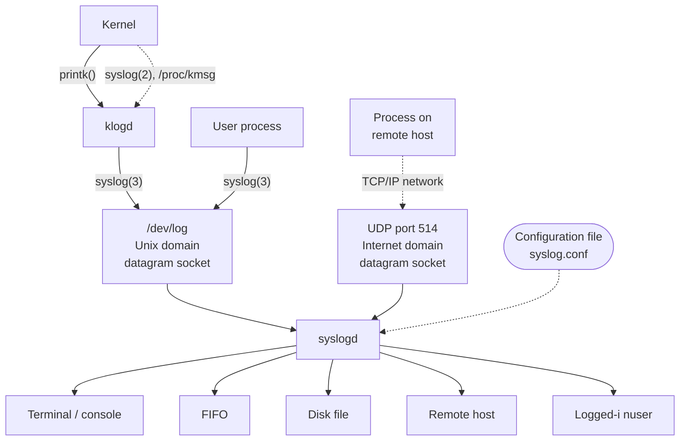

## Chapter 37
# **DAEMONS**

This chapter examines the characteristics of daemon processes and looks at the steps required to turn a process into a daemon. We also look at how to log messages from a daemon using the syslog facility.

## **37.1 Overview**

A daemon is a process with the following characteristics:

-  It is long-lived. Often, a daemon is created at system startup and runs until the system is shut down.
-  It runs in the background and has no controlling terminal. The lack of a controlling terminal ensures that the kernel never automatically generates any job-control or terminal-related signals (such as SIGINT, SIGTSTP, and SIGHUP) for a daemon.

Daemons are written to carry out specific tasks, as illustrated by the following examples:

-  cron: a daemon that executes commands at a scheduled time.
-  sshd: the secure shell daemon, which permits logins from remote hosts using a secure communications protocol.

-  httpd: the HTTP server daemon (Apache), which serves web pages.
-  inetd: the Internet superserver daemon (described in Section 60.5), which listens for incoming network connections on specified TCP/IP ports and launches appropriate server programs to handle these connections.

Many standard daemons run as privileged processes (i.e., effective user ID of 0), and thus should be coded following the guidelines provided in Chapter [38.](#page-50-0)

It is a convention (not universally observed) that daemons have names ending with the letter d.

> On Linux, certain daemons are run as kernel threads. The code of such daemons is part of the kernel, and they are typically created during system startup. When listed using ps(1), the names of these daemons are surrounded by square brackets ([]). One example of a kernel thread is pdflush, which periodically flushes dirty pages (e.g., pages from the buffer cache) to disk.

### **37.2 Creating a Daemon**

To become a daemon, a program performs the following steps:

- 1. Perform a fork(), after which the parent exits and the child continues. (As a consequence, the daemon becomes a child of the init process.) This step is done for two reasons:
  - Assuming the daemon was started from the command line, the parent's termination is noticed by the shell, which then displays another shell prompt and leaves the child to continue in the background.
  - The child process is guaranteed not to be a process group leader, since it inherited its process group ID from its parent and obtained its own unique process ID, which differs from the inherited process group ID. This is required in order to be able to successfully perform the next step.
- 2. The child process calls setsid() (Section 34.3) to start a new session and free itself of any association with a controlling terminal.
- 3. If the daemon never opens any terminal devices thereafter, then we don't need to worry about the daemon reacquiring a controlling terminal. If the daemon might later open a terminal device, then we must take steps to ensure that the device does not become the controlling terminal. We can do this in two ways:
  - Specify the O\_NOCTTY flag on any open() that may apply to a terminal device.
  - Alternatively, and more simply, perform a second fork() after the setsid() call, and again have the parent exit and the (grand)child continue. This ensures that the child is not the session leader, and thus, according to the System V conventions for the acquisition of a controlling terminal (which Linux follows), the process can never reacquire a controlling terminal (Section 34.4).

On implementations following the BSD conventions, a process can obtain a controlling terminal only through an explicit ioctl() TIOCSCTTY operation, and so this second fork() has no effect with regard to the acquisition of a controlling terminal, but the superfluous fork() does no harm.

- 4. Clear the process umask (Section 15.4.6), to ensure that, when the daemon creates files and directories, they have the requested permissions.
- 5. Change the process's current working directory, typically to the root directory (/). This is necessary because a daemon usually runs until system shutdown; if the daemon's current working directory is on a file system other than the one containing /, then that file system can't be unmounted (Section 14.8.2). Alternatively, the daemon can change its working directory to a location where it does its job or a location defined in its configuration file, as long as we know that the file system containing this directory never needs to be unmounted. For example, cron places itself in /var/spool/cron.
- 6. Close all open file descriptors that the daemon has inherited from its parent. (A daemon may need to keep certain inherited file descriptors open, so this step is optional, or open to variation.) This is done for a variety of reasons. Since the daemon has lost its controlling terminal and is running in the background, it makes no sense for the daemon to keep file descriptors 0, 1, and 2 open if these refer to the terminal. Furthermore, we can't unmount any file systems on which the long-lived daemon holds files open. And, as usual, we should close unused open file descriptors because file descriptors are a finite resource.

Some UNIX implementations (e.g., Solaris 9 and some of the recent BSD releases) provide a function named closefrom(n) (or similar), which closes all file descriptors greater than or equal to n. This function isn't available on Linux.

- 7. After having closed file descriptors 0, 1, and 2, a daemon normally opens /dev/null and uses dup2() (or similar) to make all those descriptors refer to this device. This is done for two reasons:
  - It ensures that if the daemon calls library functions that perform I/O on these descriptors, those functions won't unexpectedly fail.
  - It prevents the possibility that the daemon later opens a file using descriptor 1 or 2, which is then written to—and thus corrupted—by a library function that expects to treat these descriptors as standard output and standard error.

/dev/null is a virtual device that always discards the data written to it. When we want to eliminate the standard output or error of a shell command, we can redirect it to this file. Reads from this device always return end-of-file.

We now show the implementation of a function, becomeDaemon(), that performs the steps described above in order to turn the caller into a daemon.

```
#include <syslog.h>
int becomeDaemon(int flags);
                                             Returns 0 on success, or –1 on error
```

The becomeDaeomon() function takes a bit-mask argument, flags, that allows the caller to selectively inhibit some of the steps, as described in the comments in the header file in [Listing 37-1](#page-37-0).

```
––––––––––––––––––––––––––––––––––––––––––––––––––– daemons/become_daemon.h
#ifndef BECOME_DAEMON_H /* Prevent double inclusion */
#define BECOME_DAEMON_H
/* Bit-mask values for 'flags' argument of becomeDaemon() */
#define BD_NO_CHDIR 01 /* Don't chdir("/") */
#define BD_NO_CLOSE_FILES 02 /* Don't close all open files */
#define BD_NO_REOPEN_STD_FDS 04 /* Don't reopen stdin, stdout, and
 stderr to /dev/null */
#define BD_NO_UMASK0 010 /* Don't do a umask(0) */
#define BD_MAX_CLOSE 8192 /* Maximum file descriptors to close if
 sysconf(_SC_OPEN_MAX) is indeterminate */
int becomeDaemon(int flags);
#endif
––––––––––––––––––––––––––––––––––––––––––––––––––– daemons/become_daemon.h
```

The implementation of the becomeDaemon() function is shown in [Listing 37-2.](#page-37-1)

The GNU C library provides a nonstandard function, daemon(), that turns the caller into a daemon. The glibc daemon() function doesn't have an equivalent of the flags argument of our becomeDaemon() function.

<span id="page-37-1"></span>**Listing 37-2:** Creating a daemon process

```
––––––––––––––––––––––––––––––––––––––––––––––––––– daemons/become_daemon.c
#include <sys/stat.h>
#include <fcntl.h>
#include "become_daemon.h"
#include "tlpi_hdr.h"
int /* Returns 0 on success, -1 on error */
becomeDaemon(int flags)
{
 int maxfd, fd;
 switch (fork()) { /* Become background process */
 case -1: return -1;
 case 0: break; /* Child falls through... */
 default: _exit(EXIT_SUCCESS); /* while parent terminates */
 }
 if (setsid() == -1) /* Become leader of new session */
 return -1;
 switch (fork()) { /* Ensure we are not session leader */
 case -1: return -1;
 case 0: break;
 default: _exit(EXIT_SUCCESS);
 }
```

```
 if (!(flags & BD_NO_UMASK0))
 umask(0); /* Clear file mode creation mask */
 if (!(flags & BD_NO_CHDIR))
 chdir("/"); /* Change to root directory */
 if (!(flags & BD_NO_CLOSE_FILES)) { /* Close all open files */
 maxfd = sysconf(_SC_OPEN_MAX);
 if (maxfd == -1) /* Limit is indeterminate... */
 maxfd = BD_MAX_CLOSE; /* so take a guess */
 for (fd = 0; fd < maxfd; fd++)
 close(fd);
 }
 if (!(flags & BD_NO_REOPEN_STD_FDS)) {
 close(STDIN_FILENO); /* Reopen standard fd's to /dev/null */
 fd = open("/dev/null", O_RDWR);
 if (fd != STDIN_FILENO) /* 'fd' should be 0 */
 return -1;
 if (dup2(STDIN_FILENO, STDOUT_FILENO) != STDOUT_FILENO)
 return -1;
 if (dup2(STDIN_FILENO, STDERR_FILENO) != STDERR_FILENO)
 return -1;
 }
 return 0;
}
––––––––––––––––––––––––––––––––––––––––––––––––––– daemons/become_daemon.c
```

If we write a program that makes the call becomeDaemon(0) and then sleeps for a while, we can use ps(1) to look at some of the attributes of the resulting process:

```
$ ./test_become_daemon
$ ps -C test_become_daemon -o "pid ppid pgid sid tty command"
 PID PPID PGID SID TT COMMAND
24731 1 24730 24730 ? ./test_become_daemon
```

We don't show the source code for daemons/test\_become\_daemon.c, since it is trivial, but the program is provided in the source code distribution for this book.

In the output of ps, the ? under the TT heading indicates that the process has no controlling terminal. From the fact that the process ID is not the same as the session ID (SID), we can also see that the process is not the leader of its session, and so won't reacquire a controlling terminal if it opens a terminal device. This is as things should be for a daemon.

## **37.3 Guidelines for Writing Daemons**

As previously noted, a daemon typically terminates only when the system shuts down. Many standard daemons are stopped by application-specific scripts executed during system shutdown. Those daemons that are not terminated in this fashion will receive a SIGTERM signal, which the init process sends to all of its children during system shutdown. By default, SIGTERM terminates a process. If the daemon needs to perform any cleanup before terminating, it should do so by establishing a handler for this signal. This handler must be designed to perform such cleanup quickly, since init follows up the SIGTERM signal with a SIGKILL signal after 5 seconds. (This doesn't mean that the daemon can perform 5 seconds' worth of CPU work; init signals all of the processes on the system at the same time, and they may all be attempting to clean up within that 5 seconds.)

Since daemons are long-lived, we must be particularly wary of possible memory leaks (Section 7.1.3) and file descriptor leaks (where an application fails to close all of the file descriptors it opens). If such bugs affect a daemon, the only remedy is to kill it and restart it after (fixing the bug).

Many daemons need to ensure that just one instance of the daemon is active at one time. For example, it makes no sense to have two copies of the cron daemon both trying to execute scheduled jobs. In Section 55.6, we look at a technique for achieving this.

# **37.4 Using SIGHUP to Reinitialize a Daemon**

The fact that many daemons should run continuously presents a couple of programming hurdles:

-  Typically, a daemon reads operational parameters from an associated configuration file on startup. Sometimes, it is desirable to be able to change these parameters "on the fly," without needing to stop and restart the daemon.
-  Some daemons produce log files. If the daemon never closes the log file, then it may grow endlessly, eventually clogging the file system. (In Section 18.3, we noted that even if we remove the last name of a file, the file continues to exist as long as any process has it open.) What we need is a way of telling the daemon to close its log file and open a new file, so that we can rotate log files as required.

The solution to both of these problems is to have the daemon establish a handler for SIGHUP, and perform the required steps upon receipt of this signal. In Section 34.4, we noted that SIGHUP is generated for the controlling process on disconnection of a controlling terminal. Since a daemon has no controlling terminal, the kernel never generates this signal for a daemon. Therefore, daemons can use SIGHUP for the purpose described here.

> The logrotate program can be used to automate rotation of daemon log files. See the logrotate(8) manual page for details.

[Listing 37-3](#page-41-0) provides an example of how a daemon can employ SIGHUP. This program establishes a handler for SIGHUP w, becomes a daemon e, opens the log file r, and reads its configuration file t. The SIGHUP handler q just sets a global flag variable, hupReceived, which is checked by the main program. The main program sits in a loop, printing a message to the log file every 15 seconds i. The calls to sleep() y in this loop are intended to simulate some sort of processing performed by a real application. After each return from sleep() in this loop, the program checks to see whether hupReceived has been set u; if so, it reopens the log file, rereads the configuration file, and clears the hupReceived flag.

For brevity, the functions logOpen(), logClose(), logMessage(), and readConfigFile() are omitted from [Listing 37-3,](#page-41-0) but are provided with the source code distribution of this book. The first three functions do what we would expect from their names. The readConfigFile() function simply reads a line from the configuration file and echoes it to the log file.

> Some daemons use an alternative method to reinitialize themselves on receipt of SIGHUP: they close all files and then restart themselves with an exec().

The following is an example of what we might see when running the program in [Listing 37-3](#page-41-0). We begin by creating a dummy configuration file and then launching the daemon:

```
$ echo START > /tmp/ds.conf
$ ./daemon_SIGHUP
$ cat /tmp/ds.log View log file
2011-01-17 11:18:34: Opened log file
2011-01-17 11:18:34: Read config file: START
```

Now we modify the configuration file and rename the log file before sending SIGHUP to the daemon:

```
$ echo CHANGED > /tmp/ds.conf
$ date +'%F %X'; mv /tmp/ds.log /tmp/old_ds.log
2011-01-17 11:19:03 AM
$ date +'%F %X'; killall -HUP daemon_SIGHUP
2011-01-17 11:19:23 AM
$ ls /tmp/*ds.log Log file was reopened
/tmp/ds.log /tmp/old_ds.log
$ cat /tmp/old_ds.log View old log file
2011-01-17 11:18:34: Opened log file
2011-01-17 11:18:34: Read config file: START
2011-01-17 11:18:49: Main: 1
2011-01-17 11:19:04: Main: 2
2011-01-17 11:19:19: Main: 3
2011-01-17 11:19:23: Closing log file
```

The output of ls shows that we have both an old and a new log file. When we use cat to view the contents of the old log file, we see that even after the mv command was used to rename the file, the daemon continued to log messages there. At this point, we could delete the old log file if we no longer need it. When we look at the new log file, we see that the configuration file has been reread:

```
$ cat /tmp/ds.log
2011-01-17 11:19:23: Opened log file
2011-01-17 11:19:23: Read config file: CHANGED
2011-01-17 11:19:34: Main: 4
$ killall daemon_SIGHUP Kill our daemon
```

Note that a daemon's log and configuration files are typically placed in standard directories, not in the /tmp directory, as is done in the program in [Listing 37-3.](#page-41-0) By convention, configuration files are placed in /etc or one of its subdirectories, while log files are often placed in /var/log. Daemon programs commonly provide commandline options to specify alternative locations instead of the defaults.

<span id="page-41-0"></span>**Listing 37-3:** Using SIGHUP to reinitialize a daemon

```
––––––––––––––––––––––––––––––––––––––––––––––––––– daemons/daemon_SIGHUP.c
  #include <sys/stat.h>
  #include <signal.h>
  #include "become_daemon.h"
  #include "tlpi_hdr.h"
  static const char *LOG_FILE = "/tmp/ds.log";
  static const char *CONFIG_FILE = "/tmp/ds.conf";
  /* Definitions of logMessage(), logOpen(), logClose(), and
   readConfigFile() are omitted from this listing */
  static volatile sig_atomic_t hupReceived = 0;
   /* Set nonzero on receipt of SIGHUP */
   from
  static void
  sighupHandler(int sig)
  {
q hupReceived = 1;
  }
  int
  main(int argc, char *argv[])
  {
   const int SLEEP_TIME = 15; /* Time to sleep between messages */
   int count = 0; /* Number of completed SLEEP_TIME intervals */
   int unslept; /* Time remaining in sleep interval */
   struct sigaction sa;
   sigemptyset(&sa.sa_mask);
   sa.sa_flags = SA_RESTART;
   sa.sa_handler = sighupHandler;
w if (sigaction(SIGHUP, &sa, NULL) == -1)
   errExit("sigaction");
e if (becomeDaemon(0) == -1)
   errExit("becomeDaemon");
r logOpen(LOG_FILE);
t readConfigFile(CONFIG_FILE);
   unslept = SLEEP_TIME;
   for (;;) {
y unslept = sleep(unslept); /* Returns > 0 if interrupted */
u if (hupReceived) { /* If we got SIGHUP... */
   logClose();
```

```
 logOpen(LOG_FILE);
   readConfigFile(CONFIG_FILE);
   hupReceived = 0; /* Get ready for next SIGHUP */
   }
   if (unslept == 0) { /* On completed interval */
   count++;
i logMessage("Main: %d", count);
   unslept = SLEEP_TIME; /* Reset interval */
   }
   }
  }
  ––––––––––––––––––––––––––––––––––––––––––––––––––– daemons/daemon_SIGHUP.c
```

# **37.5 Logging Messages and Errors Using syslog**

When writing a daemon, one problem we encounter is how to display error messages. Since a daemon runs in the background, we can't display messages on an associated terminal, as we would typically do with other programs. One possible alternative is to write messages to an application-specific log file, as is done in the program in [Listing 37-3.](#page-41-0) The main problem with this approach is that it is difficult for a system administrator to manage multiple application log files and monitor them all for error messages. The syslog facility was devised to address this problem.

### **37.5.1 Overview**

The syslog facility provides a single, centralized logging facility that can be used to log messages by all applications on the system. An overview of this facility is provided in [Figure 37-1.](#page-42-0)



<span id="page-42-0"></span>**Figure 37-1:** Overview of system logging

The syslog facility has two principal components: the syslogd daemon and the syslog(3) library function.

The System Log daemon, syslogd, accepts log messages from two different sources: a UNIX domain socket, /dev/log, which holds locally produced messages, and (if enabled) an Internet domain socket (UDP port 514), which holds messages sent across a TCP/IP network. (On some other UNIX implementations, the syslog socket is located at /var/run/log.)

Each message processed by syslogd has a number of attributes, including a facility, which specifies the type of program generating the message, and a level, which specifies the severity (priority) of the message. The syslogd daemon examines the facility and level of each message, and then passes it along to any of several possible destinations according to the dictates of an associated configuration file, /etc/syslog.conf. Possible destinations include a terminal or virtual console, a disk file, a FIFO, one or more (or all) logged-in users, or a process (typically another syslogd daemon) on another system connected via a TCP/IP network. (Sending the message to a process on another system is useful for reducing administrative overhead by consolidating messages from multiple systems to a single location.) A single message may be sent to multiple destinations (or none at all), and messages with different combinations of facility and level can be targeted to different destinations or to different instances of destinations (i.e., different consoles, different disk files, and so on).

> Sending syslog messages to another system via a TCP/IP network can also help in detecting system break-ins. Break-ins often leave traces in the system log, but attackers usually try to cover up their activities by erasing log records. With remote logging, an attacker would need to break into another system in order to do that.

The syslog(3) library function can be used by any process to log a message. This function, which we describe in detail in a moment, uses its supplied arguments to construct a message in a standard format that is then placed on the /dev/log socket for reading by syslogd.

An alternative source of the messages placed on /dev/log is the Kernel Log daemon, klogd, which collects kernel log messages (produced by the kernel using its printk() function). These messages are collected using either of two equivalent Linux-specific interfaces—the /proc/kmsg file and the syslog(2) system call—and then placed on /dev/log using the syslog(3) library function.

> Although syslog(2) and syslog(3) share the same name, they perform quite different tasks. An interface to syslog(2) is provided in glibc under the name klogctl(). Unless explicitly indicated otherwise, when we refer to syslog() in this section, we mean syslog(3).

The syslog facility originally appeared in 4.2BSD, but is now provided on most UNIX implementations. SUSv3 has standardized syslog(3) and related functions, but leaves the implementation and operation of syslogd, as well as the format of the syslog.conf file, unspecified. The Linux implementation of syslogd differs from the original BSD facility in permitting some extensions to the message-processing rules that can be specified in syslog.conf.

### **37.5.2 The syslog API**

The syslog API consists of three main functions:

-  The openlog() function establishes default settings that apply to subsequent calls to syslog(). The use of openlog() is optional. If it is omitted, a connection to the logging facility is established with default settings on the first call to syslog().
-  The syslog() function logs a message.
-  The closelog() function is called after we have finished logging messages, to disestablish the connection with the log.

None of these functions returns a status value. In part, this is because system logging should always be available (the system administrator is soon likely to notice if it is not). Furthermore, if an error occurs with system logging, there is typically little that the application can usefully do to report it.

> The GNU C library also provides the function void vsyslog(int priority, const char \*format, va\_list args). This function performs the same task as syslog(), but takes an argument list previously processed by the stdarg(3) API. (Thus, vsyslog() is to syslog() what vprintf() is to printf().) SUSv3 doesn't specify vsyslog(), and it is not available on all UNIX implementations.

### **Establishing a connection to the system log**

The openlog() function optionally establishes a connection to the system log facility and sets defaults that apply to subsequent syslog() calls.

```
#include <syslog.h>
void openlog(const char *ident, int log_options, int facility);
```

The ident argument is a pointer to a string that is included in each message written by syslog(); typically, the program name is specified for this argument. Note that openlog() merely copies the value of this pointer. As long as it continues to call syslog(), the application should ensure that the referenced string is not later changed.

> If ident is specified as NULL, then, like some other implementations, the glibc syslog implementation automatically uses the program name as the ident value. However, this feature is not required by SUSv3, and is not provided on some implementations. Portable applications should avoid reliance on it.

The log\_options argument to openlog() is a bit mask created by ORing together any of the following constants:

```
LOG_CONS
```

If there is an error sending to the system logger, then write the message to the system console (/dev/console).

#### LOG\_NDELAY

Open the connection to the logging system (i.e., the underlying UNIX domain socket, /dev/log) immediately. By default (LOG\_ODELAY), the connection is opened only when (and if) the first message is logged with syslog(). The O\_NDELAY flag is useful in programs that need to precisely control when the file descriptor for /dev/log is allocated. One example of such a requirement is in a program that calls chroot(). After a chroot() call, the /dev/log pathname will no longer be visible, and so an openlog() call specifying LOG\_NDELAY must be performed before the chroot(). The tftpd (Trivial File Transfer) daemon is an example of a program that uses LOG\_NDELAY for this purpose.

#### LOG\_NOWAIT

Don't wait() for any child process that may have been created in order to log the message. On implementations that create a child process for logging messages, LOG\_NOWAIT is needed if the caller is also creating and waiting for children, so that syslog() doesn't attempt to wait for a child that has already been reaped by the caller. On Linux, LOG\_NOWAIT has no effect, since no child processes are created when logging a message.

#### LOG\_ODELAY

This flag is the converse of LOG\_NDELAY—connecting to the logging system is delayed until the first message is logged. This is the default, and need not be specified.

#### LOG\_PERROR

Write messages to standard error as well as to the system log. Typically, daemon processes close standard error or redirect it to /dev/null, in which case, LOG\_PERROR is not useful.

#### LOG\_PID

Log the caller's process ID with each message. Employing LOG\_PID in a server that forks multiple children allows us to distinguish which process logged a particular message.

All of the above constants are specified in SUSv3, except LOG\_PERROR, which appears on many (but not all) other UNIX implementations.

The facility argument to openlog() specifies the default facility value to be used in subsequent calls to syslog(). Possible values for this argument are listed in Table 37-1.

The majority of the facility values in Table 37-1 appear in SUSv3, as indicated by the SUSv3 column of the table. Exceptions are LOG\_AUTHPRIV and LOG\_FTP, which appear on only a few other UNIX implementations, and LOG\_SYSLOG, which appears on most implementations. The LOG\_AUTHPRIV value is useful for logging messages containing passwords or other sensitive information to a different location than LOG\_AUTH.

The LOG\_KERN facility value is used for kernel messages. Log messages for this facility can't be generated from the user-space programs. The LOG\_KERN constant has the value 0. If it is used in a syslog() call, the 0 translates to "use the default level."

**Table 37-1:** facility values for openlog() and the priority argument of syslog()

| Value        | Description                                              | SUSv3 |
|--------------|----------------------------------------------------------|-------|
| LOG_AUTH     | Security and authorization messages (e.g., su)           | •     |
| LOG_AUTHPRIV | Private security and authorization messages              |       |
| LOG_CRON     | Messages from the cron and at daemons                    | •     |
| LOG_DAEMON   | Messages from other system daemons                       | •     |
| LOG_FTP      | Messages from the ftp daemon (ftpd)                      |       |
| LOG_KERN     | Kernel messages (can't be generated from a user process) | •     |
| LOG_LOCAL0   | Reserved for local use (also LOG_LOCAL1 to LOG_LOCAL7)   | •     |
| LOG_LPR      | Messages from the line printer system (lpr, lpd, lpc)    | •     |
| LOG_MAIL     | Messages from the mail system                            | •     |
| LOG_NEWS     | Messages related to Usenet network news                  | •     |
| LOG_SYSLOG   | Internal messages from the syslogd daemon                |       |
| LOG_USER     | Messages generated by user processes (default)           | •     |
| LOG_UUCP     | Messages from the UUCP system                            | •     |

#### **Logging a message**

To write a log message, we call syslog().

```
#include <syslog.h>
void syslog(int priority, const char *format, ...);
```

The priority argument is created by ORing together a facility value and a level value. The facility indicates the general category of the application logging the message, and is specified as one of the values listed in Table 37-1. If omitted, the facility defaults to the value specified in a previous openlog() call, or to LOG\_USER if that call was omitted. The level value indicates the severity of the message, and is specified as one of the values in [Table 37-2.](#page-46-0) All of the level values listed in this table appear in SUSv3.

<span id="page-46-0"></span>**Table 37-2:** level values for the priority argument of syslog() (from highest to lowest severity)

| Value       | Description                                                          |
|-------------|----------------------------------------------------------------------|
| LOG_EMERG   | Emergency or panic condition (system is unusable)                    |
| LOG_ALERT   | Condition requiring immediate action (e.g., corrupt system database) |
| LOG_CRIT    | Critical condition (e.g., error on disk device)                      |
| LOG_ERR     | General error condition                                              |
| LOG_WARNING | Warning message                                                      |
| LOG_NOTICE  | Normal condition that may require special handling                   |
| LOG_INFO    | Informational message                                                |
| LOG_DEBUG   | Debugging message                                                    |

The remaining arguments to syslog() are a format string and corresponding arguments in the manner of printf(). One difference from printf() is that the format string doesn't need to include a terminating newline character. Also, the format string may include the 2-character sequence %m, which is replaced by the error string corresponding to the current value of errno (i.e., the equivalent of strerror(errno)).

The following code demonstrates the use of openlog() and syslog():

```
openlog(argv[0], LOG_PID | LOG_CONS | LOG_NOWAIT, LOG_LOCALO);
syslog(LOG_ERROR, "Bad argument: %s", argv[1]);
syslog(LOG_USER | LOG_INFO, "Exiting");
```

Since no facility is specified in the first syslog() call, the default specified by openlog() (LOG\_LOCAL0) is used. In the second syslog() call, explicitly specifying LOG\_USER overrides the default established by openlog().

> From the shell, we can use the logger(1) command to add entries to the system log. This command allows specification of the level (priority) and ident (tag) to be associated with the logged messages. For further details, see the logger(1) manual page. The logger command is (weakly) specified in SUSv3, and a version of this command is provided on most UNIX implementations.

It is an error to use syslog() to write some user-supplied string in the following manner:

```
syslog(priority, user_supplied_string);
```

The problem with this code is that it leaves the application open to so-called formatstring attacks. If the user-supplied string contains format specifiers (e.g., %s), then the results are unpredictable and, from a security point of view, potentially dangerous. (The same observation applies to the use of the conventional printf() function.) We should instead rewrite the above call as follows:

```
syslog(priority, "%s", user_supplied_string);
```

### **Closing the log**

When we have finished logging, we can call closelog() to deallocate the file descriptor used for the /dev/log socket.

```
#include <syslog.h>
void closelog(void);
```

Since a daemon typically keeps a connection open to the system log continuously, it is common to omit calling closelog().

### **Filtering log messages**

The setlogmask() function sets a mask that filters the messages written by syslog().

```
#include <syslog.h>
int setlogmask(int mask_priority);
                                              Returns previous log priority mask
```

Any message whose level is not included in the current mask setting is discarded. The default mask value allows all severity levels to be logged.

The macro LOG\_MASK() (defined in <syslog.h>) converts the level values of [Table 37-2](#page-46-0) to bit values suitable for passing to setlogmask(). For example, to discard all messages except those with priorities of LOG\_ERR and above, we would make the following call:

```
setlogmask(LOG_MASK(LOG_EMERG) | LOG_MASK(LOG_ALERT) |
 LOG_MASK(LOG_CRIT) | LOG_MASK(LOG_ERR));
```

The LOG\_MASK() macro is specified by SUSv3. Most UNIX implementations (including Linux) also provide the unspecified macro LOG\_UPTO(), which creates a bit mask filtering all messages of a certain level and above. Using this macro, we can simplify the previous setlogmask() call to the following:

```
setlogmask(LOG_UPTO(LOG_ERR));
```

### **37.5.3 The /etc/syslog.conf File**

The /etc/syslog.conf configuration file controls the operation of the syslogd daemon. This file consists of rules and comments (starting with a # character). Rules have the following general form:

```
facility.level action
```

Together, the facility and level are referred to as the selector, since they select the messages to which the rule applies. These fields are strings corresponding to the values listed in Table 37-1 and [Table 37-2.](#page-46-0) The action specifies where to send the messages matching this selector. White space separates the selector and the action parts of a rule. The following are examples of rules:

```
*.err /dev/tty10
auth.notice root
*.debug;mail.none;news.none -/var/log/messages
```

The first rule says that messages from all facilities (\*) with a level of err (LOG\_ERR) or higher should be sent to the /dev/tty10 console device. The second rule says that authorization facility (LOG\_AUTH) messages with a level of notice (LOG\_NOTICE) or higher should be sent to any consoles or terminals where root is logged in. This particular rule would allow a logged-in root user to immediately see messages about failed su attempts, for example.

The last rule demonstrates several of the more advanced features of rule syntax. A rule can contain multiple selectors separated by semicolons. The first selector specifies all messages, using the \* wildcard for facility and debug for level, meaning all messages of level debug (the lowest level) and higher. (On Linux, as on some other UNIX implementations, it is possible to specify level as \*, with the same meaning as debug. However, this feature is not available to all syslog implementations.) Normally, a rule that contains multiple selectors matches messages corresponding to any of the selectors, but specifying a level of none has the effect of excluding all messages belonging to the corresponding facility. Thus, this rule sends all messages except those for the mail and news facilities to the file /var/log/messages. The hyphen (-) preceding the name of this file specifies that a sync to the disk does not occur on each write to the file (refer to Section 13.3). This means that writes are faster, but some data may be lost if the system crashes soon after the write.

Whenever we change the syslog.conf file, we must ask the daemon to reinitialize itself from this file in the usual fashion:

\$ **killall -HUP syslogd** Send SIGHUP to syslogd

Further features of the syslog.conf rule syntax allow for much more powerful rules than we have shown. Full details are provided in the syslog.conf(5) manual page.

## **37.6 Summary**

A daemon is a long-lived process that has no controlling terminal (i.e., it runs in the background). Daemons perform specific tasks, such as providing a network login facility or serving web pages. To become a daemon, a program performs a standard sequence of steps, including calls to fork() and setsid().

Where appropriate, daemons should correctly handle the arrival of the SIGTERM and SIGHUP signals. The SIGTERM signal should result in an orderly shutdown of the daemon, while the SIGHUP signal provides a way to trigger the daemon to reinitialize itself by rereading its configuration file and reopening any log files it may be using.

The syslog facility provides a convenient way for daemons (and other applications) to log error and other messages to a central location. These messages are processed by the syslogd daemon, which redistributes the messages according to the dictates of the syslogd.conf configuration file. Messages may be redistributed to a number of targets, including terminals, disk files, logged-in users, and, via a TCP/IP network, to other processes on remote hosts (typically other syslogd daemons).

#### **Further information**

Perhaps the best source of further information about writing daemons is the source code of various existing daemons.

### **37.7 Exercise**

**37-1.** Write a program (similar to logger(1)) that uses syslog(3) to write arbitrary messages to the system log file. As well as accepting a single command-line argument containing the message to be logged, the program should permit an option to specify the level of the message.

