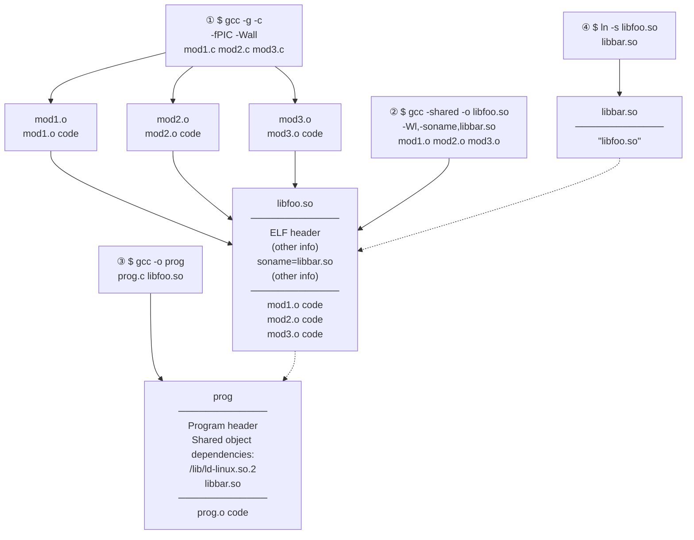
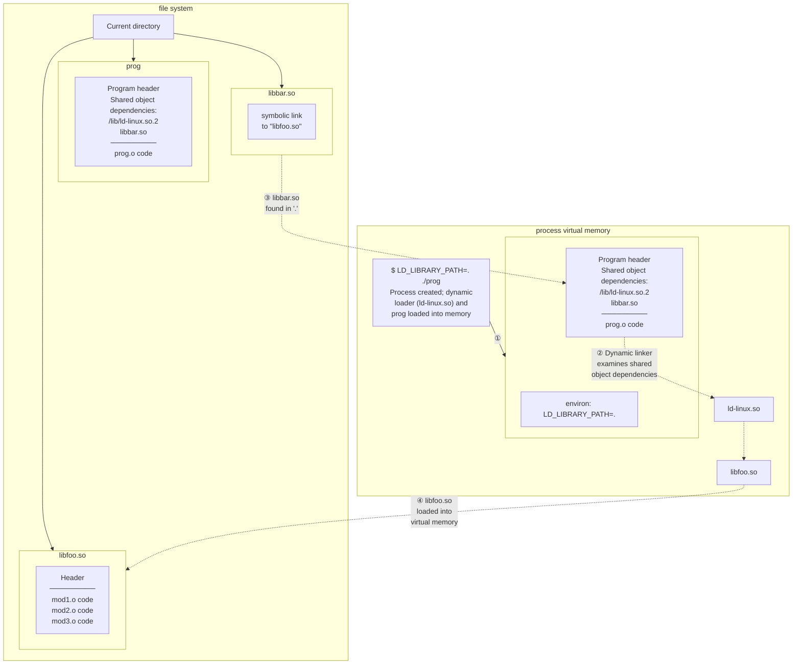

## Chapter 41
# **FUNDAMENTALS OF SHARED LIBRARIES**

Shared libraries are a technique for placing library functions into a single unit that can be shared by multiple processes at run time. This technique can save both disk space and RAM. This chapter covers the fundamentals of shared libraries. The next chapter covers a number of advanced features of shared libraries.

### **41.1 Object Libraries**

One way of building a program is simply to compile each of its source files to produce corresponding object files, and then link all of these object files together to produce the executable program, like so:

```
$ cc -g -c prog.c mod1.c mod2.c mod3.c
$ cc -g -o prog_nolib prog.o mod1.o mod2.o mod3.o
```

Linking is actually performed by the separate linker program, ld. When we link a program using the cc (or gcc) command, the compiler invokes ld behind the scenes. On Linux, the linker should always be invoked indirectly via gcc, since gcc ensures that ld is invoked with the correct options and links the program against the correct library files.

In many cases, however, we may have source files that are used by several programs. As a first step toward saving ourselves some work, we could compile these source files just once, and then link them into different executables as required. Although this technique saves us compilation time, it still suffers from the disadvantage that we must name all of the object files during the link phase. Furthermore, our directories may be inconveniently cluttered with a large number of object files.

To get around these problems, we can group a set of object files into a single unit, known as an object library. Object libraries are of two types: static and shared. Shared libraries are the more modern type of object library, and provide several advantages over static libraries, as we describe in Section [41.3](#page-103-0).

### **An aside: including debugger information when compiling a program**

In the cc command shown above, we used the –g option to include debugging information in the compiled program. In general, it is a good idea to always create programs and libraries that allow debugging. (In earlier times, debugging information was sometimes omitted so that the resulting executable used less disk and RAM, but nowadays disk and RAM are cheap.)

In addition, on some architectures, such as x86-32, the –fomit–frame–pointer option should not be specified because this makes debugging impossible. (On some architectures, such as x86-64, this option is enabled by default since it doesn't prevent debugging.) For the same reason, executables and libraries should not be stripped of debugging information using strip(1).

# **41.2 Static Libraries**

Before starting our discussion of shared libraries, we begin with a brief description of static libraries in order to make clear the differences and advantages of shared libraries.

Static libraries, also known as archives, were the first type of library to be provided on UNIX systems. They provide the following benefits:

-  We can place a set of commonly used object files into a single library file that can then be used to build multiple executables, without needing to recompile the original source files when building each application.
-  Link commands become simpler. Instead of listing a long series of object files on the link command line, we specify just the name of the static library. The linker knows how to search the static library and extract the objects required by the executable.

### **Creating and maintaining a static library**

In effect, a static library is simply a file holding copies of all of the object files added to it. The archive also records various attributes of each of the component object files, including file permissions, numeric user and group IDs, and last modification time. By convention, static libraries have names of the form libname.a.

A static library is created and maintained using the ar(1) command, which has the following general form:

\$ **ar** *options archive object-file*...

The options argument consists of a series of letters, one of which is the operation code, while the others are modifiers that influence the way the operation is carried out. Some commonly used operation codes are the following:

 r (replace): Insert an object file into the archive, replacing any previous object file of the same name. This is the standard method for creating and updating an archive. Thus, we might build an archive with the following commands:

```
$ cc -g -c mod1.c mod2.c mod3.c
$ ar r libdemo.a mod1.o mod2.o mod3.o
$ rm mod1.o mod2.o mod3.o
```

As shown above, after building the library, we can delete the original object files if desired, since they are no longer required.

 t (table of contents): Display a table of contents of the archive. By default, this lists just the names of the object files in the archive. By adding the v (verbose) modifier, we additionally see all of the other attributes recorded in the archive for each object file, as in the following example:

```
$ ar tv libdemo.a
rw-r--r-- 1000/100 1001016 Nov 15 12:26 2009 mod1.o
rw-r--r-- 1000/100 406668 Nov 15 12:21 2009 mod2.o
rw-r--r-- 1000/100 46672 Nov 15 12:21 2009 mod3.o
```

The additional attributes that we see for each object are, from left to right, its permissions when it was added to the archive, its user ID and group ID, its size, and the date and time when it was last modified.

 d (delete): Delete a named module from the archive, as in this example:

```
$ ar d libdemo.a mod3.o
```

#### **Using a static library**

We can link a program against a static library in two ways. The first is to name the static library as part of the link command, as in the following:

```
$ cc -g -c prog.c
$ cc -g -o prog prog.o libdemo.a
```

Alternatively, we can place the library in one of the standard directories searched by the linker (e.g., /usr/lib), and then specify the library name (i.e., the filename of the library without the lib prefix and .a suffix) using the –l option:

```
$ cc -g -o prog prog.o -ldemo
```

If the library resides in a directory not normally searched by the linker, we can specify that the linker should search this additional directory using the –L option:

```
$ cc -g -o prog prog.o -Lmylibdir -ldemo
```

Although a static library may contain many object modules, the linker includes only those modules that the program requires.

Having linked the program, we can run it in the usual way:

\$ **./prog** Called mod1-x1 Called mod2-x2

# <span id="page-103-0"></span>**41.3 Overview of Shared Libraries**

When a program is built by linking against a static library (or, for that matter, without using a library at all), the resulting executable file includes copies of all of the object files that were linked into the program. Thus, when several different executables use the same object modules, each executable has its own copy of the object modules. This redundancy of code has several disadvantages:

-  Disk space is wasted storing multiple copies of the same object modules. Such wastage can be considerable.
-  If several different programs using the same modules are running at the same time, then each holds separate copies of the object modules in virtual memory, thus increasing the overall virtual memory demands on the system.
-  If a change is required (perhaps a security or bug fix) to an object module in a static library, then all executables using that module must be relinked in order to incorporate the change. This disadvantage is further compounded by the fact that the system administrator needs to be aware of which applications were linked against the library.

Shared libraries were designed to address these shortcomings. The key idea of a shared library is that a single copy of the object modules is shared by all programs requiring the modules. The object modules are not copied into the linked executable; instead, a single copy of the library is loaded into memory at run time, when the first program requiring modules from the shared library is started. When other programs using the same shared library are later executed, they use the copy of the library that is already loaded into memory. The use of shared libraries means that executable programs require less space on disk and (when running) in virtual memory.

> Although the code of a shared library is shared among multiple processes, its variables are not. Each process that uses the library has its own copies of the global and static variables that are defined within the library.

Shared libraries provide the following further advantages:

-  Because overall program size is smaller, in some cases, programs can be loaded into memory and started more quickly. This point holds true only for large shared libraries that are already in use by another program. The first program to load a shared library will actually take longer to start, since the shared library must be found and loaded into memory.
-  Since object modules are not copied into the executable files, but instead maintained centrally in the shared library, it is possible (subject to limitations described in Section [41.8](#page-117-0)) to make changes to the object modules without requiring programs to be relinked in order to see the changes. Such changes can be carried out even while running programs are using an existing version of the shared library.

The principal costs of this added functionality are the following:

- Shared libraries are more complex than static libraries, both at the conceptual level, and at the practical level of creating shared libraries and building the programs that use them.
- Shared libraries must be compiled to use position-independent code (described in Section 41.4.2), which has a performance overhead on most architectures because it requires the use of an extra register ([Hubička, 2003]).
- Symbol relocation must be performed at run time. During symbol relocation, references to each symbol (a variable or function) in a shared library need to be modified to correspond to the actual run-time location at which the symbol is placed in virtual memory. Because of this relocation process, a program using a shared library may take a little more time to execute than its statically linked equivalent.

One further use of shared libraries is as a building block in the *Java Native Interface* (JNI), which allows Java code to directly access features of the underlying operating system by calling C functions within a shared library. For further information, see [Liang, 1999] and [Rochkind, 2004].

### 41.4 Creating and Using Shared Libraries—A First Pass

To begin understanding how shared libraries operate, we look at the minimum sequence of steps required to build and use a shared library. For the moment, we'll ignore the convention that is normally used to name shared library files. This convention, described in Section 41.6, allows programs to automatically load the most up-to-date version of the libraries they require, and also allows multiple incompatible versions (so-called *major versions*) of a library to coexist peacefully.

In this chapter, we concern ourselves only with Executable and Linking Format (ELF) shared libraries, since ELF is the format employed for executables and shared libraries in modern versions of Linux, as well as in many other UNIX implementations.

ELF supersedes the older *a.out* and *COFF* formats.

### 41.4.1 Creating a Shared Library

In order to build a shared version of the static library we created earlier, we perform the following steps:

```
$ gcc -g -c -fPIC -Wall mod1.c mod2.c mod3.c
$ gcc -g -shared -o libfoo.so mod1.o mod2.o mod3.o
```

The first of these commands creates the three object modules that are to be put into the library. (We explain the *cc -fPIC* option in the next section.) The *cc -shared* command creates a shared library containing the three object modules.

By convention, shared libraries have the prefix lib and the suffix .so (for *shared object*).

In our examples, we use the gcc command, rather than the equivalent cc command, to emphasize that the command-line options we are using to create shared libraries

are compiler-dependent. Using a different C compiler on another UNIX implementation will probably require different options.

Note that it is possible to compile the source files and create the shared library in a single command:

```
$ gcc -g -fPIC -Wall mod1.c mod2.c mod3.c -shared -o libfoo.so
```

However, to clearly distinguish the compilation and library building steps, we'll write the two as separate commands in the examples shown in this chapter.

Unlike static libraries, it is not possible to add or remove individual object modules from a previously built shared library. As with normal executables, the object files within a shared library no longer maintain distinct identities.

### <span id="page-105-0"></span>**41.4.2 Position-Independent Code**

The cc –fPIC option specifies that the compiler should generate position-independent code. This changes the way that the compiler generates code for operations such as accessing global, static, and external variables; accessing string constants; and taking the addresses of functions. These changes allow the code to be located at any virtual address at run time. This is necessary for shared libraries, since there is no way of knowing at link time where the shared library code will be located in memory. (The run-time memory location of a shared library depends on various factors, such as the amount of memory already taken up by the program that is loading the library and which other shared libraries the program has already loaded.)

On Linux/x86-32, it is possible to create a shared library using modules compiled without the –fPIC option. However, doing so loses some of the benefits of shared libraries, since pages of program text containing position-dependent memory references are not shared across processes. On some architectures, it is impossible to build shared libraries without the –fPIC option.

In order to determine whether an existing object file has been compiled with the –fPIC option, we can check for the presence of the name \_GLOBAL\_OFFSET\_TABLE\_ in the object file's symbol table, using either of the following commands:

```
$ nm mod1.o | grep _GLOBAL_OFFSET_TABLE_
$ readelf -s mod1.o | grep _GLOBAL_OFFSET_TABLE_
```

Conversely, if either of the following equivalent commands yields any output, then the specified shared library includes at least one object module that was not compiled with –fPIC:

```
$ objdump --all-headers libfoo.so | grep TEXTREL
$ readelf -d libfoo.so | grep TEXTREL
```

The string TEXTREL indicates the presence of an object module whose text segment contains a reference that requires run-time relocation.

We say more about the nm, readelf, and objdump commands in Section [41.5](#page-110-0).

### **41.4.3 Using a Shared Library**

In order to use a shared library, two steps must occur that are not required for programs that use static libraries:

-  Since the executable file no longer contains copies of the object files that it requires, it must have some mechanism for identifying the shared library that it needs at run time. This is done by embedding the name of the shared library inside the executable during the link phase. (In ELF parlance, the library dependency is recorded in a DT\_NEEDED tag in the executable.) The list of all of a program's shared library dependencies is referred to as its dynamic dependency list.
-  At run time, there must be some mechanism for resolving the embedded library name—that is, for finding the shared library file corresponding to the name specified in the executable file—and then loading the library into memory, if it is not already present.

Embedding the name of the library inside the executable happens automatically when we link our program with a shared library:

```
$ gcc -g -Wall -o prog prog.c libfoo.so
```

If we now attempt to run our program, we receive the following error message:

```
$ ./prog
./prog: error in loading shared libraries: libfoo.so: cannot
open shared object file: No such file or directory
```

This brings us to the second required step: dynamic linking, which is the task of resolving the embedded library name at run time. This task is performed by the dynamic linker (also called the dynamic linking loader or the run-time linker). The dynamic linker is itself a shared library, named /lib/ld-linux.so.2, which is employed by every ELF executable that uses shared libraries.

> The pathname /lib/ld-linux.so.2 is normally a symbolic link pointing to the dynamic linker executable file. This file has the name ld-version.so, where version is the glibc version installed on the system—for example, ld-2.11.so. The pathname of the dynamic linker differs on some architectures. For example, on IA-64, the dynamic linker symbolic link is named /lib/ld-linux-ia64.so.2.

The dynamic linker examines the list of shared libraries required by a program and uses a set of predefined rules in order to find the library files in the file system. Some of these rules specify a set of standard directories in which shared libraries normally reside. For example, many shared libraries reside in /lib and /usr/lib. The error message above occurs because our library resides in the current working directory, which is not part of the standard list searched by the dynamic linker.

> Some architectures (e.g., zSeries, PowerPC64, and x86-64) support execution of both 32-bit and 64-bit programs. On such systems, the 32-bit libraries reside in \*/lib subdirectories, and the 64-bit libraries reside in \*/lib64 subdirectories.

### **The LD\_LIBRARY\_PATH environment variable**

One way of informing the dynamic linker that a shared library resides in a nonstandard directory is to specify that directory as part of a colon-separated list of directories in the LD\_LIBRARY\_PATH environment variable. (Semicolons can also be used to separate the directories, in which case the list must be quoted to prevent the shell from interpreting the semicolons.) If LD\_LIBRARY\_PATH is defined, then the dynamic linker searches for the shared library in the directories it lists before looking in the standard library directories. (Later, we'll see that a production application should never rely on LD\_LIBRARY\_PATH, but for now, this variable provides us with a simple way of getting started with shared libraries.) Thus, we can run our program with the following command:

```
$ LD_LIBRARY_PATH=. ./prog
Called mod1-x1
Called mod2-x2
```

The (bash, Korn, and Bourne) shell syntax used in the above command creates an environment variable definition within the process executing prog. This definition tells the dynamic linker to search for shared libraries in ., the current working directory.

> An empty directory specification in the LD\_LIBRARY\_PATH list (e.g., the middle specification in dirx::diry) is equivalent to ., the current working directory (but note that setting LD\_LIBRARY\_PATH to an empty string does not achieve the same result). We avoid this usage (SUSv3 discourages the corresponding usage in the PATH environment variable).

### **Static linking and dynamic linking contrasted**

Commonly, the term linking is used to describe the use of the linker, ld, to combine one or more compiled object files into a single executable file. Sometimes, the term static linking is used to distinguish this step from dynamic linking, the run-time loading of the shared libraries used by an executable. (Static linking is sometimes also referred to as link editing, and a static linker such as ld is sometimes referred to as a link editor.) Every program—including those that use shared libraries—goes through a static-linking phase. At run time, a program that employs shared libraries additionally undergoes dynamic linking.

### **41.4.4 The Shared Library Soname**

In the example presented so far, the name that was embedded in the executable and sought by the dynamic linker at run time was the actual name of the shared library file. This is referred to as the library's real name. However, it is possible—in fact, usual—to create a shared library with a kind of alias, called a soname (the DT\_SONAME tag in ELF parlance).

If a shared library has a soname, then, during static linking, the soname is embedded in the executable file instead of the real name, and subsequently used by the dynamic linker when searching for the library at run time. The purpose of the soname is to provide a level of indirection that permits an executable to use, at run time, a version of the shared library that is different from (but compatible with) the library against which it was linked.

In Section [41.6](#page-111-0), we'll look at the conventions used for the shared library real name and soname. For now, we show a simplified example to demonstrate the principles.

The first step in using a soname is to specify it when the shared library is created:

```
$ gcc -g -c -fPIC -Wall mod1.c mod2.c mod3.c
$ gcc -g -shared -Wl,-soname,libbar.so -o libfoo.so mod1.o mod2.o mod3.o
```

The –Wl,–soname,libbar.so option is an instruction to the linker to mark the shared library libfoo.so with the soname libbar.so.

If we want to determine the soname of an existing shared library, we can use either of the following commands:

```
$ objdump -p libfoo.so | grep SONAME
 SONAME libbar.so
$ readelf -d libfoo.so | grep SONAME
 0x0000000e (SONAME) Library soname: [libbar.so]
```

Having created a shared library with a soname, we then create the executable as usual:

```
$ gcc -g -Wall -o prog prog.c libfoo.so
```

However, this time, the linker detects that the library libfoo.so contains the soname libbar.so and embeds the latter name inside the executable.

Now when we attempt to run the program, this is what we see:

```
$ LD_LIBRARY_PATH=. ./prog
prog: error in loading shared libraries: libbar.so: cannot open
shared object file: No such file or directory
```

The problem here is that the dynamic linker can't find anything named libbar.so. When using a soname, one further step is required: we must create a symbolic link from the soname to the real name of the library. This symbolic link must be created in one of the directories searched by the dynamic linker. Thus, we could run our program as follows:

```
$ ln -s libfoo.so libbar.so Create soname symbolic link in current directory
$ LD_LIBRARY_PATH=. ./prog
Called mod1-x1
Called mod2-x2
```

Figure 41-1 shows the compilation and linking steps involved in producing a shared library with an embedded soname, linking a program against that shared library, and creating the soname symbolic link needed to run the program.



<span id="page-109-0"></span>Figure 41-1: Creating a shared library and linking a program against it

Figure 41-2 shows the steps that occur when the program created in Figure 41-1 is loaded into memory in preparation for execution.

To find out which shared libraries a process is currently using, we can list the contents of the corresponding Linux-specific /proc/PID/maps file (Section 48.5).



<span id="page-110-1"></span>**Figure 41-2:** Execution of a program that loads a shared library

### <span id="page-110-0"></span>**41.5 Useful Tools for Working with Shared Libraries**

In this section, we briefly describe a few tools that are useful for analyzing shared libraries, executable files, and compiled object (.o) files.

#### **The ldd command**

The ldd(1) (list dynamic dependencies) command displays the shared libraries that a program (or a shared library) requires to run. Here's an example:

```
$ ldd prog
 libdemo.so.1 => /usr/lib/libdemo.so.1 (0x40019000)
 libc.so.6 => /lib/tls/libc.so.6 (0x4017b000)
 /lib/ld-linux.so.2 => /lib/ld-linux.so.2 (0x40000000)
```

The ldd command resolves each library reference (employing the same search conventions as the dynamic linker) and displays the results in the following form:

```
library-name => resolves-to-path
```

For most ELF executables, ldd will list entries for at least ld-linux.so.2, the dynamic linker, and libc.so.6, the standard C library.

> The name of the C library is different on some architectures. For example, this library is named libc.so.6.1 on IA-64 and Alpha.

#### **The objdump and readelf commands**

The objdump command can be used to obtain various information—including disassembled binary machine code—from an executable file, compiled object, or shared library. It can also be used to display information from the headers of the various ELF sections of these files; in this usage, it resembles readelf, which displays similar information, but in a different format. Sources of further information about objdump and readelf are listed at the end of this chapter.

### **The nm command**

The nm command lists the set of symbols defined within an object library or executable program. One use of this command is to find out which of several libraries defines a symbol. For example, to find out which library defines the crypt() function, we could do the following:

```
$ nm -A /usr/lib/lib*.so 2> /dev/null | grep ' crypt$'
/usr/lib/libcrypt.so:00007080 W crypt
```

The –A option to nm specifies that the library name should be listed at the start of each line displaying a symbol. This is necessary because, by default, nm lists the library name once, and then, on subsequent lines, all of the symbols it contains, which isn't useful for the kind of filtering shown in the above example. In addition, we discard standard error output in order to hide error messages about files in formats unrecognized by nm. From the above output, we can see that crypt() is defined in the libcrypt library.

# <span id="page-111-0"></span>**41.6 Shared Library Versions and Naming Conventions**

Let's consider what is entailed by shared library versioning. Typically, successive versions of a shared library are compatible with one another, meaning that the functions in each module present the same calling interface and are semantically equivalent (i.e., they achieve identical results). Such differing but compatible versions are referred to as minor versions of a shared library. Occasionally, however, it is necessary to create a new major version of a library—one that is incompatible with a previous version. (In Section [41.8,](#page-117-0) we'll see more precisely what may cause such incompatibilities.) At the same time, it must still be possible to continue running programs that require the older version of the library.

To deal with these versioning requirements, a standard naming convention is employed for shared library real names and sonames.

#### **Real names, sonames, and linker names**

Each incompatible version of a shared library is distinguished by a unique major version identifier, which forms part of its real name. By convention, the major version identifier takes the form of a number that is sequentially incremented with each incompatible release of the library. In addition to the major version identifier, the real name also includes a minor version identifier, which distinguishes compatible minor versions within the library major version. The real name employs the format convention libname.so.major-id.minor-id.

Like the major version identifier, the minor version identifier can be any string, but, by convention, it is either a number, or two numbers separated by a dot, with the first number identifying the minor version, and the second number indicating a patch level or revision number within the minor version. Some examples of real names of shared libraries are the following:

```
libdemo.so.1.0.1
libdemo.so.1.0.2 Minor version, compatible with version 1.0.1
libdemo.so.2.0.0 New major version, incompatible with version 1.*
libreadline.so.5.0
```

The soname of the shared library includes the same major version identifier as its corresponding real library name, but excludes the minor version identifier. Thus, the soname has the form libname.so.major-id.

Usually, the soname is created as a relative symbolic link in the directory that contains the real name. The following are some examples of sonames, along with the real names to which they might be symbolically linked:

```
libdemo.so.1 -> libdemo.so.1.0.2
libdemo.so.2 -> libdemo.so.2.0.0
libreadline.so.5 -> libreadline.so.5.0
```

For a particular major version of a shared library, there may be several library files distinguished by different minor version identifiers. Normally, the soname corresponding to each major library version points to the most recent minor version within the major version (as shown in the above examples for libdemo.so). This setup allows for the correct versioning semantics during the run-time operation of shared libraries. Because the static-linking phase embeds a copy of the (minor version–independent) soname in the executable, and the soname symbolic link may subsequently be modified to point to a newer (minor) version of the shared library, it is possible to ensure that an executable loads the most up-to-date minor version of the library at run time. Furthermore, since different major versions of a library have different sonames, they can happily coexist and be accessed by the programs that require them.

In addition to the real name and soname, a third name is usually defined for each shared library: the linker name, which is used when linking an executable against the shared library. The linker name is a symbolic link containing just the library name without the major or minor version identifiers, and thus has the form libname.so. The linker name allows us to construct version-independent link commands that automatically operate with the correct (i.e., most up-to-date) version of the shared library.

Typically, the linker name is created in the same directory as the file to which it refers. It can be linked either to the real name or to the soname of the most recent major version of the library. Usually, a link to the soname is preferable, so that changes to the soname are automatically reflected in the linker name. (In Section [41.7,](#page-114-0) we'll see that the ldconfig program automates the task of keeping sonames up to date, and thus implicitly maintains linker names if we use the convention just described.)

> If we want to link a program against an older major version of a shared library, we can't use the linker name. Instead, as part of the link command, we would need to indicate the required (major) version by specifying a particular real name or soname.

The following are some examples of linker names:

```
libdemo.so -> libdemo.so.2
libreadline.so -> libreadline.so.5
```

[Table 41-1](#page-113-1) summarizes information about the shared library real name, soname, and linker name, and [Figure 41-3](#page-113-0) portrays the relationship between these names.

<span id="page-113-1"></span>

| Name        | Format             | Description                                                                                                                                                                                                               |
|-------------|--------------------|---------------------------------------------------------------------------------------------------------------------------------------------------------------------------------------------------------------------------|
| real name   | libname.so.maj.min | File holding library code; one instance per major<br>plus-minor version of the library.                                                                                                                                   |
| soname      | libname.so.maj     | One instance per major version of library;<br>embedded in executable at link time; used at run<br>time to find library via a symbolic link with same<br>name that points to corresponding (most up-to<br>date) real name. |
| linker name | libname.so         | Symbolic link to latest real name or (more usually)<br>latest soname; single instance; allows construction<br>of version-independent link commands.                                                                       |

```text
real name              soname                linker name
   libname.so.maj.min     libname.so.maj         libname.so
  ┌──────────────────┐   ┌────────────────────┐  ┌────────────────────┐
  │  (regular file)  │◄--│  (symbolic link)   │◄-│  (symbolic link)   │
  │  Object code for │   │ libname.so.maj.min  │  │  libname.so.maj    │
  │ library modules  │   └────────────────────┘  └────────────────────┘
  └──────────────────┘
```

<span id="page-113-0"></span>**Figure 41-3:** Conventional arrangement of shared library names

#### **Creating a shared library using standard conventions**

Putting all of the above information together, we now show how to build our demonstration library following the standard conventions. First, we create the object files:

```
$ gcc -g -c -fPIC -Wall mod1.c mod2.c mod3.c
```

Then we create the shared library with the real name libdemo.so.1.0.1 and the soname libdemo.so.1.

```
$ gcc -g -shared -Wl,-soname,libdemo.so.1 -o libdemo.so.1.0.1 \
 mod1.o mod2.o mod3.o
```

Next, we create appropriate symbolic links for the soname and linker name:

```
$ ln -s libdemo.so.1.0.1 libdemo.so.1
$ ln -s libdemo.so.1 libdemo.so
```

We can employ ls to verify the setup (with awk used to select the fields of interest):

```
$ ls -l libdemo.so* | awk '{print $1, $9, $10, $11}'
lrwxrwxrwx libdemo.so -> libdemo.so.1
lrwxrwxrwx libdemo.so.1 -> libdemo.so.1.0.1
-rwxr-xr-x libdemo.so.1.0.1
```

Then we can build our executable using the linker name (note that the link command makes no mention of version numbers), and run the program as usual:

```
$ gcc -g -Wall -o prog prog.c -L. -ldemo
$ LD_LIBRARY_PATH=. ./prog
Called mod1-x1
Called mod2-x2
```

## <span id="page-114-0"></span>**41.7 Installing Shared Libraries**

In the examples up to now, we created a shared library in a user-private directory, and then used the LD\_LIBRARY\_PATH environment variable to ensure that the dynamic linker searched that directory. Both privileged and unprivileged users may use this technique. However, this technique should not be employed in production applications. More usually, a shared library and its associated symbolic links are installed in one of a number of standard library directories, in particular, one of the following:

-  /usr/lib, the directory in which most standard libraries are installed;
-  /lib, the directory into which libraries required during system startup should be installed (since, during system startup, /usr/lib may not be mounted yet);
-  /usr/local/lib, the directory into which nonstandard or experimental libraries should be installed (placing libraries in this directory is also useful if /usr/lib is a network mount shared among multiple systems and we want to install a library just for use on this system); or
-  one of the directories listed in /etc/ld.so.conf (described shortly).

In most cases, copying a file into one of these directories requires superuser privilege.

After installation, the symbolic links for the soname and linker name must be created, usually as relative symbolic links in the same directory as the library file. Thus, to install our demonstration library in /usr/lib (whose permissions only allow updates by root), we would do the following:

```
$ su
Password:
# mv libdemo.so.1.0.1 /usr/lib
```

```
# cd /usr/lib
# ln -s libdemo.so.1.0.1 libdemo.so.1
# ln -s libdemo.so.1 libdemo.so
```

The last two lines in this shell session create the soname and linker name symbolic links.

#### **ldconfig**

The ldconfig(8) program addresses two potential problems with shared libraries:

-  Shared libraries can reside in a variety of directories. If the dynamic linker needed to search all of these directories in order to find a library, then loading libraries could be very slow.
-  As new versions of libraries are installed or old versions are removed, the soname symbolic links may become out of date.

The ldconfig program solves these problems by performing two tasks:

1. It searches a standard set of directories and creates or updates a cache file, /etc/ld.so.cache, to contain a list of the (latest minor versions of each of the) major library versions in all of these directories. The dynamic linker in turn uses this cache file when resolving library names at run time. To build the cache, ldconfig searches the directories specified in the file /etc/ld.so.conf and then /lib and /usr/lib. The /etc/ld.so.conf file consists of a list of directory pathnames (these should be specified as absolute pathnames), separated by newlines, spaces, tabs, commas, or colons. In some distributions, the directory /usr/local/lib is included in this list. (If not, we may need to add it manually.)

The command ldconfig –p displays the current contents of /etc/ld.so.cache.

2. It examines the latest minor version (i.e., the version with the highest minor number) of each major version of each library to find the embedded soname and then creates (or updates) relative symbolic links for each soname in the same directory.

In order to correctly perform these actions, ldconfig expects libraries to be named according to the conventions described earlier (i.e., library real names include major and minor identifiers that increase appropriately from one library version to the next).

By default, ldconfig performs both of the above actions. Command-line options can be used to selectively inhibit either action: the –N option prevents rebuilding of the cache, and the –X option inhibits the creation of the soname symbolic links. In addition, the –v (verbose) option causes ldconfig to display output describing its actions.

We should run ldconfig whenever a new library is installed, an existing library is updated or removed, or the list of directories in /etc/ld.so.conf is changed.

As an example of the operation of ldconfig, suppose we wanted to install two different major versions of a library. We would do this as follows:

```
$ su
Password:
# mv libdemo.so.1.0.1 libdemo.so.2.0.0 /usr/lib
```

```
# ldconfig -v | grep libdemo
 libdemo.so.1 -> libdemo.so.1.0.1 (changed)
 libdemo.so.2 -> libdemo.so.2.0.0 (changed)
```

Above, we filter the output of ldconfig, so that we see just the information relating to libraries named libdemo.

Next, we list the files named libdemo in /usr/lib to verify the setup of the soname symbolic links:

```
# cd /usr/lib
# ls -l libdemo* | awk '{print $1, $$9, $10, $11}'
lrwxrwxrwx libdemo.so.1 -> libdemo.so.1.0.1
-rwxr-xr-x libdemo.so.1.0.1
lrwxrwxrwx libdemo.so.2 -> libdemo.so.2.0.0
-rwxr-xr-x libdemo.so.2.0.0
```

We must still create the symbolic link for the linker name, as shown in the next command:

```
# ln -s libdemo.so.2 libdemo.so
```

However, if we install a new 2.x minor version of our library, then, since the linker name points to the latest soname, ldconfig has the effect of also keeping the linker name up to date, as the following example shows:

```
# mv libdemo.so.2.0.1 /usr/lib
# ldconfig -v | grep libdemo
 libdemo.so.1 -> libdemo.so.1.0.1
 libdemo.so.2 -> libdemo.so.2.0.1 (changed)
```

If we are building and using a private library (i.e., one that is not installed in one of the standard directories), we can have ldconfig create the soname symbolic link for us by using the –n option. This specifies that ldconfig should process only libraries in the directories on the command line and should not update the cache file. In the following example, we use ldconfig to process libraries in the current working directory:

```
$ gcc -g -c -fPIC -Wall mod1.c mod2.c mod3.c
$ gcc -g -shared -Wl,-soname,libdemo.so.1 -o libdemo.so.1.0.1 \
 mod1.o mod2.o mod3.o
$ /sbin/ldconfig -nv .
.:
 libdemo.so.1 -> libdemo.so.1.0.1
$ ls -l libdemo.so* | awk '{print $1, $9, $10, $11}'
lrwxrwxrwx libdemo.so.1 -> libdemo.so.1.0.1
-rwxr-xr-x libdemo.so.1.0.1
```

In the above example, we specified the full pathname when running ldconfig, because we were using an unprivileged account whose PATH environment variable did not include the /sbin directory.

### <span id="page-117-0"></span>**41.8 Compatible Versus Incompatible Libraries**

Over time, we may need to make changes to the code of a shared library. Such changes result in a new version of the library that is either compatible with previous version(s), meaning that we need to change only the minor version identifier of the library's real name, or incompatible, meaning that we must define a new major version of the library.

A change to a library is compatible with an existing library version if all of the following conditions hold true:

-  The semantics of each public function and variable in the library remain unchanged. In other words, each function keeps the same argument list, and continues to produce its specified effect on global variables and returned arguments, and returns the same result value. Thus, changes that result in an improvement in performance or fix a bug (resulting in closer conformance to specified behavior) can be regarded as compatible changes.
-  No function or variable in the library's public API is removed. It is, however, compatible to add new functions and variables to the public API.
-  Structures allocated within and returned by each function remain unchanged. Similarly, public structures exported by the library remain unchanged. One exception to this rule is that, under certain circumstances, new items may be added to the end of an existing structure, though even this may be subject to pitfalls if, for example, the calling program tries to allocate arrays of this structure type. Library designers sometimes circumvent this limitation by defining exported structures to be larger than is required in the initial release of the library, with some extra padding fields being "reserved for future use."

If none of these conditions is violated, then the new library name can be updated by adjusting the minor version of the existing name. Otherwise, a new major version of the library should be created.

### **41.9 Upgrading Shared Libraries**

One of the advantages of shared libraries is that a new major or minor version of a library can be installed even while running programs are using an existing version. All that we need to do is create the new library version, install it in the appropriate directory, and update the soname and linker name symbolic links as required (or, more usually, have ldconfig do the job for us). To produce a new minor version (i.e., a compatible upgrade) of the shared library /usr/lib/libdemo.1.0.1, we would do the following:

```
$ su
Password:
# gcc -g -c -fPIC -Wall mod1.c mod2.c mod3.c
# gcc -g -shared -Wl,-soname,libdemo.so.1 -o libdemo.so.1.0.2 \
 mod1.o mod2.o mod3.o
# mv libdemo.so.1.0.2 /usr/lib
# ldconfig -v | grep libdemo
 libdemo.so.1 -> libdemo.so.1.0.2 (changed)
```

Assuming the linker name was already correctly set up (i.e., to point to the library soname), we would not need to modify it.

Already running programs will continue to use the previous minor version of the shared library. Only when they are terminated and restarted will they too use the new minor version of the shared library.

If we subsequently wanted to create a new major version (2.0.0) of the shared library, we would do the following:

```
# gcc -g -c -fPIC -Wall mod1.c mod2.c mod3.c
# gcc -g -shared -Wl,-soname,libdemo.so.2 -o libdemo.so.2.0.0 \
 mod1.o mod2.o mod3.o
# mv libdemo.so.2.0.0 /usr/lib
# ldconfig -v | grep libdemo
 libdemo.so.1 -> libdemo.so.1.0.2
 libdemo.so.2 -> libdemo.so.2.0.0 (changed)
# cd /usr/lib
# ln -sf libdemo.so.2 libdemo.so
```

As can be seen in the above output, ldconfig automatically creates a soname symbolic link for the new major version. However, as the last command shows, we must manually update the linker name symbolic link.

# **41.10 Specifying Library Search Directories in an Object File**

We have already seen two ways of informing the dynamic linker of the location of shared libraries: using the LD\_LIBRARY\_PATH environment variable and installing a shared library into one of the standard library directories (/lib, /usr/lib, or one of the directories listed in /etc/ld.so.conf).

There is a third way: during the static editing phase, we can insert into the executable a list of directories that should be searched at run time for shared libraries. This is useful if we have libraries that reside in fixed locations that are not among the standard locations searched by the dynamic linker. To do this, we employ the –rpath linker option when creating an executable:

```
$ gcc -g -Wall -Wl,-rpath,/home/mtk/pdir -o prog prog.c libdemo.so
```

The above command copies the string /home/mtk/pdir into the run-time library path (rpath) list of the executable prog, so, that when the program is run, the dynamic linker will also search this directory when resolving shared library references.

If necessary, the –rpath option can be specified multiple times; all of the directories are concatenated into a single ordered rpath list placed in the executable file. Alternatively, multiple directories can be specified as a colon-separated list within a single –rpath option. At run time, the dynamic linker searches the directories in the order they were specified in the –rpath option(s).

> An alternative to the –rpath option is the LD\_RUN\_PATH environment variable. This variable can be assigned a string containing a series of colon-separated directories that are to be used as the rpath list when building the executable file. LD\_RUN\_PATH is employed only if the –rpath option is not specified when building the executable.

### **Using the –rpath linker option when building a shared library**

The –rpath linker option can also be useful when building a shared library. Suppose we have one shared library, libx1.so, that depends on another, libx2.so, as shown in [Figure 41-4](#page-119-0). Suppose also that these libraries reside in the nonstandard directories d1 and d2, respectively. We now go through the steps required to build these libraries and the program that uses them.

```text
prog              d1/libx1.so           d2/libx2.so
   (prog.c)             (modx1.c)             (modx2.c)
 ┌──────────┐         ┌──────────┐          ┌──────────┐
 │ main() { │────────►│  x1() { │─────────►│  x2() { │
 │   x1();  │         │   x2(); │          │          │
 │ }        │         │ }       │          │ }        │
 └──────────┘         └──────────┘          └──────────┘
```

<span id="page-119-0"></span>**Figure 41-4:** A shared library that depends on another shared library

First, we build libx2.so, in the directory pdir/d2. (To keep the example simple, we dispense with library version numbering and explicit sonames.)

```
$ cd /home/mtk/pdir/d2
$ gcc -g -c -fPIC -Wall modx2.c
$ gcc -g -shared -o libx2.so modx2.o
```

Next, we build libx1.so, in the directory pdir/d1. Since libx1.so depends on libx2.so, which is not in a standard directory, we specify the latter's run-time location with the –rpath linker option. This could be different from the link-time location of the library (specified by the –L option), although in this case the two locations are the same.

```
$ cd /home/mtk/pdir/d1
$ gcc -g -c -Wall -fPIC modx1.c
$ gcc -g -shared -o libx1.so modx1.o -Wl,-rpath,/home/mtk/pdir/d2 \
 -L/home/mtk/pdir/d2 -lx2
```

Finally, we build the main program, in the pdir directory. Since the main program makes use of libx1.so, and this library resides in a nonstandard directory, we again employ the –rpath linker option:

```
$ cd /home/mtk/pdir
$ gcc -g -Wall -o prog prog.c -Wl,-rpath,/home/mtk/pdir/d1 \
 -L/home/mtk/pdir/d1 -lx1
```

Note that we did not need to mention libx2.so when linking the main program. Since the linker is capable of analyzing the rpath list in libx1.so, it can find libx2.so, and thus is able to satisfy the requirement that all symbols can be resolved at static link time.

We can use the following commands to examine prog and libx1.so in order to see the contents of their rpath lists:

```
$ objdump -p prog | grep PATH
 RPATH /home/mtk/pdir/d1 libx1.so will be sought here at run time
$ objdump -p d1/libx1.so | grep PATH
 RPATH /home/mtk/pdir/d2 libx2.so will be sought here at run time
```

We can also view the rpath lists by grepping the output of the readelf ––dynamic (or, equivalently, readelf –d) command.

We can use the ldd command to show the complete set of dynamic dependencies of prog:

```
$ ldd prog
 libx1.so => /home/mtk/pdir/d1/libx1.so (0x40017000)
 libc.so.6 => /lib/tls/libc.so.6 (0x40024000)
 libx2.so => /home/mtk/pdir/d2/libx2.so (0x4014c000)
 /lib/ld-linux.so.2 => /lib/ld-linux.so.2 (0x40000000)
```

### **The ELF DT\_RPATH and DT\_RUNPATH entries**

In the original ELF specification, only one type of rpath list could be embedded in an executable or shared library. This corresponded to the DT\_RPATH tag in an ELF file. Later ELF specifications deprecated DT\_RPATH, and introduced a new tag, DT\_RUNPATH, for representing rpath lists. The difference between these two types of rpath lists is their relative precedence with respect to the LD\_LIBRARY\_PATH environment variable when the dynamic linker searches for shared libraries at run time: DT\_RPATH has higher precedence, while DT\_RUNPATH has lower precedence (refer to Section [41.11\)](#page-121-0).

By default, the linker creates the rpath list as a DT\_RPATH tag. To have the linker instead create the rpath list as a DT\_RUNPATH entry, we must additionally employ the ––enable–new–dtags (enable new dynamic tags) linker option. If we rebuild our program using this option, and inspect the resulting executable file with objdump, we see the following:

```
$ gcc -g -Wall -o prog prog.c -Wl,--enable-new-dtags \
 -Wl,-rpath,/home/mtk/pdir/d1 -L/home/mtk/pdir/d1 -lx1
$ objdump -p prog | grep PATH
 RPATH /home/mtk/pdir/d1
 RUNPATH /home/mtk/pdir/d1
```

As can be seen, the executable contains both DT\_RPATH and DT\_RUNPATH tags. The linker duplicates the rpath list in this way for the benefit of older dynamic linkers that may not understand the DT\_RUNPATH tag. (Support for DT\_RUNPATH was added in version 2.2 of glibc.) Dynamic linkers that understand the DT\_RUNPATH tag ignore the DT\_RPATH tag (see Section [41.11\)](#page-121-0).

### **Using \$ORIGIN in rpath**

Suppose that we want to distribute an application that uses some of its own shared libraries, but we don't want to require the user to install the libraries in one of the standard directories. Instead, we would like to allow the user to unpack the application under an arbitrary directory of their choice and then immediately be able to run the application. The problem is that the application has no way of determining where its shared libraries are located, unless it requests the user to set LD\_LIBRARY\_PATH or we require the user to run some sort of installation script that identifies the required directories. Neither of these approaches is desirable.

To get around this problem, the dynamic linker is built to understand a special string, \$ORIGIN (or, equivalently, \${ORIGIN}), in an rpath specification. The dynamic linker interprets this string to mean "the directory containing the application." This means that we can, for example, build an application with the following command:

```
$ gcc -Wl,-rpath,'$ORIGIN'/lib ...
```

This presumes that at run time the application's shared libraries will reside in the subdirectory lib under the directory that contains the application executable. We can then provide the user with a simple installation package that contains the application and associated libraries, and the user can install the package in any location and then run the application (i.e., a so-called "turn-key application").

# <span id="page-121-0"></span>**41.11 Finding Shared Libraries at Run Time**

<span id="page-121-1"></span>When resolving library dependencies, the dynamic linker first inspects each dependency string to see if it contains a slash (/), which can occur if we specified an explicit library pathname when linking the executable. If a slash is found, then the dependency string is interpreted as a pathname (either absolute or relative), and the library is loaded using that pathname. Otherwise, the dynamic linker searches for the shared library using the following rules:

- 1. If the executable has any directories listed in its DT\_RPATH run-time library path list (rpath) and the executable does not contain a DT\_RUNPATH list, then these directories are searched (in the order that they were supplied when linking the program).
- 2. If the LD\_LIBRARY\_PATH environment variable is defined, then each of the colonseparated directories listed in its value is searched in turn. If the executable is a set-user-ID or set-group-ID program, then LD\_LIBRARY\_PATH is ignored. This is a security measure to prevent users from tricking the dynamic linker into loading a private version of a library with the same name as a library required by the executable.
- 3. If the executable has any directories listed in its DT\_RUNPATH run-time library path list, then these directories are searched (in the order that they were supplied when linking the program).
- 4. The file /etc/ld.so.cache is checked to see if it contains an entry for the library.
- <span id="page-121-2"></span>5. The directories /lib and /usr/lib are searched (in that order).

### **41.12 Run-Time Symbol Resolution**

Suppose that a global symbol (i.e., a function or variable) is defined in multiple locations, such as in an executable and in a shared library, or in multiple shared libraries. How is a reference to that symbol resolved?

For example, suppose that we have a main program and a shared library, both of which define a global function, xyz(), and another function within the shared library calls xyz(), as shown in [Figure 41-5](#page-122-0).

```text
prog                          libfoo.so
 ┌─────────────────────────┐   ┌─────────────────────────┐
 │ xyz(){                  │   │ xyz(){                  │
 │     printf("main-xyz\n");│   │     printf("foo-xyz\n"); │
 │ }                       │   │ }                       │
 │                         │   │                         │
 │ main() {                │   │ func() {                │
 │     func();─────────────┼──►│     xyz();              │
 │ }                       │   │ }                       │
 └─────────────────────────┘   └─────────────────────────┘
```

<span id="page-122-0"></span>**Figure 41-5:** Resolving a global symbol reference

When we build the shared library and the executable program, and then run the program, this is what we see:

```
$ gcc -g -c -fPIC -Wall -c foo.c
$ gcc -g -shared -o libfoo.so foo.o
$ gcc -g -o prog prog.c libfoo.so
$ LD_LIBRARY_PATH=. ./prog
main-xyz
```

From the last line of output, we can see that the definition of xyz() in the main program overrides (interposes) the one in the shared library.

Although this may at first appear surprising, there is a good historical reason why things are done this way. The first shared library implementations were designed so that the default semantics for symbol resolution exactly mirrored those of applications linked against static equivalents of the same libraries. This means that the following semantics apply:

-  A definition of a global symbol in the main program overrides a definition in a library.
-  If a global symbol is defined in multiple libraries, then a reference to that symbol is bound to the first definition found by scanning libraries in the left-toright order in which they were listed on the static link command line.

Although these semantics make the transition from static to shared libraries relatively straightforward, they can cause some problems. The most significant problem is that these semantics conflict with the model of a shared library as implementing a self-contained subsystem. By default, a shared library can't guarantee that a reference to one of its own global symbols will actually be bound to the library's definition of that symbol. Consequently, the properties of a shared library can change when it is aggregated into a larger unit. This can lead to applications breaking in unexpected ways, and also makes it difficult to perform divide-and-conquer debugging (i.e., trying to reproduce a problem using fewer or different shared libraries).

In the above scenario, if we wanted to ensure that the invocation of xyz() in the shared library actually called the version of the function defined within the library, then we could use the –Bsymbolic linker option when building the shared library:

```
$ gcc -g -c -fPIC -Wall -c foo.c
$ gcc -g -shared -Wl,-Bsymbolic -o libfoo.so foo.o
$ gcc -g -o prog prog.c libfoo.so
$ LD_LIBRARY_PATH=. ./prog
foo-xyz
```

The –Bsymbolic linker option specifies that references to global symbols within a shared library should be preferentially bound to definitions (if they exist) within that library. (Note that, regardless of this option, calling xyz() from the main program would always invoke the version of xyz() defined in the main program.)

# **41.13 Using a Static Library Instead of a Shared Library**

Although it is almost always preferable to use shared libraries, there are occasional situations where static libraries may be appropriate. In particular, the fact that a statically linked application contains all of the code that it requires at run time can be advantageous. For example, static linking is useful if the user can't, or doesn't wish to, install a shared library on the system where the program is to be used, or if the program is to be run in an environment (perhaps a chroot jail, for example) where shared libraries are unavailable. In addition, even a compatible shared library upgrade may unintentionally introduce a bug that breaks an application. By linking an application statically, we can ensure that it is immune to changes in the shared libraries on a system and that it has all of the code it requires to run (at the expense of a larger program size, and consequent increased disk and memory requirements).

By default, where the linker has a choice of a shared and a static library of the same name (e.g., we link using –Lsomedir –ldemo, and both libdemo.so and libdemo.a exist), the shared version of the library is used. To force usage of the static version of the library, we may do one of the following:

-  Specify the pathname of the static library (including the .a extension) on the gcc command line.
-  Specify the –static option to gcc.
-  Use the gcc options –Wl,–Bstatic and –Wl,–Bdynamic to explicitly toggle the linker's choice between static and shared libraries. These options can be intermingled with –l options on the gcc command line. The linker processes the options in the order in which they are specified.

# **41.14 Summary**

<span id="page-123-0"></span>An object library is an aggregation of compiled object modules that can be employed by programs that are linked against the library. Like other UNIX implementations, Linux provides two types of object libraries: static libraries, which were the only type of library available under early UNIX systems, and the more modern shared libraries.

Because they provide several advantages over static libraries, shared libraries are the predominant type of library in use on contemporary UNIX systems. The advantages of shared libraries spring primarily from the fact that when a program is linked against the library, copies of the object modules required by the program are not included in the resulting executable. Instead, the (static) linker merely includes information in the executable file about the shared libraries that are required at run time. When the file is executed, the dynamic linker uses this information to load the required shared libraries. At run time, all programs using the same shared library share a single copy of that library in memory. Since shared libraries are not copied into executable files, and a single memory-resident copy of the shared library is employed by all programs at run time, shared libraries reduce the amount of disk space and memory required by the system.

The shared library soname provides a level of indirection in resolving shared library references at run time. If a shared library has a soname, then this name, rather than the library's real name, is recorded in the resulting executable produced by the static linker. A versioning scheme, whereby a shared library is given a real name of the form libname.so.major-id.minor-id, while the soname has the form libname.so.major-id, allows for the creation of programs that automatically employ the latest minor version of the shared library (without requiring the programs to be relinked), while also allowing for the creation of new, incompatible major versions of the library.

In order to find a shared library at run time, the dynamic linker follows a standard set of search rules, which include searching a set of directories (e.g., /lib and /usr/lib) in which most shared libraries are installed.

### **Further information**

Various information related to static and shared libraries can be found in the ar(1), gcc(1), ld(1), ldconfig(8), ld.so(8), dlopen(3), and objdump(1) manual pages and in the info documentation for ld and readelf. [Drepper, 2004 (b)] covers many of the finer details of writing shared libraries on Linux. Further useful information can also be found in David Wheeler's Program Library HOWTO, which is online at the LDP web site, http://www.tldp.org/. The GNU shared library scheme has many similarities to that implemented in Solaris, and therefore it is worth reading Sun's Linker and Libraries Guide (available at http://docs.sun.com/) for further information and examples. [Levine, 2000] provides an introduction to the operation of static and dynamic linkers.

Information about GNU Libtool, a tool that shields the programmer from the implementation-specific details of building shared libraries, can be found online at http://www.gnu.org/software/libtool and in [Vaughan et al., 2000].

The document Executable and Linking Format, from the Tools Interface Standards committee, provides details on ELF. This document can be found online at http://refspecs.freestandards.org/elf/elf.pdf. [Lu, 1995] also provides a lot of useful detail on ELF.

# **41.15 Exercise**

**41-1.** Try compiling a program with and without the –static option, to see the difference in size between an executable dynamically linked with the C library and one that is linked against the static version of the C library.

