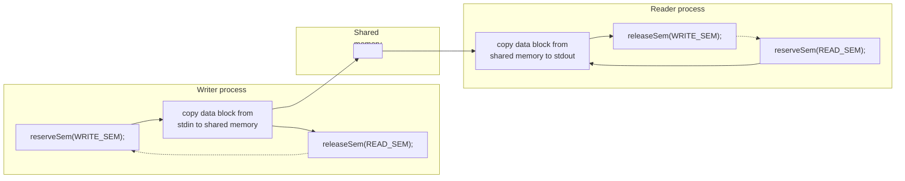

## Chapter 48
# <span id="page-120-0"></span>**SYSTEM V SHARED MEMORY**

This chapter describes System V shared memory. Shared memory allows two or more processes to share the same region (usually referred to as a segment) of physical memory. Since a shared memory segment becomes part of a process's user-space memory, no kernel intervention is required for IPC. All that is required is that one process copies data into the shared memory; that data is immediately available to all other processes sharing the same segment. This provides fast IPC by comparison with techniques such as pipes or message queues, where the sending process copies data from a buffer in user space into kernel memory and the receiving process copies in the reverse direction. (Each process also incurs the overhead of a system call to perform the copy operation.)

On the other hand, the fact that IPC using shared memory is not mediated by the kernel means that, typically, some method of synchronization is required so that processes don't simultaneously access the shared memory (e.g., two processes performing simultaneous updates, or one process fetching data from the shared memory while another process is in the middle of updating it). System V semaphores are a natural method for such synchronization. Other methods, such as POSIX semaphores (Chapter 53) and file locks (Chapter 55), are also possible.

> In mmap() terminology, a memory region is mapped at an address, while in System V terminology, a shared memory segment is attached at an address. These terms are equivalent; the terminology differences are a consequence of the separate origins of these two APIs.

## **48.1 Overview**

In order to use a shared memory segment, we typically perform the following steps:

-  Call shmget() to create a new shared memory segment or obtain the identifier of an existing segment (i.e., one created by another process). This call returns a shared memory identifier for use in later calls.
-  Use shmat() to attach the shared memory segment; that is, make the segment part of the virtual memory of the calling process.
-  At this point, the shared memory segment can be treated just like any other memory available to the program. In order to refer to the shared memory, the program uses the addr value returned by the shmat() call, which is a pointer to the start of the shared memory segment in the process's virtual address space.
-  Call shmdt() to detach the shared memory segment. After this call, the process can no longer refer to the shared memory. This step is optional, and happens automatically on process termination.
-  Call shmctl() to delete the shared memory segment. The segment will be destroyed only after all currently attached processes have detached it. Only one process needs to perform this step.

## <span id="page-121-0"></span>**48.2 Creating or Opening a Shared Memory Segment**

<span id="page-121-1"></span>The shmget() system call creates a new shared memory segment or obtains the identifier of an existing segment. The contents of a newly created shared memory segment are initialized to 0.

```
#include <sys/types.h> /* For portability */
#include <sys/shm.h>
int shmget(key_t key, size_t size, int shmflg);
          Returns shared memory segment identifier on success, or –1 on error
```

The key argument is a key generated using one of the methods described in Section [45.2](#page-48-1) (i.e., usually the value IPC\_PRIVATE or a key returned by ftok()).

When we use shmget() to create a new shared memory segment, size specifies a positive integer that indicates the desired size of the segment, in bytes. The kernel allocates shared memory in multiples of the system page size, so size is effectively rounded up to the next multiple of the system page size. If we are using shmget() to obtain the identifier of an existing segment, then size has no effect on the segment, but it must be less than or equal to the size of the segment.

The shmflg argument performs the same task as for the other IPC get calls, specifying the permissions (Table 15-4, on page 295) to be placed on a new shared memory segment or checked against an existing segment. In addition, zero or more of the following flags can be ORed (|) in shmflg to control the operation of shmget():

IPC\_CREAT

If no segment with the specified key exists, create a new segment.

IPC\_EXCL

If IPC\_CREAT was also specified, and a segment with the specified key already exists, fail with the error EEXIST.

The above flags are described in more detail in Section [45.1](#page-45-0). In addition, Linux permits the following nonstandard flags:

```
SHM_HUGETLB (since Linux 2.6)
```

A privileged (CAP\_IPC\_LOCK) process can use this flag to create a shared memory segment that uses huge pages. Huge pages are a feature provided by many modern hardware architectures to manage memory using very large page sizes. (For example, x86-32 allows 4-MB pages as an alternative to 4-kB pages.) On systems that have large amounts of memory, and where applications require large blocks of memory, using huge pages reduces the number of entries required in the hardware memory management unit's translation look-aside buffer (TLB). This is beneficial because entries in the TLB are usually a scarce resource. See the kernel source file Documentation/ vm/hugetlbpage.txt for further information.

```
SHM_NORESERVE (since Linux 2.6.15)
```

This flag serves the same purpose for shmget() as the MAP\_NORESERVE flag serves for mmap(). See Section [49.9](#page-161-0).

<span id="page-122-0"></span>On success, shmget() returns the identifier for the new or existing shared memory segment.

# **48.3 Using Shared Memory**

The shmat() system call attaches the shared memory segment identified by shmid to the calling process's virtual address space.

```
#include <sys/types.h> /* For portability */
#include <sys/shm.h>
void *shmat(int shmid, const void *shmaddr, int shmflg);
               Returns address at which shared memory is attached on success,
                                                        or (void *) –1 on error
```

The shmaddr argument and the setting of the SHM\_RND bit in the shmflg bit-mask argument control how the segment is attached:

-  If shmaddr is NULL, then the segment is attached at a suitable address selected by the kernel. This is the preferred method of attaching a segment.
-  If shmaddr is not NULL, and SHM\_RND is not set, then the segment is attached at the address specified by shmaddr, which must be a multiple of the system page size (or the error EINVAL results).
-  If shmaddr is not NULL, and SHM\_RND is set, then the segment is mapped at the address provided in shmaddr, rounded down to the nearest multiple of the constant SHMLBA (shared memory low boundary address). This constant is equal to some

multiple of the system page size. Attaching a segment at an address that is a multiple of SHMLBA is necessary on some architectures in order to improve CPU cache performance and to prevent the possibility that different attaches of the same segment have inconsistent views within the CPU cache.

> On the x86 architectures, SHMLBA is the same as the system page size, reflecting the fact that such caching inconsistencies can't arise on those architectures.

Specifying a non-NULL value for shmaddr (i.e., either the second or third option listed above) is not recommended, for the following reasons:

-  It reduces the portability of an application. An address valid on one UNIX implementation may be invalid on another.
-  An attempt to attach a shared memory segment at a particular address will fail if that address is already in use. This could happen if, for example, the application (perhaps inside a library function) had already attached another segment or created a memory mapping at that address.

As its function result, shmat() returns the address at which the shared memory segment is attached. This value can be treated like a normal C pointer; the segment looks just like any other part of the process's virtual memory. Typically, we assign the return value from shmat() to a pointer to some programmer-defined structure, in order to impose that structure on the segment (see, for example, [Listing 48-2](#page-126-0)).

To attach a shared memory segment for read-only access, we specify the flag SHM\_RDONLY in shmflg. Attempts to update the contents of a read-only segment result in a segmentation fault (the SIGSEGV signal). If SHM\_RDONLY is not specified, the memory can be both read and modified.

To attach a shared memory segment, a process requires read and write permissions on the segment, unless SHM\_RDONLY is specified, in which case only read permission is required.

> It is possible to attach the same shared memory segment multiple times within a process, and even to make one attach read-only while another is read-write. The contents of the memory at each attachment point are the same, since the different entries of the process virtual memory page tables are referring to the same physical pages of memory.

One final value that may be specified in shmflg is SHM\_REMAP. In this case, shmaddr must be non-NULL. This flag requests that the shmat() call replace any existing shared memory attachment or memory mapping in the range starting at shmaddr and continuing for the length of the shared memory segment. Normally, if we try to attach a shared memory segment at an address range that is already in use, the error EINVAL results. SHM\_REMAP is a nonstandard Linux extension.

[Table 48-1](#page-124-1) summarizes the constants that can be ORed in the shmflg argument of shmat().

When a process no longer needs to access a shared memory segment, it can call shmdt() to detach the segment from its virtual address space. The shmaddr argument identifies the segment to be detached. It should be a value returned by a previous call to shmat().

```
#include <sys/types.h> /* For portability */
#include <sys/shm.h>
int shmdt(const void *shmaddr);
                                           Returns 0 on success, or –1 on error
```

Detaching a shared memory segment is not the same as deleting it. Deletion is performed using the shmctl() IPC\_RMID operation, as described in Section [48.7](#page-134-1).

A child created by fork() inherits its parent's attached shared memory segments. Thus, shared memory provides an easy method of IPC between parent and child.

During an exec(), all attached shared memory segments are detached. Shared memory segments are also automatically detached on process termination.

<span id="page-124-1"></span>

| Table 48-1: shmflg bit-mask values for shmat() |  |  |
|------------------------------------------------|--|--|
|------------------------------------------------|--|--|

| Value      | Description                                    |
|------------|------------------------------------------------|
| SHM_RDONLY | Attach segment read-only                       |
| SHM_REMAP  | Replace any existing mapping at shmaddr        |
| SHM_RND    | Round shmaddr down to multiple of SHMLBA bytes |

# **48.4 Example: Transferring Data via Shared Memory**

<span id="page-124-0"></span>We now look at an example application that uses System V shared memory and semaphores. The application consists of two programs: the writer and the reader. The writer reads blocks of data from standard input and copies ("writes") them into a shared memory segment. The reader copies ("reads") blocks of data from the shared memory segment to standard output. In effect, the programs treat the shared memory somewhat like a pipe.

The two programs employ a pair of System V semaphores in a binary semaphore protocol (the initSemAvailable(), initSemInUse(), reserveSem(), and releaseSem() functions defined in Section [47.9](#page-111-0)) to ensure that:

-  only one process accesses the shared memory segment at a time; and
-  the processes alternate in accessing the segment (i.e., the writer writes some data, then the reader reads the data, then the writer writes again, and so on).

[Figure 48-1](#page-125-1) provides an overview of the use of these two semaphores. Note that the writer initializes the two semaphores so that it is the first of the two programs to be able to access the shared memory segment; that is, the writer's semaphore is initially available, and the reader's semaphore is initially in use.

The source code for the application consists of three files. The first of these, [Listing 48-1,](#page-125-0) is a header file shared by the reader and writer programs. This header defines the shmseg structure that we use to declare pointers to the shared memory segment. Doing this allows us to impose a structure on the bytes of the shared memory segment.



<span id="page-125-1"></span>**Figure 48-1:** Using semaphores to ensure exclusive, alternating access to shared memory

<span id="page-125-0"></span>**Listing 48-1:** Header file for svshm\_xfr\_writer.c and svshm\_xfr\_reader.c

```
–––––––––––––––––––––––––––––––––––––––––––––––––––––––– svshm/svshm_xfr.h
#include <sys/types.h>
#include <sys/stat.h>
#include <sys/sem.h>
#include <sys/shm.h>
#include "binary_sems.h" /* Declares our binary semaphore functions */
#include "tlpi_hdr.h"
#define SHM_KEY 0x1234 /* Key for shared memory segment */
#define SEM_KEY 0x5678 /* Key for semaphore set */
#define OBJ_PERMS (S_IRUSR | S_IWUSR | S_IRGRP | S_IWGRP)
 /* Permissions for our IPC objects */
#define WRITE_SEM 0 /* Writer has access to shared memory */
#define READ_SEM 1 /* Reader has access to shared memory */
#ifndef BUF_SIZE /* Allow "cc -D" to override definition */
#define BUF_SIZE 1024 /* Size of transfer buffer */
#endif
struct shmseg { /* Defines structure of shared memory segment */
 int cnt; /* Number of bytes used in 'buf' */
 char buf[BUF_SIZE]; /* Data being transferred */
};
–––––––––––––––––––––––––––––––––––––––––––––––––––––––– svshm/svshm_xfr.h
```

[Listing 48-2](#page-126-0) is the writer program. This program performs the following steps:

 Create a set containing the two semaphores that are used by the writer and reader program to ensure that they alternate in accessing the shared memory segment q. The semaphores are initialized so that the writer has first access to the shared memory segment. Since the writer creates the semaphore set, it must be started before the reader.

-  Create the shared memory segment and attach it to the writer's virtual address space at an address chosen by the system w.
-  Enter a loop that transfers data from standard input to the shared memory segment e. The following steps are performed in each loop iteration:
  - Reserve (decrement) the writer semaphore r.
  - Read data from standard input into the shared memory segment t.
  - Release (increment) the reader semaphore y.
-  The loop terminates when no further data is available from standard input u. On the last pass through the loop, the writer indicates to the reader that there is no more data by passing a block of data of length 0 (shmp–>cnt is 0).
-  Upon exiting the loop, the writer once more reserves its semaphore, so that it knows that the reader has completed the final access to the shared memory i. The writer then removes the shared memory segment and semaphore set o.

[Listing 48-3](#page-128-0) is the reader program. It transfers blocks of data from the shared memory segment to standard output. The reader performs the following steps:

-  Obtain the IDs of the semaphore set and shared memory segment that were created by the writer program q.
-  Attach the shared memory segment for read-only access w.
-  Enter a loop that transfers data from the shared memory segment e. The following steps are performed in each loop iteration:
  - Reserve (decrement) the reader semaphore r.
  - Check whether shmp–>cnt is 0; if so, exit this loop t.
  - Write the block of data in the shared memory segment to standard output y.
  - Release (increment) the writer semaphore u.
-  After exiting the loop, detach the shared memory segment i and releases the writer semaphore o, so that the writer program can remove the IPC objects.

<span id="page-126-1"></span><span id="page-126-0"></span>**Listing 48-2:** Transfer blocks of data from stdin to a System V shared memory segment

```
–––––––––––––––––––––––––––––––––––––––––––––––––– svshm/svshm_xfr_writer.c
  #include "semun.h" /* Definition of semun union */
  #include "svshm_xfr.h"
  int
  main(int argc, char *argv[])
  {
   int semid, shmid, bytes, xfrs;
   struct shmseg *shmp;
   union semun dummy;
q semid = semget(SEM_KEY, 2, IPC_CREAT | OBJ_PERMS);
   if (semid == -1)
   errExit("semget");
```

```
 if (initSemAvailable(semid, WRITE_SEM) == -1)
   errExit("initSemAvailable");
   if (initSemInUse(semid, READ_SEM) == -1)
   errExit("initSemInUse");
w shmid = shmget(SHM_KEY, sizeof(struct shmseg), IPC_CREAT | OBJ_PERMS);
   if (shmid == -1)
   errExit("shmget");
   shmp = shmat(shmid, NULL, 0);
   if (shmp == (void *) -1)
   errExit("shmat");
   /* Transfer blocks of data from stdin to shared memory */
e for (xfrs = 0, bytes = 0; ; xfrs++, bytes += shmp->cnt) {
r if (reserveSem(semid, WRITE_SEM) == -1) /* Wait for our turn */
   errExit("reserveSem");
t shmp->cnt = read(STDIN_FILENO, shmp->buf, BUF_SIZE);
   if (shmp->cnt == -1)
   errExit("read");
y if (releaseSem(semid, READ_SEM) == -1) /* Give reader a turn */
   errExit("releaseSem");
   /* Have we reached EOF? We test this after giving the reader
   a turn so that it can see the 0 value in shmp->cnt. */
u if (shmp->cnt == 0)
   break;
   }
   /* Wait until reader has let us have one more turn. We then know
   reader has finished, and so we can delete the IPC objects. */
i if (reserveSem(semid, WRITE_SEM) == -1)
   errExit("reserveSem");
o if (semctl(semid, 0, IPC_RMID, dummy) == -1)
   errExit("semctl");
   if (shmdt(shmp) == -1)
   errExit("shmdt");
   if (shmctl(shmid, IPC_RMID, 0) == -1)
   errExit("shmctl");
   fprintf(stderr, "Sent %d bytes (%d xfrs)\n", bytes, xfrs);
   exit(EXIT_SUCCESS);
  }
  –––––––––––––––––––––––––––––––––––––––––––––––––– svshm/svshm_xfr_writer.c
```

<span id="page-128-1"></span><span id="page-128-0"></span>**Listing 48-3:** Transfer blocks of data from a System V shared memory segment to stdout

```
–––––––––––––––––––––––––––––––––––––––––––––––––– svshm/svshm_xfr_reader.c
  #include "svshm_xfr.h"
  int
  main(int argc, char *argv[])
  {
   int semid, shmid, xfrs, bytes;
   struct shmseg *shmp;
   /* Get IDs for semaphore set and shared memory created by writer */
q semid = semget(SEM_KEY, 0, 0);
   if (semid == -1)
   errExit("semget");
   shmid = shmget(SHM_KEY, 0, 0);
   if (shmid == -1)
   errExit("shmget");
w shmp = shmat(shmid, NULL, SHM_RDONLY);
   if (shmp == (void *) -1)
   errExit("shmat");
   /* Transfer blocks of data from shared memory to stdout */
e for (xfrs = 0, bytes = 0; ; xfrs++) {
r if (reserveSem(semid, READ_SEM) == -1) /* Wait for our turn */
   errExit("reserveSem");
t if (shmp->cnt == 0) /* Writer encountered EOF */
   break;
   bytes += shmp->cnt;
y if (write(STDOUT_FILENO, shmp->buf, shmp->cnt) != shmp->cnt)
   fatal("partial/failed write");
u if (releaseSem(semid, WRITE_SEM) == -1) /* Give writer a turn */
   errExit("releaseSem");
   }
i if (shmdt(shmp) == -1)
   errExit("shmdt");
   /* Give writer one more turn, so it can clean up */
o if (releaseSem(semid, WRITE_SEM) == -1)
   errExit("releaseSem");
   fprintf(stderr, "Received %d bytes (%d xfrs)\n", bytes, xfrs);
   exit(EXIT_SUCCESS);
  }
  –––––––––––––––––––––––––––––––––––––––––––––––––– svshm/svshm_xfr_reader.c
```

The following shell session demonstrates the use of the programs in [Listing 48-2](#page-126-0) and [Listing 46-9](#page-83-1). We invoke the writer, using the file /etc/services as input, and then invoke the reader, directing its output to another file:

```
$ wc -c /etc/services Display size of test file
764360 /etc/services
$ ./svshm_xfr_writer < /etc/services &
[1] 9403
$ ./svshm_xfr_reader > out.txt
Received 764360 bytes (747 xfrs) Message from reader
Sent 764360 bytes (747 xfrs) Message from writer
[1]+ Done ./svshm_xfr_writer < /etc/services
$ diff /etc/services out.txt
$
```

<span id="page-129-0"></span>The diff command produced no output, indicating that the output file produced by the reader has the same content as the input file used by the writer.

# **48.5 Location of Shared Memory in Virtual Memory**

In Section 6.3, we considered the layout of the various parts of a process in virtual memory. It is useful to revisit this topic in the context of attaching System V shared memory segments. If we follow the recommended approach of allowing the kernel to choose where to attach a shared memory segment, then (on the x86-32 architecture) the memory layout appears as shown in [Figure 48-2](#page-130-0), with the segment being attached in the unallocated space between the upwardly growing heap and the downwardly growing stack. To allow space for heap and stack growth, shared memory segments are attached starting at the virtual address 0x40000000. Mapped mappings (Chapter [49](#page-140-0)) and shared libraries (Chapters 41 and 42) are also placed in this area. (There is some variation in the default location at which shared memory mappings and memory segments are placed, depending on the kernel versions and the setting of the process's RLIMIT\_STACK resource limit.)

> The address 0x40000000 is defined as the kernel constant TASK\_UNMAPPED\_BASE. It is possible to change this address by defining this constant with a different value and rebuilding the kernel.

> A shared memory segment (or memory mapping) can be placed at an address below TASK\_UNMAPPED\_BASE, if we employ the unrecommended approach of explicitly specifying an address when calling shmat() (or mmap()).

Using the Linux-specific /proc/PID/maps file, we can see the location of the shared memory segments and shared libraries mapped by a program, as we demonstrate in the shell session below.

> Starting with kernel 2.6.14, Linux also provides the /proc/PID/smaps file, which exposes more information about the memory consumption of each of a process's mappings. For further details, see the proc(5) manual page.

#### Virtual memory address (hexadecimal)

```text
Virtual memory address
    (hexadecimal)
                        ┌─────────────────────────────┐
    0xC0000000          │      argc, environ          │
                        ├─────────────────────────────┤
                        │          Stack              │
                        ├ ─ ─ ─ ─ ─ ─ ─ ─ ─ ─ ─ ─ ─ --┤◄── Top of
                        │            │                │    stack
                        │            ▼                │
                        │                             │
                        ├ ─ ─ ─ ─ ─ ─ ─ ─ ─ ─ ─ ─ ─ --┤
                        │                             │
                        │   Shared memory, memory     │
                        │   mappings, and shared      │
                        │   libraries placed here     │
                        │                             │
    0x40000000          ├─────────────────────────────┤
TASK_UNMAPPED_BASE      │                             │
                        │ Reserved for heap expansion │
        ▲               │                             │
        │               │            ▲                │
        │               ├ ─ ─ ─ ─ ─ ─│─ ─ ─ ─ ─ ─ ─ --┤◄── Program
        │               │                             │    break
Increasing virtual      │          Heap               │
addresses               ├─────────────────────────────┤
        │               │ Uninitialized data (bss)    │
        │               ├─────────────────────────────┤
        │               │    Initialized data         │
                        ├─────────────────────────────┤
    0x08048000          │   Text (program code)       │
                        ├─────────────────────────────┤
    0x00000000          │                             │
                        └─────────────────────────────┘
```

<span id="page-130-0"></span>**Figure 48-2:** Locations of shared memory, memory mappings, and shared libraries (x86-32)

In the shell session below, we employ three programs that are not shown in this chapter, but are provided in the svshm subdirectory in the source code distribution for this book. These programs perform the following tasks:

-  The svshm\_create.c program creates a shared memory segment. This program takes the same command-line options as the corresponding programs that we provide for message queues [\(Listing 46-1](#page-61-1), on page [938\)](#page-61-1) and semaphores, but includes an additional argument that specifies the size of the segment.
-  The svshm\_attach.c program attaches the shared memory segments identified by its command-line arguments. Each of these arguments is a colon-separated pair of numbers consisting of a shared memory identifier and an attach address. Specifying 0 for the attach address means that the system should choose the address. The program displays the address at which the memory is actually attached. For informational purposes, the program also displays the value of the SHMLBA constant and the process ID of the process running the program.
-  The svshm\_rm.c program deletes the shared memory segments identified by its command-line arguments.

We begin the shell session by creating two shared memory segments (100 kB and 3200 kB in size):

```
$ ./svshm_create -p 102400
9633796
$ ./svshm_create -p 3276800
9666565
$ ./svshm_create -p 102400
1015817
$ ./svshm_create -p 3276800
1048586
```

We then start a program that attaches these two segments at addresses chosen by the kernel:

```
$ ./svshm_attach 9633796:0 9666565:0
SHMLBA = 4096 (0x1000), PID = 9903
1: 9633796:0 ==> 0xb7f0d000
2: 9666565:0 ==> 0xb7bed000
Sleeping 5 seconds
```

The output above shows the addresses at which the segments were attached. Before the program completes sleeping, we suspend it, and then examine the contents of the corresponding /proc/PID/maps file:

```
Type Control-Z to suspend program
[1]+ Stopped ./svshm_attach 9633796:0 9666565:0
$ cat /proc/9903/maps
```

The output produced by the cat command is shown in [Listing 48-4.](#page-131-0)

<span id="page-131-0"></span>**Listing 48-4:** Example of contents of /proc/PID/maps

```
$ cat /proc/9903/maps
q 08048000-0804a000 r-xp 00000000 08:05 5526989 /home/mtk/svshm_attach
  0804a000-0804b000 r--p 00001000 08:05 5526989 /home/mtk/svshm_attach
  0804b000-0804c000 rw-p 00002000 08:05 5526989 /home/mtk/svshm_attach
w b7bed000-b7f0d000 rw-s 00000000 00:09 9666565 /SYSV00000000 (deleted)
  b7f0d000-b7f26000 rw-s 00000000 00:09 9633796 /SYSV00000000 (deleted)
  b7f26000-b7f27000 rw-p b7f26000 00:00 0
e b7f27000-b8064000 r-xp 00000000 08:06 122031 /lib/libc-2.8.so
  b8064000-b8066000 r--p 0013d000 08:06 122031 /lib/libc-2.8.so
  b8066000-b8067000 rw-p 0013f000 08:06 122031 /lib/libc-2.8.so
  b8067000-b806b000 rw-p b8067000 00:00 0
  b8082000-b8083000 rw-p b8082000 00:00 0
r b8083000-b809e000 r-xp 00000000 08:06 122125 /lib/ld-2.8.so
  b809e000-b809f000 r--p 0001a000 08:06 122125 /lib/ld-2.8.so
  b809f000-b80a0000 rw-p 0001b000 08:06 122125 /lib/ld-2.8.so
t bfd8a000-bfda0000 rw-p bffea000 00:00 0 [stack]
y ffffe000-fffff000 r-xp 00000000 00:00 0 [vdso]
```

In the output from /proc/PID/maps shown in [Listing 48-4,](#page-131-0) we can see the following:

-  Three lines for the main program, shm\_attach. These correspond to the text and data segments of the program q. The second of these lines is for a readonly page holding the string constants used by the program.
-  Two lines for the attached System V shared memory segments w.
-  Lines corresponding to the segments for two shared libraries. One of these is the standard C library (libc-version.so) e. The other is the dynamic linker (ld-version.so), which we describe in Section 41.4.3 r.
-  A line labeled [stack]. This corresponds to the process stack t.
-  A line containing the tag [vdso] y. This is an entry for the linux-gate virtual dynamic shared object (DSO). This entry appears only in kernels since 2.6.12. See http://www.trilithium.com/johan/2005/08/linux-gate/ for further information about this entry.

The following columns are shown in each line of /proc/PID/maps, in order from left to right:

- 1. A pair of hyphen-separated numbers indicating the virtual address range (in hexadecimal) at which the memory segment is mapped. The second of these numbers is the address of the next byte after the end of the segment.
- 2. Protection and flags for this memory segment. The first three letters indicate the protection of the segment: read (r), write (w), and execute (x). A hyphen (-) in place of any of these letters indicates that the corresponding protection is disabled. The final letter indicates the mapping flag for the memory segment; it is either private (p) or shared (s). For an explanation of these flags, see the description of the MAP\_PRIVATE and MAP\_SHARED flags in Section [49.2](#page-143-0). (A System V shared memory segment is always marked shared.)
- 3. The hexadecimal offset (in bytes) of the segment within the corresponding mapped file. The meanings of this and the following two columns will become clearer when we describe the mmap() system call in Chapter [49](#page-140-0). For a System V shared memory segment, the offset is always 0.
- 4. The device number (major and minor IDs) of the device on which the corresponding mapped file is located.
- 5. The i-node number of the mapped file, or, for System V shared memory segments, the identifier for the segment.
- 6. The filename or other identifying tag associated with this memory segment. For a System V shared memory segment, this consists of the string SYSV concatenated with the shmget() key of the segment (expressed in hexadecimal). In this example, SYSV is followed by zeros because we created the segments using the key IPC\_PRIVATE (which has the value 0). The string (deleted) that appears after the SYSV field for a System V shared memory segment is an artifact of the implementation of shared memory segments. Such segments are created as mapped files in an invisible tmpfs file system (Section 14.10), and then later unlinked. Shared anonymous memory mappings are implemented in the same manner. (We describe mapped files and shared anonymous memory mappings in Chapter [49.](#page-140-0))

## **48.6 Storing Pointers in Shared Memory**

<span id="page-133-1"></span>Each process may employ different shared libraries and memory mappings, and may attach different sets of shared memory segments. Therefore, if we follow the recommended practice of letting the kernel choose where to attach a shared memory segment, the segment may be attached at a different address in each process. For this reason, when storing references inside a shared memory segment that point to other addresses within the segment, we should use (relative) offsets, rather than (absolute) pointers.

For example, suppose we have a shared memory segment whose starting address is pointed to by baseaddr (i.e., baseaddr is the value returned by shmat()). Furthermore, at the location pointed to by p, we want to store a pointer to the same location as is pointed to by target, as shown in [Figure 48-3.](#page-133-0) This sort of operation would be typical if we were building a linked list or a binary tree within the segment. The usual C idiom for setting \*p would be the following:

```text
*p = target;          /* Place pointer in *p (WRONG!) */

Shared memory segment
              ┌─────────┐
              │         │
target ──────>│         │◄─┐
              │         │  │
              │         │  │
              │         │  │
p ───────────>│         │──┘
              │         │
              │         │
baseaddr ────>└─────────┘
```

**Figure 48-3:** Using pointers in a shared memory segment

The problem with this code is that the location pointed to by target may reside at a different virtual address when the shared memory segment is attached in another process, which means that the value stored at \*p is meaningless in that process. The correct approach is to store an offset at \*p, as in the following:

```
*p = (target - baseaddr); /* Place offset in *p */
```

When dereferencing such pointers, we reverse the above step:

```
target = baseaddr + *p; /* Interpret offset */
```

Here, we assume that in each process, baseaddr points to the start of the shared memory segment (i.e., it is the value returned by shmat() in each process). Given this assumption, an offset value is correctly interpreted, no matter where the shared memory segment is attached in a process's virtual address space.

Alternatively, if we are linking together a set of fixed-size structures, we can cast the shared memory segment (or a part thereof) as an array, and then use index numbers as the "pointers" referring from one structure to another.

<span id="page-133-0"></span>baseaddr

# <span id="page-134-1"></span>**48.7 Shared Memory Control Operations**

<span id="page-134-0"></span>The shmctl() system call performs a range of control operations on the shared memory segment identified by shmid.

```
#include <sys/types.h> /* For portability */
#include <sys/shm.h>
int shmctl(int shmid, int cmd, struct shmid_ds *buf);
                                           Returns 0 on success, or –1 on error
```

The cmd argument specifies the control operation to be performed. The buf argument is required by the IPC\_STAT and IPC\_SET operations (described below), and should be specified as NULL for the remaining operations.

In the remainder of this section, we describe the various operations that can be specified for cmd.

## **Generic control operations**

The following operations are the same as for other types of System V IPC objects. Further details about these operations, including the privileges and permissions required by the calling process, are described in Section [45.3.](#page-50-0)

IPC\_RMID

Mark the shared memory segment and its associated shmid\_ds data structure for deletion. If no processes currently have the segment attached, deletion is immediate; otherwise, the segment is removed after all processes have detached from it (i.e., when the value of the shm\_nattch field in the shmid\_ds data structure falls to 0). In some applications, we can make sure that a shared memory segment is tidily cleared away on application termination by marking it for deletion immediately after all processes have attached it to their virtual address space with shmat(). This is analogous to unlinking a file once we've opened it.

On Linux, if a shared segment has been marked for deletion using IPC\_RMID, but has not yet been removed because some process still has it attached, then it is possible for another process to attach that segment. However, this behavior is not portable: most UNIX implementations prevent new attaches to a segment marked for deletion. (SUSv3 is silent on what behavior should occur in this scenario.) A few Linux applications have come to depend on this behavior, which is why Linux has not been changed to match other UNIX implementations.

IPC\_STAT

Place a copy of the shmid\_ds data structure associated with this shared memory segment in the buffer pointed to by buf. (We describe this data structure in Section [48.8.](#page-135-0))

IPC\_SET

Update selected fields of the shmid\_ds data structure associated with this shared memory segment using values in the buffer pointed to by buf.

## **Locking and unlocking shared memory**

A shared memory segment can be locked into RAM, so that it is never swapped out. This provides a performance benefit, since, once each page of the segment is memory-resident, an application is guaranteed never to be delayed by a page fault when it accesses the page. There are two shmctl() locking operations:

-  The SHM\_LOCK operation locks a shared memory segment into memory.
-  The SHM\_UNLOCK operation unlocks the shared memory segment, allowing it to be swapped out.

These operations are not specified by SUSv3, and they are not provided on all UNIX implementations.

In versions of Linux before 2.6.10, only privileged (CAP\_IPC\_LOCK) processes can lock a shared memory segment into memory. Since Linux 2.6.10, an unprivileged process can lock and unlock a shared memory segment if its effective user ID matches either the owner or the creator user ID of the segment and (in the case of SHM\_LOCK) the process has a sufficiently high RLIMIT\_MEMLOCK resource limit. See Section 50.2 for details.

Locking a shared memory segment does not guarantee that all of the pages of the segment are memory-resident at the completion of the shmctl() call. Rather, nonresident pages are individually locked in only as they are faulted into memory by subsequent references by processes that have attached the shared memory segment. Once faulted in, the pages stay resident until subsequently unlocked, even if all processes detach the segment. (In other words, the SHM\_LOCK operation sets a property of the shared memory segment, rather than a property of the calling process.)

> By faulted into memory, we mean that when the process references the nonresident page, a page fault occurs. At this point, if the page is in the swap area, then it is reloaded into memory. If the page is being referenced for the first time, no corresponding page exists in the swap file. Therefore, the kernel allocates a new page of physical memory and adjusts the process's page tables and the bookkeeping data structures for the shared memory segment.

An alternative method of locking memory, with slightly different semantics, is the use of mlock(), which we describe in Section 50.2.

# <span id="page-135-0"></span>**48.8 Shared Memory Associated Data Structure**

Each shared memory segment has an associated shmid\_ds data structure of the following form:

```
struct shmid_ds {
 struct ipc_perm shm_perm; /* Ownership and permissions */
 size_t shm_segsz; /* Size of segment in bytes */
 time_t shm_atime; /* Time of last shmat() */
 time_t shm_dtime; /* Time of last shmdt() */
 time_t shm_ctime; /* Time of last change */
 pid_t shm_cpid; /* PID of creator */
 pid_t shm_lpid; /* PID of last shmat() / shmdt() */
 shmatt_t shm_nattch; /* Number of currently attached processes */
};
```

SUSv3 requires all of the fields shown here. Some other UNIX implementations include additional nonstandard fields in the shmid\_ds structure.

The fields of the shmid\_ds structure are implicitly updated by various shared memory system calls, and certain subfields of the shm\_perm field can be explicitly updated using the shmctl() IPC\_SET operation. The details are as follows:

#### shm\_perm

When the shared memory segment is created, the fields of this substructure are initialized as described in Section [45.3](#page-50-0). The uid, gid, and (the lower 9 bits of the) mode subfields can be updated via IPC\_SET. As well as the usual permission bits, the shm\_perm.mode field holds two read-only bit-mask flags. The first of these, SHM\_DEST (destroy), indicates whether the segment is marked for deletion (via the shmctl() IPC\_RMID operation) when all processes have detached it from their address space. The other flag, SHM\_LOCKED, indicates whether the segment is locked into physical memory (via the shmctl() SHM\_LOCK operation). Neither of these flags is standardized in SUSv3, and equivalents appear on only a few other UNIX implementations, in some cases with different names.

#### shm\_segsz

On creation of the shared memory segment, this field is set to the requested size of the segment in bytes (i.e., to the value of the size argument specified in the call to shmget()). As noted in Section [48.2,](#page-121-0) shared memory is allocated in units of pages, so the actual size of the segment may be larger than this value.

#### shm\_atime

This field is set to 0 when the shared memory segment is created, and set to the current time whenever a process attaches the segment (shmat()). This field and the other timestamp fields in the shmid\_ds structure are typed as time\_t, and store time in seconds since the Epoch.

#### shm\_dtime

This field is set to 0 when the shared memory segment is created, and set to the current time whenever a process detaches the segment (shmdt()).

#### shm\_ctime

This field is set to the current time when the segment is created, and on each successful IPC\_SET operation.

#### shm\_cpid

This field is set to the process ID of the process that created the segment using shmget().

#### shm\_lpid

This field is set to 0 when the shared memory segment is created, and then set to the process ID of the calling process on each successful shmat() or shmdt().

shm\_nattch

This field counts the number of processes that currently have the segment attached. It is initialized to 0 when the segment is created, and then incremented by each successful shmat() and decremented by each successful shmdt(). The shmatt\_t data type used to define this field is an unsigned integer type that SUSv3 requires to be at least the size of unsigned short. (On Linux, this type is defined as unsigned long.)

# **48.9 Shared Memory Limits**

Most UNIX implementations impose various limits on System V shared memory. Below is a list of the Linux shared memory limits. The system call affected by the limit and the error that results if the limit is reached are noted in parentheses.

SHMMNI

This is a system-wide limit on the number of shared memory identifiers (in other words, shared memory segments) that can be created. (shmget(), ENOSPC)

SHMMIN

This is the minimum size (in bytes) of a shared memory segment. This limit is defined with the value 1 (this can't be changed). However, the effective limit is the system page size. (shmget(), EINVAL)

SHMMAX

This is the maximum size (in bytes) of a shared memory segment. The practical upper limit for SHMMAX depends on available RAM and swap space. (shmget(), EINVAL)

SHMALL

This is a system-wide limit on the total number of pages of shared memory. Most other UNIX implementations don't provide this limit. The practical upper limit for SHMALL depends on available RAM and swap space. (shmget(), ENOSPC)

Some other UNIX implementations also impose the following limit (which is not implemented on Linux):

SHMSEG

This is a per-process limit on the number of attached shared memory segments.

At system startup, the shared memory limits are set to default values. (These defaults may vary across kernel versions, and some distributors' kernels set different defaults from those provided by vanilla kernels.) On Linux, some of the limits can be viewed or changed via files in the /proc file system. [Table 48-2](#page-138-0) lists the /proc file corresponding to each limit. As an example, here are the default limits that we see for Linux 2.6.31 on one x86-32 system:

\$ **cd /proc/sys/kernel** \$ **cat shmmni** 4096

```
$ cat shmmax
33554432
$ cat shmall
2097152
```

The Linux-specific shmctl() IPC\_INFO operation retrieves a structure of type shminfo, which contains the values of the various shared memory limits:

```
struct shminfo buf;
shmctl(0, IPC_INFO, (struct shmid_ds *) &buf);
```

A related Linux-specific operation, SHM\_INFO, retrieves a structure of type shm\_info that contains information about actual resources used for shared memory objects. An example of the use of SHM\_INFO is provided in the file svshm/svshm\_info.c in the source code distribution for this book.

Details about IPC\_INFO, SHM\_INFO, and the shminfo and shm\_info structures can be found in the shmctl(2) manual page.

| Limit  | Ceiling value (x86-32)      | Corresponding file<br>in /proc/sys/kernel |
|--------|-----------------------------|-------------------------------------------|
| SHMMNI | 32768 (IPCMNI)              | shmmni                                    |
| SHMMAX | Depends on available memory | shmmax                                    |
| SHMALL | Depends on available memory | shmall                                    |

<span id="page-138-0"></span>**Table 48-2:** System V shared memory limits

# **48.10 Summary**

Shared memory allows two or more processes to share the same pages of memory. No kernel intervention is required to exchange data via shared memory. Once a process has copied data into a shared memory segment, that data is immediately visible to other processes. Shared memory provides fast IPC, although this speed advantage is somewhat offset by the fact that normally we must use some type of synchronization technique, such as a System V semaphore, to synchronize access to the shared memory.

The recommended approach when attaching a shared memory segment is to allow the kernel to choose the address at which the segment is attached in the process's virtual address space. This means that the segment may reside at different virtual addresses in different processes. For this reason, any references to addresses within the segment should be maintained as relative offsets, rather than as absolute pointers.

### **Further information**

The Linux memory-management scheme and some details of the implementation of shared memory are described in [Bovet & Cesati, 2005].

## **48.11 Exercises**

- **48-1.** Replace the use of binary semaphores in [Listing 48-2](#page-126-0) (svshm\_xfr\_writer.c) and [Listing 48-3](#page-128-0) (svshm\_xfr\_reader.c) with the use of event flags [\(Exercise 47-5\)](#page-118-0).
- **48-2.** Explain why the program in [Listing 48-3](#page-128-0) incorrectly reports the number of bytes transferred if the for loop is modified as follows:

```
for (xfrs = 0, bytes = 0; shmp->cnt != 0; xfrs++, bytes += shmp->cnt) {
 reserveSem(semid, READ_SEM); /* Wait for our turn */
 if (write(STDOUT_FILENO, shmp->buf, shmp->cnt) != shmp->cnt)
 fatal("write");
 releaseSem(semid, WRITE_SEM); /* Give writer a turn */
}
```

- **48-3.** Try compiling the programs in [Listing 48-2](#page-126-0) (svshm\_xfr\_writer.c) and [Listing 48-3](#page-128-0) (svshm\_xfr\_reader.c) with a range of different sizes (defined by the constant BUF\_SIZE) for the buffer used to exchange data between the two programs. Time the execution of svshm\_xfr\_reader.c for each buffer size.
- **48-4.** Write a program that displays the contents of the shmid\_ds data structure (Section [48.8](#page-135-0)) associated with a shared memory segment. The identifier of the segment should be specified as a command-line argument. (See the program in [Listing 47-3,](#page-96-1) on page [973,](#page-96-1) which performs the analogous task for System V semaphores.)
- **48-5.** Write a directory service that uses a shared memory segment to publish name-value pairs. You will need to provide an API that allows callers to create a new name, modify an existing name, delete an existing name, and retrieve the value associated with a name. Use semaphores to ensure that a process performing an update to the shared memory segment has exclusive access to the segment.
- **48-6.** Write a program (analogous to program in [Listing 46-6,](#page-76-1) on page [953\)](#page-76-1) that uses the shmctl() SHM\_INFO and SHM\_STAT operations to obtain and display a list of all shared memory segments on the system.

