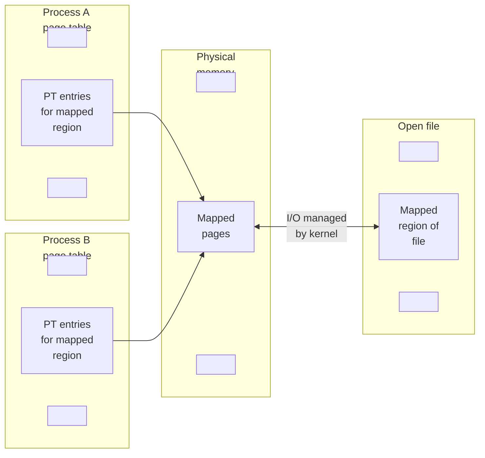
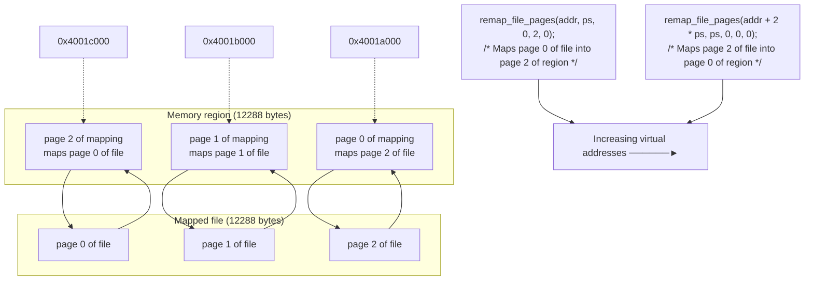

## Chapter 49
# <span id="page-140-0"></span>**MEMORY MAPPINGS**

This chapter discusses the use of the mmap() system call to create memory mappings. Memory mappings can be used for IPC, as well as a range of other purposes. We begin with an overview of some fundamental concepts before considering mmap() in depth.

# **49.1 Overview**

The mmap() system call creates a new memory mapping in the calling process's virtual address space. A mapping can be of two types:

-  File mapping: A file mapping maps a region of a file directly into the calling process's virtual memory. Once a file is mapped, its contents can be accessed by operations on the bytes in the corresponding memory region. The pages of the mapping are (automatically) loaded from the file as required. This type of mapping is also known as a file-based mapping or memory-mapped file.
-  Anonymous mapping: An anonymous mapping doesn't have a corresponding file. Instead, the pages of the mapping are initialized to 0.

Another way of thinking of an anonymous mapping (and one is that is close to the truth) is that it is a mapping of a virtual file whose contents are always initialized with zeros.

The memory in one process's mapping may be shared with mappings in other processes (i.e., the page-table entries of each process point to the same pages of RAM). This can occur in two ways:

-  When two processes map the same region of a file, they share the same pages of physical memory.
-  A child process created by fork() inherits copies of its parent's mappings, and these mappings refer to the same pages of physical memory as the corresponding mappings in the parent.

When two or more processes share the same pages, each process can potentially see the changes to the page contents made by other processes, depending on whether the mapping is private or shared:

-  Private mapping (MAP\_PRIVATE): Modifications to the contents of the mapping are not visible to other processes and, for a file mapping, are not carried through to the underlying file. Although the pages of a private mapping are initially shared in the circumstances described above, changes to the contents of the mapping are nevertheless private to each process. The kernel accomplishes this using the copy-on-write technique (Section 24.2.2). This means that whenever a process attempts to modify the contents of a page, the kernel first creates a new, separate copy of that page for the process (and adjusts the process's page tables). For this reason, a MAP\_PRIVATE mapping is sometimes referred to as a private, copy-on-write mapping.
-  Shared mapping (MAP\_SHARED): Modifications to the contents of the mapping are visible to other processes that share the same mapping and, for a file mapping, are carried through to the underlying file.

The two mapping attributes described above (file versus anonymous and private versus shared) can be combined in four different ways, as summarized in [Table 49-1](#page-141-0).

<span id="page-141-0"></span>**Table 49-1:** Purposes of various types of memory mappings

| Visibility of | Mapping type                                                 |                                           |
|---------------|--------------------------------------------------------------|-------------------------------------------|
| modifications | File                                                         | Anonymous                                 |
| Private       | Initializing memory from contents of file                    | Memory allocation                         |
| Shared        | Memory-mapped I/O; sharing memory<br>between processes (IPC) | Sharing memory between<br>processes (IPC) |

The four different types of memory mappings are created and used as follows:

 Private file mapping: The contents of the mapping are initialized from a file region. Multiple processes mapping the same file initially share the same physical pages of memory, but the copy-on-write technique is employed, so that changes to the mapping by one process are invisible to other processes. The

- main use of this type of mapping is to initialize a region of memory from the contents of a file. Some common examples are initializing a process's text and initialized data segments from the corresponding parts of a binary executable file or a shared library file.
-  Private anonymous mapping: Each call to mmap() to create a private anonymous mapping yields a new mapping that is distinct from (i.e., does not share physical pages with) other anonymous mappings created by the same (or a different) process. Although a child process inherits its parent's mappings, copy-on-write semantics ensure that, after the fork(), the parent and child don't see changes made to the mapping by the other process. The primary purpose of private anonymous mappings is to allocate new (zero-filled) memory for a process (e.g., malloc() employs mmap() for this purpose when allocating large blocks of memory).
-  Shared file mapping: All processes mapping the same region of a file share the same physical pages of memory, which are initialized from a file region. Modifications to the contents of the mapping are carried through to the file. This type of mapping serves two purposes. First, it permits memory-mapped I/O. By this, we mean that a file is loaded into a region of the process's virtual memory, and modifications to that memory are automatically written to the file. Thus, memory-mapped I/O provides an alternative to using read() and write() for performing file I/O. A second purpose of this type of mapping is to allow unrelated processes to share a region of memory in order to perform (fast) IPC in a manner similar to System V shared memory segments (Chapter [48](#page-120-0)).
-  Shared anonymous mapping: As with a private anonymous mapping, each call to mmap() to create a shared anonymous mapping creates a new, distinct mapping that doesn't share pages with any other mapping. The difference is that the pages of the mapping are not copied-on-write. This means that when a child inherits the mapping after a fork(), the parent and child share the same pages of RAM, and changes made to the contents of the mapping by one process are visible to the other process. Shared anonymous mappings allow IPC in a manner similar to System V shared memory segments, but only between related processes.

We consider each of these types of mapping in more detail in the remainder of this chapter.

Mappings are lost when a process performs an exec(), but are inherited by the child of a fork(). The mapping type (MAP\_PRIVATE or MAP\_SHARED) is also inherited.

Information about all of a process's mappings is visible in the Linux-specific /proc/ PID/maps file, which we described in Section [48.5.](#page-129-0)

> One further use of mmap() is with POSIX shared memory objects, which allow a region of memory to be shared between unrelated processes without having to create an associated disk file (as is required for a shared file mapping). We describe POSIX shared memory objects in Chapter 54.

# <span id="page-143-2"></span>**49.2 Creating a Mapping: mmap()**

<span id="page-143-0"></span>The mmap() system call creates a new mapping in the calling process's virtual address space.

```
#include <sys/mman.h>
void *mmap(void *addr, size_t length, int prot, int flags, int fd, off_t offset);
          Returns starting address of mapping on success, or MAP_FAILED on error
```

The addr argument indicates the virtual address at which the mapping is to be located. If we specify addr as NULL, the kernel chooses a suitable address for the mapping. This is the preferred way of creating a mapping. Alternatively, we can specify a non-NULL value in addr, which the kernel takes as a hint about the address at which the mapping should be placed. In practice, the kernel will at the very least round the address to a nearby page boundary. In either case, the kernel will choose an address that doesn't conflict with any existing mapping. (If the value MAP\_FIXED is included in flags, then addr must be page-aligned. We describe this flag in Section [49.10.](#page-163-0))

On success, mmap() returns the starting address of the new mapping. On error, mmap() returns MAP\_FAILED.

> On Linux (and on most other UNIX implementations), the MAP\_FAILED constant equates to ((void \*) –1). However, SUSv3 specifies this constant because the C standards can't guarantee that ((void \*) –1) is distinct from a successful mmap() return value.

The length argument specifies the size of the mapping in bytes. Although length doesn't need to be a multiple of the system page size (as returned by sysconf(\_SC\_PAGESIZE)), the kernel creates mappings in units of this size, so that length is, in effect, rounded up to the next multiple of the page size.

The prot argument is a bit mask specifying the protection to be placed on the mapping. It can be either PROT\_NONE or a combination (ORing) of any of the other three flags listed in [Table 49-2](#page-143-1).

<span id="page-143-1"></span>

| Table 49-2: Memory protection values |  |  |
|--------------------------------------|--|--|
|--------------------------------------|--|--|

| Value      | Description                                |
|------------|--------------------------------------------|
| PROT_NONE  | The region may not be accessed             |
| PROT_READ  | The contents of the region can be read     |
| PROT_WRITE | The contents of the region can be modified |
| PROT_EXEC  | The contents of the region can be executed |

The flags argument is a bit mask of options controlling various aspects of the mapping operation. Exactly one of the following values must be included in this mask:

#### MAP\_PRIVATE

Create a private mapping. Modifications to the contents of the region are not visible to other processes employing the same mapping, and, in the case of a file mapping, are not carried through to the underlying file.

#### MAP\_SHARED

Create a shared mapping. Modifications to the contents of the region are visible to other processes mapping the same region with the MAP\_SHARED attribute and, in the case of a file mapping, are carried through to the underlying file. Updates to the file are not guaranteed to be immediate; see the discussion of the msync() system call in Section [49.5](#page-154-0).

Aside from MAP\_PRIVATE and MAP\_SHARED, other flag values can optionally be ORed in flags. We discuss these flags in Sections [49.6](#page-156-0) and [49.10](#page-163-0).

The remaining arguments, fd and offset, are used with file mappings (they are ignored for anonymous mappings). The fd argument is a file descriptor identifying the file to be mapped. The offset argument specifies the starting point of the mapping in the file, and must be a multiple of the system page size. To map the entire file, we would specify offset as 0 and length as the size of the file. We say more about file mappings in Section [49.5](#page-154-0).

## **Memory protection in more detail**

As noted above, the mmap() prot argument specifies the protection on a new memory mapping. It can contain the value PROT\_NONE, or a mask of one of more of the flags PROT\_READ, PROT\_WRITE, and PROT\_EXEC. If a process attempts to access a memory region in a way that violates the protection on the region, then the kernel delivers the SIGSEGV signal to a process.

> Although SUSv3 specifies that SIGSEGV should be used to signal memory protection violations, on some implementations, SIGBUS is used instead.

One use of pages of memory marked PROT\_NONE is as guard pages at the start or end of a region of memory that a process has allocated. If the process accidentally steps into one of the pages marked PROT\_NONE, the kernel informs it of that fact by generating a SIGSEGV signal.

Memory protections reside in process-private virtual memory tables. Thus, different processes may map the same memory region with different protections.

Memory protection can be changed using the mprotect() system call (Section 50.1).

On some UNIX implementations, the actual protections placed on the pages of a mapping may not be exactly those specified in prot. In particular, limitations of the protection granularity of the underlying hardware (e.g., older x86-32 architectures) mean that, on many UNIX implementations, PROT\_READ implies PROT\_EXEC and vice versa, and on some implementations, specifying PROT\_WRITE implies PROT\_READ. However, applications should not rely on such behavior; prot should always specify exactly the memory protections that are required.

Modern x86-32 architectures provide hardware support for marking pages tables as NX (no execute), and, since kernel 2.6.8, Linux makes use of this feature to properly separate PROT\_READ and PROT\_EXEC permissions on Linux/x86-32.

## **Alignment restrictions specified in standards for offset and addr**

SUSv3 specifies that the offset argument of mmap() must be page-aligned, and that the addr argument must also be page-aligned if MAP\_FIXED is specified. Linux conforms to these requirements. However, it was later noted that the SUSv3 requirements differed from earlier standards, which imposed looser requirements on these arguments. The consequence of the SUSv3 wording was to (unnecessarily) render some formerly standards-conformant implementations nonconforming. SUSv4 returns to the looser requirement:

-  An implementation may require that offset be a multiple of the system page size.
-  If MAP\_FIXED is specified, then an implementation may require that addr be page-aligned.
-  If MAP\_FIXED is specified, and addr is nonzero, then addr and offset shall have the same remainder modulo the system page size.

A similar situation arose for the addr argument of mprotect(), msync(), and munmap(). SUSv3 specified that this argument must be page-aligned. SUSv4 says that an implementation may require this argument to be page-aligned.

## **Example program**

[Listing 49-1](#page-167-0) demonstrates the use of mmap() to create a private file mapping. This program is a simple version of cat(1). It maps the (entire) file named in its commandline argument, and then writes the contents of the mapping to standard output.

**Listing 49-1:** Using mmap() to create a private file mapping

```
–––––––––––––––––––––––––––––––––––––––––––––––––––––––––––– mmap/mmcat.c
#include <sys/mman.h>
#include <sys/stat.h>
#include <fcntl.h>
#include "tlpi_hdr.h"
int
main(int argc, char *argv[])
{
 char *addr;
 int fd;
 struct stat sb;
 if (argc != 2 || strcmp(argv[1], "--help") == 0)
 usageErr("%s file\n", argv[0]);
 fd = open(argv[1], O_RDONLY);
 if (fd == -1)
 errExit("open");
```

```
 /* Obtain the size of the file and use it to specify the size of
 the mapping and the size of the buffer to be written */
 if (fstat(fd, &sb) == -1)
 errExit("fstat");
 addr = mmap(NULL, sb.st_size, PROT_READ, MAP_PRIVATE, fd, 0);
 if (addr == MAP_FAILED)
 errExit("mmap");
 if (write(STDOUT_FILENO, addr, sb.st_size) != sb.st_size)
 fatal("partial/failed write");
 exit(EXIT_SUCCESS);
}
–––––––––––––––––––––––––––––––––––––––––––––––––––––––––––– mmap/mmcat.c
```

# **49.3 Unmapping a Mapped Region: munmap()**

The munmap() system call performs the converse of mmap(), removing a mapping from the calling process's virtual address space.

```
#include <sys/mman.h>
int munmap(void *addr, size_t length);
                                             Returns 0 on success, or –1 on error
```

The addr argument is the starting address of the address range to be unmapped. It must be aligned to a page boundary. (SUSv3 specified that addr must be page-aligned. SUSv4 says that an implementation may require this argument to be page-aligned.)

The length argument is a nonnegative integer specifying the size (in bytes) of the region to be unmapped. The address range up to the next multiple of the system page size will be unmapped.

Commonly, we unmap an entire mapping. Thus, we specify addr as the address returned by a previous call to mmap(), and specify the same length value as was used in the mmap() call. Here's an example:

```
addr = mmap(NULL, length, PROT_READ | PROT_WRITE, MAP_PRIVATE, fd, 0);
if (addr == MAP_FAILED)
 errExit("mmap");
/* Code for working with mapped region */
if (munmap(addr, length) == -1)
 errExit("munmap");
```

Alternatively, we can unmap part of a mapping, in which case the mapping either shrinks or is cut in two, depending on where the unmapping occurs. It is also possible to specify an address range spanning several mappings, in which case all of the mappings are unmapped.

If there are no mappings in the address range specified by addr and length, then munmap() has no effect, and returns 0 (for success).

During unmapping, the kernel removes any memory locks that the process holds for the specified address range. (Memory locks are established using mlock() or mlockall(), as described in Section 50.2.)

All of a process's mappings are automatically unmapped when it terminates or performs an exec().

To ensure that the contents of a shared file mapping are written to the underlying file, a call to msync() (Section [49.5](#page-154-0)) should be made before unmapping a mapping with munmap().

# **49.4 File Mappings**

To create a file mapping, we perform the following steps:

- 1. Obtain a descriptor for the file, typically via a call to open().
- 2. Pass that file descriptor as the fd argument in a call to mmap().

As a result of these steps, mmap() maps the contents of the open file into the address space of the calling process. Once mmap() has been called, we can close the file descriptor without affecting the mapping. However, in some cases it may be useful to keep this file descriptor open—see, for example, [Listing 49-1](#page-167-0) and also Chapter 54.

> As well as normal disk files, it is possible to use mmap() to map the contents of various real and virtual devices, such as hard disks, optical disks, and /dev/mem.

The file referred to by the descriptor fd must have been opened with permissions appropriate for the values specified in prot and flags. In particular, the file must always be opened for reading, and, if PROT\_WRITE and MAP\_SHARED are specified in flags, then the file must be opened for both reading and writing.

The offset argument specifies the starting byte of the region to be mapped from the file, and must be a multiple of the system page size. Specifying offset as 0 causes the file to be mapped from the beginning. The length argument specifies the number of bytes to be mapped. Together, the offset and length arguments determine which region of the file is to be mapped into memory, as shown in Figure 49-1.

> On Linux, the pages of a file mapping are mapped in on the first access. This means that if changes are made to a file region after the mmap() call, but before the corresponding part (i.e., page) of the mapping is accessed, then the changes may be visible to the process, if the page has not otherwise already been loaded into memory. This behavior is implementation-dependent; portable applications should avoid relying on a particular kernel behavior in this scenario.

## **49.4.1 Private File Mappings**

The two most common uses of private file mappings are the following:

 To allow multiple processes executing the same program or using the same shared library to share the same (read-only) text segment, which is mapped from the corresponding part of the underlying executable or library file.

Although the executable text segment is normally protected to allow only read and execute access (PROT\_READ | PROT\_EXEC), it is mapped using MAP\_PRIVATE rather than MAP\_SHARED, because a debugger or a self-modifying program can modify the program text (after first changing the protection on the memory), and such changes should not be carried through to the underlying file or affect other processes.

 To map the initialized data segment of an executable or shared library. Such mappings are made private so that modifications to the contents of the mapped data segment are not carried through to the underlying file.

Both of these uses of mmap() are normally invisible to a program, because these mappings are created by the program loader and dynamic linker. Examples of both kinds of mappings can be seen in the /proc/PID/maps output shown in Section [48.5.](#page-129-0)

One other, less frequent, use of a private file mapping is to simplify the fileinput logic of a program. This is similar to the use of shared file mappings for memory-mapped I/O (described in the next section), but allows only for file input.

```text
Process virtual
                    memory
                  ┌─────────┐
        ▲         │         │
        │         ├─────────┤─ ─ ─ ─ ─ ─ ─ ─ ─ ─ ─ ─ ─ ─ -┐
    increasing    │         │                             
   memory address │ mapped  │                             │
        │         │ region  │                             
        │         │         │                             │
   address ──────>├─────────┤─ ─ ─ ─ ─ ─ -┐               
   returned       │         │             │               │
   by mmap()      │         │             │               
                  └─────────┘             │               │
                                          │               
                             ◄── offset ──┘ ◄── length ───┤│
                                          │               
                          ┌───────────────┴───────────────┘
                          │         │  mapped   │         │
                          │         │  region   │         │
                          └─────────┴───────────┘─────────┘
                              Open file (fd)
```

**Figure 49-1:** Overview of memory-mapped file

## **49.4.2 Shared File Mappings**

When multiple processes create shared mappings of the same file region, they all share the same physical pages of memory. In addition, modifications to the contents of the mapping are carried through to the file. In effect, the file is being treated as the paging store for this region of memory, as shown in [Figure 49-2](#page-149-1). (We simplify things in this diagram by omitting to show that the mapped pages are typically not contiguous in physical memory.)

Shared file mappings serve two purposes: memory-mapped I/O and IPC. We consider each of these uses below.



<span id="page-149-1"></span><span id="page-149-0"></span>**Figure 49-2:** Two processes with a shared mapping of the same region of a file

## **Memory-mapped I/O**

Since the contents of the shared file mapping are initialized from the file, and any modifications to the contents of the mapping are automatically carried through to the file, we can perform file I/O simply by accessing bytes of memory, relying on the kernel to ensure that the changes to memory are propagated to the mapped file. (Typically, a program would define a structured data type that corresponds to the contents of the disk file, and then use that data type to cast the contents of the mapping.) This technique is referred to as memory-mapped I/O, and is an alternative to using read() and write() to access the contents of a file.

Memory-mapped I/O has two potential advantages:

-  By replacing read() and write() system calls with memory accesses, it can simplify the logic of some applications.
-  It can, in some circumstances, provide better performance than file I/O carried out using the conventional I/O system calls.

The reasons that memory-mapped I/O can provide performance benefits are as follows:

 A normal read() or write() involves two transfers: one between the file and the kernel buffer cache, and the other between the buffer cache and a user-space buffer. Using mmap() eliminates the second of these transfers. For input, the data is available to the user process as soon as the kernel has mapped the

- corresponding file blocks into memory. For output, the user process merely needs to modify the contents of the memory, and can then rely on the kernel memory manager to automatically update the underlying file.
-  In addition to saving a transfer between kernel space and user space, mmap() can also improve performance by lowering memory requirements. When using read() or write(), the data is maintained in two buffers: one in user space and the other in kernel space. When using mmap(), a single buffer is shared between the kernel space and user space. Furthermore, if multiple processes are performing I/O on the same file, then, using mmap(), they can all share the same kernel buffer, resulting in an additional memory saving.

Performance benefits from memory-mapped I/O are most likely to be realized when performing repeated random accesses in a large file. If we are performing sequential access of a file, then mmap() will probably provide little or no gain over read() and write(), assuming that we perform I/O using buffer sizes big enough to avoid making a large number of I/O system calls. The reason that there is little performance benefit is that, regardless of which technique we use, the entire contents of the file will be transferred between disk and memory exactly once, and the efficiency gains of eliminating a data transfer between user space and kernel space and reducing memory usage are typically negligible compared to the time required for disk I/O.

> Memory-mapped I/O can also have disadvantages. For small I/Os, the cost of memory-mapped I/O (i.e., mapping, page faulting, unmapping, and updating the hardware memory management unit's translation look-aside buffer) can actually be higher than for a simple read() or write(). In addition, it can sometimes be difficult for the kernel to efficiently handle write-back for writable mappings (the use of msync() or sync\_file\_range() can help improve efficiency in this case).

## **IPC using a shared file mapping**

Since all processes with a shared mapping of the same file region share the same physical pages of memory, the second use of a shared file mapping is as a method of (fast) IPC. The feature that distinguishes this type of shared memory region from a System V shared memory object (Chapter [48\)](#page-120-0) is that modifications to the contents of the region are carried through to the underlying mapped file. This feature is useful in an application that requires the shared memory contents to persist across application or system restarts.

## **Example program**

[Listing 49-2](#page-167-1) provides a simple example of the use of mmap() to create a shared file mapping. This program begins by mapping the file named in its first command-line argument. It then prints the value of the string lying at the start of the mapped region. Finally, if a second command-line argument is supplied, that string is copied into the shared memory region.

The following shell session log demonstrates the use of this program. We begin by creating a 1024-byte file that is populated with zeros:

```
$ dd if=/dev/zero of=s.txt bs=1 count=1024
1024+0 records in
1024+0 records out
```

We then use our program to map the file and copy a string into the mapped region:

```
$ ./t_mmap s.txt hello
Current string=
Copied "hello" to shared memory
```

The program displayed nothing for the current string because the initial value of the mapped files began with a null byte (i.e., zero-length string).

Next, we use our program to again map the file and copy a new string into the mapped region:

```
$ ./t_mmap s.txt goodbye
Current string=hello
Copied "goodbye" to shared memory
```

Finally, we dump the contents of the file, 8 characters per line, to verify its contents:

```
$ od -c -w8 s.txt
0000000 g o o d b y e nul
0000010 nul nul nul nul nul nul nul nul
*
0002000
```

Our trivial program doesn't use any mechanism to synchronize access by multiple processes to the mapped file. However, real-world applications typically need to synchronize access to shared mappings. This can be done using a variety of techniques, including semaphores (Chapters [47](#page-88-0) and 53) and file locking (Chapter 55).

We explain the msync() system call used in [Listing 49-2](#page-167-1) in Section [49.5.](#page-154-0)

**Listing 49-2:** Using mmap() to create a shared file mapping

```
––––––––––––––––––––––––––––––––––––––––––––––––––––––––––– mmap/t_mmap.c
#include <sys/mman.h>
#include <fcntl.h>
#include "tlpi_hdr.h"
#define MEM_SIZE 10
int
main(int argc, char *argv[])
{
 char *addr;
 int fd;
 if (argc < 2 || strcmp(argv[1], "--help") == 0)
 usageErr("%s file [new-value]\n", argv[0]);
 fd = open(argv[1], O_RDWR);
 if (fd == -1)
 errExit("open");
```

```
 addr = mmap(NULL, MEM_SIZE, PROT_READ | PROT_WRITE, MAP_SHARED, fd, 0);
 if (addr == MAP_FAILED)
 errExit("mmap");
 if (close(fd) == -1) /* No longer need 'fd' */
 errExit("close");
 printf("Current string=%.*s\n", MEM_SIZE, addr);
 /* Secure practice: output at most MEM_SIZE bytes */
 if (argc > 2) { /* Update contents of region */
 if (strlen(argv[2]) >= MEM_SIZE)
 cmdLineErr("'new-value' too large\n");
 memset(addr, 0, MEM_SIZE); /* Zero out region */
 strncpy(addr, argv[2], MEM_SIZE - 1);
 if (msync(addr, MEM_SIZE, MS_SYNC) == -1)
 errExit("msync");
 printf("Copied \"%s\" to shared memory\n", argv[2]);
 }
 exit(EXIT_SUCCESS);
}
––––––––––––––––––––––––––––––––––––––––––––––––––––––––––– mmap/t_mmap.c
```

## <span id="page-152-0"></span>**49.4.3 Boundary Cases**

In many cases, the size of a mapping is a multiple of the system page size, and the mapping falls entirely within the bounds of the mapped file. However, this is not necessarily so, and we now look at what happens when these conditions don't hold.

Figure 49-3 portrays the case where the mapping falls entirely within the bounds of the mapped file, but the size of the region is not a multiple of the system page size (which we assume is 4096 bytes for the purposes of this discussion).

```text
   mmap(0, 6000, prot, MAP_SHARED, fd, 0);

byte offset:  0                           5999 6000    8191 8192
           ┌─────────────────────────────────┬────────────┐
Memory     │  requested size of mapping      │ remainder  │
region     │                                 │  of page   │
           └─────────────────────────────────┴────────────┘
           ◄─────────────────────────────────►◄────────────────────►
           │  accessible, mapped to file     │   references
           │                                 │   yield SIGSEGV
           │                                 │
           ┌─────────────────────────────────┬────────┐
Mapped file│   actual mapped region of file  │unmapped│
(9500 bytes)│                                 │        │
           └─────────────────────────────────┴────────┘
file offset: 0                           8191 8192    9499
```

**Figure 49-3:** Memory mapping whose length is not a multiple of the system page size

Since the size of the mapping is not a multiple of the system page size, it is rounded up to the next multiple of the system page size. Because the file is larger than this rounded-up size, the corresponding bytes of the file are mapped as shown in Figure 49-3.

Attempts to access bytes beyond the end of the mapping result in the generation of a SIGSEGV signal (assuming that there is no other mapping at that location). The default action for this signal is to terminate the process with a core dump.

When the mapping extends beyond the end of the underlying file (see [Fig](#page-153-0)[ure 49-4\)](#page-153-0), the situation is more complex. As before, because the size of the mapping is not a multiple of the system page size, it is rounded up. However, in this case, while the bytes in the rounded-up region (i.e., bytes 2200 to 4095 in the diagram) are accessible, they are not mapped to the underlying file (since no corresponding bytes exist in the file). Instead, they are initialized to 0 (SUSv3 requires this). These bytes will nevertheless be shared with other processes mapping the file, if they specify a sufficiently large length argument. Changes to these bytes are not written to the file.

If the mapping includes pages beyond the rounded-up region (i.e., bytes 4096 and beyond in [Figure 49-4\)](#page-153-0), then attempts to access addresses in these pages result in the generation of a SIGBUS signal, which warns the process that there is no region of the file corresponding to these addresses. As before, attempts to access addresses beyond the end of the mapping result in the generation of a SIGSEGV signal.

From the above description, it may appear pointless to create a mapping whose size exceeds that of the underlying file. However, by extending the size of the file (e.g., using ftruncate() or write()), we can render previously inaccessible parts of such a mapping usable.

```text
mmap(0, 8192, prot, MAP_SHARED, fd, 0);

byte offset:  0      2199 2200    4095 4096              8191 8192
           ┌─────────┬────────────┬─────────────────────────┐
Memory     │         │ remainder  │                         │
region     │         │of page (0s)│                         │
           └─────────┴────────────┴─────────────────────────┘
           ◄─────────►◄───────────►◄────────────────────────►◄──────►
           │accessible│ accessible,│    references           references
           │ mapped   │ not mapped │    yield SIGBUS         yield SIGSEGV
           │ to file  │  to file   │
           │          │            │
           ┌──────────┐
Mapped file│          │
(2200 bytes)│          │
           └──────────┘
file offset: 0      2199
```

<span id="page-153-0"></span>**Figure 49-4:** Memory mapping extending beyond end of mapped file

## **49.4.4 Memory Protection and File Access Mode Interactions**

One point that we have not so far explained in detail is the interaction between the memory protection specified in the mmap() prot argument and the mode in which the mapped file is opened. As a general principle, we can say that the PROT\_READ and PROT\_EXEC protections require that the mapped file is opened O\_RDONLY or O\_RDWR, and that the PROT\_WRITE protection requires that the mapped file is opened O\_WRONLY or O\_RDWR.

However, the situation is complicated by the limited granularity of memory protections provided by some hardware architectures (Section [49.2](#page-143-2)). For such architectures, we make the following observations:

-  All combinations of memory protection are compatible with opening the file with the O\_RDWR flag.
-  No combination of memory protections—not even just PROT\_WRITE—is compatible with a file opened O\_WRONLY (the error EACCES results). This is consistent with the fact that some hardware architectures don't allow us write-only access to a page. As noted in Section [49.2,](#page-143-2) PROT\_WRITE implies PROT\_READ on those architectures, which means that if the page can be written, then it can also be read. A read operation is incompatible with O\_WRONLY, which must not reveal the original contents of the file.
-  The results when a file is opened with the O\_RDONLY flag depend on whether we specify MAP\_PRIVATE or MAP\_SHARED when calling mmap(). For a MAP\_PRIVATE mapping, we can specify any combination of memory protection in mmap()—because modifications to the contents of a MAP\_PRIVATE page are never written to the file, the inability to write to the file is not a problem. For a MAP\_SHARED mapping, the only memory protections that are compatible with O\_RDONLY are PROT\_READ and (PROT\_READ | PROT\_EXEC). This is logical, since a PROT\_WRITE, MAP\_SHARED mapping allows updates to the mapped file.

# <span id="page-154-0"></span>**49.5 Synchronizing a Mapped Region: msync()**

The kernel automatically carries modifications of the contents of a MAP\_SHARED mapping through to the underlying file, but, by default, provides no guarantees about when such synchronization will occur. (SUSv3 doesn't require an implementation to provide such guarantees.)

The msync() system call gives an application explicit control over when a shared mapping is synchronized with the mapped file. Synchronizing a mapping with the underlying file is useful in various scenarios. For example, to ensure data integrity, a database application may call msync() to force data to be written to the disk. Calling msync() also allows an application to ensure that updates to a writable mapping are visible to some other process that performs a read() on the file.

```
#include <sys/mman.h>
int msync(void *addr, size_t length, int flags);
                                             Returns 0 on success, or –1 on error
```

The addr and length arguments to msync() specify the starting address and size of the memory region to be synchronized. The address specified in addr must be pagealigned, and len is rounded up to the next multiple of the system page size. (SUSv3 specified that addr must be page-aligned. SUSv4 says that an implementation may require this argument to be page-aligned.)

Possible values for the flags argument include one of the following:

MS\_SYNC

Perform a synchronous file write. The call blocks until all modified pages of the memory region have been written to the disk.

MS\_ASYNC

Perform an asynchronous file write. The modified pages of the memory region are written to the disk at some later point and are immediately made visible to other processes performing a read() on the corresponding file region.

Another way of distinguishing these two values is to say that after an MS\_SYNC operation, the memory region is synchronized with the disk, while after an MS\_ASYNC operation, the memory region is merely synchronized with the kernel buffer cache.

> If we take no further action after an MS\_ASYNC operation, then the modified pages in the memory region will eventually be flushed as part of the automatic buffer flushing performed by the pdflush kernel thread (kupdated in Linux 2.4 and earlier). On Linux, there are two (nonstandard) methods of initiating the output sooner. We can follow the call to msync() with a call to fsync() (or fdatasync()) on the file descriptor corresponding to the mapping. This call will block until the buffer cache is synchronized with the disk. Alternatively, we can initiate asynchronous write out of the pages using the posix\_fadvise() POSIX\_FADV\_DONTNEED operation. (The Linux-specific details in these two cases are not specified by SUSv3.)

One other value can additionally be specified for flags:

#### MS\_INVALIDATE

Invalidate cached copies of mapped data. After any modified pages in the memory region have been synchronized with the file, all pages of the memory region that are inconsistent with the underlying file data are marked as invalid. When next referenced, the contents of the pages will be copied from the corresponding locations in the file. As a consequence, any updates that have been made to the file by another process are made visible in the memory region.

Like many other modern UNIX implementations, Linux provides a so-called unified virtual memory system. This means that, where possible, memory mappings and blocks of the buffer cache share the same pages of physical memory. Thus, the views of a file obtained via a mapping and via I/O system calls (read(), write(), and so on) are always consistent, and the only use of msync() is to force the contents of a mapped region to be flushed to disk.

However, a unified virtual memory system is not required by SUSv3 and is not employed on all UNIX implementations. On such systems, a call to msync() is required to make changes to the contents of a mapping visible to other processes that read() the file, and the MS\_INVALIDATE flag is required to perform the converse action of making writes to the file by another process visible in the mapped region. Multiprocess applications that employ both mmap() and I/O system calls to operate on the same file should be designed to make appropriate use of msync() if they are to be portable to systems that don't have a unified virtual memory system.

# <span id="page-156-0"></span>**49.6 Additional mmap() Flags**

In addition to MAP\_PRIVATE and MAP\_SHARED, Linux allows a number of other values to be included (ORed) in the mmap() flags argument. [Table 49-3](#page-156-1) summarizes these values. Other than MAP\_PRIVATE and MAP\_SHARED, only the MAP\_FIXED flag is specified in SUSv3.

<span id="page-156-1"></span>**Table 49-3:** Bit-mask values for the mmap() flags argument

| Value             | Description                                                 | SUSv3 |
|-------------------|-------------------------------------------------------------|-------|
| MAP_ANONYMOUS     | Create an anonymous mapping                                 |       |
| MAP_FIXED         | Interpret addr argument exactly (Section 49.10)             | •     |
| MAP_LOCKED        | Lock mapped pages into memory (since Linux 2.6)             |       |
| MAP_HUGETLB       | Create a mapping that uses huge pages (since Linux 2.6.32)  |       |
| MAP_NORESERVE     | Control reservation of swap space (Section 49.9)            |       |
| MAP_PRIVATE       | Modifications to mapped data are private                    | •     |
| MAP_POPULATE      | Populate the pages of a mapping (since Linux 2.6)           |       |
| MAP_SHARED        | Modifications to mapped data are visible to other processes | •     |
|                   | and propagated to underlying file (converse of MAP_PRIVATE) |       |
| MAP_UNINITIALIZED | Don't clear an anonymous mapping (since Linux 2.6.33)       |       |

The following list provides further details on the flags values listed in [Table 49-3](#page-156-1) (other than MAP\_PRIVATE and MAP\_SHARED, which have already been discussed):

#### MAP\_ANONYMOUS

Create an anonymous mapping—that is, a mapping that is not backed by a file. We describe this flag further in Section [49.7.](#page-157-0)

#### MAP\_FIXED

We describe this flag in Section [49.10](#page-163-0).

#### MAP\_HUGETLB (since Linux 2.6.32)

This flag serves the same purpose for mmap() as the SHM\_HUGETLB flag serves for System V shared memory segments. See Section [48.2](#page-121-1).

#### MAP\_LOCKED (since Linux 2.6)

Preload and lock the mapped pages into memory in the manner of mlock(). We describe the privileges required to use this flag and the limits governing its operation in Section 50.2.

#### MAP\_NORESERVE

This flag is used to control whether reservation of swap space for the mapping is performed in advance. See Section [49.9](#page-161-1) for details.

#### MAP\_POPULATE (since Linux 2.6)

Populate the pages of a mapping. For a file mapping, this will perform read-ahead on the file. This means that later accesses of the contents of the mapping won't be blocked by page faults (assuming that memory pressure has not in the meantime caused the pages to be swapped out).

MAP\_UNINITIALIZED (since Linux 2.6.33)

Specifying this flag prevents the pages of an anonymous mapping from being zeroed. It provides a performance benefit, but carries a security risk, because the allocated pages may contain sensitive information left by a previous process. This flag is thus only intended for use on embedded systems, where performance may be critical, and the entire system is under the control of the embedded application(s). This flag is only honored if the kernel was configured with the CONFIG\_MMAP\_ALLOW\_UNINITIALIZED option.

## <span id="page-157-0"></span>**49.7 Anonymous Mappings**

An anonymous mapping is one that doesn't have a corresponding file. In this section, we show how to create anonymous mappings, and look at the purposes served by private and shared anonymous mappings.

## **MAP\_ANONYMOUS and /dev/zero**

On Linux, there are two different, equivalent methods of creating an anonymous mapping with mmap():

 Specify MAP\_ANONYMOUS in flags and specify fd as –1. (On Linux, the value of fd is ignored when MAP\_ANONYMOUS is specified. However, some UNIX implementations require fd to be –1 when employing MAP\_ANONYMOUS, and portable applications should ensure that they do this.)

> We must define either the \_BSD\_SOURCE or the \_SVID\_SOURCE feature test macros to get the definition of MAP\_ANONYMOUS from <sys/mman.h>. Linux provides the constant MAP\_ANON as a synonym for MAP\_ANONYMOUS for compatibility with some other UNIX implementations using this alternative name.

 Open the /dev/zero device file and pass the resulting file descriptor to mmap().

/dev/zero is a virtual device that always returns zeros when we read from it. Writes to this device are always discarded. A common use of /dev/zero is to populate a file with zeros (e.g., using the dd(1) command).

With both the MAP\_ANONYMOUS and the /dev/zero techniques, the bytes of the resulting mapping are initialized to 0. For both techniques, the offset argument is ignored (since there is no underlying file in which to specify an offset). We show examples of each technique shortly.

> The MAP\_ANONYMOUS and /dev/zero techniques are not specified in SUSv3, although most UNIX implementations support one or both of them. The reason for the existence of two different techniques with the same semantics is that one (MAP\_ANONYMOUS) derives from BSD, while the other (/dev/zero) derives from System V.

## **MAP\_PRIVATE anonymous mappings**

MAP\_PRIVATE anonymous mappings are used to allocate blocks of process-private memory initialized to 0. We can use the /dev/zero technique to create a MAP\_PRIVATE anonymous mapping as follows:

```
fd = open("/dev/zero", O_RDWR);
if (fd == -1)
 errExit("open");
addr = mmap(NULL, length, PROT_READ | PROT_WRITE, MAP_PRIVATE, fd, 0);
if (addr == MAP_FAILED)
 errExit("mmap");
```

The glibc implementation of malloc() uses MAP\_PRIVATE anonymous mappings to allocate blocks of memory larger than MMAP\_THRESHOLD bytes. This makes it possible to efficiently deallocate such blocks (via munmap()) if they are later given to free(). (It also reduces the possibility of memory fragmentation when repeatedly allocating and deallocating large blocks of memory.) MMAP\_THRESHOLD is 128 kB by default, but this parameter is adjustable via the mallopt() library function.

### **MAP\_SHARED anonymous mappings**

A MAP\_SHARED anonymous mapping allows related processes (e.g., parent and child) to share a region of memory without needing a corresponding mapped file.

MAP\_SHARED anonymous mappings are available only with Linux 2.4 and later.

We can use the MAP\_ANONYMOUS technique to create a MAP\_SHARED anonymous mapping as follows:

```
addr = mmap(NULL, length, PROT_READ | PROT_WRITE,
 MAP_SHARED | MAP_ANONYMOUS, -1, 0);
if (addr == MAP_FAILED)
 errExit("mmap");
```

If the above code is followed by a call to fork(), then, because the child produced by fork() inherits the mapping, both processes share the memory region.

## **Example program**

The program in [Listing 49-3](#page-167-2) demonstrates the use of either MAP\_ANONYMOUS or /dev/zero to share a mapped region between parent and child processes. The choice of technique is determined by whether USE\_MAP\_ANON is defined when compiling the program. The parent initializes an integer in the shared region to 1 prior to calling fork(). The child then increments the shared integer and exits, while the parent waits for the child to exit and then prints the value of the integer. When we run this program, we see the following:

```
$ ./anon_mmap
Child started, value = 1
In parent, value = 2
```

**Listing 49-3:** Sharing an anonymous mapping between parent and child processes

```
––––––––––––––––––––––––––––––––––––––––––––––––––––––––– mmap/anon_mmap.c
#ifdef USE_MAP_ANON
#define _BSD_SOURCE /* Get MAP_ANONYMOUS definition */
#endif
#include <sys/wait.h>
#include <sys/mman.h>
#include <fcntl.h>
#include "tlpi_hdr.h"
int
main(int argc, char *argv[])
{
 int *addr; /* Pointer to shared memory region */
#ifdef USE_MAP_ANON /* Use MAP_ANONYMOUS */
 addr = mmap(NULL, sizeof(int), PROT_READ | PROT_WRITE,
 MAP_SHARED | MAP_ANONYMOUS, -1, 0);
 if (addr == MAP_FAILED)
 errExit("mmap");
#else /* Map /dev/zero */
 int fd;
 fd = open("/dev/zero", O_RDWR);
 if (fd == -1)
 errExit("open");
 addr = mmap(NULL, sizeof(int), PROT_READ | PROT_WRITE, MAP_SHARED, fd, 0);
 if (addr == MAP_FAILED)
 errExit("mmap");
 if (close(fd) == -1) /* No longer needed */
 errExit("close");
#endif
 *addr = 1; /* Initialize integer in mapped region */
 switch (fork()) { /* Parent and child share mapping */
 case -1:
 errExit("fork");
 case 0: /* Child: increment shared integer and exit */
 printf("Child started, value = %d\n", *addr);
 (*addr)++;
 if (munmap(addr, sizeof(int)) == -1)
 errExit("munmap");
 exit(EXIT_SUCCESS);
 default: /* Parent: wait for child to terminate */
 if (wait(NULL) == -1)
 errExit("wait");
 printf("In parent, value = %d\n", *addr);
```

```
 if (munmap(addr, sizeof(int)) == -1)
 errExit("munmap");
 exit(EXIT_SUCCESS);
 }
}
––––––––––––––––––––––––––––––––––––––––––––––––––––––––– mmap/anon_mmap.c
```

# **49.8 Remapping a Mapped Region: mremap()**

On most UNIX implementations, once a mapping has been created, its location and size can't be changed. However, Linux provides the (nonportable) mremap() system call, which permits such changes.

```
#define _GNU_SOURCE
#include <sys/mman.h>
void *mremap(void *old_address, size_t old_size, size_t new_size, int flags, ...);
                        Returns starting address of remapped region on success,
                                                            or MAP_FAILED on error
```

The old\_address and old\_size arguments specify the location and size of an existing mapping that we wish to expand or shrink. The address specified in old\_address must be page-aligned, and is normally a value returned by a previous call to mmap(). The desired new size of the mapping is specified in new\_size. The values specified in old\_size and new\_size are both rounded up to the next multiple of the system page size.

While carrying out the remapping, the kernel may relocate the mapping within the process's virtual address space. Whether or not this is permitted is controlled by the flags argument, which is a bit mask that may either be 0 or include the following values:

#### MREMAP\_MAYMOVE

If this flag is specified, then, as space requirements dictate, the kernel may relocate the mapping within the process's virtual address space. If this flag is not specified, and there is insufficient space to expand the mapping at the current location, then the error ENOMEM results.

```
MREMAP_FIXED (since Linux 2.4)
```

This flag can be used only in conjunction with MREMAP\_MAYMOVE. It serves a purpose for mremap() that is analogous to that served by MAP\_FIXED for mmap() (Section [49.10\)](#page-163-0). If this flag is specified, then mremap() takes an additional argument, void \*new\_address, that specifies a page-aligned address to which the mapping should be moved. Any previous mapping in the address range specified by new\_address and new\_size is unmapped.

On success, mremap() returns the starting address of the mapping. Since (if the MREMAP\_MAYMOVE flag is specified) this address may be different from the previous starting address, pointers into the region may cease to be valid. Therefore, applications that use mremap() should use only offsets (not absolute pointers) when referring to addresses in the mapped region (see Section [48.6\)](#page-133-1).

On Linux, the realloc() function uses mremap() to efficiently reallocate large blocks of memory that malloc() previously allocated using mmap() MAP\_ANONYMOUS. (We mentioned this feature of the glibc malloc() implementation in Section [49.7](#page-157-0).) Using mremap() for this task makes it possible to avoid copying of bytes during the reallocation.

# <span id="page-161-1"></span>**49.9 MAP\_NORESERVE and Swap Space Overcommitting**

<span id="page-161-0"></span>Some applications create large (usually private anonymous) mappings, but use only a small part of the mapped region. For example, certain types of scientific applications allocate a very large array, but operate on only a few widely separated elements of the array (a so-called sparse array).

If the kernel always allocated (or reserved) enough swap space for the whole of such mappings, then a lot of swap space would potentially be wasted. Instead, the kernel can reserve swap space for the pages of a mapping only as they are actually required (i.e., when the application accesses a page). This approach is called lazy swap reservation, and has the advantage that the total virtual memory used by applications can exceed the total size of RAM plus swap space.

To put things another way, lazy swap reservation allows swap space to be overcommitted. This works fine, as long as all processes don't attempt to access the entire range of their mappings. However, if all applications do attempt to access the full range of their mappings, RAM and swap space will be exhausted. In this situation, the kernel reduces memory pressure by killing one or more of the processes on the system. Ideally, the kernel attempts to select the process causing the memory problems (see the discussion of the OOM killer below), but this isn't guaranteed. For this reason, we may choose to prevent lazy swap reservation, instead forcing the system to allocate all of the necessary swap space when the mapping is created.

How the kernel handles reservation of swap space is controlled by the use of the MAP\_NORESERVE flag when calling mmap(), and via /proc interfaces that affect the system-wide operation of swap space overcommitting. These factors are summarized in [Table 49-4.](#page-161-2)

| overcommit_memory   | MAP_NORESERVE specified in mmap() call? |                   |  |
|---------------------|-----------------------------------------|-------------------|--|
| value               | No                                      | Yes               |  |
| 0                   | Deny obvious overcommits                | Allow overcommits |  |
| 1                   | Allow overcommits                       | Allow overcommits |  |
| 2 (since Linux 2.6) | Strict overcommitting                   |                   |  |

<span id="page-161-2"></span>**Table 49-4:** Handling of swap space reservation during mmap()

The Linux-specific /proc/sys/vm/overcommit\_memory file contains an integer value that controls the kernel's handling of swap space overcommits. Linux versions before 2.6 differentiated only two values in this file: 0, meaning deny obvious overcommits (subject to the use of the MAP\_NORESERVE flag), and greater than 0, meaning that overcommits should be permitted in all cases.

Denying obvious overcommits means that new mappings whose size doesn't exceed the amount of currently available free memory are permitted. Existing allocations may be overcommitted (since they may not be using all of the pages that they mapped).

Since Linux 2.6, a value of 1 has the same meaning as a positive value in earlier kernels, but the value 2 (or greater) causes strict overcommitting to be employed. In this case, the kernel performs strict accounting on all mmap() allocations and limits the system-wide total of all such allocations to be less than or equal to:

```
[swap size] + [RAM size] * overcommit_ratio / 100
```

The overcommit\_ratio value is an integer—expressing a percentage—contained in the Linux-specific /proc/sys/vm/overcommit\_ratio file. The default value contained in this file is 50, meaning that the kernel can overallocate up to 50% of the size of the system's RAM, and this will be successful, as long as not all processes try to use their full allocation.

Note that overcommit monitoring comes into play only for the following types of mappings:

-  private writable mappings (both file and anonymous mappings), for which the swap "cost" of the mapping is equal to the size of the mapping for each process that employs the mapping; and
-  shared anonymous mappings, for which the swap "cost" of the mapping is the size of the mapping (since all processes share that mapping).

Reserving swap space for a read-only private mapping is unnecessary: since the contents of the mapping can't be modified, there is no need to employ swap space. Swap space is also not required for shared file mappings, because the mapped file itself acts as the swap space for the mapping.

When a child process inherits a mapping across a fork(), it inherits the MAP\_NORESERVE setting for the mapping. The MAP\_NORESERVE flag is not specified in SUSv3, but it is supported on a few other UNIX implementations.

> In this section, we have discussed how a call to mmap() may fail to increase the address space of a process because of the system limitations on RAM and swap space. A call to mmap() can also fail because it encounters the per-process RLIMIT\_AS resource limit (described in Section 36.3), which places an upper limit on the size of the address space of the calling process.

## **The OOM killer**

Above, we noted that when we employ lazy swap reservation, memory may become exhausted if applications attempt to employ the entire range of their mappings. In this case, the kernel relieves memory exhaustion by killing processes.

The kernel code dedicated to selecting a process to kill when memory is exhausted is commonly known as the out-of-memory (OOM) killer. The OOM killer tries to choose the best process to kill in order to relieve the memory exhaustion, where "best" is determined by a range of factors. For example, the more memory a process is consuming, the more likely it will be a candidate for the OOM killer. Other factors that increase a process's likelihood of selection are forking to create many child processes and having a low nice value (i.e., one that is greater than 0). The kernel disfavors killing the following:

-  processes that are privileged, since they are probably performing important tasks;
-  processes that are performing raw device access, since killing them may leave the device in an unusable state; and
-  processes that have been running for a long time or have consumed a lot of CPU, since killing them would result in a lot of lost "work."

To kill the selected process, the OOM killer delivers a SIGKILL signal.

The Linux-specific /proc/PID/oom\_score file, available since kernel 2.6.11, shows the weighting that the kernel gives to a process if it is necessary to invoke the OOM killer. The greater the value in this file, the more likely the process is to be selected, if necessary, by the OOM killer. The Linux-specific /proc/PID/oom\_adj file, also available since kernel 2.6.11, can be used to influence the oom\_score of a process. This file can be set to any value in the range –16 to +15, where negative values decrease the oom\_score and positive values increase it. The special value –17 removes the process altogether as a candidate for selection by the OOM killer. For further details, see the proc(5) manual page.

# <span id="page-163-0"></span>**49.10 The MAP\_FIXED Flag**

Specifying MAP\_FIXED in the mmap() flags argument forces the kernel to interpret the address in addr exactly, rather than take it as a hint. If we specify MAP\_FIXED, addr must be page-aligned.

Generally, a portable application should omit the use of MAP\_FIXED, and specify addr as NULL, which allows the system to choose the address at which to place the mapping. The reasons for this are the same as those that we outlined in Section [48.3](#page-122-0) when explaining why it usually preferable to specify shmaddr as NULL when attaching a System V shared memory segment using shmat().

There is, however, one situation where a portable application might use MAP\_FIXED. If MAP\_FIXED is specified when calling mmap(), and the memory region beginning at addr and running for length bytes overlaps the pages of any previous mapping, then the overlapped pages are replaced by the new mapping. We can use this feature to portably map multiple parts of a file (or files) into a contiguous region of memory, as follows:

- 1. Use mmap() to create an anonymous mapping (Section [49.7\)](#page-157-0). In the mmap() call, we specify addr as NULL and don't specify the MAP\_FIXED flag. This allows the kernel to choose an address for the mapping.
- 2. Use a series of mmap() calls specifying MAP\_FIXED to map (i.e., overlay) file regions into different parts of the mapping created in the preceding step.

Although we could skip the first step, and use a series of mmap() MAP\_FIXED operations to create a set of contiguous mappings at an address range selected by the application, this approach is less portable than performing both steps. As noted above, a portable application should avoid trying to create a new mapping at a fixed address. The first step avoids the portability problem, because we let the kernel select a contiguous address range, and then create new mappings within that address range.

From Linux 2.6 onward, the remap\_file\_pages() system call, which we describe in the next section, can also be used to achieve the same effect. However, the use of MAP\_FIXED is more portable than remap\_file\_pages(), which is Linux-specific.

# **49.11 Nonlinear Mappings: remap\_file\_pages()**

File mappings created with mmap() are linear: there is a sequential, one-to-one correspondence between the pages of the mapped file and the pages of the memory region. For most applications, a linear mapping suffices. However, some applications need to create large numbers of nonlinear mappings—mappings where the pages of the file appear in a different order within contiguous memory. We show an example of a nonlinear mapping in [Figure 49-5](#page-165-0).

We described one way of creating nonlinear mappings in the previous section: using multiple calls to mmap() with the MAP\_FIXED flag. However, this approach doesn't scale well. The problem is that each of these mmap() calls creates a separate kernel virtual memory area (VMA) data structure. Each VMA takes time to set up and consumes some nonswappable kernel memory. Furthermore, the presence of a large number of VMAs can degrade the performance of the virtual memory manager; in particular, the time taken to process each page fault can significantly increase when there are tens of thousands of VMAs. (This was a problem for some large database management systems that maintain multiple different views in a database file.)

Each line in the /proc/PID/maps file (Section [48.5](#page-129-0)) represents one VMA.

From kernel 2.6 onward, Linux provides the remap\_file\_pages() system call to create nonlinear mappings without creating multiple VMAs. We do this as follows:

- 1. Create a mapping with mmap().
- 2. Use one or more calls to remap\_file\_pages() to rearrange the correspondence between the pages of memory and the pages of the file. (All that remap\_file\_pages() is doing is manipulating process page tables.)

It is possible to use remap\_file\_pages() to map the same page of a file into multiple locations within the mapped region.

```
#define _GNU_SOURCE
#include <sys/mman.h>
int remap_file_pages(void *addr, size_t size, int prot, size_t pgoff, int flags);
                                             Returns 0 on success, or –1 on error
```

The pgoff and size arguments identify a file region whose position in memory is to be changed. The pgoff argument specifies the start of the file region in units of the system page size (as returned by sysconf(\_SC\_PAGESIZE)). The size argument specifies the length of the file region, in bytes. The addr argument serves two purposes:

-  It identifies the existing mapping whose pages we want to rearrange. In other words, addr must be an address that falls somewhere within a region that was previously mapped with mmap().
-  It specifies the memory address at which the file pages identified by pgoff and size are to be located.

Both addr and size should be specified as multiples of the system page size. If they are not, they are rounded down to the nearest multiple of the page size.

Suppose that we use the following call to mmap() to map three pages of the open file referred to by the descriptor fd, and that the call assigns the returned address 0x4001a000 to addr:

```
ps = sysconf(_SC_PAGESIZE); /* Obtain system page size */
addr = mmap(0, 3 * ps, PROT_READ | PROT_WRITE, MAP_SHARED, fd, 0);
```

The following calls would then create the nonlinear mapping shown in [Figure 49-5:](#page-165-0)

```
remap_file_pages(addr, ps, 0, 2, 0);
 /* Maps page 0 of file into page 2 of region */
remap_file_pages(addr + 2 * ps, ps, 0, 0, 0);
 /* Maps page 2 of file into page 0 of region */
```


<span id="page-165-0"></span>**Figure 49-5:** A nonlinear file mapping

There are two other arguments to remap\_file\_pages() that we haven't yet described:

 The prot argument is ignored, and must be specified as 0. In the future, it may be possible to use this argument to change the protection of the memory region affected by remap\_file\_pages(). In the current implementation, the protection remains the same as that on the entire VMA.

> Virtual machines and garbage collectors are other applications that employ multiple VMAs. Some of these applications need to be able to write-protect

individual pages. It was intended that remap\_file\_pages() would allow permissions on individual pages within a VMA to be changed, but this facility has not so far been implemented.

 The flags argument is currently unused.

As currently implemented, remap\_file\_pages() can be applied only to shared (MAP\_SHARED) mappings.

The remap\_file\_pages() system call is Linux-specific; it is not specified in SUSv3 and is not available on other UNIX implementations.

## **49.12 Summary**

The mmap() system call creates a new memory mapping in the calling process's virtual address space. The munmap() system call performs the converse operation, removing a mapping from a process's address space.

A mapping may be of two types: file-based or anonymous. A file mapping maps the contents of a file region into the process's virtual address space. An anonymous mapping (created by using the MAP\_ANONYMOUS flag or by mapping /dev/zero) doesn't have a corresponding file region; the bytes of the mapping are initialized to 0.

Mappings can be either private (MAP\_PRIVATE) or shared (MAP\_SHARED). This distinction determines the visibility of changes made to the shared memory, and, in the case of file mappings, determines whether the kernel propagates changes to the contents of the mapping to the underlying file. When a process maps a file with the MAP\_PRIVATE flag, any changes it makes to the contents of the mapping are not visible to other processes and are not carried through to the mapped file. A MAP\_SHARED file mapping is the converse—changes to the mapping are visible to other processes and are carried through to the mapped file.

Although the kernel automatically propagates changes to the contents of a MAP\_SHARED mapping to the underlying file, it doesn't provide any guarantees about when this is done. An application can use the msync() system call to explicitly control when the contents of a mapping are synchronized with the mapped file.

Memory mappings serve a variety of uses, including:

-  allocating process-private memory (private anonymous mappings);
-  initializing the contents of the text and initialized data segments of a process (private file mappings);
-  sharing memory between processes related via fork() (shared anonymous mappings); and
-  performing memory-mapped I/O, optionally combined with memory sharing between unrelated processes (shared file mappings).

Two signals may come into play when accessing the contents of a mapping. SIGSEGV is generated if we attempt access in a manner that violates the protections on the mapping (or if we access any currently unmapped address). SIGBUS is generated for file-based mappings if we access a part of the mapping for which no corresponding region exists in the file (i.e., the mapping is larger than the underlying file).

Swap space overcommitting allows the system to allocate more memory to processes than is actually available in RAM and swap space. Overcommitting is possible because, typically, each process does not make full use of its allocation. Overcommitting can be controlled on a per-mmap() basis using the MAP\_NORESERVE flag, and on a system-wide basis using /proc files.

The mremap() system call allows an existing mapping to be resized. The remap\_file\_pages() system call allows the creation of nonlinear file mappings.

## **Further information**

Information about the implementation of mmap() on Linux can be found in [Bovet & Cesati, 2005]. Information about the implementation of mmap() on other UNIX systems can be found in [McKusick et al., 1996] (BSD), [Goodheart & Cox, 1994] (System V Release 4), and [Vahalia, 1996] (System V Release 4).

## **49.13 Exercises**

- <span id="page-167-0"></span>**49-1.** Write a program, analogous to cp(1), that uses mmap() and memcpy() calls (instead of read() or write()) to copy a source file to a destination file. (Use fstat() to obtain the size of the input file, which can then be used to size the required memory mappings, and use ftruncate() to set the size of the output file.)
- <span id="page-167-1"></span>**49-2.** Rewrite the programs in [Listing 48-2](#page-126-1) (svshm\_xfr\_writer.c, page [1003](#page-126-1)) and [Listing 48-3](#page-128-1) (svshm\_xfr\_reader.c, page [1005](#page-128-1)) to use a shared memory mapping instead of System V shared memory.
- <span id="page-167-2"></span>**49-3.** Write programs to verify that the SIGBUS and SIGSEGV signals are delivered in the circumstances described in Section [49.4.3.](#page-152-0)
- **49-4.** Write a program that uses the MAP\_FIXED technique described in Section [49.10](#page-163-0) to create a nonlinear mapping similar to that shown in [Figure 49-5](#page-165-0).

